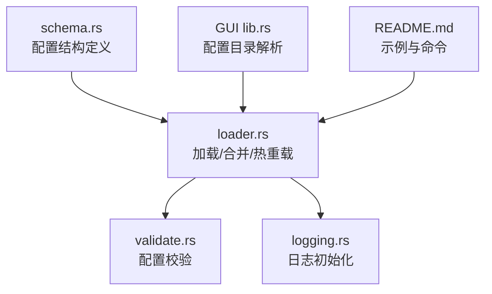
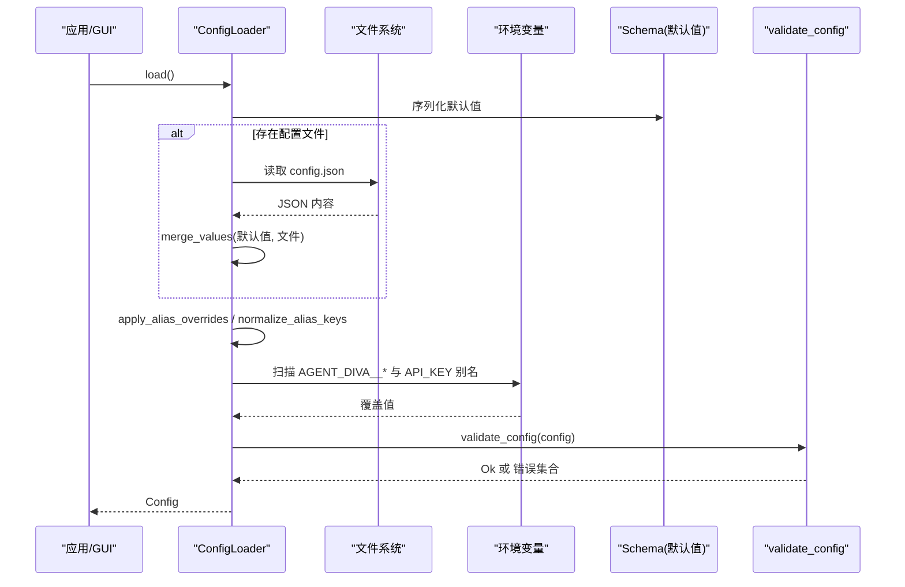
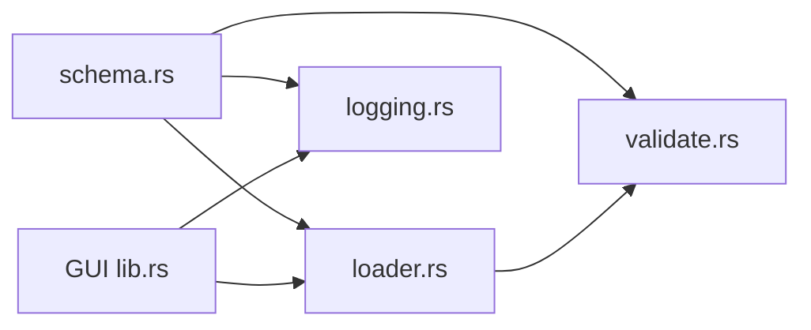

# 基础配置

<cite>
**本文引用的文件**
- [agent-diva-core/src/config/mod.rs](file://agent-diva-core/src/config/mod.rs)
- [agent-diva-core/src/config/schema.rs](file://agent-diva-core/src/config/schema.rs)
- [agent-diva-core/src/config/loader.rs](file://agent-diva-core/src/config/loader.rs)
- [agent-diva-core/src/config/validate.rs](file://agent-diva-core/src/config/validate.rs)
- [agent-diva-core/src/logging.rs](file://agent-diva-core/src/logging.rs)
- [agent-diva-gui/src-tauri/src/lib.rs](file://agent-diva-gui/src-tauri/src/lib.rs)
- [README.md](file://README.md)
</cite>

## 目录
1. [简介](#简介)
2. [项目结构](#项目结构)
3. [核心组件](#核心组件)
4. [架构总览](#架构总览)
5. [详细组件分析](#详细组件分析)
6. [依赖关系分析](#依赖关系分析)
7. [性能与运行时特性](#性能与运行时特性)
8. [故障排查指南](#故障排查指南)
9. [结论](#结论)
10. [附录：示例与用法](#附录示例与用法)

## 简介
本章节面向“基础配置”的完整说明，覆盖配置文件的基本结构、文件格式与加载机制；详解应用名称、版本信息、日志级别、工作目录等基础设置；解释配置文件的优先级顺序与环境变量覆盖规则；提供基础配置的示例文件和使用方法；并包含配置验证规则与常见错误处理。

## 项目结构
Agent Diva 的配置系统集中在 agent-diva-core 模块中，采用“模式定义 + 加载合并 + 校验”的分层设计：
- schema.rs：定义所有配置项的数据结构与默认值（如 agents、channels、providers、gateway、tools、memory、self_evolution、reports、logging、sandbox、mate）。
- loader.rs：负责从默认值、配置文件、环境变量进行合并，支持别名归一化、路径解析、热重载检测与差异计算。
- validate.rs：集中实现配置合法性校验（范围、必填、枚举值等）。
- logging.rs：基于 LoggingConfig 初始化日志系统，支持级别、格式、目录、保留天数与模块级覆盖。
- GUI 集成：GUI 通过环境变量 AGENT_DIVA_CONFIG_DIR 指定配置目录，并对相对路径进行展开与解析。

图表来源
- [agent-diva-core/src/config/schema.rs:278-309](file://agent-diva-core/src/config/schema.rs#L278-L309)
- [agent-diva-core/src/config/loader.rs:57-74](file://agent-diva-core/src/config/loader.rs#L57-L74)
- [agent-diva-core/src/config/validate.rs:5-99](file://agent-diva-core/src/config/validate.rs#L5-L99)
- [agent-diva-core/src/logging.rs:10-114](file://agent-diva-core/src/logging.rs#L10-L114)
- [agent-diva-gui/src-tauri/src/lib.rs:48-88](file://agent-diva-gui/src-tauri/src/lib.rs#L48-L88)
- [README.md:150-198](file://README.md#L150-L198)

章节来源
- [agent-diva-core/src/config/mod.rs:1-12](file://agent-diva-core/src/config/mod.rs#L1-L12)
- [agent-diva-core/src/config/schema.rs:278-309](file://agent-diva-core/src/config/schema.rs#L278-L309)
- [agent-diva-core/src/config/loader.rs:57-74](file://agent-diva-core/src/config/loader.rs#L57-L74)
- [agent-diva-core/src/config/validate.rs:5-99](file://agent-diva-core/src/config/validate.rs#L5-L99)
- [agent-diva-core/src/logging.rs:10-114](file://agent-diva-core/src/logging.rs#L10-L114)
- [agent-diva-gui/src-tauri/src/lib.rs:48-88](file://agent-diva-gui/src-tauri/src/lib.rs#L48-L88)
- [README.md:150-198](file://README.md#L150-L198)

## 核心组件
- 配置根对象 Config：聚合 agents、channels、providers、gateway、tools、memory、self_evolution、reports、logging、sandbox、mate 等子配置。
- 加载器 ConfigLoader：读取默认值、合并 JSON 配置文件、应用环境变量覆盖、别名归一化、路径解析、保存配置、热重载监听与差异计算。
- 校验器 validate_config：对关键字段进行范围、枚举、必填校验，返回聚合错误。
- 日志子系统 LoggingConfig：控制日志级别、格式、输出目录、模块覆盖、保留天数；启动时清理旧日志。
- GUI 配置入口：通过环境变量选择配置目录，并将相对日志目录解析为绝对路径。

章节来源
- [agent-diva-core/src/config/schema.rs:278-309](file://agent-diva-core/src/config/schema.rs#L278-L309)
- [agent-diva-core/src/config/loader.rs:12-172](file://agent-diva-core/src/config/loader.rs#L12-L172)
- [agent-diva-core/src/config/validate.rs:5-99](file://agent-diva-core/src/config/validate.rs#L5-L99)
- [agent-diva-core/src/logging.rs:10-114](file://agent-diva-core/src/logging.rs#L10-L114)
- [agent-diva-gui/src-tauri/src/lib.rs:48-88](file://agent-diva-gui/src-tauri/src/lib.rs#L48-L88)

## 架构总览
配置加载流程遵循“默认值 → 配置文件 → 环境变量覆盖 → 别名归一化 → 路径解析 → 校验”的顺序，最终生成可用的 Config 实例。

图表来源
- [agent-diva-core/src/config/loader.rs:57-74](file://agent-diva-core/src/config/loader.rs#L57-L74)
- [agent-diva-core/src/config/loader.rs:371-416](file://agent-diva-core/src/config/loader.rs#L371-L416)
- [agent-diva-core/src/config/validate.rs:5-99](file://agent-diva-core/src/config/validate.rs#L5-L99)

## 详细组件分析

### 配置结构与基础设置
- 应用名称与版本信息：当前代码库未暴露独立的“应用名称/版本”配置项；这些通常由构建产物或 CLI 元数据管理，不在运行时配置结构中。
- 工作目录：agents.defaults.workspace 用于指定 Agent 的工作区路径，支持用户主目录展开与相对路径解析。
- 日志级别与格式：logging.level、logging.format、logging.dir、logging.overrides、logging.retention_days 控制日志行为。
- 其他基础设置：如 providers、channels、tools、gateway、memory、self_evolution、reports、sandbox、mate 等均在 schema.rs 中定义，可按需启用与配置。

章节来源
- [agent-diva-core/src/config/schema.rs:278-309](file://agent-diva-core/src/config/schema.rs#L278-L309)
- [agent-diva-core/src/config/schema.rs:511-557](file://agent-diva-core/src/config/schema.rs#L511-L557)
- [agent-diva-core/src/config/schema.rs:560-603](file://agent-diva-core/src/config/schema.rs#L560-L603)

### 配置文件与加载机制
- 默认配置目录：~/.agent-diva，配置文件名为 config.json。
- 自定义目录：可通过环境变量 AGENT_DIVA_CONFIG_DIR 指定配置目录；GUI 会优先使用该变量。
- 加载顺序：
  1) 默认值（来自 schema）
  2) 配置文件（config.json）
  3) 环境变量覆盖：
     - 结构化覆盖：AGENT_DIVA__AGENTS__DEFAULTS__MODEL=...
     - 别名覆盖：OPENAI_API_KEY、ANTHROPIC_API_KEY 等映射到 providers.*.api_key
  4) 别名键归一化：如 channels.neuro-link/neuro_link/generic_pipe、tools.mcpServers/mcp_servers、top-level pet→mate
  5) 路径解析：相对路径相对于配置目录展开
  6) 校验：validate_config 检查合法性
- 热重载：ConfigLoader.start_hot_reload 每 5 秒轮询 mtime，去抖 500ms，比较新旧配置并分类 hot_reload/restart_required。

章节来源
- [agent-diva-core/src/config/loader.rs:19-74](file://agent-diva-core/src/config/loader.rs#L19-L74)
- [agent-diva-core/src/config/loader.rs:94-172](file://agent-diva-core/src/config/loader.rs#L94-L172)
- [agent-diva-core/src/config/loader.rs:371-416](file://agent-diva-core/src/config/loader.rs#L371-L416)
- [agent-diva-core/src/config/loader.rs:429-463](file://agent-diva-core/src/config/loader.rs#L429-L463)
- [agent-diva-gui/src-tauri/src/lib.rs:48-88](file://agent-diva-gui/src-tauri/src/lib.rs#L48-L88)

### 环境变量覆盖规则与优先级
- 优先级顺序（从高到低）：
  1) 环境变量 AGENT_DIVA__*（结构化路径覆盖）
  2) 环境变量别名（如 OPENAI_API_KEY）
  3) 配置文件 config.json
  4) 默认值（schema）
- 结构化环境变量命名：前缀 AGENT_DIVA__，下划线分隔层级，转小写后映射到 JSON 路径。例如 AGENT_DIVA__AGENTS__DEFAULTS__MODEL 对应 agents.defaults.model。
- 类型解析：字符串可尝试解析为 JSON、布尔、整数、浮点数，否则作为字符串。

章节来源
- [agent-diva-core/src/config/loader.rs:325-344](file://agent-diva-core/src/config/loader.rs#L325-L344)
- [agent-diva-core/src/config/loader.rs:371-416](file://agent-diva-core/src/config/loader.rs#L371-L416)
- [README.md:191-198](file://README.md#L191-L198)

### 日志配置与初始化
- 日志级别：logging.level，也可被 RUST_LOG 覆盖；支持模块级 overrides。
- 日志格式：logging.format（text/json），也可被 LOG_FORMAT 覆盖。
- 日志目录：logging.dir，GUI 会将相对路径解析为绝对路径（基于配置目录）。
- 保留策略：logging.retention_days 控制清理旧日志的天数；0 表示不清理。
- 初始化流程：init_logging_with_terminal_output 组装 filter、stdout/file layers，并执行旧日志清理。

章节来源
- [agent-diva-core/src/logging.rs:10-114](file://agent-diva-core/src/logging.rs#L10-L114)
- [agent-diva-gui/src-tauri/src/lib.rs:64-88](file://agent-diva-gui/src-tauri/src/lib.rs#L64-L88)

### 配置校验规则
- agents.defaults.workspace：非空
- agents.defaults.max_tokens：> 0
- agents.defaults.temperature：[0.0, 2.0]
- agents.defaults.max_tool_iterations：> 0
- agents.defaults.reasoning_effort：low/medium/high（可选）
- tools.mcp_servers：每个服务器必须提供 command（stdio）或 url（http）之一
- tools.web.search.provider：仅支持 brave/bocha/zhipu；max_results 根据 provider 限制不同上限
- mate.asr_provider：web_speech/siliconflow（可选）
- mate.tts_provider：browser/openai/siliconflow/minimax（可选）
- mate.tts_speed：> 0
- mate.tts_volume：[0.0, 2.0]
- reports.llm_curation：timeout_secs/max_input_tokens/max_output_tokens > 0，fallback 必须为 deterministic

章节来源
- [agent-diva-core/src/config/validate.rs:5-99](file://agent-diva-core/src/config/validate.rs#L5-L99)

### 热重载与差异分类
- 热重载字段（无需重启即可生效）：agents.defaults.model/temperature/max_tool_iterations/reasoning_effort、tools.budget/exec.timeout/web.search.enabled、sandbox.mode/approval_policy、logging.level。
- 其余字段变更需要重启进程才能生效。

章节来源
- [agent-diva-core/src/config/loader.rs:214-239](file://agent-diva-core/src/config/loader.rs#L214-L239)

## 依赖关系分析
- schema.rs 提供所有配置结构体与默认值，是 loader.rs 与 validate.rs 的基础。
- loader.rs 依赖 schema.rs 的 Config 类型，调用 validate.rs 进行校验，并在 GUI 中被引用以解析配置目录与日志路径。
- logging.rs 依赖 schema.rs 的 LoggingConfig，在应用启动时初始化日志系统。
- GUI lib.rs 通过 ConfigLoader 读取配置，并将相对日志目录解析为绝对路径。

图表来源
- [agent-diva-core/src/config/schema.rs:278-309](file://agent-diva-core/src/config/schema.rs#L278-L309)
- [agent-diva-core/src/config/loader.rs:57-74](file://agent-diva-core/src/config/loader.rs#L57-L74)
- [agent-diva-core/src/config/validate.rs:5-99](file://agent-diva-core/src/config/validate.rs#L5-L99)
- [agent-diva-core/src/logging.rs:10-114](file://agent-diva-core/src/logging.rs#L10-L114)
- [agent-diva-gui/src-tauri/src/lib.rs:48-88](file://agent-diva-gui/src-tauri/src/lib.rs#L48-L88)

## 性能与运行时特性
- 热重载轮询间隔：5 秒；检测到 mtime 变化后去抖 500ms，避免频繁重读。
- 日志清理：启动时按 retention_days 清理旧日志，减少磁盘占用。
- 环境变量解析：支持 JSON/布尔/数值自动解析，减少配置复杂度。

章节来源
- [agent-diva-core/src/config/loader.rs:94-172](file://agent-diva-core/src/config/loader.rs#L94-L172)
- [agent-diva-core/src/logging.rs:108-163](file://agent-diva-core/src/logging.rs#L108-L163)

## 故障排查指南
- 配置校验失败：查看 validate_config 返回的错误集合，常见包括 workspace 为空、max_tokens 为 0、temperature 超出范围、reasoning_effort 非法、MCP 服务器未配置传输、搜索 provider 不支持、max_results 越界、TTS/ASR provider 非法、tts_speed/tts_volume 越界、reports.llm_curation 参数非法。
- 环境变量未生效：确认是否使用了正确的 AGENT_DIVA__* 前缀与层级；检查别名变量名是否正确；注意结构化覆盖优先级高于别名与文件。
- 日志目录无效：GUI 会将相对路径解析为绝对路径；若仍无法写入，检查权限与磁盘空间。
- 热重载不生效：确认变更字段是否在热重载白名单内；否则需要重启进程。

章节来源
- [agent-diva-core/src/config/validate.rs:5-99](file://agent-diva-core/src/config/validate.rs#L5-L99)
- [agent-diva-core/src/config/loader.rs:214-239](file://agent-diva-core/src/config/loader.rs#L214-L239)
- [agent-diva-core/src/logging.rs:108-163](file://agent-diva-core/src/logging.rs#L108-L163)

## 结论
Agent Diva 的基础配置系统以 schema 为中心，结合 loader 的合并与校验能力，提供了灵活且安全的配置管理。通过环境变量覆盖、别名归一化、路径解析与热重载，既满足开发调试的便捷性，也保障生产环境的稳定性。建议在生产环境中使用环境变量注入敏感信息，并通过 validate_config 确保配置正确性。

## 附录：示例与用法
- 默认配置文件位置：~/.agent-diva/config.json
- 最小可用配置：至少配置一个 provider 与 agents.defaults.provider/model
- 常用命令：
  - 初始化或刷新配置与工作区模板：agent-diva onboard、agent-diva config refresh
  - 查看实例路径：agent-diva config path
  - 校验与诊断：agent-diva --config <path> config validate、agent-diva --config <path> config doctor
- 环境变量示例：
  - AGENT_DIVA__AGENTS__DEFAULTS__MODEL=...
  - OPENAI_API_KEY=...
  - ANTHROPIC_API_KEY=...

章节来源
- [README.md:150-198](file://README.md#L150-L198)