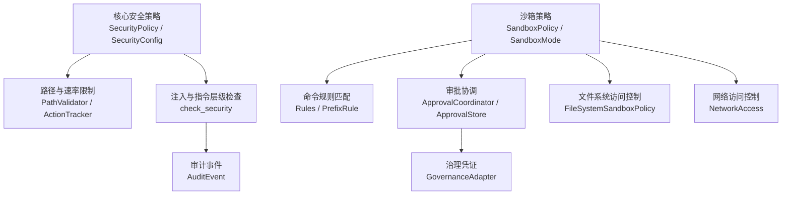
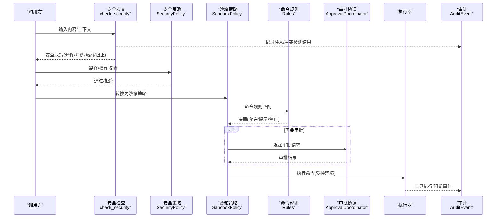
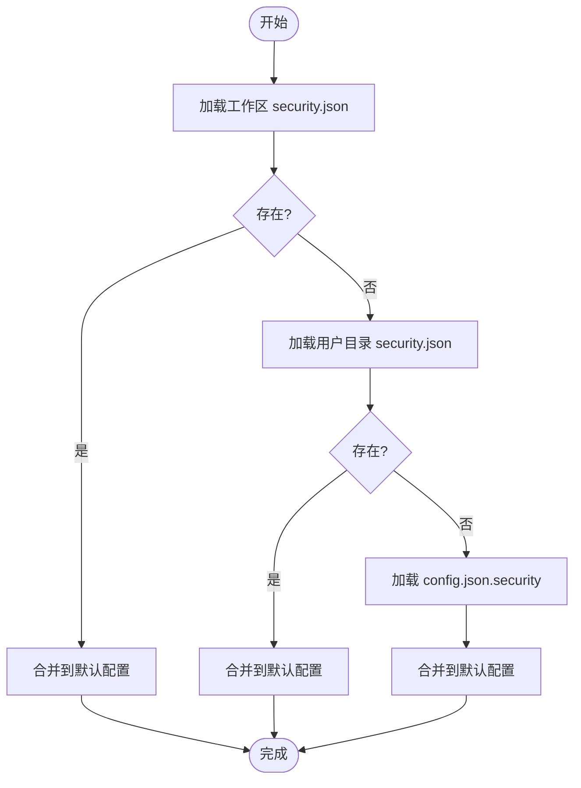
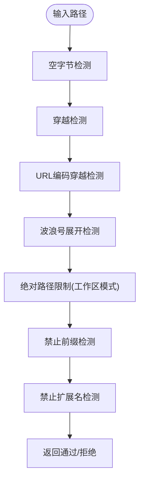
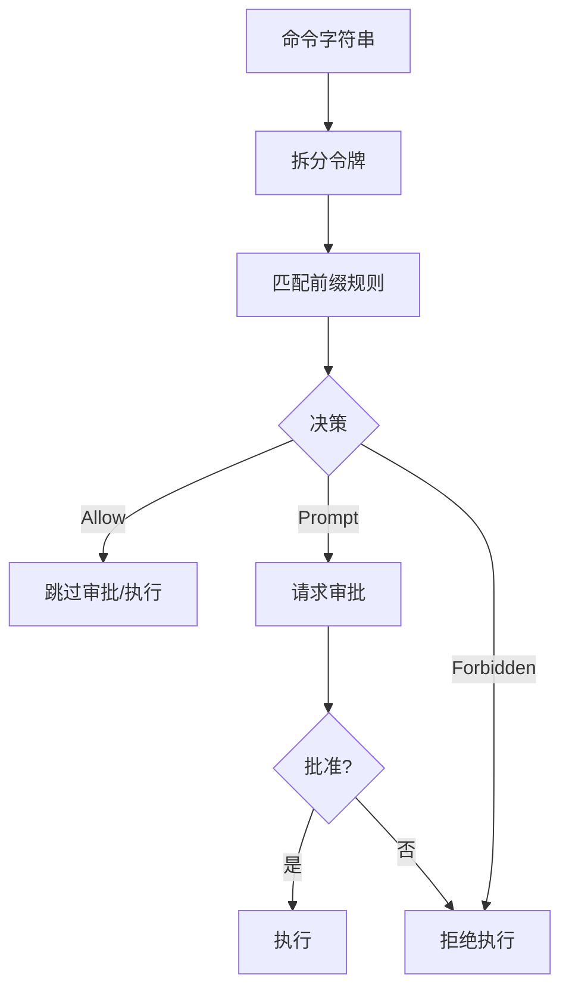
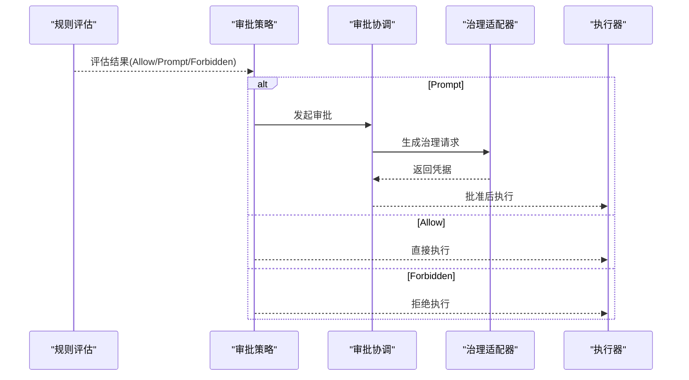
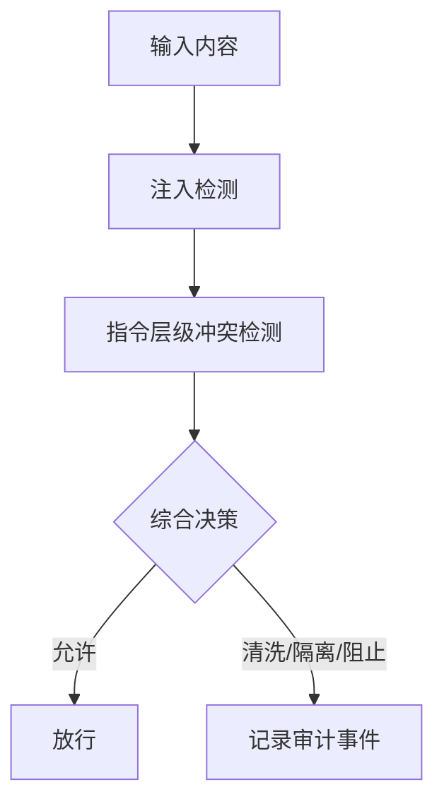
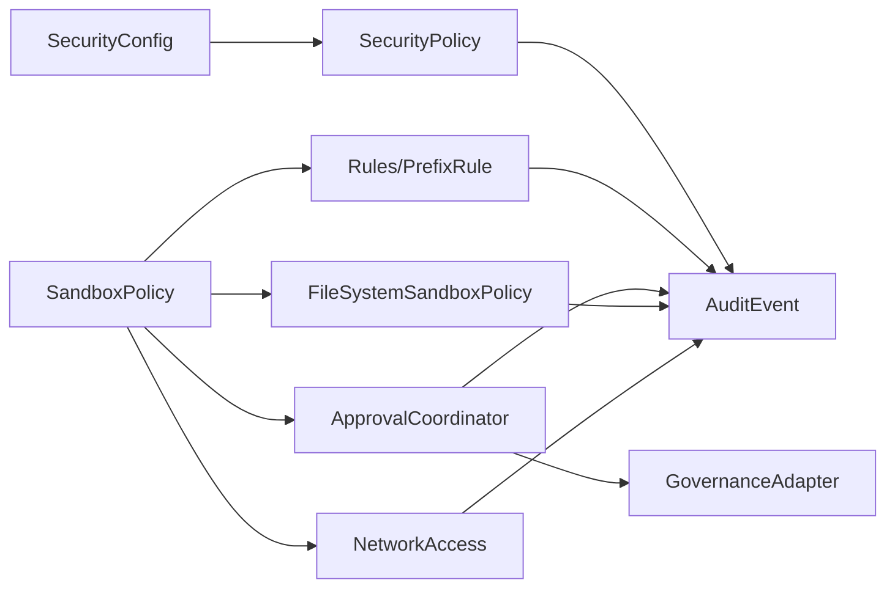

# 安全配置

<cite>
**本文引用的文件**
- [agent-diva-core/src/security/config.rs](file://agent-diva-core/src/security/config.rs)
- [agent-diva-core/src/security/policy.rs](file://agent-diva-core/src/security/policy.rs)
- [agent-diva-core/src/security/check.rs](file://agent-diva-core/src/security/check.rs)
- [agent-diva-core/src/audit.rs](file://agent-diva-core/src/audit.rs)
- [agent-diva-sandbox/src/lib.rs](file://agent-diva-sandbox/src/lib.rs)
- [agent-diva-sandbox/src/policy.rs](file://agent-diva-sandbox/src/policy.rs)
- [agent-diva-sandbox/src/command_rules.rs](file://agent-diva-sandbox/src/command_rules.rs)
- [agent-diva-sandbox/src/rules.rs](file://agent-diva-sandbox/src/rules.rs)
- [agent-diva-sandbox/src/exec_policy.rs](file://agent-diva-sandbox/src/exec_policy.rs)
- [agent-diva-sandbox/src/approval.rs](file://agent-diva-sandbox/src/approval.rs)
- [agent-diva-sandbox/src/governance_adapter.rs](file://agent-diva-sandbox/src/governance_adapter.rs)
</cite>

## 目录
1. [简介](#简介)
2. [项目结构](#项目结构)
3. [核心组件](#核心组件)
4. [架构总览](#架构总览)
5. [详细组件分析](#详细组件分析)
6. [依赖关系分析](#依赖关系分析)
7. [性能考虑](#性能考虑)
8. [故障排查指南](#故障排查指南)
9. [结论](#结论)
10. [附录：不同安全级别配置示例](#附录：不同安全级别配置示例)

## 简介
本文件面向“安全配置”主题，系统化说明 Agent Diva 的安全策略配置结构与执行机制。内容覆盖沙箱规则、权限控制、访问限制、审批流程、命令白名单、文件系统访问控制、审计日志与违规检测，以及安全策略的动态更新与热重载机制。文档同时提供不同安全级别的配置示例，帮助读者快速落地实践。

## 项目结构
安全能力由两大模块协同实现：
- 核心安全策略（agent-diva-core）：负责安全配置加载、路径校验、速率限制、注入检测、PII 处理、指令层级冲突检测等。
- 沙箱执行（agent-diva-sandbox）：负责命令执行的隔离、规则匹配、审批协调、文件系统访问控制、网络访问控制、平台级隔离等。



图表来源
- [agent-diva-core/src/security/config.rs:51-128](file://agent-diva-core/src/security/config.rs#L51-L128)
- [agent-diva-core/src/security/policy.rs:14-66](file://agent-diva-core/src/security/policy.rs#L14-L66)
- [agent-diva-core/src/security/check.rs:15-117](file://agent-diva-core/src/security/check.rs#L15-L117)
- [agent-diva-sandbox/src/policy.rs:9-144](file://agent-diva-sandbox/src/policy.rs#L9-L144)
- [agent-diva-sandbox/src/rules.rs:10-182](file://agent-diva-sandbox/src/rules.rs#L10-L182)
- [agent-diva-sandbox/src/approval.rs:41-85](file://agent-diva-sandbox/src/approval.rs#L41-L85)
- [agent-diva-sandbox/src/governance_adapter.rs:35-68](file://agent-diva-sandbox/src/governance_adapter.rs#L35-L68)

章节来源
- [agent-diva-core/src/security/config.rs:51-128](file://agent-diva-core/src/security/config.rs#L51-L128)
- [agent-diva-core/src/security/policy.rs:14-66](file://agent-diva-core/src/security/policy.rs#L14-L66)
- [agent-diva-sandbox/src/policy.rs:9-144](file://agent-diva-sandbox/src/policy.rs#L9-L144)

## 核心组件
- 安全配置与安全级别
  - 提供四种预设级别：宽松、标准、严格、偏执（只读）。每个级别自带默认动作上限、是否工作区限制、是否只读等。
  - 支持从工作区或用户目录的 JSON 配置文件动态加载预算与超时等运行时覆盖项。
- 统一安全策略
  - 聚合配置、路径校验、速率限制、文件大小限制、读写模式判断等。
  - 提供多层路径安全检查（空字节、穿越、URL编码穿越、波浪号展开、绝对路径限制、禁止前缀、禁止扩展名），并在工作区内解析与校验。
- 沙箱策略与模式
  - 定义危险全开放、只读、工作区可写、外部沙箱等策略；支持网络访问开关、额外可写根目录、临时目录环境变量排除等。
  - 提供与核心安全策略的双向转换，便于上层以统一视角管理。
- 命令规则与白名单
  - 基于前缀匹配的 TOML 规则文件，支持 allow/prompt/forbidden 决策。
  - 持久化命令规则存储，支持添加建议、启用/禁用、删除，带版本与审计。
- 审批流程
  - 根据规则评估结果决定是否需要审批、是否允许跳过沙箱、或直接拒绝。
  - 与治理适配器对接，生成可追踪的审批凭据。
- 审计与违规检测
  - 统一的审计事件输出，包含注入检测、指令冲突、消息阻断、工具调用、技能加载等。
  - 注入检测与指令层级冲突检测在入口处统一收敛为“允许/清洗/隔离/阻止”决策。

章节来源
- [agent-diva-core/src/security/config.rs:11-178](file://agent-diva-core/src/security/config.rs#L11-L178)
- [agent-diva-core/src/security/policy.rs:74-287](file://agent-diva-core/src/security/policy.rs#L74-L287)
- [agent-diva-sandbox/src/policy.rs:9-144](file://agent-diva-sandbox/src/policy.rs#L9-L144)
- [agent-diva-sandbox/src/command_rules.rs:23-216](file://agent-diva-sandbox/src/command_rules.rs#L23-L216)
- [agent-diva-sandbox/src/rules.rs:10-182](file://agent-diva-sandbox/src/rules.rs#L10-L182)
- [agent-diva-sandbox/src/approval.rs:41-85](file://agent-diva-sandbox/src/approval.rs#L41-L85)
- [agent-diva-core/src/audit.rs:15-222](file://agent-diva-core/src/audit.rs#L15-L222)

## 架构总览
安全策略的执行链路如下：
- 入口：统一安全检查（注入检测 + 指令层级冲突）→ 产出安全决策。
- 策略层：SecurityPolicy 对路径与操作进行校验与限速；SandboxPolicy 将策略映射到具体执行约束。
- 规则层：命令规则匹配决定是否允许、提示或禁止；必要时进入审批流程。
- 执行层：沙箱管理器按策略执行命令，结合文件系统与网络访问控制。
- 审计层：关键节点发出结构化审计事件，供 GUI/CLI 消费。



图表来源
- [agent-diva-core/src/security/check.rs:15-117](file://agent-diva-core/src/security/check.rs#L15-L117)
- [agent-diva-core/src/security/policy.rs:74-287](file://agent-diva-core/src/security/policy.rs#L74-L287)
- [agent-diva-sandbox/src/policy.rs:64-144](file://agent-diva-sandbox/src/policy.rs#L64-L144)
- [agent-diva-sandbox/src/rules.rs:119-182](file://agent-diva-sandbox/src/rules.rs#L119-L182)
- [agent-diva-sandbox/src/exec_policy.rs:277-306](file://agent-diva-sandbox/src/exec_policy.rs#L277-L306)
- [agent-diva-core/src/audit.rs:224-253](file://agent-diva-core/src/audit.rs#L224-L253)

## 详细组件分析

### 安全配置与安全级别
- 安全级别
  - 宽松：默认不限制工作区，动作上限较高，适合开发调试。
  - 标准：默认限制工作区，中等动作上限。
  - 严格：更严格的动作上限与工作区限制。
  - 偏执：只读模式，禁止写入。
- 配置项要点
  - 工作区限制、禁止路径/扩展名、允许根目录、最大文件大小、符号链接策略。
  - PII 检测开关与严重级别、注入检测开关与阻断阈值。
  - 全局工具超时、会话/任务级 Token 预算、拒绝熔断窗口与阈值。
- 配置加载与合并
  - 优先从工作区 .agent-diva/security.json 加载，其次用户目录 security.json，最后回退到 config.json 的 security 嵌套段。
  - 支持 merge 覆盖非默认值，确保最小侵入式配置。



图表来源
- [agent-diva-core/src/security/config.rs:181-231](file://agent-diva-core/src/security/config.rs#L181-L231)

章节来源
- [agent-diva-core/src/security/config.rs:11-178](file://agent-diva-core/src/security/config.rs#L11-L178)
- [agent-diva-core/src/security/config.rs:181-324](file://agent-diva-core/src/security/config.rs#L181-L324)

### 统一安全策略（路径校验与速率限制）
- 路径校验七层防护
  - 空字节、穿越、URL编码穿越、波浪号展开、绝对路径限制、禁止前缀、禁止扩展名。
- 解析与范围校验
  - 相对路径解析到工作区，绝对路径直接校验；支持额外允许根目录。
  - 符号链接策略可控；写入前校验父目录并创建必要目录。
- 速率限制与读写模式
  - 按小时动作计数，超过阈值拒绝；只读模式直接拒绝写操作。
  - 文件大小限制与全局工具超时保护。



图表来源
- [agent-diva-core/src/security/policy.rs:74-137](file://agent-diva-core/src/security/policy.rs#L74-L137)

章节来源
- [agent-diva-core/src/security/policy.rs:74-287](file://agent-diva-core/src/security/policy.rs#L74-L287)

### 沙箱策略与执行模式
- 策略类型
  - 危险全开放：无限制，仅用于可信环境。
  - 只读：仅读取，可选全磁盘或自定义路径。
  - 工作区可写：默认工作区可写，可配置额外可写根目录。
  - 外部沙箱：进程已在容器等外部环境中运行。
- 网络访问控制
  - 通过 NetworkAccess 枚举控制出站网络访问。
- 与核心策略互转
  - 将 SandboxPolicy 转为 SecurityPolicy，或将 SecurityPolicy 转为 SandboxPolicy，便于跨层复用。

```mermaid
classDiagram
class SandboxPolicy {
+DangerFullAccess
+ReadOnly{access, network_access}
+WorkspaceWrite{writable_roots, read_only_access, network_access, exclude_tmpdir_env_var}
+ExternalSandbox{network_access}
+to_security_policy(workspace_dir) SecurityPolicy
}
class SecurityPolicy {
+config() SecurityConfig
+workspace_dir() PathBuf
+is_read_only() bool
+to_sandbox_policy() SandboxPolicy
}
SandboxPolicy --> SecurityPolicy : "转换"
SecurityPolicy --> SandboxPolicy : "转换"
```

图表来源
- [agent-diva-sandbox/src/policy.rs:9-144](file://agent-diva-sandbox/src/policy.rs#L9-L144)
- [agent-diva-sandbox/src/policy.rs:230-283](file://agent-diva-sandbox/src/policy.rs#L230-L283)

章节来源
- [agent-diva-sandbox/src/policy.rs:9-144](file://agent-diva-sandbox/src/policy.rs#L9-L144)
- [agent-diva-sandbox/src/policy.rs:230-283](file://agent-diva-sandbox/src/policy.rs#L230-L283)

### 命令规则与白名单
- 规则模型
  - 前缀规则：匹配命令的前几个参数，支持 allow/prompt/forbidden 决策。
  - 策略容器：提供匹配与评估方法，支持多命令聚合评估。
- 持久化规则存储
  - 支持添加建议、启用/禁用、删除；使用原子替换保证一致性；变更触发审计事件。
  - 兼容旧版规则格式，自动迁移。
- 安全建议生成
  - 保守地识别只读且安全的命令模式（如 git/cargo/rustc 的版本/状态查询）。



图表来源
- [agent-diva-sandbox/src/rules.rs:50-182](file://agent-diva-sandbox/src/rules.rs#L50-L182)
- [agent-diva-sandbox/src/command_rules.rs:109-216](file://agent-diva-sandbox/src/command_rules.rs#L109-L216)
- [agent-diva-sandbox/src/exec_policy.rs:277-306](file://agent-diva-sandbox/src/exec_policy.rs#L277-L306)

章节来源
- [agent-diva-sandbox/src/rules.rs:10-182](file://agent-diva-sandbox/src/rules.rs#L10-L182)
- [agent-diva-sandbox/src/command_rules.rs:23-216](file://agent-diva-sandbox/src/command_rules.rs#L23-L216)
- [agent-diva-sandbox/src/exec_policy.rs:277-306](file://agent-diva-sandbox/src/exec_policy.rs#L277-L306)

### 审批流程与治理集成
- 审批需求判定
  - 根据规则评估结果与审批策略（从不/失败后/LLM请求/非信任命令）决定是否需要审批。
- 审批键与缓存
  - 以命令和工作目录为键，缓存审批结果以提升性能。
- 治理凭证
  - 将审批请求适配为治理请求，生成可追溯的审批凭据，关联工作区、会话、资源边界与风险等级。



图表来源
- [agent-diva-sandbox/src/exec_policy.rs:277-306](file://agent-diva-sandbox/src/exec_policy.rs#L277-L306)
- [agent-diva-sandbox/src/approval.rs:41-85](file://agent-diva-sandbox/src/approval.rs#L41-L85)
- [agent-diva-sandbox/src/governance_adapter.rs:35-68](file://agent-diva-sandbox/src/governance_adapter.rs#L35-L68)

章节来源
- [agent-diva-sandbox/src/exec_policy.rs:277-306](file://agent-diva-sandbox/src/exec_policy.rs#L277-L306)
- [agent-diva-sandbox/src/approval.rs:41-85](file://agent-diva-sandbox/src/approval.rs#L41-L85)
- [agent-diva-sandbox/src/governance_adapter.rs:35-68](file://agent-diva-sandbox/src/governance_adapter.rs#L35-L68)

### 文件系统访问控制
- 工作区限制与允许根
  - 默认限制在工作区内，可通过 allowed_roots 扩展允许根。
- 符号链接控制
  - 可配置是否跟随符号链接，避免绕过工作区限制。
- 父目录校验与创建
  - 写入前校验父目录并创建必要目录，确保路径解析后的安全性。

章节来源
- [agent-diva-core/src/security/policy.rs:139-233](file://agent-diva-core/src/security/policy.rs#L139-L233)

### 注入检测与指令层级冲突
- 注入检测
  - 针对用户输入与工具输出分别采用不同上下文进行检测，识别越狱、角色覆盖、工具输出注入等。
- 指令层级冲突
  - 对用户输入与工具输出进行层级冲突检测，发现冲突时记录审计并阻止。
- 统一决策
  - 将多种发现汇总为最终决策（允许/清洗/隔离/阻止），并输出审计事件。



图表来源
- [agent-diva-core/src/security/check.rs:15-117](file://agent-diva-core/src/security/check.rs#L15-L117)

章节来源
- [agent-diva-core/src/security/check.rs:15-117](file://agent-diva-core/src/security/check.rs#L15-L117)

### 审计日志与违规检测
- 审计事件
  - 统一通过 audit::emit 输出结构化 JSON 行，目标为 "audit"，便于 GUI/CLI 过滤消费。
  - 涵盖注入检测、指令冲突、消息阻断、工具调用、技能加载/拒绝/隔离、渠道认证失败、安全策略决策等。
- 违规检测
  - 注入检测与指令冲突检测在入口处统一收敛，产生阻断与审计。
  - 命令规则与审批策略共同构成违规拦截点。

章节来源
- [agent-diva-core/src/audit.rs:15-222](file://agent-diva-core/src/audit.rs#L15-L222)
- [agent-diva-core/src/security/check.rs:119-149](file://agent-diva-core/src/security/check.rs#L119-L149)
- [agent-diva-sandbox/src/command_rules.rs:210-216](file://agent-diva-sandbox/src/command_rules.rs#L210-L216)

### 动态更新与热重载机制
- 配置热重载
  - 安全配置支持从工作区与用户目录的 JSON 文件加载，并在启动或运行时按需合并覆盖，无需重启即可生效。
- 命令规则热更新
  - 命令规则存储支持原子替换文件，更新后立即生效；变更触发审计事件。
- 沙箱开关
  - 通过环境变量可完全禁用沙箱（仅用于可信环境），便于调试与回归测试。

章节来源
- [agent-diva-core/src/security/config.rs:181-231](file://agent-diva-core/src/security/config.rs#L181-L231)
- [agent-diva-sandbox/src/command_rules.rs:188-216](file://agent-diva-sandbox/src/command_rules.rs#L188-L216)
- [agent-diva-sandbox/src/lib.rs:107-115](file://agent-diva-sandbox/src/lib.rs#L107-L115)

## 依赖关系分析
- 核心安全策略依赖
  - 配置加载（JSON）、路径校验、速率限制、审计事件。
- 沙箱策略依赖
  - 命令规则匹配、审批协调、治理适配器、文件系统与网络访问控制。
- 审计系统
  - 所有关键节点均输出审计事件，形成可观测性闭环。



图表来源
- [agent-diva-core/src/security/config.rs:51-128](file://agent-diva-core/src/security/config.rs#L51-L128)
- [agent-diva-core/src/security/policy.rs:14-66](file://agent-diva-core/src/security/policy.rs#L14-L66)
- [agent-diva-sandbox/src/policy.rs:9-144](file://agent-diva-sandbox/src/policy.rs#L9-L144)
- [agent-diva-sandbox/src/rules.rs:10-182](file://agent-diva-sandbox/src/rules.rs#L10-L182)
- [agent-diva-sandbox/src/approval.rs:41-85](file://agent-diva-sandbox/src/approval.rs#L41-L85)
- [agent-diva-sandbox/src/governance_adapter.rs:35-68](file://agent-diva-sandbox/src/governance_adapter.rs#L35-L68)
- [agent-diva-core/src/audit.rs:224-253](file://agent-diva-core/src/audit.rs#L224-L253)

章节来源
- [agent-diva-core/src/security/config.rs:51-128](file://agent-diva-core/src/security/config.rs#L51-L128)
- [agent-diva-core/src/security/policy.rs:14-66](file://agent-diva-core/src/security/policy.rs#L14-L66)
- [agent-diva-sandbox/src/policy.rs:9-144](file://agent-diva-sandbox/src/policy.rs#L9-L144)
- [agent-diva-sandbox/src/rules.rs:10-182](file://agent-diva-sandbox/src/rules.rs#L10-L182)
- [agent-diva-sandbox/src/approval.rs:41-85](file://agent-diva-sandbox/src/approval.rs#L41-L85)
- [agent-diva-sandbox/src/governance_adapter.rs:35-68](file://agent-diva-sandbox/src/governance_adapter.rs#L35-L68)
- [agent-diva-core/src/audit.rs:224-253](file://agent-diva-core/src/audit.rs#L224-L253)

## 性能考虑
- 配置加载与合并
  - 优先从工作区加载，减少重复 IO；合并逻辑仅覆盖非默认值，降低开销。
- 路径校验
  - 多层前置检查尽早拒绝非法路径，避免后续昂贵操作。
- 速率限制
  - 滑动窗口计数，避免频繁 GC；合理设置每小时动作上限。
- 规则匹配
  - 前缀匹配高效；多命令评估聚合决策，减少多次遍历。
- 审计事件
  - 低开销输出，失败不影响主流程；适合高吞吐场景。

[本节提供通用指导，不直接分析具体文件]

## 故障排查指南
- 常见错误与定位
  - 路径非法：检查空字节、穿越、URL编码穿越、波浪号展开、绝对路径限制、禁止前缀/扩展名。
  - 速率超限：调整 max_actions_per_hour 或优化批量操作。
  - 只读模式：确认 read_only 与 SecurityLevel，避免误配。
  - 注入检测阻断：调整 injection_block_threshold 或优化输入内容。
  - 规则命中拒绝：检查 rules 文件中的 forbidden 规则与审批策略。
- 审计事件分析
  - 关注 target="audit" 的日志，筛选 SecurityPolicyDecision、MessageBlocked、ToolDenied 等事件。
  - 结合注入检测与指令冲突事件，定位问题根因。

章节来源
- [agent-diva-core/src/security/policy.rs:74-287](file://agent-diva-core/src/security/policy.rs#L74-L287)
- [agent-diva-core/src/security/check.rs:15-117](file://agent-diva-core/src/security/check.rs#L15-L117)
- [agent-diva-core/src/audit.rs:224-253](file://agent-diva-core/src/audit.rs#L224-L253)

## 结论
Agent Diva 的安全体系以“配置驱动 + 规则匹配 + 审批协调 + 审计可观测”为核心，提供从路径校验、速率限制、注入检测到命令执行隔离的全链路安全保障。通过灵活的安全级别、可热重载的配置与规则、以及与治理系统的深度集成，既能满足开发调试的便利性，也能在生产环境实现强约束与可审计。

[本节总结性内容，不直接分析具体文件]

## 附录：不同安全级别配置示例
以下为不同安全级别的典型配置要点（以字段含义为主，避免直接粘贴代码内容）：
- 宽松（Permissive）
  - 工作区限制：关闭
  - 动作上限：较高
  - 只读：关闭
  - 适用场景：本地开发、可信环境
- 标准（Standard，默认）
  - 工作区限制：开启
  - 动作上限：中等
  - 只读：关闭
  - 适用场景：日常开发、团队协作
- 严格（Strict）
  - 工作区限制：开启
  - 动作上限：较低
  - 只读：关闭
  - 适用场景：敏感项目、合规要求较高
- 偏执（Paranoid）
  - 工作区限制：开启
  - 动作上限：很低
  - 只读：开启
  - 适用场景：生产预览、只读审计

配置加载优先级（从高到低）：
- 工作区 .agent-diva/security.json
- 用户目录 .agent-diva/security.json
- 用户目录 .agent-diva/config.json 的 security 嵌套段

命令白名单建议：
- 仅允许只读且安全的命令模式（如 git/cargo/rustc 的版本/状态查询）
- 使用持久化规则存储，原子替换确保一致性，并记录审计事件

审批策略建议：
- 默认“失败后请求”或“非信任命令请求”，避免过度打扰
- 结合治理适配器，生成可追溯的审批凭据

[本节提供概念性示例，不直接分析具体文件]