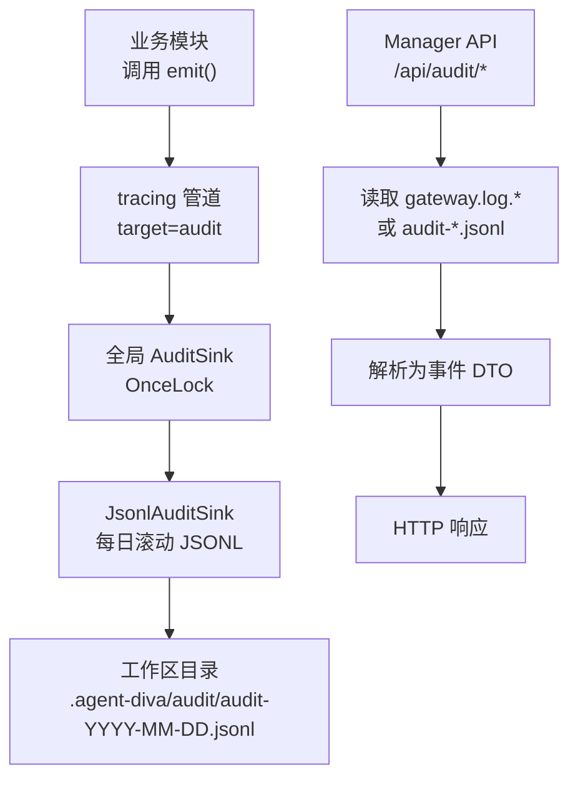
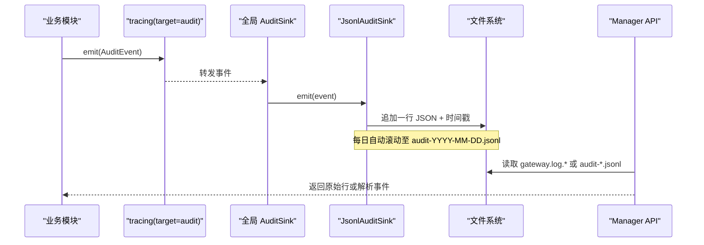
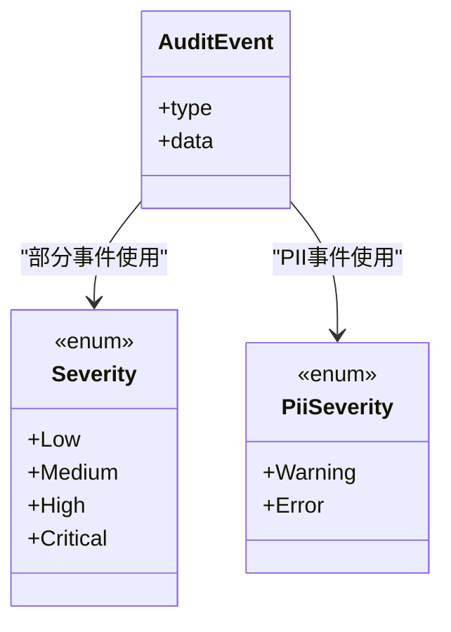
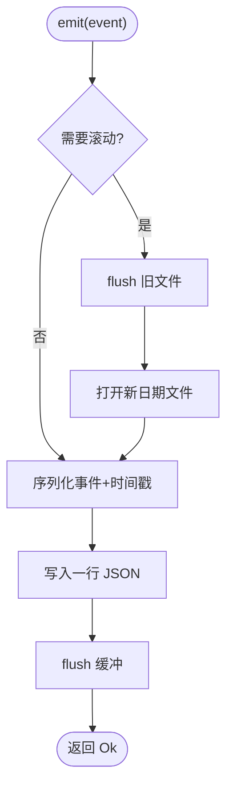
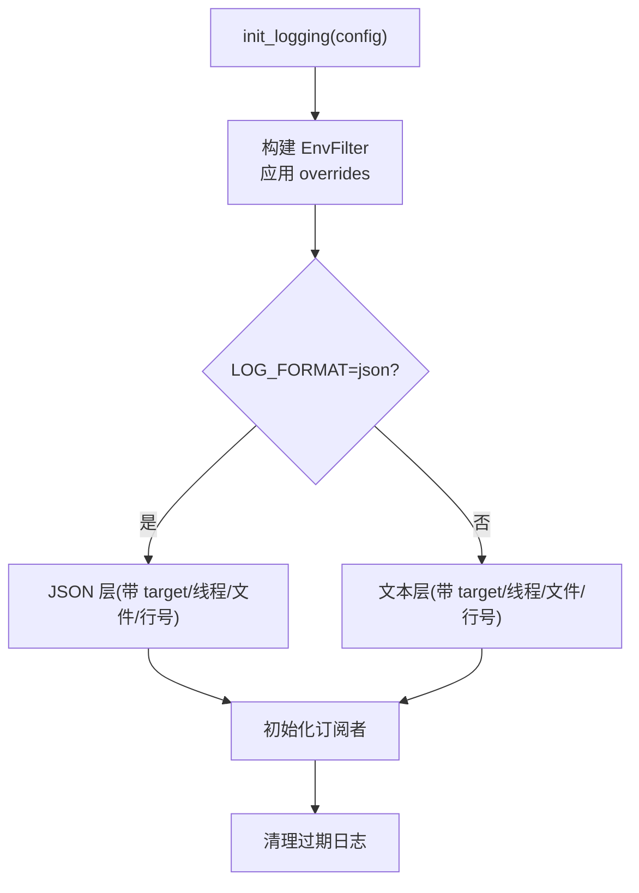
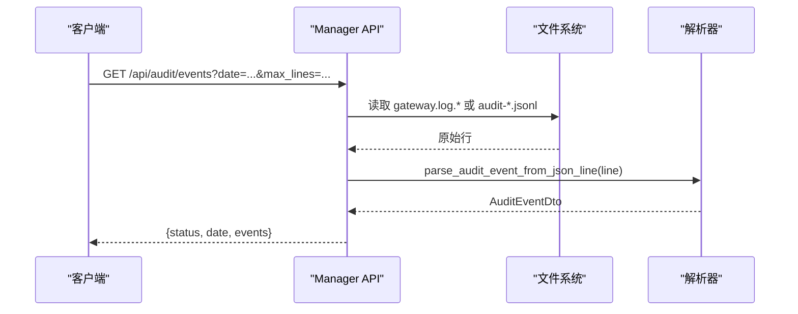
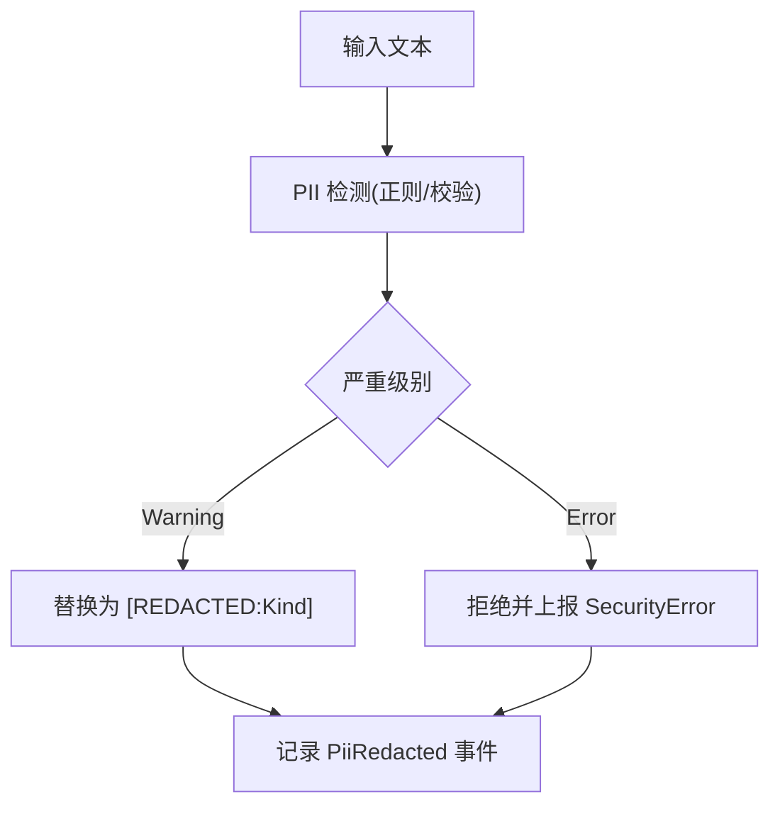
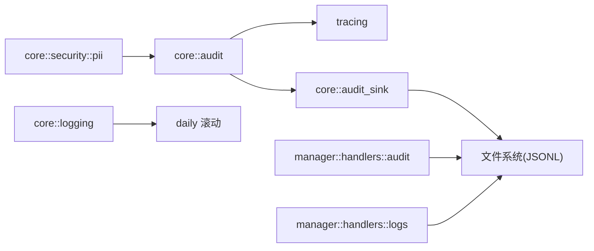

# 审计日志系统

<cite>
**本文引用的文件**
- [audit.rs](file://agent-diva-core/src/audit.rs)
- [audit_sink.rs](file://agent-diva-core/src/audit_sink.rs)
- [audit_parse.rs](file://agent-diva-core/src/audit_parse.rs)
- [logging.rs](file://agent-diva-core/src/logging.rs)
- [schema.rs](file://agent-diva-core/src/config/schema.rs)
- [audit.rs（管理器API）](file://agent-diva-manager/src/handlers/audit.rs)
- [logs.rs（管理器日志查询）](file://agent-diva-manager/src/handlers/logs.rs)
- [pii.rs](file://agent-diva-core/src/security/pii.rs)
</cite>

## 目录
1. [简介](#简介)
2. [项目结构](#项目结构)
3. [核心组件](#核心组件)
4. [架构总览](#架构总览)
5. [详细组件分析](#详细组件分析)
6. [依赖关系分析](#依赖关系分析)
7. [性能考量](#性能考量)
8. [故障排查指南](#故障排查指南)
9. [结论](#结论)
10. [附录](#附录)

## 简介
本文件系统化说明 Agent-Diva 的审计日志体系，覆盖记录机制、存储格式、事件类型、级别与过滤、输出目标、日志轮转与归档、敏感信息脱敏与隐私保护，以及日志分析与查询方式。该体系通过结构化事件与可插拔后端，将安全事件、操作审计、访问日志等统一纳入可观测性管道，并提供 HTTP API 供 GUI/CLI 消费。

## 项目结构
审计日志相关代码主要分布在 core 与 manager 两个模块：
- core 提供事件模型、全局 sink、JSONL 落盘、解析器与日志初始化/清理
- manager 暴露 HTTP 接口读取日志并返回原始行或已解析事件

图表来源
- [audit.rs:224-253](file://agent-diva-core/src/audit.rs#L224-L253)
- [audit_sink.rs:65-94](file://agent-diva-core/src/audit_sink.rs#L65-L94)
- [audit_sink.rs:145-257](file://agent-diva-core/src/audit_sink.rs#L145-L257)
- [audit.rs（管理器API）:131-185](file://agent-diva-manager/src/handlers/audit.rs#L131-L185)
- [logs.rs:115-297](file://agent-diva-manager/src/handlers/logs.rs#L115-L297)

章节来源
- [audit.rs:224-253](file://agent-diva-core/src/audit.rs#L224-L253)
- [audit_sink.rs:65-94](file://agent-diva-core/src/audit_sink.rs#L65-L94)
- [audit_sink.rs:145-257](file://agent-diva-core/src/audit_sink.rs#L145-L257)
- [audit.rs（管理器API）:131-185](file://agent-diva-manager/src/handlers/audit.rs#L131-L185)
- [logs.rs:115-297](file://agent-diva-manager/src/handlers/logs.rs#L115-L297)

## 核心组件
- 事件模型与发射：定义所有可审计事件类型、严重级别，并通过 tracing target="audit" 统一发射。
- 全局 Sink：单例注册，支持文件、内存、网络等多种后端；默认实现为按日滚动的 JSONL 写入器。
- 日志初始化与保留：基于 tracing_appender 的 daily 滚动，支持文本/JSON 格式、模块级级别覆盖、过期清理。
- 解析器：统一解析两种日志格式（结构化 tracing JSON 与直接 tagged enum），兼容历史差异。
- Manager API：提供 /api/audit/log 与 /api/audit/events 读取 gateway.log 中的审计行，或扫描 audit-*.jsonl 进行分页查询。

章节来源
- [audit.rs:15-222](file://agent-diva-core/src/audit.rs#L15-L222)
- [audit_sink.rs:59-94](file://agent-diva-core/src/audit_sink.rs#L59-L94)
- [logging.rs:10-114](file://agent-diva-core/src/logging.rs#L10-L114)
- [audit_parse.rs:23-90](file://agent-diva-core/src/audit_parse.rs#L23-L90)
- [audit.rs（管理器API）:131-185](file://agent-diva-manager/src/handlers/audit.rs#L131-L185)
- [logs.rs:115-297](file://agent-diva-manager/src/handlers/logs.rs#L115-L297)

## 架构总览
审计事件从业务侧统一进入 tracing 管道，随后由全局 sink 分发到具体后端。默认后端以 JSON Lines 形式按日滚动写入工作区目录；Manager 提供 HTTP 接口读取日志并返回原始行或解析后的事件。

图表来源
- [audit.rs:224-253](file://agent-diva-core/src/audit.rs#L224-L253)
- [audit_sink.rs:145-257](file://agent-diva-core/src/audit_sink.rs#L145-L257)
- [audit.rs（管理器API）:131-185](file://agent-diva-manager/src/handlers/audit.rs#L131-L185)
- [logs.rs:115-297](file://agent-diva-manager/src/handlers/logs.rs#L115-L297)

## 详细组件分析

### 事件模型与记录机制
- 事件类型：涵盖心跳、工具调用/拒绝、决策点、注入检测、PII 脱敏、令牌使用、推理接收、会话结束、存在状态变化、监督运行生命周期、消息拦截、指令冲突、工具输出清洗、技能加载/拒绝/隔离/上传/删除/注入阻断、通道认证失败/消息拦截、安全策略决策、定时任务开始/完成/失败、提供者调用完成、工具执行、用量缺失回退等。
- 严重级别：安全事件使用 Severity（低/中/高/危急），PII 使用 PiiSeverity（警告/错误）。
- 记录路径：emit() 通过 tracing info! 写入 target="audit"，随后尝试调用已注册的全局 sink；sink 错误被吞掉，确保不影响业务逻辑。

图表来源
- [audit.rs:15-222](file://agent-diva-core/src/audit.rs#L15-L222)

章节来源
- [audit.rs:15-222](file://agent-diva-core/src/audit.rs#L15-L222)
- [audit.rs:224-253](file://agent-diva-core/src/audit.rs#L224-L253)

### 全局 Sink 与 JSONL 落盘
- 全局注册：OnceLock 保证仅注册一次；提供 register_sink/get_sink。
- 默认后端：JsonlAuditSink 将每个事件序列化为 JSON 行，追加写入 audit-YYYY-MM-DD.jsonl，并在日期变更时滚动；写入前插入 RFC3339 时间戳。
- 健壮性：序列化/IO/锁失败均记录错误但不抛给调用方，避免影响主流程。

图表来源
- [audit_sink.rs:145-257](file://agent-diva-core/src/audit_sink.rs#L145-L257)

章节来源
- [audit_sink.rs:59-94](file://agent-diva-core/src/audit_sink.rs#L59-L94)
- [audit_sink.rs:145-257](file://agent-diva-core/src/audit_sink.rs#L145-L257)

### 日志初始化、级别与过滤
- 级别与格式：支持环境变量 RUST_LOG 与 LOG_FORMAT 覆盖；支持 text/json 输出；支持模块级 overrides。
- 文件输出：使用 tracing_appender::rolling::daily 生成 gateway.log.YYYY-MM-DD；可选终端输出。
- 保留策略：启动时清理超过 retention_days 的日志文件；retention_days=0 表示永久保留。

图表来源
- [logging.rs:10-114](file://agent-diva-core/src/logging.rs#L10-L114)
- [schema.rs:511-557](file://agent-diva-core/src/config/schema.rs#L511-L557)

章节来源
- [logging.rs:10-114](file://agent-diva-core/src/logging.rs#L10-L114)
- [schema.rs:511-557](file://agent-diva-core/src/config/schema.rs#L511-L557)

### 解析器与查询语法
- 解析器能力：支持结构化 tracing JSON（fields.event/message）与直接 tagged enum 格式；未知事件降级为 unknown，并保留原始内容。
- Manager API：
  - GET /api/audit/log?date=YYYY-MM-DD&max_lines=200：返回指定日期的原始行（仅 target=audit 的行）。
  - GET /api/audit/events?date=YYYY-MM-DD&max_lines=200：返回解析后的事件列表。
- 日志查询（扩展）：/api/logs 支持对 audit-*.jsonl 的扫描与分页，支持时间范围与事件类型过滤，返回 next_cursor。

图表来源
- [audit.rs（管理器API）:131-185](file://agent-diva-manager/src/handlers/audit.rs#L131-L185)
- [audit_parse.rs:23-90](file://agent-diva-core/src/audit_parse.rs#L23-L90)
- [logs.rs:115-297](file://agent-diva-manager/src/handlers/logs.rs#L115-L297)

章节来源
- [audit_parse.rs:23-90](file://agent-diva-core/src/audit_parse.rs#L23-L90)
- [audit.rs（管理器API）:131-185](file://agent-diva-manager/src/handlers/audit.rs#L131-L185)
- [logs.rs:115-297](file://agent-diva-manager/src/handlers/logs.rs#L115-L297)

### 安全事件、操作审计、访问日志
- 安全事件：注入检测、消息拦截、指令冲突、通道认证失败/消息拦截、安全策略决策等，均携带 severity 或 reason。
- 操作审计：工具调用/拒绝/执行、技能加载/拒绝/隔离/上传/删除/注入阻断、监督运行生命周期、定时任务执行等。
- 访问日志：可通过 target=audit 过滤获取；Manager 提供 raw lines 与 parsed events 两种视图。

章节来源
- [audit.rs:33-222](file://agent-diva-core/src/audit.rs#L33-L222)
- [audit.rs（管理器API）:116-185](file://agent-diva-manager/src/handlers/audit.rs#L116-L185)

### 日志级别、过滤规则与输出目标配置
- 级别：RUST_LOG 或 LoggingConfig.level；可按模块设置 overrides。
- 格式：LOG_FORMAT=text|json；影响 stdout 与文件层的输出格式。
- 输出目标：stdout（可选）、文件（daily 滚动）；同时支持自定义 AuditSink（如网络传输）。
- 保留：LoggingConfig.retention_days 控制过期清理。

章节来源
- [logging.rs:10-114](file://agent-diva-core/src/logging.rs#L10-L114)
- [schema.rs:511-557](file://agent-diva-core/src/config/schema.rs#L511-L557)

### 日志轮转、压缩与归档策略
- 轮转：gateway.log 使用 daily 滚动；audit 事件使用 JsonlAuditSink 按日滚动至 audit-YYYY-MM-DD.jsonl。
- 压缩：当前未内置压缩；可在外部通过 cron/systemd 对旧日志进行压缩。
- 归档：建议结合外部工具将历史日志归档至对象存储或冷存储；retention_days 用于本地清理。

章节来源
- [logging.rs:41-48](file://agent-diva-core/src/logging.rs#L41-L48)
- [audit_sink.rs:145-223](file://agent-diva-core/src/audit_sink.rs#L145-L223)
- [logging.rs:108-163](file://agent-diva-core/src/logging.rs#L108-L163)

### 敏感信息脱敏与隐私保护措施
- PII 检测与脱敏：支持邮箱、电话、中国身份证、信用卡、API Key、IP、护照、银行卡等类别；默认关闭运行时替换以避免误伤业务标识；开启后可按类别设置严重级别（警告替换、错误拒绝）。
- 审计事件：PII 脱敏会触发 PiiRedacted 事件，包含类别、严重级别与数量。
- 工具输出清洗：工具结果可能因可疑内容被清洗，并记录 ToolOutputSanitized。

图表来源
- [pii.rs:1-109](file://agent-diva-core/src/security/pii.rs#L1-L109)
- [audit.rs:61-65](file://agent-diva-core/src/audit.rs#L61-L65)

章节来源
- [pii.rs:1-109](file://agent-diva-core/src/security/pii.rs#L1-L109)
- [audit.rs:61-65](file://agent-diva-core/src/audit.rs#L61-L65)

## 依赖关系分析
- core::audit 依赖 tracing 进行事件发射，并可选择性地调用全局 AuditSink。
- core::audit_sink 提供可插拔后端，默认实现为 JSONL 文件写入。
- core::logging 负责日志子系统初始化、格式、滚动与清理。
- manager::handlers::audit 读取 gateway.log 并解析审计事件；manager::handlers::logs 扫描 audit-*.jsonl 提供分页查询。
- core::security::pii 在运行时进行敏感信息检测与脱敏，并产出审计事件。

图表来源
- [audit.rs:224-253](file://agent-diva-core/src/audit.rs#L224-L253)
- [audit_sink.rs:145-257](file://agent-diva-core/src/audit_sink.rs#L145-L257)
- [logging.rs:41-48](file://agent-diva-core/src/logging.rs#L41-L48)
- [audit.rs（管理器API）:131-185](file://agent-diva-manager/src/handlers/audit.rs#L131-L185)
- [logs.rs:115-297](file://agent-diva-manager/src/handlers/logs.rs#L115-L297)
- [pii.rs:1-109](file://agent-diva-core/src/security/pii.rs#L1-L109)

章节来源
- [audit.rs:224-253](file://agent-diva-core/src/audit.rs#L224-L253)
- [audit_sink.rs:145-257](file://agent-diva-core/src/audit_sink.rs#L145-L257)
- [logging.rs:41-48](file://agent-diva-core/src/logging.rs#L41-L48)
- [audit.rs（管理器API）:131-185](file://agent-diva-manager/src/handlers/audit.rs#L131-L185)
- [logs.rs:115-297](file://agent-diva-manager/src/handlers/logs.rs#L115-L297)
- [pii.rs:1-109](file://agent-diva-core/src/security/pii.rs#L1-L109)

## 性能考量
- 事件发射：emit() 设计为低开销，目标 <1ms；tracing 基础设施高效，序列化仅在 sink 路径发生。
- 并发安全：sink 内部使用 Mutex 保护 writer 与 current_date；错误不传播，避免阻塞主流程。
- 文件 IO：每日滚动减少单文件大小；写入后立即 flush，便于同进程读者实时观察。
- 解析与查询：Manager 端按需过滤 target=audit 并限制 max_lines；分页查询通过 cursor 提升大日志处理效率。

章节来源
- [audit.rs:224-253](file://agent-diva-core/src/audit.rs#L224-L253)
- [audit_sink.rs:145-257](file://agent-diva-core/src/audit_sink.rs#L145-L257)
- [audit.rs（管理器API）:131-185](file://agent-diva-manager/src/handlers/audit.rs#L131-L185)
- [logs.rs:115-297](file://agent-diva-manager/src/handlers/logs.rs#L115-L297)

## 故障排查指南
- 无法写入审计日志：检查 sink 是否已注册；确认工作区目录权限；查看 tracing 错误日志（roll/write/flush 失败会被记录）。
- 日志未滚动：确认时钟/日期变更；检查 writer_factory 是否成功打开新文件。
- 解析不到事件：确认日志格式为 structured 或 direct；检查 timestamp 字段是否存在；未知事件将被标记为 unknown。
- 日志过多：调整 retention_days；必要时引入外部压缩与归档策略。
- PII 误伤：默认关闭运行时替换；如需启用，请谨慎配置 category_severity 与 enabled。

章节来源
- [audit_sink.rs:145-257](file://agent-diva-core/src/audit_sink.rs#L145-L257)
- [audit_parse.rs:23-90](file://agent-diva-core/src/audit_parse.rs#L23-L90)
- [logging.rs:108-163](file://agent-diva-core/src/logging.rs#L108-L163)
- [pii.rs:1-109](file://agent-diva-core/src/security/pii.rs#L1-L109)

## 结论
Agent-Diva 的审计日志系统以结构化事件为核心，通过 tracing 统一发射，并以可插拔 sink 实现灵活的后端扩展。默认 JSONL 按日滚动，配合 Manager 提供的 HTTP API，满足安全事件、操作审计与访问日志的统一采集、查询与分析需求。结合 PII 检测与脱敏、日志级别与过滤、保留策略，形成完整的安全可观测闭环。

## 附录

### 配置项速查
- 日志级别：RUST_LOG 或 LoggingConfig.level
- 日志格式：LOG_FORMAT=text|json
- 日志目录：LoggingConfig.dir
- 模块覆盖：LoggingConfig.overrides
- 保留天数：LoggingConfig.retention_days（0=永久）
- 审计目录：workspace_audit_dir -> .agent-diva/audit

章节来源
- [logging.rs:10-114](file://agent-diva-core/src/logging.rs#L10-L114)
- [schema.rs:511-557](file://agent-diva-core/src/config/schema.rs#L511-L557)
- [audit_sink.rs:80-94](file://agent-diva-core/src/audit_sink.rs#L80-L94)

### API 参考
- GET /api/audit/log?date=YYYY-MM-DD&max_lines=200：返回原始行
- GET /api/audit/events?date=YYYY-MM-DD&max_lines=200：返回解析事件
- GET /api/logs：扫描 audit-*.jsonl，支持时间范围与事件类型过滤，返回 next_cursor

章节来源
- [audit.rs（管理器API）:131-185](file://agent-diva-manager/src/handlers/audit.rs#L131-L185)
- [logs.rs:115-297](file://agent-diva-manager/src/handlers/logs.rs#L115-L297)