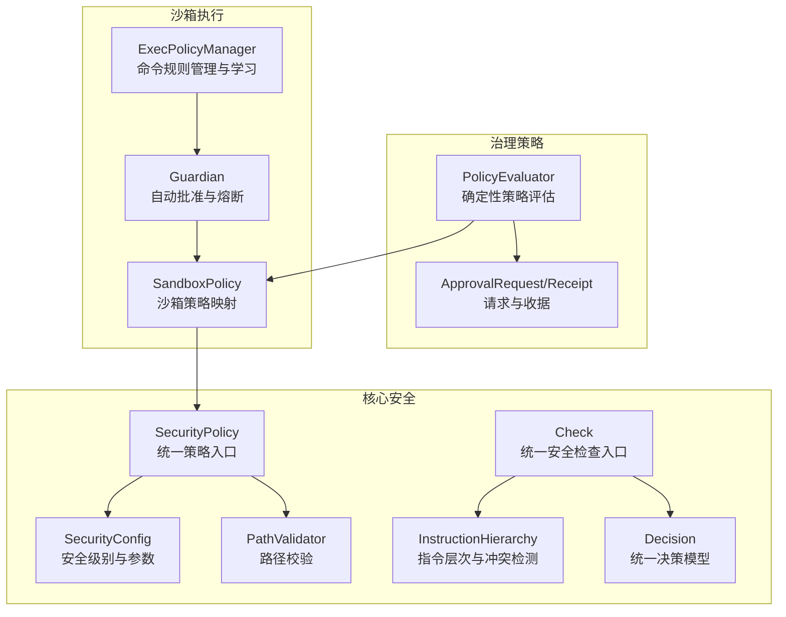
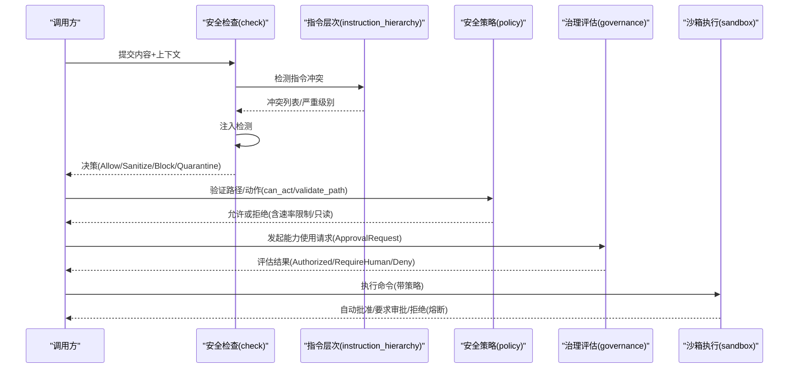
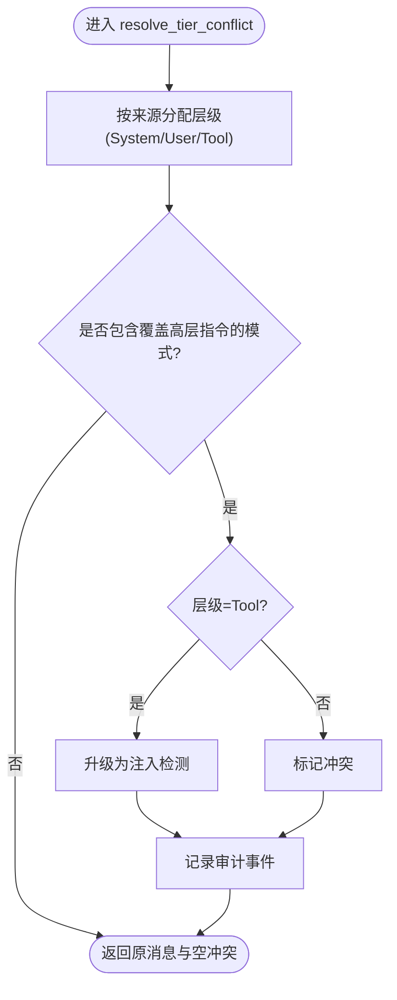
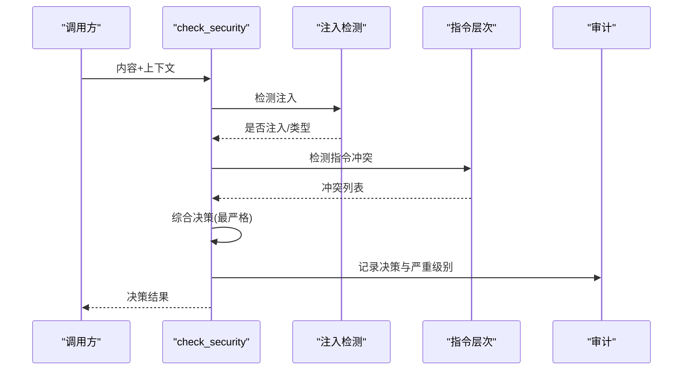
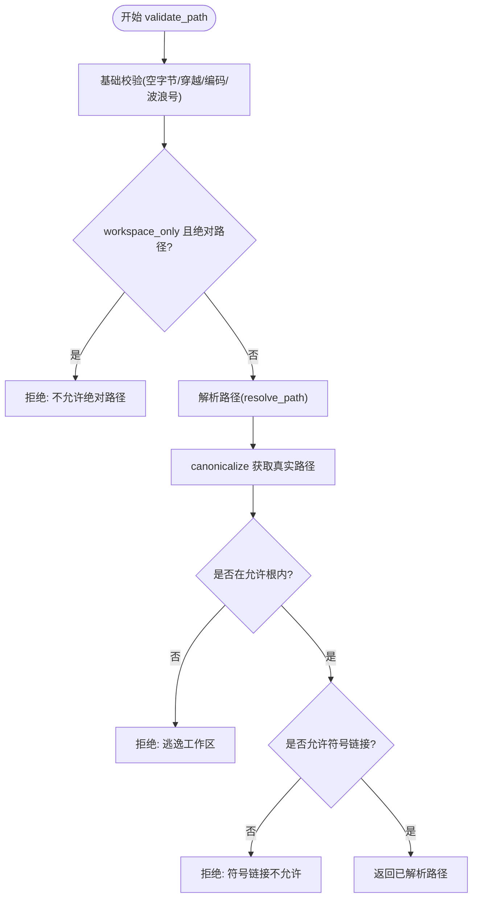
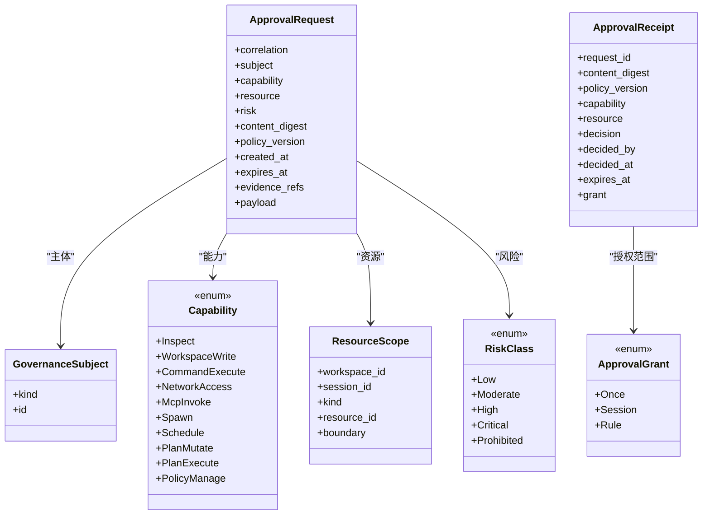
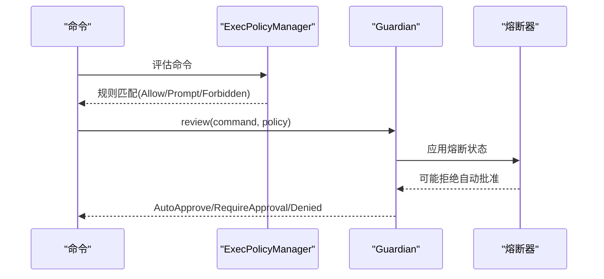
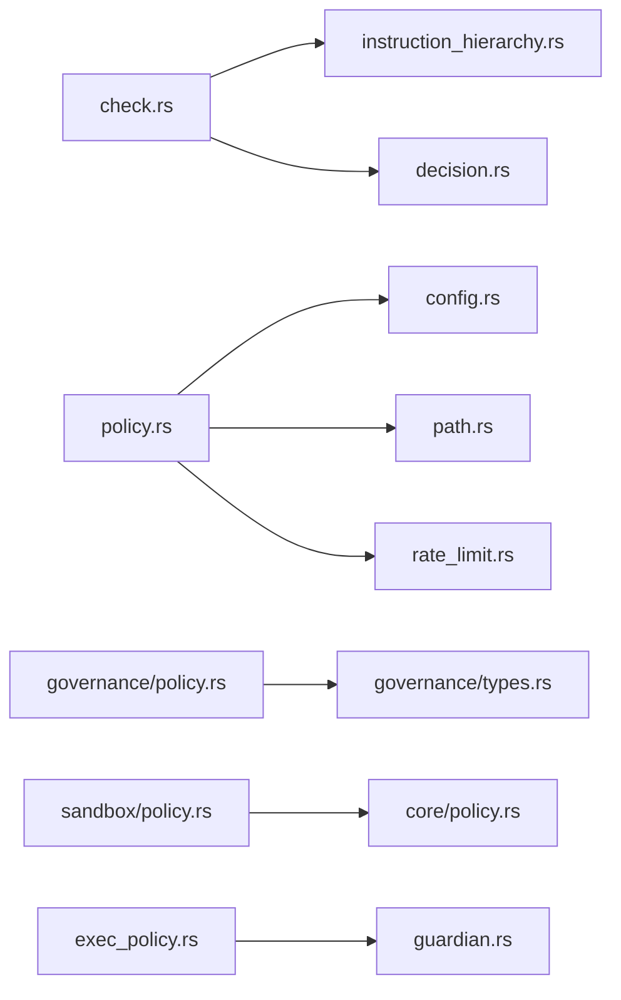

# 权限控制系统

<cite>
**本文引用的文件**
- [agent-diva-core/src/security/mod.rs](file://agent-diva-core/src/security/mod.rs)
- [agent-diva-core/src/security/policy.rs](file://agent-diva-core/src/security/policy.rs)
- [agent-diva-core/src/security/config.rs](file://agent-diva-core/src/security/config.rs)
- [agent-diva-core/src/security/check.rs](file://agent-diva-core/src/security/check.rs)
- [agent-diva-core/src/security/decision.rs](file://agent-diva-core/src/security/decision.rs)
- [agent-diva-core/src/security/instruction_hierarchy.rs](file://agent-diva-core/src/security/instruction_hierarchy.rs)
- [agent-diva-sandbox/src/guardian.rs](file://agent-diva-sandbox/src/guardian.rs)
- [agent-diva-sandbox/src/policy.rs](file://agent-diva-sandbox/src/policy.rs)
- [agent-diva-sandbox/src/exec_policy.rs](file://agent-diva-sandbox/src/exec_policy.rs)
- [agent-diva-core/src/governance/types.rs](file://agent-diva-core/src/governance/types.rs)
- [agent-diva-core/src/governance/policy.rs](file://agent-diva-core/src/governance/policy.rs)
</cite>

## 目录
1. [简介](#简介)
2. [项目结构](#项目结构)
3. [核心组件](#核心组件)
4. [架构总览](#架构总览)
5. [详细组件分析](#详细组件分析)
6. [依赖关系分析](#依赖关系分析)
7. [性能与可扩展性](#性能与可扩展性)
8. [故障排查指南](#故障排查指南)
9. [结论](#结论)
10. [附录：配置示例与常见场景](#附录：配置示例与常见场景)

## 简介
本权限控制系统围绕“最小权限、可审计、可拒绝”的原则，提供统一的策略与执行边界。系统通过以下机制实现：
- 指令层次与注入防护：对消息来源进行分层（系统/用户/工具），检测并阻止低层内容覆盖高层指令。
- 资源访问控制：基于工作区根路径、允许根、禁止路径/扩展名、符号链接等限制，确保文件系统操作在受控范围内。
- 操作授权与审批：命令执行、网络访问、计划变更等能力需经治理策略评估，支持一次性、会话级、规则级临时授权。
- 动态调整与学习：沙箱执行策略可自动学习安全命令白名单；安全级别与预算可运行时合并覆盖。
- 拒绝处理与审计：所有拒绝与敏感发现均记录审计事件，便于追踪与合规。

## 项目结构
权限相关代码主要分布在 core 的安全模块与治理模块，以及 sandbox 的执行策略与守护审查器：
- agent-diva-core/security：统一安全策略、配置、路径校验、注入检测、指令层次、决策模型。
- agent-diva-core/governance：跨域通用的请求/收据/策略评估，定义能力、资源、风险等级与授权生命周期。
- agent-diva-sandbox：沙箱策略、命令规则管理、自动批准与熔断保护。

**图表来源**
- [agent-diva-core/src/security/policy.rs:14-297](file://agent-diva-core/src/security/policy.rs#L14-L297)
- [agent-diva-core/src/security/config.rs:11-178](file://agent-diva-core/src/security/config.rs#L11-L178)
- [agent-diva-core/src/security/instruction_hierarchy.rs:45-132](file://agent-diva-core/src/security/instruction_hierarchy.rs#L45-L132)
- [agent-diva-core/src/security/check.rs:15-117](file://agent-diva-core/src/security/check.rs#L15-L117)
- [agent-diva-core/src/security/decision.rs:12-76](file://agent-diva-core/src/security/decision.rs#L12-L76)
- [agent-diva-core/src/governance/types.rs:27-161](file://agent-diva-core/src/governance/types.rs#L27-L161)
- [agent-diva-core/src/governance/policy.rs:98-205](file://agent-diva-core/src/governance/policy.rs#L98-L205)
- [agent-diva-sandbox/src/policy.rs:64-108](file://agent-diva-sandbox/src/policy.rs#L64-L108)
- [agent-diva-sandbox/src/exec_policy.rs:165-386](file://agent-diva-sandbox/src/exec_policy.rs#L165-L386)
- [agent-diva-sandbox/src/guardian.rs:25-141](file://agent-diva-sandbox/src/guardian.rs#L25-L141)

**章节来源**
- [agent-diva-core/src/security/mod.rs:1-69](file://agent-diva-core/src/security/mod.rs#L1-L69)

## 核心组件
- 统一安全策略 SecurityPolicy：聚合配置、路径校验、速率限制与工作区约束，提供 is_path_allowed、validate_path、can_act 等方法。
- 安全配置 SecurityConfig：定义安全级别（宽松/标准/严格/偏执）、工作区隔离、禁止路径/扩展、文件大小上限、PII/注入开关、超时与预算、拒绝熔断窗口等。
- 指令层次与冲突检测：将消息标记为 System/User/Tool 层级，扫描覆盖高层指令的模式，必要时升级至注入检测并记录审计。
- 统一决策模型 SecurityDecision：Allow/Sanitize/Block/Quarantine，附带发现项与严重级别，供上层统一处理。
- 治理策略评估：以 ApprovalRequest/ApprovalReceipt 为载体，依据能力-资源匹配、风险等级、自主级别与授权范围，输出 Allow/Deny/RequireHuman。
- 沙箱策略与命令规则：将 SandboxPolicy 映射到 SecurityPolicy，并通过 ExecPolicyManager 加载/评估/学习命令规则，结合 Guardian 实现自动批准与熔断。

**章节来源**
- [agent-diva-core/src/security/policy.rs:14-297](file://agent-diva-core/src/security/policy.rs#L14-L297)
- [agent-diva-core/src/security/config.rs:11-178](file://agent-diva-core/src/security/config.rs#L11-L178)
- [agent-diva-core/src/security/instruction_hierarchy.rs:45-132](file://agent-diva-core/src/security/instruction_hierarchy.rs#L45-L132)
- [agent-diva-core/src/security/decision.rs:12-76](file://agent-diva-core/src/security/decision.rs#L12-L76)
- [agent-diva-core/src/governance/types.rs:27-161](file://agent-diva-core/src/governance/types.rs#L27-L161)
- [agent-diva-core/src/governance/policy.rs:98-205](file://agent-diva-core/src/governance/policy.rs#L98-L205)
- [agent-diva-sandbox/src/policy.rs:64-108](file://agent-diva-sandbox/src/policy.rs#L64-L108)
- [agent-diva-sandbox/src/exec_policy.rs:165-386](file://agent-diva-sandbox/src/exec_policy.rs#L165-L386)
- [agent-diva-sandbox/src/guardian.rs:25-141](file://agent-diva-sandbox/src/guardian.rs#L25-L141)

## 架构总览
权限控制由三层组成：
- 输入侧安全：注入检测 + 指令层次冲突检测，产出统一决策。
- 资源与执行边界：SecurityPolicy 约束路径、读写模式、速率限制；SandboxPolicy 映射到具体执行环境限制。
- 治理与审批：ApprovalRequest/Receipt 承载能力与资源边界，PolicyEvaluator 给出确定性结果；Guardian 负责命令执行的自动批准与熔断。

**图表来源**
- [agent-diva-core/src/security/check.rs:15-117](file://agent-diva-core/src/security/check.rs#L15-L117)
- [agent-diva-core/src/security/instruction_hierarchy.rs:201-267](file://agent-diva-core/src/security/instruction_hierarchy.rs#L201-L267)
- [agent-diva-core/src/security/policy.rs:74-273](file://agent-diva-core/src/security/policy.rs#L74-L273)
- [agent-diva-core/src/governance/policy.rs:98-205](file://agent-diva-core/src/governance/policy.rs#L98-L205)
- [agent-diva-sandbox/src/guardian.rs:375-467](file://agent-diva-sandbox/src/guardian.rs#L375-L467)

## 详细组件分析

### 指令层次与冲突检测
- 层级划分：System(最高) > User > Tool(最低)。
- 冲突检测：扫描低层消息中试图覆盖高层指令的模式（如忽略系统提示、替换指令等）。
- 处理方式：User 层冲突标记，Tool 层冲突升级为注入检测；同时发出审计事件。

**图表来源**
- [agent-diva-core/src/security/instruction_hierarchy.rs:109-132](file://agent-diva-core/src/security/instruction_hierarchy.rs#L109-L132)
- [agent-diva-core/src/security/instruction_hierarchy.rs:201-267](file://agent-diva-core/src/security/instruction_hierarchy.rs#L201-L267)

**章节来源**
- [agent-diva-core/src/security/instruction_hierarchy.rs:45-132](file://agent-diva-core/src/security/instruction_hierarchy.rs#L45-L132)
- [agent-diva-core/src/security/instruction_hierarchy.rs:201-267](file://agent-diva-core/src/security/instruction_hierarchy.rs#L201-L267)

### 统一安全检查入口
- 流程：先做注入检测，再做指令层次冲突检测，最后根据最严格发现决定 Allow/Sanitize/Block/Quarantine。
- 审计：对 Block 与 Sanitize 决策发出审计事件，便于追踪。

**图表来源**
- [agent-diva-core/src/security/check.rs:15-117](file://agent-diva-core/src/security/check.rs#L15-L117)
- [agent-diva-core/src/security/decision.rs:12-76](file://agent-diva-core/src/security/decision.rs#L12-L76)

**章节来源**
- [agent-diva-core/src/security/check.rs:15-117](file://agent-diva-core/src/security/check.rs#L15-L117)
- [agent-diva-core/src/security/decision.rs:12-76](file://agent-diva-core/src/security/decision.rs#L12-L76)

### 资源访问控制（路径与工作区）
- 多层路径校验：空字节、穿越、URL编码穿越、波浪号展开、绝对路径限制、禁止前缀、禁止扩展名。
- 解析与归一化：resolve_path + canonicalize，确保最终路径在工作区内或允许的额外根内。
- 写操作保护：validate_parent_directory 创建父目录并再次校验，避免 TOCTOU。
- 速率限制与只读：ActionTracker 控制每小时最大动作数；can_act 检查只读模式与速率限制。

**图表来源**
- [agent-diva-core/src/security/policy.rs:74-200](file://agent-diva-core/src/security/policy.rs#L74-L200)

**章节来源**
- [agent-diva-core/src/security/policy.rs:74-273](file://agent-diva-core/src/security/policy.rs#L74-L273)

### 角色权限与资源访问控制（治理层）
- 主体与能力：GovernanceSubject 标识主体（用户/代理/系统/服务），Capability 表示能力（如 WorkspaceWrite、CommandExecute、NetworkAccess 等）。
- 资源边界：ResourceScope 限定工作区、会话、资源种类与 ID。
- 风险与授权：RiskClass 描述风险等级；ApprovalGrant 定义授权范围（Once/Session/Rule）。
- 策略评估：evaluate_policy 按优先级判定（硬禁止 > 用户明确拒绝 > 限制 > 授权匹配 > 安全默认 > 需要人工审批）。

**图表来源**
- [agent-diva-core/src/governance/types.rs:27-161](file://agent-diva-core/src/governance/types.rs#L27-L161)

**章节来源**
- [agent-diva-core/src/governance/types.rs:27-161](file://agent-diva-core/src/governance/types.rs#L27-L161)
- [agent-diva-core/src/governance/policy.rs:98-205](file://agent-diva-core/src/governance/policy.rs#L98-L205)

### 操作授权与审批（命令执行）
- 命令规则：ExecPolicyManager 从 TOML 文件或生产规则存储加载/评估命令规则，支持追加修正（自动学习）。
- 审批需求：get_approval_requirement 根据规则与审批策略返回 Skip/NeedsApproval/Forbidden。
- 自动批准与熔断：DefaultGuardianReviewer 基于已知安全、只读判断、危险命令识别做出 AutoApprove/RequireApproval/Denied；GuardianRejectionCircuitBreaker 在频繁拒绝时触发熔断，阻止自动批准。

**图表来源**
- [agent-diva-sandbox/src/exec_policy.rs:254-324](file://agent-diva-sandbox/src/exec_policy.rs#L254-L324)
- [agent-diva-sandbox/src/guardian.rs:375-467](file://agent-diva-sandbox/src/guardian.rs#L375-L467)
- [agent-diva-sandbox/src/guardian.rs:474-589](file://agent-diva-sandbox/src/guardian.rs#L474-L589)

**章节来源**
- [agent-diva-sandbox/src/exec_policy.rs:165-386](file://agent-diva-sandbox/src/exec_policy.rs#L165-L386)
- [agent-diva-sandbox/src/guardian.rs:25-141](file://agent-diva-sandbox/src/guardian.rs#L25-L141)
- [agent-diva-sandbox/src/guardian.rs:375-467](file://agent-diva-sandbox/src/guardian.rs#L375-L467)
- [agent-diva-sandbox/src/guardian.rs:474-589](file://agent-diva-sandbox/src/guardian.rs#L474-L589)

### 权限的动态调整与临时授权
- 动态调整：SecurityConfig 可从工作区或家目录的 JSON 文件中加载预算与超时覆盖，支持合并与验证。
- 临时授权：ApprovalReceipt 支持 Once/Session/Rule 三种授权范围，配合 evaluate_policy 的自主级别矩阵，实现细粒度、有时效的授权。
- 自动学习：Guardian 可在信任模式下自动学习命令白名单（写入 execpolicy 文件），ExecPolicyManager 持久化并更新内存策略。

**章节来源**
- [agent-diva-core/src/security/config.rs:181-247](file://agent-diva-core/src/security/config.rs#L181-L247)
- [agent-diva-core/src/governance/types.rs:137-161](file://agent-diva-core/src/governance/types.rs#L137-L161)
- [agent-diva-core/src/governance/policy.rs:207-249](file://agent-diva-core/src/governance/policy.rs#L207-L249)
- [agent-diva-sandbox/src/exec_policy.rs:326-386](file://agent-diva-sandbox/src/exec_policy.rs#L326-L386)
- [agent-diva-sandbox/src/guardian.rs:62-109](file://agent-diva-sandbox/src/guardian.rs#L62-L109)

## 依赖关系分析
- 安全模块内部耦合：check 依赖 instruction_hierarchy 与 injection；policy 依赖 config 与 path/rate_limit。
- 治理与执行解耦：governance 提供稳定契约（请求/收据/评估），sandbox 通过策略映射与规则管理对接。
- 外部依赖：TOML/TOML 解析用于命令规则；serde/chrono 用于序列化与时间；tracing 用于日志与审计。

**图表来源**
- [agent-diva-core/src/security/check.rs:15-117](file://agent-diva-core/src/security/check.rs#L15-L117)
- [agent-diva-core/src/security/policy.rs:14-297](file://agent-diva-core/src/security/policy.rs#L14-L297)
- [agent-diva-core/src/security/config.rs:11-178](file://agent-diva-core/src/security/config.rs#L11-L178)
- [agent-diva-core/src/governance/policy.rs:98-205](file://agent-diva-core/src/governance/policy.rs#L98-L205)
- [agent-diva-core/src/governance/types.rs:27-161](file://agent-diva-core/src/governance/types.rs#L27-L161)
- [agent-diva-sandbox/src/policy.rs:64-108](file://agent-diva-sandbox/src/policy.rs#L64-L108)
- [agent-diva-sandbox/src/exec_policy.rs:165-386](file://agent-diva-sandbox/src/exec_policy.rs#L165-L386)
- [agent-diva-sandbox/src/guardian.rs:25-141](file://agent-diva-sandbox/src/guardian.rs#L25-L141)

**章节来源**
- [agent-diva-core/src/security/mod.rs:1-69](file://agent-diva-core/src/security/mod.rs#L1-L69)

## 性能与可扩展性
- 路径校验与速率限制：is_path_allowed 为 O(n) 字符串扫描；ActionTracker 滑动窗口计数，适合高频调用。
- 指令层次冲突：RegexSet 预编译，单次匹配开销低；冲突审计仅在检测到冲突时触发。
- 治理评估：evaluate_policy 无副作用、纯函数，易于测试与缓存；授权匹配线性扫描，可通过索引优化。
- 可扩展点：新增能力/资源需在 capability_matches_resource 中声明；新增冲突模式在 instruction_hierarchy 中扩展正则集。

[本节为通用指导，不直接分析具体文件]

## 故障排查指南
- 路径被拒绝：检查 is_path_allowed 各层原因（空字节、穿越、URL编码、波浪号、绝对路径、禁止前缀/扩展名）；确认 workspace_only 与 allowed_roots 配置。
- 速率限制触发：查看 max_actions_per_hour 与当前 action_count；必要时提高限制或优化调用频率。
- 只读模式：Paranoid 级别或 read_only=true 会阻止写操作；确认 can_act 失败原因。
- 指令冲突：若出现 Block，检查是否包含覆盖高层指令的模式；关注审计事件中的冲突详情。
- 命令执行被拒绝：查看 ExecPolicy 规则匹配；确认是否为 Forbidden 或 Prompt；在信任模式下启用自动学习并审核生成的规则。
- 熔断触发：Guardian 连续拒绝过多会触发熔断，导致自动批准被阻断；重置熔断器并审查近期拒绝原因。

**章节来源**
- [agent-diva-core/src/security/policy.rs:74-273](file://agent-diva-core/src/security/policy.rs#L74-L273)
- [agent-diva-core/src/security/instruction_hierarchy.rs:201-267](file://agent-diva-core/src/security/instruction_hierarchy.rs#L201-L267)
- [agent-diva-sandbox/src/exec_policy.rs:254-324](file://agent-diva-sandbox/src/exec_policy.rs#L254-L324)
- [agent-diva-sandbox/src/guardian.rs:474-589](file://agent-diva-sandbox/src/guardian.rs#L474-L589)

## 结论
本权限控制系统通过“指令层次 + 注入防护 + 资源边界 + 治理授权 + 沙箱执行”的多层机制，实现了细粒度、可审计、可拒绝的权限控制。其设计强调：
- 最小权限与默认拒绝：未显式授权即视为拒绝。
- 可组合的策略：安全配置、治理策略与命令规则可叠加与覆盖。
- 动态与临时授权：支持一次性、会话级、规则级授权，满足灵活业务需求。
- 强审计与可观测：所有关键决策与冲突均有审计记录，便于问题定位与合规。

[本节为总结，不直接分析具体文件]

## 附录：配置示例与常见场景
- 安全级别选择：
  - 开发调试：Permissive（放宽限制，注意安全风险）
  - 默认运行：Standard（工作区隔离，合理速率限制）
  - 严格模式：Strict（更严的路径与速率限制）
  - 只读模式：Paranoid（禁止写操作）
- 工作区与路径：
  - 启用 workspace_only，仅允许工作区路径；必要时添加 allowed_roots。
  - 配置 forbidden_paths 与 forbidden_extensions，防止访问敏感目录与危险扩展。
- 预算与超时：
  - 设置 token_budget_limit 与 per_task_token_budget 控制令牌消耗。
  - 设置 global_tool_timeout_secs 限制工具执行超时。
- 命令执行与自动学习：
  - 在信任模式下启用 enable_auto_learning，自动将安全命令加入白名单。
  - 使用 AskForApproval 策略控制何时请求审批（Never/OnFailure/OnRequest/UnlessTrusted）。
- 治理授权：
  - 为高价值操作生成 ApprovalRequest，指定 Capability、ResourceScope、RiskClass 与有效期。
  - 使用 ApprovalGrant 控制授权范围（Once/Session/Rule），并在 evaluate_policy 中按自主级别生效。

[本节为概念性说明，不直接分析具体文件]