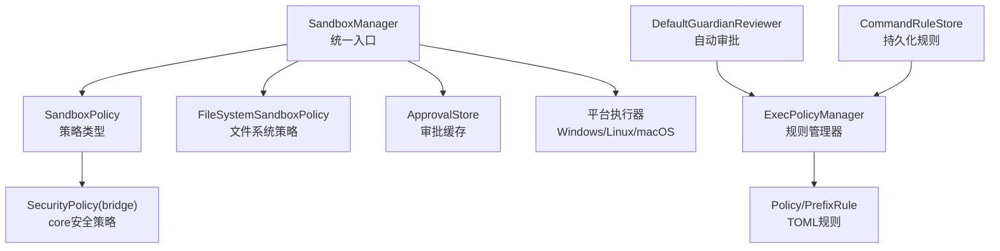
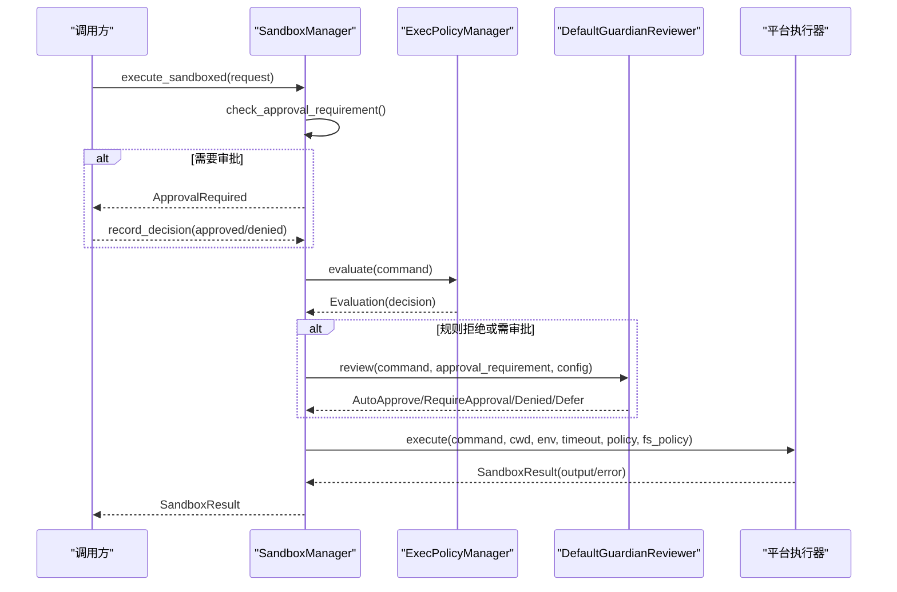
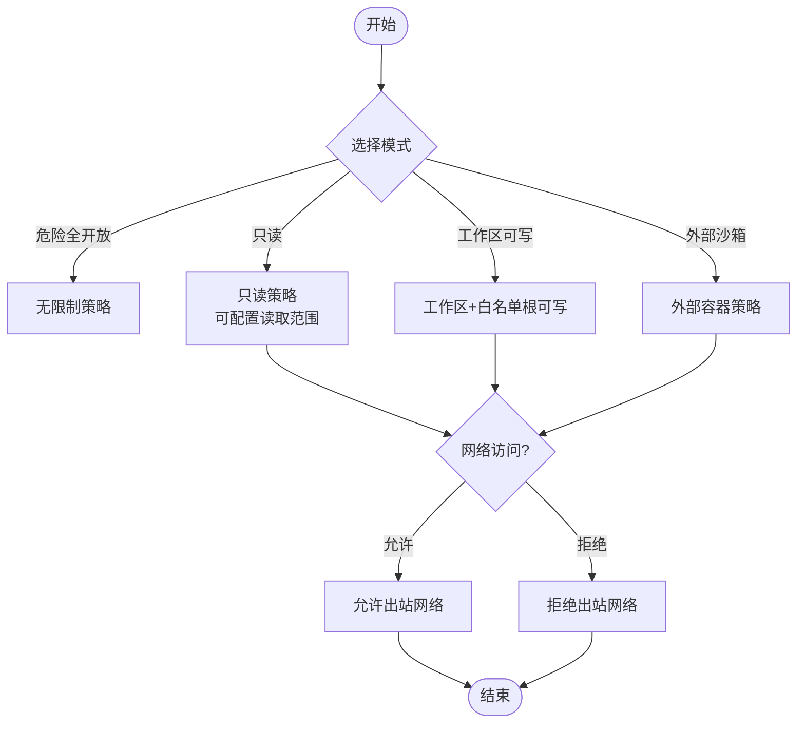
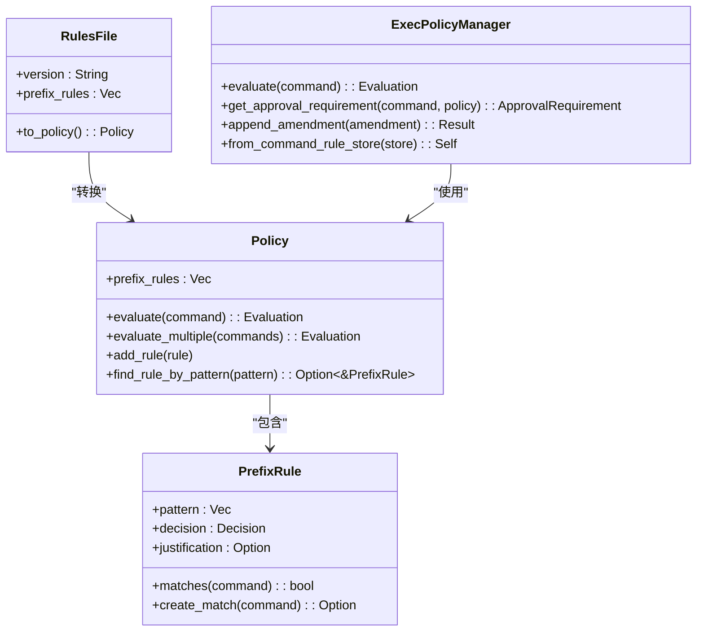
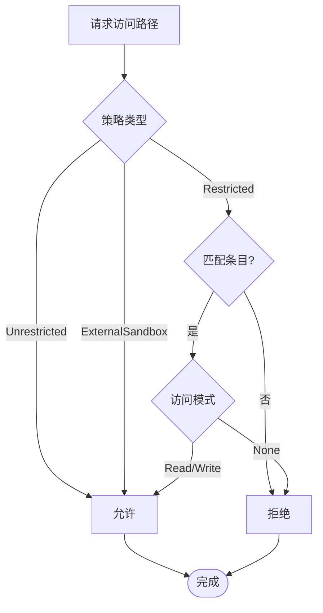
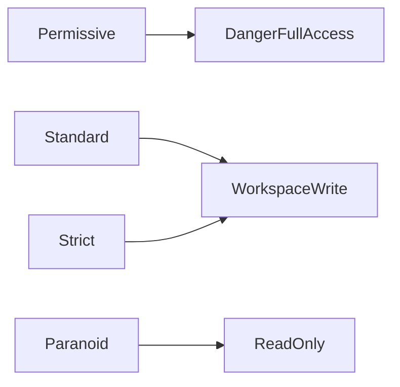
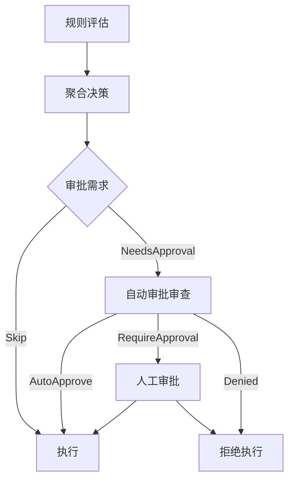
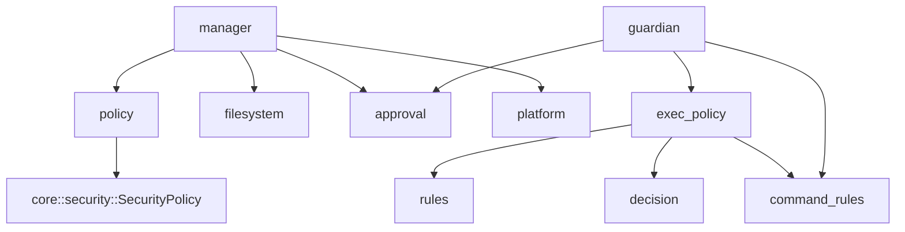

# 沙箱策略配置

<cite>
**本文引用的文件**
- [lib.rs](file://agent-diva-sandbox/src/lib.rs)
- [policy.rs](file://agent-diva-sandbox/src/policy.rs)
- [rules.rs](file://agent-diva-sandbox/src/rules.rs)
- [command_rules.rs](file://agent-diva-sandbox/src/command_rules.rs)
- [exec_policy.rs](file://agent-diva-sandbox/src/exec_policy.rs)
- [decision.rs](file://agent-diva-sandbox/src/decision.rs)
- [filesystem.rs](file://agent-diva-sandbox/src/filesystem.rs)
- [guardian.rs](file://agent-diva-sandbox/src/guardian.rs)
- [approval.rs](file://agent-diva-sandbox/src/approval.rs)
- [manager.rs](file://agent-diva-sandbox/src/manager.rs)
- [security_policy.rs](file://agent-diva-core/src/security/policy.rs)
- [security_config.rs](file://agent-diva-core/src/security/config.rs)
</cite>

## 目录
1. [简介](#简介)
2. [项目结构](#项目结构)
3. [核心组件](#核心组件)
4. [架构总览](#架构总览)
5. [详细组件分析](#详细组件分析)
6. [依赖关系分析](#依赖关系分析)
7. [性能与可扩展性](#性能与可扩展性)
8. [故障排查指南](#故障排查指南)
9. [结论](#结论)
10. [附录：策略模板与最佳实践](#附录：策略模板与最佳实践)

## 简介
本文件系统性说明 Agent Diva 的沙箱策略配置与执行机制，覆盖命令执行规则、文件系统访问控制、网络请求限制、安全级别预设（严格/标准/宽松）、自定义规则编写、策略验证与热重载、动态更新、冲突解决与优先级处理等主题。文档以代码为依据，提供可追溯的源码引用与可视化图示，帮助读者从概念到实现全面掌握沙箱策略体系。

## 项目结构
沙箱子系统位于 agent-diva-sandbox 模块，围绕“策略定义—规则匹配—审批决策—平台执行”的主线组织；同时与 core 的安全策略（SecurityPolicy）进行双向桥接，确保工作区隔离、路径校验、速率限制等通用安全能力复用。

**图表来源**
- [manager.rs:236-345](file://agent-diva-sandbox/src/manager.rs#L236-L345)
- [policy.rs:9-108](file://agent-diva-sandbox/src/policy.rs#L9-L108)
- [filesystem.rs:9-94](file://agent-diva-sandbox/src/filesystem.rs#L9-L94)
- [exec_policy.rs:165-257](file://agent-diva-sandbox/src/exec_policy.rs#L165-L257)
- [rules.rs:83-182](file://agent-diva-sandbox/src/rules.rs#L83-L182)
- [guardian.rs:218-274](file://agent-diva-sandbox/src/guardian.rs#L218-L274)
- [command_rules.rs:80-208](file://agent-diva-sandbox/src/command_rules.rs#L80-L208)
- [security_policy.rs:14-73](file://agent-diva-core/src/security/policy.rs#L14-L73)

**章节来源**
- [lib.rs:1-55](file://agent-diva-sandbox/src/lib.rs#L1-L55)
- [manager.rs:236-345](file://agent-diva-sandbox/src/manager.rs#L236-L345)

## 核心组件
- 沙箱策略模型：SandboxPolicy/SandboxMode/NetworkAccess/ReadOnlyAccess/AskForApproval，用于描述执行限制、读写范围、网络访问与审批时机。
- 文件系统策略：FileSystemSandboxPolicy/Entry/Path/WritableRoot，支持受限/不受限/外部容器模式，以及默认保护路径与可写根目录的子路径保护。
- 规则系统：Policy/PrefixRule/RulesFile，基于 TOML 的前缀匹配规则，支持评估、序列化与加载。
- 规则管理器：ExecPolicyManager，负责加载、合并、评估、追加规则（含防重复与禁止前缀检查），并输出审批需求。
- 审批系统：ApprovalStore/ReviewDecision/CommandApprovalKey，会话级审批缓存，避免重复提示。
- 自动审批：DefaultGuardianReviewer/GuardianConfig/GuardianRejectionCircuitBreaker，结合规则与启发式判断，提供严格/平衡/宽松三种行为。
- 持久化规则：CommandRuleStore，安全地添加/启用/删除规则，审计事件记录，兼容旧版规则格式。
- 平台执行：SandboxManager 根据平台选择具体执行器，支持超时、环境变量注入与错误封装。
- 与安全策略桥接：SandboxPolicy ↔ SecurityPolicy 双向转换，将沙箱策略映射为工作区隔离、只读/读写、允许根等核心安全配置。

**章节来源**
- [policy.rs:9-192](file://agent-diva-sandbox/src/policy.rs#L9-L192)
- [filesystem.rs:9-251](file://agent-diva-sandbox/src/filesystem.rs#L9-L251)
- [rules.rs:10-182](file://agent-diva-sandbox/src/rules.rs#L10-L182)
- [exec_policy.rs:165-386](file://agent-diva-sandbox/src/exec_policy.rs#L165-L386)
- [approval.rs:10-248](file://agent-diva-sandbox/src/approval.rs#L10-L248)
- [guardian.rs:25-110](file://agent-diva-sandbox/src/guardian.rs#L25-L110)
- [command_rules.rs:80-208](file://agent-diva-sandbox/src/command_rules.rs#L80-L208)
- [manager.rs:236-345](file://agent-diva-sandbox/src/manager.rs#L236-L345)
- [security_policy.rs:14-73](file://agent-diva-core/src/security/policy.rs#L14-L73)

## 架构总览
下图展示一次命令执行的完整流程：从管理器发起执行，到规则评估、审批决策、平台执行与结果返回。

**图表来源**
- [manager.rs:400-433](file://agent-diva-sandbox/src/manager.rs#L400-L433)
- [exec_policy.rs:254-324](file://agent-diva-sandbox/src/exec_policy.rs#L254-L324)
- [guardian.rs:375-467](file://agent-diva-sandbox/src/guardian.rs#L375-L467)
- [manager.rs:504-575](file://agent-diva-sandbox/src/manager.rs#L504-L575)

## 详细组件分析

### 策略定义与执行机制
- 策略类型
  - 危险全开放：无限制，仅用于受控环境。
  - 只读：限制写入，可选磁盘/工作区/自定义读取范围。
  - 工作区可写：允许对当前工作区及额外白名单根写入，默认开启工作区隔离。
  - 外部沙箱：进程已在容器等外部环境中运行。
- 审批时机
  - 从不：不提示，直接执行（配合自动审批）。
  - 失败后：首次沙箱内执行失败再提示。
  - 按需：由 LLM/上游决定何时提示。
  - 除非可信：未知命令默认提示，已知安全可跳过。
- 网络访问
  - 通过 NetworkAccess 枚举控制是否允许出站网络。
- 与核心安全策略桥接
  - SandboxPolicy → SecurityPolicy：映射为 Permissive/Standard/Paranoid 级别与工作区隔离、只读标志、允许根等。
  - SecurityPolicy → SandboxPolicy：反向推导最接近的沙箱策略。

**图表来源**
- [policy.rs:9-108](file://agent-diva-sandbox/src/policy.rs#L9-L108)
- [policy.rs:111-192](file://agent-diva-sandbox/src/policy.rs#L111-L192)
- [policy.rs:230-283](file://agent-diva-sandbox/src/policy.rs#L230-L283)

**章节来源**
- [policy.rs:9-192](file://agent-diva-sandbox/src/policy.rs#L9-L192)
- [policy.rs:230-283](file://agent-diva-sandbox/src/policy.rs#L230-L283)

### 命令执行规则与优先级
- 规则结构
  - PrefixRule：按命令前缀匹配，附带决策（允许/提示/禁止）与可选理由。
  - Policy：规则集合，支持评估单条或多条命令，聚合最严格决策。
  - RulesFile：TOML 根结构，包含版本与规则列表。
- 规则评估
  - 精确匹配与前缀匹配均支持。
  - 多规则聚合时，Forbidden > Prompt > Allow。
- 规则管理
  - ExecPolicyManager：加载、合并、评估、追加规则；防止重复与禁止危险前缀。
  - CommandRuleStore：持久化规则，支持启用/禁用/删除，并发安全与审计事件。
- 审批需求
  - get_approval_requirement：根据规则与 AskForApproval 策略输出 Skip/NeedsApproval/Forbidden。

**图表来源**
- [rules.rs:10-182](file://agent-diva-sandbox/src/rules.rs#L10-L182)
- [exec_policy.rs:165-386](file://agent-diva-sandbox/src/exec_policy.rs#L165-L386)

**章节来源**
- [rules.rs:10-182](file://agent-diva-sandbox/src/rules.rs#L10-L182)
- [exec_policy.rs:254-386](file://agent-diva-sandbox/src/exec_policy.rs#L254-L386)
- [command_rules.rs:80-208](file://agent-diva-sandbox/src/command_rules.rs#L80-L208)

### 文件系统访问控制
- 策略模式
  - Restricted：基于条目显式允许，未匹配则拒绝。
  - Unrestricted：完全放开。
  - ExternalSandbox：交由外部容器管理。
- 路径匹配
  - 支持绝对路径、Glob 模式、特殊路径（如工作区、临时目录、项目根等）。
  - WritableRoot：在可写根下设置只读子路径（如 .git/.diva/.agents）。
- 默认保护
  - 默认保护路径包括 .env、*.pem、*.key、*.secret、*.tfvars、*.tfstate、credentials、id_rsa 等敏感文件。
- 管理器集成
  - SandboxManager 构建文件系统策略，默认授予工作区读取与可写根写入。

**图表来源**
- [filesystem.rs:9-94](file://agent-diva-sandbox/src/filesystem.rs#L9-L94)
- [filesystem.rs:142-251](file://agent-diva-sandbox/src/filesystem.rs#L142-L251)
- [filesystem.rs:308-369](file://agent-diva-sandbox/src/filesystem.rs#L308-L369)
- [manager.rs:300-320](file://agent-diva-sandbox/src/manager.rs#L300-L320)

**章节来源**
- [filesystem.rs:9-251](file://agent-diva-sandbox/src/filesystem.rs#L9-L251)
- [filesystem.rs:308-369](file://agent-diva-sandbox/src/filesystem.rs#L308-L369)
- [manager.rs:300-320](file://agent-diva-sandbox/src/manager.rs#L300-L320)

### 网络请求限制
- 策略字段
  - SandboxPolicy 中 ReadOnly/WorkspaceWrite/ExternalSandbox 支持 network_access 布尔或枚举。
  - NetworkAccess 枚举明确允许/拒绝。
- 执行期影响
  - 平台执行器依据策略决定是否允许出站网络（具体实现由平台层决定）。
- 建议
  - 默认拒绝网络，仅在必要时开启；结合工作区隔离与规则系统降低风险。

**章节来源**
- [policy.rs:17-50](file://agent-diva-sandbox/src/policy.rs#L17-L50)
- [policy.rs:166-192](file://agent-diva-sandbox/src/policy.rs#L166-L192)

### 不同安全级别的预设配置
- 核心安全级别（SecurityLevel）
  - Permissive：最小限制，适合开发调试。
  - Standard：默认工作区隔离，中等限制。
  - Strict：更严格的校验与限速。
  - Paranoid：只读模式，禁止修改。
- 沙箱模式（SandboxMode）
  - DangerFullAccess：无沙箱，直接执行。
  - ReadOnly：只读文件系统。
  - WorkspaceWrite：工作区可写。
- 映射关系
  - SandboxPolicy.to_security_policy 将沙箱策略转换为 SecurityPolicy。
  - SecurityPolicy.to_sandbox_policy 反向推导最接近的沙箱策略。

**图表来源**
- [security_config.rs:11-49](file://agent-diva-core/src/security/config.rs#L11-L49)
- [policy.rs:64-108](file://agent-diva-sandbox/src/policy.rs#L64-L108)
- [policy.rs:111-144](file://agent-diva-sandbox/src/policy.rs#L111-L144)

**章节来源**
- [security_config.rs:11-49](file://agent-diva-core/src/security/config.rs#L11-L49)
- [policy.rs:64-144](file://agent-diva-sandbox/src/policy.rs#L64-L144)

### 自定义沙箱规则编写指南与最佳实践
- 编写 TOML 规则
  - 使用 [[prefix_rules]] 声明命令前缀与决策。
  - 可为规则添加 justification 便于审计。
- 安全建议
  - 优先使用 Allow 精确匹配已知安全命令。
  - 对危险命令（如 sudo、shell 解释器、包管理器安装）使用 Forbidden。
  - 利用 is_banned_prefix 防止自动学习危险前缀。
- 持久化与版本
  - CommandRuleStore 提供版本化与原子替换，保证并发安全。
  - 兼容旧版 Policy 格式，迁移时保留历史规则。
- 示例要点
  - 仅允许 git status、git branch --show-current、cargo --version 等只读命令。
  - 禁止 rm -rf、python -c、bash -c 等高风险命令。

**章节来源**
- [rules.rs:150-182](file://agent-diva-sandbox/src/rules.rs#L150-L182)
- [exec_policy.rs:201-257](file://agent-diva-sandbox/src/exec_policy.rs#L201-L257)
- [exec_policy.rs:477-553](file://agent-diva-sandbox/src/exec_policy.rs#L477-L553)
- [command_rules.rs:273-317](file://agent-diva-sandbox/src/command_rules.rs#L273-L317)

### 策略验证、热重载与动态更新
- 验证
  - SecurityConfig.validate 检查非法值（如零超时、阈值越界）。
  - CommandRuleStore.open 解析失败时关闭模式返回错误。
- 热重载
  - ExecPolicyManager.load_rules 从文件加载并合并规则，更新内存策略。
  - append_amendment_shared 支持共享引用下的追加与持久化。
- 动态更新
  - CommandRuleStore.set_enabled/delete 支持运行时启用/禁用或删除规则，并发安全。
  - Guardian 可在会话中记录审批决策，影响后续行为。

**章节来源**
- [security_config.rs:249-273](file://agent-diva-core/src/security/config.rs#L249-L273)
- [exec_policy.rs:227-247](file://agent-diva-sandbox/src/exec_policy.rs#L227-L247)
- [exec_policy.rs:326-386](file://agent-diva-sandbox/src/exec_policy.rs#L326-L386)
- [command_rules.rs:151-208](file://agent-diva-sandbox/src/command_rules.rs#L151-L208)
- [approval.rs:155-248](file://agent-diva-sandbox/src/approval.rs#L155-L248)

### 策略冲突解决与优先级处理
- 规则聚合
  - 多规则评估时，采用最严格决策：Forbidden > Prompt > Allow。
- 审批策略叠加
  - AskForApproval 与规则决策共同决定是否需要用户审批。
  - Never 模式下，Prompt 规则会被视为 Forbidden。
- 自动审批优先级
  - DefaultGuardianReviewer 先检查已知安全与只读命令，再判断潜在危险，最后按策略要求提示或放行。
- 熔断保护
  - GuardianRejectionCircuitBreaker 在频繁拒绝时触发，阻止自动批准，强制人工介入。

**图表来源**
- [decision.rs:19-54](file://agent-diva-sandbox/src/decision.rs#L19-L54)
- [exec_policy.rs:270-324](file://agent-diva-sandbox/src/exec_policy.rs#L270-L324)
- [guardian.rs:375-467](file://agent-diva-sandbox/src/guardian.rs#L375-L467)
- [guardian.rs:475-589](file://agent-diva-sandbox/src/guardian.rs#L475-L589)

**章节来源**
- [decision.rs:19-54](file://agent-diva-sandbox/src/decision.rs#L19-L54)
- [exec_policy.rs:270-324](file://agent-diva-sandbox/src/exec_policy.rs#L270-L324)
- [guardian.rs:375-589](file://agent-diva-sandbox/src/guardian.rs#L375-L589)

## 依赖关系分析
- 模块耦合
  - manager 依赖 policy、filesystem、approval、platform 执行器。
  - exec_policy 依赖 rules、decision、command_rules。
  - guardian 依赖 exec_policy、command_rules、approval。
  - sandbox 与 core 通过 SecurityPolicy 桥接，避免循环依赖。
- 外部依赖
  - TOML 序列化/反序列化。
  - GlobSet 用于路径匹配。
  - 平台特定 API（Windows/Linux/macOS）。

**图表来源**
- [manager.rs:236-345](file://agent-diva-sandbox/src/manager.rs#L236-L345)
- [exec_policy.rs:165-257](file://agent-diva-sandbox/src/exec_policy.rs#L165-L257)
- [guardian.rs:218-274](file://agent-diva-sandbox/src/guardian.rs#L218-L274)
- [policy.rs:64-108](file://agent-diva-sandbox/src/policy.rs#L64-L108)

**章节来源**
- [manager.rs:236-345](file://agent-diva-sandbox/src/manager.rs#L236-L345)
- [exec_policy.rs:165-257](file://agent-diva-sandbox/src/exec_policy.rs#L165-L257)
- [guardian.rs:218-274](file://agent-diva-sandbox/src/guardian.rs#L218-L274)
- [policy.rs:64-108](file://agent-diva-sandbox/src/policy.rs#L64-L108)

## 性能与可扩展性
- 规则评估复杂度
  - 单条命令评估为 O(n)，n 为规则数量；多命令评估为 O(m*n)。
- 文件系统匹配
  - GlobSet 预编译模式，匹配高效；默认保护路径数量有限。
- 并发与锁
  - ExecPolicyManager 使用 RwLock 保护策略，追加规则使用 Mutex 串行化。
  - CommandRuleStore 使用 RwLock 与原子替换文件，保证并发安全。
- 可扩展点
  - 自定义 GuardianReviewer 实现更精细的自动审批逻辑。
  - 扩展 FileSystemPath 支持更多特殊路径语义。
  - 增加新的规则类型或匹配算法（如正则、AST 解析）。

[本节为一般性指导，无需源码引用]

## 故障排查指南
- 常见错误
  - 规则文件无效：CommandRuleStore.open 返回 InvalidFile。
  - 重复规则：append_amendment 返回 DuplicateRule。
  - 禁止前缀：is_banned_prefix 拦截危险命令。
  - 路径逃逸：SecurityPolicy.validate_path 拒绝 ../、URL 编码遍历、绝对路径（工作区模式）。
  - 平台不可用：execute_with_platform 返回 PlatformError/PlatformNotSupported。
- 诊断步骤
  - 检查规则文件语法与版本。
  - 查看 ExecPolicyManager 日志（Loaded/Added rule）。
  - 确认 AskForApproval 策略与规则决策组合是否符合预期。
  - 检查文件系统策略条目与默认保护路径。
  - 使用 Guardian 熔断状态判断是否频繁拒绝。

**章节来源**
- [command_rules.rs:66-78](file://agent-diva-sandbox/src/command_rules.rs#L66-L78)
- [exec_policy.rs:109-131](file://agent-diva-sandbox/src/exec_policy.rs#L109-L131)
- [exec_policy.rs:477-553](file://agent-diva-sandbox/src/exec_policy.rs#L477-L553)
- [security_policy.rs:74-201](file://agent-diva-core/src/security/policy.rs#L74-L201)
- [manager.rs:504-575](file://agent-diva-sandbox/src/manager.rs#L504-L575)

## 结论
Agent Diva 的沙箱策略体系通过清晰的策略模型、灵活的规则系统与健壮的审批机制，实现了命令执行、文件系统访问与网络请求的多层次控制。借助与核心安全策略的双向桥接，系统在保持灵活性的同时确保了工作区隔离与路径安全。推荐在生产环境使用标准或严格级别，并结合自动审批与熔断保护，逐步引入自定义规则以实现精准管控。

[本节为总结性内容，无需源码引用]

## 附录：策略模板与最佳实践
- 模板要点
  - 使用 [[prefix_rules]] 声明命令前缀与决策。
  - 为关键规则添加 justification 便于审计。
  - 对危险命令使用 Forbidden，对只读命令使用 Allow。
- 最佳实践
  - 默认拒绝网络，仅在必要时开启。
  - 使用 WritableRoot 限制写入范围，并保护敏感子路径。
  - 定期审查规则，移除过时或冗余条目。
  - 结合 Guardian 的严格/平衡/宽松配置，平衡安全性与可用性。
  - 使用 CommandRuleStore 的启用/禁用功能进行灰度发布。

[本节为一般性指导，无需源码引用]