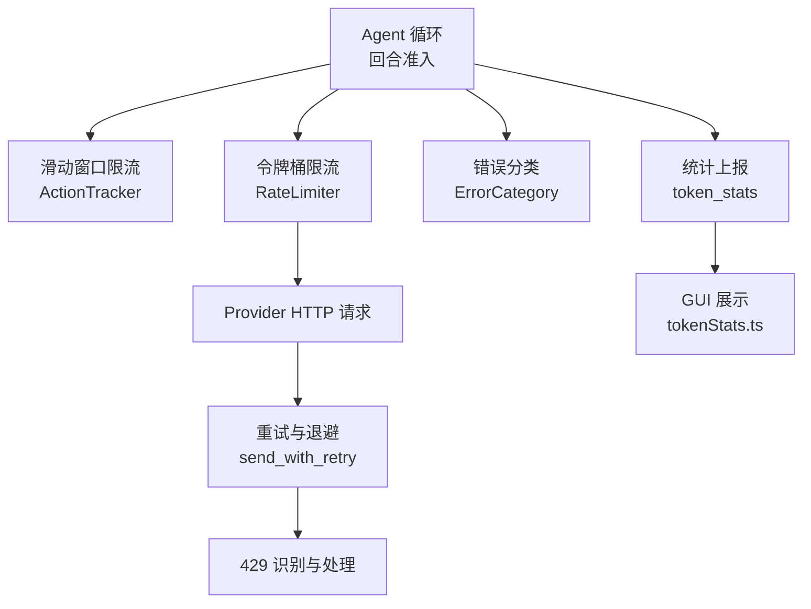
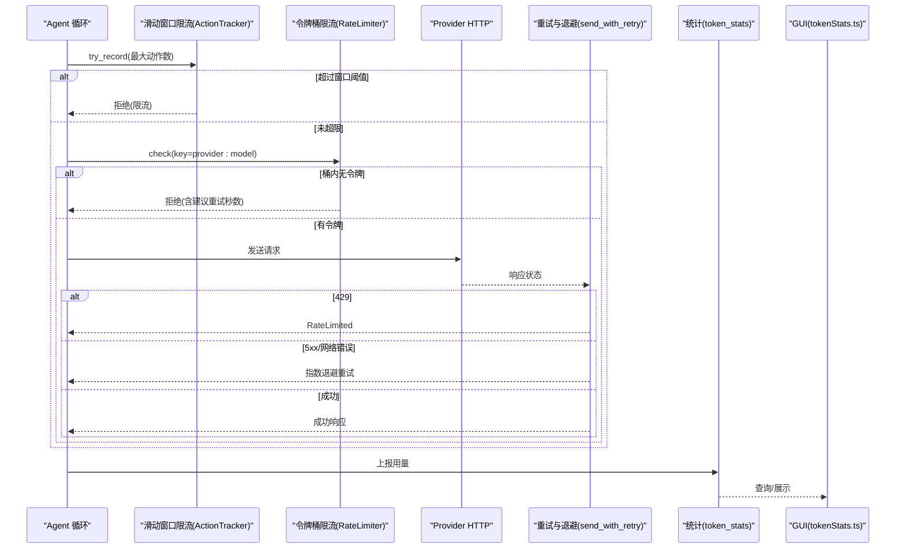
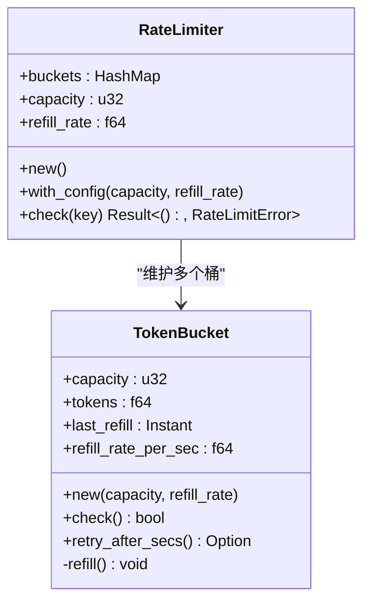
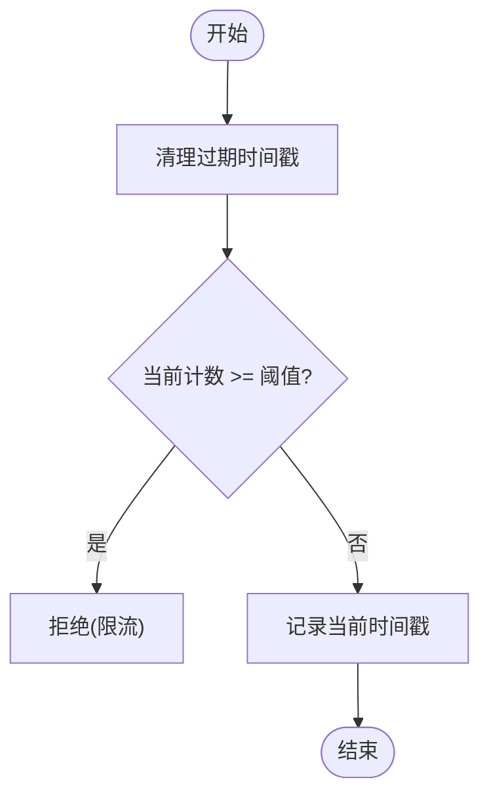
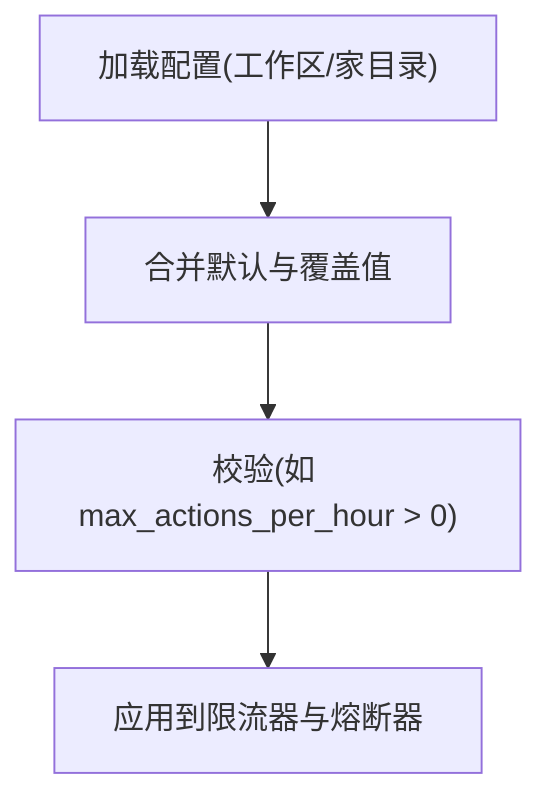
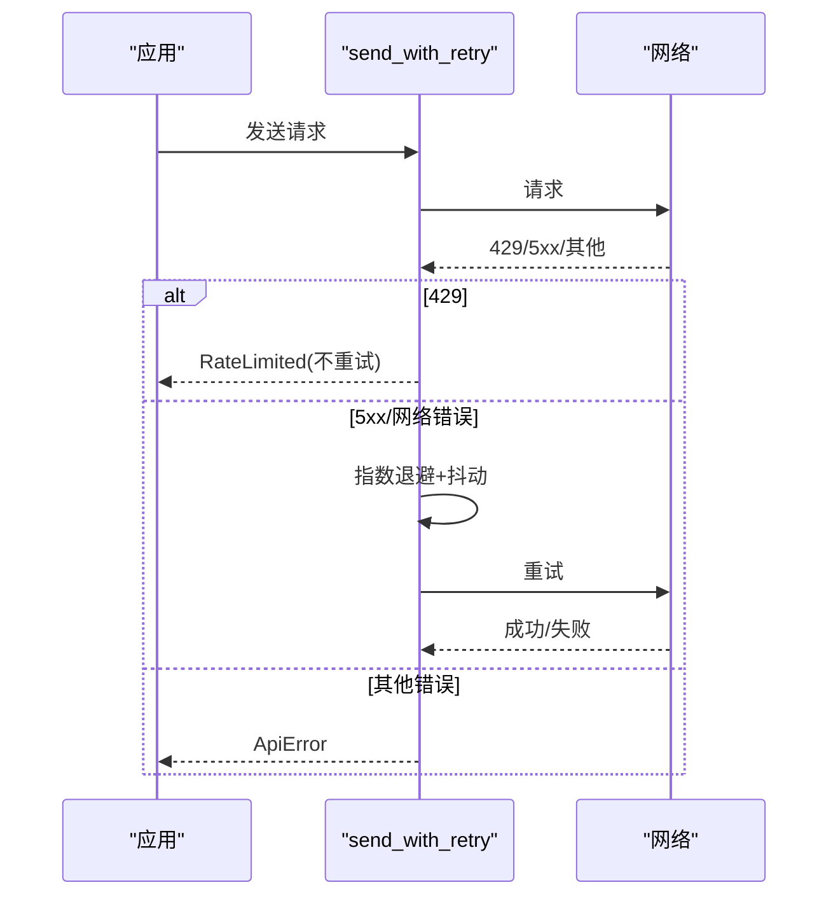
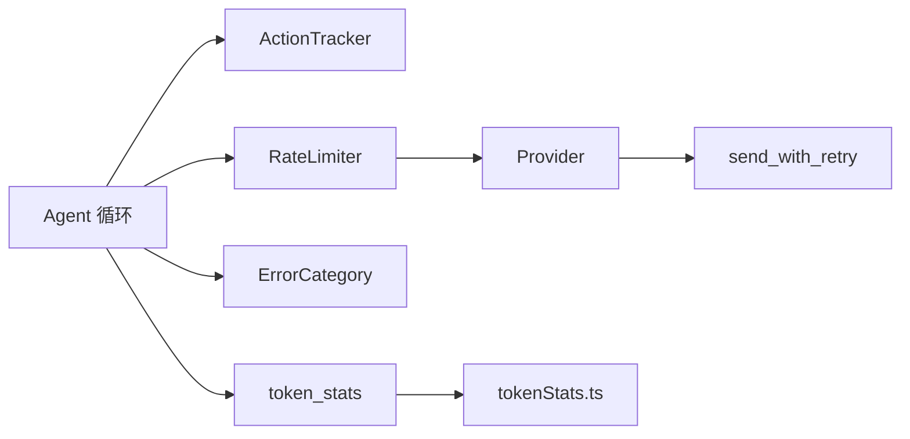

# 速率限制机制

<cite>
**本文引用的文件**
- [agent-diva-core/src/rate_limiter.rs](file://agent-diva-core/src/rate_limiter.rs)
- [agent-diva-core/src/security/rate_limit.rs](file://agent-diva-core/src/security/rate_limit.rs)
- [agent-diva-core/src/security/config.rs](file://agent-diva-core/src/security/config.rs)
- [agent-diva-agent/src/agent_loop.rs](file://agent-diva-agent/src/agent_loop.rs)
- [agent-diva-agent/src/agent_loop/turn/admission.rs](file://agent-diva-agent/src/agent_loop/turn/admission.rs)
- [agent-diva-providers/src/retry.rs](file://agent-diva-providers/src/retry.rs)
- [agent-diva-core/src/error_category.rs](file://agent-diva-core/src/error_category.rs)
- [agent-diva-manager/src/handlers/token_stats.rs](file://agent-diva-manager/src/handlers/token_stats.rs)
- [agent-diva-gui/src/api/tokenStats.ts](file://agent-diva-gui/src/api/tokenStats.ts)
</cite>

## 目录
1. [简介](#简介)
2. [项目结构](#项目结构)
3. [核心组件](#核心组件)
4. [架构总览](#架构总览)
5. [详细组件分析](#详细组件分析)
6. [依赖关系分析](#依赖关系分析)
7. [性能考虑](#性能考虑)
8. [故障排查指南](#故障排查指南)
9. [结论](#结论)
10. [附录](#附录)

## 简介
本文件系统性阐述 Agent-Diva 的速率限制（限流）机制，覆盖算法实现、配置项、不同粒度的控制策略（全局限流、用户/会话级限流、API 调用限流）、令牌桶与滑动窗口算法的应用、监控指标与告警、动态调整与高可用设计。文档面向具备基础技术背景的读者，同时提供图示帮助理解。

## 项目结构
本项目在多个模块中实现了互补的限流能力：
- 核心令牌桶限流器：按“键”隔离的内存令牌桶，适合 Provider/模型维度的细粒度限流。
- 安全动作滑动窗口限流：用于进程级“回合/动作”准入控制，防止过载。
- 提供者重试与 429 处理：对上游 API 的 429 进行识别与指数退避重试。
- 错误分类：将限流类错误归类为可重试，便于上层统一处理。
- 统计与可视化：Token 用量统计接口与前端展示，辅助观测限流效果。

图表来源
- [agent-diva-agent/src/agent_loop.rs:128-131](file://agent-diva-agent/src/agent_loop.rs#L128-L131)
- [agent-diva-core/src/security/rate_limit.rs:1-84](file://agent-diva-core/src/security/rate_limit.rs#L1-L84)
- [agent-diva-core/src/rate_limiter.rs:125-165](file://agent-diva-core/src/rate_limiter.rs#L125-L165)
- [agent-diva-providers/src/retry.rs:49-84](file://agent-diva-providers/src/retry.rs#L49-L84)
- [agent-diva-core/src/error_category.rs:55-72](file://agent-diva-core/src/error_category.rs#L55-L72)
- [agent-diva-manager/src/handlers/token_stats.rs:188-334](file://agent-diva-manager/src/handlers/token_stats.rs#L188-L334)
- [agent-diva-gui/src/api/tokenStats.ts:67-100](file://agent-diva-gui/src/api/tokenStats.ts#L67-L100)

章节来源
- [agent-diva-agent/src/agent_loop.rs:128-131](file://agent-diva-agent/src/agent_loop.rs#L128-L131)
- [agent-diva-core/src/security/rate_limit.rs:1-84](file://agent-diva-core/src/security/rate_limit.rs#L1-L84)
- [agent-diva-core/src/rate_limiter.rs:125-165](file://agent-diva-core/src/rate_limiter.rs#L125-L165)
- [agent-diva-providers/src/retry.rs:49-84](file://agent-diva-providers/src/retry.rs#L49-L84)
- [agent-diva-core/src/error_category.rs:55-72](file://agent-diva-core/src/error_category.rs#L55-L72)
- [agent-diva-manager/src/handlers/token_stats.rs:188-334](file://agent-diva-manager/src/handlers/token_stats.rs#L188-L334)
- [agent-diva-gui/src/api/tokenStats.ts:67-100](file://agent-diva-gui/src/api/tokenStats.ts#L67-L100)

## 核心组件
- 令牌桶限流器（每键独立）：支持容量与每秒补充速率配置，异步检查是否允许通过，并在拒绝时给出建议的重试等待时间。
- 滑动窗口限流器（安全动作）：记录最近一段时间内的动作时间戳，基于窗口大小与阈值判断是否限流。
- 安全配置：提供默认与可覆盖的安全策略，包括每小时最大动作数、拒绝熔断窗口与阈值等。
- 提供者重试与 429 处理：识别 429 并返回限流错误；对 5xx 网络错误采用指数退避重试。
- 错误分类：将限流相关错误归为可重试，便于上层统一重试策略。
- 统计与可视化：提供 Token 用量总量、分组摘要、时间线等接口，配合 GUI 展示。

章节来源
- [agent-diva-core/src/rate_limiter.rs:1-165](file://agent-diva-core/src/rate_limiter.rs#L1-L165)
- [agent-diva-core/src/security/rate_limit.rs:1-84](file://agent-diva-core/src/security/rate_limit.rs#L1-L84)
- [agent-diva-core/src/security/config.rs:51-178](file://agent-diva-core/src/security/config.rs#L51-L178)
- [agent-diva-providers/src/retry.rs:49-84](file://agent-diva-providers/src/retry.rs#L49-L84)
- [agent-diva-core/src/error_category.rs:55-72](file://agent-diva-core/src/error_category.rs#L55-L72)
- [agent-diva-manager/src/handlers/token_stats.rs:188-334](file://agent-diva-manager/src/handlers/token_stats.rs#L188-L334)
- [agent-diva-gui/src/api/tokenStats.ts:67-100](file://agent-diva-gui/src/api/tokenStats.ts#L67-L100)

## 架构总览
下图展示了从 Agent 回合到 Provider 调用的完整限流链路：回合准入先经滑动窗口限流，随后进入令牌桶限流，再发起 HTTP 请求；若上游返回 429，则上层识别为限流错误并可触发重试或告警；同时统计上报至管理器并由 GUI 展示。

图表来源
- [agent-diva-agent/src/agent_loop/turn/admission.rs:96-107](file://agent-diva-agent/src/agent_loop/turn/admission.rs#L96-L107)
- [agent-diva-core/src/security/rate_limit.rs:32-63](file://agent-diva-core/src/security/rate_limit.rs#L32-L63)
- [agent-diva-core/src/rate_limiter.rs:148-165](file://agent-diva-core/src/rate_limiter.rs#L148-L165)
- [agent-diva-providers/src/retry.rs:49-84](file://agent-diva-providers/src/retry.rs#L49-L84)
- [agent-diva-manager/src/handlers/token_stats.rs:188-334](file://agent-diva-manager/src/handlers/token_stats.rs#L188-L334)
- [agent-diva-gui/src/api/tokenStats.ts:67-100](file://agent-diva-gui/src/api/tokenStats.ts#L67-L100)

## 详细组件分析

### 令牌桶限流器（每键独立）
- 设计要点
  - 每个 key（如 provider:model）拥有独立的桶，互不影响。
  - 桶容量与每秒补充速率可配置；首次初始化即满额。
  - 每次检查会按时间差补回令牌，避免累积溢出。
  - 拒绝时计算建议重试秒数，便于客户端退避。
- 复杂度
  - 单次检查 O(1)，空间随 key 数量线性增长。
- 适用场景
  - Provider/模型维度的细粒度限流，避免突发流量打爆后端。

图表来源
- [agent-diva-core/src/rate_limiter.rs:31-84](file://agent-diva-core/src/rate_limiter.rs#L31-L84)
- [agent-diva-core/src/rate_limiter.rs:125-165](file://agent-diva-core/src/rate_limiter.rs#L125-L165)

章节来源
- [agent-diva-core/src/rate_limiter.rs:1-165](file://agent-diva-core/src/rate_limiter.rs#L1-L165)

### 滑动窗口限流器（安全动作）
- 设计要点
  - 以固定窗口长度（默认 1 小时）记录动作时间戳，定期清理过期条目。
  - 提供记录、计数、尝试记录与重置等方法。
  - 用于进程级“回合/动作”准入控制，防止过载。
- 复杂度
  - 记录/计数 O(n) 清理（n 为窗口内动作数），可通过分片或队列优化。
- 适用场景
  - 全局/会话级动作频率限制，保护系统稳定性。

图表来源
- [agent-diva-core/src/security/rate_limit.rs:32-72](file://agent-diva-core/src/security/rate_limit.rs#L32-L72)

章节来源
- [agent-diva-core/src/security/rate_limit.rs:1-84](file://agent-diva-core/src/security/rate_limit.rs#L1-L84)

### 安全配置与动态调整
- 配置项
  - 安全级别预设：影响默认每小时最大动作数与工作区限制。
  - 每小时最大动作数：用于滑动窗口限流的阈值。
  - 拒绝熔断窗口与阈值：用于快速失败的安全阀。
  - 工具执行超时、预算限制等：间接影响整体吞吐与限流行为。
- 加载与合并
  - 支持从工作区、家目录等多路径加载并合并配置。
  - 运行时可覆盖关键限流参数，便于灰度与动态调优。

图表来源
- [agent-diva-core/src/security/config.rs:181-231](file://agent-diva-core/src/security/config.rs#L181-L231)
- [agent-diva-core/src/security/config.rs:249-273](file://agent-diva-core/src/security/config.rs#L249-L273)

章节来源
- [agent-diva-core/src/security/config.rs:51-178](file://agent-diva-core/src/security/config.rs#L51-L178)
- [agent-diva-core/src/security/config.rs:181-231](file://agent-diva-core/src/security/config.rs#L181-L231)
- [agent-diva-core/src/security/config.rs:249-273](file://agent-diva-core/src/security/config.rs#L249-L273)

### 提供者重试与 429 处理
- 429 识别
  - HTTP 429 被识别为限流错误，不自动重试，交由上层决策。
- 指数退避
  - 对 5xx 和网络错误采用指数退避加抖动，避免雪崩。
- 结合本地限流
  - 本地令牌桶可在请求前拦截，减少无效网络往返。

图表来源
- [agent-diva-providers/src/retry.rs:49-84](file://agent-diva-providers/src/retry.rs#L49-L84)
- [agent-diva-providers/src/retry.rs:94-181](file://agent-diva-providers/src/retry.rs#L94-L181)

章节来源
- [agent-diva-providers/src/retry.rs:49-84](file://agent-diva-providers/src/retry.rs#L49-L84)
- [agent-diva-providers/src/retry.rs:94-181](file://agent-diva-providers/src/retry.rs#L94-L181)

### 错误分类与可重试策略
- 限流相关错误被分类为可重试，便于统一的上层重试逻辑。
- 安全策略拒绝（如注入检测、只读模式）为致命错误，不进行重试。

章节来源
- [agent-diva-core/src/error_category.rs:55-72](file://agent-diva-core/src/error_category.rs#L55-L72)

### 统计与可视化
- 统计接口
  - 总量、分组摘要、时间线等，支持按时间段与时区查询。
- GUI 集成
  - 前端调用统计接口，渲染用量趋势与分组视图，辅助观察限流效果。

章节来源
- [agent-diva-manager/src/handlers/token_stats.rs:188-334](file://agent-diva-manager/src/handlers/token_stats.rs#L188-L334)
- [agent-diva-gui/src/api/tokenStats.ts:67-100](file://agent-diva-gui/src/api/tokenStats.ts#L67-L100)

## 依赖关系分析
- Agent 循环依赖滑动窗口限流器进行回合准入控制。
- 令牌桶限流器作为通用限流原语，供 Provider/模型维度使用。
- 提供者重试模块与 429 识别协同，形成端到端的限流闭环。
- 错误分类模块为上层重试策略提供统一语义。
- 统计模块与 GUI 提供可观测性支撑。

图表来源
- [agent-diva-agent/src/agent_loop.rs:128-131](file://agent-diva-agent/src/agent_loop.rs#L128-L131)
- [agent-diva-core/src/security/rate_limit.rs:1-84](file://agent-diva-core/src/security/rate_limit.rs#L1-L84)
- [agent-diva-core/src/rate_limiter.rs:125-165](file://agent-diva-core/src/rate_limiter.rs#L125-L165)
- [agent-diva-providers/src/retry.rs:49-84](file://agent-diva-providers/src/retry.rs#L49-L84)
- [agent-diva-core/src/error_category.rs:55-72](file://agent-diva-core/src/error_category.rs#L55-L72)
- [agent-diva-manager/src/handlers/token_stats.rs:188-334](file://agent-diva-manager/src/handlers/token_stats.rs#L188-L334)
- [agent-diva-gui/src/api/tokenStats.ts:67-100](file://agent-diva-gui/src/api/tokenStats.ts#L67-L100)

章节来源
- [agent-diva-agent/src/agent_loop.rs:128-131](file://agent-diva-agent/src/agent_loop.rs#L128-L131)
- [agent-diva-core/src/security/rate_limit.rs:1-84](file://agent-diva-core/src/security/rate_limit.rs#L1-L84)
- [agent-diva-core/src/rate_limiter.rs:125-165](file://agent-diva-core/src/rate_limiter.rs#L125-L165)
- [agent-diva-providers/src/retry.rs:49-84](file://agent-diva-providers/src/retry.rs#L49-L84)
- [agent-diva-core/src/error_category.rs:55-72](file://agent-diva-core/src/error_category.rs#L55-L72)
- [agent-diva-manager/src/handlers/token_stats.rs:188-334](file://agent-diva-manager/src/handlers/token_stats.rs#L188-L334)
- [agent-diva-gui/src/api/tokenStats.ts:67-100](file://agent-diva-gui/src/api/tokenStats.ts#L67-L100)

## 性能考虑
- 令牌桶
  - 单键 O(1) 检查，适合高频短请求；注意 key 爆炸风险，合理聚合 key。
  - 补充计算使用浮点，注意精度与边界情况（已做防护）。
- 滑动窗口
  - 窗口内动作较多时清理成本上升；可按业务拆分窗口或引入分片。
- 重试与退避
  - 指数退避加抖动降低雪崩概率；429 不重试，避免放大压力。
- 统计
  - 统计写入应异步化，避免阻塞主流程；时间线聚合需考虑内存占用。

[本节为通用指导，无需具体文件引用]

## 故障排查指南
- 常见现象
  - 频繁出现“限流”提示：检查滑动窗口阈值与令牌桶容量/补充速率。
  - 上游 429 持续：确认重试策略与退避参数，关注上游服务健康。
  - 统计异常：核对统计上报链路与时区设置。
- 定位步骤
  - 查看 Agent 日志中的限流拒绝信息（如“max_actions_per_hour exhausted”）。
  - 检查安全配置是否正确加载与合并。
  - 通过统计接口与 GUI 观察用量趋势与分组维度。
- 恢复手段
  - 临时提高阈值或增加令牌桶容量。
  - 调整重试退避参数，缓解上游压力。
  - 重置熔断器或清理统计缓存（如有）。

章节来源
- [agent-diva-agent/src/agent_loop/turn/admission.rs:96-107](file://agent-diva-agent/src/agent_loop/turn/admission.rs#L96-L107)
- [agent-diva-core/src/security/config.rs:181-231](file://agent-diva-core/src/security/config.rs#L181-L231)
- [agent-diva-manager/src/handlers/token_stats.rs:188-334](file://agent-diva-manager/src/handlers/token_stats.rs#L188-L334)

## 结论
本项目的限流体系由令牌桶与滑动窗口共同构成，分别适用于 Provider/模型维度的细粒度限流与进程级动作准入控制。配合 429 识别、指数退避重试、错误分类与统计可视化，形成了完整的限流闭环。通过安全配置的动态加载与合并，可实现灵活的策略调整与高可用保障。

[本节为总结，无需具体文件引用]

## 附录

### 配置示例与最佳实践
- 令牌桶
  - 容量与补充速率：根据上游 QPS 与并发需求设定；突发流量大时可适当增大容量。
  - Key 设计：建议使用 provider:model 组合，避免跨租户干扰。
- 滑动窗口
  - 窗口大小与阈值：根据业务节奏与安全策略设定；默认每小时 100 次。
  - 清理策略：确保及时清理过期时间戳，避免内存泄漏。
- 重试与退避
  - 429 不重试，5xx 指数退避；抖动范围适中，避免集中重试。
- 统计与告警
  - 基于统计接口设置阈值告警（如 429 比例、限流拒绝率）。
  - 结合 GUI 观察用量趋势，及时调整策略。

[本节为通用指导，无需具体文件引用]

### 监控指标与告警机制
- 指标
  - 限流拒绝次数、重试次数、429 比例、Token 用量（输入/输出/总数）。
- 告警
  - 当 429 比例或限流拒绝率超过阈值时触发告警。
  - 结合熔断器状态，快速发现上游不稳定。

章节来源
- [agent-diva-manager/src/handlers/token_stats.rs:188-334](file://agent-diva-manager/src/handlers/token_stats.rs#L188-L334)
- [agent-diva-gui/src/api/tokenStats.ts:67-100](file://agent-diva-gui/src/api/tokenStats.ts#L67-L100)

### 动态调整与高可用设计
- 动态调整
  - 通过安全配置的多路径加载与合并，实现运行时覆盖限流参数。
  - 支持窗口与阈值的平滑调整，避免突变影响。
- 高可用
  - 令牌桶与滑动窗口均为内存实现，单实例内高效；多实例部署时需考虑共享状态（如 Redis）以实现全局一致性。
  - 熔断器作为安全阀，快速失败保护系统。

章节来源
- [agent-diva-core/src/security/config.rs:181-231](file://agent-diva-core/src/security/config.rs#L181-L231)
- [agent-diva-core/src/security/config.rs:249-273](file://agent-diva-core/src/security/config.rs#L249-L273)