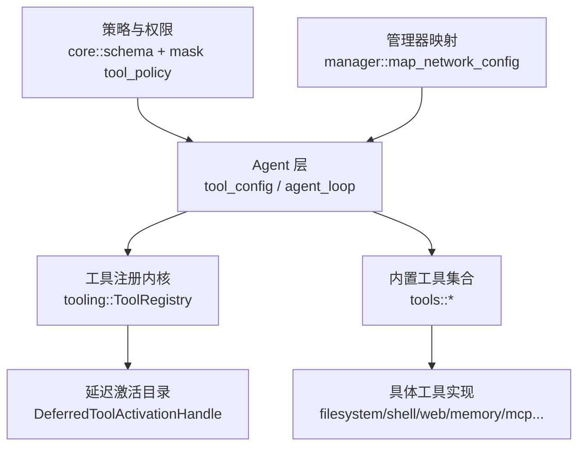
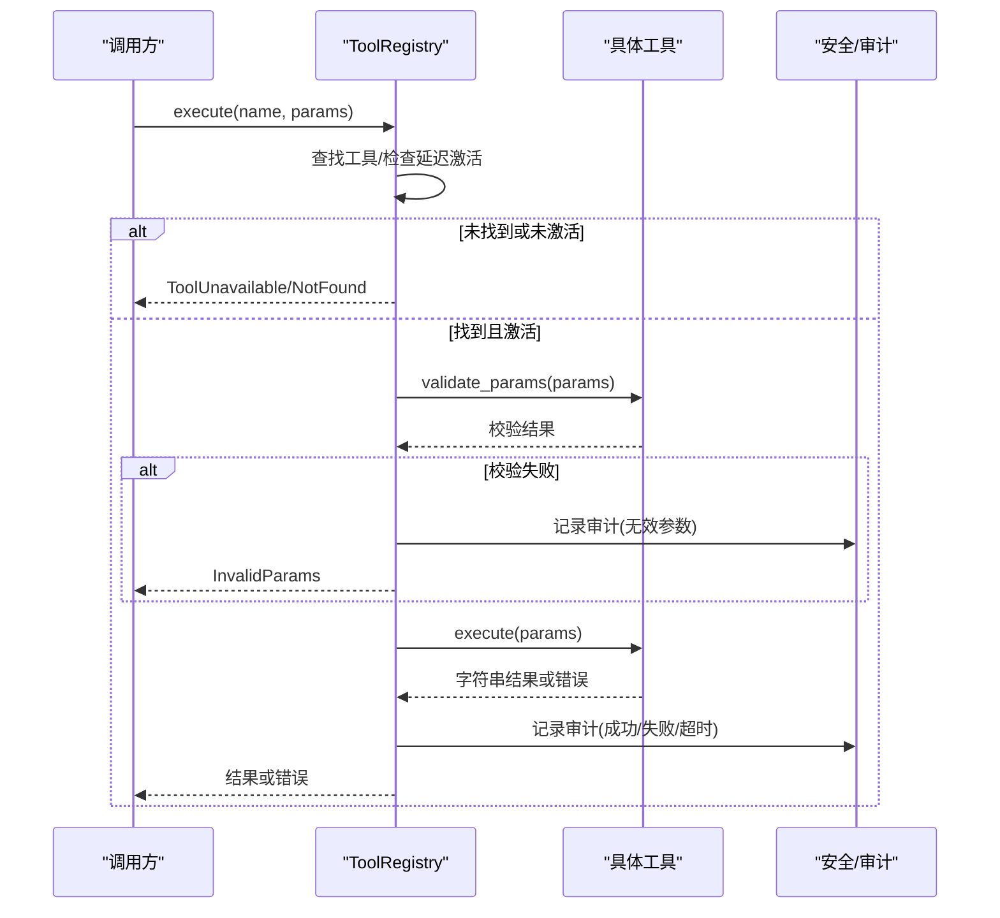
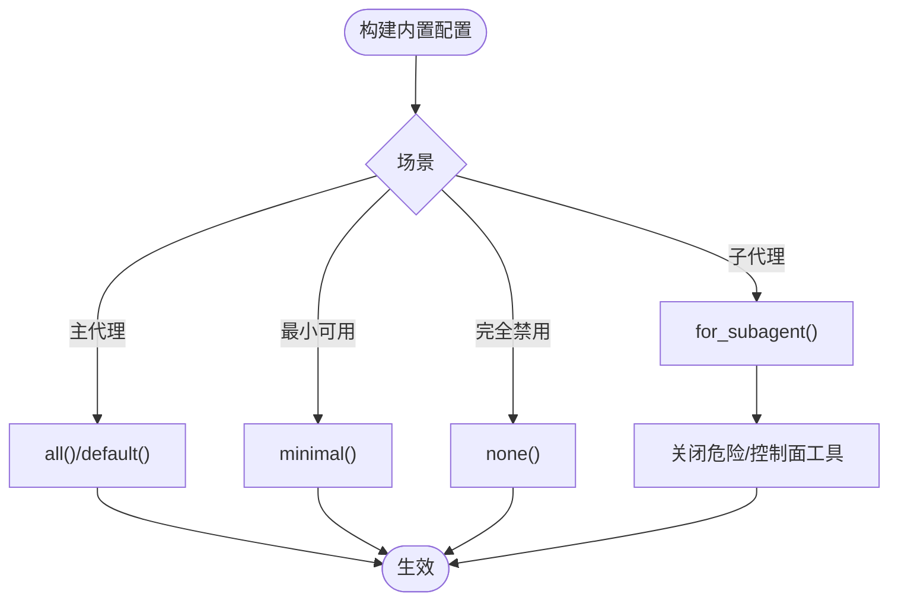
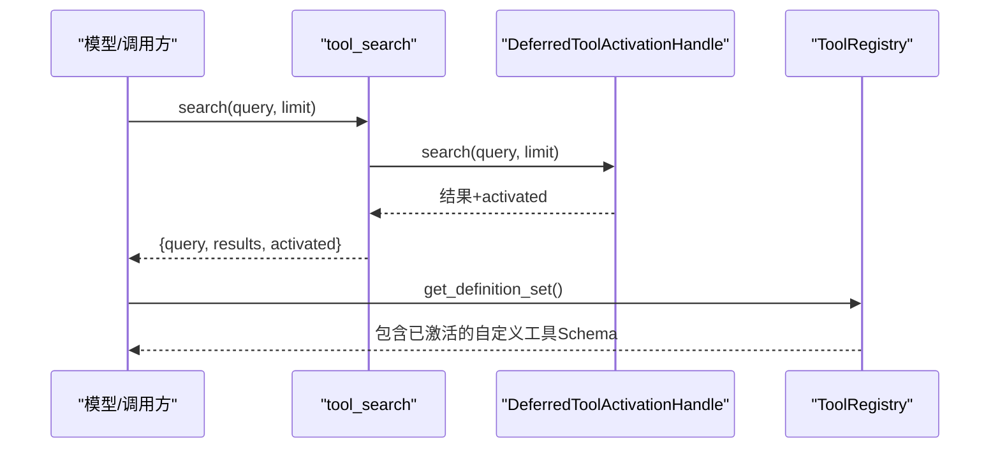
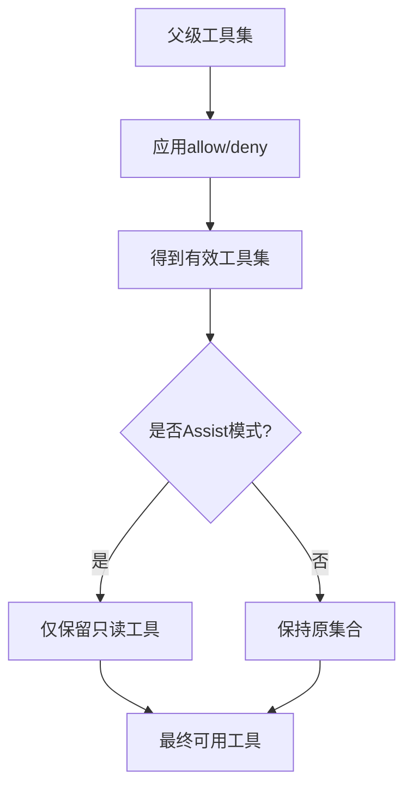
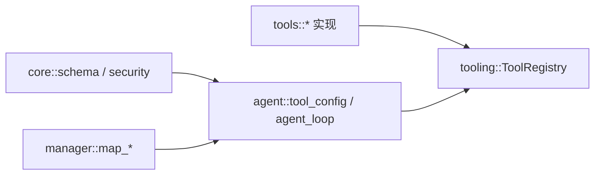
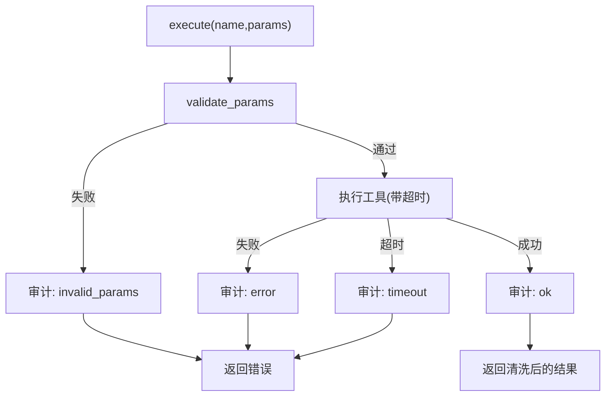

# 工具配置

<cite>
**本文引用的文件**
- [agent-diva-agent/src/tool_config/mod.rs](file://agent-diva-agent/src/tool_config/mod.rs)
- [agent-diva-agent/src/tool_config/builtin.rs](file://agent-diva-agent/src/tool_config/builtin.rs)
- [agent-diva-agent/src/tool_config/network.rs](file://agent-diva-agent/src/tool_config/network.rs)
- [agent-diva-agent/src/agent_loop.rs](file://agent-diva-agent/src/agent_loop.rs)
- [agent-diva-tooling/src/lib.rs](file://agent-diva-tooling/src/lib.rs)
- [agent-diva-tooling/src/base.rs](file://agent-diva-tooling/src/base.rs)
- [agent-diva-tooling/src/registry.rs](file://agent-diva-tooling/src/registry.rs)
- [agent-diva-tools/src/lib.rs](file://agent-diva-tools/src/lib.rs)
- [agent-diva-tools/src/tool_discovery.rs](file://agent-diva-tools/src/tool_discovery.rs)
- [agent-diva-tools/src/shell.rs](file://agent-diva-tools/src/shell.rs)
- [agent-diva-core/src/config/schema.rs](file://agent-diva-core/src/config/schema.rs)
- [agent-diva-core/src/security/rate_limit.rs](file://agent-diva-core/src/security/rate_limit.rs)
- [agent-diva-manager/src/manager.rs](file://agent-diva-manager/src/manager.rs)
</cite>

## 目录
1. [简介](#简介)
2. [项目结构](#项目结构)
3. [核心组件](#核心组件)
4. [架构总览](#架构总览)
5. [详细组件分析](#详细组件分析)
6. [依赖关系分析](#依赖关系分析)
7. [性能与资源限制](#性能与资源限制)
8. [故障排查指南](#故障排查指南)
9. [结论](#结论)
10. [附录：配置示例与最佳实践](#附录配置示例与最佳实践)

## 简介
本文件面向“工具系统”的配置与注册机制，覆盖内置工具的启用/禁用、参数配置、权限控制；自定义工具的发现与加载；工具组合使用；调用限制与资源配额；以及性能监控与调试。目标是帮助读者在不深入源码的情况下，也能正确配置并安全高效地使用工具系统。

## 项目结构
工具系统的配置与执行由多个模块协作完成：
- 顶层配置与运行时装配：位于 agent-diva-agent，负责读取配置、组装工具集合并提供运行期能力（如网络、计划任务等）。
- 工具注册与执行内核：位于 agent-diva-tooling，提供统一的 Tool 接口、ToolRegistry、延迟激活机制、审计与超时控制。
- 内置工具实现：位于 agent-diva-tools，包含文件系统、Shell、Web、记忆、MCP、计划等具体工具。
- 策略与权限：位于 agent-diva-core 的 schema 与 mask 策略，定义 Mask 级别的 allow/deny、只读模式、审批策略等。
- 管理器映射：agent-diva-manager 将全局配置映射为网络工具运行时配置。

图表来源
- [agent-diva-agent/src/tool_config/mod.rs:11-50](file://agent-diva-agent/src/tool_config/mod.rs#L11-L50)
- [agent-diva-tooling/src/registry.rs:362-532](file://agent-diva-tooling/src/registry.rs#L362-L532)
- [agent-diva-tools/src/lib.rs:1-74](file://agent-diva-tools/src/lib.rs#L1-L74)
- [agent-diva-core/src/config/schema.rs:99-161](file://agent-diva-core/src/config/schema.rs#L99-L161)
- [agent-diva-manager/src/manager.rs:123-142](file://agent-diva-manager/src/manager.rs#L123-L142)

章节来源
- [agent-diva-agent/src/tool_config/mod.rs:11-50](file://agent-diva-agent/src/tool_config/mod.rs#L11-L50)
- [agent-diva-tooling/src/lib.rs:1-14](file://agent-diva-tooling/src/lib.rs#L1-L14)
- [agent-diva-tools/src/lib.rs:1-74](file://agent-diva-tools/src/lib.rs#L1-L74)
- [agent-diva-core/src/config/schema.rs:99-161](file://agent-diva-core/src/config/schema.rs#L99-L161)
- [agent-diva-manager/src/manager.rs:123-142](file://agent-diva-manager/src/manager.rs#L123-L142)

## 核心组件
- 内置工具开关：BuiltInToolsConfig 提供 filesystem、shell、web_search、web_fetch、spawn、cron、mcp、attachment、enqueue_background_task、update_plan、ask_user、memory、working_memory、tool_discovery 等布尔开关，并提供 minimal/none/all/for_subagent 预设。
- 网络工具运行时配置：NetworkToolConfig/WebRuntimeConfig/WebSearchRuntimeConfig/WebFetchRuntimeConfig，用于控制搜索提供者、是否启用、API Key、最大结果数等。
- 工具注册与执行：ToolRegistry 统一注册、查询、执行工具，支持核心/延迟两类 Schema 分区，提供全局超时、参数校验、审计、输出清洗、错误分类。
- 延迟激活（自定义/扩展工具）：通过 DeferredToolActivationHandle 维护授权目录与当前激活集合，配合 tool_search 动态暴露工具 Schema。
- 策略与权限：Mask 的 ToolLimits 允许 allow/deny 列表，结合 read-only 模式过滤写操作工具；子代理继承父级能力并进一步裁剪。
- 计划子系统：PlanningConfig 提供工作区内的 SQLite 持久化与进程内注册表，用于计划类工具。

章节来源
- [agent-diva-agent/src/tool_config/builtin.rs:1-159](file://agent-diva-agent/src/tool_config/builtin.rs#L1-L159)
- [agent-diva-agent/src/tool_config/network.rs:1-78](file://agent-diva-agent/src/tool_config/network.rs#L1-L78)
- [agent-diva-tooling/src/registry.rs:362-532](file://agent-diva-tooling/src/registry.rs#L362-L532)
- [agent-diva-core/src/config/schema.rs:99-161](file://agent-diva-core/src/config/schema.rs#L99-L161)
- [agent-diva-agent/src/tool_config/mod.rs:11-50](file://agent-diva-agent/src/tool_config/mod.rs#L11-L50)

## 架构总览
下图展示了从配置到工具执行的完整链路，包括延迟激活、参数校验、审计与超时控制。

图表来源
- [agent-diva-tooling/src/registry.rs:534-699](file://agent-diva-tooling/src/registry.rs#L534-L699)
- [agent-diva-tooling/src/base.rs:41-91](file://agent-diva-tooling/src/base.rs#L41-L91)

章节来源
- [agent-diva-tooling/src/registry.rs:534-699](file://agent-diva-tooling/src/registry.rs#L534-L699)
- [agent-diva-tooling/src/base.rs:41-91](file://agent-diva-tooling/src/base.rs#L41-L91)

## 详细组件分析

### 内置工具启用/禁用与子代理裁剪
- BuiltInToolsConfig 提供细粒度开关，默认多数开启，cron/enqueue_background_task 默认关闭。
- for_subagent() 会关闭 spawn/cron/attachment/enqueue_background_task/update_plan/ask_user/memory/working_memory，保留基础读写与网络能力，避免递归与控制面工具被误用。

图表来源
- [agent-diva-agent/src/tool_config/builtin.rs:41-117](file://agent-diva-agent/src/tool_config/builtin.rs#L41-L117)

章节来源
- [agent-diva-agent/src/tool_config/builtin.rs:1-159](file://agent-diva-agent/src/tool_config/builtin.rs#L1-L159)

### 网络工具运行时配置
- WebSearchRuntimeConfig：provider、enabled、api_key、max_results，并对不同 provider 做 max_results 上限归一化。
- WebFetchRuntimeConfig：enabled 开关。
- manager 会将全局配置映射为 NetworkToolConfig，供工具运行时使用。

章节来源
- [agent-diva-agent/src/tool_config/network.rs:1-78](file://agent-diva-agent/src/tool_config/network.rs#L1-L78)
- [agent-diva-manager/src/manager.rs:123-142](file://agent-diva-manager/src/manager.rs#L123-L142)

### 自定义工具的发现与加载（延迟激活）
- 自定义/扩展工具以“延迟”方式注册，不会立即出现在 Schema 列表中。
- 通过 tool_search 按名称、描述、Schema 关键词检索，返回前 N 个并激活，下一轮模型调用可见。
- 同一轮次可重建注册表并恢复激活状态，保证稳定性。

图表来源
- [agent-diva-tools/src/tool_discovery.rs:19-58](file://agent-diva-tools/src/tool_discovery.rs#L19-L58)
- [agent-diva-tooling/src/registry.rs:154-197](file://agent-diva-tooling/src/registry.rs#L154-L197)
- [agent-diva-tooling/src/registry.rs:415-450](file://agent-diva-tooling/src/registry.rs#L415-L450)

章节来源
- [agent-diva-tools/src/tool_discovery.rs:1-118](file://agent-diva-tools/src/tool_discovery.rs#L1-L118)
- [agent-diva-tooling/src/registry.rs:154-197](file://agent-diva-tooling/src/registry.rs#L154-L197)
- [agent-diva-tooling/src/registry.rs:415-450](file://agent-diva-tooling/src/registry.rs#L415-L450)

### 权限设置与 Mask 策略
- ToolLimits.allow/deny 决定最终可用工具集合；未知工具名会被忽略。
- Assist/只读模式仅暴露安全读取工具（read_file、list_dir、read_attachment、web_search、web_fetch、tool_search）。
- 子代理继承父级能力并进一步裁剪，确保 child ⊆ parent。

图表来源
- [agent-diva-agent/src/mask/tool_policy.rs:35-87](file://agent-diva-agent/src/mask/tool_policy.rs#L35-L87)
- [agent-diva-agent/src/mask/tool_policy.rs:122-145](file://agent-diva-agent/src/mask/tool_policy.rs#L122-L145)

章节来源
- [agent-diva-core/src/config/schema.rs:99-161](file://agent-diva-core/src/config/schema.rs#L99-L161)
- [agent-diva-agent/src/mask/tool_policy.rs:35-87](file://agent-diva-agent/src/mask/tool_policy.rs#L35-L87)
- [agent-diva-agent/src/mask/tool_policy.rs:122-145](file://agent-diva-agent/src/mask/tool_policy.rs#L122-L145)

### 工具组合使用与装配
- Agent 层 ToolConfig 聚合内置开关、网络配置、计划子系统、审批策略、MCP 服务器、Cron 服务、后台任务存储等。
- 工具装配时根据配置决定是否注册对应工具（例如 ask_user 在 headless 模式下以不可用方式注册）。
- 测试用例验证了自定义工具默认隐藏，需通过 tool_search 激活后才可见。

章节来源
- [agent-diva-agent/src/agent_loop.rs:66-96](file://agent-diva-agent/src/agent_loop.rs#L66-L96)
- [agent-diva-agent/src/tool_assembly.rs:750-791](file://agent-diva-agent/src/tool_assembly.rs#L750-L791)

### 计划子系统配置
- PlanningConfig 在工作区下创建 .agent-diva 数据目录，清理旧规划数据，初始化 SQLite 池与进程内注册表。
- 当存在时，计划工具与钩子才会激活。

章节来源
- [agent-diva-agent/src/tool_config/mod.rs:11-50](file://agent-diva-agent/src/tool_config/mod.rs#L11-L50)

## 依赖关系分析
- agent-diva-tooling 提供通用工具抽象与注册中心，被 agent-diva-tools 和上层 agent 使用。
- agent-diva-tools 实现具体工具，并通过 registry 重导出共享注册表类型。
- agent-diva-core 提供配置 schema、安全限流、沙箱策略等基础能力。
- agent-diva-agent 负责装配与运行期控制。
- agent-diva-manager 将全局配置映射为工具运行时配置。

图表来源
- [agent-diva-tooling/src/lib.rs:1-14](file://agent-diva-tooling/src/lib.rs#L1-L14)
- [agent-diva-tools/src/lib.rs:1-74](file://agent-diva-tools/src/lib.rs#L1-L74)
- [agent-diva-core/src/config/schema.rs:278-309](file://agent-diva-core/src/config/schema.rs#L278-L309)
- [agent-diva-agent/src/agent_loop.rs:66-96](file://agent-diva-agent/src/agent_loop.rs#L66-L96)
- [agent-diva-manager/src/manager.rs:123-142](file://agent-diva-manager/src/manager.rs#L123-L142)

章节来源
- [agent-diva-tooling/src/lib.rs:1-14](file://agent-diva-tooling/src/lib.rs#L1-L14)
- [agent-diva-tools/src/lib.rs:1-74](file://agent-diva-tools/src/lib.rs#L1-L74)
- [agent-diva-core/src/config/schema.rs:278-309](file://agent-diva-core/src/config/schema.rs#L278-L309)
- [agent-diva-agent/src/agent_loop.rs:66-96](file://agent-diva-agent/src/agent_loop.rs#L66-L96)
- [agent-diva-manager/src/manager.rs:123-142](file://agent-diva-manager/src/manager.rs#L123-L142)

## 性能与资源限制
- 全局超时：ToolRegistry 默认 120s，可通过 with_timeout 定制；每个工具也可声明自身超时（如 shell 工具叠加额外时间）。
- 延迟激活上限：MAX_ACTIVE_DEFERRED_TOOLS 限制单次激活数量，避免暴露过多工具。
- 输出清洗与安全：执行结果经 sanitize_tool_output 处理，防止注入与敏感信息泄露。
- 审计追踪：每次执行均记录工具名、耗时、结果大小、状态，便于定位问题。
- 速率限制：ActionTracker 提供滑动窗口计数，可用于对敏感动作进行限流。

图表来源
- [agent-diva-tooling/src/registry.rs:534-699](file://agent-diva-tooling/src/registry.rs#L534-L699)
- [agent-diva-tooling/src/registry.rs:42-43](file://agent-diva-tooling/src/registry.rs#L42-L43)
- [agent-diva-tooling/src/base.rs:81-87](file://agent-diva-tooling/src/base.rs#L81-L87)
- [agent-diva-core/src/security/rate_limit.rs:1-181](file://agent-diva-core/src/security/rate_limit.rs#L1-L181)

章节来源
- [agent-diva-tooling/src/registry.rs:42-43](file://agent-diva-tooling/src/registry.rs#L42-L43)
- [agent-diva-tooling/src/registry.rs:534-699](file://agent-diva-tooling/src/registry.rs#L534-L699)
- [agent-diva-tooling/src/base.rs:81-87](file://agent-diva-tooling/src/base.rs#L81-L87)
- [agent-diva-core/src/security/rate_limit.rs:1-181](file://agent-diva-core/src/security/rate_limit.rs#L1-L181)

## 故障排查指南
- 工具未找到或未激活
  - 现象：ToolError::ToolUnavailable 或 not_found。
  - 排查：确认工具是否已注册；若是延迟工具，是否已通过 tool_search 激活；检查 active_deferred_tools_snapshot。
- 参数校验失败
  - 现象：InvalidParams。
  - 排查：查看审计日志中的参数与问题字符提示；核对工具 Schema 必填字段。
- 执行超时
  - 现象：Timeout。
  - 排查：调整 global_timeout_secs 或工具自身超时；检查外部依赖（网络、MCP、数据库）响应。
- 权限拒绝
  - 现象：工具不在可用集合中。
  - 排查：检查 Mask 的 allow/deny；Assist 模式下是否被过滤；子代理是否继承了父级能力。
- 网络工具不可用
  - 现象：web_search/web_fetch 不生效。
  - 排查：确认 NetworkToolConfig.enabled、provider、api_key、max_results 是否正确映射。

章节来源
- [agent-diva-tooling/src/registry.rs:534-699](file://agent-diva-tooling/src/registry.rs#L534-L699)
- [agent-diva-agent/src/mask/tool_policy.rs:35-87](file://agent-diva-agent/src/mask/tool_policy.rs#L35-L87)
- [agent-diva-manager/src/manager.rs:123-142](file://agent-diva-manager/src/manager.rs#L123-L142)

## 结论
工具系统通过“配置驱动 + 注册中心 + 延迟激活 + 策略管控”的组合，实现了灵活、安全、可扩展的工具生态。通过合理的内置开关、Mask 权限、超时与审计，可以在保障安全的前提下最大化工具能力；借助 tool_search 与 deferred 机制，可以按需暴露自定义工具，满足复杂场景需求。

## 附录：配置示例与最佳实践
- 启用/禁用内置工具
  - 使用 BuiltInToolsConfig::minimal()/none()/all() 快速设定基线，再按需微调。
  - 子代理建议使用 for_subagent() 裁剪危险与控制面工具。
- 网络工具配置
  - 设置 provider、enabled、api_key、max_results；注意不同 provider 的 max_results 上限会被归一化。
- 权限与只读模式
  - 使用 ToolLimits.allow/deny 精确控制可用工具；在 Assist 模式下仅暴露只读工具。
- 自定义工具发现
  - 将自定义工具以延迟方式注册；通过 tool_search 查询并激活，下一轮可见。
- 调用限制与配额
  - 合理设置 global_timeout_secs；必要时为关键工具单独设置更短超时；利用 ActionTracker 对敏感动作限流。
- 监控与调试
  - 关注审计事件（工具名、耗时、结果大小、状态）；遇到参数错误时查看问题字符提示；使用 active_deferred_tools_snapshot 检查激活状态。

章节来源
- [agent-diva-agent/src/tool_config/builtin.rs:41-117](file://agent-diva-agent/src/tool_config/builtin.rs#L41-L117)
- [agent-diva-agent/src/tool_config/network.rs:1-78](file://agent-diva-agent/src/tool_config/network.rs#L1-L78)
- [agent-diva-agent/src/mask/tool_policy.rs:35-87](file://agent-diva-agent/src/mask/tool_policy.rs#L35-L87)
- [agent-diva-tools/src/tool_discovery.rs:19-58](file://agent-diva-tools/src/tool_discovery.rs#L19-L58)
- [agent-diva-tooling/src/registry.rs:534-699](file://agent-diva-tooling/src/registry.rs#L534-L699)
- [agent-diva-core/src/security/rate_limit.rs:1-181](file://agent-diva-core/src/security/rate_limit.rs#L1-L181)