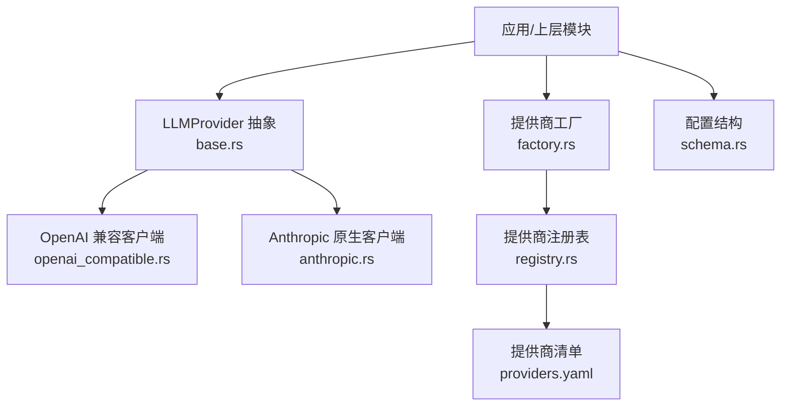
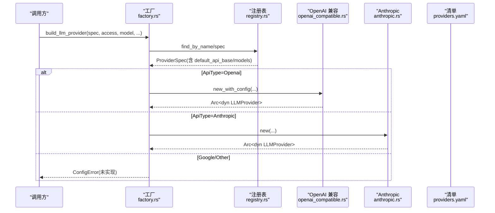
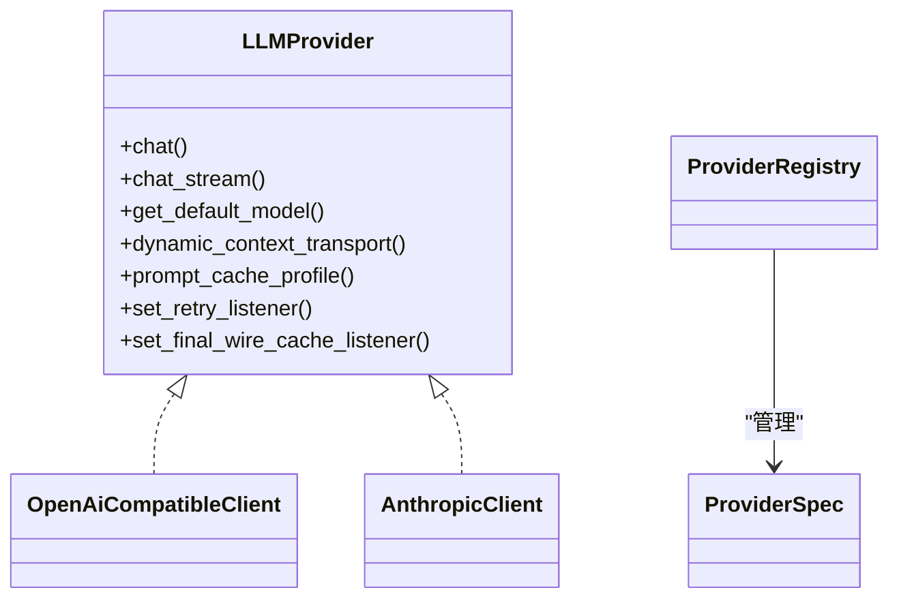

# 官方提供商

<cite>
**本文引用的文件**
- [lib.rs](file://agent-diva-providers/src/lib.rs)
- [base.rs](file://agent-diva-providers/src/base.rs)
- [factory.rs](file://agent-diva-providers/src/factory.rs)
- [registry.rs](file://agent-diva-providers/src/registry.rs)
- [catalog.rs](file://agent-diva-providers/src/catalog.rs)
- [openai_compatible.rs](file://agent-diva-providers/src/openai_compatible.rs)
- [anthropic.rs](file://agent-diva-providers/src/anthropic.rs)
- [providers.yaml](file://agent-diva-providers/src/providers.yaml)
- [schema.rs](file://agent-diva-core/src/config/schema.rs)
</cite>

## 目录
1. [简介](#简介)
2. [项目结构](#项目结构)
3. [核心组件](#核心组件)
4. [架构总览](#架构总览)
5. [详细组件分析](#详细组件分析)
6. [依赖关系分析](#依赖关系分析)
7. [性能考量](#性能考量)
8. [故障排查指南](#故障排查指南)
9. [结论](#结论)
10. [附录](#附录)

## 简介
本文件面向“官方提供商”的配置与使用，聚焦 OpenAI、Anthropic Claude、Google Gemini 等主流官方或兼容端点。文档涵盖：
- API 密钥与环境变量配置
- 默认模型设置与模型列表
- 工具调用、流式响应、推理内容（thinking/reasoning）支持
- 长上下文与提示缓存策略
- 多模态能力现状与建议
- 常见问题与排错建议
- 性能对比与选型建议

## 项目结构
提供商子系统位于 agent-diva-providers 包，提供统一的 LLMProvider 抽象，并通过工厂按 API 类型构建具体客户端；内置注册表与 YAML 清单管理各提供商元数据（默认模型、API Base、模型列表、是否支持提示缓存等）。核心配置结构在 agent-diva-core 中定义。

图表来源
- [base.rs:708-780](file://agent-diva-providers/src/base.rs#L708-L780)
- [factory.rs:23-70](file://agent-diva-providers/src/factory.rs#L23-L70)
- [registry.rs:78-107](file://agent-diva-providers/src/registry.rs#L78-L107)
- [providers.yaml:77-189](file://agent-diva-providers/src/providers.yaml#L77-L189)
- [schema.rs:1226-1255](file://agent-diva-core/src/config/schema.rs#L1226-L1255)

章节来源
- [lib.rs:1-42](file://agent-diva-providers/src/lib.rs#L1-L42)
- [registry.rs:1-107](file://agent-diva-providers/src/registry.rs#L1-L107)
- [schema.rs:1200-1255](file://agent-diva-core/src/config/schema.rs#L1200-L1255)

## 核心组件
- LLMProvider 抽象：统一 chat/chat_stream、默认模型、动态上下文传输方式、提示缓存策略、重试监听器接口。
- 工厂 build_llm_provider：根据 ProviderSpec.api_type 选择 OpenAI 兼容或 Anthropic 客户端；对 Google/Other 返回配置错误（当前未实现）。
- 注册表与清单：从 providers.yaml 加载内置提供商元信息（名称、默认模型、API Base、模型列表、是否支持提示缓存等），并支持按模型名反向查找提供商。
- 配置结构：每个提供商的 api_key、api_base、extra_headers、custom_models、reasoning_config、response_protocol。

章节来源
- [base.rs:708-780](file://agent-diva-providers/src/base.rs#L708-L780)
- [factory.rs:23-70](file://agent-diva-providers/src/factory.rs#L23-L70)
- [registry.rs:78-107](file://agent-diva-providers/src/registry.rs#L78-L107)
- [schema.rs:1226-1255](file://agent-diva-core/src/config/schema.rs#L1226-L1255)

## 架构总览

图表来源
- [factory.rs:23-70](file://agent-diva-providers/src/factory.rs#L23-L70)
- [registry.rs:78-107](file://agent-diva-providers/src/registry.rs#L78-L107)
- [providers.yaml:77-189](file://agent-diva-providers/src/providers.yaml#L77-L189)

## 详细组件分析

### OpenAI 兼容客户端（适用于 OpenAI、Gemini 兼容端点、第三方网关）
- 作用：以 OpenAI 兼容协议发送请求，解析标准 JSON 响应与 SSE 流；支持工具调用、推理内容（reasoning_content）、提示缓存（cache_control）注入。
- 关键特性
  - 工具调用：自动处理 tool_calls 与参数解析，支持流式增量组装。
  - 推理内容：当 response_protocol 为 DeepseekV4Dsml 时走专用解码路径；否则保留 reasoning_content。
  - 提示缓存：对首个 system 文本块与最后一个 tool 标记 ephemeral 缓存控制，提升重复系统提示的命中率。
  - 消息清洗：去除 ANSI 转义与控制字符，避免 JSON 解析失败。
  - 模型覆盖：按 registry 中的 model_overrides 注入 per-model 参数。
- 默认模型与 API Base
  - 若未显式传入 api_base，则回退到 spec.default_api_base；最终兜底为本地端口。
  - 默认模型来自构建选项或清单。
- 模型能力
  - 通过 base.rs 的能力表判断 vision/tools/reasoning/context_window。
- 典型配置
  - OpenAI：api_key=OPENAI_API_KEY，default_api_base=https://api.openai.com/v1，默认模型 gpt-4o/gpt-5 系列。
  - Gemini：通过 openai 兼容端点访问（如 generativelanguage.googleapis.com/v1beta），默认模型 gemini-2.0-flash 等。
- 注意事项
  - 不要在此层改写模型 ID 前缀；仅透传上游配置的模型名。
  - 某些严格端点要求 assistant 带 tool_calls 时 content 为 null，已做归一化。

章节来源
- [openai_compatible.rs:168-342](file://agent-diva-providers/src/openai_compatible.rs#L168-L342)
- [openai_compatible.rs:344-423](file://agent-diva-providers/src/openai_compatible.rs#L344-L423)
- [openai_compatible.rs:448-542](file://agent-diva-providers/src/openai_compatible.rs#L448-L542)
- [openai_compatible.rs:544-660](file://agent-diva-providers/src/openai_compatible.rs#L544-L660)
- [base.rs:155-264](file://agent-diva-providers/src/base.rs#L155-L264)
- [providers.yaml:106-189](file://agent-diva-providers/src/providers.yaml#L106-L189)

### Anthropic Claude 客户端（原生 Messages API）
- 作用：直接调用 Anthropic Messages API，支持文本、thinking（推理过程）、tool_use/tool_result、SSE 流式事件。
- 关键特性
  - 工具调用：将工具定义转换为 Anthropic Tool 格式，支持 cache_control 注入。
  - 推理内容：thinking 块作为 reasoning_content 透出。
  - 流式处理：message_start/content_block_delta/message_stop 等事件拼装最终响应。
  - 提示缓存：首个 system 文本块标记 ephemeral。
- 默认模型与 API Base
  - 默认 API Base 为 https://api.anthropic.com；默认模型来自清单（claude-sonnet-4-5 等）。
- 模型能力
  - 能力表包含 claude-3/4 系列 reasoning 与上下文窗口大小。
- 注意事项
  - 图片输入尚未实现（会返回配置错误）。
  - 工具消息必须携带 tool_call_id。

章节来源
- [anthropic.rs:170-264](file://agent-diva-providers/src/anthropic.rs#L170-L264)
- [anthropic.rs:313-380](file://agent-diva-providers/src/anthropic.rs#L313-L380)
- [anthropic.rs:382-570](file://agent-diva-providers/src/anthropic.rs#L382-L570)
- [anthropic.rs:577-737](file://agent-diva-providers/src/anthropic.rs#L577-L737)
- [providers.yaml:77-104](file://agent-diva-providers/src/providers.yaml#L77-L104)
- [base.rs:188-246](file://agent-diva-providers/src/base.rs#L188-L246)

### Google Gemini（当前通过 OpenAI 兼容端点接入）
- 现状：provider 工厂对 ApiType::Google 返回配置错误，表示原生 Gemini 客户端尚未实现；但清单中将 gemini 定义为 openai 兼容端点，可通过通用客户端访问。
- 配置要点
  - 使用 openai 兼容客户端，api_base 指向 generativelanguage.googleapis.com/v1beta。
  - 设置 GEMINI_API_KEY。
  - 默认模型为 gemini-2.0-flash（可替换为其他 gemini-* 模型）。
- 能力说明
  - 能力表将部分 gemini 模型标记为 reasoning 与超大上下文窗口（例如 1M+ tokens）。
  - 多模态能力取决于底层端点与模型；当前客户端不主动构造图像载荷，需确保模型具备该能力且上层正确传递。
- 限制
  - 非原生适配器，功能受限于 OpenAI 兼容协议表达范围。

章节来源
- [factory.rs:42-69](file://agent-diva-providers/src/factory.rs#L42-L69)
- [providers.yaml:165-189](file://agent-diva-providers/src/providers.yaml#L165-L189)
- [base.rs:188-246](file://agent-diva-providers/src/base.rs#L188-L246)

### 提供商清单与注册表
- 清单 providers.yaml 集中声明各提供商的：
  - name、api_type、keywords、env_key、display_name、default_model、default_api_base、models、supports_prompt_caching 等。
  - 内置 provider 包括 anthropic、openai、gemini、deepseek、dashscope、moonshot、minimax、vllm、groq、xai、zhipu 等。
- 注册表支持：
  - 按名称/模型关键词查找 ProviderSpec。
  - 导出默认模型、API Base、模型列表、是否支持提示缓存。

章节来源
- [providers.yaml:1-800](file://agent-diva-providers/src/providers.yaml#L1-L800)
- [registry.rs:78-107](file://agent-diva-providers/src/registry.rs#L78-L107)

### 配置结构与环境变量
- 每个提供商在 ProvidersConfig 下拥有独立字段（如 openai、anthropic、gemini 等），字段包含：
  - api_key：对应环境变量的值（由上层装配）。
  - api_base：可选覆盖默认端点。
  - extra_headers：自定义请求头。
  - custom_models：用户追加的模型。
  - reasoning_config：用于动态判定模型是否具备推理能力。
  - response_protocol：OpenAI 兼容端点的响应协议（默认 OpenaiJson，可选 DeepseekV4Dsml）。
- 常见环境变量键（来自清单 env_key）：
  - OPENAI_API_KEY、ANTHROPIC_API_KEY、GEMINI_API_KEY、DEEPSEEK_API_KEY、DASHSCOPE_API_KEY、MOONSHOT_API_KEY、MINIMAX_API_KEY 等。

章节来源
- [schema.rs:1200-1255](file://agent-diva-core/src/config/schema.rs#L1200-L1255)
- [providers.yaml:1-800](file://agent-diva-providers/src/providers.yaml#L1-L800)

## 依赖关系分析

图表来源
- [base.rs:708-780](file://agent-diva-providers/src/base.rs#L708-L780)
- [registry.rs:78-107](file://agent-diva-providers/src/registry.rs#L78-L107)

章节来源
- [base.rs:708-780](file://agent-diva-providers/src/base.rs#L708-L780)
- [registry.rs:78-107](file://agent-diva-providers/src/registry.rs#L78-L107)

## 性能考量
- 流式响应：OpenAI 兼容与 Anthropic 均支持 SSE 流式输出，降低首字延迟。
- 提示缓存：对首个 system 文本块与最后一个 tool 标记 ephemeral，提高重复系统提示命中，减少 token 消耗与延迟。
- 模型能力与上下文：
  - 能力表给出不同模型的 context_window 估计，便于上层进行上下文预算与压缩决策。
  - 推理模型（thinking/reasoning）可能带来额外 token 与延迟，可按需启用。
- 重试与超时：HTTP 层具备超时与重试机制，异常分类区分可重试与致命错误。

章节来源
- [openai_compatible.rs:370-423](file://agent-diva-providers/src/openai_compatible.rs#L370-L423)
- [anthropic.rs:330-332](file://agent-diva-providers/src/anthropic.rs#L330-L332)
- [base.rs:188-246](file://agent-diva-providers/src/base.rs#L188-L246)

## 故障排查指南
- 无法构建 Google 提供商
  - 现象：构建时返回配置错误（未实现）。
  - 解决：使用 OpenAI 兼容客户端通过 gemini 兼容端点访问；或等待原生适配。
  - 参考：[factory.rs:42-69](file://agent-diva-providers/src/factory.rs#L42-L69)
- Anthropic 图片输入报错
  - 现象：传入图片内容时报配置错误。
  - 解决：当前未实现图片输入，改用纯文本或等待后续支持。
  - 参考：[anthropic.rs:675-679](file://agent-diva-providers/src/anthropic.rs#L675-L679)
- 工具调用参数解析失败
  - 现象：工具参数 JSON 解析异常。
  - 解决：检查模型输出是否为合法 JSON；客户端已尝试二次解包与原始字符串回退，但仍需关注模型行为。
  - 参考：[openai_compatible.rs:460-506](file://agent-diva-providers/src/openai_compatible.rs#L460-L506)
- 流式响应中断或超时
  - 现象：长时间无数据或连接断开。
  - 解决：检查网络与提供商限流；客户端有超时与空闲超时保护。
  - 参考：[anthropic.rs:438-454](file://agent-diva-providers/src/anthropic.rs#L438-L454)
- 提示缓存未生效
  - 现象：重复系统提示未命中缓存。
  - 解决：确认首个 system 文本块存在且未被后续消息覆盖；客户端会自动标记 ephemeral。
  - 参考：[openai_compatible.rs:383-423](file://agent-diva-providers/src/openai_compatible.rs#L383-L423), [anthropic.rs:226-239](file://agent-diva-providers/src/anthropic.rs#L226-L239)

章节来源
- [factory.rs:42-69](file://agent-diva-providers/src/factory.rs#L42-L69)
- [anthropic.rs:675-679](file://agent-diva-providers/src/anthropic.rs#L675-L679)
- [openai_compatible.rs:460-506](file://agent-diva-providers/src/openai_compatible.rs#L460-L506)
- [anthropic.rs:438-454](file://agent-diva-providers/src/anthropic.rs#L438-L454)
- [openai_compatible.rs:383-423](file://agent-diva-providers/src/openai_compatible.rs#L383-L423)
- [anthropic.rs:226-239](file://agent-diva-providers/src/anthropic.rs#L226-L239)

## 结论
- OpenAI 兼容客户端是本项目的主要通道，既可用于 OpenAI 自身，也可用于 Gemini 兼容端点与其他第三方网关。
- Anthropic 提供原生 Messages API 客户端，具备 thinking 与工具调用能力，适合需要深度推理过程的场景。
- Google Gemini 当前通过 OpenAI 兼容端点接入，具备大上下文与推理能力，但多模态需结合模型与端点能力谨慎使用。
- 建议优先使用清单中定义的默认模型与 API Base，按需通过 config 覆盖；开启提示缓存以提升效率；根据任务需求选择推理模型与非推理模型。

## 附录

### 配置示例（文字描述）
- OpenAI
  - 设置 OPENAI_API_KEY。
  - 默认 API Base 为 https://api.openai.com/v1。
  - 默认模型为 gpt-4o 或 gpt-5 系列（见清单）。
  - 可在 ProvidersConfig.openai 中设置 api_base、extra_headers、custom_models、reasoning_config、response_protocol。
- Anthropic
  - 设置 ANTHROPIC_API_KEY。
  - 默认 API Base 为 https://api.anthropic.com。
  - 默认模型为 claude-sonnet-4-5（见清单）。
  - 可在 ProvidersConfig.anthropic 中设置 api_base、extra_headers、custom_models、reasoning_config。
- Gemini（OpenAI 兼容）
  - 设置 GEMINI_API_KEY。
  - 使用 openai 兼容客户端，api_base 指向 generativelanguage.googleapis.com/v1beta。
  - 默认模型为 gemini-2.0-flash（见清单）。
  - 可在 ProvidersConfig.gemini 中设置 api_base、extra_headers、custom_models、reasoning_config。

章节来源
- [providers.yaml:77-189](file://agent-diva-providers/src/providers.yaml#L77-L189)
- [schema.rs:1200-1255](file://agent-diva-core/src/config/schema.rs#L1200-L1255)

### 模型能力速查（节选）
- 推理能力（reasoning/thinking）
  - OpenAI：o1/o1-mini/o3-mini/o1-pro
  - Anthropic：claude-3-opus/claude-3-5-sonnet/claude-3-7-sonnet/claude-3-5-haiku/claude-sonnet-4/claude-opus-4
  - Gemini：gemini-2.0-flash-thinking/gemini-2.5-pro/gemini-2.5-flash
  - Qwen：qwen-max/qwen-plus/qwq-32b
  - Doubao：doubao-pro-32k/doubao-lite-32k
  - DeepSeek：deepseek-chat/deepseek-reasoner/deepseek-r1
- 上下文窗口（tokens，估算）
  - Claude 4 系列：最高可达 1M
  - GPT-4.1 系列：约 1M
  - GPT-4o/4o-mini：128K
  - Gemini 2.5 系列：约 1M
  - Qwen 系列：262K
  - Doubao 32K 系列：32K

章节来源
- [base.rs:188-246](file://agent-diva-providers/src/base.rs#L188-L246)