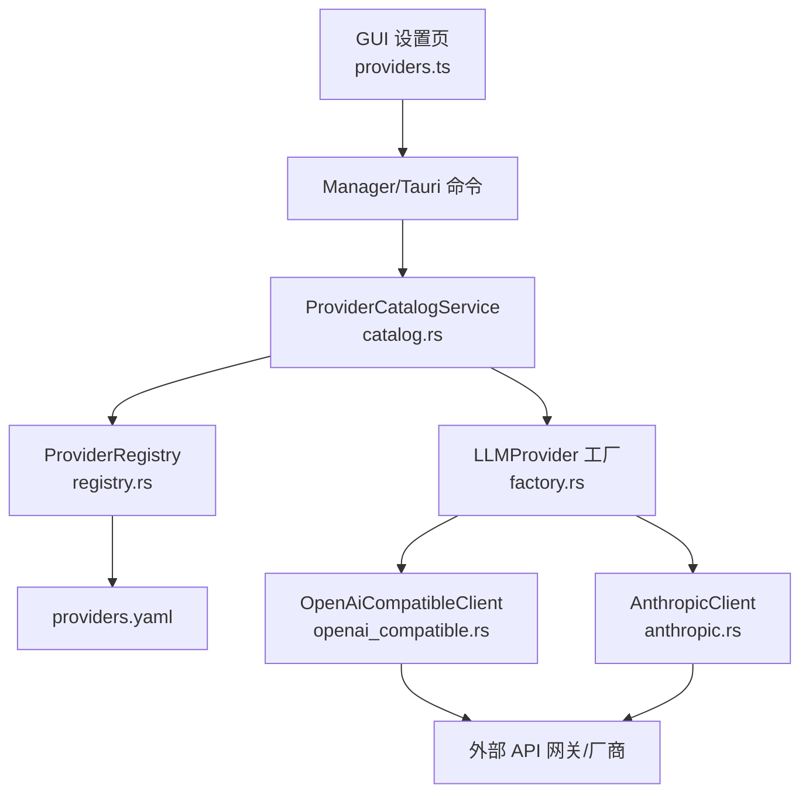
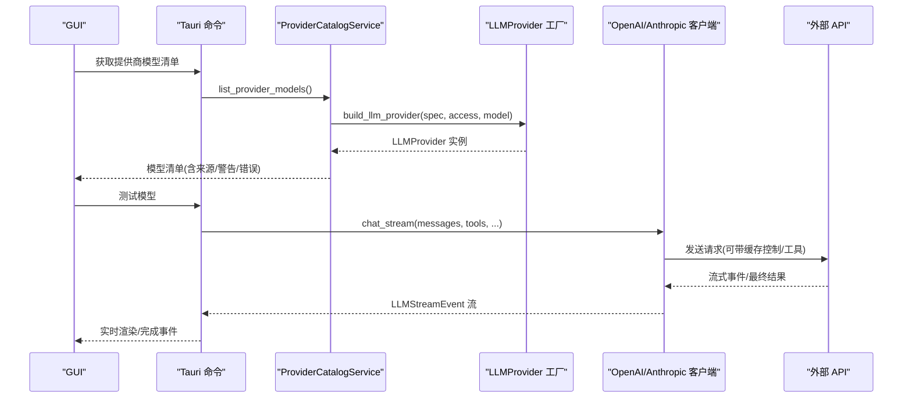
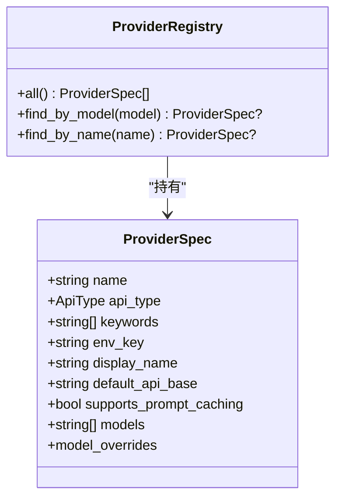
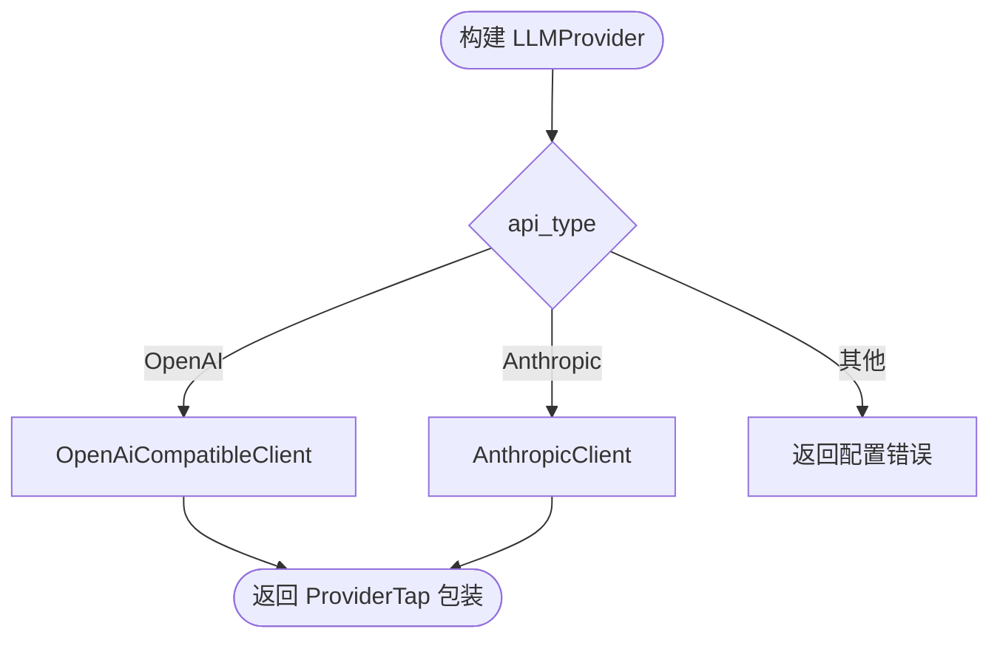
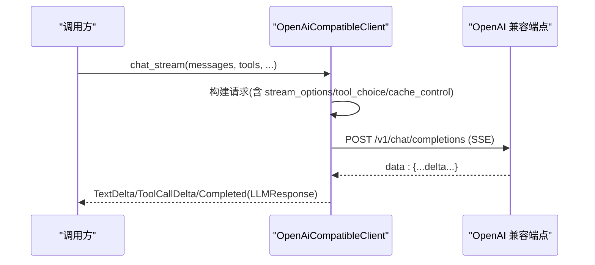
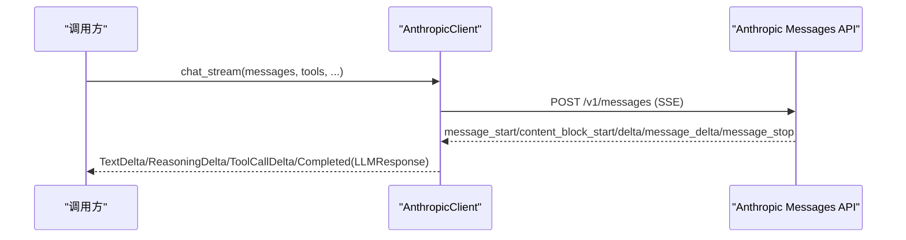
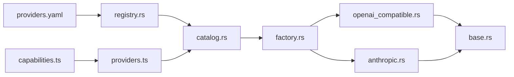

# 提供商对比

<cite>
**本文引用的文件**
- [providers.yaml](file://agent-diva-providers/src/providers.yaml)
- [registry.rs](file://agent-diva-providers/src/registry.rs)
- [catalog.rs](file://agent-diva-providers/src/catalog.rs)
- [factory.rs](file://agent-diva-providers/src/factory.rs)
- [base.rs](file://agent-diva-providers/src/base.rs)
- [openai_compatible.rs](file://agent-diva-providers/src/openai_compatible.rs)
- [anthropic.rs](file://agent-diva-providers/src/anthropic.rs)
- [providers.ts](file://agent-diva-gui/src/api/providers.ts)
- [capabilities.ts](file://agent-diva-gui/src/api/capabilities.ts)
</cite>

## 目录
1. [简介](#简介)
2. [项目结构](#项目结构)
3. [核心组件](#核心组件)
4. [架构总览](#架构总览)
5. [详细组件分析](#详细组件分析)
6. [依赖关系分析](#依赖关系分析)
7. [性能与可用性考量](#性能与可用性考量)
8. [故障排查指南](#故障排查指南)
9. [结论](#结论)
10. [附录：模型规格与能力矩阵](#附录模型规格与能力矩阵)

## 简介
本文件基于代码库中的提供商注册表、能力判定与客户端实现，整理出“提供商能力对比”文档。内容覆盖文本生成、图像理解、工具调用、流式响应等核心能力的支持情况；给出模型规格（上下文长度、输出限制、并发限制）的汇总；并提供面向开发测试、生产部署、成本控制的选型建议与组合策略。

## 项目结构
- 提供商元数据集中定义在 providers.yaml，包含各提供商名称、API 类型、默认模型、默认 API Base、是否网关、是否本地、支持的模型列表等。
- 运行时通过 registry.rs 加载并暴露 ProviderSpec，用于按名称或模型关键字查找提供商。
- catalog.rs 提供 ProviderCatalogService，负责列出提供商视图、解析提供商 ID、合并静态与自定义模型清单、以及动态发现能力标记。
- factory.rs 根据 spec.api_type 构建具体 LLMProvider 实例（OpenAI 兼容或 Anthropic）。
- base.rs 定义统一接口 LLMProvider、消息/流事件、错误分类、模型能力（vision/tools/reasoning/context_window）及保守默认策略。
- openai_compatible.rs 与 anthropic.rs 分别实现 OpenAI 兼容协议与 Anthropic Messages API 的具体请求/响应/流式处理。
- GUI 侧通过 providers.ts 调用后端能力（获取模型清单、测试模型、增删自定义提供商），capabilities.ts 声明 GUI 能力域与权限边界。

**图表来源**
- [providers.yaml:1-1114](file://agent-diva-providers/src/providers.yaml#L1-L1114)
- [registry.rs:73-108](file://agent-diva-providers/src/registry.rs#L73-L108)
- [catalog.rs:71-193](file://agent-diva-providers/src/catalog.rs#L71-L193)
- [factory.rs:23-70](file://agent-diva-providers/src/factory.rs#L23-L70)
- [openai_compatible.rs:168-342](file://agent-diva-providers/src/openai_compatible.rs#L168-L342)
- [anthropic.rs:170-205](file://agent-diva-providers/src/anthropic.rs#L170-L205)

**章节来源**
- [providers.yaml:1-1114](file://agent-diva-providers/src/providers.yaml#L1-L1114)
- [registry.rs:1-200](file://agent-diva-providers/src/registry.rs#L1-L200)
- [catalog.rs:1-664](file://agent-diva-providers/src/catalog.rs#L1-L664)
- [factory.rs:1-170](file://agent-diva-providers/src/factory.rs#L1-L170)
- [base.rs:1-800](file://agent-diva-providers/src/base.rs#L1-L800)
- [openai_compatible.rs:1-800](file://agent-diva-providers/src/openai_compatible.rs#L1-L800)
- [anthropic.rs:1-800](file://agent-diva-providers/src/anthropic.rs#L1-L800)
- [providers.ts:1-94](file://agent-diva-gui/src/api/providers.ts#L1-L94)
- [capabilities.ts:1-263](file://agent-diva-gui/src/api/capabilities.ts#L1-L263)

## 核心组件
- 提供商注册表与元数据：providers.yaml + registry.rs 提供统一的提供商清单与查找能力。
- 提供商目录服务：catalog.rs 提供视图化展示、模型清单合并、运行时发现标记。
- 提供商工厂：factory.rs 依据 api_type 选择 OpenAI 兼容或 Anthropic 客户端。
- 统一接口与能力：base.rs 定义 LLMProvider 接口、流式事件、错误分类、模型能力（vision/tools/reasoning/context_window）。
- 具体客户端：openai_compatible.rs 与 anthropic.rs 实现请求构造、流式解析、工具调用、缓存控制等。
- GUI 集成：providers.ts 暴露获取模型、测试模型、创建/删除自定义提供商等能力；capabilities.ts 声明 GUI 能力域。

**章节来源**
- [registry.rs:73-108](file://agent-diva-providers/src/registry.rs#L73-L108)
- [catalog.rs:71-193](file://agent-diva-providers/src/catalog.rs#L71-L193)
- [factory.rs:23-70](file://agent-diva-providers/src/factory.rs#L23-L70)
- [base.rs:131-264](file://agent-diva-providers/src/base.rs#L131-L264)
- [openai_compatible.rs:168-342](file://agent-diva-providers/src/openai_compatible.rs#L168-L342)
- [anthropic.rs:170-205](file://agent-diva-providers/src/anthropic.rs#L170-L205)
- [providers.ts:42-94](file://agent-diva-gui/src/api/providers.ts#L42-L94)
- [capabilities.ts:82-91](file://agent-diva-gui/src/api/capabilities.ts#L82-L91)

## 架构总览
系统以“配置驱动 + 工厂模式”组织多提供商接入：
- 配置层：providers.yaml 声明提供商、默认模型、API Base、是否网关、是否本地、支持提示词缓存等。
- 注册与目录层：registry.rs 加载 YAML；catalog.rs 提供视图与模型清单合并、运行时发现能力。
- 构建层：factory.rs 根据 api_type 选择 OpenAI 兼容或 Anthropic 客户端。
- 执行层：openai_compatible.rs / anthropic.rs 实现 chat/chat_stream、工具调用、流式事件、缓存控制、错误分类。
- 能力层：base.rs 提供模型能力判断（vision/tools/reasoning/context_window）与保守默认策略。

**图表来源**
- [catalog.rs:161-193](file://agent-diva-providers/src/catalog.rs#L161-L193)
- [factory.rs:23-70](file://agent-diva-providers/src/factory.rs#L23-L70)
- [openai_compatible.rs:616-660](file://agent-diva-providers/src/openai_compatible.rs#L616-L660)
- [anthropic.rs:334-380](file://agent-diva-providers/src/anthropic.rs#L334-L380)
- [providers.ts:42-64](file://agent-diva-gui/src/api/providers.ts#L42-L64)

## 详细组件分析

### 提供商元数据与注册
- providers.yaml 集中管理所有提供商的标识、API 类型、默认模型、默认 API Base、是否网关/本地、支持的模型列表、提示词缓存支持等。
- registry.rs 将 YAML 解析为 ProviderSpec，并提供按名称/模型关键字查找的能力。
- catalog.rs 将内置与自定义提供商合并为视图，支持运行时发现标记（OpenAI 兼容 API 支持动态发现）。

**图表来源**
- [registry.rs:7-50](file://agent-diva-providers/src/registry.rs#L7-L50)
- [registry.rs:73-108](file://agent-diva-providers/src/registry.rs#L73-L108)

**章节来源**
- [providers.yaml:1-1114](file://agent-diva-providers/src/providers.yaml#L1-L1114)
- [registry.rs:1-200](file://agent-diva-providers/src/registry.rs#L1-L200)
- [catalog.rs:71-193](file://agent-diva-providers/src/catalog.rs#L71-L193)

### 提供商工厂与能力判定
- factory.rs 根据 spec.api_type 选择 OpenAI 兼容或 Anthropic 客户端，并注入 reasoning_config/response_protocol 等参数。
- base.rs 提供模型能力判定：vision、tools、reasoning、context_window；未知模型保守默认无可选能力，避免向纯文本模型发送多模态负载。

**图表来源**
- [factory.rs:23-70](file://agent-diva-providers/src/factory.rs#L23-L70)
- [base.rs:131-264](file://agent-diva-providers/src/base.rs#L131-L264)

**章节来源**
- [factory.rs:1-170](file://agent-diva-providers/src/factory.rs#L1-L170)
- [base.rs:131-264](file://agent-diva-providers/src/base.rs#L131-L264)

### OpenAI 兼容客户端
- 请求构造：支持 messages、tools、tool_choice、stream/stream_options、reasoning_effort、max_tokens、temperature。
- 响应解析：支持 tool_calls、usage、finish_reason、reasoning_content；对 DeepSeek V4 DSML 协议有专用解码路径。
- 流式处理：SSE 事件解析、UTF-8 安全解码、工具调用增量拼装。
- 缓存控制：对首个稳定前缀 system 消息或最后一个 tool 添加 cache_control=ephemeral。
- 消息清洗：去除 ANSI 转义与控制字符，防止 JSON 解析失败。

**图表来源**
- [openai_compatible.rs:24-47](file://agent-diva-providers/src/openai_compatible.rs#L24-L47)
- [openai_compatible.rs:616-660](file://agent-diva-providers/src/openai_compatible.rs#L616-L660)
- [openai_compatible.rs:742-760](file://agent-diva-providers/src/openai_compatible.rs#L742-L760)

**章节来源**
- [openai_compatible.rs:1-800](file://agent-diva-providers/src/openai_compatible.rs#L1-L800)

### Anthropic 客户端
- 请求构造：messages、system blocks、tools、stream=true。
- 响应解析：text/thinking/tool_use/tool_result 块映射到 LLMResponse。
- 流式处理：message_start/content_block_start/delta/message_delta/message_stop 事件流，增量拼装 text、thinking、tool_call arguments。
- 缓存控制：首个 system block 标记 ephemeral；最后一个 tool 也可标记 ephemeral。

**图表来源**
- [anthropic.rs:21-33](file://agent-diva-providers/src/anthropic.rs#L21-L33)
- [anthropic.rs:334-380](file://agent-diva-providers/src/anthropic.rs#L334-L380)
- [anthropic.rs:382-570](file://agent-diva-providers/src/anthropic.rs#L382-L570)

**章节来源**
- [anthropic.rs:1-800](file://agent-diva-providers/src/anthropic.rs#L1-L800)

### GUI 能力与提供商交互
- providers.ts 提供 getProviderModels、testProviderModel、addProviderModel、removeProviderModel、createCustomProvider、deleteCustomProvider 等前端调用。
- capabilities.ts 声明 providers 能力域，强调失败时保持关闭状态、不伪造成功。

**章节来源**
- [providers.ts:1-94](file://agent-diva-gui/src/api/providers.ts#L1-L94)
- [capabilities.ts:82-91](file://agent-diva-gui/src/api/capabilities.ts#L82-L91)

## 依赖关系分析
- 配置依赖：providers.yaml 是单一事实源，registry.rs 加载并暴露；catalog.rs 在此基础上提供视图与模型清单。
- 运行时依赖：factory.rs 依赖 registry.rs 与 base.rs 的能力判定；具体客户端依赖 http_util 与 retry 模块。
- GUI 依赖：providers.ts 通过 Tauri invoke 调用后端能力；capabilities.ts 约束 GUI 行为边界。

**图表来源**
- [registry.rs:73-108](file://agent-diva-providers/src/registry.rs#L73-L108)
- [catalog.rs:71-193](file://agent-diva-providers/src/catalog.rs#L71-L193)
- [factory.rs:23-70](file://agent-diva-providers/src/factory.rs#L23-L70)
- [openai_compatible.rs:168-342](file://agent-diva-providers/src/openai_compatible.rs#L168-L342)
- [anthropic.rs:170-205](file://agent-diva-providers/src/anthropic.rs#L170-L205)
- [providers.ts:42-94](file://agent-diva-gui/src/api/providers.ts#L42-L94)
- [capabilities.ts:82-91](file://agent-diva-gui/src/api/capabilities.ts#L82-L91)

**章节来源**
- [registry.rs:1-200](file://agent-diva-providers/src/registry.rs#L1-L200)
- [catalog.rs:1-664](file://agent-diva-providers/src/catalog.rs#L1-L664)
- [factory.rs:1-170](file://agent-diva-providers/src/factory.rs#L1-L170)
- [base.rs:1-800](file://agent-diva-providers/src/base.rs#L1-L800)
- [openai_compatible.rs:1-800](file://agent-diva-providers/src/openai_compatible.rs#L1-L800)
- [anthropic.rs:1-800](file://agent-diva-providers/src/anthropic.rs#L1-L800)
- [providers.ts:1-94](file://agent-diva-gui/src/api/providers.ts#L1-L94)
- [capabilities.ts:1-263](file://agent-diva-gui/src/api/capabilities.ts#L1-L263)

## 性能与可用性考量
- 流式响应：OpenAI 兼容与 Anthropic 均实现 SSE 流式事件，支持文本增量、推理内容增量、工具调用增量，提升首字延迟与用户体验。
- 错误分类：base.rs 将超时、限流、HTTP 错误归类为可重试；配置错误与无效响应为不可重试，便于上层重试策略与降级。
- 提示词缓存：部分提供商（如 Anthropic、OpenAI 兼容）支持 ephemeral 缓存控制，可降低重复系统提示的成本。
- 并发限制：代码未显式暴露全局并发上限；实际并发受限于网络客户端与上游提供商配额。建议结合业务层限流器与提供商速率限制进行控制。
- 上下文窗口：base.rs 提供已知模型的 context_window 表，未知模型保守回退至 128K；Agent 层据此计算预算与压缩阈值。

[本节为通用指导，无需特定文件引用]

## 故障排查指南
- 流式 UTF-8 解码异常：StreamingUtf8Decoder 会在流结束时有不完整字符时报错；检查上游 SSE 数据完整性。
- JSON 解析失败：openai_compatible.rs 对工具调用参数进行二次解码与问题字符定位；查看日志中“Problematic characters found”。
- 工具调用缺失 tool_call_id：Anthropic 要求 tool 消息携带 tool_call_id；若缺失会返回配置错误。
- 模型能力误判：未知模型默认无 vision/tools/reasoning；如需启用需更新 base.rs 能力表或传入 reasoning_config。
- 提供商配置错误：缺少 API Key 或 Base URL 会导致 ConfigError；在 GUI 中通过 testProviderModel 验证连通性。

**章节来源**
- [base.rs:82-129](file://agent-diva-providers/src/base.rs#L82-L129)
- [openai_compatible.rs:448-542](file://agent-diva-providers/src/openai_compatible.rs#L448-L542)
- [anthropic.rs:577-656](file://agent-diva-providers/src/anthropic.rs#L577-L656)
- [providers.ts:53-64](file://agent-diva-gui/src/api/providers.ts#L53-L64)

## 结论
- 本项目通过 providers.yaml + registry/catalog/factory 的组合，实现了多提供商的统一接入与能力抽象。
- 文本生成、工具调用、流式响应在 OpenAI 兼容与 Anthropic 客户端中均有完善实现；图像理解仅在部分模型（如 gpt-4o 系列）被标记为支持。
- 上下文窗口与能力判定集中在 base.rs，便于保守默认与扩展。
- 生产环境建议结合提供商速率限制、重试策略、缓存控制与监控审计，选择合适的提供商组合以满足性能、可用性与成本目标。

[本节为总结，无需特定文件引用]

## 附录：模型规格与能力矩阵
说明：
- 能力矩阵基于 providers.yaml 的模型清单与 base.rs 的能力判定表整理。
- 价格、性能、可用性、限制条件未在代码中直接体现，建议结合官方定价与配额页面评估。
- 上下文窗口来自 base.rs 的 context_window_for_model 表；未知模型保守回退至 128K。

- 文本生成
  - 支持情况：所有已配置的提供商均支持文本生成（chat/chat_stream）。
  - 流式响应：OpenAI 兼容与 Anthropic 均支持 SSE 流式事件。
  - 工具调用：OpenAI 兼容与 Anthropic 均支持工具调用；Anthropic 使用 tool_use/tool_result 块。
  - 推理内容：部分模型支持 reasoning_content/thinking（如 Claude、DeepSeek R1、Gemini thinking、Qwen 思考型）。

- 图像理解
  - 支持情况：base.rs 将 gpt-4o/gpt-4o-mini/gpt-4.1/gpt-4.1-mini 标记为 vision 支持；Anthropic 当前未实现图像输入。
  - 推荐：需要图像理解时优先选择 OpenAI 兼容且模型具备 vision 能力。

- 上下文长度
  - 已知模型上下文窗口（节选）：
    - claude-sonnet-4-6/claude-opus-4-7：约 1,000,000
    - claude-sonnet-4/claude-opus-4：约 200,000
    - gpt-4.1/gpt-4.1-mini：约 1,047,576
    - gpt-4o/gpt-4o-mini：约 128,000
    - gpt-5：约 400,000
    - deepseek-v4-pro/v4-chat：约 1,000,000
    - gemini-2.5-pro/2.5-flash：约 1,048,576
    - grok-4：约 256,000
    - qwen-max/qwen-plus/qwq-32b：约 262,144
  - 未知模型：保守回退至 128,000。

- 输出限制
  - 代码未显式限制 max_tokens；由调用方传入。建议根据模型能力与业务需求合理设置。

- 并发限制
  - 代码未暴露全局并发上限；实际受限于网络客户端与上游提供商配额。建议结合业务层限流器与提供商速率限制进行控制。

- 提供商组合建议
  - 开发测试：优先选择免费/低成本模型（如 Gemini Flash、Qwen Turbo、DeepSeek Chat），快速验证功能。
  - 生产部署：高可靠场景可选择 Anthropic Claude、OpenAI GPT-4o 系列；长上下文场景选择 Claude Sonnet 4.6/Gemini 2.5 Pro。
  - 成本控制：使用网关类提供商（如 OpenRouter、AiHubMix、Together AI）聚合多家模型，按需切换；利用提示词缓存降低重复系统提示成本。
  - 图像理解：选择具备 vision 能力的 OpenAI 兼容模型；Anthropic 暂不支持图像输入。

[本节为汇总信息，无需特定文件引用]