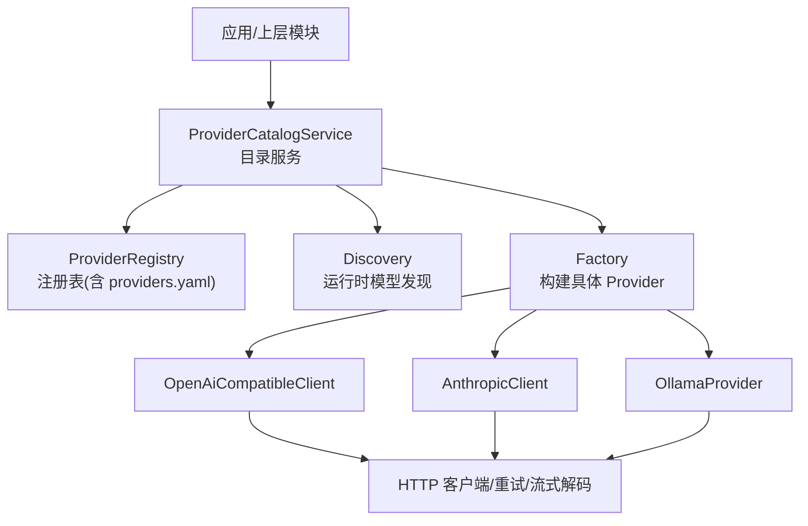
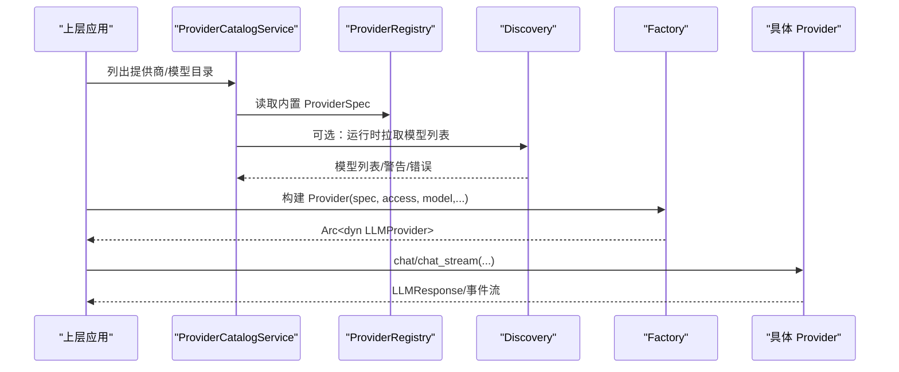
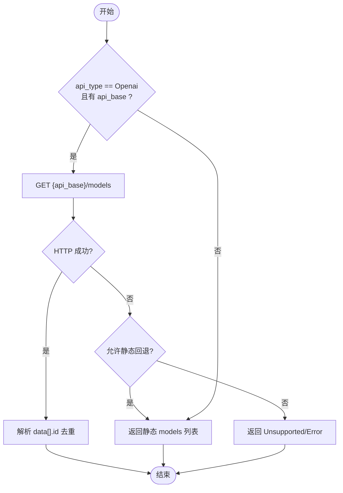
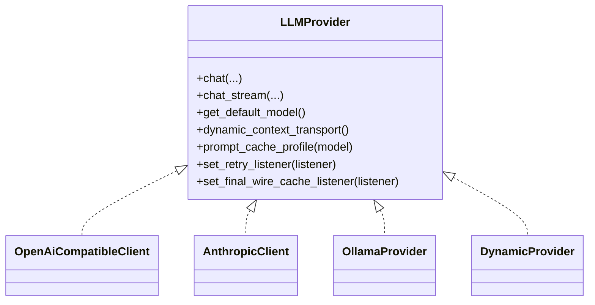
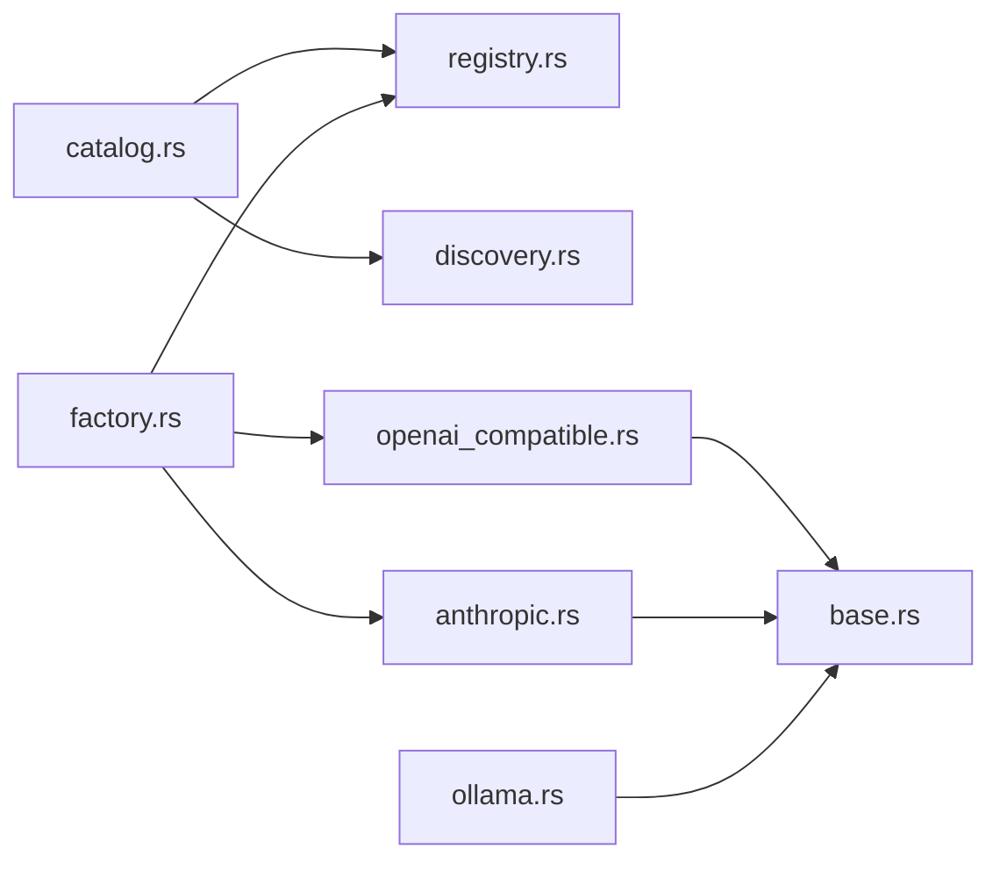

# 提供商类型

<cite>
**本文引用的文件**
- [lib.rs](file://agent-diva-providers/src/lib.rs)
- [base.rs](file://agent-diva-providers/src/base.rs)
- [catalog.rs](file://agent-diva-providers/src/catalog.rs)
- [discovery.rs](file://agent-diva-providers/src/discovery.rs)
- [factory.rs](file://agent-diva-providers/src/factory.rs)
- [registry.rs](file://agent-diva-providers/src/registry.rs)
- [openai_compatible.rs](file://agent-diva-providers/src/openai_compatible.rs)
- [anthropic.rs](file://agent-diva-providers/src/anthropic.rs)
- [ollama.rs](file://agent-diva-providers/src/ollama.rs)
- [providers.yaml](file://agent-diva-providers/src/providers.yaml)
</cite>

## 目录
1. [简介](#简介)
2. [项目结构](#项目结构)
3. [核心组件](#核心组件)
4. [架构总览](#架构总览)
5. [详细组件分析](#详细组件分析)
6. [依赖关系分析](#依赖关系分析)
7. [性能考量](#性能考量)
8. [故障排查指南](#故障排查指南)
9. [结论](#结论)
10. [附录](#附录)

## 简介
本文件聚焦于 agent-diva 的“提供商类型”能力与机制，系统说明支持的 LLM 提供商分类（OpenAI 兼容 API、Anthropic Claude、本地部署模型等），每种类型的特性、适用场景与配置要求；解释提供商发现机制与自动检测逻辑；提供提供商能力矩阵对比（文本生成、图像理解、工具调用、推理/思考内容等）；并给出选择指南帮助用户根据需求选择合适的提供商类型。

## 项目结构
提供商子系统位于 agent-diva-providers，采用“抽象接口 + 多实现 + 注册表 + 目录服务 + 工厂”的分层设计：
- 抽象接口与通用数据结构：base.rs
- 具体提供商实现：openai_compatible.rs、anthropic.rs、ollama.rs
- 提供商元数据与默认清单：registry.rs、providers.yaml
- 目录与服务：catalog.rs、discovery.rs
- 构建与装配：factory.rs
- 对外导出与动态切换封装：lib.rs

图表来源
- [catalog.rs:71-193](file://agent-diva-providers/src/catalog.rs#L71-L193)
- [registry.rs:73-108](file://agent-diva-providers/src/registry.rs#L73-L108)
- [discovery.rs:63-113](file://agent-diva-providers/src/discovery.rs#L63-L113)
- [factory.rs:23-70](file://agent-diva-providers/src/factory.rs#L23-L70)

章节来源
- [lib.rs:1-41](file://agent-diva-providers/src/lib.rs#L1-L41)
- [registry.rs:1-108](file://agent-diva-providers/src/registry.rs#L1-L108)
- [catalog.rs:71-193](file://agent-diva-providers/src/catalog.rs#L71-L193)

## 核心组件
- 抽象接口与能力描述
  - LLMProvider trait：统一 chat/chat_stream、默认模型、上下文传输策略、提示缓存策略、重试监听等。
  - ModelCapabilities：保守的能力标记（vision/tools/reasoning/context_window）。
  - Message/MessageContent/LLMResponse/LLMStreamEvent：统一消息与响应协议。
- 提供商注册与清单
  - ProviderSpec：每个提供商的元数据（名称、API 类型、关键词、环境变量键、默认模型、默认 API Base、是否支持提示缓存、模型列表、每模型参数覆盖等）。
  - ProviderRegistry：加载 providers.yaml，提供按名称/模型名查找。
- 目录与服务
  - ProviderCatalogService：合并内置与自定义提供商视图、解析提供商 ID、列出模型目录、增删自定义模型、保存/删除自定义提供商。
  - Discovery：运行时通过 OpenAI 兼容 /models 端点拉取可用模型，失败时回退到静态列表或报错。
- 构建与实现
  - Factory：根据 ProviderSpec.api_type 构造具体客户端（OpenAI 兼容、Anthropic），并对 DeepSeek V4 DSML 协议做约束校验。
  - OpenAiCompatibleClient：适配 OpenAI 风格 REST 接口，支持流式、工具调用、推理内容、usage 统计等。
  - AnthropicClient：原生 Messages API，支持 thinking/tool_use/tool_result 等块。
  - OllamaProvider：本地 Ollama 推理，支持非流/流式、工具调用、thinking。

章节来源
- [base.rs:131-264](file://agent-diva-providers/src/base.rs#L131-L264)
- [base.rs:384-445](file://agent-diva-providers/src/base.rs#L384-L445)
- [base.rs:708-780](file://agent-diva-providers/src/base.rs#L708-L780)
- [registry.rs:17-108](file://agent-diva-providers/src/registry.rs#L17-L108)
- [catalog.rs:71-193](file://agent-diva-providers/src/catalog.rs#L71-L193)
- [discovery.rs:63-113](file://agent-diva-providers/src/discovery.rs#L63-L113)
- [factory.rs:23-70](file://agent-diva-providers/src/factory.rs#L23-L70)
- [openai_compatible.rs:168-184](file://agent-diva-providers/src/openai_compatible.rs#L168-L184)
- [anthropic.rs:170-200](file://agent-diva-providers/src/anthropic.rs#L170-L200)
- [ollama.rs:22-27](file://agent-diva-providers/src/ollama.rs#L22-L27)

## 架构总览
提供商体系以“抽象接口 + 多实现 + 注册表 + 目录 + 工厂”为核心，上层通过 ProviderCatalogService 获取提供商视图与模型目录，通过 Factory 构建具体 Provider，再由上层 Agent Loop 调用 chat/chat_stream。

图表来源
- [catalog.rs:82-193](file://agent-diva-providers/src/catalog.rs#L82-L193)
- [discovery.rs:63-113](file://agent-diva-providers/src/discovery.rs#L63-L113)
- [factory.rs:23-70](file://agent-diva-providers/src/factory.rs#L23-L70)

## 详细组件分析

### 提供商类型与能力矩阵
- OpenAI 兼容 API
  - 代表：OpenAI、DeepSeek、Gemini、DashScope、Moonshot、MiniMax、vLLM/Local、Groq、xAI、CherryIN、302.AI、PH8、BurnCloud、SiliconFlow、PPIO、Together、OcoolAI、GitHub Models、Yi、Baichuan、ModelScope、StepFun、Doubao、Hyperbolic、Mistral、Jina、Fireworks、Hunyuan、NVIDIA NIM、Baidu Qianfan、Perplexity、Infini/MaaS、Voyage AI、Qiniu、TokenFlux、Cephalon、Lanyun、Poe、AIOnly、LongCat、Cerebras、Mimo 等。
  - 能力：文本生成、工具调用、部分模型支持图像理解（如 gpt-4o/gpt-4o-mini）、推理/思考内容（由模型与配置决定）、流式输出、usage 统计。
  - 配置要点：api_key、api_base（可覆盖默认）、extra_headers、model_overrides、supports_prompt_caching（部分网关/平台支持）。
  - 运行时发现：若 api_type=openai 且配置了 api_base，则可通过 GET /models 动态发现模型。
  - 参考路径
    - [providers.yaml:1-1114](file://agent-diva-providers/src/providers.yaml#L1-L1114)
    - [discovery.rs:150-161](file://agent-diva-providers/src/discovery.rs#L150-L161)
    - [discovery.rs:179-246](file://agent-diva-providers/src/discovery.rs#L179-L246)
    - [openai_compatible.rs:168-184](file://agent-diva-providers/src/openai_compatible.rs#L168-L184)

- Anthropic Claude
  - 代表：Anthropic（claude-sonnet-4-5、claude-opus-4-6、claude-haiku-4 等）。
  - 能力：文本生成、工具调用（tool_use/tool_result）、推理/思考（thinking）、usage 统计、流式输出。
  - 配置要点：api_key、api_base（默认 https://api.anthropic.com）、extra_headers。
  - 参考路径
    - [providers.yaml:77-104](file://agent-diva-providers/src/providers.yaml#L77-L104)
    - [anthropic.rs:170-200](file://agent-diva-providers/src/anthropic.rs#L170-L200)

- 本地部署模型（Ollama/vLLM 等）
  - 代表：OllamaProvider（默认 http://localhost:11434）、vLLM/Local（OpenAI 兼容模式）。
  - 能力：文本生成、工具调用、推理/思考（thinking）、流式输出、usage 统计（基于 eval/prompt_eval_count）。
  - 配置要点：base_url（Ollama）、api_base（vLLM 兼容）、default_model。
  - 参考路径
    - [ollama.rs:22-27](file://agent-diva-providers/src/ollama.rs#L22-L27)
    - [ollama.rs:148-174](file://agent-diva-providers/src/ollama.rs#L148-L174)
    - [providers.yaml:311-328](file://agent-diva-providers/src/providers.yaml#L311-L328)

- 自定义/本地（Custom / Local）
  - 通过 providers.yaml 中的 custom 条目或运行时自定义提供商（仅支持 api_type=openai）。
  - 能力：取决于后端是否遵循 OpenAI 兼容协议。
  - 参考路径
    - [providers.yaml:58-75](file://agent-diva-providers/src/providers.yaml#L58-L75)
    - [catalog.rs:239-276](file://agent-diva-providers/src/catalog.rs#L239-L276)

能力矩阵（基于代码内能力判定与实现）
- 文本生成：所有提供商均支持。
- 图像理解：OpenAI 兼容中特定模型（如 gpt-4o/gpt-4o-mini）在 base.rs 中被标记为 vision=true；其他提供商需看其模型能力与实现。
- 工具调用：OpenAI 兼容与 Anthropic 均支持；Ollama 支持工具调用。
- 推理/思考内容：由 base.rs 的 is_known_reasoning_model 与 reasoning_config 决定；OpenAI 兼容、Anthropic、Ollama 均有相应处理。
- 流式输出：三者均支持。
- 提示缓存：部分提供商/网关支持（如 OpenRouter、Anthropic 等），由 spec.supports_prompt_caching 与 provider 实现控制。

章节来源
- [base.rs:131-264](file://agent-diva-providers/src/base.rs#L131-L264)
- [providers.yaml:1-1114](file://agent-diva-providers/src/providers.yaml#L1-L1114)
- [openai_compatible.rs:168-184](file://agent-diva-providers/src/openai_compatible.rs#L168-L184)
- [anthropic.rs:170-200](file://agent-diva-providers/src/anthropic.rs#L170-L200)
- [ollama.rs:148-174](file://agent-diva-providers/src/ollama.rs#L148-L174)

### 提供商发现机制与自动检测
- 运行时模型发现
  - 当 ProviderSpec.api_type=Openai 且存在 api_base 时，Discovery 会请求 {api_base}/models，解析 data[].id 去重后返回。
  - 若请求失败，允许回退到静态 models 列表（StaticFallback）或直接报错（Unsupported/Error）。
- 提供商视图与就绪状态
  - ProviderCatalogService 将内置与自定义提供商合并，计算 configured/ready、runtime_supported、supports_model_discovery 等字段。
  - 自定义提供商当前仅支持 api_type=openai，且需要 api_base 才支持运行时发现。
- 提供商 ID 解析
  - resolve_provider_id 优先使用显式 preferred_provider，其次 agents.defaults.provider，再尝试从模型名前缀匹配，最后按模型关键词匹配。

图表来源
- [discovery.rs:63-113](file://agent-diva-providers/src/discovery.rs#L63-L113)
- [discovery.rs:150-161](file://agent-diva-providers/src/discovery.rs#L150-L161)
- [discovery.rs:179-246](file://agent-diva-providers/src/discovery.rs#L179-L246)
- [catalog.rs:111-193](file://agent-diva-providers/src/catalog.rs#L111-L193)

章节来源
- [discovery.rs:63-113](file://agent-diva-providers/src/discovery.rs#L63-L113)
- [catalog.rs:111-193](file://agent-diva-providers/src/catalog.rs#L111-L193)

### 提供商构建与动态切换
- 构建
  - Factory 根据 spec.api_type 选择 OpenAiCompatibleClient 或 AnthropicClient；对 DeepSeek V4 DSML 协议进行模型名校验。
- 动态切换
  - DynamicProvider 包装任意 LLMProvider，支持运行时替换底层实现，便于热插拔。

图表来源
- [base.rs:708-780](file://agent-diva-providers/src/base.rs#L708-L780)
- [factory.rs:23-70](file://agent-diva-providers/src/factory.rs#L23-L70)
- [lib.rs:46-124](file://agent-diva-providers/src/lib.rs#L46-L124)

章节来源
- [factory.rs:23-70](file://agent-diva-providers/src/factory.rs#L23-L70)
- [lib.rs:46-124](file://agent-diva-providers/src/lib.rs#L46-L124)

### 能力判定与上下文传输
- 能力判定
  - supports_vision_model、supports_reasoning_model 基于 base.rs 的硬编码表与 reasoning_config 动态判断。
- 上下文传输
  - DynamicContextTransport 支持三种策略：对话中间 system、用户角色包裹、原生上下文块（需提供商实现）。

章节来源
- [base.rs:131-264](file://agent-diva-providers/src/base.rs#L131-L264)
- [base.rs:427-445](file://agent-diva-providers/src/base.rs#L427-L445)

## 依赖关系分析
- 组件耦合
  - catalog.rs 依赖 registry.rs 与 discovery.rs，组合内置与自定义提供商视图。
  - factory.rs 依赖 registry.rs 与具体实现类，负责实例化。
  - openai_compatible.rs、anthropic.rs、ollama.rs 依赖 base.rs 的统一接口与 HTTP 工具。
- 外部依赖
  - reqwest 用于 HTTP 请求；serde/serde_json 用于序列化；tokio/futures 用于异步流。
- 潜在循环依赖
  - 未发现明显循环依赖；各模块职责清晰，分层明确。

图表来源
- [catalog.rs:71-193](file://agent-diva-providers/src/catalog.rs#L71-L193)
- [factory.rs:23-70](file://agent-diva-providers/src/factory.rs#L23-L70)
- [openai_compatible.rs:168-184](file://agent-diva-providers/src/openai_compatible.rs#L168-L184)
- [anthropic.rs:170-200](file://agent-diva-providers/src/anthropic.rs#L170-L200)
- [ollama.rs:22-27](file://agent-diva-providers/src/ollama.rs#L22-L27)

章节来源
- [catalog.rs:71-193](file://agent-diva-providers/src/catalog.rs#L71-L193)
- [factory.rs:23-70](file://agent-diva-providers/src/factory.rs#L23-L70)

## 性能考量
- 流式输出：OpenAI 兼容、Anthropic、Ollama 均支持流式，降低首字延迟。
- 提示缓存：部分提供商支持 prompt caching（如 OpenRouter、Anthropic），可减少重复上下文成本。
- 超时与重试：HTTP 客户端设置合理超时；错误分类区分可重试与致命错误，便于上层重试策略。
- 模型能力保守估计：未知模型默认不启用 vision/tools/reasoning，避免无效负载。

[本节为通用指导，无需引用具体文件]

## 故障排查指南
- 运行时模型发现失败
  - 现象：catalog 返回 warnings 或 error，source=StaticFallback/Unsupported/Error。
  - 排查：检查 api_base 是否正确、网络可达性、鉴权头（Bearer Token）、额外 headers。
  - 参考路径
    - [discovery.rs:115-143](file://agent-diva-providers/src/discovery.rs#L115-L143)
    - [discovery.rs:179-246](file://agent-diva-providers/src/discovery.rs#L179-L246)
- 提供商未就绪
  - 现象：ProviderView.configured=false 或 ready=false。
  - 排查：确认 api_key/api_base 已配置；自定义提供商需 api_type=openai 且提供 api_base。
  - 参考路径
    - [catalog.rs:326-387](file://agent-diva-providers/src/catalog.rs#L326-L387)
    - [catalog.rs:239-276](file://agent-diva-providers/src/catalog.rs#L239-L276)
- 构建失败
  - 现象：build_llm_provider 返回 ConfigError。
  - 排查：检查 api_type 是否实现、DeepSeek V4 DSML 协议是否匹配模型名。
  - 参考路径
    - [factory.rs:23-70](file://agent-diva-providers/src/factory.rs#L23-L70)
- 流式 UTF-8 解码异常
  - 现象：InvalidResponse 包含不完整 UTF-8。
  - 排查：检查上游流格式；确保分片边界正确。
  - 参考路径
    - [base.rs:82-129](file://agent-diva-providers/src/base.rs#L82-L129)

章节来源
- [discovery.rs:115-143](file://agent-diva-providers/src/discovery.rs#L115-L143)
- [catalog.rs:326-387](file://agent-diva-providers/src/catalog.rs#L326-L387)
- [factory.rs:23-70](file://agent-diva-providers/src/factory.rs#L23-L70)
- [base.rs:82-129](file://agent-diva-providers/src/base.rs#L82-L129)

## 结论
- 本项目提供了统一的 LLM 提供商抽象，支持 OpenAI 兼容 API、Anthropic Claude、本地部署模型等多种类型。
- 通过注册表与目录服务，实现了提供商元数据管理、模型目录聚合与运行时发现。
- 能力判定保守而灵活，结合 reasoning_config 可动态启用推理能力。
- 建议根据业务需求选择：
  - 需要广泛模型生态与工具链：优先 OpenAI 兼容（如 OpenRouter、DeepSeek、DashScope 等）。
  - 需要强推理与工具调用：考虑 Anthropic Claude。
  - 需要离线/私有化部署：选择 Ollama/vLLM 等本地方案。
  - 需要图像理解：选择具备 vision 能力的模型（如 gpt-4o/gpt-4o-mini）。

[本节为总结，无需引用具体文件]

## 附录

### 提供商选择指南
- 文本为主、低成本：选择轻量 OpenAI 兼容模型（如 gpt-4o-mini、deepseek-v4-flash）。
- 复杂推理：选择具备 reasoning/thinking 的模型（如 claude-sonnet-4-5、o1/o3、gemini-2.5-pro）。
- 图像理解：选择 vision 模型（gpt-4o/gpt-4o-mini）。
- 本地部署：Ollama/vLLM，关注硬件资源与延迟。
- 企业合规/私有化：选择支持私有部署的 OpenAI 兼容网关（如 vLLM、内部网关）。

[本节为通用指导，无需引用具体文件]