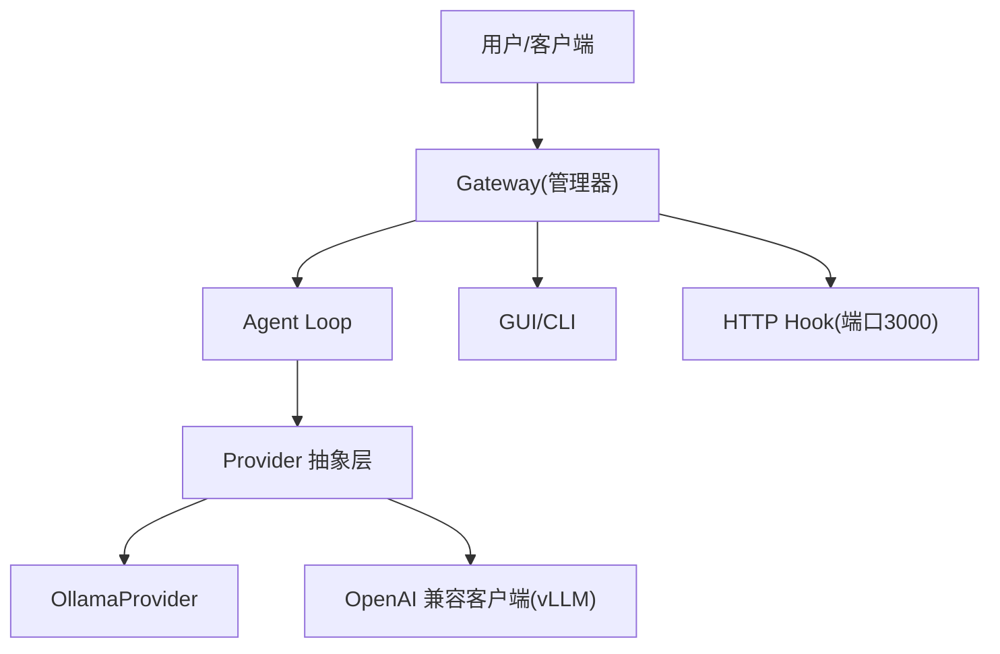
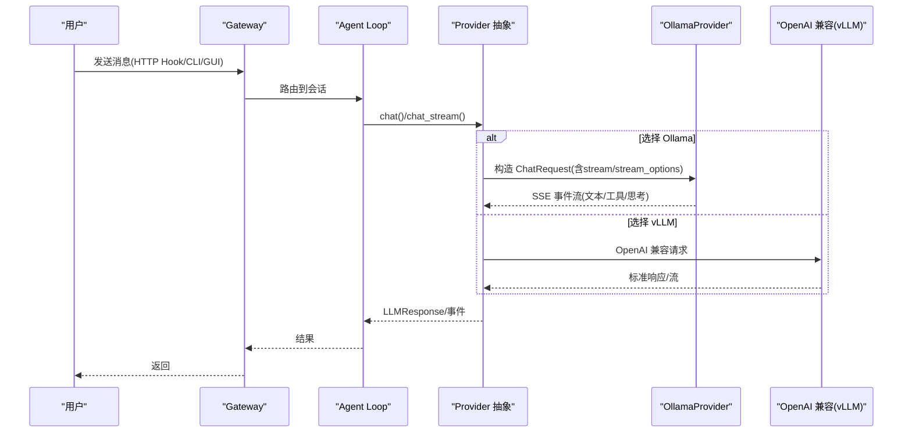
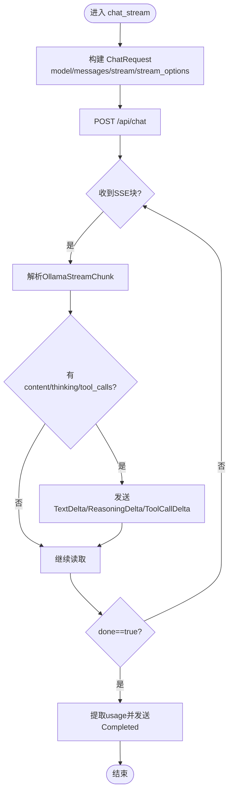
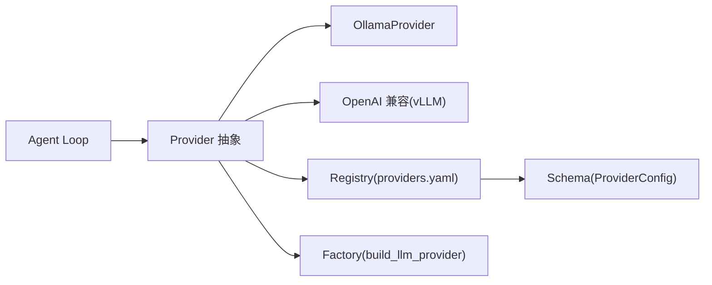

# 本地部署

<cite>
**本文引用的文件**
- [README.md](file://README.md)
- [ollama.rs](file://agent-diva-providers/src/ollama.rs)
- [providers.yaml](file://agent-diva-providers/src/providers.yaml)
- [registry.rs](file://agent-diva-providers/src/registry.rs)
- [factory.rs](file://agent-diva-providers/src/factory.rs)
- [base.rs](file://agent-diva-providers/src/base.rs)
- [schema.rs](file://agent-diva-core/src/config/schema.rs)
- [linux.rs](file://agent-diva-sandbox/src/platform/linux.rs)
- [package_headless.py](file://scripts/ci/package_headless.py)
- [update_provider_models.py](file://scripts/update_provider_models.py)
- [update-models.js](file://scripts/update-models.js)
- [ollama_streaming.rs](file://agent-diva-providers/tests/ollama_streaming.rs)
</cite>

## 目录
1. [简介](#简介)
2. [项目结构](#项目结构)
3. [核心组件](#核心组件)
4. [架构总览](#架构总览)
5. [详细组件分析](#详细组件分析)
6. [依赖关系分析](#依赖关系分析)
7. [性能与加速](#性能与加速)
8. [故障排查指南](#故障排查指南)
9. [结论](#结论)
10. [附录](#附录)

## 简介
本指南聚焦于在本地环境中部署和配置 LLM 服务，结合 Agent Diva 的提供商体系，说明如何接入 Ollama、vLLM（以 OpenAI 兼容端点形式）等本地推理框架。文档涵盖：
- 本地模型下载、安装与配置流程
- 本地部署的优势：数据隐私、离线使用、自定义模型
- Docker 容器化部署思路、GPU 加速配置要点、网络访问设置
- 常见问题定位与解决建议

Agent Diva 通过统一的 Provider 抽象对接多种后端，包括本地推理服务；CLI/GUI 提供便捷的配置入口，Gateway 进程作为统一控制面对外暴露 HTTP Hook 接口，便于外部系统集成。

**章节来源**
- [README.md:20-85](file://README.md#L20-L85)

## 项目结构
Agent Diva 采用多 crate 工作区组织，本地部署相关的关键模块集中在 providers、core 配置、sandbox 安全策略以及打包脚本中：
- agent-diva-providers：Provider 抽象与实现（含 Ollama）、注册表与工厂
- agent-diva-core：配置 schema（含 vLLM 配置项）
- agent-diva-sandbox：Linux 网络隔离与安全过滤（用于受限环境下的本地推理）
- scripts：模型清单更新与无头包打包脚本
- README：快速开始、配置与运行方式

**图表来源**
- [README.md:43-58](file://README.md#L43-L58)
- [ollama.rs:22-26](file://agent-diva-providers/src/ollama.rs#L22-L26)
- [providers.yaml:311-328](file://agent-diva-providers/src/providers.yaml#L311-L328)

**章节来源**
- [README.md:87-108](file://README.md#L87-L108)

## 核心组件
- Provider 抽象与实现
  - base.rs：定义 LLMProvider 接口、错误类型、流式解码器、能力探测
  - ollama.rs：OllamaProvider 实现，支持非流/流式聊天、工具调用、思考内容
  - factory.rs：根据 API 类型构建具体 Provider（OpenAI 兼容或 Anthropic）
  - registry.rs：Provider 元数据注册表，加载 providers.yaml
- 配置系统
  - schema.rs：ProviderConfig 结构体，包含 api_key、api_base、custom_models、reasoning_config、response_protocol 等
  - providers.yaml：内置 Provider 清单，包含 vLLM、custom/local 等条目
- 安全与隔离
  - linux.rs：Linux seccomp 网络过滤，支持仅回环或阻断网络等模式
- 打包与运维
  - package_headless.py：构建无头包并附带 systemd 脚本
  - update_provider_models.py / update-models.js：更新 providers.yaml 中的模型列表

**章节来源**
- [base.rs:1-69](file://agent-diva-providers/src/base.rs#L1-L69)
- [ollama.rs:22-26](file://agent-diva-providers/src/ollama.rs#L22-L26)
- [factory.rs:23-70](file://agent-diva-providers/src/factory.rs#L23-L70)
- [registry.rs:73-108](file://agent-diva-providers/src/registry.rs#L73-L108)
- [schema.rs:1226-1243](file://agent-diva-core/src/config/schema.rs#L1226-L1243)
- [providers.yaml:58-75](file://agent-diva-providers/src/providers.yaml#L58-L75)
- [providers.yaml:311-328](file://agent-diva-providers/src/providers.yaml#L311-L328)
- [linux.rs:884-985](file://agent-diva-sandbox/src/platform/linux.rs#L884-L985)
- [package_headless.py:75-109](file://scripts/ci/package_headless.py#L75-L109)
- [update_provider_models.py:220-278](file://scripts/update_provider_models.py#L220-L278)
- [update-models.js:41-81](file://scripts/update-models.js#L41-L81)

## 架构总览
Agent Diva 将“本地推理”视为一种 Provider 接入方式。Ollama 通过专用 Provider 实现直连其 /api/chat 端点；vLLM 则以 OpenAI 兼容端点形式接入，遵循统一的请求/响应协议。Provider 抽象屏蔽了底层差异，上层 Agent Loop 无需关心具体后端。

**图表来源**
- [README.md:43-58](file://README.md#L43-L58)
- [ollama.rs:28-53](file://agent-diva-providers/src/ollama.rs#L28-L53)
- [ollama.rs:437-608](file://agent-diva-providers/src/ollama.rs#L437-L608)
- [factory.rs:42-69](file://agent-diva-providers/src/factory.rs#L42-L69)

## 详细组件分析

### Ollama 本地提供商
- 功能要点
  - 支持非流式与流式聊天
  - 支持工具调用与 reasoning/thinking 内容
  - 自动处理 token usage（prompt_eval_count/eval_count → prompt_tokens/completion_tokens/total_tokens）
  - 默认 base_url 为 http://localhost:11434，可自定义
- 关键流程
  - 构造 ChatRequest，设置 stream/stream_options
  - 解析 SSE 事件，累积 content/reasoning_content/tool_calls
  - 完成时输出最终 LLMResponse
- 错误处理
  - HTTP 错误、JSON 解析失败、SSE 解析异常均会转换为 ProviderError
  - 缺失 usage 字段时记录告警并触发审计事件

**图表来源**
- [ollama.rs:437-608](file://agent-diva-providers/src/ollama.rs#L437-L608)
- [ollama.rs:176-216](file://agent-diva-providers/src/ollama.rs#L176-L216)

**章节来源**
- [ollama.rs:22-26](file://agent-diva-providers/src/ollama.rs#L22-L26)
- [ollama.rs:28-53](file://agent-diva-providers/src/ollama.rs#L28-L53)
- [ollama.rs:148-174](file://agent-diva-providers/src/ollama.rs#L148-L174)
- [ollama.rs:176-216](file://agent-diva-providers/src/ollama.rs#L176-L216)
- [ollama.rs:316-435](file://agent-diva-providers/src/ollama.rs#L316-L435)
- [ollama.rs:437-608](file://agent-diva-providers/src/ollama.rs#L437-L608)

### vLLM（OpenAI 兼容）本地提供商
- 接入方式
  - 通过 providers.yaml 的 vLLM 条目，标记 is_local=true，default_api_base 指向本地 OpenAI 兼容端点
  - 由 factory.rs 根据 ApiType=Openai 构建 OpenAiCompatibleClient
- 配置要点
  - 可在 ProviderConfig 中设置 api_base、custom_models、reasoning_config、response_protocol
  - 若 response_protocol=DeepseekV4Dsml，需确保模型名包含 deepseek-v4

**章节来源**
- [providers.yaml:311-328](file://agent-diva-providers/src/providers.yaml#L311-L328)
- [factory.rs:42-69](file://agent-diva-providers/src/factory.rs#L42-L69)
- [schema.rs:1226-1243](file://agent-diva-core/src/config/schema.rs#L1226-L1243)

### 提供商注册与发现
- registry.rs 从内嵌 providers.yaml 加载 ProviderSpec，支持按名称或模型关键词查找
- 支持 gateway_prefix/skip_prefixes 等元数据，便于模型 ID 路由与显示

**章节来源**
- [registry.rs:73-108](file://agent-diva-providers/src/registry.rs#L73-L108)
- [registry.rs:91-102](file://agent-diva-providers/src/registry.rs#L91-L102)

### 配置与模型清单管理
- schema.rs 定义了 ProviderConfig 的结构，便于在 config.json 中配置各 Provider
- scripts 提供自动化更新 providers.yaml 中模型列表的工具：
  - update_provider_models.py：Python 脚本，拉取在线模型并合并到 YAML
  - update-models.js：Node 脚本，增量添加新模型

**章节来源**
- [schema.rs:1226-1243](file://agent-diva-core/src/config/schema.rs#L1226-L1243)
- [update_provider_models.py:220-278](file://scripts/update_provider_models.py#L220-L278)
- [update-models.js:41-81](file://scripts/update-models.js#L41-L81)

### 安全与网络隔离（Linux）
- 通过 seccomp 过滤器限制网络系统调用，支持：
  - 完全阻断
  - 仅允许回环地址
  - 特定端口白名单（由 bubblewrap 层配合）
- 适用于本地推理场景下对沙箱执行的网络访问进行严格管控

**章节来源**
- [linux.rs:884-985](file://agent-diva-sandbox/src/platform/linux.rs#L884-L985)

## 依赖关系分析
- 组件耦合
  - Agent Loop 依赖 Provider 抽象，不感知具体后端
  - OllamaProvider 依赖 HTTP 客户端与 SSE 解析逻辑
  - vLLM 通过 OpenAI 兼容客户端接入，受 factory.rs 调度
  - 配置系统集中管理 Provider 元数据与运行时参数
- 外部依赖
  - Ollama 服务（默认 localhost:11434）
  - vLLM 的 OpenAI 兼容端点（默认 http://localhost:11434/v1）
  - Linux seccomp/bubblewrap（可选，用于网络隔离）

**图表来源**
- [factory.rs:23-70](file://agent-diva-providers/src/factory.rs#L23-L70)
- [registry.rs:73-108](file://agent-diva-providers/src/registry.rs#L73-L108)
- [schema.rs:1226-1243](file://agent-diva-core/src/config/schema.rs#L1226-L1243)

**章节来源**
- [factory.rs:23-70](file://agent-diva-providers/src/factory.rs#L23-L70)
- [registry.rs:73-108](file://agent-diva-providers/src/registry.rs#L73-L108)
- [schema.rs:1226-1243](file://agent-diva-core/src/config/schema.rs#L1226-L1243)

## 性能与加速
- GPU 加速
  - Ollama：启动时启用 GPU 支持（依据宿主驱动与 Ollama 配置），Agent Diva 侧无需额外配置
  - vLLM：以 OpenAI 兼容端点运行，启用 GPU 后通过相同接口调用
- 流式响应
  - OllamaProvider 使用 SSE 流式传输，降低首字延迟
  - 流式 UTF-8 解码避免分片导致的乱码问题
- 资源与并发
  - 合理设置超时与重试策略（ProviderError 分类支持可重试错误）
  - 在沙箱环境中可通过 seccomp 限制网络，减少不必要的外部调用开销

[本节为通用指导，不直接分析具体文件]

## 故障排查指南
- 连接失败（无效主机/端口）
  - 现象：连接 Ollama 失败，返回错误
  - 检查：确认 Ollama 服务已启动且监听 11434；base_url 是否正确
  - 参考测试用例验证行为
- 流式解析异常
  - 现象：SSE 事件无法解析或流中断
  - 检查：服务端是否按预期发送 data: JSON 行；UTF-8 完整性
- 缺少 usage 字段
  - 现象：响应未包含 token 用量
  - 处理：记录告警并触发审计事件；上游服务可能未返回
- 配置错误
  - 现象：构建 Provider 时报错（如 DeepSeek V4 协议要求）
  - 检查：response_protocol 与 model 匹配；api_base/api_key 正确

**章节来源**
- [ollama_streaming.rs:37-57](file://agent-diva-providers/tests/ollama_streaming.rs#L37-L57)
- [base.rs:10-69](file://agent-diva-providers/src/base.rs#L10-L69)
- [ollama.rs:201-216](file://agent-diva-providers/src/ollama.rs#L201-L216)
- [factory.rs:29-40](file://agent-diva-providers/src/factory.rs#L29-L40)

## 结论
Agent Diva 将本地推理服务纳入统一的 Provider 体系，既支持 Ollama 原生端点，也兼容 vLLM 的 OpenAI 接口。通过清晰的配置结构与注册表机制，用户可以灵活切换本地与云端后端，同时享受数据隐私、离线可用与自定义模型等优势。结合沙箱网络隔离与流式优化，本地部署具备生产可用的可靠性与性能。

[本节为总结性内容，不直接分析具体文件]

## 附录

### 本地部署步骤概览
- 准备本地推理服务
  - Ollama：安装并启动服务（默认 http://localhost:11434）
  - vLLM：以 OpenAI 兼容模式启动（默认 http://localhost:11434/v1）
- 配置 Agent Diva
  - 使用 CLI 初始化与 onboarding
  - 在 config.json 中添加至少一个 Provider（可使用 custom/local 或 vLLM 条目）
  - 指定默认 provider 与 model
- 运行与验证
  - 启动 Gateway/TUI/GUI
  - 通过 HTTP Hook 或 CLI 发送消息验证本地推理

**章节来源**
- [README.md:116-148](file://README.md#L116-L148)
- [providers.yaml:58-75](file://agent-diva-providers/src/providers.yaml#L58-L75)
- [providers.yaml:311-328](file://agent-diva-providers/src/providers.yaml#L311-L328)

### Docker 容器化部署建议
- 将 Agent Diva 二进制与本地推理服务（Ollama/vLLM）分别容器化
- 通过 Docker Compose 编排，暴露必要端口（如 11434、3000）
- 挂载持久化目录保存模型与配置
- 在 Linux 上可结合 seccomp 策略限制容器网络访问

**章节来源**
- [package_headless.py:75-109](file://scripts/ci/package_headless.py#L75-L109)
- [linux.rs:884-985](file://agent-diva-sandbox/src/platform/linux.rs#L884-L985)

### 常见配置项速查
- ProviderConfig
  - api_key：API 密钥（部分本地服务可为空）
  - api_base：端点地址（Ollama/vLLM 默认 localhost）
  - custom_models：自定义模型列表
  - reasoning_config：推理能力配置
  - response_protocol：响应协议（如 DeepSeek V4 DSML）

**章节来源**
- [schema.rs:1226-1243](file://agent-diva-core/src/config/schema.rs#L1226-L1243)