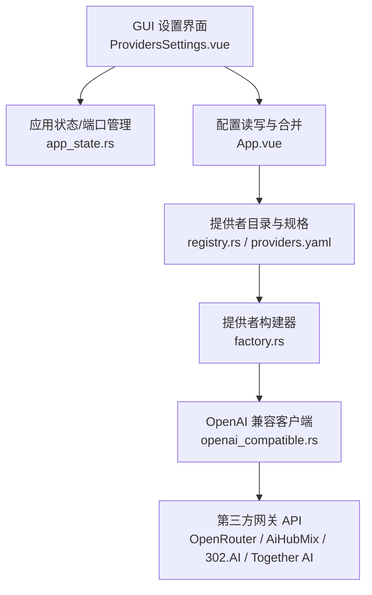
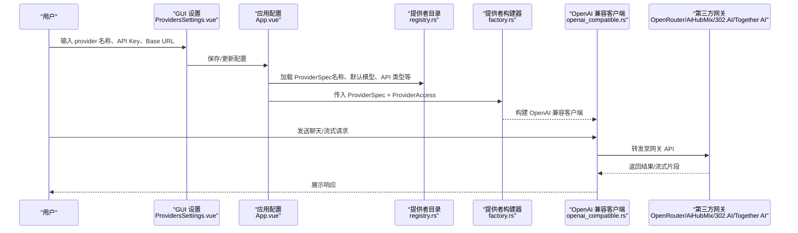
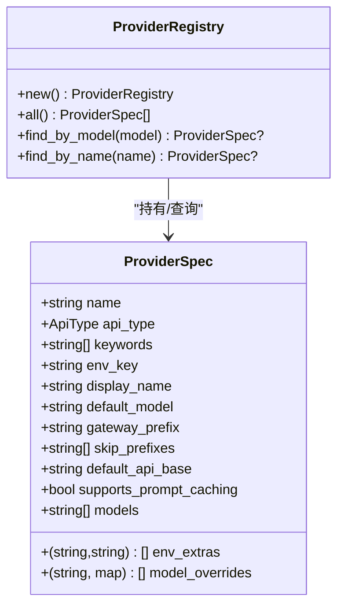
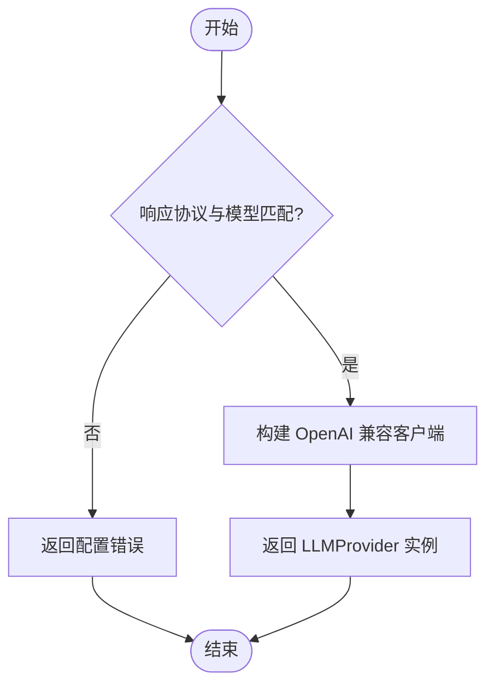
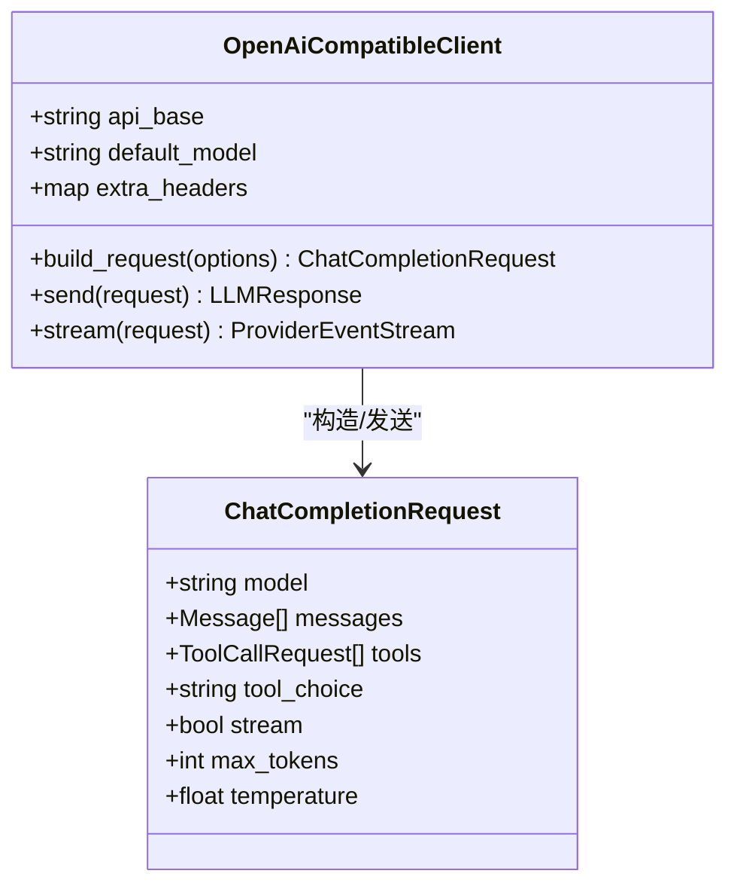
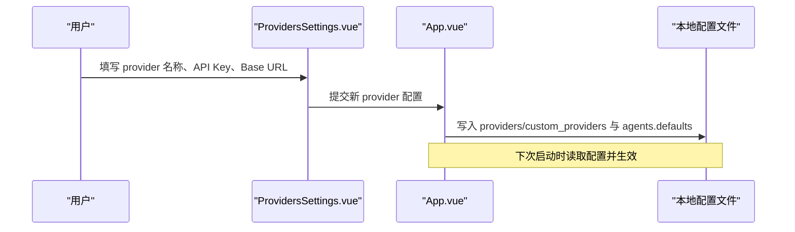
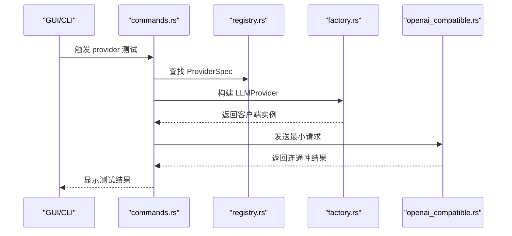
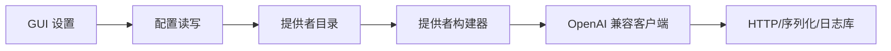

# 第三方网关

<cite>
**本文引用的文件**
- [providers.yaml](file://agent-diva-providers/src/providers.yaml)
- [registry.rs](file://agent-diva-providers/src/registry.rs)
- [factory.rs](file://agent-diva-providers/src/factory.rs)
- [openai_compatible.rs](file://agent-diva-providers/src/openai_compatible.rs)
- [commands.rs](file://agent-diva-gui/src-tauri/src/commands.rs)
- [app_state.rs](file://agent-diva-gui/src-tauri/src/app_state.rs)
- [ProvidersSettings.vue](file://agent-diva-gui/src/components/settings/ProvidersSettings.vue)
- [App.vue](file://agent-diva-gui/src/App.vue)
</cite>

## 目录
1. [简介](#简介)
2. [项目结构](#项目结构)
3. [核心组件](#核心组件)
4. [架构总览](#架构总览)
5. [详细组件分析](#详细组件分析)
6. [依赖关系分析](#依赖关系分析)
7. [性能与成本考量](#性能与成本考量)
8. [故障排查指南](#故障排查指南)
9. [结论](#结论)
10. [附录：各网关配置要点](#附录：各网关配置要点)

## 简介
本文件面向使用 OpenRouter、AiHubMix、302.AI、Together AI 等第三方聚合网关的用户与集成开发者，说明如何在 agent-diva 中统一接入多个 LLM 提供商，并通过单一 API 接口访问多种模型。文档涵盖：
- 网关在系统中的角色与优势（模型路由、负载均衡、成本优化）
- 注册流程与 API 密钥获取的通用步骤
- 在本项目中的具体配置方式与示例路径
- 网关选择指南与性能对比方法

## 项目结构
本项目通过“提供者目录 + 工厂构建 + 统一客户端”的方式，将不同 LLM 提供商（含第三方网关）抽象为统一的运行时能力。关键位置如下：
- 提供者元数据与模型清单：agent-diva-providers/src/providers.yaml
- 提供者注册表与查询：agent-diva-providers/src/registry.rs
- 运行时客户端构建：agent-diva-providers/src/factory.rs
- OpenAI 兼容协议实现（多数网关遵循该协议）：agent-diva-providers/src/openai_compatible.rs
- GUI 设置与持久化：agent-diva-gui/src/components/settings/ProvidersSettings.vue、agent-diva-gui/src/App.vue
- Tauri 命令与测试连接：agent-diva-gui/src-tauri/src/commands.rs、agent-diva-gui/src-tauri/src/app_state.rs

**图表来源**
- [ProvidersSettings.vue:1219-1246](file://agent-diva-gui/src/components/settings/ProvidersSettings.vue#L1219-L1246)
- [app_state.rs:1-42](file://agent-diva-gui/src-tauri/src/app_state.rs#L1-L42)
- [App.vue:732-782](file://agent-diva-gui/src/App.vue#L732-L782)
- [registry.rs:1-108](file://agent-diva-providers/src/registry.rs#L1-L108)
- [factory.rs:23-70](file://agent-diva-providers/src/factory.rs#L23-L70)
- [openai_compatible.rs:168-184](file://agent-diva-providers/src/openai_compatible.rs#L168-L184)

**章节来源**
- [providers.yaml:1-57](file://agent-diva-providers/src/providers.yaml#L1-L57)
- [registry.rs:1-108](file://agent-diva-providers/src/registry.rs#L1-L108)
- [factory.rs:23-70](file://agent-diva-providers/src/factory.rs#L23-L70)
- [openai_compatible.rs:168-184](file://agent-diva-providers/src/openai_compatible.rs#L168-L184)
- [ProvidersSettings.vue:1219-1246](file://agent-diva-gui/src/components/settings/ProvidersSettings.vue#L1219-L1246)
- [App.vue:732-782](file://agent-diva-gui/src/App.vue#L732-L782)
- [app_state.rs:1-42](file://agent-diva-gui/src-tauri/src/app_state.rs#L1-L42)

## 核心组件
- 提供者目录（Provider Registry）：集中维护所有内置 provider 的元数据（名称、显示名、API 类型、默认模型、网关前缀、是否网关、默认 API Base、支持特性、模型列表等），并提供按名称或模型关键词查找的能力。
- 提供者构建器（Factory）：根据 ProviderSpec 与运行时访问信息（API Key、Base URL、额外请求头等）构造具体的 LLM 客户端实例；当前主要支持 OpenAI 兼容与 Anthropic 原生两种协议。
- OpenAI 兼容客户端：封装 HTTP 请求、流式响应、工具调用、用量统计、重试与最终网络层缓存监听等，是大多数第三方网关的统一接入点。
- GUI 设置与持久化：提供创建/编辑自定义 provider、填写 API Key、Base URL 并持久化的能力；同时负责读取/写入配置到本地配置文件。
- Tauri 命令：提供测试连通性、构建 provider 实例、发送最小请求以验证模型可用性的能力。

**章节来源**
- [registry.rs:17-108](file://agent-diva-providers/src/registry.rs#L17-L108)
- [factory.rs:13-70](file://agent-diva-providers/src/factory.rs#L13-L70)
- [openai_compatible.rs:24-184](file://agent-diva-providers/src/openai_compatible.rs#L24-L184)
- [ProvidersSettings.vue:1219-1246](file://agent-diva-gui/src/components/settings/ProvidersSettings.vue#L1219-L1246)
- [App.vue:732-782](file://agent-diva-gui/src/App.vue#L732-L782)
- [commands.rs:3582-3610](file://agent-diva-gui/src-tauri/src/commands.rs#L3582-L3610)

## 架构总览
下图展示了从 GUI 设置到实际调用第三方网关的完整链路。用户通过 GUI 配置 provider（名称、API Key、Base URL），系统将其解析为 ProviderAccess，再结合 ProviderSpec 构建 OpenAI 兼容客户端，最终向网关发起请求。

**图表来源**
- [ProvidersSettings.vue:1219-1246](file://agent-diva-gui/src/components/settings/ProvidersSettings.vue#L1219-L1246)
- [App.vue:732-782](file://agent-diva-gui/src/App.vue#L732-L782)
- [registry.rs:78-108](file://agent-diva-providers/src/registry.rs#L78-L108)
- [factory.rs:23-70](file://agent-diva-providers/src/factory.rs#L23-L70)
- [openai_compatible.rs:168-184](file://agent-diva-providers/src/openai_compatible.rs#L168-L184)

## 详细组件分析

### 提供者目录与模型清单
- 作用：集中声明所有 provider 的元数据，包括是否为网关、默认 API Base、支持的模型列表、是否支持提示词缓存等。
- 关键字段说明：
  - name：内部标识
  - display_name：显示名称
  - api_type：API 协议类型（如 openai、anthropic）
  - is_gateway：是否网关型 provider
  - default_api_base：默认网关地址
  - models：该 provider 可提供的模型清单
  - supports_prompt_caching：是否支持提示词缓存
- 查找机制：支持按名称精确匹配，或通过模型名包含关键词进行模糊匹配。

**图表来源**
- [registry.rs:17-108](file://agent-diva-providers/src/registry.rs#L17-L108)

**章节来源**
- [providers.yaml:1-57](file://agent-diva-providers/src/providers.yaml#L1-L57)
- [registry.rs:17-108](file://agent-diva-providers/src/registry.rs#L17-L108)

### 提供者构建与协议适配
- 构建逻辑：根据 ProviderSpec 的 api_type 决定使用 OpenAI 兼容客户端还是 Anthropic 原生客户端；其他类型暂不支持。
- 参数传递：API Key、Base URL、模型名、推理努力级别、响应协议、额外请求头等。
- 错误处理：当配置不满足约束（例如特定响应协议要求特定模型）时返回配置错误。

**图表来源**
- [factory.rs:23-70](file://agent-diva-providers/src/factory.rs#L23-L70)

**章节来源**
- [factory.rs:23-70](file://agent-diva-providers/src/factory.rs#L23-L70)

### OpenAI 兼容客户端
- 职责：封装与网关的 HTTP 交互，包括非流式与流式响应、工具调用、用量统计、重试、最终网络层缓存监听等。
- 数据结构：定义了请求体、响应体、流式分片、工具调用等结构，便于统一解析。
- 扩展点：可通过 extra_headers 注入额外请求头，支持 per-provider 的推理配置与响应协议切换。

**图表来源**
- [openai_compatible.rs:24-184](file://agent-diva-providers/src/openai_compatible.rs#L24-L184)

**章节来源**
- [openai_compatible.rs:24-184](file://agent-diva-providers/src/openai_compatible.rs#L24-L184)

### GUI 设置与配置持久化
- 功能：提供创建/编辑自定义 provider 的表单，支持显示/隐藏 API Key、填写 Base URL、保存配置到本地文件。
- 配置映射：将用户输入映射为 providers 或 custom_providers 下的条目，并写入 agents.defaults.provider/model。
- 运行态：Tauri 应用状态管理 Gateway 端口与本地 Manager API 地址。

**图表来源**
- [ProvidersSettings.vue:1219-1246](file://agent-diva-gui/src/components/settings/ProvidersSettings.vue#L1219-L1246)
- [App.vue:732-782](file://agent-diva-gui/src/App.vue#L732-L782)

**章节来源**
- [ProvidersSettings.vue:1219-1246](file://agent-diva-gui/src/components/settings/ProvidersSettings.vue#L1219-L1246)
- [App.vue:732-782](file://agent-diva-gui/src/App.vue#L732-L782)
- [app_state.rs:1-42](file://agent-diva-gui/src-tauri/src/app_state.rs#L1-L42)

### 连通性测试与诊断
- 通过 Tauri 命令构建 provider 实例，发送最小请求以确认模型连通性与基本响应。
- 适用于快速验证 API Key、Base URL、模型名是否正确。

**图表来源**
- [commands.rs:3582-3610](file://agent-diva-gui/src-tauri/src/commands.rs#L3582-L3610)
- [registry.rs:78-108](file://agent-diva-providers/src/registry.rs#L78-L108)
- [factory.rs:23-70](file://agent-diva-providers/src/factory.rs#L23-L70)
- [openai_compatible.rs:168-184](file://agent-diva-providers/src/openai_compatible.rs#L168-L184)

**章节来源**
- [commands.rs:3582-3610](file://agent-diva-gui/src-tauri/src/commands.rs#L3582-L3610)

## 依赖关系分析
- 低耦合：GUI 仅负责配置输入与持久化；provider 目录与构建器位于独立模块；客户端实现与协议细节解耦。
- 内聚性：每个模块职责清晰，registry 专注元数据，factory 专注构建，openai_compatible 专注网络与协议。
- 外部依赖：reqwest、serde、serde_yaml 等用于 HTTP 与序列化；tracing 用于日志。

**图表来源**
- [registry.rs:78-108](file://agent-diva-providers/src/registry.rs#L78-L108)
- [factory.rs:23-70](file://agent-diva-providers/src/factory.rs#L23-L70)
- [openai_compatible.rs:1-23](file://agent-diva-providers/src/openai_compatible.rs#L1-L23)

**章节来源**
- [registry.rs:78-108](file://agent-diva-providers/src/registry.rs#L78-L108)
- [factory.rs:23-70](file://agent-diva-providers/src/factory.rs#L23-L70)
- [openai_compatible.rs:1-23](file://agent-diva-providers/src/openai_compatible.rs#L1-L23)

## 性能与成本考量
- 模型路由与负载均衡：通过 ProviderSpec 的 models 列表与 gateway_prefix/skip_prefixes，可在上层策略中选择不同模型或网关，实现负载分散与容灾。
- 成本优化：利用 supports_prompt_caching 与 model_overrides，对高频提示词启用缓存，减少重复计算；通过多网关组合，在不同时段选择性价比更高的模型。
- 流式响应：OpenAI 兼容客户端支持流式传输，降低首字节延迟，提升用户体验。
- 重试与降级：结合 retry 与 final_wire_cache_listener，在网络波动时自动重试并记录最终网络层结果，提高稳定性。

[本节为通用指导，无需特定文件引用]

## 故障排查指南
- 无法识别 provider：检查 providers.yaml 中是否存在对应 name，或 GUI 中是否正确填写 provider 名称。
- API Key 无效：确认环境变量或 GUI 中保存的 API Key 正确；可使用连通性测试命令验证。
- Base URL 错误：确认 Base URL 指向正确的网关端点；若未设置，系统将使用默认值。
- 模型不可用：检查 models 列表与默认模型；必要时在 GUI 中切换到可用模型。
- 响应协议不匹配：某些协议要求特定模型（如 DeepSeek V4），请确保模型与协议一致。

**章节来源**
- [registry.rs:78-108](file://agent-diva-providers/src/registry.rs#L78-L108)
- [factory.rs:23-70](file://agent-diva-providers/src/factory.rs#L23-L70)
- [commands.rs:3582-3610](file://agent-diva-gui/src-tauri/src/commands.rs#L3582-L3610)

## 结论
通过统一的提供者目录与构建器，agent-diva 能够以最小改动接入多家第三方网关，屏蔽底层差异，提供一致的调用体验。配合 GUI 的配置管理与连通性测试，用户可以快速完成注册、密钥配置与模型选择，并在多网关间灵活切换，实现模型路由、负载均衡与成本优化的目标。

[本节为总结，无需特定文件引用]

## 附录：各网关配置要点
以下列出 OpenRouter、AiHubMix、302.AI、Together AI 的关键配置字段与默认端点，供参考与对照。

- OpenRouter
  - 名称：openrouter
  - API 类型：openai
  - 环境变量键：OPENROUTER_API_KEY
  - 默认模型：openrouter/anthropic/claude-sonnet-4
  - 网关前缀：openrouter
  - 默认 API Base：https://openrouter.ai/api/v1
  - 是否网关：true
  - 支持提示词缓存：true
  - 模型清单：见 providers.yaml 中 models 列表

- AiHubMix
  - 名称：aihubmix
  - API 类型：openai
  - 环境变量键：OPENAI_API_KEY
  - 默认模型：aihubmix/claude-sonnet-4
  - 网关前缀：openai
  - 默认 API Base：https://aihubmix.com/v1
  - 是否网关：true
  - 模型清单：见 providers.yaml 中 models 列表

- 302.AI
  - 名称：302ai
  - API 类型：openai
  - 环境变量键：302AI_API_KEY
  - 默认模型：无显式默认（以 models 列表为准）
  - 网关前缀：302ai
  - 默认 API Base：https://api.302.ai/v1
  - 是否网关：true
  - 模型清单：见 providers.yaml 中 models 列表

- Together AI
  - 名称：together
  - API 类型：openai
  - 环境变量键：TOGETHER_API_KEY
  - 默认模型：无显式默认（以 models 列表为准）
  - 网关前缀：together
  - 默认 API Base：https://api.together.xyz/v1
  - 是否网关：true
  - 模型清单：见 providers.yaml 中 models 列表

**章节来源**
- [providers.yaml:1-57](file://agent-diva-providers/src/providers.yaml#L1-L57)
- [providers.yaml:418-440](file://agent-diva-providers/src/providers.yaml#L418-L440)
- [providers.yaml:525-545](file://agent-diva-providers/src/providers.yaml#L525-L545)