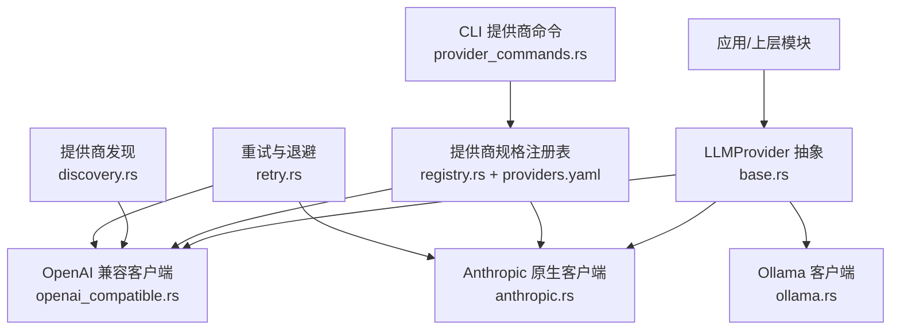
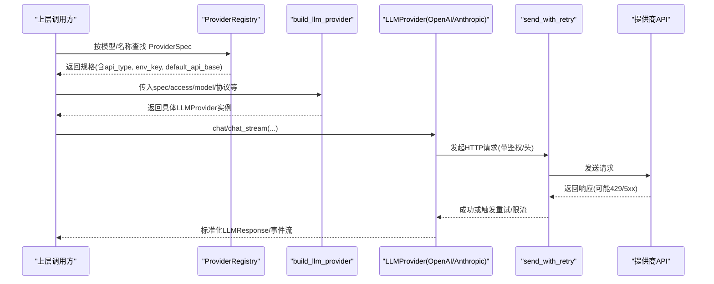
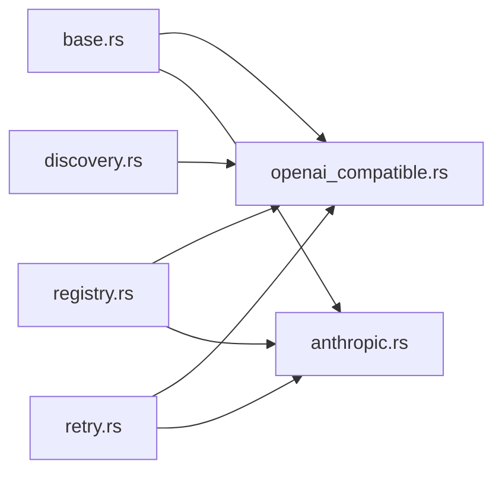

# 提供商配置

<cite>
**本文引用的文件**
- [agent-diva-providers/src/lib.rs](file://agent-diva-providers/src/lib.rs)
- [agent-diva-providers/src/factory.rs](file://agent-diva-providers/src/factory.rs)
- [agent-diva-providers/src/registry.rs](file://agent-diva-providers/src/registry.rs)
- [agent-diva-providers/src/discovery.rs](file://agent-diva-providers/src/discovery.rs)
- [agent-diva-providers/src/providers.yaml](file://agent-diva-providers/src/providers.yaml)
- [agent-diva-providers/src/base.rs](file://agent-diva-providers/src/base.rs)
- [agent-diva-providers/src/openai_compatible.rs](file://agent-diva-providers/src/openai_compatible.rs)
- [agent-diva-providers/src/anthropic.rs](file://agent-diva-providers/src/anthropic.rs)
- [agent-diva-providers/src/retry.rs](file://agent-diva-providers/src/retry.rs)
- [agent-diva-core/src/config/schema.rs](file://agent-diva-core/src/config/schema.rs)
- [agent-diva-cli/src/provider_commands.rs](file://agent-diva-cli/src/provider_commands.rs)
</cite>

## 目录
1. [简介](#简介)
2. [项目结构](#项目结构)
3. [核心组件](#核心组件)
4. [架构总览](#架构总览)
5. [详细组件分析](#详细组件分析)
6. [依赖关系分析](#依赖关系分析)
7. [性能与连接池](#性能与连接池)
8. [故障排查指南](#故障排查指南)
9. [结论](#结论)
10. [附录](#附录)

## 简介
本文件面向“提供商配置”主题，系统性说明 agent-diva 中 LLM 提供商的配置结构、认证方式、支持的提供商类型（OpenAI、Anthropic、Ollama、DeepSeek 等）、API Key 管理、模型选择、请求参数配置、多提供商配置示例与切换策略、提供商发现机制与动态注册、以及连接池与重试策略设置。文档以代码为依据，提供可追溯的源码路径与图示，帮助读者快速理解并正确配置。

## 项目结构
提供商子系统位于 agent-diva-providers 包内，围绕统一抽象 LLMProvider 实现多种后端适配；配置元数据集中定义在 providers.yaml；运行时通过工厂函数按 API 类型构建具体客户端；同时提供模型目录发现、重试与能力探测等通用能力。CLI 层暴露提供商列表、状态查询、模型枚举与凭据设置命令。

图表来源
- [agent-diva-providers/src/base.rs:708-780](file://agent-diva-providers/src/base.rs#L708-L780)
- [agent-diva-providers/src/openai_compatible.rs:168-184](file://agent-diva-providers/src/openai_compatible.rs#L168-L184)
- [agent-diva-providers/src/anthropic.rs:170-205](file://agent-diva-providers/src/anthropic.rs#L170-L205)
- [agent-diva-providers/src/registry.rs:73-108](file://agent-diva-providers/src/registry.rs#L73-L108)
- [agent-diva-providers/src/discovery.rs:63-113](file://agent-diva-providers/src/discovery.rs#L63-L113)
- [agent-diva-providers/src/retry.rs:86-181](file://agent-diva-providers/src/retry.rs#L86-L181)
- [agent-diva-cli/src/provider_commands.rs:25-52](file://agent-diva-cli/src/provider_commands.rs#L25-L52)

章节来源
- [agent-diva-providers/src/lib.rs:1-41](file://agent-diva-providers/src/lib.rs#L1-L41)
- [agent-diva-providers/src/registry.rs:73-108](file://agent-diva-providers/src/registry.rs#L73-L108)
- [agent-diva-cli/src/provider_commands.rs:25-52](file://agent-diva-cli/src/provider_commands.rs#L25-L52)

## 核心组件
- 统一抽象：LLMProvider 接口定义了 chat/chat_stream、默认模型、动态上下文传输、提示缓存策略、重试监听器与最终报文缓存监听器等能力。
- 适配器实现：
  - OpenAI 兼容客户端：支持标准 OpenAI 风格 /chat/completions 及流式响应，内置消息清洗、工具调用解析、使用量统计、缓存控制注入等。
  - Anthropic 原生客户端：直接对接 Messages API，处理 system blocks、thinking、tool_use/tool_result 等。
  - Ollama 客户端：本地或远端 Ollama 服务接入（由包导出）。
- 提供商注册与发现：
  - ProviderSpec 描述每个提供商的标识、API 类型、环境变量键、默认模型、默认 API Base、是否支持提示缓存、模型列表与模型级参数覆盖等。
  - ProviderRegistry 从内置 YAML 加载默认提供商集合，并提供按模型名/名称查找的能力。
  - discovery 模块提供运行时模型目录发现（当前对 OpenAI 兼容类型有效），失败时回退到静态列表。
- 构建与装配：
  - build_llm_provider 根据 spec.api_type 选择具体客户端，并注入 API Key、Base URL、额外头、推理努力、响应协议等。
- CLI 集成：
  - 提供商列表、状态、登录占位、模型枚举、凭据设置等命令，便于用户管理与切换。

章节来源
- [agent-diva-providers/src/base.rs:708-780](file://agent-diva-providers/src/base.rs#L708-L780)
- [agent-diva-providers/src/openai_compatible.rs:168-184](file://agent-diva-providers/src/openai_compatible.rs#L168-L184)
- [agent-diva-providers/src/anthropic.rs:170-205](file://agent-diva-providers/src/anthropic.rs#L170-L205)
- [agent-diva-providers/src/registry.rs:17-50](file://agent-diva-providers/src/registry.rs#L17-L50)
- [agent-diva-providers/src/discovery.rs:30-61](file://agent-diva-providers/src/discovery.rs#L30-L61)
- [agent-diva-providers/src/factory.rs:23-70](file://agent-diva-providers/src/factory.rs#L23-L70)
- [agent-diva-cli/src/provider_commands.rs:25-52](file://agent-diva-cli/src/provider_commands.rs#L25-L52)

## 架构总览
下图展示了从高层配置到具体 HTTP 调用的完整链路：CLI/上层模块通过配置与注册表确定提供商，工厂函数构建客户端，请求经重试封装后发往目标 API，响应被标准化为统一格式。

图表来源
- [agent-diva-providers/src/registry.rs:73-108](file://agent-diva-providers/src/registry.rs#L73-L108)
- [agent-diva-providers/src/factory.rs:23-70](file://agent-diva-providers/src/factory.rs#L23-L70)
- [agent-diva-providers/src/retry.rs:86-181](file://agent-diva-providers/src/retry.rs#L86-L181)
- [agent-diva-providers/src/openai_compatible.rs:616-660](file://agent-diva-providers/src/openai_compatible.rs#L616-L660)
- [agent-diva-providers/src/anthropic.rs:334-380](file://agent-diva-providers/src/anthropic.rs#L334-L380)

## 详细组件分析

### 提供商规格与注册表（providers.yaml）
- 字段含义
  - name/api_type：唯一标识与API类型（openai/anthropic/google/other）
  - keywords/env_key/display_name：用于匹配与显示
  - default_model/default_api_base：默认模型与API基础地址
  - gateway_prefix/skip_prefixes：网关前缀与跳过前缀（用于路由/重写）
  - env_extras：额外环境变量映射（如将 {api_key} 替换为目标变量）
  - supports_prompt_caching：是否支持提示缓存
  - models/model_overrides：模型白名单与按模型的参数覆盖
- 内置提供商
  - 包含 OpenAI、Anthropic、DeepSeek、Gemini、DashScope、Moonshot、MiniMax、vLLM、Groq、xAI、SiliconFlow、Together、Fireworks、Hunyuan 等大量提供商条目。
- 作用
  - 作为“单一事实源”，驱动模型发现、默认值、参数覆盖与能力标记。

章节来源
- [agent-diva-providers/src/registry.rs:17-50](file://agent-diva-providers/src/registry.rs#L17-L50)
- [agent-diva-providers/src/providers.yaml:1-163](file://agent-diva-providers/src/providers.yaml#L1-L163)
- [agent-diva-providers/src/providers.yaml:165-328](file://agent-diva-providers/src/providers.yaml#L165-L328)
- [agent-diva-providers/src/providers.yaml:330-800](file://agent-diva-providers/src/providers.yaml#L330-L800)

### 构建器与动态注册（factory.rs）
- 输入：ProviderSpec、ProviderAccess（api_key/api_base/extra_headers）、模型、推理努力、推理配置、响应协议
- 行为
  - 校验特定协议要求（例如 DeepseekV4Dsml 需要 deepseek-v4 系列模型）
  - 根据 api_type 选择 OpenAiCompatibleClient 或 AnthropicClient
  - 注入额外头、默认 API Base、提供商名称等
- 输出：Arc<dyn LLMProvider>，供上层统一调用

章节来源
- [agent-diva-providers/src/factory.rs:23-70](file://agent-diva-providers/src/factory.rs#L23-L70)
- [agent-diva-providers/src/factory.rs:81-169](file://agent-diva-providers/src/factory.rs#L81-L169)

### 运行时模型目录发现（discovery.rs）
- 策略
  - 若 api_type=openai 且存在 api_base，则尝试 GET /models 获取可用模型
  - 失败时允许回退到 providers.yaml 中的静态 models 列表
  - 不支持的类型返回 Unsupported 并附带错误信息
- 鉴权与扩展头
  - 自动附加 Bearer Token 与 extra_headers
- 结果
  - 返回 ProviderModelCatalog（source/runtime/static_fallback/error、models、warnings）

章节来源
- [agent-diva-providers/src/discovery.rs:63-113](file://agent-diva-providers/src/discovery.rs#L63-L113)
- [agent-diva-providers/src/discovery.rs:179-246](file://agent-diva-providers/src/discovery.rs#L179-L246)
- [agent-diva-providers/src/discovery.rs:276-285](file://agent-diva-providers/src/discovery.rs#L276-L285)

### OpenAI 兼容客户端（openai_compatible.rs）
- 关键能力
  - 消息清洗：去除控制字符与 ANSI 转义序列，避免 JSON 解析错误
  - 工具调用：解析 tool_calls，支持双编码字符串回退
  - 使用量统计：标准化 prompt/completion/total_tokens，兼容可选缓存 token 字段
  - 缓存控制：为首个稳定 system 文本块与最后一个工具添加 ephemeral 缓存标记（当提供商支持）
  - 模型覆盖：按模型名匹配 model_overrides 注入参数
  - 响应协议：支持 DeepseekV4Dsml 特殊解码流程
- 请求构造
  - 组装 ChatCompletionRequest，包括 model/messages/tools/tool_choice/stream/stream_options/reasoning_effort/max_tokens/temperature
- 鉴权
  - Authorization: Bearer <api_key>，并可追加 extra_headers

章节来源
- [agent-diva-providers/src/openai_compatible.rs:24-47](file://agent-diva-providers/src/openai_compatible.rs#L24-L47)
- [agent-diva-providers/src/openai_compatible.rs:168-184](file://agent-diva-providers/src/openai_compatible.rs#L168-L184)
- [agent-diva-providers/src/openai_compatible.rs:354-376](file://agent-diva-providers/src/openai_compatible.rs#L354-L376)
- [agent-diva-providers/src/openai_compatible.rs:378-423](file://agent-diva-providers/src/openai_compatible.rs#L378-L423)
- [agent-diva-providers/src/openai_compatible.rs:544-614](file://agent-diva-providers/src/openai_compatible.rs#L544-L614)
- [agent-diva-providers/src/openai_compatible.rs:616-660](file://agent-diva-providers/src/openai_compatible.rs#L616-L660)
- [agent-diva-providers/src/openai_compatible.rs:662-672](file://agent-diva-providers/src/openai_compatible.rs#L662-L672)

### Anthropic 原生客户端（anthropic.rs）
- 关键能力
  - 系统消息：转换为顶层 system blocks，首个 block 可加 ephemeral 缓存
  - 工具：转换 function schema，末尾工具可加缓存标记
  - 流式：SSE 事件解析，支持 text_delta/thinking_delta/input_json_delta，最终聚合 tool_calls
  - 鉴权：x-api-key 与 anthropic-version 头
- 请求构造
  - 构建 AnthropicRequest（model/messages/system/tools/stream）
- 响应解析
  - 合并 content/thinking/tool_use，生成 LLMResponse

章节来源
- [agent-diva-providers/src/anthropic.rs:21-33](file://agent-diva-providers/src/anthropic.rs#L21-L33)
- [agent-diva-providers/src/anthropic.rs:170-205](file://agent-diva-providers/src/anthropic.rs#L170-L205)
- [agent-diva-providers/src/anthropic.rs:211-240](file://agent-diva-providers/src/anthropic.rs#L211-L240)
- [agent-diva-providers/src/anthropic.rs:251-264](file://agent-diva-providers/src/anthropic.rs#L251-L264)
- [agent-diva-providers/src/anthropic.rs:334-380](file://agent-diva-providers/src/anthropic.rs#L334-L380)
- [agent-diva-providers/src/anthropic.rs:382-570](file://agent-diva-providers/src/anthropic.rs#L382-L570)

### Ollama 客户端（ollama.rs）
- 包导出 OllamaProvider，用于本地或远端 Ollama 服务访问（具体实现细节见对应文件）。

章节来源
- [agent-diva-providers/src/lib.rs:38-39](file://agent-diva-providers/src/lib.rs#L38-L39)

### 提供商发现与动态注册（registry.rs + discovery.rs）
- 注册表
  - 从 providers.yaml 加载默认提供商集合
  - 支持按模型关键词匹配与按名称精确查找
- 动态发现
  - 对 OpenAI 兼容类型，运行时拉取 /models 列表，失败回退静态列表
  - 非 OpenAI 兼容类型在当前构建中不支持运行时发现

章节来源
- [agent-diva-providers/src/registry.rs:73-108](file://agent-diva-providers/src/registry.rs#L73-L108)
- [agent-diva-providers/src/discovery.rs:63-113](file://agent-diva-providers/src/discovery.rs#L63-L113)

### CLI 提供商命令（provider_commands.rs）
- 提供商列表：展示各提供商状态、默认模型、是否当前激活
- 提供商状态：显示当前模型/提供商、缺失字段
- 提供商设置：写入默认 provider/model，更新凭据（api_key/api_base）
- 提供商模型：列出 runtime/static/custom 来源的模型

章节来源
- [agent-diva-cli/src/provider_commands.rs:25-52](file://agent-diva-cli/src/provider_commands.rs#L25-L52)
- [agent-diva-cli/src/provider_commands.rs:54-88](file://agent-diva-cli/src/provider_commands.rs#L54-L88)
- [agent-diva-cli/src/provider_commands.rs:90-153](file://agent-diva-cli/src/provider_commands.rs#L90-L153)
- [agent-diva-cli/src/provider_commands.rs:177-233](file://agent-diva-cli/src/provider_commands.rs#L177-L233)

## 依赖关系分析
- 耦合与内聚
  - base.rs 定义统一接口与通用数据结构，提高内聚性
  - openai_compatible.rs 与 anthropic.rs 分别实现不同协议，低耦合
  - registry.rs 与 providers.yaml 解耦配置与实现
  - discovery.rs 仅依赖 http_util 与 reqwest，职责清晰
- 外部依赖
  - reqwest 用于 HTTP 请求
  - serde/serde_json 用于序列化/反序列化
  - tokio 异步运行时
- 循环依赖
  - 未发现明显循环依赖；模块间通过 trait 与函数组合协作

图表来源
- [agent-diva-providers/src/base.rs:708-780](file://agent-diva-providers/src/base.rs#L708-L780)
- [agent-diva-providers/src/openai_compatible.rs:168-184](file://agent-diva-providers/src/openai_compatible.rs#L168-L184)
- [agent-diva-providers/src/anthropic.rs:170-205](file://agent-diva-providers/src/anthropic.rs#L170-L205)
- [agent-diva-providers/src/registry.rs:73-108](file://agent-diva-providers/src/registry.rs#L73-L108)
- [agent-diva-providers/src/discovery.rs:63-113](file://agent-diva-providers/src/discovery.rs#L63-L113)
- [agent-diva-providers/src/retry.rs:86-181](file://agent-diva-providers/src/retry.rs#L86-L181)

## 性能与连接池
- 连接复用
  - 各客户端使用 reqwest::Client 进行 HTTP 请求，建议复用 Client 实例以获得连接池效果（已在客户端内部持有 Client）
- 超时与空闲
  - 客户端初始化时设置合理超时（如 300s），Anthropic 流式读取设置空闲超时（如 60s）
- 重试策略
  - 指数退避 + 抖动，最大重试次数固定（默认 3 次）
  - 429 立即返回 RateLimited，不重试；5xx 与网络错误触发重试
  - 支持 on_retry 回调，便于 UI/日志上报
- 提示缓存
  - OpenAI 兼容与 Anthropic 均支持在合适位置注入 ephemeral 缓存控制，减少重复计算开销
- 模型能力与上下文窗口
  - 基于内置表估算上下文窗口，未知模型保守默认，避免超限

章节来源
- [agent-diva-providers/src/openai_compatible.rs:274-342](file://agent-diva-providers/src/openai_compatible.rs#L274-L342)
- [agent-diva-providers/src/anthropic.rs:182-205](file://agent-diva-providers/src/anthropic.rs#L182-L205)
- [agent-diva-providers/src/retry.rs:17-47](file://agent-diva-providers/src/retry.rs#L17-L47)
- [agent-diva-providers/src/retry.rs:86-181](file://agent-diva-providers/src/retry.rs#L86-L181)
- [agent-diva-providers/src/base.rs:155-246](file://agent-diva-providers/src/base.rs#L155-L246)

## 故障排查指南
- 常见错误分类
  - 配置错误：缺少 API Key、非法模型、协议不匹配（如 DeepseekV4Dsml 未使用 v4 模型）
  - 网络错误：超时、连接失败
  - 服务端错误：429 限流、5xx 服务器错误
  - 解析错误：JSON 解析失败、流式 UTF-8 不完整
- 定位方法
  - 使用 CLI 查看提供商状态与缺失字段
  - 检查 providers.yaml 中对应提供商的 env_key、default_api_base、models
  - 启用调试日志，关注重试与错误分类
- 处理建议
  - 429：遵循 Retry-After 或降低频率
  - 5xx：等待后重试，必要时更换提供商
  - JSON 解析失败：检查上游响应格式，必要时调整客户端解析逻辑

章节来源
- [agent-diva-providers/src/base.rs:10-61](file://agent-diva-providers/src/base.rs#L10-L61)
- [agent-diva-providers/src/retry.rs:49-75](file://agent-diva-providers/src/retry.rs#L49-L75)
- [agent-diva-cli/src/provider_commands.rs:54-88](file://agent-diva-cli/src/provider_commands.rs#L54-L88)

## 结论
agent-diva 的提供商体系以统一抽象为核心，结合声明式注册表与运行时发现，实现了多提供商的统一接入与灵活切换。通过重试、缓存控制与模型能力探测，系统在稳定性与性能方面具备良好保障。CLI 提供了便捷的管理入口，便于日常运维与问题定位。

## 附录

### 配置结构与认证方式
- 全局配置（schema.rs）
  - agents.defaults.provider/model/max_tokens/temperature/reasoning_effort/thinking_mode
  - providers.<name>.api_key/api_base/extra_headers/custom_models
- 认证方式
  - OpenAI 兼容：Authorization: Bearer <api_key>
  - Anthropic：x-api-key + anthropic-version
  - 其他：依据 providers.yaml 中 env_key 与环境变量注入

章节来源
- [agent-diva-core/src/config/schema.rs:559-603](file://agent-diva-core/src/config/schema.rs#L559-L603)
- [agent-diva-providers/src/openai_compatible.rs:662-672](file://agent-diva-providers/src/openai_compatible.rs#L662-L672)
- [agent-diva-providers/src/anthropic.rs:251-264](file://agent-diva-providers/src/anthropic.rs#L251-L264)
- [agent-diva-providers/src/providers.yaml:106-163](file://agent-diva-providers/src/providers.yaml#L106-L163)

### 支持的提供商类型与配置选项
- OpenAI 兼容（openai）
  - 适用：OpenAI、OpenRouter、AiHubMix、DeepSeek、Gemini、DashScope、Moonshot、MiniMax、vLLM、Groq、xAI、SiliconFlow、Together、Fireworks、Hunyuan 等
  - 选项：api_key、api_base、extra_headers、model_overrides、supports_prompt_caching
- Anthropic（anthropic）
  - 适用：Claude 系列
  - 选项：api_key、api_base、system blocks、tools、prompt caching
- Ollama（本地/远端）
  - 适用：本地部署的 Ollama 服务
  - 选项：api_base（通常为 http://localhost:11434/v1）
- DeepSeek
  - 通过 openai 类型接入，支持 deepseek-v4 系列与 dsml 协议

章节来源
- [agent-diva-providers/src/providers.yaml:1-163](file://agent-diva-providers/src/providers.yaml#L1-L163)
- [agent-diva-providers/src/providers.yaml:165-328](file://agent-diva-providers/src/providers.yaml#L165-L328)
- [agent-diva-providers/src/providers.yaml:330-800](file://agent-diva-providers/src/providers.yaml#L330-L800)
- [agent-diva-providers/src/factory.rs:23-70](file://agent-diva-providers/src/factory.rs#L23-L70)

### API Key 管理
- 环境变量映射：loader 中将常见环境变量（如 OPENAI_API_KEY、DEEPSEEK_API_KEY 等）映射到 providers.<name>.api_key
- 运行时注入：ProviderAccess.from_config 提取 api_key/api_base/extra_headers
- 安全建议：避免硬编码，优先使用环境变量或密钥管理服务

章节来源
- [agent-diva-core/src/config/loader.rs:371-381](file://agent-diva-core/src/config/loader.rs#L371-L381)
- [agent-diva-providers/src/discovery.rs:30-61](file://agent-diva-providers/src/discovery.rs#L30-L61)

### 模型选择与请求参数配置
- 默认模型：来自 providers.yaml 的 default_model 或 agents.defaults.model
- 模型覆盖：model_overrides 可按模型注入 temperature 等参数
- 请求参数：max_tokens、temperature、tool_choice、stream、reasoning_effort、response_protocol

章节来源
- [agent-diva-providers/src/providers.yaml:106-163](file://agent-diva-providers/src/providers.yaml#L106-L163)
- [agent-diva-providers/src/openai_compatible.rs:616-660](file://agent-diva-providers/src/openai_compatible.rs#L616-L660)
- [agent-diva-providers/src/factory.rs:23-70](file://agent-diva-providers/src/factory.rs#L23-L70)

### 多提供商配置示例与切换策略
- 配置示例
  - 在 providers.yaml 中新增或修改提供商条目（name、api_type、env_key、default_api_base、models）
  - 在 CLI 中使用 provider set 设置默认提供商与模型
- 切换策略
  - 通过 agents.defaults.provider 切换默认提供商
  - 通过 CLI 或配置文件动态更改，无需重启（配合 DynamicProvider 可实现热切换）

章节来源
- [agent-diva-providers/src/providers.yaml:1-163](file://agent-diva-providers/src/providers.yaml#L1-L163)
- [agent-diva-cli/src/provider_commands.rs:90-153](file://agent-diva-cli/src/provider_commands.rs#L90-L153)
- [agent-diva-providers/src/lib.rs:46-70](file://agent-diva-providers/src/lib.rs#L46-L70)

### 提供商发现机制与动态注册
- 发现机制
  - OpenAI 兼容类型：GET /models 获取模型列表，失败回退静态列表
  - 非 OpenAI 兼容：当前构建不支持运行时发现
- 动态注册
  - 通过 providers.yaml 扩展新提供商，无需修改代码即可被注册表识别

章节来源
- [agent-diva-providers/src/discovery.rs:63-113](file://agent-diva-providers/src/discovery.rs#L63-L113)
- [agent-diva-providers/src/registry.rs:73-108](file://agent-diva-providers/src/registry.rs#L73-L108)

### 连接池配置与重试策略设置
- 连接池
  - 复用 reqwest::Client，自动连接池管理
- 重试策略
  - 指数退避 + 抖动，最大重试次数固定
  - 429 限流不重试，5xx 与网络错误重试
  - 支持 on_retry 回调用于进度上报

章节来源
- [agent-diva-providers/src/retry.rs:17-47](file://agent-diva-providers/src/retry.rs#L17-L47)
- [agent-diva-providers/src/retry.rs:86-181](file://agent-diva-providers/src/retry.rs#L86-L181)