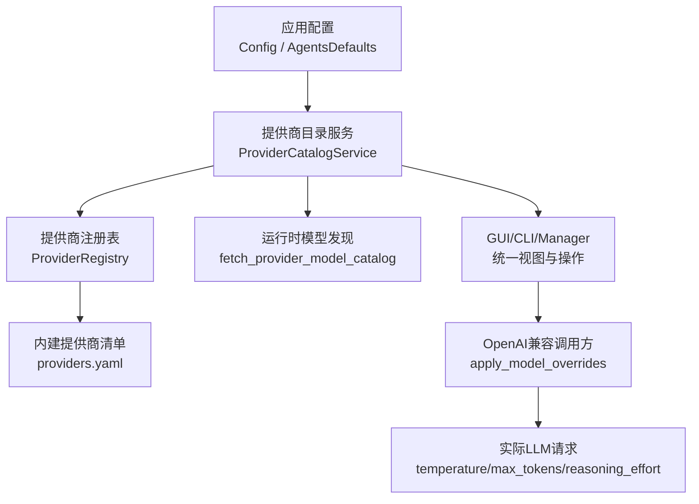
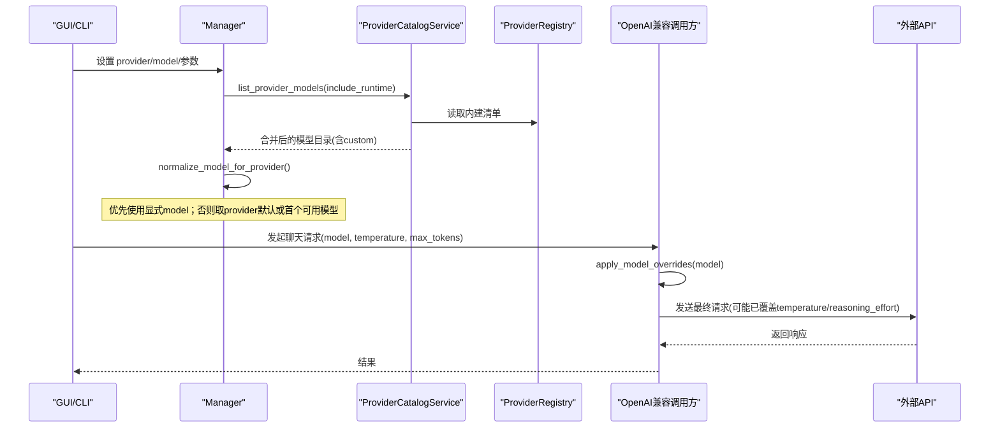
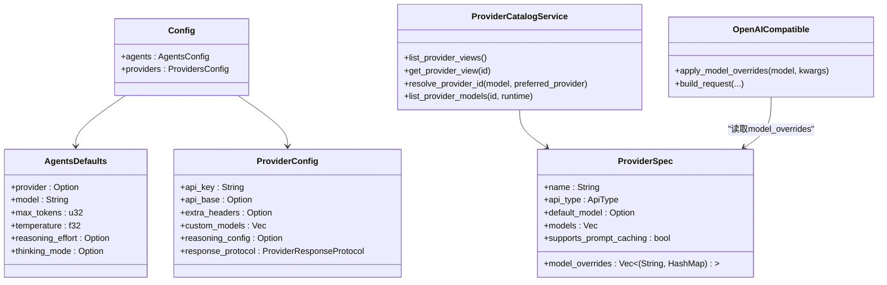

# 模型配置

<cite>
**本文引用的文件**
- [agent-diva-core/src/config/schema.rs](file://agent-diva-core/src/config/schema.rs)
- [agent-diva-providers/src/registry.rs](file://agent-diva-providers/src/registry.rs)
- [agent-diva-providers/src/catalog.rs](file://agent-diva-providers/src/catalog.rs)
- [agent-diva-providers/src/openai_compatible.rs](file://agent-diva-providers/src/openai_compatible.rs)
- [agent-diva-manager/src/manager.rs](file://agent-diva-manager/src/manager.rs)
- [agent-diva-gui/src/App.vue](file://agent-diva-gui/src/App.vue)
- [agent-diva-gui/src/components/settings/ProvidersSettings.vue](file://agent-diva-gui/src/components/settings/ProvidersSettings.vue)
- [agent-diva-providers/src/providers.yaml](file://agent-diva-providers/src/providers.yaml)
</cite>

## 目录
1. [简介](#简介)
2. [项目结构](#项目结构)
3. [核心组件](#核心组件)
4. [架构总览](#架构总览)
5. [详细组件分析](#详细组件分析)
6. [依赖关系分析](#依赖关系分析)
7. [性能与成本考量](#性能与成本考量)
8. [故障排查指南](#故障排查指南)
9. [结论](#结论)
10. [附录](#附录)

## 简介
本文件聚焦 Agent-Diva 的“模型配置”能力，覆盖：
- 模型选择策略与默认模型来源
- 模型参数设置（temperature、max_tokens、top_p 等）
- 模型覆盖机制 model_overrides 的使用方式
- 不同提供商的模型列表与特性说明
- 模型切换与动态加载的配置方法
- 性能与成本维度的实践建议

## 项目结构
围绕模型配置的关键代码分布在以下模块：
- 配置结构定义：core 层 schema 定义了全局默认、提供商配置、自定义提供商等
- 提供商注册表与目录：providers 层 registry/catalog 提供模型清单、运行时发现、视图合并
- 请求构建与参数覆盖：openai_compatible 实现 apply_model_overrides 并注入到请求
- 管理器归一化：manager 层负责 provider/model 解析与回退
- GUI 交互：App.vue 与 ProvidersSettings.vue 负责用户编辑与保存

图表来源
- [agent-diva-core/src/config/schema.rs:560-603](file://agent-diva-core/src/config/schema.rs#L560-L603)
- [agent-diva-providers/src/registry.rs:104-107](file://agent-diva-providers/src/registry.rs#L104-L107)
- [agent-diva-providers/src/catalog.rs:161-193](file://agent-diva-providers/src/catalog.rs#L161-L193)
- [agent-diva-providers/src/openai_compatible.rs:354-368](file://agent-diva-providers/src/openai_compatible.rs#L354-L368)

章节来源
- [agent-diva-core/src/config/schema.rs:560-603](file://agent-diva-core/src/config/schema.rs#L560-L603)
- [agent-diva-providers/src/registry.rs:104-107](file://agent-diva-providers/src/registry.rs#L104-L107)
- [agent-diva-providers/src/catalog.rs:161-193](file://agent-diva-providers/src/catalog.rs#L161-L193)
- [agent-diva-providers/src/openai_compatible.rs:354-368](file://agent-diva-providers/src/openai_compatible.rs#L354-L368)

## 核心组件
- 全局默认与模型参数
  - agents.defaults.provider：默认提供商
  - agents.defaults.model：默认模型
  - agents.defaults.max_tokens：默认最大输出 token
  - agents.defaults.temperature：默认温度
  - agents.defaults.reasoning_effort/thinking_mode：推理努力与思考模式开关
- 提供商配置
  - ProviderConfig：api_key、api_base、extra_headers、custom_models、reasoning_config、response_protocol
  - CustomProviderConfig：display_name、api_type、api_key、api_base、default_model、models、extra_headers
- 提供商目录与视图
  - ProviderView：id、display_name、source、api_type、default_model、configured/ready、runtime_supported
  - ProviderModelCatalogView：provider、catalog_source、runtime_supported、models、custom_models、warnings/error
- 请求侧参数覆盖
  - apply_model_overrides：按模型匹配 providers.yaml 中的 model_overrides，将 temperature、reasoning_effort 等注入请求

章节来源
- [agent-diva-core/src/config/schema.rs:560-603](file://agent-diva-core/src/config/schema.rs#L560-L603)
- [agent-diva-core/src/config/schema.rs:1226-1278](file://agent-diva-core/src/config/schema.rs#L1226-L1278)
- [agent-diva-providers/src/catalog.rs:24-57](file://agent-diva-providers/src/catalog.rs#L24-L57)
- [agent-diva-providers/src/openai_compatible.rs:354-368](file://agent-diva-providers/src/openai_compatible.rs#L354-L368)

## 架构总览
模型选择与参数生效的整体流程如下：

图表来源
- [agent-diva-manager/src/manager.rs:193-241](file://agent-diva-manager/src/manager.rs#L193-L241)
- [agent-diva-providers/src/catalog.rs:161-193](file://agent-diva-providers/src/catalog.rs#L161-L193)
- [agent-diva-providers/src/openai_compatible.rs:822-860](file://agent-diva-providers/src/openai_compatible.rs#L822-L860)

## 详细组件分析

### 模型选择策略与默认模型
- 优先级顺序（由 Manager 归一化逻辑决定）
  1) 显式传入的 model（若属于当前 provider 或 catalog 中可见）
  2) provider 的 default_model（来自 providers.yaml 或自定义提供商）
  3) 该 provider 模型目录的第一个可用模型
  4) 回退为请求时的原始 model
- 提供商识别
  - 通过 resolve_provider_id：优先使用 preferred_provider，其次 agents.defaults.provider，再根据 model 前缀或 registry 反查
- 运行时模型发现
  - 对 OpenAI 兼容且提供 api_base 的自定义提供商，可启用 include_runtime=true 拉取在线模型目录

章节来源
- [agent-diva-manager/src/manager.rs:193-241](file://agent-diva-manager/src/manager.rs#L193-L241)
- [agent-diva-providers/src/catalog.rs:111-145](file://agent-diva-providers/src/catalog.rs#L111-L145)
- [agent-diva-providers/src/catalog.rs:161-193](file://agent-diva-providers/src/catalog.rs#L161-L193)

### 模型参数设置：temperature、max_tokens、top_p 等
- 全局默认
  - agents.defaults.temperature：默认温度
  - agents.defaults.max_tokens：默认最大输出 token
  - agents.defaults.reasoning_effort/thinking_mode：推理努力与思考模式
- 请求构建时
  - openai_compatible 在构建请求时，会先尝试从 model_overrides 中读取 temperature、reasoning_effort 等键，若存在则覆盖默认值
  - top_p 未在源码中直接体现为覆盖项；如需支持，可在 providers.yaml 的 model_overrides 中添加对应键值
- 注意
  - 不同提供商对参数的支持不同，例如 reasoning_effort 仅对具备推理能力的模型有效

章节来源
- [agent-diva-core/src/config/schema.rs:560-603](file://agent-diva-core/src/config/schema.rs#L560-L603)
- [agent-diva-providers/src/openai_compatible.rs:822-860](file://agent-diva-providers/src/openai_compatible.rs#L822-L860)
- [agent-diva-providers/src/openai_compatible.rs:354-368](file://agent-diva-providers/src/openai_compatible.rs#L354-L368)

### 模型覆盖机制（model_overrides）
- 位置与格式
  - 位于 providers.yaml 每个 provider 的 model_overrides 字段
  - 形式为 (pattern, { key: value }) 列表，pattern 用于子串匹配模型名
- 生效时机
  - 发起请求前，openai_compatible.apply_model_overrides 会根据模型名匹配并注入 kwargs（如 temperature、reasoning_effort）
- 示例
  - moonshot 的 kimi-k2.5 模型设置了 temperature=1.0 的覆盖

章节来源
- [agent-diva-providers/src/providers.yaml:282-284](file://agent-diva-providers/src/providers.yaml#L282-L284)
- [agent-diva-providers/src/openai_compatible.rs:354-368](file://agent-diva-providers/src/openai_compatible.rs#L354-L368)

### 不同提供商的模型列表与特性
- 内建提供商清单与默认模型
  - 由 providers.yaml 集中维护，包含 name、api_type、default_model、models、supports_prompt_caching 等
  - 常见提供商：openai、anthropic、deepseek、gemini、dashscope、moonshot、minimax、vllm、groq、xai、zhipu 等
- 特性说明
  - supports_prompt_caching：是否支持提示缓存（Anthropic、部分 OpenAI 兼容网关）
  - is_gateway/is_local：是否为网关或本地服务
  - default_api_base：默认 API Base
- 自定义提供商
  - 可通过 CustomProviderConfig 添加新的提供商实例，支持 api_base、default_model、models、extra_headers

章节来源
- [agent-diva-providers/src/providers.yaml:1-800](file://agent-diva-providers/src/providers.yaml#L1-L800)
- [agent-diva-providers/src/registry.rs:17-50](file://agent-diva-providers/src/registry.rs#L17-L50)
- [agent-diva-core/src/config/schema.rs:1257-1278](file://agent-diva-core/src/config/schema.rs#L1257-L1278)

### 模型切换与动态加载
- GUI 切换
  - App.vue 在保存提供商配置时，会写入 agents.defaults.provider 与 agents.defaults.model，并更新对应提供商槽位
  - ProvidersSettings.vue 展示当前提供商状态、就绪情况与当前模型
- 动态加载
  - 对 OpenAI 兼容且提供 api_base 的自定义提供商，list_provider_models 可启用 include_runtime=true 进行在线模型发现
  - 管理器 normalize_model_for_provider 会在切换后重新归一化模型，确保选择合法

章节来源
- [agent-diva-gui/src/App.vue:751-782](file://agent-diva-gui/src/App.vue#L751-L782)
- [agent-diva-gui/src/components/settings/ProvidersSettings.vue:983-999](file://agent-diva-gui/src/components/settings/ProvidersSettings.vue#L983-L999)
- [agent-diva-providers/src/catalog.rs:161-193](file://agent-diva-providers/src/catalog.rs#L161-L193)
- [agent-diva-manager/src/manager.rs:193-241](file://agent-diva-manager/src/manager.rs#L193-L241)

## 依赖关系分析
- 配置层（schema.rs）提供全局默认与提供商配置结构
- 目录层（registry.rs + providers.yaml）提供内建提供商元数据与模型清单
- 目录服务（catalog.rs）合并静态与自定义模型，并提供运行时发现
- 调用层（openai_compatible.rs）在请求前应用 model_overrides
- 管理层（manager.rs）负责 provider/model 解析与回退
- GUI（App.vue、ProvidersSettings.vue）负责用户编辑与持久化

图表来源
- [agent-diva-core/src/config/schema.rs:560-603](file://agent-diva-core/src/config/schema.rs#L560-L603)
- [agent-diva-core/src/config/schema.rs:1226-1278](file://agent-diva-core/src/config/schema.rs#L1226-L1278)
- [agent-diva-providers/src/registry.rs:17-50](file://agent-diva-providers/src/registry.rs#L17-L50)
- [agent-diva-providers/src/catalog.rs:71-79](file://agent-diva-providers/src/catalog.rs#L71-L79)
- [agent-diva-providers/src/openai_compatible.rs:354-368](file://agent-diva-providers/src/openai_compatible.rs#L354-L368)

## 性能与成本考量
- 温度与推理努力
  - temperature 影响创造性与稳定性；高温度适合创意任务，低温度适合确定性任务
  - reasoning_effort 仅在支持推理的模型上生效，合理设置可减少不必要的计算开销
- 最大输出 token
  - max_tokens 控制响应长度；过大可能导致延迟与成本上升，过小可能截断内容
- 提示缓存
  - supports_prompt_caching 的提供商可利用系统消息缓存降低重复请求成本
- 模型选择
  - 根据任务复杂度选择合适的模型层级；简单任务优先低成本模型
- 运行时发现
  - 开启 include_runtime 可获得最新模型，但会增加一次网络探测开销

[本节为通用指导，不直接分析具体文件]

## 故障排查指南
- 模型无法选择或回退异常
  - 检查 normalize_model_for_provider 的优先级：显式 model -> provider default_model -> 第一个可用模型
  - 确认 provider 已配置 api_key 或 api_base，处于 ready 状态
- 模型覆盖未生效
  - 核对 providers.yaml 中 model_overrides 的 pattern 是否与模型名匹配
  - 确认 openai_compatible.apply_model_overrides 被调用并成功注入 kwargs
- 运行时模型发现失败
  - 确认自定义提供商 api_type=openai 且提供了有效的 api_base
  - 查看 catalog.list_provider_models 的 warnings/error 信息

章节来源
- [agent-diva-manager/src/manager.rs:193-241](file://agent-diva-manager/src/manager.rs#L193-L241)
- [agent-diva-providers/src/openai_compatible.rs:354-368](file://agent-diva-providers/src/openai_compatible.rs#L354-L368)
- [agent-diva-providers/src/catalog.rs:161-193](file://agent-diva-providers/src/catalog.rs#L161-L193)

## 结论
Agent-Diva 的模型配置体系以“全局默认 + 提供商清单 + 运行时发现 + 模型覆盖”为核心，既保证了开箱即用的体验，又提供了灵活的定制能力。通过统一的目录服务与清晰的优先级规则，用户可以便捷地切换模型、调整参数，并在多提供商环境下获得一致的操作体验。结合提示缓存与合理的参数设置，可以在质量、性能与成本之间取得良好平衡。

## 附录

### 提供商与模型概览（节选）
- OpenAI：gpt-4o、gpt-4o-mini、gpt-4-turbo、gpt-4、gpt-3.5-turbo、o1-preview、o1-mini、gpt-5.x 系列、gpt-image-1
- Anthropic：claude-3-5-sonnet、claude-opus-4-6、claude-sonnet-4-5、claude-haiku-4-5
- DeepSeek：deepseek-v4-pro、deepseek-v4-flash、deepseek-chat、deepseek-coder、deepseek-reasoner
- Gemini：gemini-1.5-pro、gemini-1.5-flash、gemini-2.0-flash-exp、gemini-2.5-flash、gemini-2.5-pro、gemini-3-pro-preview
- DashScope（Qwen）：qwen-max、qwen-plus、qwen-turbo、qwen-vl-max、qwen-vl-plus、qwen3-max、qwen3.5-plus
- Moonshot：moonshot-v1-8k、moonshot-v1-32k、moonshot-v1-128k、kimi-k2.5、kimi-k2-thinking
- MiniMax：abab6.5-chat、abab6.5s-chat、abab5.5-chat、MiniMax-M2.5、MiniMax-M2
- vLLM/Local：meta-llama/Llama-3.3-70B-Instruct（示例）
- Groq：llama3-8b-8192、llama3-70b-8192、mixtral-8x7b-32768、gemma-7b-it、mistral-saba-24b、gemma-9b-it
- xAI：grok-beta、grok-vision-beta、grok-4、grok-3
- Zhipu：glm-4、glm-4-air、glm-4-flash、glm-3-turbo、glm-5、glm-4.7、glm-4.6、glm-4.5、embedding-3

章节来源
- [agent-diva-providers/src/providers.yaml:1-800](file://agent-diva-providers/src/providers.yaml#L1-L800)