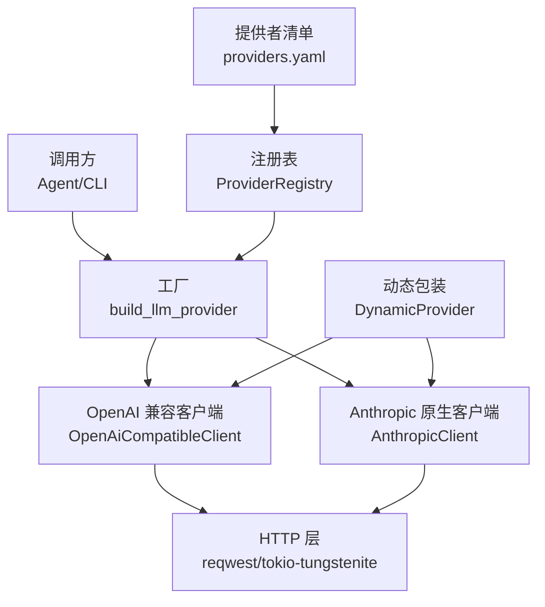
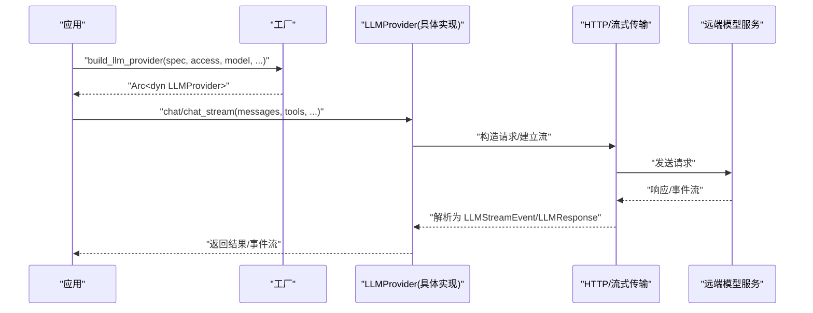
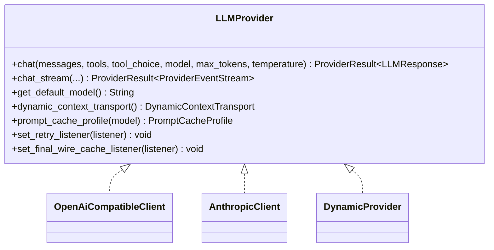
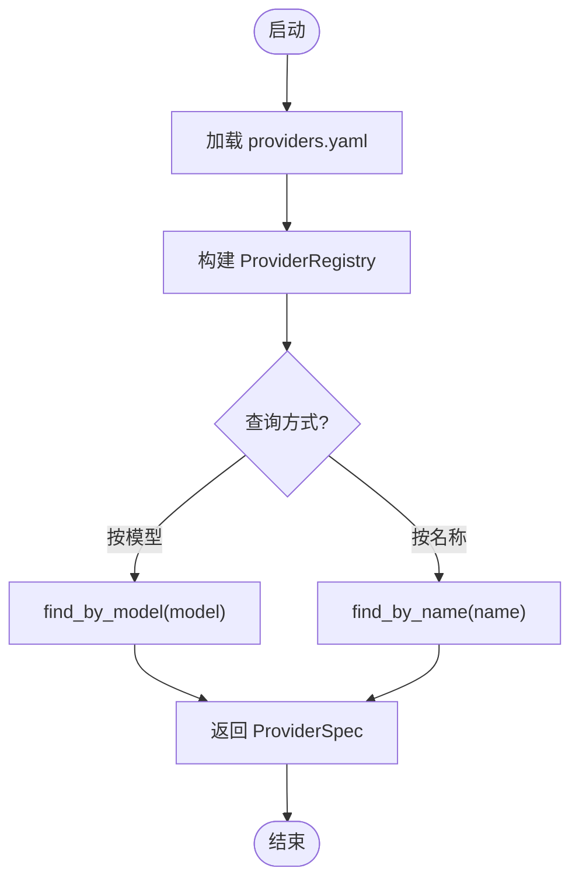
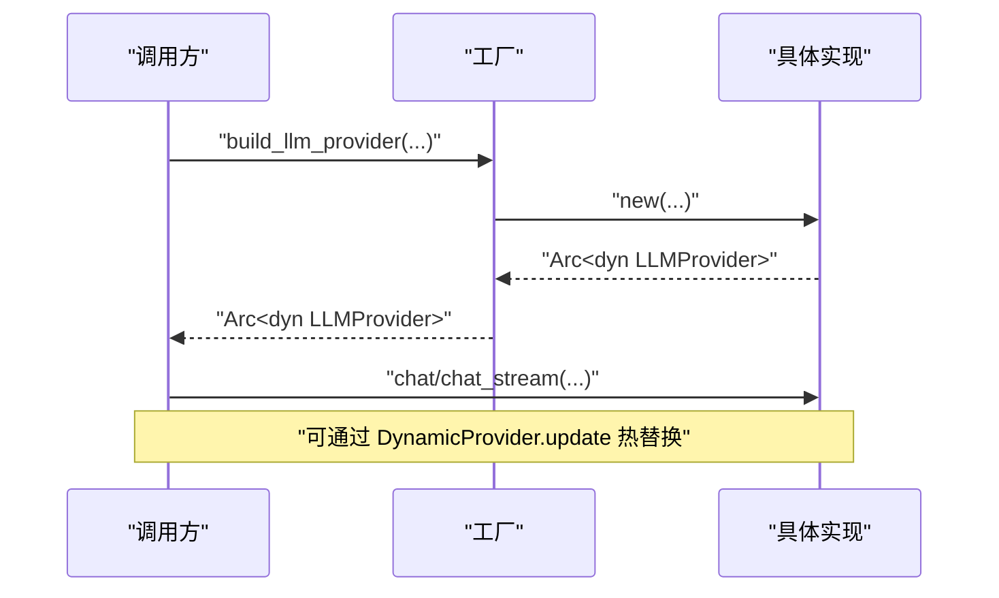
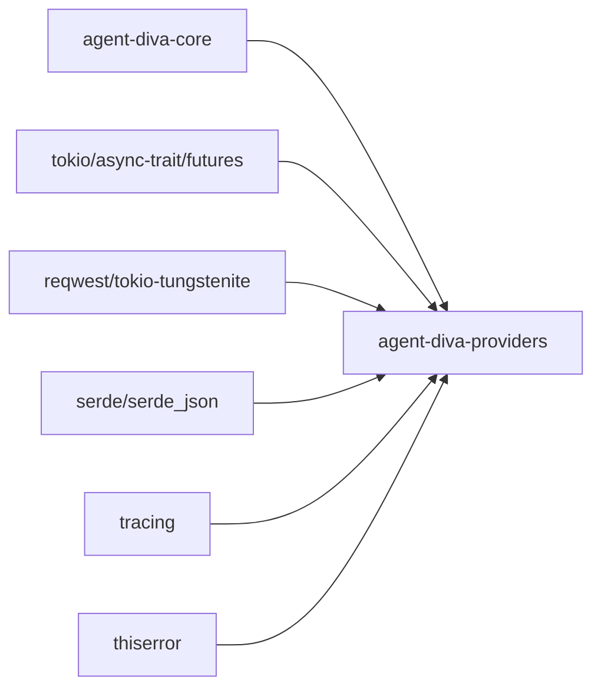

# 自定义提供商

<cite>
**本文引用的文件**
- [agent-diva-providers/src/lib.rs](file://agent-diva-providers/src/lib.rs)
- [agent-diva-providers/src/base.rs](file://agent-diva-providers/src/base.rs)
- [agent-diva-providers/src/registry.rs](file://agent-diva-providers/src/registry.rs)
- [agent-diva-providers/src/factory.rs](file://agent-diva-providers/src/factory.rs)
- [agent-diva-providers/src/openai_compatible.rs](file://agent-diva-providers/src/openai_compatible.rs)
- [agent-diva-providers/src/anthropic.rs](file://agent-diva-providers/src/anthropic.rs)
- [agent-diva-providers/src/providers.yaml](file://agent-diva-providers/src/providers.yaml)
- [agent-diva-providers/Cargo.toml](file://agent-diva-providers/Cargo.toml)
- [agent-diva-providers/examples/siliconflow_chat_completions.rs](file://agent-diva-providers/examples/siliconflow_chat_completions.rs)
- [agent-diva-providers/tests/provider_retry.rs](file://agent-diva-providers/tests/provider_retry.rs)
</cite>

## 目录
1. [简介](#简介)
2. [项目结构](#项目结构)
3. [核心组件](#核心组件)
4. [架构总览](#架构总览)
5. [详细组件分析](#详细组件分析)
6. [依赖关系分析](#依赖关系分析)
7. [性能考量](#性能考量)
8. [故障排查指南](#故障排查指南)
9. [结论](#结论)
10. [附录](#附录)

## 简介
本文件面向希望为 Agent Diva 开发“自定义 LLM 提供商适配器”的开发者。内容涵盖：
- Provider Trait（LLMProvider）接口与实现要求
- 提供商注册机制与生命周期管理
- 完整的最小可运行示例与最佳实践
- 测试方法与调试技巧
- 提供商打包与分发指导

## 项目结构
providers crate 提供统一的 LLM 抽象、具体实现、注册表与构建器，以及示例与测试。关键路径如下：
- 抽象与类型：base.rs
- 注册表与元数据：registry.rs + providers.yaml
- 构建器：factory.rs
- 具体实现：openai_compatible.rs、anthropic.rs
- 动态包装与热插拔：lib.rs（DynamicProvider）
- 示例与测试：examples/*、tests/*

图表来源
- [agent-diva-providers/src/factory.rs:23-70](file://agent-diva-providers/src/factory.rs#L23-L70)
- [agent-diva-providers/src/openai_compatible.rs:168-184](file://agent-diva-providers/src/openai_compatible.rs#L168-L184)
- [agent-diva-providers/src/anthropic.rs:170-180](file://agent-diva-providers/src/anthropic.rs#L170-L180)
- [agent-diva-providers/src/registry.rs:73-108](file://agent-diva-providers/src/registry.rs#L73-L108)
- [agent-diva-providers/src/lib.rs:46-70](file://agent-diva-providers/src/lib.rs#L46-L70)

章节来源
- [agent-diva-providers/src/lib.rs:1-42](file://agent-diva-providers/src/lib.rs#L1-L42)
- [agent-diva-providers/Cargo.toml:1-50](file://agent-diva-providers/Cargo.toml#L1-L50)

## 核心组件
- LLMProvider Trait：定义 chat/chat_stream、默认模型、上下文传输策略、提示缓存配置、重试监听等能力。
- OpenAI 兼容客户端：适配遵循 OpenAI 协议的网关/服务。
- Anthropic 原生客户端：直接对接 Anthropic Messages API。
- ProviderRegistry：加载 providers.yaml 中的提供商元数据，支持按模型名或名称查找。
- build_llm_provider：根据 spec 与访问信息构造具体客户端，并可选地包装在 ProviderTap 中。
- DynamicProvider：运行时可替换底层实现的线程安全包装。

章节来源
- [agent-diva-providers/src/base.rs:708-780](file://agent-diva-providers/src/base.rs#L708-L780)
- [agent-diva-providers/src/openai_compatible.rs:168-184](file://agent-diva-providers/src/openai_compatible.rs#L168-L184)
- [agent-diva-providers/src/anthropic.rs:170-180](file://agent-diva-providers/src/anthropic.rs#L170-L180)
- [agent-diva-providers/src/registry.rs:73-108](file://agent-diva-providers/src/registry.rs#L73-L108)
- [agent-diva-providers/src/factory.rs:23-70](file://agent-diva-providers/src/factory.rs#L23-L70)
- [agent-diva-providers/src/lib.rs:46-70](file://agent-diva-providers/src/lib.rs#L46-L70)

## 架构总览
下图展示了从高层到网络层的调用链与职责划分。

图表来源
- [agent-diva-providers/src/factory.rs:23-70](file://agent-diva-providers/src/factory.rs#L23-L70)
- [agent-diva-providers/src/base.rs:708-780](file://agent-diva-providers/src/base.rs#L708-L780)
- [agent-diva-providers/src/openai_compatible.rs:168-184](file://agent-diva-providers/src/openai_compatible.rs#L168-L184)
- [agent-diva-providers/src/anthropic.rs:170-180](file://agent-diva-providers/src/anthropic.rs#L170-L180)

## 详细组件分析

### LLMProvider Trait 与实现要求
- 必须实现的方法
  - chat：非流式对话
  - get_default_model：返回默认模型
- 可选但建议实现
  - chat_stream：流式对话（默认会回退为非流式并封装为事件）
  - dynamic_context_transport：控制对话历史后上下文消息的传输方式
  - prompt_cache_profile：声明对特定模型的提示缓存策略
  - set_retry_listener / set_final_wire_cache_listener：注入重试与最终报文监听
- 错误与分类
  - ProviderError 统一错误类型，并与错误分类体系集成（如超时、限流、配置错误、致命错误）

图表来源
- [agent-diva-providers/src/base.rs:708-780](file://agent-diva-providers/src/base.rs#L708-L780)
- [agent-diva-providers/src/openai_compatible.rs:168-184](file://agent-diva-providers/src/openai_compatible.rs#L168-L184)
- [agent-diva-providers/src/anthropic.rs:170-180](file://agent-diva-providers/src/anthropic.rs#L170-L180)
- [agent-diva-providers/src/lib.rs:46-70](file://agent-diva-providers/src/lib.rs#L46-L70)

章节来源
- [agent-diva-providers/src/base.rs:10-67](file://agent-diva-providers/src/base.rs#L10-L67)
- [agent-diva-providers/src/base.rs:708-780](file://agent-diva-providers/src/base.rs#L708-L780)

### 提供商注册机制
- 元数据来源：providers.yaml 内嵌于二进制，包含 name、api_type、keywords、env_key、default_api_base、models、model_overrides 等。
- 注册表能力：
  - all()：列出所有提供商
  - find_by_model(model)：按模型关键字匹配
  - find_by_name(name)：按名称精确匹配
- 默认提供商由 include_str! 加载，无需外部文件。

图表来源
- [agent-diva-providers/src/registry.rs:73-108](file://agent-diva-providers/src/registry.rs#L73-L108)
- [agent-diva-providers/src/providers.yaml:1-120](file://agent-diva-providers/src/providers.yaml#L1-L120)

章节来源
- [agent-diva-providers/src/registry.rs:1-108](file://agent-diva-providers/src/registry.rs#L1-L108)
- [agent-diva-providers/src/providers.yaml:1-120](file://agent-diva-providers/src/providers.yaml#L1-L120)

### 提供商构建与生命周期
- 构建入口：build_llm_provider(options)
  - 校验 response_protocol 与模型名的兼容性（例如 DeepSeek V4 DSML 协议限制）
  - 根据 api_type 选择 OpenAI 兼容或 Anthropic 客户端
  - 将 extra_headers 与 reasoning_config 等传入
- 生命周期
  - 创建：工厂构造具体客户端实例
  - 使用：通过 Arc<dyn LLMProvider> 调用 chat/chat_stream
  - 替换：DynamicProvider 可在运行时更换底层实现
  - 销毁：随引用计数释放

图表来源
- [agent-diva-providers/src/factory.rs:23-70](file://agent-diva-providers/src/factory.rs#L23-L70)
- [agent-diva-providers/src/lib.rs:46-70](file://agent-diva-providers/src/lib.rs#L46-L70)

章节来源
- [agent-diva-providers/src/factory.rs:23-70](file://agent-diva-providers/src/factory.rs#L23-L70)
- [agent-diva-providers/src/lib.rs:46-70](file://agent-diva-providers/src/lib.rs#L46-L70)

### 具体实现要点

#### OpenAI 兼容客户端
- 负责将通用 Message/ToolCallRequest 映射为 OpenAI 风格请求体
- 处理流式事件（文本增量、工具调用增量、完成事件）
- 支持额外请求头、reasoning_effort、response_protocol 等选项

章节来源
- [agent-diva-providers/src/openai_compatible.rs:168-184](file://agent-diva-providers/src/openai_compatible.rs#L168-L184)

#### Anthropic 原生客户端
- 直接对接 Anthropic Messages API，处理 system blocks、thinking/tool_use/tool_result 等内容块
- 流式事件包括 text_delta、thinking_delta、input_json_delta 及 message 完成事件

章节来源
- [agent-diva-providers/src/anthropic.rs:170-180](file://agent-diva-providers/src/anthropic.rs#L170-L180)

### 自定义提供商开发步骤（最小可行示例）
目标：实现一个遵循 LLMProvider 的新提供商适配器，并通过工厂注册使用。

步骤概览
1. 新建模块并实现 LLMProvider Trait
   - 实现 chat/chat_stream/get_default_model
   - 按需实现 dynamic_context_transport/prompt_cache_profile
   - 实现 set_retry_listener/set_final_wire_cache_listener（若内部有重试或需要上报最终报文）
2. 在工厂中添加分支
   - 在 build_llm_provider 中新增对应 ApiType 或条件分支，返回你的实现
3. （可选）在 providers.yaml 添加元数据
   - 填写 name、api_type、keywords、env_key、default_api_base、models 等
4. 编写单元测试与集成测试
   - 使用 mockito 模拟 HTTP 响应
   - 验证流式事件与错误分类
5. 打包与分发
   - 作为独立 crate 发布，或在 monorepo 中以 path 依赖引入

参考路径
- Trait 定义与类型：[agent-diva-providers/src/base.rs:708-780](file://agent-diva-providers/src/base.rs#L708-L780)
- 工厂扩展点：[agent-diva-providers/src/factory.rs:23-70](file://agent-diva-providers/src/factory.rs#L23-L70)
- 注册表元数据：[agent-diva-providers/src/registry.rs:73-108](file://agent-diva-providers/src/registry.rs#L73-L108)
- 清单文件：[agent-diva-providers/src/providers.yaml:1-120](file://agent-diva-providers/src/providers.yaml#L1-L120)

最佳实践
- 保持向后兼容：不破坏现有 Message/ToolCallRequest/LLMResponse 语义
- 明确错误分类：区分可重试与致命错误，便于上层重试与降级
- 流式优先：尽量实现 chat_stream，避免阻塞
- 谨慎处理 UTF-8 分片：复用 StreamingUtf8Decoder 或等价逻辑
- 暴露必要的能力：vision/tools/reasoning/context_window 通过 ModelCapabilities 判断

章节来源
- [agent-diva-providers/src/base.rs:10-67](file://agent-diva-providers/src/base.rs#L10-L67)
- [agent-diva-providers/src/base.rs:708-780](file://agent-diva-providers/src/base.rs#L708-L780)
- [agent-diva-providers/src/factory.rs:23-70](file://agent-diva-providers/src/factory.rs#L23-L70)
- [agent-diva-providers/src/registry.rs:73-108](file://agent-diva-providers/src/registry.rs#L73-L108)
- [agent-diva-providers/src/providers.yaml:1-120](file://agent-diva-providers/src/providers.yaml#L1-L120)

### 端到端示例：直接调用 OpenAI 兼容接口
仓库提供了可直接运行的示例，演示如何向 OpenAI 兼容端点发起聊天请求、解析响应与流式事件。

- 示例入口与参数：环境变量、命令行参数
- 请求构造：POST /chat/completions，携带 model、messages、stream、max_tokens、temperature
- 响应解析：choices/message/content、finish_reason、reasoning_content、trace_id

参考路径
- [agent-diva-providers/examples/siliconflow_chat_completions.rs:1-180](file://agent-diva-providers/examples/siliconflow_chat_completions.rs#L1-L180)

章节来源
- [agent-diva-providers/examples/siliconflow_chat_completions.rs:1-180](file://agent-diva-providers/examples/siliconflow_chat_completions.rs#L1-L180)

## 依赖关系分析
- 运行时依赖
  - tokio、async-trait、futures：异步与流式
  - reqwest、tokio-tungstenite：HTTP 与 WebSocket/SSE 流
  - serde/serde_json：序列化/反序列化
  - tracing：日志与追踪
  - thiserror：错误类型
- 项目内依赖
  - agent-diva-core：错误分类、配置、推理配置等

图表来源
- [agent-diva-providers/Cargo.toml:12-49](file://agent-diva-providers/Cargo.toml#L12-L49)

章节来源
- [agent-diva-providers/Cargo.toml:12-49](file://agent-diva-providers/Cargo.toml#L12-L49)

## 性能考量
- 流式优先：减少首字节延迟，提升交互体验
- 连接复用：使用共享 reqwest::Client，避免频繁握手
- 合理超时：根据模型与服务设置合适的超时与重试策略
- 缓冲与解码：正确处理多字节 UTF-8 分片，避免无效字符替换
- 上下文传输策略：选择合适的 DynamicContextTransport，降低不必要的重排或丢弃
- 提示缓存：在支持的提供商上启用 PromptCacheProfile，减少重复计算

[本节为通用指导，不直接分析具体文件]

## 故障排查指南
常见问题与定位方法
- 配置错误
  - 现象：构建失败或无法识别提供商
  - 检查：providers.yaml 中 name/api_type/env_key/default_api_base 是否正确
  - 参考：[agent-diva-providers/src/registry.rs:73-108](file://agent-diva-providers/src/registry.rs#L73-L108)
- 网络/鉴权错误
  - 现象：HTTP 错误或鉴权失败
  - 检查：API Key、Base URL、Extra Headers
  - 参考：[agent-diva-providers/src/openai_compatible.rs:168-184](file://agent-diva-providers/src/openai_compatible.rs#L168-L184)
- 流式中断或乱码
  - 现象：流中断、UTF-8 异常
  - 检查：StreamingUtf8Decoder 的使用与 finish 调用
  - 参考：[agent-diva-providers/src/base.rs:82-129](file://agent-diva-providers/src/base.rs#L82-L129)
- 重试与降级
  - 现象：偶发 429/超时
  - 检查：set_retry_listener 是否生效，错误分类是否为可重试
  - 参考：[agent-diva-providers/src/base.rs:34-67](file://agent-diva-providers/src/base.rs#L34-L67)
- 协议不兼容
  - 现象：DeepSeek V4 DSML 协议报错
  - 检查：response_protocol 与模型名匹配
  - 参考：[agent-diva-providers/src/factory.rs:23-70](file://agent-diva-providers/src/factory.rs#L23-L70)

测试与调试
- 单元测试：mockito 模拟 HTTP 响应，断言事件序列
- 集成测试：provider_retry 等用例验证重试行为
- 日志与追踪：启用 tracing，记录请求/响应与错误上下文

章节来源
- [agent-diva-providers/tests/provider_retry.rs](file://agent-diva-providers/tests/provider_retry.rs)
- [agent-diva-providers/src/base.rs:34-67](file://agent-diva-providers/src/base.rs#L34-L67)
- [agent-diva-providers/src/base.rs:82-129](file://agent-diva-providers/src/base.rs#L82-L129)
- [agent-diva-providers/src/factory.rs:23-70](file://agent-diva-providers/src/factory.rs#L23-L70)

## 结论
通过 LLMProvider Trait 的统一抽象，Agent Diva 实现了跨多家 LLM 服务的可插拔接入。借助 ProviderRegistry 与 build_llm_provider，开发者可以以最小成本扩展新的提供商；结合 DynamicProvider 可实现运行时热切换。遵循错误分类、流式优先与合理的超时/重试策略，可获得稳定且高性能的调用体验。

[本节为总结性内容，不直接分析具体文件]

## 附录

### 提供商清单字段说明（节选）
- name：提供商唯一标识
- api_type：openai | anthropic | google | other
- keywords：用于模型名匹配的关键词
- env_key：API Key 的环境变量名
- display_name：显示名称
- default_model：默认模型
- gateway_prefix/skip_prefixes：网关前缀与跳过规则
- env_extras：额外环境变量映射
- default_api_base：默认 API Base
- supports_prompt_caching：是否支持提示缓存
- models/model_overrides：模型列表与覆盖参数

章节来源
- [agent-diva-providers/src/providers.yaml:1-120](file://agent-diva-providers/src/providers.yaml#L1-L120)

### 快速上手清单
- 实现 LLMProvider Trait
- 在工厂中增加分支
- 在 providers.yaml 添加元数据
- 编写单测/集成测试
- 本地联调与日志追踪
- 打包发布（crate 或 monorepo 依赖）

[本节为操作清单，不直接分析具体文件]