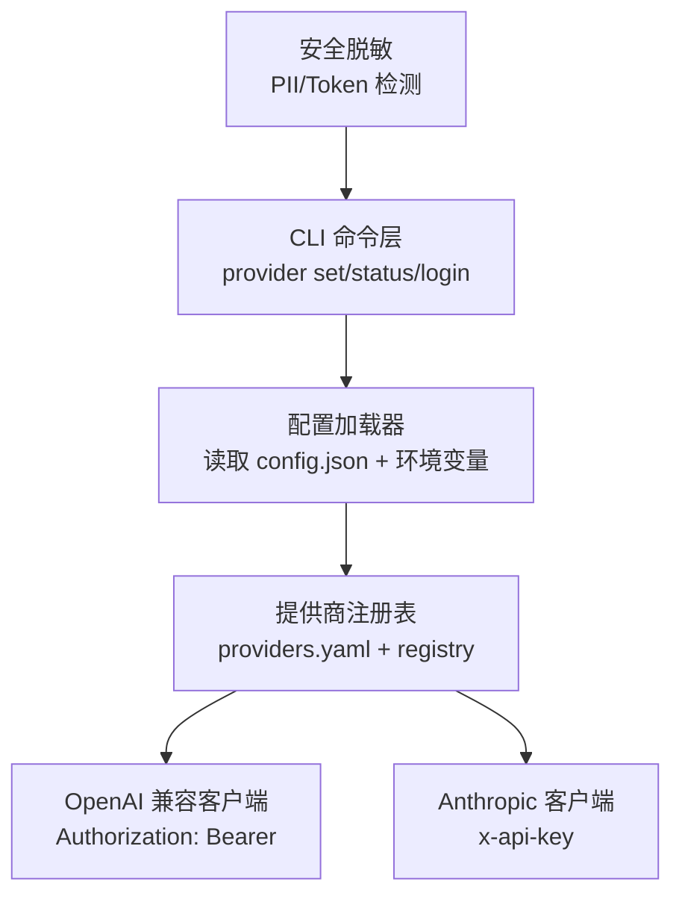
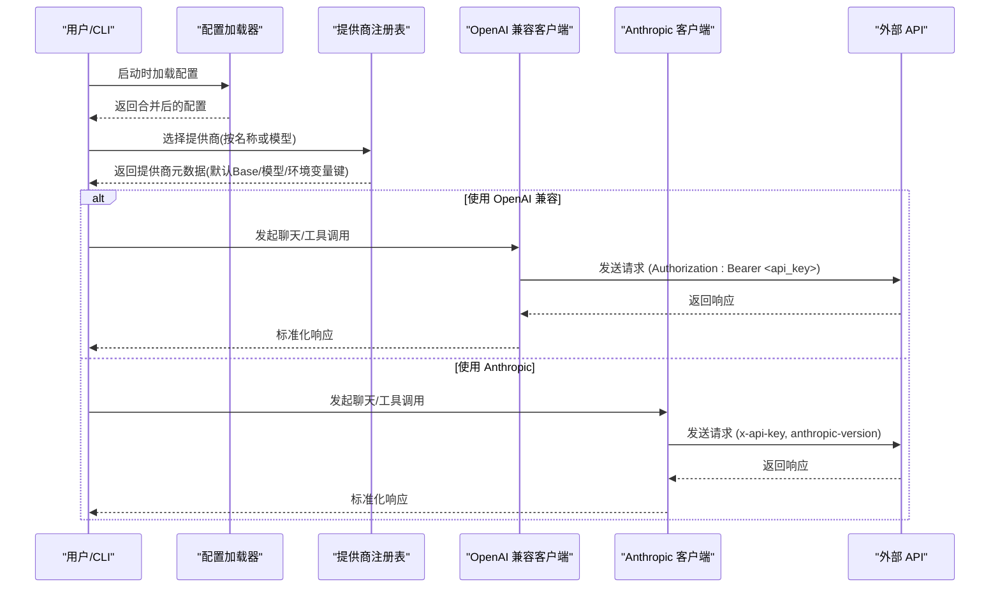
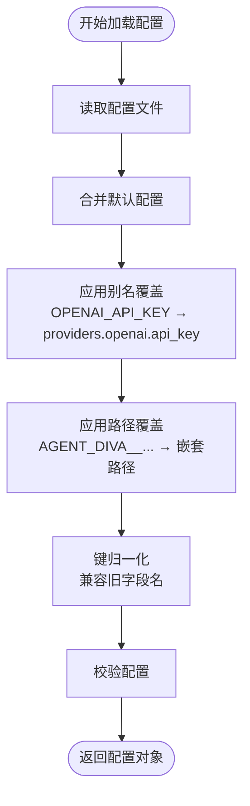
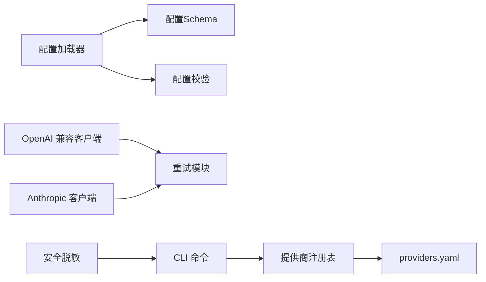

# 认证配置

<cite>
**本文引用的文件**
- [agent-diva-core/src/config/loader.rs](file://agent-diva-core/src/config/loader.rs)
- [agent-diva-providers/src/providers.yaml](file://agent-diva-providers/src/providers.yaml)
- [agent-diva-providers/src/registry.rs](file://agent-diva-providers/src/registry.rs)
- [agent-diva-providers/src/openai_compatible.rs](file://agent-diva-providers/src/openai_compatible.rs)
- [agent-diva-providers/src/anthropic.rs](file://agent-diva-providers/src/anthropic.rs)
- [agent-diva-providers/src/retry.rs](file://agent-diva-providers/src/retry.rs)
- [agent-diva-cli/src/provider_commands.rs](file://agent-diva-cli/src/provider_commands.rs)
- [agent-diva-core/src/security/pii.rs](file://agent-diva-core/src/security/pii.rs)
</cite>

## 目录
1. [简介](#简介)
2. [项目结构](#项目结构)
3. [核心组件](#核心组件)
4. [架构总览](#架构总览)
5. [详细组件分析](#详细组件分析)
6. [依赖关系分析](#依赖关系分析)
7. [性能与可靠性](#性能与可靠性)
8. [故障排除指南](#故障排除指南)
9. [结论](#结论)
10. [附录：环境变量与多提供商配置示例](#附录：环境变量与多提供商配置示例)

## 简介
本文件聚焦于 Agent Diva 的认证配置，覆盖以下主题：
- 支持的认证方式：API Key、Bearer Token、OAuth（当前实现状态）
- 环境变量注入与优先级：如 OPENAI_API_KEY、ANTHROPIC_API_KEY 等
- 密钥管理最佳实践与安全建议
- 多提供商认证配置方法
- 认证失败处理机制与重试策略

## 项目结构
认证相关能力分布在如下模块：
- 配置加载与环境变量映射：将环境变量合并到配置对象，并应用别名与路径覆盖
- 提供商注册表与清单：声明各提供商的 API 类型、默认模型、默认 Base URL、所需环境变量键名等
- 具体提供商客户端：OpenAI 兼容客户端使用 Bearer Token；Anthropic 原生客户端使用专用 Header
- CLI 命令：提供 provider set/status/login/models 等能力
- 安全脱敏：日志与输出中自动识别并脱敏敏感令牌

**图示来源**
- [agent-diva-core/src/config/loader.rs:57-73](file://agent-diva-core/src/config/loader.rs#L57-L73)
- [agent-diva-providers/src/providers.yaml:106-138](file://agent-diva-providers/src/providers.yaml#L106-L138)
- [agent-diva-providers/src/openai_compatible.rs:662-672](file://agent-diva-providers/src/openai_compatible.rs#L662-L672)
- [agent-diva-providers/src/anthropic.rs:251-264](file://agent-diva-providers/src/anthropic.rs#L251-L264)
- [agent-diva-cli/src/provider_commands.rs:90-153](file://agent-diva-cli/src/provider_commands.rs#L90-L153)
- [agent-diva-core/src/security/pii.rs:192-216](file://agent-diva-core/src/security/pii.rs#L192-L216)

**章节来源**
- [agent-diva-core/src/config/loader.rs:57-73](file://agent-diva-core/src/config/loader.rs#L57-L73)
- [agent-diva-providers/src/providers.yaml:106-138](file://agent-diva-providers/src/providers.yaml#L106-L138)
- [agent-diva-providers/src/openai_compatible.rs:662-672](file://agent-diva-providers/src/openai_compatible.rs#L662-L672)
- [agent-diva-providers/src/anthropic.rs:251-264](file://agent-diva-providers/src/anthropic.rs#L251-L264)
- [agent-diva-cli/src/provider_commands.rs:90-153](file://agent-diva-cli/src/provider_commands.rs#L90-L153)
- [agent-diva-core/src/security/pii.rs:192-216](file://agent-diva-core/src/security/pii.rs#L192-L216)

## 核心组件
- 配置加载器：负责从配置文件与环境变量合并配置，支持别名映射与路径覆盖，并在热重载时计算差异
- 提供商注册表：集中声明各提供商元数据（API 类型、默认模型、Base URL、环境变量键名等）
- OpenAI 兼容客户端：通过 Authorization: Bearer 发送请求，支持流式与非流式调用
- Anthropic 客户端：通过 x-api-key 与 anthropic-version 头进行认证
- CLI 提供商命令：设置默认提供商/模型、查看状态、列出模型、登录占位
- 安全脱敏：在日志和输出中识别并替换敏感令牌模式

**章节来源**
- [agent-diva-core/src/config/loader.rs:57-73](file://agent-diva-core/src/config/loader.rs#L57-L73)
- [agent-diva-providers/src/registry.rs:17-50](file://agent-diva-providers/src/registry.rs#L17-L50)
- [agent-diva-providers/src/openai_compatible.rs:662-672](file://agent-diva-providers/src/openai_compatible.rs#L662-L672)
- [agent-diva-providers/src/anthropic.rs:251-264](file://agent-diva-providers/src/anthropic.rs#L251-L264)
- [agent-diva-cli/src/provider_commands.rs:90-153](file://agent-diva-cli/src/provider_commands.rs#L90-L153)
- [agent-diva-core/src/security/pii.rs:192-216](file://agent-diva-core/src/security/pii.rs#L192-L216)

## 架构总览
下图展示了从配置加载到提供商调用的整体流程，以及认证头的注入位置。

**图示来源**
- [agent-diva-core/src/config/loader.rs:57-73](file://agent-diva-core/src/config/loader.rs#L57-L73)
- [agent-diva-providers/src/providers.yaml:106-138](file://agent-diva-providers/src/providers.yaml#L106-L138)
- [agent-diva-providers/src/openai_compatible.rs:662-672](file://agent-diva-providers/src/openai_compatible.rs#L662-L672)
- [agent-diva-providers/src/anthropic.rs:251-264](file://agent-diva-providers/src/anthropic.rs#L251-L264)

## 详细组件分析

### 配置加载与环境变量映射
- 配置文件与默认值合并后，依次应用：
  - 别名覆盖：将常见环境变量（如 OPENAI_API_KEY、ANTHROPIC_API_KEY）映射到 providers.*.api_key
  - 路径覆盖：以 AGENT_DIVA__ 前缀的环境变量按双下划线分割为路径，直接写入配置树
  - 键归一化：兼容历史字段名（如 mcpServers/mcp_servers、neuro_link/generic_pipe、pet→mate）
- 热重载：后台轮询配置文件修改时间，计算差异并分类为“可热重载”或“需重启”

**图示来源**
- [agent-diva-core/src/config/loader.rs:57-73](file://agent-diva-core/src/config/loader.rs#L57-L73)
- [agent-diva-core/src/config/loader.rs:371-416](file://agent-diva-core/src/config/loader.rs#L371-L416)
- [agent-diva-core/src/config/loader.rs:429-463](file://agent-diva-core/src/config/loader.rs#L429-L463)

**章节来源**
- [agent-diva-core/src/config/loader.rs:57-73](file://agent-diva-core/src/config/loader.rs#L57-L73)
- [agent-diva-core/src/config/loader.rs:371-416](file://agent-diva-core/src/config/loader.rs#L371-L416)
- [agent-diva-core/src/config/loader.rs:429-463](file://agent-diva-core/src/config/loader.rs#L429-L463)

### 提供商注册表与清单
- providers.yaml 集中定义各提供商的：
  - api_type（openai / anthropic 等）
  - env_key（所需环境变量键名）
  - default_model、default_api_base
  - gateway_prefix、skip_prefixes、supports_prompt_caching 等
- registry.rs 提供按名称或模型查找 ProviderSpec 的能力

**章节来源**
- [agent-diva-providers/src/providers.yaml:106-138](file://agent-diva-providers/src/providers.yaml#L106-L138)
- [agent-diva-providers/src/providers.yaml:77-104](file://agent-diva-providers/src/providers.yaml#L77-L104)
- [agent-diva-providers/src/registry.rs:17-50](file://agent-diva-providers/src/registry.rs#L17-L50)
- [agent-diva-providers/src/registry.rs:91-107](file://agent-diva-providers/src/registry.rs#L91-L107)

### OpenAI 兼容客户端（Bearer Token）
- 认证方式：在请求头中添加 Authorization: Bearer <api_key>
- 适用场景：OpenAI、DeepSeek、Gemini、Groq、Moonshot、Zhipu、DashScope 等通过 OpenAI 兼容接口暴露的提供商
- 其他特性：消息内容清洗、工具调用参数解析、流式事件处理、缓存控制标注

**章节来源**
- [agent-diva-providers/src/openai_compatible.rs:662-672](file://agent-diva-providers/src/openai_compatible.rs#L662-L672)
- [agent-diva-providers/src/openai_compatible.rs:251-342](file://agent-diva-providers/src/openai_compatible.rs#L251-L342)

### Anthropic 客户端（x-api-key）
- 认证方式：添加 x-api-key 与 anthropic-version 头
- 适用场景：Anthropic 原生 Messages API
- 其他特性：系统消息块、工具定义转换、SSE 流式事件解析

**章节来源**
- [agent-diva-providers/src/anthropic.rs:251-264](file://agent-diva-providers/src/anthropic.rs#L251-L264)
- [agent-diva-providers/src/anthropic.rs:170-205](file://agent-diva-providers/src/anthropic.rs#L170-L205)

### CLI 提供商命令
- provider set：设置默认提供商与模型，并可写入 api_key/api_base
- provider status：显示当前提供商与缺失字段
- provider login：当前构建中的占位实现，提示 OAuth/device flow 尚未实现
- provider models：列出提供商可用模型及来源

**章节来源**
- [agent-diva-cli/src/provider_commands.rs:90-153](file://agent-diva-cli/src/provider_commands.rs#L90-L153)
- [agent-diva-cli/src/provider_commands.rs:155-175](file://agent-diva-cli/src/provider_commands.rs#L155-L175)
- [agent-diva-cli/src/provider_commands.rs:177-233](file://agent-diva-cli/src/provider_commands.rs#L177-L233)

### 安全与脱敏
- 日志与输出中会检测并替换多种敏感令牌模式，包括：
  - sk-*、pk-*、GitHub PAT、Bearer 令牌等
- 该机制有助于避免意外泄露密钥

**章节来源**
- [agent-diva-core/src/security/pii.rs:192-216](file://agent-diva-core/src/security/pii.rs#L192-L216)

## 依赖关系分析
- 配置加载器依赖 schema 与 validate 模块完成结构与规则校验
- 提供商客户端依赖 http_util 构建 HTTP 客户端，并统一通过 retry 模块进行重试
- CLI 命令依赖 provider_registry 与 catalog service 获取提供商视图与模型列表
- 安全模块独立于业务逻辑，对日志/输出进行脱敏

**图示来源**
- [agent-diva-core/src/config/loader.rs:57-73](file://agent-diva-core/src/config/loader.rs#L57-L73)
- [agent-diva-providers/src/providers.yaml:106-138](file://agent-diva-providers/src/providers.yaml#L106-L138)
- [agent-diva-providers/src/retry.rs:94-181](file://agent-diva-providers/src/retry.rs#L94-L181)
- [agent-diva-cli/src/provider_commands.rs:90-153](file://agent-diva-cli/src/provider_commands.rs#L90-L153)
- [agent-diva-core/src/security/pii.rs:192-216](file://agent-diva-core/src/security/pii.rs#L192-L216)

**章节来源**
- [agent-diva-core/src/config/loader.rs:57-73](file://agent-diva-core/src/config/loader.rs#L57-L73)
- [agent-diva-providers/src/providers.yaml:106-138](file://agent-diva-providers/src/providers.yaml#L106-L138)
- [agent-diva-providers/src/retry.rs:94-181](file://agent-diva-providers/src/retry.rs#L94-L181)
- [agent-diva-cli/src/provider_commands.rs:90-153](file://agent-diva-cli/src/provider_commands.rs#L90-L153)
- [agent-diva-core/src/security/pii.rs:192-216](file://agent-diva-core/src/security/pii.rs#L192-L216)

## 性能与可靠性
- 重试策略：
  - 指数退避加抖动，最大重试次数为 3 次
  - 对 5xx 与网络错误进行重试；对 429 立即标记为限流错误
  - 支持可选的重试监听回调，便于前端展示进度
- 超时与空闲：
  - 客户端默认连接超时较长（约 300 秒），适合长耗时推理
  - Anthropic 流式空闲超时为 60 秒，防止长时间无数据导致资源占用
- 流式处理：
  - OpenAI 兼容与 Anthropic 均支持 SSE 流式事件解析，逐步推送文本与工具调用增量

**章节来源**
- [agent-diva-providers/src/retry.rs:17-47](file://agent-diva-providers/src/retry.rs#L17-L47)
- [agent-diva-providers/src/retry.rs:55-75](file://agent-diva-providers/src/retry.rs#L55-L75)
- [agent-diva-providers/src/retry.rs:94-181](file://agent-diva-providers/src/retry.rs#L94-L181)
- [agent-diva-providers/src/anthropic.rs:18-19](file://agent-diva-providers/src/anthropic.rs#L18-L19)
- [agent-diva-providers/src/openai_compatible.rs:251-342](file://agent-diva-providers/src/openai_compatible.rs#L251-L342)

## 故障排除指南
- 认证失败常见原因
  - 未设置对应提供商的环境变量或配置文件中的 api_key 为空
  - 使用了错误的 Base URL（例如自定义网关地址未正确配置）
  - 提供商要求特定头部（如 Anthropic 需要 anthropic-version）
- 诊断步骤
  - 使用 provider status 检查当前提供商是否就绪与缺失字段
  - 使用 provider models 验证模型列表与来源
  - 检查日志中是否出现敏感令牌被脱敏的提示，确认实际发送的令牌是否正确
- 重试与限流
  - 遇到 5xx 或网络错误会自动重试；遇到 429 会返回限流错误
  - 若频繁限流，考虑降低并发或等待 Retry-After 后再试

**章节来源**
- [agent-diva-cli/src/provider_commands.rs:54-88](file://agent-diva-cli/src/provider_commands.rs#L54-L88)
- [agent-diva-cli/src/provider_commands.rs:177-233](file://agent-diva-cli/src/provider_commands.rs#L177-L233)
- [agent-diva-providers/src/retry.rs:55-75](file://agent-diva-providers/src/retry.rs#L55-L75)
- [agent-diva-core/src/security/pii.rs:192-216](file://agent-diva-core/src/security/pii.rs#L192-L216)

## 结论
- 本项目通过配置加载器与环境变量映射，实现了统一的认证配置入口
- 提供商注册表集中管理各提供商的认证方式与默认参数
- OpenAI 兼容与 Anthropic 客户端分别采用 Bearer Token 与专用 Header 进行认证
- CLI 提供了便捷的提供商管理与查询能力；OAuth 登录在当前版本中为占位实现
- 安全脱敏与重试机制提升了系统的健壮性与安全性

## 附录：环境变量与多提供商配置示例
- 环境变量映射（部分）
  - OPENAI_API_KEY → providers.openai.api_key
  - ANTHROPIC_API_KEY → providers.anthropic.api_key
  - DEEPSEEK_API_KEY → providers.deepseek.api_key
  - GEMINI_API_KEY → providers.gemini.api_key
  - GROQ_API_KEY → providers.groq.api_key
  - DASHSCOPE_API_KEY → providers.dashscope.api_key
  - MOONSHOT_API_KEY → providers.moonshot.api_key
  - MINIMAX_API_KEY → providers.minimax.api_key
  - HOSTED_VLLM_API_KEY → providers.vllm.api_key
  - AIHUBMIX_API_KEY → providers.aihubmix.api_key
  - ZAI_API_KEY → providers.zhipu.api_key
  - ZHIPUAI_API_KEY → providers.zhipu.api_key
- 路径覆盖环境变量（示例）
  - AGENT_DIVA__PROVIDERS__OPENAI__API_KEY
  - AGENT_DIVA__PROVIDERS__ANTHROPIC__API_KEY
  - AGENT_DIVA__AGENTS__DEFAULTS__MODEL
  - AGENT_DIVA__CHANNELS__TELEGRAM__TOKEN
- 多提供商配置要点
  - 为每个提供商设置对应的环境变量或配置文件中的 api_key
  - 如需使用自定义网关，设置 providers.<name>.api_base
  - 使用 provider set 指定默认提供商与模型
  - 使用 provider status 检查缺失字段与就绪状态

**章节来源**
- [agent-diva-core/src/config/loader.rs:371-394](file://agent-diva-core/src/config/loader.rs#L371-L394)
- [agent-diva-core/src/config/loader.rs:396-416](file://agent-diva-core/src/config/loader.rs#L396-L416)
- [agent-diva-providers/src/providers.yaml:106-138](file://agent-diva-providers/src/providers.yaml#L106-L138)
- [agent-diva-providers/src/providers.yaml:77-104](file://agent-diva-providers/src/providers.yaml#L77-L104)
- [agent-diva-cli/src/provider_commands.rs:90-153](file://agent-diva-cli/src/provider_commands.rs#L90-L153)