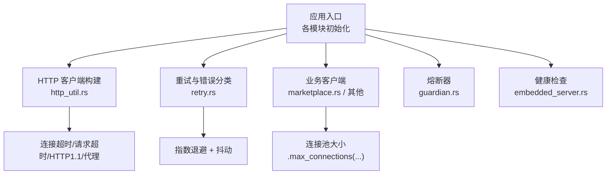
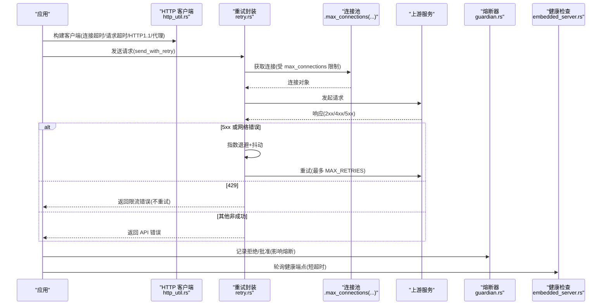
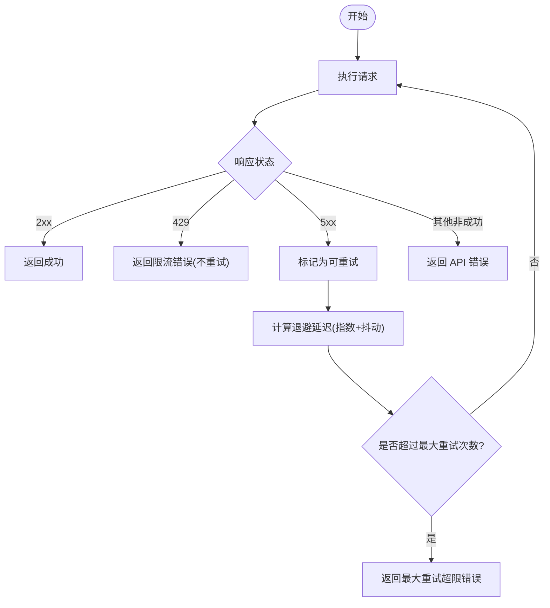
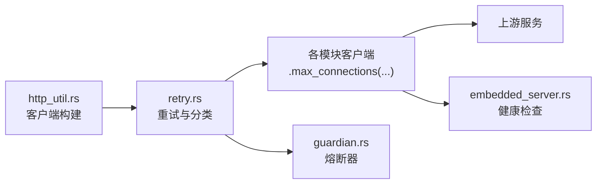

# 连接池配置

<cite>
**本文引用的文件**
- [agent-diva-providers/src/http_util.rs](file://agent-diva-providers/src/http_util.rs)
- [agent-diva-providers/src/retry.rs](file://agent-diva-providers/src/retry.rs)
- [agent-diva-manager/src/marketplace.rs](file://agent-diva-manager/src/marketplace.rs)
- [agent-diva-manager/src/runtime/bootstrap.rs](file://agent-diva-manager/src/runtime/bootstrap.rs)
- [agent-diva-files/src/channel.rs](file://agent-diva-files/src/channel.rs)
- [agent-diva-files/src/index.rs](file://agent-diva-files/src/index.rs)
- [agent-diva-laputa/src/typed_store.rs](file://agent-diva-laputa/src/typed_store.rs)
- [agent-diva-core/src/governance/ledger.rs](file://agent-diva-core/src/governance/ledger.rs)
- [agent-diva-core/src/planning/store.rs](file://agent-diva-core/src/planning/store.rs)
- [agent-diva-cli/src/chat_commands.rs](file://agent-diva-cli/src/chat_commands.rs)
- [agent-diva-sandbox/src/guardian.rs](file://agent-diva-sandbox/src/guardian.rs)
- [agent-diva-gui/src-tauri/src/embedded_server.rs](file://agent-diva-gui/src-tauri/src/embedded_server.rs)
</cite>

## 目录
1. [简介](#简介)
2. [项目结构](#项目结构)
3. [核心组件](#核心组件)
4. [架构总览](#架构总览)
5. [详细组件分析](#详细组件分析)
6. [依赖关系分析](#依赖关系分析)
7. [性能考虑](#性能考虑)
8. [故障排查指南](#故障排查指南)
9. [结论](#结论)
10. [附录：场景化配置示例](#附录：场景化配置示例)

## 简介
本文件聚焦于 HTTP 连接池与网络调用的配置、优化与高可用策略，覆盖以下主题：
- HTTP 客户端构建与连接池参数（最大并发连接数、超时、HTTP/1.1 强制、代理策略）
- 重试策略与退避算法（指数退避、抖动、速率限制处理）
- 错误分类与处理（429、5xx、非成功状态码）
- 并发连接数限制与资源管理（按模块划分连接池大小）
- 监控与健康检查（健康端点、熔断器、可观测性）
- 不同使用场景的连接池配置建议
- 故障转移与高可用（重试、熔断、降级）

## 项目结构
本项目在多个子模块中分别构建了 HTTP 客户端或数据库连接池，并通过统一的工具函数和策略进行控制。关键位置包括：
- 提供者 HTTP 工具：统一构建 reqwest 客户端，设置连接超时、请求超时、HTTP/1.1 强制与代理策略
- 重试与错误分类：提供通用重试封装与响应状态分类
- 各业务模块：根据调用频率与重要性设置不同的最大并发连接数
- 守护与熔断：基于窗口统计的连续拒绝计数实现熔断保护
- GUI 内嵌服务：轻量级健康检查与短超时客户端

图表来源
- [agent-diva-providers/src/http_util.rs:25-39](file://agent-diva-providers/src/http_util.rs#L25-L39)
- [agent-diva-providers/src/retry.rs:17-47](file://agent-diva-providers/src/retry.rs#L17-L47)
- [agent-diva-manager/src/marketplace.rs:117-123](file://agent-diva-manager/src/marketplace.rs#L117-L123)
- [agent-diva-sandbox/src/guardian.rs:502-540](file://agent-diva-sandbox/src/guardian.rs#L502-L540)
- [agent-diva-gui/src-tauri/src/embedded_server.rs:248-283](file://agent-diva-gui/src-tauri/src/embedded_server.rs#L248-L283)

章节来源
- [agent-diva-providers/src/http_util.rs:25-39](file://agent-diva-providers/src/http_util.rs#L25-L39)
- [agent-diva-manager/src/marketplace.rs:117-123](file://agent-diva-manager/src/marketplace.rs#L117-L123)
- [agent-diva-sandbox/src/guardian.rs:502-540](file://agent-diva-sandbox/src/guardian.rs#L502-L540)
- [agent-diva-gui/src-tauri/src/embedded_server.rs:248-283](file://agent-diva-gui/src-tauri/src/embedded_server.rs#L248-L283)

## 核心组件
- HTTP 客户端构建器
  - 统一设置连接超时与请求超时
  - 针对本地或 http 基址强制 HTTP/1.1，避免 ALPN/RST 问题
  - 对本地地址禁用代理，减少中间层干扰
- 重试与错误分类
  - 指数退避 + 抖动，避免雪崩
  - 429 直接返回限流错误，不重试
  - 5xx 视为可重试，最多额外重试固定次数
  - 其他非成功状态码直接报错
- 连接池大小控制
  - 通过 .max_connections(n) 为不同模块设置并发上限
  - 治理、计划存储、文件索引等模块各自独立池大小
- 熔断器
  - 基于时间窗口的连续拒绝计数触发熔断
  - 成功记录后重置熔断状态
- 健康检查
  - 内嵌服务提供健康端点，配合短超时客户端轮询

章节来源
- [agent-diva-providers/src/http_util.rs:25-39](file://agent-diva-providers/src/http_util.rs#L25-L39)
- [agent-diva-providers/src/retry.rs:17-181](file://agent-diva-providers/src/retry.rs#L17-L181)
- [agent-diva-manager/src/runtime/bootstrap.rs:96-103](file://agent-diva-manager/src/runtime/bootstrap.rs#L96-L103)
- [agent-diva-files/src/channel.rs:205-205](file://agent-diva-files/src/channel.rs#L205-L205)
- [agent-diva-files/src/index.rs:37-37](file://agent-diva-files/src/index.rs#L37-L37)
- [agent-diva-laputa/src/typed_store.rs:177-177](file://agent-diva-laputa/src/typed_store.rs#L177-L177)
- [agent-diva-core/src/governance/ledger.rs:1085-1098](file://agent-diva-core/src/governance/ledger.rs#L1085-L1098)
- [agent-diva-core/src/planning/store.rs:1379-1379](file://agent-diva-core/src/planning/store.rs#L1379-L1379)
- [agent-diva-cli/src/chat_commands.rs:389-389](file://agent-diva-cli/src/chat_commands.rs#L389-L389)
- [agent-diva-sandbox/src/guardian.rs:502-540](file://agent-diva-sandbox/src/guardian.rs#L502-L540)
- [agent-diva-gui/src-tauri/src/embedded_server.rs:248-283](file://agent-diva-gui/src-tauri/src/embedded_server.rs#L248-L283)

## 架构总览
下图展示了从应用启动到 HTTP 请求执行的完整链路，包括客户端构建、重试、熔断与健康检查的交互。

图表来源
- [agent-diva-providers/src/http_util.rs:25-39](file://agent-diva-providers/src/http_util.rs#L25-L39)
- [agent-diva-providers/src/retry.rs:86-181](file://agent-diva-providers/src/retry.rs#L86-L181)
- [agent-diva-manager/src/marketplace.rs:117-123](file://agent-diva-manager/src/marketplace.rs#L117-L123)
- [agent-diva-sandbox/src/guardian.rs:502-540](file://agent-diva-sandbox/src/guardian.rs#L502-L540)
- [agent-diva-gui/src-tauri/src/embedded_server.rs:248-283](file://agent-diva-gui/src-tauri/src/embedded_server.rs#L248-L283)

## 详细组件分析

### HTTP 客户端构建与连接池参数
- 连接超时与请求超时
  - 提供者客户端默认连接超时约 45 秒，请求超时由调用方传入
  - 市场客户端设置请求超时 30 秒、连接超时 10 秒
- HTTP/1.1 强制与代理策略
  - 对 http 协议或本地主机（localhost/127.0.0.1/::1/.local）强制 HTTP/1.1
  - 对本地地址禁用代理，避免开发环境被系统代理拦截
- 连接池大小
  - 治理存储：最大连接数 4
  - 计划存储：最大连接数 1
  - 文件通道：最大连接数 3
  - 文件索引：最大连接数 5
  - Laputa typed store：最大连接数 4 或 1（不同用途）
  - CLI chat 命令：最大连接数 1
  - 这些值用于控制并发连接上限，避免资源耗尽

章节来源
- [agent-diva-providers/src/http_util.rs:25-39](file://agent-diva-providers/src/http_util.rs#L25-L39)
- [agent-diva-manager/src/marketplace.rs:117-123](file://agent-diva-manager/src/marketplace.rs#L117-L123)
- [agent-diva-manager/src/runtime/bootstrap.rs:96-103](file://agent-diva-manager/src/runtime/bootstrap.rs#L96-L103)
- [agent-diva-files/src/channel.rs:205-205](file://agent-diva-files/src/channel.rs#L205-L205)
- [agent-diva-files/src/index.rs:37-37](file://agent-diva-files/src/index.rs#L37-L37)
- [agent-diva-laputa/src/typed_store.rs:177-177](file://agent-diva-laputa/src/typed_store.rs#L177-L177)
- [agent-diva-core/src/governance/ledger.rs:1085-1098](file://agent-diva-core/src/governance/ledger.rs#L1085-L1098)
- [agent-diva-core/src/planning/store.rs:1379-1379](file://agent-diva-core/src/planning/store.rs#L1379-L1379)
- [agent-diva-cli/src/chat_commands.rs:389-389](file://agent-diva-cli/src/chat_commands.rs#L389-L389)

### 重试策略与退避算法
- 指数退避 + 抖动
  - 基础延迟 1 秒，每次尝试翻倍，并加入 ±20% 抖动，避免“惊群效应”
- 重试条件
  - 5xx 服务器错误：可重试
  - 网络错误：可重试
  - 429 限流：立即返回限流错误，不重试
  - 其他非成功状态码：直接报错
- 监听器回调
  - 每次重试前调用可选监听器，便于上层记录或展示重试进度

图表来源
- [agent-diva-providers/src/retry.rs:17-47](file://agent-diva-providers/src/retry.rs#L17-L47)
- [agent-diva-providers/src/retry.rs:86-181](file://agent-diva-providers/src/retry.rs#L86-L181)

章节来源
- [agent-diva-providers/src/retry.rs:17-181](file://agent-diva-providers/src/retry.rs#L17-L181)

### 错误处理机制
- 429 限流：解析 Retry-After 头（若存在），返回限流错误
- 5xx 服务器错误：记录警告并进入重试流程
- 其他非成功状态码：读取响应体并包装为 API 错误
- 网络错误：记录警告并进入重试流程，直到达到最大重试次数

章节来源
- [agent-diva-providers/src/retry.rs:49-84](file://agent-diva-providers/src/retry.rs#L49-L84)
- [agent-diva-providers/src/retry.rs:127-181](file://agent-diva-providers/src/retry.rs#L127-L181)

### 并发连接数限制与资源管理
- 通过 .max_connections(n) 为不同模块设置并发上限，避免资源竞争
- 典型值：
  - 治理存储：4
  - 计划存储：1
  - 文件通道：3
  - 文件索引：5
  - CLI chat：1
- 这些值反映了不同模块的负载特征与稳定性要求

章节来源
- [agent-diva-manager/src/runtime/bootstrap.rs:96-103](file://agent-diva-manager/src/runtime/bootstrap.rs#L96-L103)
- [agent-diva-files/src/channel.rs:205-205](file://agent-diva-files/src/channel.rs#L205-L205)
- [agent-diva-files/src/index.rs:37-37](file://agent-diva-files/src/index.rs#L37-L37)
- [agent-diva-laputa/src/typed_store.rs:177-177](file://agent-diva-laputa/src/typed_store.rs#L177-L177)
- [agent-diva-core/src/governance/ledger.rs:1085-1098](file://agent-diva-core/src/governance/ledger.rs#L1085-L1098)
- [agent-diva-core/src/planning/store.rs:1379-1379](file://agent-diva-core/src/planning/store.rs#L1379-L1379)
- [agent-diva-cli/src/chat_commands.rs:389-389](file://agent-diva-cli/src/chat_commands.rs#L389-L389)

### 连接池监控与性能调优建议
- 健康检查
  - 内嵌服务提供健康端点，使用短超时客户端轮询，快速发现异常
- 熔断器
  - 基于时间窗口的连续拒绝计数，达到阈值触发熔断，防止级联失败
  - 成功记录后重置熔断状态
- 调优建议
  - 根据上游能力调整 .max_connections(n)，避免过载
  - 合理设置连接超时与请求超时，平衡用户体验与资源占用
  - 对本地地址强制 HTTP/1.1 并禁用代理，提升稳定性
  - 利用重试与退避提高瞬时故障下的成功率

章节来源
- [agent-diva-gui/src-tauri/src/embedded_server.rs:248-283](file://agent-diva-gui/src-tauri/src/embedded_server.rs#L248-L283)
- [agent-diva-sandbox/src/guardian.rs:502-540](file://agent-diva-sandbox/src/guardian.rs#L502-L540)
- [agent-diva-providers/src/http_util.rs:25-39](file://agent-diva-providers/src/http_util.rs#L25-L39)
- [agent-diva-manager/src/marketplace.rs:117-123](file://agent-diva-manager/src/marketplace.rs#L117-L123)

### 故障转移与高可用配置
- 重试与退避：对 5xx 和网络错误自动重试，提高可用性
- 熔断器：在连续拒绝时快速失败，保护下游与服务自身
- 健康检查：短超时轮询，及时发现不可用节点或服务
- 降级策略：当熔断触发时，可结合业务逻辑进行降级或提示

章节来源
- [agent-diva-providers/src/retry.rs:86-181](file://agent-diva-providers/src/retry.rs#L86-L181)
- [agent-diva-sandbox/src/guardian.rs:502-540](file://agent-diva-sandbox/src/guardian.rs#L502-L540)
- [agent-diva-gui/src-tauri/src/embedded_server.rs:248-283](file://agent-diva-gui/src-tauri/src/embedded_server.rs#L248-L283)

## 依赖关系分析
- HTTP 客户端构建依赖 URL 解析与协议判断，决定 HTTP/1.1 强制与代理策略
- 重试逻辑依赖响应状态分类与退避计算
- 各模块通过 .max_connections(n) 显式声明连接池容量，形成松耦合的资源边界
- 熔断器与重试共同构成高可用防护层

图表来源
- [agent-diva-providers/src/http_util.rs:25-39](file://agent-diva-providers/src/http_util.rs#L25-L39)
- [agent-diva-providers/src/retry.rs:86-181](file://agent-diva-providers/src/retry.rs#L86-L181)
- [agent-diva-sandbox/src/guardian.rs:502-540](file://agent-diva-sandbox/src/guardian.rs#L502-L540)
- [agent-diva-gui/src-tauri/src/embedded_server.rs:248-283](file://agent-diva-gui/src-tauri/src/embedded_server.rs#L248-L283)

章节来源
- [agent-diva-providers/src/http_util.rs:25-39](file://agent-diva-providers/src/http_util.rs#L25-L39)
- [agent-diva-providers/src/retry.rs:86-181](file://agent-diva-providers/src/retry.rs#L86-L181)
- [agent-diva-sandbox/src/guardian.rs:502-540](file://agent-diva-sandbox/src/guardian.rs#L502-L540)
- [agent-diva-gui/src-tauri/src/embedded_server.rs:248-283](file://agent-diva-gui/src-tauri/src/embedded_server.rs#L248-L283)

## 性能考虑
- 连接池大小应与上游服务能力匹配，避免过度并发导致拥塞
- 合理设置连接超时与请求超时，平衡响应时间与资源占用
- 对本地地址强制 HTTP/1.1 并禁用代理，减少不必要的握手与中间层开销
- 使用指数退避与抖动降低重试风暴风险
- 通过熔断器快速失败，避免级联故障

[本节为通用指导，无需特定文件引用]

## 故障排查指南
- 常见问题定位
  - 连接超时：检查连接超时设置与网络连通性
  - 请求超时：检查请求超时设置与上游响应时间
  - 429 限流：检查上游限流策略与重试间隔
  - 5xx 错误：查看上游日志与重试次数
  - 熔断触发：检查连续拒绝计数与时间窗口
- 健康检查
  - 使用短超时客户端轮询健康端点，快速发现异常
- 日志与监控
  - 关注重试日志与熔断器日志，定位问题根因

章节来源
- [agent-diva-providers/src/retry.rs:127-181](file://agent-diva-providers/src/retry.rs#L127-L181)
- [agent-diva-sandbox/src/guardian.rs:502-540](file://agent-diva-sandbox/src/guardian.rs#L502-L540)
- [agent-diva-gui/src-tauri/src/embedded_server.rs:248-283](file://agent-diva-gui/src-tauri/src/embedded_server.rs#L248-L283)

## 结论
本项目通过统一的 HTTP 客户端构建、重试与错误分类、连接池大小控制以及熔断器与健康检查，形成了稳健的网络调用与高可用体系。针对不同模块的负载特征，合理设置连接池大小与超时参数，并结合重试与熔断策略，可在保证稳定性的同时提升整体性能与用户体验。

[本节为总结，无需特定文件引用]

## 附录：场景化配置示例
以下为不同使用场景下的连接池配置建议（基于现有代码中的实践）：
- 高频调用且对稳定性敏感（如治理存储）
  - 最大连接数：4
  - 连接超时：约 45 秒
  - 请求超时：根据业务需求设定
  - 重试：启用指数退避与抖动
- 低频调用且对资源占用敏感（如 CLI 聊天命令）
  - 最大连接数：1
  - 连接超时：较短（如 10 秒）
  - 请求超时：较短（如 30 秒）
  - 重试：谨慎启用，避免放大负载
- 批量下载或搜索（如市场客户端）
  - 最大连接数：根据上游限制设定
  - 连接超时：10 秒
  - 请求超时：30 秒
  - 重试：对 5xx 启用，429 不重试
- 本地开发与调试
  - 强制 HTTP/1.1
  - 禁用代理
  - 短超时与频繁健康检查

章节来源
- [agent-diva-manager/src/runtime/bootstrap.rs:96-103](file://agent-diva-manager/src/runtime/bootstrap.rs#L96-L103)
- [agent-diva-cli/src/chat_commands.rs:389-389](file://agent-diva-cli/src/chat_commands.rs#L389-L389)
- [agent-diva-manager/src/marketplace.rs:117-123](file://agent-diva-manager/src/marketplace.rs#L117-L123)
- [agent-diva-providers/src/http_util.rs:25-39](file://agent-diva-providers/src/http_util.rs#L25-L39)