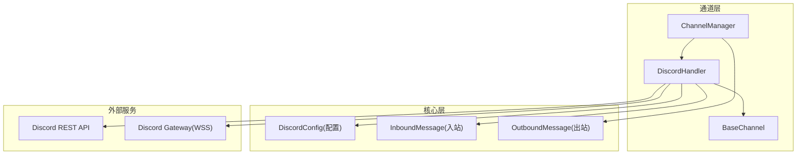
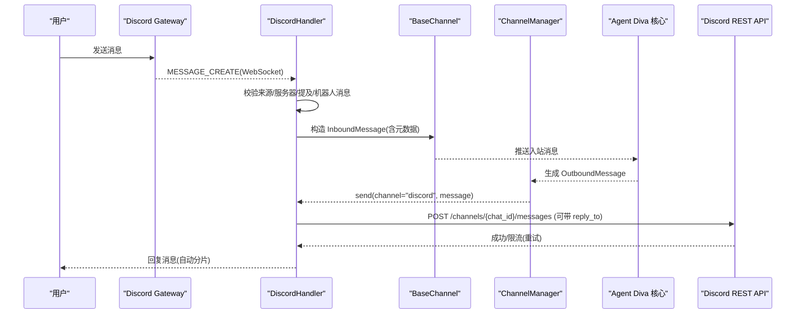
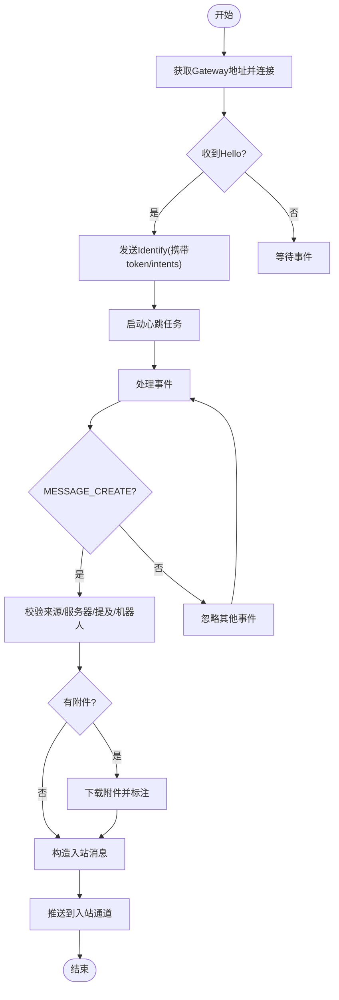
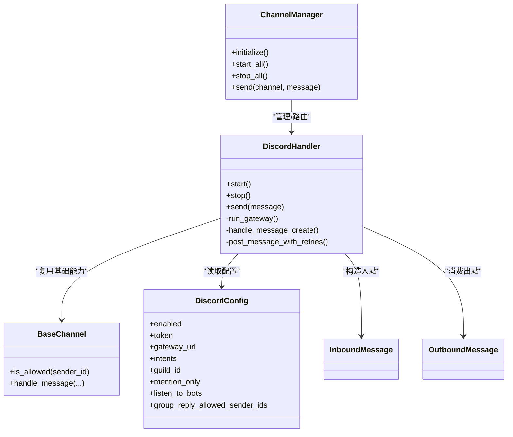

# Discord 渠道配置

<cite>
**本文引用的文件**
- [discord.rs](file://agent-diva-channels/src/discord.rs)
- [base.rs](file://agent-diva-channels/src/base.rs)
- [manager.rs](file://agent-diva-channels/src/manager.rs)
- [schema.rs](file://agent-diva-core/src/config/schema.rs)
- [events.rs](file://agent-diva-core/src/bus/events.rs)
- [common/mod.rs](file://agent-diva-channels/src/common/mod.rs)
</cite>

## 目录
1. [简介](#简介)
2. [项目结构](#项目结构)
3. [核心组件](#核心组件)
4. [架构总览](#架构总览)
5. [详细组件分析](#详细组件分析)
6. [依赖关系分析](#依赖关系分析)
7. [性能与限制](#性能与限制)
8. [故障排查指南](#故障排查指南)
9. [结论](#结论)
10. [附录：配置项与最佳实践](#附录：配置项与最佳实践)

## 简介
本文件面向需要在 Agent Diva 中启用并配置 Discord 渠道的用户与集成工程师，覆盖从创建 Discord Bot、邀请到服务器、配置应用权限与角色，到在 Agent Diva 中完成渠道配置、消息收发、嵌入消息与错误处理等全流程。文档同时说明与 Agent Diva 系统的集成方式（通道管理器、消息总线）以及关键实现要点与最佳实践。

## 项目结构
Agent Diva 的 Discord 渠道位于 channels 子模块，核心由以下文件组成：
- 通道处理器：DiscordHandler，负责 WebSocket 连接、心跳、消息解析、发送与重试
- 基础通道能力：BaseChannel，提供统一的生命周期、访问控制与入站消息转发
- 通道管理器：ChannelManager，负责按配置初始化、启动、停止各通道
- 配置模型：DiscordConfig，定义 enabled、token、gateway_url、intents、guild_id、mention_only、listen_to_bots、group_reply_allowed_sender_ids 等
- 消息模型：InboundMessage/OutboundMessage，用于通道与系统之间的消息交换
- 通用工具：HTTP 客户端与附件下载

图表来源
- [discord.rs:114-135](file://agent-diva-channels/src/discord.rs#L114-L135)
- [base.rs:74-87](file://agent-diva-channels/src/base.rs#L74-L87)
- [manager.rs:42-56](file://agent-diva-channels/src/manager.rs#L42-L56)
- [schema.rs:657-706](file://agent-diva-core/src/config/schema.rs#L657-L706)
- [events.rs:156-172](file://agent-diva-core/src/bus/events.rs#L156-L172)
- [events.rs:343-359](file://agent-diva-core/src/bus/events.rs#L343-L359)

章节来源
- [discord.rs:1-135](file://agent-diva-channels/src/discord.rs#L1-L135)
- [base.rs:1-87](file://agent-diva-channels/src/base.rs#L1-L87)
- [manager.rs:1-56](file://agent-diva-channels/src/manager.rs#L1-L56)
- [schema.rs:657-706](file://agent-diva-core/src/config/schema.rs#L657-L706)
- [events.rs:156-172](file://agent-diva-core/src/bus/events.rs#L156-L172)
- [events.rs:343-359](file://agent-diva-core/src/bus/events.rs#L343-L359)

## 核心组件
- DiscordHandler：实现与 Discord Gateway 的 WebSocket 通信、消息接收、REST 发送、心跳、重连、速率限制处理、打字指示器、回复引用等
- BaseChannel：提供统一的通道名称、运行状态、允许列表策略、入站消息发送封装
- ChannelManager：根据配置动态构建并管理多个通道实例，负责初始化、启动、停止与热更新
- DiscordConfig：声明式配置结构，包含开关、令牌、网关地址、意图、服务器过滤、提及模式、机器人消息监听、群组白名单等
- 消息模型：InboundMessage/OutboundMessage 作为通道与 Agent Diva 核心的统一数据契约

章节来源
- [discord.rs:114-135](file://agent-diva-channels/src/discord.rs#L114-L135)
- [base.rs:74-87](file://agent-diva-channels/src/base.rs#L74-L87)
- [manager.rs:42-56](file://agent-diva-channels/src/manager.rs#L42-L56)
- [schema.rs:657-706](file://agent-diva-core/src/config/schema.rs#L657-L706)
- [events.rs:156-172](file://agent-diva-core/src/bus/events.rs#L156-L172)
- [events.rs:343-359](file://agent-diva-core/src/bus/events.rs#L343-L359)

## 架构总览
下图展示从用户消息到达至 Agent 响应回发的端到端流程，包括 Gateway 事件处理、入站消息注入、出站消息发送与分片、重试与速率限制。

图表来源
- [discord.rs:336-442](file://agent-diva-channels/src/discord.rs#L336-L442)
- [discord.rs:497-696](file://agent-diva-channels/src/discord.rs#L497-L696)
- [discord.rs:698-748](file://agent-diva-channels/src/discord.rs#L698-L748)
- [discord.rs:810-836](file://agent-diva-channels/src/discord.rs#L810-L836)
- [manager.rs:688-697](file://agent-diva-channels/src/manager.rs#L688-L697)
- [events.rs:156-172](file://agent-diva-core/src/bus/events.rs#L156-L172)
- [events.rs:343-359](file://agent-diva-core/src/bus/events.rs#L343-L359)

## 详细组件分析

### DiscordHandler 工作流
- 连接与心跳：通过 GET /gateway/bot 获取 WSS 地址，建立连接后处理 Hello/Identify/Heartbeat/Resume
- 消息接收：解析 Dispatch(MESSAGE_CREATE)，过滤自身与机器人消息，支持仅群聊需 @提及 的模式与白名单
- 附件处理：下载附件到本地媒体目录，并在内容中标注路径；超大附件会记录提示
- 发送消息：按 2000 字符限制分片发送，支持回复引用（message_reference），遇到 429 读取 retry-after 并等待重试
- 打字指示器：收到入站消息时周期性调用 typing 接口，直到发送完成或停止

图表来源
- [discord.rs:497-696](file://agent-diva-channels/src/discord.rs#L497-L696)
- [discord.rs:336-442](file://agent-diva-channels/src/discord.rs#L336-L442)

章节来源
- [discord.rs:296-318](file://agent-diva-channels/src/discord.rs#L296-L318)
- [discord.rs:336-442](file://agent-diva-channels/src/discord.rs#L336-L442)
- [discord.rs:497-696](file://agent-diva-channels/src/discord.rs#L497-L696)
- [discord.rs:698-748](file://agent-diva-channels/src/discord.rs#L698-L748)
- [discord.rs:810-836](file://agent-diva-channels/src/discord.rs#L810-L836)

### BaseChannel 访问控制与入站转发
- 允许列表策略：空 allow_from 默认放行（除非显式 deny_by_default），否则基于通配符匹配与复合 ID 匹配
- 入站消息：统一封装 channel/sender/chat/content/media/metadata，并通过 mpsc 发送到上层

章节来源
- [base.rs:74-87](file://agent-diva-channels/src/base.rs#L74-L87)
- [base.rs:121-184](file://agent-diva-channels/src/base.rs#L121-L184)
- [base.rs:186-229](file://agent-diva-channels/src/base.rs#L186-L229)

### ChannelManager 初始化与路由
- 通道发现：根据 Config 中的 channels.*.enabled 与各字段完整性进行校验，仅 ready 的通道加入运行时
- 生命周期：initialize 构建并注册 handler，start_all 启动所有通道，stop_all 安全停止
- 热更新：update_channel 支持停止旧实例、重建新实例并重启

章节来源
- [manager.rs:58-163](file://agent-diva-channels/src/manager.rs#L58-L163)
- [manager.rs:377-418](file://agent-diva-channels/src/manager.rs#L377-L418)
- [manager.rs:644-680](file://agent-diva-channels/src/manager.rs#L644-L680)
- [manager.rs:699-735](file://agent-diva-channels/src/manager.rs#L699-L735)

### 配置模型 DiscordConfig
关键字段说明：
- enabled：是否启用 Discord 渠道
- token：Bot Token（必填）
- gateway_url：自定义 Gateway 地址（可选，默认官方）
- intents：应用意图位掩码（默认包含必要的消息与服务器意图）
- guild_id：限定仅处理指定服务器的消息（DM 仍允许）
- mention_only：群聊中必须 @提及 才处理（可通过 group_reply_allowed_sender_ids 豁免）
- listen_to_bots：是否处理来自其他机器人的消息
- group_reply_allowed_sender_ids：允许在群聊中无需 @提及 即可触发响应的用户 ID 列表

章节来源
- [schema.rs:657-706](file://agent-diva-core/src/config/schema.rs#L657-L706)

### 消息格式与嵌入消息
- 入站消息：InboundMessage 包含 channel、sender_id、chat_id、content、media、metadata；Discord 侧将附件下载后以路径形式附加到 content
- 出站消息：OutboundMessage 包含 channel、chat_id、content、reply_to、media、reasoning_content、metadata；Discord 侧按 2000 字符限制自动分片发送，并支持 reply_to 引用
- 嵌入消息：当前实现未直接构造 Discord Embed，如需富文本/卡片效果，可在 content 中使用 Markdown 或通过后续扩展在 OutboundMessage 中增加结构化字段并由通道层渲染为 Embed

章节来源
- [events.rs:156-172](file://agent-diva-core/src/bus/events.rs#L156-L172)
- [events.rs:343-359](file://agent-diva-core/src/bus/events.rs#L343-L359)
- [discord.rs:240-278](file://agent-diva-channels/src/discord.rs#L240-L278)
- [discord.rs:810-836](file://agent-diva-channels/src/discord.rs#L810-L836)

### 与 Agent Diva 系统集成
- 通道管理器负责按配置初始化 DiscordHandler，并将 inbound_tx 注入到各通道
- 通道将 Discord 消息转换为 InboundMessage 推送到总线，Agent 核心处理后生成 OutboundMessage，经 ChannelManager 路由到对应通道发送
- 错误与日志：通道内部使用 tracing 记录连接、事件、错误与重试信息，便于定位问题

章节来源
- [manager.rs:377-418](file://agent-diva-channels/src/manager.rs#L377-L418)
- [discord.rs:336-442](file://agent-diva-channels/src/discord.rs#L336-L442)
- [discord.rs:698-748](file://agent-diva-channels/src/discord.rs#L698-L748)

## 依赖关系分析
- DiscordHandler 依赖：
  - BaseChannel：统一的基础能力与访问控制
  - HTTP 客户端：发送 REST 请求与下载附件
  - 配置模型：DiscordConfig
  - 消息模型：InboundMessage/OutboundMessage
- ChannelManager 依赖：
  - 各通道 Handler（含 DiscordHandler）
  - 全局 Config 与 inbound/outbound 通道

图表来源
- [manager.rs:42-56](file://agent-diva-channels/src/manager.rs#L42-L56)
- [discord.rs:114-135](file://agent-diva-channels/src/discord.rs#L114-L135)
- [base.rs:74-87](file://agent-diva-channels/src/base.rs#L74-L87)
- [schema.rs:657-706](file://agent-diva-core/src/config/schema.rs#L657-L706)
- [events.rs:156-172](file://agent-diva-core/src/bus/events.rs#L156-L172)
- [events.rs:343-359](file://agent-diva-core/src/bus/events.rs#L343-L359)

章节来源
- [manager.rs:42-56](file://agent-diva-channels/src/manager.rs#L42-L56)
- [discord.rs:114-135](file://agent-diva-channels/src/discord.rs#L114-L135)
- [base.rs:74-87](file://agent-diva-channels/src/base.rs#L74-L87)
- [schema.rs:657-706](file://agent-diva-core/src/config/schema.rs#L657-L706)
- [events.rs:156-172](file://agent-diva-core/src/bus/events.rs#L156-L172)
- [events.rs:343-359](file://agent-diva-core/src/bus/events.rs#L343-L359)

## 性能与限制
- 消息长度：Discord 单条消息上限 2000 字符，超出会自动分片发送，分片间有短暂延迟以避免触发限流
- 附件大小：单个附件超过 20MB 将被跳过并记录提示
- 速率限制：对 429 响应会读取 retry-after 并等待后重试，最多尝试多次
- 心跳：按 Gateway 返回的 interval 定时发送心跳，保证长连接存活
- 打字指示器：每 8 秒周期性调用 typing，避免频繁请求

章节来源
- [discord.rs:24-25](file://agent-diva-channels/src/discord.rs#L24-L25)
- [discord.rs:240-278](file://agent-diva-channels/src/discord.rs#L240-L278)
- [discord.rs:387-413](file://agent-diva-channels/src/discord.rs#L387-L413)
- [discord.rs:444-474](file://agent-diva-channels/src/discord.rs#L444-L474)
- [discord.rs:615-639](file://agent-diva-channels/src/discord.rs#L615-L639)
- [discord.rs:698-748](file://agent-diva-channels/src/discord.rs#L698-L748)

## 故障排查指南
常见问题与定位建议：
- 无法连接 Gateway：检查 token 是否正确、网络连通性、是否被代理拦截；查看日志中“Connecting to Discord gateway”“connection failed”等
- 会话无效：InvalidSession 会导致 session_id 清空并重连；确认 token 未被吊销或更改
- 消息未处理：检查 allow_from 白名单、guild_id 是否限制到目标服务器、mention_only 是否开启且未 @提及、listen_to_bots 是否关闭导致忽略机器人消息
- 附件失败：确认 URL 可达、文件大小不超过限制；查看下载错误日志
- 发送失败或限流：关注 429 与 retry-after 重试日志；必要时降低发送频率或拆分消息

章节来源
- [discord.rs:497-604](file://agent-diva-channels/src/discord.rs#L497-L604)
- [discord.rs:688-696](file://agent-diva-channels/src/discord.rs#L688-L696)
- [discord.rs:336-379](file://agent-diva-channels/src/discord.rs#L336-L379)
- [discord.rs:387-413](file://agent-diva-channels/src/discord.rs#L387-L413)
- [discord.rs:698-748](file://agent-diva-channels/src/discord.rs#L698-L748)

## 结论
Agent Diva 的 Discord 渠道通过标准化的通道抽象与消息总线，实现了稳定可靠的实时消息收发。其实现覆盖了连接管理、心跳、消息解析、附件处理、速率限制与重试、访问控制与服务器过滤等关键点。配合合理的配置与权限设置，可在多场景下稳定运行。对于需要富文本/卡片展示的场景，可在现有基础上扩展嵌入消息支持。

## 附录：配置项与最佳实践

### 前置准备：创建 Discord Bot 与应用权限
- 在 Discord Developer Portal 创建应用并添加 Bot，复制 Bot Token
- 在“Bot”页面勾选所需权限（如 Read Message History、Send Messages、Embed Links、Read Message Content 等）
- 在“OAuth2 -> URL Generator”选择 scopes（如 bot、applications.commands）与权限范围，生成邀请链接并邀请到目标服务器
- 在服务器中授予 Bot 相应角色与频道权限（发送消息、嵌入链接、读取消息等）

注意：Agent Diva 的 Discord 渠道通过 intents 控制能接收的消息类型，确保 intents 包含必要的消息与服务器意图。

章节来源
- [schema.rs:684-690](file://agent-diva-core/src/config/schema.rs#L684-L690)
- [discord.rs:641-656](file://agent-diva-channels/src/discord.rs#L641-L656)

### 渠道配置项说明
- enabled：启用/禁用 Discord 渠道
- token：Bot Token（必填）
- gateway_url：自定义 Gateway 地址（可选）
- intents：意图位掩码（默认已包含必要项）
- guild_id：限定服务器 ID（可选）
- mention_only：群聊中必须 @提及（可选）
- listen_to_bots：是否处理机器人消息（可选）
- group_reply_allowed_sender_ids：群聊中无需 @提及 的白名单用户 ID（可选）
- allow_from：入站消息来源白名单（继承自基础通道策略）

章节来源
- [schema.rs:657-706](file://agent-diva-core/src/config/schema.rs#L657-L706)
- [base.rs:121-184](file://agent-diva-channels/src/base.rs#L121-L184)

### 完整配置示例（JSON/YAML 风格示意）
以下为常见配置的示意结构（不含具体敏感值）：
- 基本启用：
  - channels.discord.enabled = true
  - channels.discord.token = "<你的Bot Token>"
- 限定服务器与提及模式：
  - channels.discord.guild_id = "<服务器ID>"
  - channels.discord.mention_only = true
- 白名单与机器人消息：
  - channels.discord.group_reply_allowed_sender_ids = ["<用户ID1>", "<用户ID2>"]
  - channels.discord.listen_to_bots = false
- 访问控制：
  - channels.discord.allow_from = ["<用户ID1>", "<用户ID2>"]

章节来源
- [schema.rs:657-706](file://agent-diva-core/src/config/schema.rs#L657-L706)
- [base.rs:121-184](file://agent-diva-channels/src/base.rs#L121-L184)

### 最佳实践
- 最小权限原则：仅在开发者门户授予 Bot 最少必要权限
- 服务器隔离：通过 guild_id 限定消息来源，减少误触发
- 提及策略：在群聊中开启 mention_only，结合白名单提升可控性
- 附件管理：控制附件大小与来源，避免过大或不可信资源
- 稳定性：保持 intents 默认值，除非明确需要额外能力；监控日志中的连接与限流信息
- 安全：不要泄露 token；定期轮换；在生产环境使用环境变量或密钥管理服务

章节来源
- [discord.rs:336-379](file://agent-diva-channels/src/discord.rs#L336-L379)
- [discord.rs:698-748](file://agent-diva-channels/src/discord.rs#L698-L748)
- [common/mod.rs:5-11](file://agent-diva-channels/src/common/mod.rs#L5-L11)