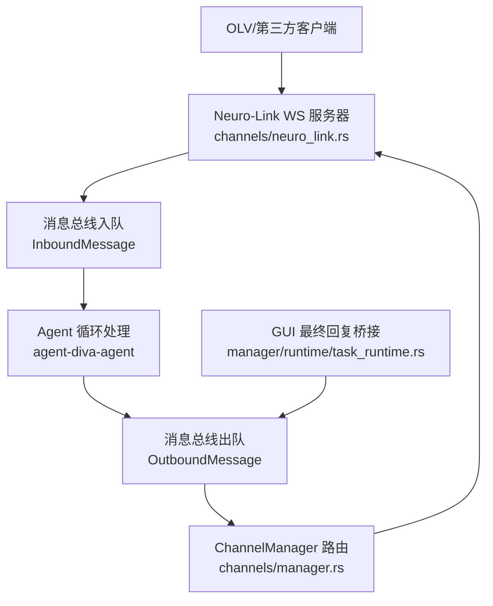
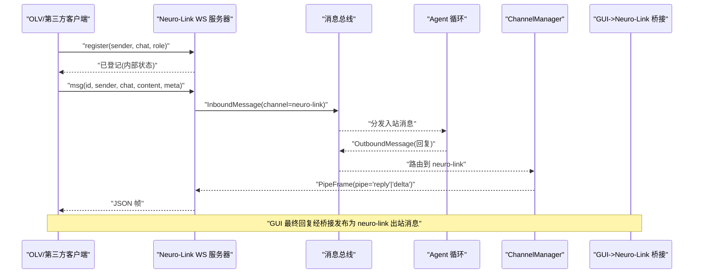
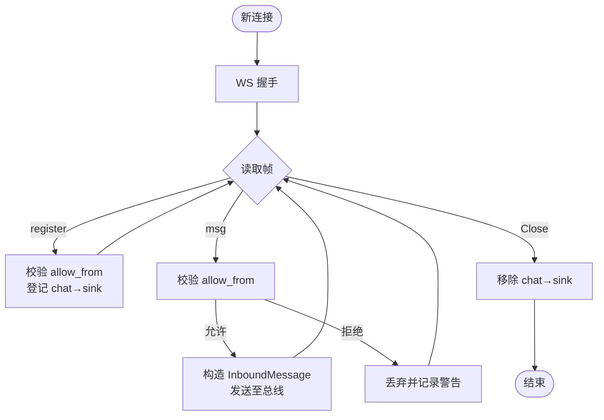
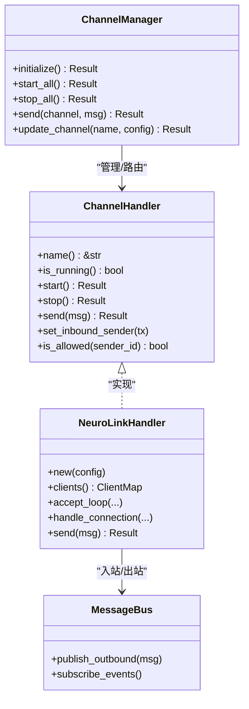
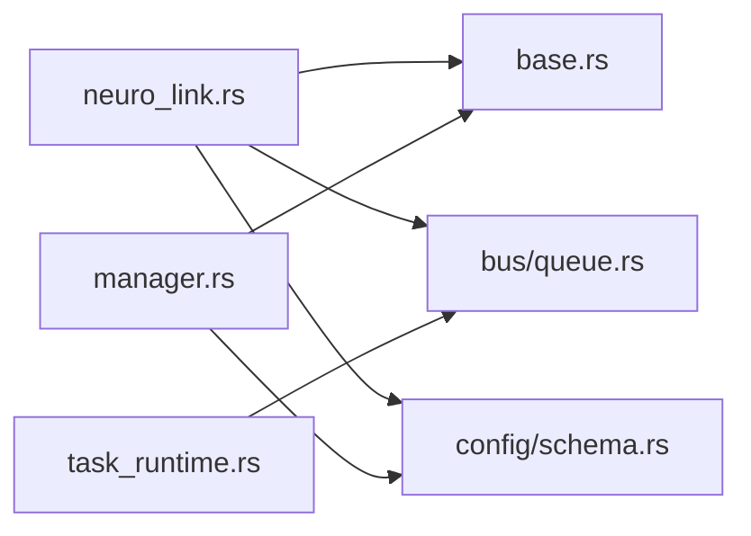

# Neuro-Link 渠道配置

<cite>
**本文引用的文件**
- [neuro_link.rs](file://agent-diva-channels/src/neuro_link.rs)
- [base.rs](file://agent-diva-channels/src/base.rs)
- [manager.rs](file://agent-diva-channels/src/manager.rs)
- [schema.rs](file://agent-diva-core/src/config/schema.rs)
- [loader.rs](file://agent-diva-core/src/config/loader.rs)
- [bus/mod.rs](file://agent-diva-core/src/bus/mod.rs)
- [bus/queue.rs](file://agent-diva-core/src/bus/queue.rs)
- [task_runtime.rs](file://agent-diva-manager/src/runtime/task_runtime.rs)
- [runtime_control.rs](file://agent-diva-manager/src/manager/runtime_control.rs)
- [summary.md](file://docs/logs/2026-08-neuro-link-reserved/v0.1.0-reserved-heavyweight-channel/summary.md)
- [acceptance.md](file://docs/logs/2026-08-neuro-link-reserved/v0.1.0-reserved-heavyweight-channel/acceptance.md)
</cite>

## 目录
1. [简介](#简介)
2. [项目结构](#项目结构)
3. [核心组件](#核心组件)
4. [架构总览](#架构总览)
5. [详细组件分析](#详细组件分析)
6. [依赖关系分析](#依赖关系分析)
7. [性能与序列化](#性能与序列化)
8. [故障排查指南](#故障排查指南)
9. [结论](#结论)
10. [附录：完整管道配置示例](#附录完整管道配置示例)

## 简介
Neuro-Link 是 Agent Diva 内部用于进程间通信的本地 WebSocket 服务器型“重型”渠道。它通过 JSON 帧在第三方集成（例如 OLV 数字人前端）与 Diva 核心之间建立双向消息通道，支持注册、消息上行、回复下行以及流式增量推送。该渠道默认仅绑定本地回环地址，并通过 allow_from 白名单控制接入来源，适合安全地暴露给本机或可信进程。

## 项目结构
Neuro-Link 的实现横跨 channels、core、manager 三个模块：
- channels/neuro_link.rs：实现 Neuro-Link WebSocket 服务端、协议解析、连接管理与出站发送。
- channels/base.rs：定义 ChannelHandler 统一接口、错误类型、allow_from 匹配策略与 localhost 校验。
- channels/manager.rs：按配置初始化并启动各渠道，包含 neuro-link 的构建与生命周期管理。
- core/config/schema.rs：定义 ChannelsConfig 与 NeuroLinkConfig 等配置结构。
- core/config/loader.rs：负责配置键别名归一化（如 neuro-link/neuro_link/generic_pipe）。
- core/bus/*：消息总线，承载 InboundMessage/OutboundMessage 与事件广播。
- manager/runtime/task_runtime.rs：将 GUI 最终回复桥接到 neuro-link，驱动数字人播报。
- docs/logs/...：关于神经链接保留为“未来重型渠道”的设计决策与验收说明。

图表来源
- [neuro_link.rs:82-163](file://agent-diva-channels/src/neuro_link.rs#L82-L163)
- [manager.rs:562-575](file://agent-diva-channels/src/manager.rs#L562-L575)
- [task_runtime.rs:204-239](file://agent-diva-manager/src/runtime/task_runtime.rs#L204-L239)

章节来源
- [neuro_link.rs:1-531](file://agent-diva-channels/src/neuro_link.rs#L1-L531)
- [manager.rs:1-842](file://agent-diva-channels/src/manager.rs#L1-L842)
- [schema.rs:605-642](file://agent-diva-core/src/config/schema.rs#L605-L642)
- [loader.rs:429-463](file://agent-diva-core/src/config/loader.rs#L429-L463)
- [bus/mod.rs:1-14](file://agent-diva-core/src/bus/mod.rs#L1-L14)
- [bus/queue.rs:1-34](file://agent-diva-core/src/bus/queue.rs#L1-L34)
- [task_runtime.rs:204-239](file://agent-diva-manager/src/runtime/task_runtime.rs#L204-L239)

## 核心组件
- NeuroLinkHandler：WebSocket 服务端处理器，负责监听、握手、连接生命周期、消息解析、白名单校验、写入客户端映射表、向总线转发入站消息、向外发送出站消息。
- ChannelHandler 接口：统一渠道抽象，start/stop/send/is_allowed 等。
- ChannelManager：根据配置创建并启动具体渠道，注入 inbound_tx，提供 send 路由。
- MessageBus：解耦渠道与 Agent 核心的异步消息队列与事件广播。
- NeuroLinkConfig：渠道开关、监听 host/port、allow_from 白名单。

章节来源
- [neuro_link.rs:82-163](file://agent-diva-channels/src/neuro_link.rs#L82-L163)
- [base.rs:9-32](file://agent-diva-channels/src/base.rs#L9-L32)
- [manager.rs:562-575](file://agent-diva-channels/src/manager.rs#L562-L575)
- [schema.rs:974-1007](file://agent-diva-core/src/config/schema.rs#L974-L1007)
- [bus/queue.rs:19-34](file://agent-diva-core/src/bus/queue.rs#L19-L34)

## 架构总览
Neuro-Link 采用“WS 服务器 + 消息总线”的架构：
- 客户端通过 WebSocket 连接 Diva 的 Neuro-Link 服务。
- 客户端先发送 register 帧声明 sender/chat/role，随后发送 msg 帧携带内容。
- 服务端将入站消息封装为 InboundMessage 推送到总线，由 Agent 循环消费并生成响应。
- 响应以 OutboundMessage 形式经 ChannelManager 路由到 neuro-link，再序列化为 PipeFrame 通过 WS 下发。
- 对于数字人播报场景，GUI 的最终回复会被 task_runtime 桥接为 neuro-link 出站消息，触发下游播放链。

图表来源
- [neuro_link.rs:166-289](file://agent-diva-channels/src/neuro_link.rs#L166-L289)
- [neuro_link.rs:356-386](file://agent-diva-channels/src/neuro_link.rs#L356-L386)
- [manager.rs:688-697](file://agent-diva-channels/src/manager.rs#L688-L697)
- [task_runtime.rs:204-239](file://agent-diva-manager/src/runtime/task_runtime.rs#L204-L239)

## 详细组件分析

### Neuro-Link 协议与数据模型
- 入站帧（客户端 → Diva）
  - pipe=msg：包含 id、sender、chat、content、meta。
  - pipe=register：声明 sender、chat、role、meta。
- 出站帧（Diva → 客户端）
  - pipe=reply：最终回复，包含 reply_to、chat、content、meta。
  - pipe=delta：流式增量片段，包含 reply_to、chat、content。
- 特殊常量
  - OLV_AVATAR_CHAT_ID="__olv_avatar__"
  - OLV_AVATAR_ROLE="avatar"

这些字段在代码中以 PipeMsg/PipeRegister/PipeFrame 结构体表示，并在连接处理中严格解析与校验。

章节来源
- [neuro_link.rs:31-69](file://agent-diva-channels/src/neuro_link.rs#L31-L69)
- [neuro_link.rs:213-280](file://agent-diva-channels/src/neuro_link.rs#L213-L280)
- [neuro_link.rs:356-386](file://agent-diva-channels/src/neuro_link.rs#L356-L386)

### 连接与消息流
- 监听与接受：accept_loop 绑定 TCP，升级 WS，为每个连接 spawn 处理任务。
- 连接处理：handle_connection 读取文本帧，解析 register/msg；校验 allow_from；首次消息时记录 chat→sink 映射；将 msg 转为 InboundMessage 发送到总线。
- 出站发送：send 方法构造 PipeFrame，查找 chat 对应的 sink 发送；若未找到则返回 NotRunning 错误。
- 流式增量：send_delta 函数专门用于推送 delta 帧，供 agent 循环在 AssistantDelta 事件时调用。

图表来源
- [neuro_link.rs:129-163](file://agent-diva-channels/src/neuro_link.rs#L129-L163)
- [neuro_link.rs:166-289](file://agent-diva-channels/src/neuro_link.rs#L166-L289)

章节来源
- [neuro_link.rs:129-163](file://agent-diva-channels/src/neuro_link.rs#L129-L163)
- [neuro_link.rs:166-289](file://agent-diva-channels/src/neuro_link.rs#L166-L289)
- [neuro_link.rs:356-386](file://agent-diva-channels/src/neuro_link.rs#L356-L386)
- [neuro_link.rs:409-435](file://agent-diva-channels/src/neuro_link.rs#L409-L435)

### 渠道生命周期与管理
- 初始化：ChannelManager::initialize 检查 channels.neuro_link.enabled，若就绪则构建 NeuroLinkHandler 并注入 inbound_tx。
- 启动：start_all 遍历已注册的 handler 调用 start()，NeuroLinkHandler.start 绑定 host:port 并启动 accept_loop。
- 停止：stop_all 逐个调用 stop()，NeuroLinkHandler.stop 发送关闭信号、中止任务、关闭所有 sink。
- 动态更新：update_channel 可重启指定渠道，重新构建并启动。

章节来源
- [manager.rs:562-575](file://agent-diva-channels/src/manager.rs#L562-L575)
- [manager.rs:644-680](file://agent-diva-channels/src/manager.rs#L644-L680)
- [manager.rs:699-735](file://agent-diva-channels/src/manager.rs#L699-L735)
- [neuro_link.rs:304-354](file://agent-diva-channels/src/neuro_link.rs#L304-L354)

### 与 Agent 核心系统的深度集成
- 入站路径：Neuro-Link 将消息封装为 InboundMessage 推送到总线，Agent 循环从总线接收并处理，最终产出 OutboundMessage。
- 出站路径：ChannelManager 根据 channel 名称路由到对应 handler；neuro-link 的 send 将 OutboundMessage 序列化为 PipeFrame 下发。
- GUI 桥接：task_runtime 订阅 bus 事件，当 channel=gui 且事件为 FinalResponse 时，构建 neuro-link 出站消息并发布，从而驱动数字人播报。

图表来源
- [base.rs:9-32](file://agent-diva-channels/src/base.rs#L9-L32)
- [neuro_link.rs:294-395](file://agent-diva-channels/src/neuro_link.rs#L294-L395)
- [manager.rs:42-56](file://agent-diva-channels/src/manager.rs#L42-L56)
- [bus/queue.rs:19-34](file://agent-diva-core/src/bus/queue.rs#L19-L34)

章节来源
- [neuro_link.rs:294-395](file://agent-diva-channels/src/neuro_link.rs#L294-L395)
- [manager.rs:42-56](file://agent-diva-channels/src/manager.rs#L42-L56)
- [task_runtime.rs:204-239](file://agent-diva-manager/src/runtime/task_runtime.rs#L204-L239)

### 安全与访问控制
- 主机限制：validate_neurolink_host 仅允许 127.0.0.1 或 localhost，防止非回环地址暴露。
- 白名单：allow_from 为空时默认允许全部；否则仅允许列表中的 sender。
- 连接级校验：handle_connection 对 register/msg 均进行 allow_from 校验，不满足则丢弃并记录警告。

章节来源
- [base.rs:255-268](file://agent-diva-channels/src/base.rs#L255-L268)
- [neuro_link.rs:116-122](file://agent-diva-channels/src/neuro_link.rs#L116-L122)
- [neuro_link.rs:222-228](file://agent-diva-channels/src/neuro_link.rs#L222-L228)
- [neuro_link.rs:254-258](file://agent-diva-channels/src/neuro_link.rs#L254-L258)

## 依赖关系分析
- channels/neuro_link.rs 依赖：
  - base.rs：ChannelHandler 接口与错误类型。
  - core/bus：InboundMessage/OutboundMessage。
  - core/config：NeuroLinkConfig。
- channels/manager.rs 依赖：
  - base.rs：ChannelHandler 抽象。
  - core/config：ChannelsConfig。
  - 其他渠道实现（按需启用 feature）。
- manager/runtime/task_runtime.rs 依赖：
  - core/bus：事件订阅与出站发布。
  - 业务逻辑：构建 neuro-link 出站消息。

图表来源
- [neuro_link.rs:12-27](file://agent-diva-channels/src/neuro_link.rs#L12-L27)
- [manager.rs:1-28](file://agent-diva-channels/src/manager.rs#L1-L28)
- [task_runtime.rs:199-239](file://agent-diva-manager/src/runtime/task_runtime.rs#L199-L239)

章节来源
- [neuro_link.rs:12-27](file://agent-diva-channels/src/neuro_link.rs#L12-L27)
- [manager.rs:1-28](file://agent-diva-channels/src/manager.rs#L1-L28)
- [task_runtime.rs:199-239](file://agent-diva-manager/src/runtime/task_runtime.rs#L199-L239)

## 性能与序列化
- 序列化开销：每条消息使用 serde_json 进行 JSON 编解码，建议控制 payload 大小与频率，避免高频大消息导致阻塞。
- 并发模型：每个连接独立任务，使用 tokio 异步 I/O；注意在高并发下合理设置 backpressure 与超时。
- 内存占用：客户端映射表 clients 持有每个 chat 的 WS sink，断开时清理；需确保异常路径也能释放资源。
- 流式推送：delta 帧适合长响应分片输出，降低首字延迟；但需客户端具备增量渲染能力。
- 日志与监控：关键路径有 info/warn/error 日志，便于定位问题；建议结合指标统计连接数、消息吞吐、错误率。

[本节为通用指导，不直接分析具体文件]

## 故障排查指南
- 无法连接
  - 检查 channels.neuro_link.enabled 是否为 true。
  - 确认 host/port 可达且未被防火墙拦截；默认 host 为 0.0.0.0，生产环境建议改为 127.0.0.1 或受控地址。
  - 查看 validate_neurolink_host 的警告信息，避免非回环地址暴露。
- 连接被拒绝
  - 检查 allow_from 是否包含客户端 sender；若不配置则为全允许。
  - 查看 handle_connection 中的 allow_from 校验日志。
- 收不到回复
  - 确认客户端已发送 register 帧并完成登记；否则出站路由找不到 chat→sink。
  - 检查 ChannelManager 是否正确构建并启动了 neuro-link handler。
  - 查看 send 方法的错误返回（NotRunning 或 SendError）。
- GUI 播报不同步
  - 确认 task_runtime 的 GUI 桥接已启用，且事件 channel=gui 且为 FinalResponse。
  - 检查 outbound 发布是否成功，关注错误日志。

章节来源
- [neuro_link.rs:116-122](file://agent-diva-channels/src/neuro_link.rs#L116-L122)
- [neuro_link.rs:222-228](file://agent-diva-channels/src/neuro_link.rs#L222-L228)
- [neuro_link.rs:356-386](file://agent-diva-channels/src/neuro_link.rs#L356-L386)
- [manager.rs:562-575](file://agent-diva-channels/src/manager.rs#L562-L575)
- [task_runtime.rs:204-239](file://agent-diva-manager/src/runtime/task_runtime.rs#L204-L239)

## 结论
Neuro-Link 作为本地 WebSocket 管道，提供了安全可控的进程间通信机制，适用于数字人播报、第三方集成等场景。其设计强调：
- 明确的协议帧结构与严格的白名单校验。
- 与消息总线的松耦合集成，便于扩展与测试。
- 安全的默认绑定策略与可配置的 allow_from。
- 与 GUI 桥接的无缝对接，支持最终回复同步至数字人前端。

[本节为总结性内容，不直接分析具体文件]

## 附录：完整管道配置示例
以下示例展示如何在配置中启用并配置 Neuro-Link，以及与 OLV 集成的要点。请根据实际部署调整 host/port 与 allow_from。

- 启用与基础参数
  - channels.neuro-link.enabled=true
  - channels.neuro-link.host=127.0.0.1（推荐本地回环）
  - channels.neuro-link.port=9100（或自定义端口）
  - channels.neuro-link.allow_from=["olv-avatar"]（如需限制来源）

- 配置键别名
  - 支持 neuro-link、neuro_link、generic_pipe 三种写法，加载器会自动归一化。

- OLV 侧要求
  - system_config.neuro_link.enabled=true
  - system_config.neuro_link.host/port 指向 Diva 的 Neuro-Link 服务
  - system_config.neuro_link.sender="olv-avatar"
  - system_config.neuro_link.chat="__olv_avatar__"

- 运行顺序
  - 先启动 Diva gateway，确保 neuro-link 服务可用。
  - 启动 OLV 服务，使其后台 bridge 连接并注册为 olv-avatar。
  - 启动 OLV 前端页面与 Diva GUI，发起对话后验证最终回复同步。

- 设计约束
  - neuro-link 被保留为“未来重型渠道”，不在 channel_statuses 中视为缺失项。
  - 当前版本仅同步 GUI 最终回复，不自动同步 delta；后续可扩展。

章节来源
- [schema.rs:974-1007](file://agent-diva-core/src/config/schema.rs#L974-L1007)
- [loader.rs:429-463](file://agent-diva-core/src/config/loader.rs#L429-L463)
- [runtime_control.rs:814-850](file://agent-diva-manager/src/manager/runtime_control.rs#L814-L850)
- [summary.md:1-24](file://docs/logs/2026-08-neuro-link-reserved/v0.1.0-reserved-heavyweight-channel/summary.md#L1-L24)
- [acceptance.md:1-7](file://docs/logs/2026-08-neuro-link-reserved/v0.1.0-reserved-heavyweight-channel/acceptance.md#L1-L7)