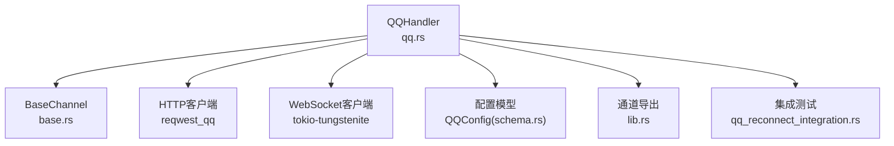
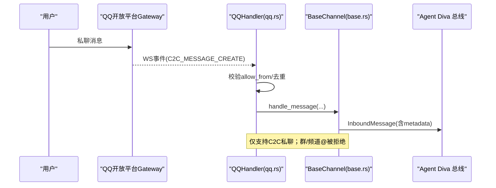
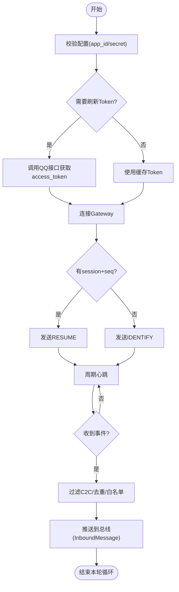
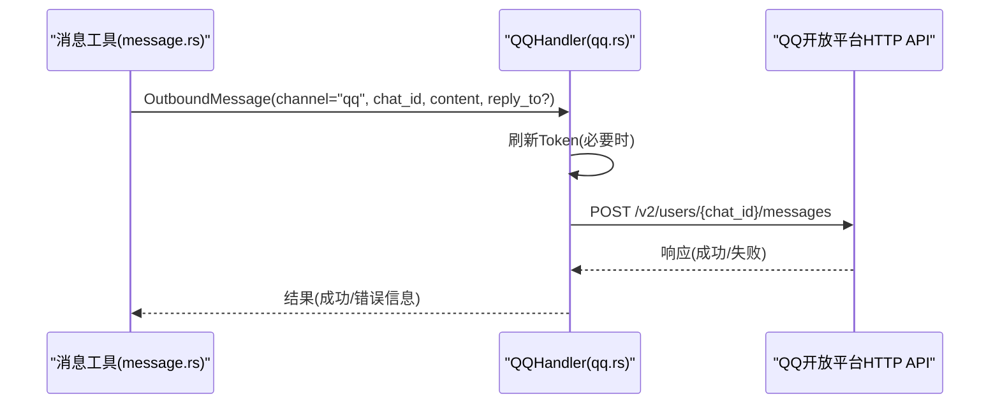
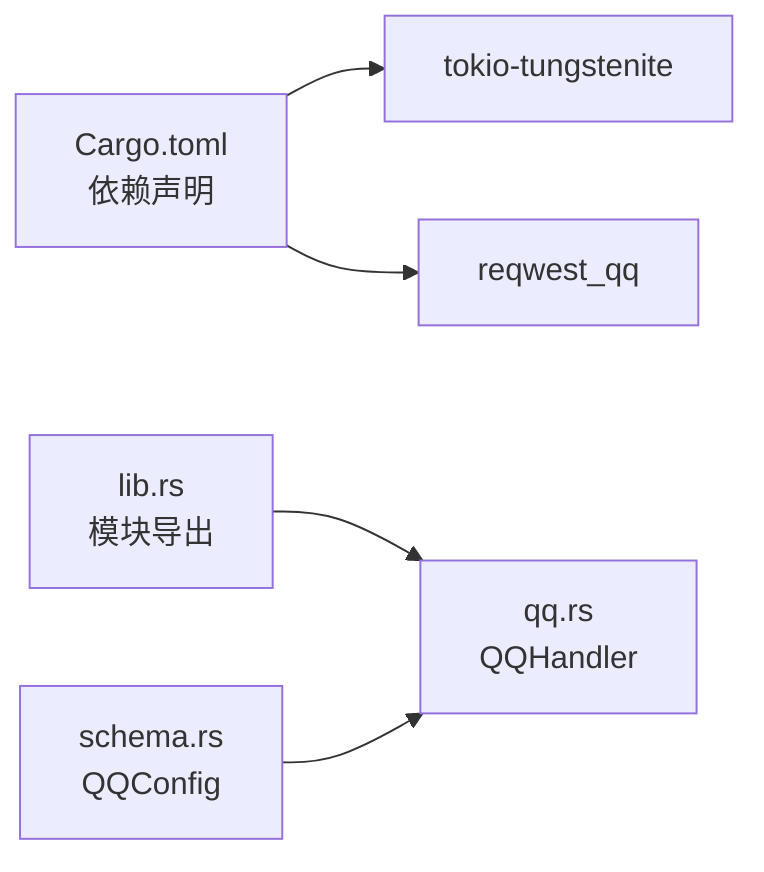

# QQ 渠道配置

<cite>
**本文引用的文件**
- [agent-diva-channels/src/qq.rs](file://agent-diva-channels/src/qq.rs)
- [agent-diva-channels/src/base.rs](file://agent-diva-channels/src/base.rs)
- [agent-diva-channels/src/lib.rs](file://agent-diva-channels/src/lib.rs)
- [agent-diva-channels/Cargo.toml](file://agent-diva-channels/Cargo.toml)
- [agent-diva-core/src/config/schema.rs](file://agent-diva-core/src/config/schema.rs)
- [agent-diva-channels/tests/qq_reconnect_integration.rs](file://agent-diva-channels/tests/qq_reconnect_integration.rs)
- [docs/logs/2026-08-qq-channel-allowlist/v0.1.0-empty-allow-and-reject-group/summary.md](file://docs/logs/2026-08-qq-channel-allowlist/v0.1.0-empty-allow-and-reject-group/summary.md)
- [docs/logs/2026-08-qq-channel-allowlist/v0.1.0-empty-allow-and-reject-group/acceptance.md](file://docs/logs/2026-08-qq-channel-allowlist/v0.1.0-empty-allow-and-reject-group/acceptance.md)
- [agent-diva-tools/src/message.rs](file://agent-diva-tools/src/message.rs)
</cite>

## 目录
1. [简介](#简介)
2. [项目结构](#项目结构)
3. [核心组件](#核心组件)
4. [架构总览](#架构总览)
5. [详细组件分析](#详细组件分析)
6. [依赖关系分析](#依赖关系分析)
7. [性能与限流](#性能与限流)
8. [故障排查指南](#故障排查指南)
9. [结论](#结论)
10. [附录：配置示例与调试清单](#附录配置示例与调试清单)

## 简介
本文件面向在 Agent Diva 中启用并配置 QQ 渠道的用户与运维人员，说明如何完成 QQ 开放平台应用注册、获取凭证、在 Agent Diva 中配置 QQ 渠道（app_id、secret、白名单等），以及消息收发、权限控制、重连与心跳、限流策略和调试方法。文档同时给出与 Agent Diva 系统集成的要点，包括入站消息进入总线、出站消息通过 HTTP API 发送，以及当前对富文本与群聊的支持边界。

## 项目结构
QQ 渠道实现位于 channels 子模块中，核心由以下文件组成：
- qq.rs：QQ 渠道处理器，负责 WebSocket 连接、心跳、事件处理、消息去重、鉴权与发送。
- base.rs：通道基类与通用能力（如允许列表策略、入站消息转发）。
- lib.rs：通道模块导出与特性开关。
- Cargo.toml：channels 的依赖与特性开关（例如 QQ 使用 native-tls 以兼容 Windows 环境）。
- schema.rs：全局配置模式定义，包含 QQConfig 的结构字段。
- tests/qq_reconnect_integration.rs：针对 QQ 重连、心跳、无效会话恢复的集成测试。
- docs/logs/...：关于“空 allow_from 行为”和“拒绝群消息”的变更记录与验收标准。

图表来源
- [agent-diva-channels/src/qq.rs:231-265](file://agent-diva-channels/src/qq.rs#L231-L265)
- [agent-diva-channels/src/base.rs:73-114](file://agent-diva-channels/src/base.rs#L73-L114)
- [agent-diva-channels/Cargo.toml:39-43](file://agent-diva-channels/Cargo.toml#L39-L43)
- [agent-diva-core/src/config/schema.rs:960-972](file://agent-diva-core/src/config/schema.rs#L960-L972)
- [agent-diva-channels/src/lib.rs:25-47](file://agent-diva-channels/src/lib.rs#L25-L47)
- [agent-diva-channels/tests/qq_reconnect_integration.rs:292-392](file://agent-diva-channels/tests/qq_reconnect_integration.rs#L292-L392)

章节来源
- [agent-diva-channels/src/qq.rs:1-1327](file://agent-diva-channels/src/qq.rs#L1-L1327)
- [agent-diva-channels/src/base.rs:1-200](file://agent-diva-channels/src/base.rs#L1-L200)
- [agent-diva-channels/src/lib.rs:1-53](file://agent-diva-channels/src/lib.rs#L1-L53)
- [agent-diva-channels/Cargo.toml:1-84](file://agent-diva-channels/Cargo.toml#L1-L84)
- [agent-diva-core/src/config/schema.rs:960-972](file://agent-diva-core/src/config/schema.rs#L960-L972)
- [agent-diva-channels/tests/qq_reconnect_integration.rs:1-809](file://agent-diva-channels/tests/qq_reconnect_integration.rs#L1-L809)
- [docs/logs/2026-08-qq-channel-allowlist/v0.1.0-empty-allow-and-reject-group/summary.md:1-17](file://docs/logs/2026-08-qq-channel-allowlist/v0.1.0-empty-allow-and-reject-group/summary.md#L1-L17)

## 核心组件
- QQHandler：实现 ChannelHandler 接口，封装 QQ 的鉴权、网关握手、心跳、事件分发、消息去重、入站转发与出站发送。
- BaseChannel：提供跨通道的通用能力，包括允许列表策略、入站消息统一转发。
- QQConfig：QQ 渠道的配置结构体，包含 enabled、app_id、secret、allow_from。
- 集成测试：覆盖重连、心跳超时、无效会话风暴退避、Resume/Identify 回退等场景。

章节来源
- [agent-diva-channels/src/qq.rs:231-265](file://agent-diva-channels/src/qq.rs#L231-L265)
- [agent-diva-channels/src/base.rs:73-114](file://agent-diva-channels/src/base.rs#L73-L114)
- [agent-diva-core/src/config/schema.rs:960-972](file://agent-diva-core/src/config/schema.rs#L960-L972)
- [agent-diva-channels/tests/qq_reconnect_integration.rs:292-392](file://agent-diva-channels/tests/qq_reconnect_integration.rs#L292-L392)

## 架构总览
QQ 渠道采用“WebSocket 接收 + HTTP 发送”的双通道模式：
- 接收：通过 WebSocket 连接 QQ 开放平台 Gateway，周期性心跳保活，解析事件后过滤出私聊消息，经 BaseChannel 转发到 Agent Diva 总线。
- 发送：通过 HTTP API 向 QQ 开放平台发送私聊消息，自动刷新 Token 并携带必要请求头。

图表来源
- [agent-diva-channels/src/qq.rs:616-646](file://agent-diva-channels/src/qq.rs#L616-L646)
- [agent-diva-channels/src/base.rs:186-200](file://agent-diva-channels/src/base.rs#L186-L200)
- [docs/logs/2026-08-qq-channel-allowlist/v0.1.0-empty-allow-and-reject-group/summary.md:1-17](file://docs/logs/2026-08-qq-channel-allowlist/v0.1.0-empty-allow-and-reject-group/summary.md#L1-L17)

## 详细组件分析

### QQ 渠道处理器（QQHandler）
- 生命周期管理
  - start：校验配置、获取 Token、获取 Gateway URL、启动 WebSocket 任务。
  - stop：置为停止状态并发送关闭信号。
- 鉴权与会话
  - Token 自动刷新：优先读取环境变量覆盖，否则调用 QQ 接口获取 access_token，维护过期时间。
  - Gateway 握手：根据是否已有 session_id 与 seq 选择 Identify 或 Resume。
  - 心跳：按 HELLO 中的间隔定时发送心跳，若连续多次未收到 ACK 则触发重连。
  - 重连策略：服务端要求重连、连接失败、心跳超时、无效会话等均会触发重连；无效会话采用递增退避与冷却期。
- 事件处理与入站
  - 仅转发 C2C 私聊事件；群/频道相关事件记录日志并丢弃，不进入对话。
  - 消息去重：维护最近最多 1000 条已处理消息 ID，避免重复处理。
  - 元数据：附带 message_id、timestamp 等 metadata。
- 出站发送
  - 通过 HTTP API 发送私聊消息，自动刷新 Token，携带 Authorization 与 X-Union-Appid。
  - 支持 reply_to（msg_id）用于回复上下文。

图表来源
- [agent-diva-channels/src/qq.rs:286-336](file://agent-diva-channels/src/qq.rs#L286-L336)
- [agent-diva-channels/src/qq.rs:338-366](file://agent-diva-channels/src/qq.rs#L338-L366)
- [agent-diva-channels/src/qq.rs:556-749](file://agent-diva-channels/src/qq.rs#L556-L749)
- [agent-diva-channels/src/qq.rs:953-962](file://agent-diva-channels/src/qq.rs#L953-L962)

章节来源
- [agent-diva-channels/src/qq.rs:231-1085](file://agent-diva-channels/src/qq.rs#L231-L1085)

### 通道基类与允许列表（BaseChannel）
- 允许列表策略
  - 空 allow_from：默认放行（deny_by_default=false），与 GUI “留空表示不限制”一致。
  - 非空 allow_from：精确匹配或通配符匹配（支持复合 ID 拆分匹配）。
- 入站消息统一转发
  - 校验 sender_id 是否允许，通过后构造 InboundMessage 并发送到总线。

章节来源
- [agent-diva-channels/src/base.rs:73-184](file://agent-diva-channels/src/base.rs#L73-L184)
- [agent-diva-channels/src/base.rs:186-200](file://agent-diva-channels/src/base.rs#L186-L200)
- [docs/logs/2026-08-qq-channel-allowlist/v0.1.0-empty-allow-and-reject-group/summary.md:1-17](file://docs/logs/2026-08-qq-channel-allowlist/v0.1.0-empty-allow-and-reject-group/summary.md#L1-L17)

### 配置模型（QQConfig）
- 字段
  - enabled：是否启用 QQ 渠道。
  - app_id：QQ 开放平台应用的 App ID。
  - secret：QQ 开放平台应用的 Secret。
  - allow_from：允许发送消息的用户 ID 列表（空表示不限制）。
- 校验
  - 启动时校验 app_id 与 secret 是否为空，为空则报错。

章节来源
- [agent-diva-core/src/config/schema.rs:960-972](file://agent-diva-core/src/config/schema.rs#L960-L972)
- [agent-diva-channels/src/qq.rs:286-299](file://agent-diva-channels/src/qq.rs#L286-L299)

### 与 Agent Diva 系统的集成
- 入站消息
  - QQHandler 将 C2C 事件转换为 InboundMessage，附加 message_id、timestamp 等元数据，通过 BaseChannel 发送到总线。
- 出站消息
  - 工具层通过 OutboundMessage 指定 channel=qq 与 chat_id，调用通道 send 接口发送私聊消息。
  - QQHandler.send 通过 HTTP API 发送，自动刷新 Token，并支持 reply_to。

图表来源
- [agent-diva-tools/src/message.rs:121-164](file://agent-diva-tools/src/message.rs#L121-L164)
- [agent-diva-channels/src/qq.rs:1023-1074](file://agent-diva-channels/src/qq.rs#L1023-L1074)

章节来源
- [agent-diva-tools/src/message.rs:121-164](file://agent-diva-tools/src/message.rs#L121-L164)
- [agent-diva-channels/src/qq.rs:1023-1074](file://agent-diva-channels/src/qq.rs#L1023-L1074)

## 依赖关系分析
- 运行时依赖
  - tokio-tungstenite：WebSocket 客户端，启用 native-tls 以适配 Windows 环境。
  - reqwest_qq：HTTP 客户端，用于获取 Token 与发送消息。
- 模块导出
  - lib.rs 暴露 QQHandler 与其他通道处理器，便于上层管理器装配。
- 配置与验证
  - schema.rs 提供 QQConfig 结构；channels 在启动时进行最小化校验。

图表来源
- [agent-diva-channels/Cargo.toml:39-43](file://agent-diva-channels/Cargo.toml#L39-L43)
- [agent-diva-channels/src/lib.rs:25-47](file://agent-diva-channels/src/lib.rs#L25-L47)
- [agent-diva-core/src/config/schema.rs:960-972](file://agent-diva-core/src/config/schema.rs#L960-L972)

章节来源
- [agent-diva-channels/Cargo.toml:1-84](file://agent-diva-channels/Cargo.toml#L1-L84)
- [agent-diva-channels/src/lib.rs:1-53](file://agent-diva-channels/src/lib.rs#L1-L53)
- [agent-diva-core/src/config/schema.rs:960-972](file://agent-diva-core/src/config/schema.rs#L960-L972)

## 性能与限流
- 心跳与重连
  - 心跳间隔来自 Gateway HELLO，具备容错窗口；连续多次未收到 ACK 触发重连。
  - 无效会话采用递增退避与冷却期，防止风暴式重连。
- 消息去重
  - 内存中维护最近 1000 条消息 ID，避免重复处理。
- 发送速率
  - 当前实现未内置显式限流器；发送失败会返回错误，上层可据此做重试或节流。
- 资源占用
  - WebSocket 单连接；HTTP 客户端设置超时，避免阻塞。

章节来源
- [agent-diva-channels/src/qq.rs:43-48](file://agent-diva-channels/src/qq.rs#L43-L48)
- [agent-diva-channels/src/qq.rs:556-749](file://agent-diva-channels/src/qq.rs#L556-L749)
- [agent-diva-channels/src/qq.rs:271-284](file://agent-diva-channels/src/qq.rs#L271-L284)
- [agent-diva-channels/src/qq.rs:1023-1074](file://agent-diva-channels/src/qq.rs#L1023-L1074)

## 故障排查指南
- 常见错误与定位
  - 配置缺失：启动时报 InvalidConfig，检查 app_id 与 secret 是否填写。
  - 认证失败：获取 Token 失败，检查网络与凭据；可通过环境变量覆盖 Token。
  - 连接失败：Gateway 连接失败，检查网络与证书（Windows 需 native-tls）。
  - 心跳超时：连续未收到 ACK，查看网络稳定性与服务端状态。
  - 无效会话：频繁收到无效会话，观察退避与冷却行为，确认会话状态清理。
- 群聊/频道消息
  - 群/频道 @ 消息会被拒绝且不进入对话，仅支持 C2C 私聊。
- 调试技巧
  - 使用集成测试中的环境变量模拟 Gateway 与 Token，快速验证重连与心跳逻辑。
  - 关注日志中的“QQ channel started/stopped”“heartbeat ACK received”“invalid session”等关键字。

章节来源
- [agent-diva-channels/src/qq.rs:286-299](file://agent-diva-channels/src/qq.rs#L286-L299)
- [agent-diva-channels/src/qq.rs:616-749](file://agent-diva-channels/src/qq.rs#L616-L749)
- [docs/logs/2026-08-qq-channel-allowlist/v0.1.0-empty-allow-and-reject-group/acceptance.md:1-17](file://docs/logs/2026-08-qq-channel-allowlist/v0.1.0-empty-allow-and-reject-group/acceptance.md#L1-L17)
- [agent-diva-channels/tests/qq_reconnect_integration.rs:292-392](file://agent-diva-channels/tests/qq_reconnect_integration.rs#L292-L392)

## 结论
QQ 渠道在 Agent Diva 中以 WebSocket 接收私聊消息、HTTP 发送私聊消息的方式接入，具备完善的鉴权、心跳、重连与消息去重机制。当前版本仅支持 C2C 私聊，群聊与频道消息将被拒绝。配置层面仅需开启 enabled、填写 app_id 与 secret，并通过 allow_from 控制访问范围。结合集成测试与环境变量，可高效完成联调与问题定位。

## 附录：配置示例与调试清单
- 配置项说明
  - enabled：布尔值，是否启用 QQ 渠道。
  - app_id：QQ 开放平台应用的 App ID。
  - secret：QQ 开放平台应用的 Secret。
  - allow_from：允许发送消息的用户 ID 列表；留空表示不限制。
- 应用注册与权限（外部流程）
  - 在 QQ 开放平台创建机器人应用，获取 App ID 与 Secret。
  - 确保应用具备私聊消息接收权限（C2C 消息）。
  - 注意：当前实现不支持群聊与频道消息，请勿配置群号或频道相关权限。
- 运行参数与环境变量
  - QQ_ACCESS_TOKEN_OVERRIDE：可选，直接覆盖 access_token，便于测试。
  - QQ_GATEWAY_URL_OVERRIDE：可选，指定测试用 Gateway 地址。
  - QQ_API_BASE_OVERRIDE：可选，覆盖 API 基础地址。
  - QQ_WS_TEST_RECONNECT_DELAY_MS、QQ_WS_TEST_INVALID_SESSION_BACKOFF_MS、QQ_WS_TEST_INVALID_SESSION_COOLDOWN_MS：测试用重连与退避参数。
- 调试步骤
  - 设置环境变量，启动 QQ 渠道，观察日志确认“channel started”。
  - 发送私聊消息，确认 InboundMessage 进入总线。
  - 通过工具层发送消息，确认 HTTP 发送成功。
  - 模拟断网/心跳丢失/无效会话，验证重连与恢复。
- 富文本与媒体
  - 当前实现发送 msg_type 为文本类型；富文本与媒体在当前版本未作为独立能力暴露。
  - 如需扩展，可在发送逻辑中增加对应字段与媒体上传流程。

章节来源
- [agent-diva-core/src/config/schema.rs:960-972](file://agent-diva-core/src/config/schema.rs#L960-L972)
- [agent-diva-channels/src/qq.rs:79-132](file://agent-diva-channels/src/qq.rs#L79-L132)
- [agent-diva-channels/src/qq.rs:267-336](file://agent-diva-channels/src/qq.rs#L267-L336)
- [agent-diva-channels/src/qq.rs:1023-1074](file://agent-diva-channels/src/qq.rs#L1023-L1074)
- [agent-diva-channels/tests/qq_reconnect_integration.rs:292-392](file://agent-diva-channels/tests/qq_reconnect_integration.rs#L292-L392)
- [docs/logs/2026-08-qq-channel-allowlist/v0.1.0-empty-allow-and-reject-group/summary.md:1-17](file://docs/logs/2026-08-qq-channel-allowlist/v0.1.0-empty-allow-and-reject-group/summary.md#L1-L17)
- [docs/logs/2026-08-qq-channel-allowlist/v0.1.0-empty-allow-and-reject-group/acceptance.md:1-17](file://docs/logs/2026-08-qq-channel-allowlist/v0.1.0-empty-allow-and-reject-group/acceptance.md#L1-L17)