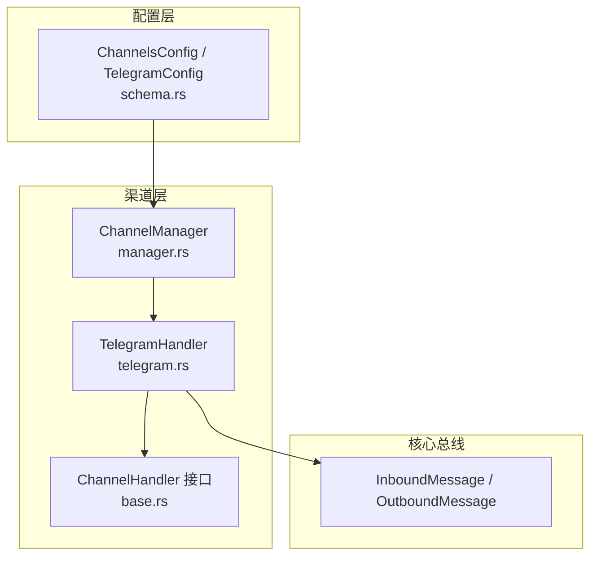
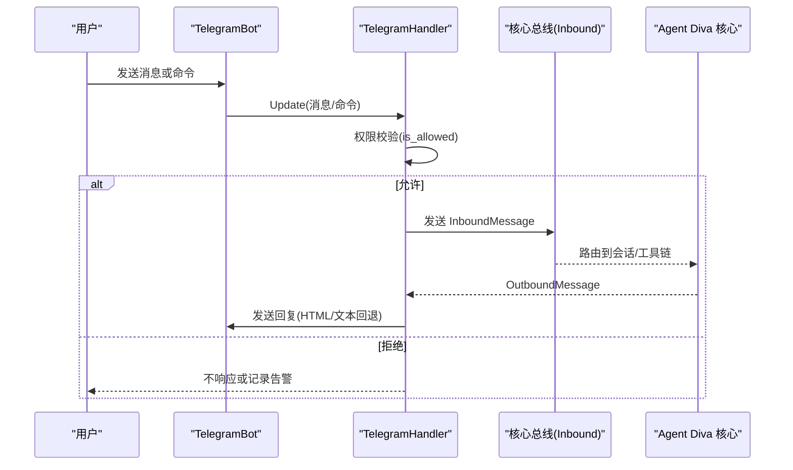
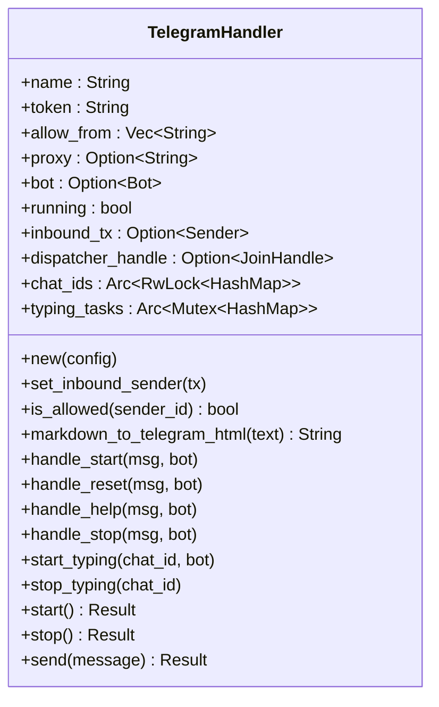
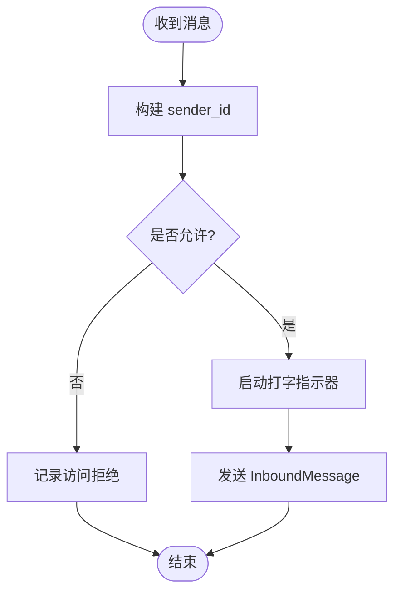
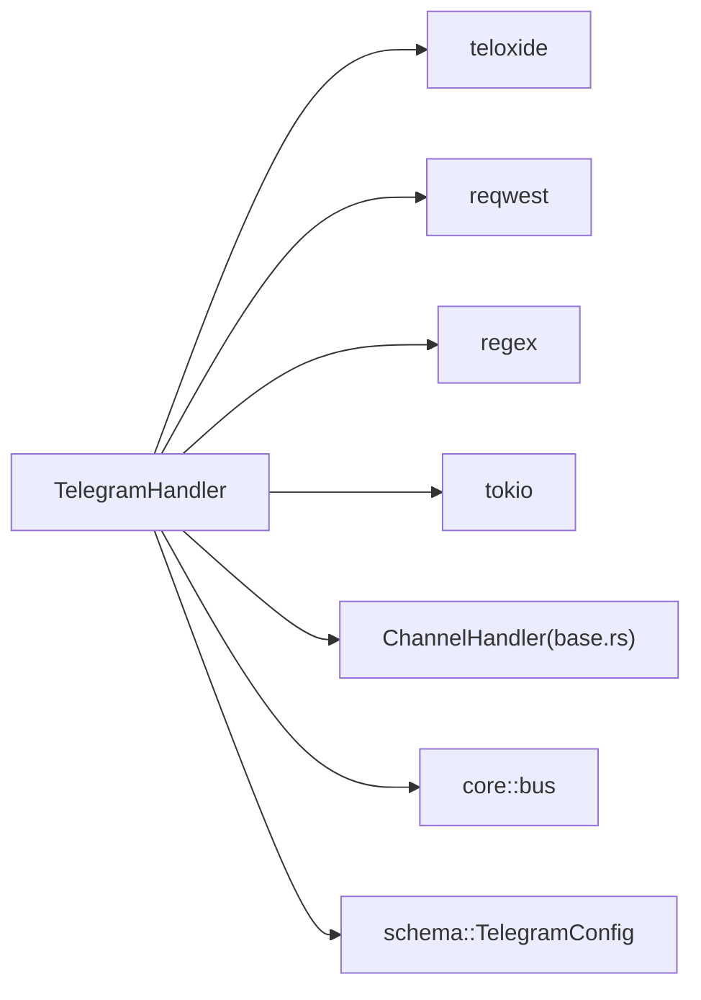

# Telegram 渠道配置

<cite>
**本文引用的文件**
- [telegram.rs](file://agent-diva-channels/src/telegram.rs)
- [base.rs](file://agent-diva-channels/src/base.rs)
- [manager.rs](file://agent-diva-channels/src/manager.rs)
- [schema.rs](file://agent-diva-core/src/config/schema.rs)
</cite>

## 目录
1. [简介](#简介)
2. [项目结构](#项目结构)
3. [核心组件](#核心组件)
4. [架构总览](#架构总览)
5. [详细组件分析](#详细组件分析)
6. [依赖关系分析](#依赖关系分析)
7. [性能与可靠性](#性能与可靠性)
8. [故障排查指南](#故障排查指南)
9. [结论](#结论)
10. [附录：配置示例与常见问题](#附录配置示例与常见问题)

## 简介
本文件面向需要在 Agent Diva 中启用并配置 Telegram 渠道的用户与运维人员，覆盖以下主题：
- 如何创建与配置 Telegram Bot（含 Token 获取方法）
- Telegram 渠道的配置项说明（token、群组设置、消息格式转换等）
- Bot 权限与群组管理建议
- 完整配置示例与常见问题解决方案
- 消息路由规则与权限控制
- 与 Agent Diva 系统的集成方式与状态监控方法

## 项目结构
Agent Diva 的渠道子系统位于 agent-diva-channels 模块，其中 Telegram 渠道由 telegram.rs 实现，并通过 base.rs 提供的 ChannelHandler 接口与 manager.rs 统一编排。配置结构定义在 agent-diva-core 的 schema.rs 中。

图表来源
- [telegram.rs:36-122](file://agent-diva-channels/src/telegram.rs#L36-L122)
- [base.rs:9-32](file://agent-diva-channels/src/base.rs#L9-L32)
- [manager.rs:222-232](file://agent-diva-channels/src/manager.rs#L222-L232)
- [schema.rs:644-655](file://agent-diva-core/src/config/schema.rs#L644-L655)

章节来源
- [telegram.rs:1-122](file://agent-diva-channels/src/telegram.rs#L1-L122)
- [base.rs:1-422](file://agent-diva-channels/src/base.rs#L1-L422)
- [manager.rs:1-800](file://agent-diva-channels/src/manager.rs#L1-L800)
- [schema.rs:605-655](file://agent-diva-core/src/config/schema.rs#L605-L655)

## 核心组件
- TelegramHandler：实现 Telegram Bot 的消息收发、命令处理、权限校验、Markdown→HTML 转换、打字指示器、停止生成等能力。
- ChannelHandler 接口：统一抽象所有渠道的生命周期与消息通道。
- ChannelManager：根据配置初始化、启动、停止各渠道；提供动态更新与查询能力。
- TelegramConfig：描述 Telegram 渠道的配置项（enabled、token、allow_from、proxy）。

章节来源
- [telegram.rs:36-122](file://agent-diva-channels/src/telegram.rs#L36-L122)
- [base.rs:9-32](file://agent-diva-channels/src/base.rs#L9-L32)
- [manager.rs:222-232](file://agent-diva-channels/src/manager.rs#L222-L232)
- [schema.rs:644-655](file://agent-diva-core/src/config/schema.rs#L644-L655)

## 架构总览
Telegram 渠道通过 teloxide 库以轮询模式运行 Dispatcher，监听消息与命令。入站消息经权限检查后封装为 InboundMessage 发送到核心总线；出站消息通过 send() 将 Markdown 转换为 HTML 后发送至 Telegram。

图表来源
- [telegram.rs:415-682](file://agent-diva-channels/src/telegram.rs#L415-L682)
- [base.rs:186-229](file://agent-diva-channels/src/base.rs#L186-L229)

## 详细组件分析

### TelegramHandler 类与方法
- 构造与生命周期
  - new(config)：从配置构建处理器，包含 token、allow_from、proxy 等。
  - start()：创建 Bot、设置命令菜单、连接并启动 Dispatcher；维护 typing 任务与聊天映射。
  - stop()：中止 typing 任务与 Dispatcher，释放资源。
- 消息处理
  - handle_text_message()：解析 sender_id、chat_id、内容，写入元数据，启动 typing，发送 InboundMessage。
  - send()：将 Markdown 转为 HTML 发送，失败时回退为纯文本。
- 命令处理
  - /start：欢迎语
  - /reset：提示对话历史已清空
  - /help：列出可用命令
  - /stop：调用本地 API 请求停止当前生成
- 权限控制
  - is_allowed()：支持空列表默认放行、精确匹配、复合 ID（如 user_id|username）匹配。

图表来源
- [telegram.rs:36-122](file://agent-diva-channels/src/telegram.rs#L36-L122)
- [telegram.rs:405-758](file://agent-diva-channels/src/telegram.rs#L405-L758)

章节来源
- [telegram.rs:36-122](file://agent-diva-channels/src/telegram.rs#L36-L122)
- [telegram.rs:405-758](file://agent-diva-channels/src/telegram.rs#L405-L758)

### 消息路由与权限控制
- 路由规则
  - 命令分支：/start、/reset、/help、/stop 直接由 Dispatcher 路由到对应处理函数。
  - 普通消息：进入通用分支，先做权限校验，再转发至核心总线。
- 权限模型
  - allow_from 为空：默认放行（可被 BaseChannel 的 deny_by_default 策略覆盖，但 TelegramHandler 自身未使用该策略）。
  - 支持复合 ID：user_id|username 形式，任一片段命中即放行。
  - 拒绝行为：日志记录警告，不继续处理。

图表来源
- [telegram.rs:551-665](file://agent-diva-channels/src/telegram.rs#L551-L665)
- [base.rs:121-184](file://agent-diva-channels/src/base.rs#L121-L184)

章节来源
- [telegram.rs:551-665](file://agent-diva-channels/src/telegram.rs#L551-L665)
- [base.rs:121-184](file://agent-diva-channels/src/base.rs#L121-L184)

### 消息格式转换
- Markdown → Telegram HTML
  - 代码块与行内代码保护与还原
  - 标题、引用、链接、加粗、斜体、删除线、无序列表转换
  - HTML 特殊字符转义，防止注入
- 发送回退
  - 优先使用 HTML 发送；若解析失败，自动回退为纯文本发送。

章节来源
- [telegram.rs:151-243](file://agent-diva-channels/src/telegram.rs#L151-L243)
- [telegram.rs:711-749](file://agent-diva-channels/src/telegram.rs#L711-L749)

### 命令与停止生成
- 内置命令：/start、/reset、/help、/stop
- /stop 机制：通过 HTTP 调用本地服务接口请求停止当前生成，并返回结果给用户。

章节来源
- [telegram.rs:18-34](file://agent-diva-channels/src/telegram.rs#L18-L34)
- [telegram.rs:62-106](file://agent-diva-channels/src/telegram.rs#L62-L106)
- [telegram.rs:528-545](file://agent-diva-channels/src/telegram.rs#L528-L545)
- [telegram.rs:603-621](file://agent-diva-channels/src/telegram.rs#L603-L621)

### 与 Agent Diva 系统集成
- 初始化与注册：ChannelManager 根据配置创建 TelegramHandler 并注入 inbound 通道。
- 运行时：Dispatcher 后台运行，持续接收 Telegram 事件。
- 状态查询：可通过 ChannelManager 查询渠道是否运行、列出活跃渠道。

章节来源
- [manager.rs:377-398](file://agent-diva-channels/src/manager.rs#L377-L398)
- [manager.rs:644-680](file://agent-diva-channels/src/manager.rs#L644-L680)
- [manager.rs:682-754](file://agent-diva-channels/src/manager.rs#L682-L754)

## 依赖关系分析
- 外部依赖
  - teloxide：Telegram Bot SDK，用于建立 Bot、分发更新、发送消息与动作。
  - reqwest：HTTP 客户端，用于 /stop 调用本地服务。
  - regex：正则表达式，用于 Markdown→HTML 转换。
  - tokio：异步运行时与并发原语（mpsc、RwLock、Mutex、JoinHandle）。
- 内部依赖
  - base::ChannelHandler：统一接口
  - core::bus：InboundMessage/OutboundMessage
  - core::config::schema::TelegramConfig：配置结构

图表来源
- [telegram.rs:1-17](file://agent-diva-channels/src/telegram.rs#L1-L17)
- [base.rs:1-8](file://agent-diva-channels/src/base.rs#L1-L8)
- [schema.rs:644-655](file://agent-diva-core/src/config/schema.rs#L644-L655)

章节来源
- [telegram.rs:1-17](file://agent-diva-channels/src/telegram.rs#L1-L17)
- [base.rs:1-8](file://agent-diva-channels/src/base.rs#L1-L8)
- [schema.rs:644-655](file://agent-diva-core/src/config/schema.rs#L644-L655)

## 性能与可靠性
- 打字指示器：为每个 chat_id 维护独立任务，周期性发送“正在输入”动作，提升交互体验；停止时及时中止任务，避免资源泄漏。
- 并发安全：使用 RwLock/Mutex 保护共享状态（聊天映射、任务表），保证多线程安全。
- 错误恢复：HTML 发送失败自动回退为纯文本；/stop 调用失败会记录错误并反馈用户。
- 可扩展性：通过 ChannelManager 统一管理多渠道路由与生命周期。

章节来源
- [telegram.rs:376-403](file://agent-diva-channels/src/telegram.rs#L376-L403)
- [telegram.rs:623-643](file://agent-diva-channels/src/telegram.rs#L623-L643)
- [telegram.rs:711-749](file://agent-diva-channels/src/telegram.rs#L711-L749)

## 故障排查指南
- 无法启动
  - 检查 token 是否为空；若为空，start() 会返回未配置错误。
  - 查看日志中“Failed to get bot info”等错误信息。
- 消息被拒绝
  - 确认 sender_id 是否在 allow_from 列表中；支持 user_id 或 user_id|username。
  - 若 allow_from 为空且需严格限制，可在更高层策略中调整默认策略。
- 停止生成无效
  - 检查 /stop 调用的本地服务是否可达，以及返回状态是否为 ok。
- 消息显示异常
  - 若 HTML 解析失败，系统会自动回退为纯文本；检查 Markdown 语法是否符合预期。
- 渠道未生效
  - 确认 channels.telegram.enabled 为 true，且 token 已配置；ChannelManager 会在初始化时跳过未就绪渠道并记录告警。

章节来源
- [telegram.rs:415-455](file://agent-diva-channels/src/telegram.rs#L415-L455)
- [telegram.rs:573-588](file://agent-diva-channels/src/telegram.rs#L573-L588)
- [telegram.rs:603-621](file://agent-diva-channels/src/telegram.rs#L603-L621)
- [manager.rs:198-211](file://agent-diva-channels/src/manager.rs#L198-L211)

## 结论
Telegram 渠道在 Agent Diva 中以标准化接口接入，具备完善的权限控制、消息格式转换、命令支持与停止生成能力。通过 ChannelManager 的统一编排，可实现多渠道并存与热更新。合理配置 token、allow_from 与 proxy，即可快速上线稳定可靠的 Telegram 机器人。

## 附录：配置示例与常见问题

### 配置项说明（来自 schema.rs）
- enabled：是否启用 Telegram 渠道
- token：Bot Token（必填）
- allow_from：允许发送消息的用户/群组标识列表（可选）
- proxy：代理 URL（可选）

章节来源
- [schema.rs:644-655](file://agent-diva-core/src/config/schema.rs#L644-L655)

### 完整配置示例（JSON/YAML 片段）
- JSON
  - channels.telegram.enabled: true
  - channels.telegram.token: "<你的Bot Token>"
  - channels.telegram.allow_from: ["12345", "12345|your_username"]
  - channels.telegram.proxy: "http://your-proxy:port"
- YAML
  - channels:
      telegram:
        enabled: true
        token: "<你的Bot Token>"
        allow_from:
          - "12345"
          - "12345|your_username"
        proxy: "http://your-proxy:port"

注意：以上字段名称与类型来源于 schema.rs 中的 TelegramConfig 定义。

章节来源
- [schema.rs:644-655](file://agent-diva-core/src/config/schema.rs#L644-L655)

### 常见问答
- 如何获取 Bot Token？
  - 在 Telegram 中与 @BotFather 对话，创建新 Bot 并获取 Token。
- 如何限制谁可以与我对话？
  - 在 allow_from 中添加用户 ID 或 user_id|username；留空表示默认放行。
- 如何在群组中使用？
  - 将 Bot 加入群组并授予必要权限；sender_id 可为群组 ID（负数）；如需仅特定成员，请在 allow_from 中配置。
- 如何停止正在生成的消息？
  - 发送 /stop 或在消息中发送 /stop@BotName；系统将调用本地服务请求停止。
- 为什么我的 Markdown 没有正确渲染？
  - 系统会将 Markdown 转为 HTML；若解析失败则回退为纯文本。请检查语法或使用简单格式。
- 如何启用代理？
  - 在 proxy 字段填写代理地址；确保网络可达。

章节来源
- [telegram.rs:18-34](file://agent-diva-channels/src/telegram.rs#L18-L34)
- [telegram.rs:62-106](file://agent-diva-channels/src/telegram.rs#L62-L106)
- [telegram.rs:551-665](file://agent-diva-channels/src/telegram.rs#L551-L665)
- [schema.rs:644-655](file://agent-diva-core/src/config/schema.rs#L644-L655)