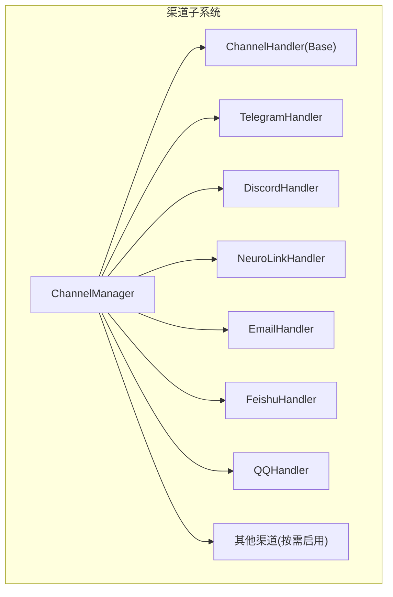
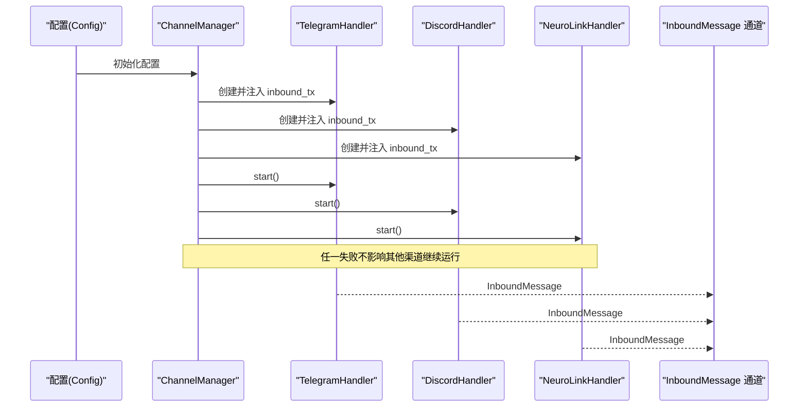
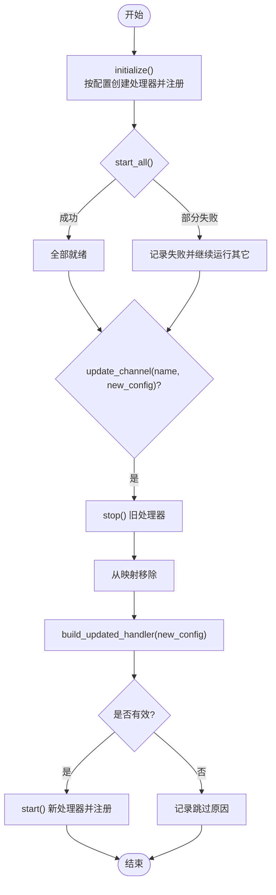
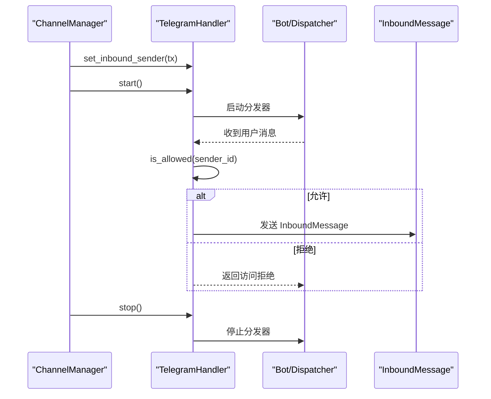
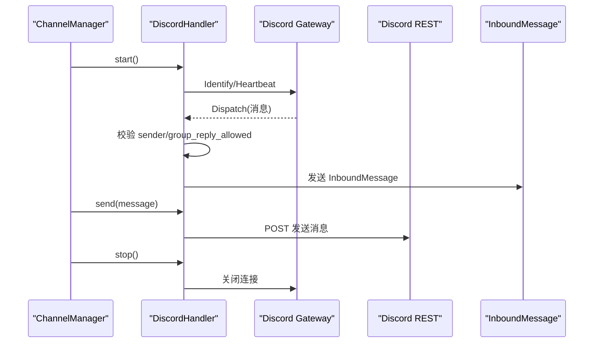
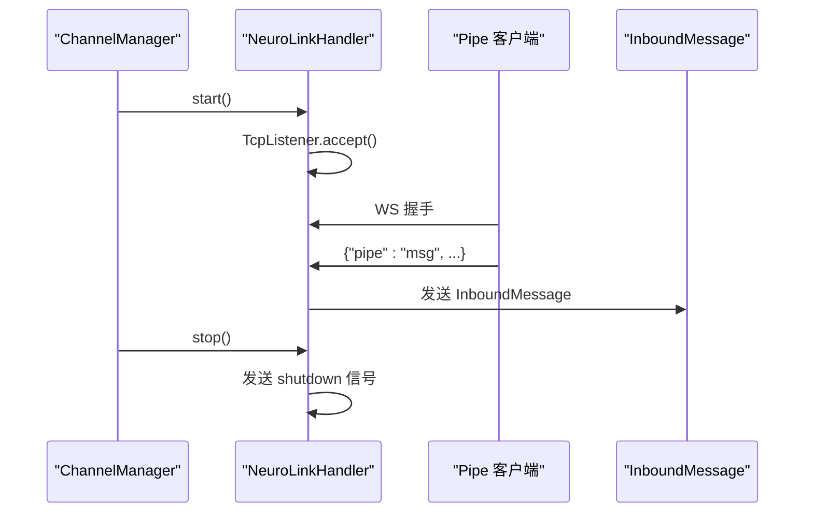
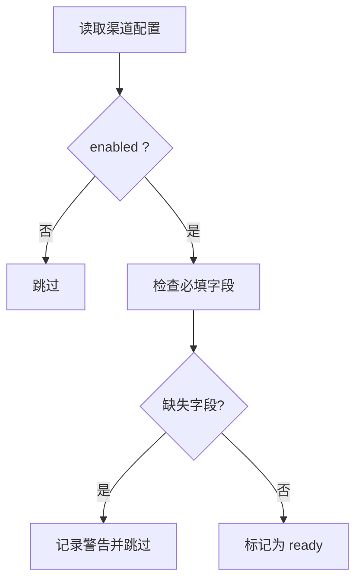
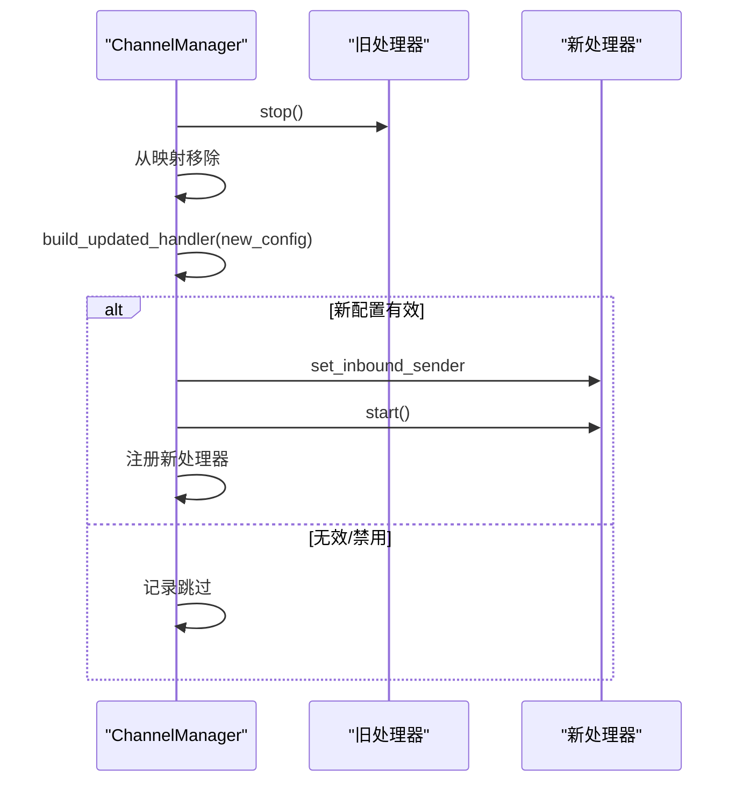
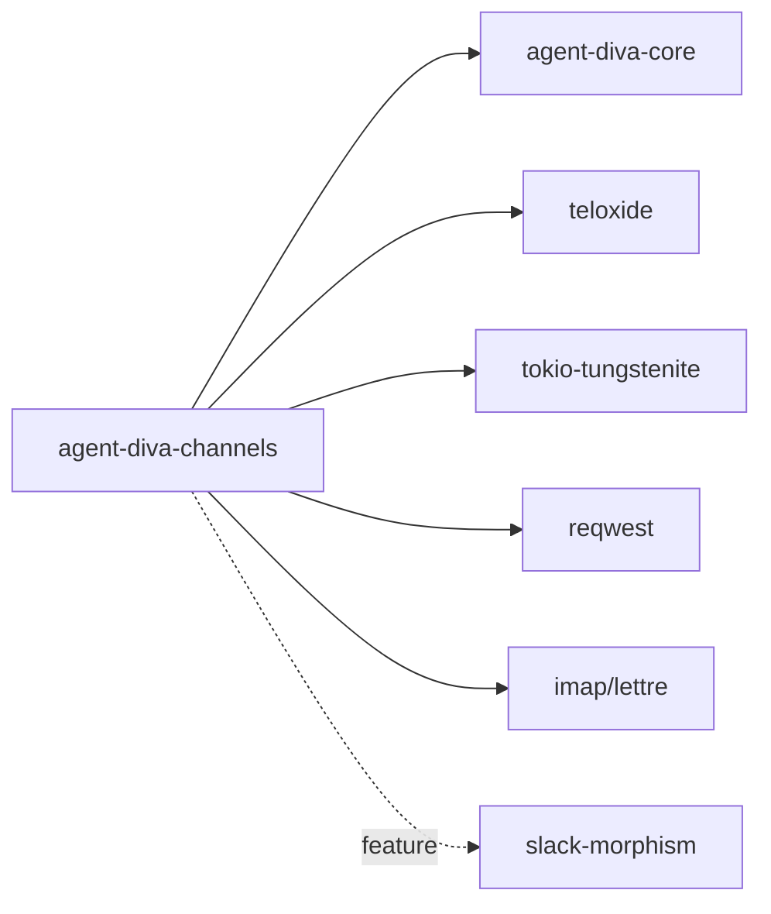

# 渠道生命周期管理

<cite>
**本文引用的文件**
- [agent-diva-channels/src/manager.rs](file://agent-diva-channels/src/manager.rs)
- [agent-diva-channels/src/base.rs](file://agent-diva-channels/src/base.rs)
- [agent-diva-channels/src/lib.rs](file://agent-diva-channels/src/lib.rs)
- [agent-diva-channels/Cargo.toml](file://agent-diva-channels/Cargo.toml)
- [agent-diva-channels/src/telegram.rs](file://agent-diva-channels/src/telegram.rs)
- [agent-diva-channels/src/discord.rs](file://agent-diva-channels/src/discord.rs)
- [agent-diva-channels/src/neuro_link.rs](file://agent-diva-channels/src/neuro_link.rs)
- [agent-diva-core/src/config/schema.rs](file://agent-diva-core/src/config/schema.rs)
</cite>

## 目录
1. [简介](#简介)
2. [项目结构](#项目结构)
3. [核心组件](#核心组件)
4. [架构总览](#架构总览)
5. [详细组件分析](#详细组件分析)
6. [依赖关系分析](#依赖关系分析)
7. [性能与并发](#性能与并发)
8. [故障恢复与监控](#故障恢复与监控)
9. [结论](#结论)
10. [附录：配置热更新与验证规则](#附录：配置热更新与验证规则)

## 简介
本文件聚焦于 agent-diva 的“渠道生命周期管理”，围绕 ChannelManager 的工作机制、渠道启动/停止/重启/更新流程、渠道验证规则、配置热更新、状态监控与故障恢复、多渠道并发管理与资源调度、以及渠道间依赖与协调进行系统化说明。文档以源码为依据，提供可追溯的代码级图示与路径引用，便于读者快速定位实现细节。

## 项目结构
渠道子系统位于 agent-diva-channels 包中，采用“统一接口 + 多实现”的分层设计：
- base：定义 ChannelHandler trait、BaseChannel 公共能力、错误类型与校验工具。
- manager：ChannelManager 负责按配置初始化、启动、停止、更新各渠道处理器，并维护运行态。
- 具体渠道实现：如 telegram、discord、neuro-link、email、feishu、dingtalk、qq 等。
- lib：对外暴露模块与类型别名。
- Cargo.toml：通过 feature 控制可选渠道编译（默认关闭部分未经验证的渠道）。

图表来源
- [agent-diva-channels/src/manager.rs:42-56](file://agent-diva-channels/src/manager.rs#L42-L56)
- [agent-diva-channels/src/base.rs:9-32](file://agent-diva-channels/src/base.rs#L9-L32)
- [agent-diva-channels/src/lib.rs:9-52](file://agent-diva-channels/src/lib.rs#L9-L52)

章节来源
- [agent-diva-channels/src/lib.rs:1-53](file://agent-diva-channels/src/lib.rs#L1-L53)
- [agent-diva-channels/Cargo.toml:11-20](file://agent-diva-channels/Cargo.toml#L11-L20)

## 核心组件
- ChannelHandler trait：定义 name、is_running、start、stop、send、set_inbound_sender、is_allowed 等生命周期与消息收发能力。
- BaseChannel：提供 allow_from/deny_by_default 访问控制、入站消息封装与发送、通配符匹配等通用逻辑。
- ChannelManager：集中管理所有渠道处理器实例，负责初始化、批量启动/停止、单渠道更新、查询活跃渠道、发送出站消息等。
- 渠道实现：各自实现 ChannelHandler，对接平台 API/WS 并复用 BaseChannel 的权限与入站转发能力。

章节来源
- [agent-diva-channels/src/base.rs:9-32](file://agent-diva-channels/src/base.rs#L9-L32)
- [agent-diva-channels/src/base.rs:73-233](file://agent-diva-channels/src/base.rs#L73-L233)
- [agent-diva-channels/src/manager.rs:42-755](file://agent-diva-channels/src/manager.rs#L42-L755)

## 架构总览
ChannelManager 作为编排中心，依据全局配置加载并注册各渠道处理器；每个处理器独立维护连接/任务句柄，并通过共享的消息通道与系统总线交互。

图表来源
- [agent-diva-channels/src/manager.rs:377-642](file://agent-diva-channels/src/manager.rs#L377-L642)
- [agent-diva-channels/src/manager.rs:644-664](file://agent-diva-channels/src/manager.rs#L644-L664)
- [agent-diva-channels/src/base.rs:186-229](file://agent-diva-channels/src/base.rs#L186-L229)

## 详细组件分析

### ChannelManager 工作机制与状态管理
- 初始化 initialize：遍历配置，对每个 enabled 且字段完备的渠道创建处理器，设置 inbound_tx，并注册到 handlers 映射表。
- 启动 start_all：并发读取 handlers 并逐个调用 start；记录失败项但不中断其余渠道。
- 停止 stop_all：写锁保护下逐个调用 stop，完成后清空 handlers。
- 更新 update_channel：先停掉旧处理器并从映射移除，再基于新配置构建新处理器，设置 inbound_tx 后启动并注册。
- 查询 is_channel_running/list_channels/send：读锁保护下的状态与路由操作。

图表来源
- [agent-diva-channels/src/manager.rs:377-642](file://agent-diva-channels/src/manager.rs#L377-L642)
- [agent-diva-channels/src/manager.rs:644-735](file://agent-diva-channels/src/manager.rs#L644-L735)

章节来源
- [agent-diva-channels/src/manager.rs:42-755](file://agent-diva-channels/src/manager.rs#L42-L755)

### Telegram 渠道生命周期
- 生命周期：new -> set_inbound_sender -> start（启动 Dispatcher）-> send -> stop（释放任务句柄）。
- 入站：通过 teloxide 接收消息，经 is_allowed 校验后封装为 InboundMessage 发送至 inbound_tx。
- 命令：支持 /stop 等命令，调用内部 HTTP 接口请求停止生成。

图表来源
- [agent-diva-channels/src/telegram.rs:36-127](file://agent-diva-channels/src/telegram.rs#L36-L127)
- [agent-diva-channels/src/telegram.rs:92-106](file://agent-diva-channels/src/telegram.rs#L92-L106)
- [agent-diva-channels/src/base.rs:186-229](file://agent-diva-channels/src/base.rs#L186-L229)

章节来源
- [agent-diva-channels/src/telegram.rs:1-200](file://agent-diva-channels/src/telegram.rs#L1-L200)

### Discord 渠道生命周期
- 生命周期：new -> set_inbound_sender -> start（建立 Gateway WS 会话、心跳、重连）-> send（REST）-> stop（关闭 WS、取消任务）。
- 入站：解析 Gateway Dispatch 事件，过滤机器人自身消息，校验 allow_from，封装入站消息。
- 特性：支持群聊回复白名单、附件下载、最大消息长度限制、心跳保活与会话恢复。

图表来源
- [agent-diva-channels/src/discord.rs:113-135](file://agent-diva-channels/src/discord.rs#L113-L135)
- [agent-diva-channels/src/discord.rs:190-200](file://agent-diva-channels/src/discord.rs#L190-L200)
- [agent-diva-channels/src/base.rs:186-229](file://agent-diva-channels/src/base.rs#L186-L229)

章节来源
- [agent-diva-channels/src/discord.rs:1-200](file://agent-diva-channels/src/discord.rs#L1-L200)

### Neuro-Link 渠道生命周期
- 角色：本地 WebSocket 服务器，供第三方 pipe 集成接入。
- 生命周期：new -> start（监听 TCP、升级 WS、accept_loop）-> handle_connection（读写帧、转发入站）-> stop（发送 shutdown 信号）。
- 安全：仅允许 localhost 绑定（validate_neurolink_host），避免远程暴露。

图表来源
- [agent-diva-channels/src/neuro_link.rs:82-164](file://agent-diva-channels/src/neuro_link.rs#L82-L164)
- [agent-diva-channels/src/base.rs:255-268](file://agent-diva-channels/src/base.rs#L255-L268)

章节来源
- [agent-diva-channels/src/neuro_link.rs:1-200](file://agent-diva-channels/src/neuro_link.rs#L1-L200)

### 渠道验证规则
- 每类渠道在 ChannelManager::channel_validation 中声明 required_fields，结合 enabled 标志判定 ready。
- configured_channel_names 仅返回 ready 的渠道名，用于路由或展示。
- 若 enabled 但缺少必填字段，会记录警告日志并跳过该渠道。

图表来源
- [agent-diva-channels/src/manager.rs:58-163](file://agent-diva-channels/src/manager.rs#L58-L163)
- [agent-diva-channels/src/manager.rs:165-196](file://agent-diva-channels/src/manager.rs#L165-L196)
- [agent-diva-channels/src/manager.rs:198-211](file://agent-diva-channels/src/manager.rs#L198-L211)

章节来源
- [agent-diva-channels/src/manager.rs:58-211](file://agent-diva-channels/src/manager.rs#L58-L211)

### 配置热更新
- update_channel 支持运行时替换单个渠道：停止旧实例 -> 移除 -> 用新配置构建新实例 -> 设置 inbound_tx -> 启动 -> 注册。
- 若新配置无效或被禁用，则记录跳过信息并保持无该渠道的状态。

图表来源
- [agent-diva-channels/src/manager.rs:699-735](file://agent-diva-channels/src/manager.rs#L699-L735)

章节来源
- [agent-diva-channels/src/manager.rs:699-735](file://agent-diva-channels/src/manager.rs#L699-L735)

### 多渠道并发管理与资源调度
- 并发模型：每个渠道处理器内部使用 tokio task 管理长连接/轮询/心跳等；ChannelManager 在 start_all 中顺序遍历但各处理器内部并发执行。
- 资源隔离：handlers 使用 RwLock<HashMap> 保护，读多写少场景高效；更新时短暂写锁。
- 失败隔离：start_all 收集失败项并继续启动其他渠道，保证整体可用性。

章节来源
- [agent-diva-channels/src/manager.rs:644-664](file://agent-diva-channels/src/manager.rs#L644-L664)
- [agent-diva-channels/src/manager.rs:377-642](file://agent-diva-channels/src/manager.rs#L377-L642)

### 渠道间的依赖关系与协调机制
- 解耦设计：ChannelManager 不感知具体渠道实现细节，仅通过 ChannelHandler trait 交互。
- 消息协调：所有渠道统一通过 InboundMessage 进入系统总线，由上层服务消费处理；OutboundMessage 通过 send 路由至目标渠道。
- 配置驱动：渠道启用与否、白名单策略、必填字段均由配置决定，ChannelManager 据此装配。

章节来源
- [agent-diva-channels/src/base.rs:9-32](file://agent-diva-channels/src/base.rs#L9-L32)
- [agent-diva-channels/src/manager.rs:682-697](file://agent-diva-channels/src/manager.rs#L682-L697)

## 依赖关系分析
- 外部依赖：teloxide（Telegram）、tokio-tungstenite（WebSocket）、reqwest（HTTP）、imap/lettre（邮件）等。
- 可选编译：Cargo features 控制 slack/whatsapp/matrix/irc/mattermost/nextcloud-talk 的编译与注入。
- 内部依赖：agent-diva-core 提供 Config schema、bus 消息类型等基础能力。

图表来源
- [agent-diva-channels/Cargo.toml:22-84](file://agent-diva-channels/Cargo.toml#L22-L84)
- [agent-diva-channels/src/lib.rs:9-52](file://agent-diva-channels/src/lib.rs#L9-L52)

章节来源
- [agent-diva-channels/Cargo.toml:11-84](file://agent-diva-channels/Cargo.toml#L11-L84)

## 性能与并发
- 低开销读路径：list_channels/is_channel_running/send 使用读锁，适合高频查询与发送。
- 高吞吐入站：各渠道内部异步任务并行处理消息，减少阻塞。
- 内存占用：每个渠道持有必要的连接句柄与映射（如 chat_ids、typing_tasks），需关注长连接数量与消息速率。
- 建议：合理设置超时与重试；对大附件下载进行限速与大小限制；对高频渠道增加背压与队列容量上限。

[本节为通用指导，无需特定文件引用]

## 故障恢复与监控
- 启动失败隔离：start_all 记录失败渠道并继续启动其他渠道，避免雪崩。
- 运行时健康检查：is_channel_running 可判断指定渠道是否处于运行态；list_channels 获取当前已注册渠道。
- 日志与告警：channel_validation 失败、start/stop 异常均记录日志，便于排查。
- 恢复策略：
  - 自动：对网络抖动型渠道（如 Discord WS）可在实现层加入重连与心跳；ChannelManager 可通过定时检测触发 update_channel 热更新。
  - 手动：调用 update_channel 传入新配置（如更换 token、修复必填字段）即可无缝切换。

章节来源
- [agent-diva-channels/src/manager.rs:644-664](file://agent-diva-channels/src/manager.rs#L644-L664)
- [agent-diva-channels/src/manager.rs:737-754](file://agent-diva-channels/src/manager.rs#L737-L754)
- [agent-diva-channels/src/manager.rs:58-211](file://agent-diva-channels/src/manager.rs#L58-L211)

## 结论
ChannelManager 提供了统一的渠道生命周期管理能力，配合 ChannelHandler trait 与各渠道的具体实现，实现了配置驱动的启动/停止/重启/更新、严格的渠道验证、安全的访问控制、以及健壮的并发与故障隔离。通过消息总线解耦入站/出站流，使得多渠道接入具备可扩展性与可维护性。

[本节为总结，无需特定文件引用]

## 附录：配置热更新与验证规则
- 配置来源：Config 结构体包含 channels 子配置，各渠道拥有独立的配置段与开关。
- 验证规则：
  - enabled 必须为真且必填字段非空才视为 ready。
  - 不同渠道的必填字段不同（例如 email 需要 IMAP/SMTP 多项；feishu/dingtalk/qq 需要应用凭据）。
- 热更新流程：
  - 调用 update_channel(name, new_config)，内部完成停旧、建新、启动、注册的原子化过程。
  - 若新配置无效，将记录跳过原因并维持原状。

章节来源
- [agent-diva-core/src/config/schema.rs:607-669](file://agent-diva-core/src/config/schema.rs#L607-L669)
- [agent-diva-channels/src/manager.rs:58-163](file://agent-diva-channels/src/manager.rs#L58-L163)
- [agent-diva-channels/src/manager.rs:699-735](file://agent-diva-channels/src/manager.rs#L699-L735)