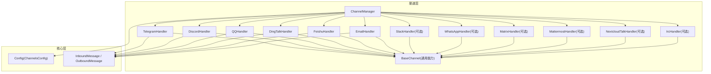
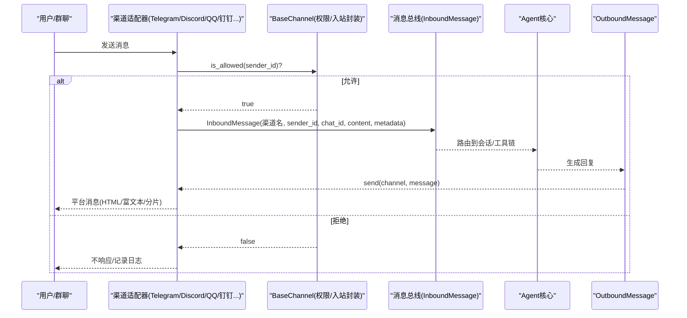
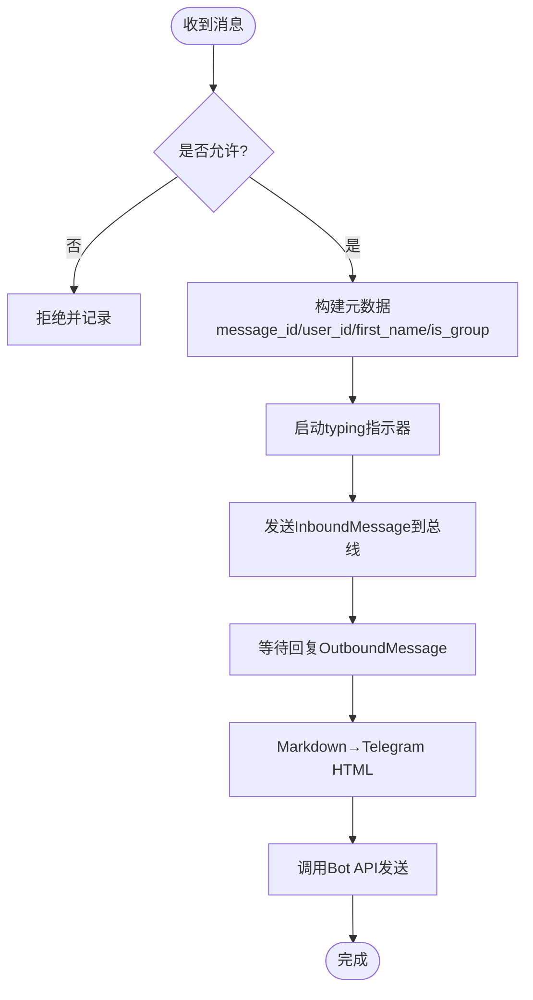
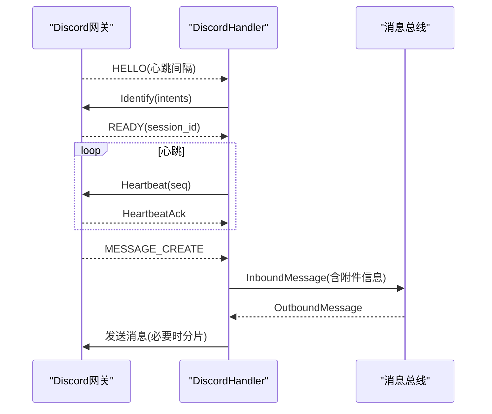
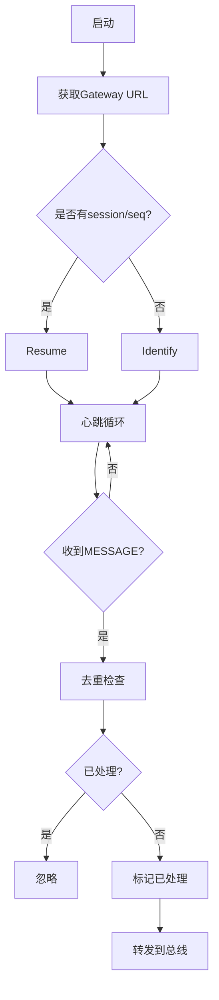
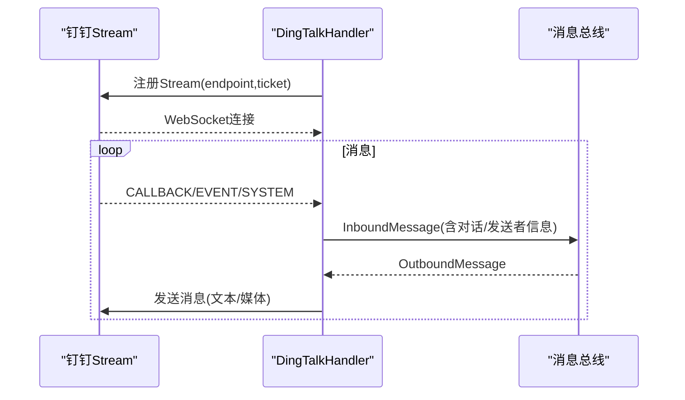
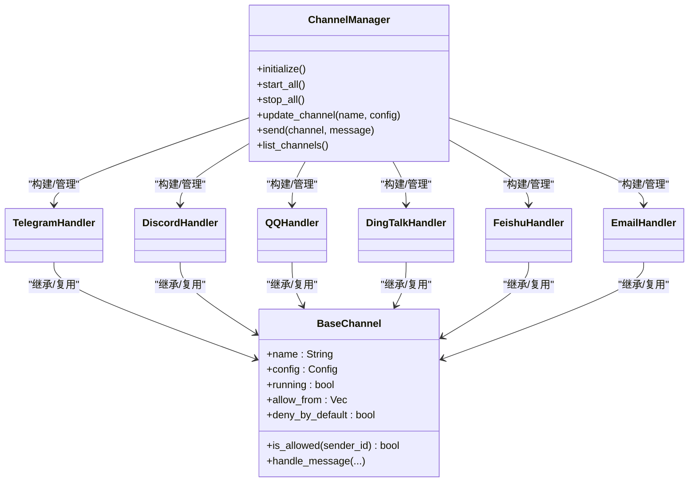

# 渠道配置

<cite>
**本文引用的文件**
- [lib.rs](file://agent-diva-channels/src/lib.rs)
- [manager.rs](file://agent-diva-channels/src/manager.rs)
- [base.rs](file://agent-diva-channels/src/base.rs)
- [telegram.rs](file://agent-diva-channels/src/telegram.rs)
- [discord.rs](file://agent-diva-channels/src/discord.rs)
- [dingtalk.rs](file://agent-diva-channels/src/dingtalk.rs)
- [qq.rs](file://agent-diva-channels/src/qq.rs)
- [schema.rs](file://agent-diva-core/src/config/schema.rs)
</cite>

## 目录
1. [简介](#简介)
2. [项目结构](#项目结构)
3. [核心组件](#核心组件)
4. [架构总览](#架构总览)
5. [详细组件分析](#详细组件分析)
6. [依赖关系分析](#依赖关系分析)
7. [性能与可靠性](#性能与可靠性)
8. [故障排查指南](#故障排查指南)
9. [结论](#结论)
10. [附录：多渠道同时运行示例与最佳实践](#附录：多渠道同时运行示例与最佳实践)

## 简介
本章节面向“渠道配置”主题，系统说明 agent-diva 的聊天渠道接入方式、配置结构与运行机制。重点覆盖以下能力：
- 支持的渠道类型：Telegram、Discord、QQ、钉钉（DingTalk）、飞书（Feishu）、邮件（Email），以及通过 feature 开关可选的 Slack、WhatsApp、Matrix、Mattermost、Nextcloud Talk、IRC 等。
- Bot Token 与群组设置：各渠道所需的鉴权字段、群组过滤、提及策略、白名单控制等。
- 消息格式转换：Markdown 到平台特定格式（如 Telegram HTML）或平台富文本结构的适配。
- 多渠道同时运行：ChannelManager 统一初始化、启动、停止与热更新。
- 生命周期管理与状态监控：通道启停、心跳、重连、会话恢复、运行态查询。
- 消息路由规则与权限控制：基于 allow_from 的访问控制、默认拒绝/允许策略、群组策略、提及触发等。

## 项目结构
渠道子系统位于 agent-diva-channels 包，提供统一的 ChannelHandler 抽象与 ChannelManager 管理器；具体渠道实现以独立模块存在；配置结构定义在 core 包的 schema.rs。

图表来源
- [manager.rs:30-56](file://agent-diva-channels/src/manager.rs#L30-L56)
- [base.rs:73-87](file://agent-diva-channels/src/base.rs#L73-L87)
- [schema.rs:605-642](file://agent-diva-core/src/config/schema.rs#L605-L642)

章节来源
- [lib.rs:1-53](file://agent-diva-channels/src/lib.rs#L1-L53)
- [manager.rs:1-800](file://agent-diva-channels/src/manager.rs#L1-L800)
- [schema.rs:605-642](file://agent-diva-core/src/config/schema.rs#L605-L642)

## 核心组件
- ChannelHandler 接口：定义 name、is_running、start、stop、send、set_inbound_sender、is_allowed 等统一能力。
- BaseChannel：提供通用的 allow_from 白名单匹配（支持通配符与复合 ID）、默认拒绝/允许策略、入站消息封装与发送。
- ChannelManager：负责按配置发现并构建各渠道 Handler，统一初始化、启动、停止、热更新与消息路由。
- 配置结构 ChannelsConfig：集中声明所有渠道的配置段，包括 enabled、token、allow_from、群组策略等。

章节来源
- [base.rs:9-32](file://agent-diva-channels/src/base.rs#L9-L32)
- [base.rs:73-229](file://agent-diva-channels/src/base.rs#L73-L229)
- [manager.rs:30-56](file://agent-diva-channels/src/manager.rs#L30-L56)
- [schema.rs:605-642](file://agent-diva-core/src/config/schema.rs#L605-L642)

## 架构总览
下图展示从外部消息进入渠道适配器，经权限校验后转入内部总线，再由上层处理并回写至渠道的完整流程。

图表来源
- [base.rs:121-229](file://agent-diva-channels/src/base.rs#L121-L229)
- [manager.rs:688-697](file://agent-diva-channels/src/manager.rs#L688-L697)

## 详细组件分析

### Telegram 渠道
- 配置要点
  - enabled、token、allow_from、proxy
  - 命令：/start、/reset、/help、/stop
- 接入方式
  - 使用 teloxide 建立 Bot，注册命令与消息处理器
  - 将 Markdown 转换为 Telegram HTML（代码块、链接、粗体、斜体、删除线、列表等）
  - 维护 typing 指示器任务，发送前清理
- 权限控制
  - 支持 allow_from 精确匹配与复合 ID（user_id|username）
- 消息路由
  - 入站消息携带 message_id、user_id、first_name、is_group 等元数据
- 生命周期
  - start 创建 Bot、设置命令、启动 Dispatcher；stop 中止 typing 任务与 Dispatcher

图表来源
- [telegram.rs:151-243](file://agent-diva-channels/src/telegram.rs#L151-L243)
- [telegram.rs:245-331](file://agent-diva-channels/src/telegram.rs#L245-L331)
- [telegram.rs:711-749](file://agent-diva-channels/src/telegram.rs#L711-L749)

章节来源
- [telegram.rs:18-34](file://agent-diva-channels/src/telegram.rs#L18-L34)
- [telegram.rs:108-127](file://agent-diva-channels/src/telegram.rs#L108-L127)
- [telegram.rs:415-682](file://agent-diva-channels/src/telegram.rs#L415-L682)
- [schema.rs:644-655](file://agent-diva-core/src/config/schema.rs#L644-L655)

### Discord 渠道
- 配置要点
  - enabled、token、allow_from、gateway_url、intents、guild_id、mention_only、listen_to_bots、group_reply_allowed_sender_ids
- 接入方式
  - 通过 Gateway WebSocket 接收消息，REST API 发送消息
  - 自动获取 gateway URL，心跳保活，会话恢复（session_id + seq）
  - 长消息分片（≤2000字符）
- 权限控制
  - 支持 allow_from；群组中可配置 mention_only 与 group_reply_allowed_sender_ids
- 消息路由
  - 入站消息携带 message_id、username、guild_id、reply_to 等元数据
  - 附件下载并转为文本描述
- 生命周期
  - run_gateway 循环连接、识别、心跳、重连；stop 发送关闭信号

图表来源
- [discord.rs:29-75](file://agent-diva-channels/src/discord.rs#L29-L75)
- [discord.rs:497-696](file://agent-diva-channels/src/discord.rs#L497-L696)
- [discord.rs:698-748](file://agent-diva-channels/src/discord.rs#L698-L748)

章节来源
- [discord.rs:113-135](file://agent-diva-channels/src/discord.rs#L113-L135)
- [discord.rs:296-318](file://agent-diva-channels/src/discord.rs#L296-L318)
- [discord.rs:335-442](file://agent-diva-channels/src/discord.rs#L335-L442)
- [schema.rs:657-706](file://agent-diva-core/src/config/schema.rs#L657-L706)

### QQ 渠道
- 配置要点
  - app_id、secret、allow_from
- 接入方式
  - 基于 botpy SDK 的 WebSocket 网关，自动刷新 access_token
  - 心跳机制与 ACK 超时容忍，Invalid Session 退避与冷却
  - 消息去重（最近1000条ID缓存）
- 权限控制
  - 基于 allow_from 的访问控制
- 消息路由
  - 入站消息携带消息ID、时间戳、作者信息等元数据
- 生命周期
  - run_websocket_once 处理识别/恢复、心跳、事件分发；外层循环管理重连与冷却

图表来源
- [qq.rs:50-133](file://agent-diva-channels/src/qq.rs#L50-L133)
- [qq.rs:301-366](file://agent-diva-channels/src/qq.rs#L301-L366)
- [qq.rs:429-750](file://agent-diva-channels/src/qq.rs#L429-L750)

章节来源
- [qq.rs:231-265](file://agent-diva-channels/src/qq.rs#L231-L265)
- [qq.rs:271-284](file://agent-diva-channels/src/qq.rs#L271-L284)
- [qq.rs:752-800](file://agent-diva-channels/src/qq.rs#L752-L800)

### 钉钉（DingTalk）渠道
- 配置要点
  - enabled、client_id、client_secret、robot_code、dm_policy、group_policy、allow_from
- 接入方式
  - Stream Mode WebSocket（无需公网IP），HTTP 发送消息
  - 获取 access_token 并缓存，注册 Stream 连接，订阅回调与事件
  - 媒体上传（图片/语音/视频/文件）或直接图片URL发送
- 权限控制
  - dm_policy/group_policy 支持 open/allowlist/pairing 等策略
  - 结合 allow_from 进行细粒度白名单匹配
- 消息路由
  - 入站消息携带 sender_name、conversation_id、conversation_type、message_id 等元数据
- 生命周期
  - register_stream_connection → run_websocket → 自动重连；stop 发送关闭信号

图表来源
- [dingtalk.rs:36-121](file://agent-diva-channels/src/dingtalk.rs#L36-L121)
- [dingtalk.rs:224-323](file://agent-diva-channels/src/dingtalk.rs#L224-L323)
- [dingtalk.rs:389-516](file://agent-diva-channels/src/dingtalk.rs#L389-L516)
- [dingtalk.rs:529-667](file://agent-diva-channels/src/dingtalk.rs#L529-L667)

章节来源
- [dingtalk.rs:154-187](file://agent-diva-channels/src/dingtalk.rs#L154-L187)
- [dingtalk.rs:669-777](file://agent-diva-channels/src/dingtalk.rs#L669-L777)
- [schema.rs:753-788](file://agent-diva-core/src/config/schema.rs#L753-L788)

### 飞书（Feishu）渠道
- 配置要点
  - enabled、app_id、app_secret、encrypt_key、verification_token、allow_from、port
- 接入方式
  - 支持 Webhook/WebSocket 模式（port 用于 Webhook 模式）
- 权限控制
  - 基于 allow_from 的访问控制
- 消息路由
  - 入站消息携带平台相关元数据（由具体实现决定）
- 生命周期
  - 由 ChannelManager 统一初始化与启动

章节来源
- [schema.rs:733-751](file://agent-diva-core/src/config/schema.rs#L733-L751)
- [manager.rs:420-438](file://agent-diva-channels/src/manager.rs#L420-L438)

### 邮件（Email）渠道
- 配置要点
  - enabled、consent_granted、imap_host/port、smtp_host/port、from_address、用户名/密码等
- 接入方式
  - IMAP 拉取收件箱，SMTP 发送邮件
- 权限控制
  - 基于 allow_from 的访问控制
- 消息路由
  - 入站消息携带发件人、主题、正文等元数据
- 生命周期
  - 由 ChannelManager 统一初始化与启动

章节来源
- [schema.rs:790-840](file://agent-diva-core/src/config/schema.rs#L790-L840)
- [manager.rs:481-499](file://agent-diva-channels/src/manager.rs#L481-L499)

### 可选渠道（需启用 feature）
- Slack、WhatsApp、Matrix、Mattermost、Nextcloud Talk、IRC
- 这些渠道默认不编译，可通过 Cargo feature 开关启用；其配置字段与验证逻辑在 manager.rs 中体现。

章节来源
- [lib.rs:15-30](file://agent-diva-channels/src/lib.rs#L15-L30)
- [manager.rs:104-159](file://agent-diva-channels/src/manager.rs#L104-L159)

## 依赖关系分析
- ChannelManager 依赖 Config 中的 ChannelsConfig 来决定启用哪些渠道，并通过 build_updated_handler 动态构造对应 Handler。
- 各 Handler 依赖 BaseChannel 提供的权限与入站消息封装能力。
- 配置结构集中在 schema.rs，便于统一加载与校验。

图表来源
- [manager.rs:361-755](file://agent-diva-channels/src/manager.rs#L361-L755)
- [base.rs:73-229](file://agent-diva-channels/src/base.rs#L73-L229)

章节来源
- [manager.rs:361-755](file://agent-diva-channels/src/manager.rs#L361-L755)
- [base.rs:73-229](file://agent-diva-channels/src/base.rs#L73-L229)

## 性能与可靠性
- 心跳与重连
  - Discord：根据 HELLO 返回的心跳间隔定时发送心跳，支持会话恢复；断线指数退避重连。
  - QQ：心跳ACK超时容忍与 Invalid Session 冷却，避免风暴式重连。
  - 钉钉：Stream 模式自动重连，错误时短暂休眠后重试。
- 消息分片与限流
  - Discord：超过2000字符的消息自动分片；遇到 429 读取 retry-after 后延迟重试。
- 资源清理
  - Telegram/Discord：typing 指示器任务在发送前后正确启动与终止，避免泄漏。
- 去重
  - QQ/钉钉：本地缓存最近消息ID，防止重复处理。

[本节为通用指导，不直接分析具体文件]

## 故障排查指南
- 常见错误类型
  - NotConfigured：渠道未启用或缺少必填字段（如 token、client_id 等）。
  - InvalidConfig：配置项缺失或非法（如 QQ app_id/secret 为空）。
  - ConnectionFailed/ConnectionError：网络或网关连接失败。
  - ApiError：平台 API 返回错误（如 Discord 429）。
  - SendError/SendFailed：发送消息失败（如钉钉媒体上传失败）。
  - AccessDenied：sender_id 不在 allow_from 列表中。
- 定位建议
  - 查看 ChannelManager 初始化日志，确认各渠道是否成功注册与启动。
  - 检查渠道配置是否包含必填字段（manager.rs 中的 required_fields 校验）。
  - 关注心跳与重连日志，判断是否为网络抖动或令牌过期导致。
  - 对于权限问题，核对 allow_from 与 sender_id 匹配规则（支持通配符与复合ID）。

章节来源
- [base.rs:34-71](file://agent-diva-channels/src/base.rs#L34-L71)
- [manager.rs:59-163](file://agent-diva-channels/src/manager.rs#L59-L163)
- [dingtalk.rs:209-222](file://agent-diva-channels/src/dingtalk.rs#L209-L222)
- [discord.rs:698-748](file://agent-diva-channels/src/discord.rs#L698-L748)

## 结论
agent-diva 的渠道子系统通过统一的 ChannelHandler 抽象与 ChannelManager 管理，实现了多渠道并行接入、统一权限控制与健壮的生命周期管理。各渠道针对自身协议特性提供了完善的接入细节（如心跳、重连、分片、去重、富文本适配），并通过 allow_from 与策略配置实现灵活的消息路由与访问控制。

[本节为总结性内容，不直接分析具体文件]

## 附录：多渠道同时运行示例与最佳实践
- 同时启用多个渠道
  - 在 ChannelsConfig 中分别设置各渠道 enabled 为 true，并填写必填字段（如 token、client_id 等）。
  - ChannelManager.initialize 会依次初始化每个渠道；start_all 会并发启动所有已注册的 Handler。
- 热更新单个渠道
  - 使用 update_channel(name, new_config) 停止旧实例、重建新实例并启动，不影响其他渠道。
- 权限与策略建议
  - 生产环境建议开启 deny_by_default（BaseChannel::with_default_policy），仅将可信 sender_id 加入 allow_from。
  - 钉钉可使用 dm_policy/group_policy 控制私聊与群聊策略；Discord 可在群组中启用 mention_only，限制非提及消息。
- 消息格式与兼容性
  - Telegram 使用 HTML 格式，注意 Markdown 转义与代码块保护。
  - Discord 长消息分片，注意保留语义边界（优先按行或空格切分）。
  - 钉钉媒体上传支持图片URL直发与文件上传两种路径，优先选择 URL 直发以减少带宽。

章节来源
- [manager.rs:377-642](file://agent-diva-channels/src/manager.rs#L377-L642)
- [manager.rs:699-735](file://agent-diva-channels/src/manager.rs#L699-L735)
- [base.rs:95-114](file://agent-diva-channels/src/base.rs#L95-L114)
- [dingtalk.rs:325-346](file://agent-diva-channels/src/dingtalk.rs#L325-L346)
- [discord.rs:240-278](file://agent-diva-channels/src/discord.rs#L240-L278)
- [telegram.rs:151-243](file://agent-diva-channels/src/telegram.rs#L151-L243)