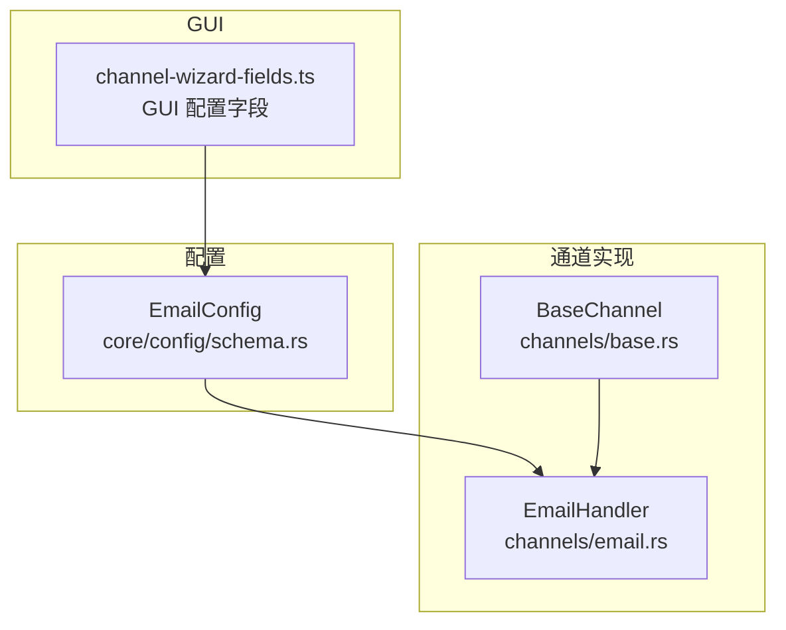
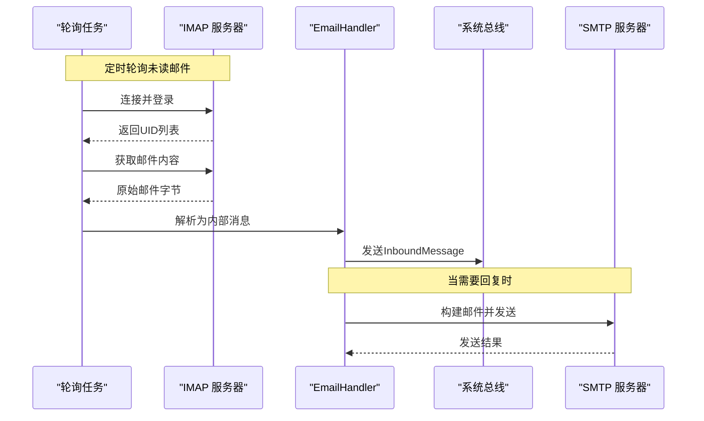
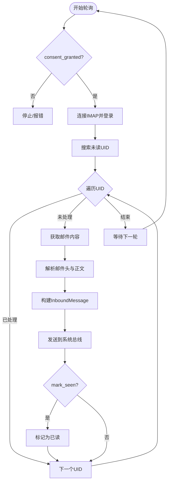
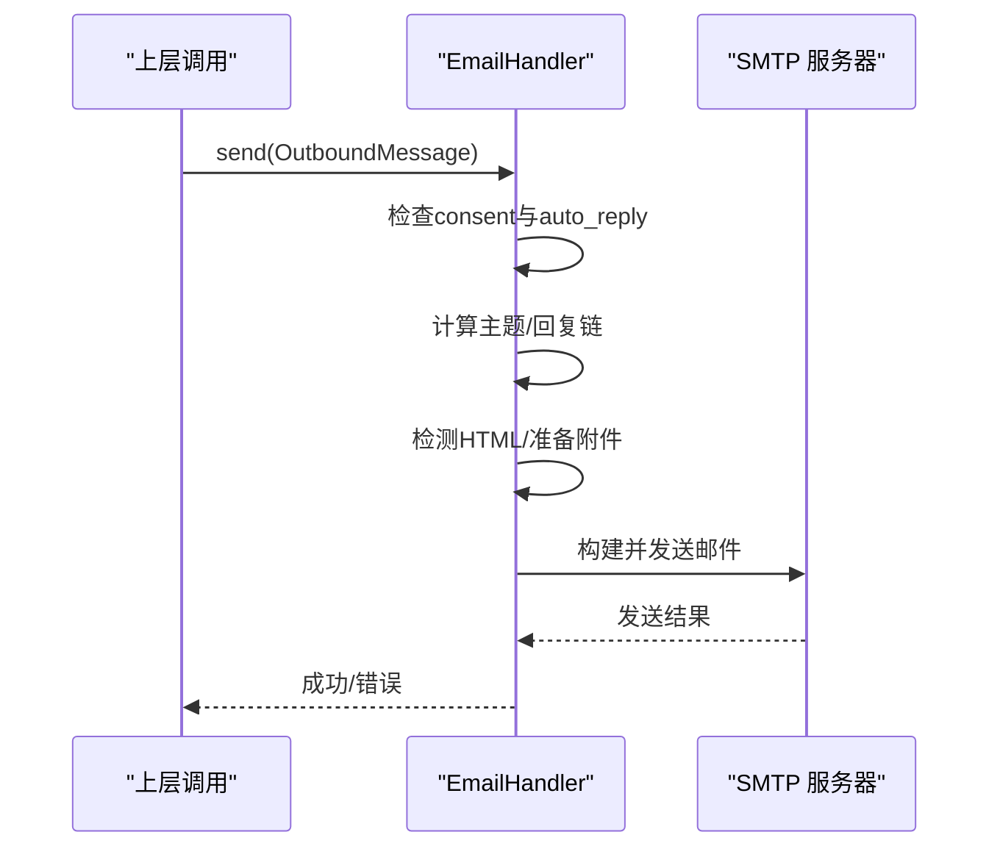
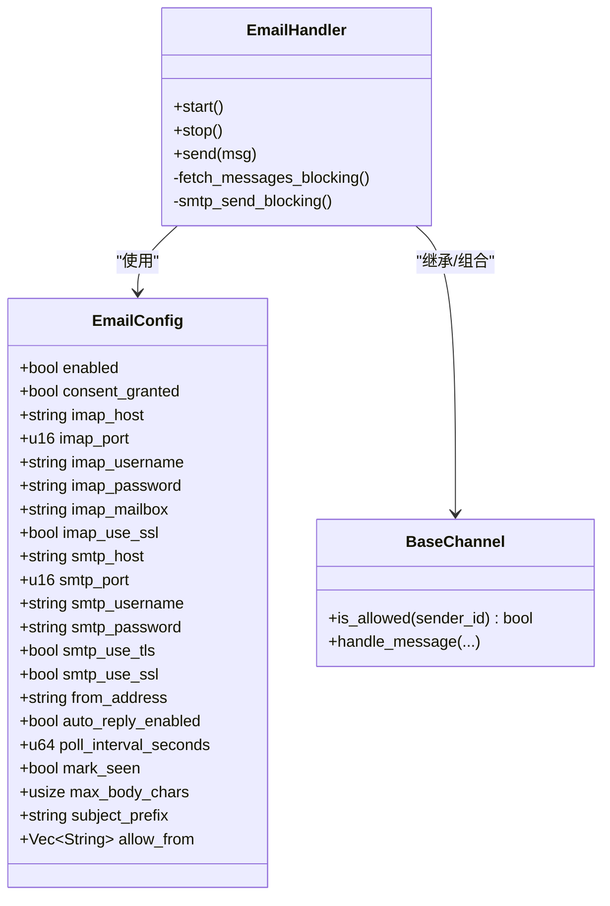

# 邮件渠道配置

<cite>
**本文引用的文件**
- [agent-diva-channels/src/email.rs](file://agent-diva-channels/src/email.rs)
- [agent-diva-core/src/config/schema.rs](file://agent-diva-core/src/config/schema.rs)
- [agent-diva-channels/src/base.rs](file://agent-diva-channels/src/base.rs)
- [agent-diva-channels/src/lib.rs](file://agent-diva-channels/src/lib.rs)
- [agent-diva-gui/src/components/settings/channel-wizard-fields.ts](file://agent-diva-gui/src/components/settings/channel-wizard-fields.ts)
</cite>

## 目录
1. [简介](#简介)
2. [项目结构](#项目结构)
3. [核心组件](#核心组件)
4. [架构总览](#架构总览)
5. [详细组件分析](#详细组件分析)
6. [依赖关系分析](#依赖关系分析)
7. [性能考量](#性能考量)
8. [故障排查指南](#故障排查指南)
9. [结论](#结论)
10. [附录：主流邮箱服务商配置要点](#附录：主流邮箱服务商配置要点)

## 简介
本文件面向 Agent Diva 的“邮件渠道”配置与使用，覆盖 IMAP/SMTP 服务器配置、关键配置项说明、安全连接设置、邮件格式解析与回复处理，以及与 Agent Diva 系统的集成方式。文档严格基于仓库源码进行分析与总结，不引入未实现的能力。

## 项目结构
邮件渠道由以下模块协作完成：
- 配置定义：在 core 层提供 EmailConfig 结构体及默认值。
- 通道实现：channels 层实现 EmailHandler，负责 IMAP 轮询收件、SMTP 发送、消息入队等。
- 基础能力：BaseChannel 提供通用权限控制、错误类型、入站消息发送等。
- GUI 配置向导：前端字段定义与后端配置键一一对应，便于可视化配置。

图表来源
- [agent-diva-core/src/config/schema.rs:790-888](file://agent-diva-core/src/config/schema.rs#L790-L888)
- [agent-diva-channels/src/email.rs:31-58](file://agent-diva-channels/src/email.rs#L31-L58)
- [agent-diva-channels/src/base.rs:73-114](file://agent-diva-channels/src/base.rs#L73-L114)
- [agent-diva-gui/src/components/settings/channel-wizard-fields.ts:213-353](file://agent-diva-gui/src/components/settings/channel-wizard-fields.ts#L213-L353)

章节来源
- [agent-diva-core/src/config/schema.rs:790-888](file://agent-diva-core/src/config/schema.rs#L790-L888)
- [agent-diva-channels/src/email.rs:31-58](file://agent-diva-channels/src/email.rs#L31-L58)
- [agent-diva-channels/src/base.rs:73-114](file://agent-diva-channels/src/base.rs#L73-L114)
- [agent-diva-gui/src/components/settings/channel-wizard-fields.ts:213-353](file://agent-diva-gui/src/components/settings/channel-wizard-fields.ts#L213-L353)

## 核心组件
- EmailConfig：集中定义 IMAP/SMTP 主机、端口、用户名、密码、SSL/TLS 开关、发件人地址、自动回复、轮询间隔、已读标记、正文长度限制、主题前缀、白名单等。
- EmailHandler：实现 IMAP 轮询收件、邮件解析、入站消息投递；实现 SMTP 发送、附件下载、HTML/纯文本构建、回复线程保持。
- BaseChannel：统一错误类型、允许发件人策略、入站消息发送封装。
- GUI 字段：将上述配置项以表单形式暴露给使用者。

章节来源
- [agent-diva-core/src/config/schema.rs:790-888](file://agent-diva-core/src/config/schema.rs#L790-L888)
- [agent-diva-channels/src/email.rs:31-58](file://agent-diva-channels/src/email.rs#L31-L58)
- [agent-diva-channels/src/base.rs:34-71](file://agent-diva-channels/src/base.rs#L34-L71)
- [agent-diva-gui/src/components/settings/channel-wizard-fields.ts:213-353](file://agent-diva-gui/src/components/settings/channel-wizard-fields.ts#L213-L353)

## 架构总览
邮件渠道采用“IMAP 轮询 + SMTP 发送”的模式：
- 接收：后台任务周期性通过 IMAP 拉取未读邮件，解析后转换为 InboundMessage 并发送到系统总线。
- 发送：收到需要回复的消息后，根据历史主题与 Message-ID 构造回复，通过 SMTP 发送，支持 HTML/纯文本与附件。

图表来源
- [agent-diva-channels/src/email.rs:177-291](file://agent-diva-channels/src/email.rs#L177-L291)
- [agent-diva-channels/src/email.rs:307-410](file://agent-diva-channels/src/email.rs#L307-L410)
- [agent-diva-channels/src/email.rs:428-558](file://agent-diva-channels/src/email.rs#L428-L558)
- [agent-diva-channels/src/email.rs:573-689](file://agent-diva-channels/src/email.rs#L573-L689)

## 详细组件分析

### 配置项详解（EmailConfig）
- IMAP 相关
  - imap_host：IMAP 服务器主机名
  - imap_port：IMAP 端口（默认 993）
  - imap_username / imap_password：IMAP 认证凭据
  - imap_mailbox：要监听的邮箱文件夹（默认 INBOX）
  - imap_use_ssl：是否启用 SSL 连接
- SMTP 相关
  - smtp_host：SMTP 服务器主机名
  - smtp_port：SMTP 端口（默认 587）
  - smtp_username / smtp_password：SMTP 认证凭据
  - smtp_use_tls：是否使用 STARTTLS
  - smtp_use_ssl：是否使用 SSL
  - from_address：发件人地址（为空时回退到 smtp_username 或 imap_username）
- 行为控制
  - enabled：是否启用邮件渠道
  - consent_granted：是否已获得访问授权（启动与发送均会检查）
  - auto_reply_enabled：是否允许自动回复
  - poll_interval_seconds：IMAP 轮询间隔（秒）
  - mark_seen：读取后是否标记为已读
  - max_body_chars：正文最大字符数（截断保护）
  - subject_prefix：回复主题前缀（默认 Re: ）
  - allow_from：允许的发件人白名单（空表示不限制）

章节来源
- [agent-diva-core/src/config/schema.rs:790-888](file://agent-diva-core/src/config/schema.rs#L790-L888)
- [agent-diva-gui/src/components/settings/channel-wizard-fields.ts:213-353](file://agent-diva-gui/src/components/settings/channel-wizard-fields.ts#L213-L353)

### 接收流程（IMAP 轮询与解析）
- 启动校验：检查 enabled 与 consent_granted，验证必填字段。
- 轮询任务：按间隔周期执行，使用阻塞式 IMAP 操作并通过 spawn_blocking 避免阻塞事件循环。
- 邮件解析：优先提取文本正文，若无可回退到 HTML 转文本，再失败则使用原始字节转字符串；同时记录 sender、subject、message_id、date、uid。
- 去重与标记：维护已处理 UID 集合，可选标记已读。
- 入站投递：组装 InboundMessage，携带 message_id、subject、date、uid 等元数据，发送至系统总线。

图表来源
- [agent-diva-channels/src/email.rs:60-91](file://agent-diva-channels/src/email.rs#L60-L91)
- [agent-diva-channels/src/email.rs:177-291](file://agent-diva-channels/src/email.rs#L177-L291)
- [agent-diva-channels/src/email.rs:428-558](file://agent-diva-channels/src/email.rs#L428-L558)

章节来源
- [agent-diva-channels/src/email.rs:60-91](file://agent-diva-channels/src/email.rs#L60-L91)
- [agent-diva-channels/src/email.rs:177-291](file://agent-diva-channels/src/email.rs#L177-L291)
- [agent-diva-channels/src/email.rs:428-558](file://agent-diva-channels/src/email.rs#L428-L558)

### 发送流程（SMTP 与回复处理）
- 权限与策略：检查 consent_granted；若为自动回复且 auto_reply_enabled=false，则跳过。
- 主题与回复链：从最近的主题与 Message-ID 生成回复主题，并在邮件头中设置 In-Reply-To 与 References 以保持线程。
- 内容格式：检测是否为 HTML；如为 HTML，构建多部分邮件（纯文本+HTML），否则发送纯文本。
- 附件：从 OutboundMessage.media 中的 URL 下载附件，推断文件名与 MIME 类型并附加。
- 传输：根据 smtp_use_tls/smtp_use_ssl 选择 STARTTLS 或 SSL 传输，使用 credentials 认证并发送。

图表来源
- [agent-diva-channels/src/email.rs:307-410](file://agent-diva-channels/src/email.rs#L307-L410)
- [agent-diva-channels/src/email.rs:573-689](file://agent-diva-channels/src/email.rs#L573-L689)

章节来源
- [agent-diva-channels/src/email.rs:307-410](file://agent-diva-channels/src/email.rs#L307-L410)
- [agent-diva-channels/src/email.rs:573-689](file://agent-diva-channels/src/email.rs#L573-L689)

### 权限与白名单
- BaseChannel 提供 is_allowed 逻辑：当 allow_from 为空时遵循 deny_by_default 策略；非空时使用通配符匹配（例如 *@domain）。
- EmailHandler 在入站时依据 allow_from 过滤发件人。

章节来源
- [agent-diva-channels/src/base.rs:121-184](file://agent-diva-channels/src/base.rs#L121-L184)
- [agent-diva-channels/src/email.rs:488-496](file://agent-diva-channels/src/email.rs#L488-L496)

### 与 Agent Diva 系统集成
- 入站：EmailHandler 将 IMAP 收到的邮件转换为 InboundMessage，包含 channel、sender_id、chat_id、content、metadata（message_id、subject、date、uid），通过 mpsc 发送到系统总线，供后续会话与工具链处理。
- 出站：上层通过 OutboundMessage 调用 EmailHandler.send，可携带 format=html、subject 覆盖、force_send 等元数据，以及 media 附件链接。
- 通道注册：EmailHandler 作为 channels 库的一部分对外导出，供管理器加载。

章节来源
- [agent-diva-channels/src/email.rs:512-537](file://agent-diva-channels/src/email.rs#L512-L537)
- [agent-diva-channels/src/email.rs:573-689](file://agent-diva-channels/src/email.rs#L573-L689)
- [agent-diva-channels/src/lib.rs:9-35](file://agent-diva-channels/src/lib.rs#L9-L35)

## 依赖关系分析
- EmailHandler 依赖：
  - agent_diva_core::bus 用于消息收发
  - agent_diva_core::config::schema::EmailConfig 用于配置
  - native_tls、imap、mail_parser、lettre、regex、reqwest 等外部库用于 IMAP/SMTP/邮件解析/网络请求
- BaseChannel 提供通用能力与错误类型
- GUI 字段与后端配置键保持一致，确保配置一致性

图表来源
- [agent-diva-core/src/config/schema.rs:790-888](file://agent-diva-core/src/config/schema.rs#L790-L888)
- [agent-diva-channels/src/email.rs:31-58](file://agent-diva-channels/src/email.rs#L31-L58)
- [agent-diva-channels/src/base.rs:73-114](file://agent-diva-channels/src/base.rs#L73-L114)

章节来源
- [agent-diva-core/src/config/schema.rs:790-888](file://agent-diva-core/src/config/schema.rs#L790-L888)
- [agent-diva-channels/src/email.rs:31-58](file://agent-diva-channels/src/email.rs#L31-L58)
- [agent-diva-channels/src/base.rs:73-114](file://agent-diva-channels/src/base.rs#L73-L114)

## 性能考量
- IMAP 轮询为阻塞操作，通过 tokio::task::spawn_blocking 运行，避免阻塞异步事件循环。
- 已处理 UID 集合有上限清理策略，防止内存增长。
- 正文长度限制（max_body_chars）避免超大邮件对上下文造成压力。
- 轮询间隔可调（poll_interval_seconds），需权衡延迟与服务器负载。

章节来源
- [agent-diva-channels/src/email.rs:177-291](file://agent-diva-channels/src/email.rs#L177-L291)
- [agent-diva-channels/src/email.rs:462-558](file://agent-diva-channels/src/email.rs#L462-L558)
- [agent-diva-core/src/config/schema.rs:828-833](file://agent-diva-core/src/config/schema.rs#L828-L833)

## 故障排查指南
- 启动失败
  - 未启用或未授予同意：检查 enabled 与 consent_granted。
  - 缺少必填字段：校验 imap_host、imap_username、imap_password、smtp_host、smtp_username、smtp_password。
- 连接与认证
  - IMAP/SMTP 连接错误：核对主机、端口、SSL/TLS 选项。
  - 认证失败：确认用户名与密码（或应用专用密码）。
- 发送问题
  - 自动回复被跳过：检查 auto_reply_enabled。
  - 附件下载失败：检查媒体 URL 可达性与 Content-Type。
- 日志与错误类型
  - 参考 ChannelError 的各类错误（连接、认证、发送等）定位问题。

章节来源
- [agent-diva-channels/src/email.rs:60-91](file://agent-diva-channels/src/email.rs#L60-L91)
- [agent-diva-channels/src/email.rs:428-458](file://agent-diva-channels/src/email.rs#L428-L458)
- [agent-diva-channels/src/email.rs:573-689](file://agent-diva-channels/src/email.rs#L573-L689)
- [agent-diva-channels/src/base.rs:34-71](file://agent-diva-channels/src/base.rs#L34-L71)

## 结论
Agent Diva 的邮件渠道通过 IMAP 轮询与 SMTP 发送实现了稳定的收发消息能力，具备完善的配置项与安全连接选项，支持 HTML/纯文本与附件，并能维持邮件线程。配合 GUI 配置向导，用户可便捷地启用与调优邮件渠道。

## 附录：主流邮箱服务商配置要点
以下为常见邮箱服务的典型 IMAP/SMTP 参数与 TLS/SSL 建议。请结合各自官方文档进行最终确认。

- Gmail
  - IMAP：imap.gmail.com，端口 993，启用 SSL
  - SMTP：smtp.gmail.com，端口 587，启用 STARTTLS
  - 认证：建议使用应用专用密码
- Outlook（Microsoft 365 / Outlook.com）
  - IMAP：outlook.office365.com，端口 993，启用 SSL
  - SMTP：smtp.office365.com，端口 587，启用 STARTTLS
  - 认证：建议使用应用专用密码或现代认证
- QQ 邮箱
  - IMAP：imap.qq.com，端口 993，启用 SSL
  - SMTP：smtp.qq.com，端口 587，启用 STARTTLS
  - 认证：需开启 IMAP/SMTP 服务并使用授权码

注意：
- 若服务商要求不同端口或加密方式，请按官方文档调整 smtp_use_tls/smtp_use_ssl 与端口。
- 所有凭据（用户名、密码/授权码）应妥善保管，避免明文泄露。

[本节为概念性指导，不直接引用具体代码文件]