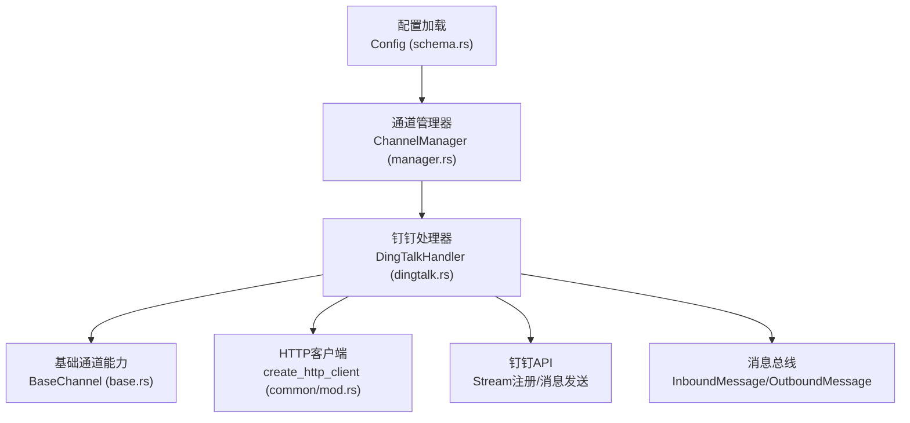
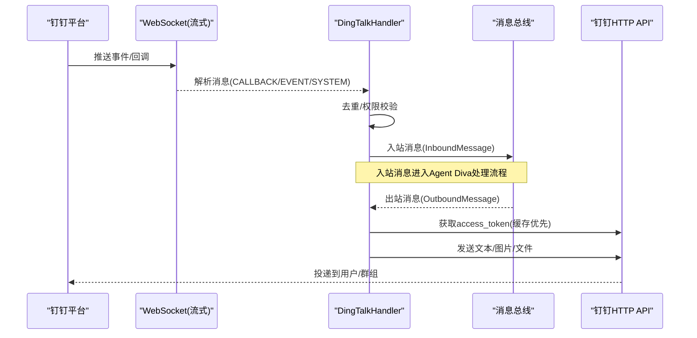
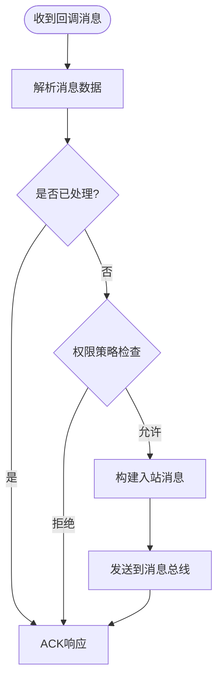
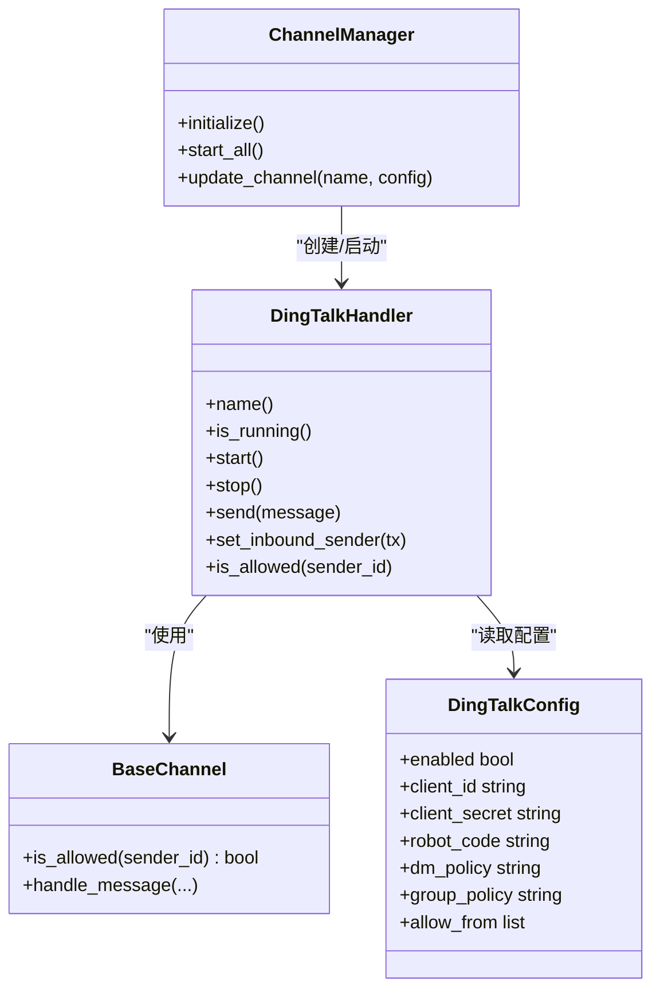

# 钉钉渠道配置

<cite>
**本文引用的文件**
- [dingtalk.rs](file://agent-diva-channels/src/dingtalk.rs)
- [base.rs](file://agent-diva-channels/src/base.rs)
- [manager.rs](file://agent-diva-channels/src/manager.rs)
- [schema.rs](file://agent-diva-core/src/config/schema.rs)
- [channel-wizard-fields.ts](file://agent-diva-gui/src/components/settings/channel-wizard-fields.ts)
</cite>

## 目录
1. [简介](#简介)
2. [项目结构](#项目结构)
3. [核心组件](#核心组件)
4. [架构总览](#架构总览)
5. [详细组件分析](#详细组件分析)
6. [依赖关系分析](#依赖关系分析)
7. [性能与可靠性](#性能与可靠性)
8. [故障排查指南](#故障排查指南)
9. [结论](#结论)
10. [附录：完整配置示例与集成要点](#附录完整配置示例与集成要点)

## 简介
本文件面向需要在 Agent Diva 中启用“钉钉”渠道的用户与运维人员，系统说明如何创建并配置钉钉企业内部应用与机器人、如何在 Agent Diva 中完成钉钉渠道配置（client_id、client_secret、工作空间策略等）、如何设置权限与工作组管理、消息类型与富媒体支持，以及与 Agent Diva 的集成方式与回调机制。

## 项目结构
Agent Diva 将“通道”抽象为统一的 ChannelHandler 接口，钉钉通道实现位于 channels 模块；配置模型定义在 core 的配置 schema 中；管理器负责按配置初始化并启动各通道。



图表来源
- [schema.rs:606-642](file://agent-diva-core/src/config/schema.rs#L606-L642)
- [manager.rs:459-479](file://agent-diva-channels/src/manager.rs#L459-L479)
- [dingtalk.rs:154-187](file://agent-diva-channels/src/dingtalk.rs#L154-L187)
- [base.rs:73-119](file://agent-diva-channels/src/base.rs#L73-L119)

章节来源
- [schema.rs:606-642](file://agent-diva-core/src/config/schema.rs#L606-L642)
- [manager.rs:459-479](file://agent-diva-channels/src/manager.rs#L459-L479)
- [dingtalk.rs:154-187](file://agent-diva-channels/src/dingtalk.rs#L154-L187)
- [base.rs:73-119](file://agent-diva-channels/src/base.rs#L73-L119)

## 核心组件
- DingTalkHandler：实现钉钉 Stream 模式接收消息、HTTP API 发送消息、媒体上传、访问令牌缓存、消息去重、白名单策略控制等。
- BaseChannel：提供通用能力（允许列表匹配、默认拒绝策略、入站消息转发）。
- ChannelManager：根据配置动态初始化、启动、停止通道，并统一路由消息。
- DingTalkConfig：钉钉通道的配置结构体，包含 enabled、client_id、client_secret、robot_code、dm_policy、group_policy、allow_from 等字段。

章节来源
- [dingtalk.rs:154-187](file://agent-diva-channels/src/dingtalk.rs#L154-L187)
- [base.rs:73-119](file://agent-diva-channels/src/base.rs#L73-L119)
- [manager.rs:459-479](file://agent-diva-channels/src/manager.rs#L459-L479)
- [schema.rs:753-788](file://agent-diva-core/src/config/schema.rs#L753-L788)

## 架构总览
钉钉通道采用“Stream 模式 + HTTP 发送”的组合：
- 接收：通过钉钉 Stream WebSocket 订阅事件与回调，解析消息后进入 Agent Diva 的消息总线。
- 发送：使用钉钉 HTTP API 发送文本与富媒体消息，自动选择私聊或群聊接口。
- 鉴权：通过 client_id/client_secret 获取 access_token，并进行本地缓存与过期处理。
- 安全：基于 dm_policy/group_policy 与 allow_from 进行访问控制。



图表来源
- [dingtalk.rs:274-323](file://agent-diva-channels/src/dingtalk.rs#L274-L323)
- [dingtalk.rs:605-667](file://agent-diva-channels/src/dingtalk.rs#L605-L667)
- [dingtalk.rs:831-858](file://agent-diva-channels/src/dingtalk.rs#L831-L858)

## 详细组件分析

### 钉钉通道处理器（DingTalkHandler）
- 生命周期
  - start：校验配置、注册 Stream 连接、建立 WebSocket 长连接、循环处理消息。
  - stop：发送关闭信号，优雅退出。
- 认证与令牌
  - get_access_token：调用钉钉 OAuth2 接口获取 access_token，本地缓存并在过期前一段时间刷新。
- 消息接收
  - register_stream_connection：向钉钉注册 Stream 连接，订阅 EVENT 和 /v1.0/im/bot/messages/get 回调。
  - handle_websocket_message：解析消息类型，CALLBACK 时进一步处理机器人消息。
  - handle_bot_message：提取内容、发件人信息、会话类型，执行权限策略，构造 InboundMessage 发送到消息总线。
- 消息发送
  - send：先发送媒体附件（如有），再发送 Markdown 文本。
  - send_raw：根据 chat_id 前缀判断私聊或群聊，调用对应接口发送。
  - send_media_ref：识别媒体类型，支持直接图片 URL 或上传本地/远程文件至钉钉，返回 media_id 后发送。
- 去重与健壮性
  - processed_ids：维护最近处理的消息 ID 队列，避免重复处理。
  - 自动重连：WebSocket 断开后等待 5 秒重试。



图表来源
- [dingtalk.rs:605-667](file://agent-diva-channels/src/dingtalk.rs#L605-L667)
- [dingtalk.rs:669-777](file://agent-diva-channels/src/dingtalk.rs#L669-L777)

章节来源
- [dingtalk.rs:224-272](file://agent-diva-channels/src/dingtalk.rs#L224-L272)
- [dingtalk.rs:274-323](file://agent-diva-channels/src/dingtalk.rs#L274-L323)
- [dingtalk.rs:389-443](file://agent-diva-channels/src/dingtalk.rs#L389-L443)
- [dingtalk.rs:445-516](file://agent-diva-channels/src/dingtalk.rs#L445-L516)
- [dingtalk.rs:518-603](file://agent-diva-channels/src/dingtalk.rs#L518-L603)
- [dingtalk.rs:605-667](file://agent-diva-channels/src/dingtalk.rs#L605-L667)
- [dingtalk.rs:669-777](file://agent-diva-channels/src/dingtalk.rs#L669-L777)
- [dingtalk.rs:831-858](file://agent-diva-channels/src/dingtalk.rs#L831-L858)

### 基础通道能力（BaseChannel）
- 允许列表匹配：支持精确匹配与通配符匹配（如 *@domain），以及复合 ID 拆分匹配。
- 默认策略：当 allow_from 为空时，可配置 deny_by_default 决定默认行为（钉钉通道默认不拒绝）。
- 入站消息封装：统一封装 InboundMessage，附加媒体与元数据。

章节来源
- [base.rs:73-119](file://agent-diva-channels/src/base.rs#L73-L119)
- [base.rs:121-184](file://agent-diva-channels/src/base.rs#L121-L184)
- [base.rs:186-229](file://agent-diva-channels/src/base.rs#L186-L229)

### 通道管理器（ChannelManager）
- 配置验证：对每个通道检查 enabled 与必填字段（钉钉要求 client_id、client_secret）。
- 初始化与启动：按配置创建并启动 DingTalkHandler，注入 inbound_tx。
- 运行时更新：支持热更新通道配置，停止旧实例并启动新实例。

章节来源
- [manager.rs:58-163](file://agent-diva-channels/src/manager.rs#L58-L163)
- [manager.rs:459-479](file://agent-diva-channels/src/manager.rs#L459-L479)
- [manager.rs:699-735](file://agent-diva-channels/src/manager.rs#L699-L735)

## 依赖关系分析
- DingTalkHandler 依赖：
  - BaseChannel：权限与入站消息转发。
  - HTTP 客户端：用于 Token 获取、媒体上传、消息发送。
  - 消息总线：InboundMessage/OutboundMessage。
- ChannelManager 依赖：
  - 各通道 Handler（包括 DingTalkHandler）。
  - 配置 schema（ChannelsConfig.DingTalkConfig）。



图表来源
- [dingtalk.rs:154-187](file://agent-diva-channels/src/dingtalk.rs#L154-L187)
- [base.rs:73-119](file://agent-diva-channels/src/base.rs#L73-L119)
- [manager.rs:459-479](file://agent-diva-channels/src/manager.rs#L459-L479)
- [schema.rs:753-788](file://agent-diva-core/src/config/schema.rs#L753-L788)

章节来源
- [dingtalk.rs:154-187](file://agent-diva-channels/src/dingtalk.rs#L154-L187)
- [base.rs:73-119](file://agent-diva-channels/src/base.rs#L73-L119)
- [manager.rs:459-479](file://agent-diva-channels/src/manager.rs#L459-L479)
- [schema.rs:753-788](file://agent-diva-core/src/config/schema.rs#L753-L788)

## 性能与可靠性
- 令牌缓存：access_token 本地缓存，提前 60 秒过期以避免边界问题。
- 媒体处理：图片可直接使用 URL 发送，减少上传开销；其他媒体类型自动下载并上传至钉钉。
- 消息去重：维护最近 1000 条消息 ID，防止重复处理。
- 连接恢复：WebSocket 断线自动重连，间隔 5 秒。
- 超时控制：HTTP 客户端默认 30 秒超时，降低阻塞风险。

章节来源
- [dingtalk.rs:224-272](file://agent-diva-channels/src/dingtalk.rs#L224-L272)
- [dingtalk.rs:445-516](file://agent-diva-channels/src/dingtalk.rs#L445-L516)
- [dingtalk.rs:518-603](file://agent-diva-channels/src/dingtalk.rs#L518-L603)
- [common/mod.rs:5-11](file://agent-diva-channels/src/common/mod.rs#L5-L11)

## 故障排查指南
- 配置缺失
  - 现象：通道未启动或跳过初始化。
  - 排查：确认 enabled 为 true，且 client_id、client_secret 已填写。
  - 参考：[manager.rs:85-91](file://agent-diva-channels/src/manager.rs#L85-L91)
- 鉴权失败
  - 现象：无法获取 access_token 或发送失败。
  - 排查：检查 client_id/client_secret 是否正确；查看网络连通性与钉钉 API 状态。
  - 参考：[dingtalk.rs:224-272](file://agent-diva-channels/src/dingtalk.rs#L224-L272)
- 权限被拒
  - 现象：私聊或群聊消息被忽略。
  - 排查：检查 dm_policy/group_policy 与 allow_from 列表；确保 sender_id 在白名单内。
  - 参考：[dingtalk.rs:729-751](file://agent-diva-channels/src/dingtalk.rs#L729-L751)
- 媒体发送失败
  - 现象：图片或文件未送达。
  - 排查：确认媒体路径有效或 URL 可达；检查钉钉媒体上传接口返回；注意图片 URL 直发与上传的区别。
  - 参考：[dingtalk.rs:348-387](file://agent-diva-channels/src/dingtalk.rs#L348-L387)
  - 参考：[dingtalk.rs:445-516](file://agent-diva-channels/src/dingtalk.rs#L445-L516)
- WebSocket 异常
  - 现象：消息接收中断。
  - 排查：查看日志中的连接错误；确认 Stream 注册成功；观察自动重连行为。
  - 参考：[dingtalk.rs:529-603](file://agent-diva-channels/src/dingtalk.rs#L529-L603)

章节来源
- [manager.rs:85-91](file://agent-diva-channels/src/manager.rs#L85-L91)
- [dingtalk.rs:224-272](file://agent-diva-channels/src/dingtalk.rs#L224-L272)
- [dingtalk.rs:729-751](file://agent-diva-channels/src/dingtalk.rs#L729-L751)
- [dingtalk.rs:348-387](file://agent-diva-channels/src/dingtalk.rs#L348-L387)
- [dingtalk.rs:445-516](file://agent-diva-channels/src/dingtalk.rs#L445-L516)
- [dingtalk.rs:529-603](file://agent-diva-channels/src/dingtalk.rs#L529-L603)

## 结论
Agent Diva 的钉钉渠道通过 Stream 模式实现低延迟、无需公网 IP 的消息接收，结合 HTTP API 完成文本与富媒体发送。配置简单清晰，具备完善的权限控制与健壮的重连机制。按照本文档完成企业应用与机器人配置后，即可在钉钉环境中稳定接入 Agent Diva 的智能对话能力。

## 附录：完整配置示例与集成要点

### 钉钉企业内部应用与机器人准备
- 在企业开放平台创建企业内部应用，启用“机器人”能力，记录 Client ID 与 Client Secret。
- 如需指定机器人标识，可在应用中获取 robot_code（可选）。
- 在应用权限管理中，按需开启消息收发、群组管理等权限。

### Agent Diva 配置项说明
- enabled：是否启用钉钉通道。
- client_id：钉钉应用 Client ID（必填）。
- client_secret：钉钉应用 Client Secret（必填）。
- robot_code：机器人代码（可选，留空则使用 client_id）。
- dm_policy：私聊策略，支持 open（开放）与 allowlist（白名单）。
- group_policy：群聊策略，支持 open（开放）与 allowlist（白名单）。
- allow_from：允许的用户 ID 列表（支持通配符与复合 ID）。

章节来源
- [schema.rs:753-788](file://agent-diva-core/src/config/schema.rs#L753-L788)
- [channel-wizard-fields.ts:160-196](file://agent-diva-gui/src/components/settings/channel-wizard-fields.ts#L160-L196)

### 工作空间与权限策略
- 私聊策略 dm_policy：
  - open：允许所有私聊。
  - allowlist：仅 allow_from 中的用户可触发。
- 群聊策略 group_policy：
  - open：允许所有群组。
  - allowlist：仅 allow_from 中包含的群组 ID 或发送者 ID 可触发。
- 建议生产环境使用 allowlist 策略，配合 allow_from 精确控制访问范围。

章节来源
- [dingtalk.rs:729-751](file://agent-diva-channels/src/dingtalk.rs#L729-L751)
- [base.rs:121-184](file://agent-diva-channels/src/base.rs#L121-L184)

### 消息类型支持与富媒体处理
- 文本消息：以 Markdown 形式发送，标题固定为“agent-diva reply”。
- 图片消息：
  - 若为 HTTP/HTTPS 图片 URL，直接发送 photoURL。
  - 否则下载并上传至钉钉，返回 media_id 后发送。
- 文件/音视频：
  - 根据扩展名推断类型（image/voice/video/file），上传后以 sampleFileMsg 发送。
- 支持私聊与群聊两种发送路径，依据 chat_id 前缀自动选择。

章节来源
- [dingtalk.rs:330-346](file://agent-diva-channels/src/dingtalk.rs#L330-L346)
- [dingtalk.rs:348-387](file://agent-diva-channels/src/dingtalk.rs#L348-L387)
- [dingtalk.rs:389-443](file://agent-diva-channels/src/dingtalk.rs#L389-L443)
- [dingtalk.rs:445-516](file://agent-diva-channels/src/dingtalk.rs#L445-L516)
- [dingtalk.rs:831-858](file://agent-diva-channels/src/dingtalk.rs#L831-L858)

### 与 Agent Diva 系统的集成与回调
- 回调订阅：
  - 订阅 EVENT 与 /v1.0/im/bot/messages/get 回调，用于接收用户消息。
  - 通过 Stream 注册获得 endpoint 与 ticket，建立 WebSocket 长连接。
- 消息流转：
  - 入站：解析回调消息，经权限策略后推送到消息总线。
  - 出站：从消息总线获取 OutboundMessage，发送文本与媒体。
- 运行态管理：
  - ChannelManager 根据配置初始化 DingTalkHandler，注入 inbound_tx，统一启停。

章节来源
- [dingtalk.rs:274-323](file://agent-diva-channels/src/dingtalk.rs#L274-L323)
- [dingtalk.rs:605-667](file://agent-diva-channels/src/dingtalk.rs#L605-L667)
- [manager.rs:459-479](file://agent-diva-channels/src/manager.rs#L459-L479)

### 完整配置示例（JSON 片段）
以下为钉钉通道在整体配置中的典型片段（仅展示 dingtalk 部分）：
- 启用通道并填写凭证
- 设置私聊与群聊策略为白名单
- 添加允许的用户或群组 ID

```json
{
  "channels": {
    "dingtalk": {
      "enabled": true,
      "client_id": "你的ClientID",
      "client_secret": "你的ClientSecret",
      "robot_code": "",
      "dm_policy": "allowlist",
      "group_policy": "allowlist",
      "allow_from": ["user123", "cidxxxxx"]
    }
  }
}
```

章节来源
- [schema.rs:753-788](file://agent-diva-core/src/config/schema.rs#L753-L788)
- [manager.rs:85-91](file://agent-diva-channels/src/manager.rs#L85-L91)