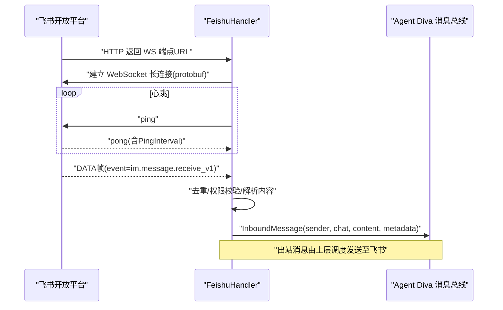
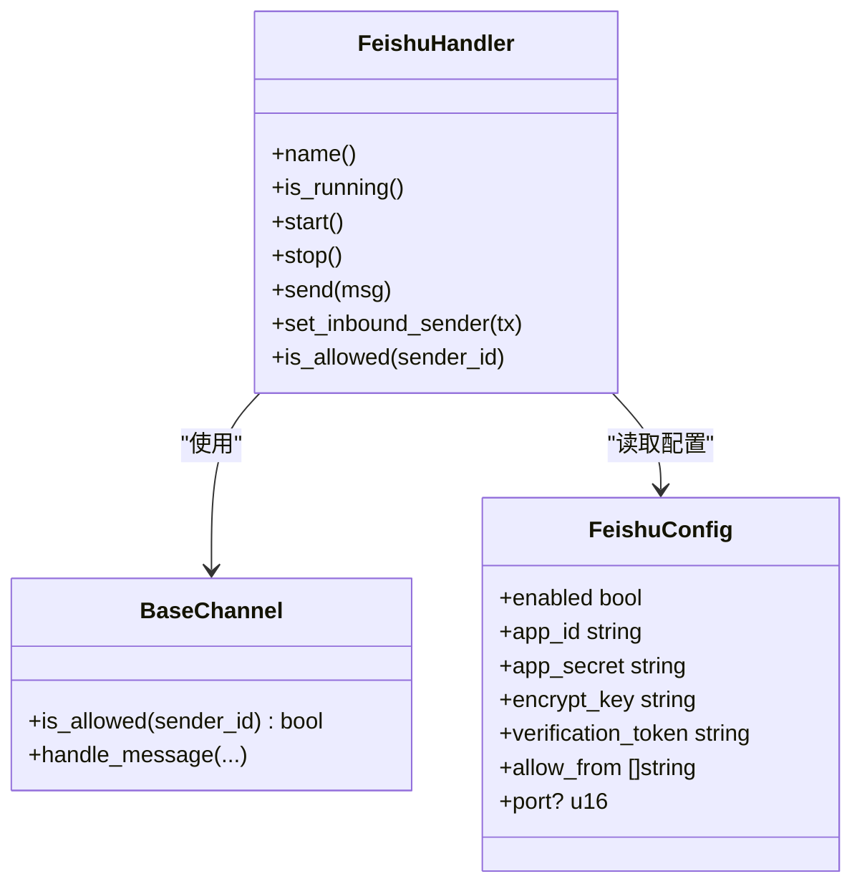

# 飞书渠道配置

<cite>
**本文引用的文件**
- [agent-diva-channels/src/feishu.rs](file://agent-diva-channels/src/feishu.rs)
- [agent-diva-core/src/config/schema.rs](file://agent-diva-core/src/config/schema.rs)
- [agent-diva-channels/src/base.rs](file://agent-diva-channels/src/base.rs)
- [agent-diva-channels/src/lib.rs](file://agent-diva-channels/src/lib.rs)
- [agent-diva-gui/src/components/settings/channel-platforms.ts](file://agent-diva-gui/src/components/settings/channel-platforms.ts)
</cite>

## 目录
1. [简介](#简介)
2. [项目结构](#项目结构)
3. [核心组件](#核心组件)
4. [架构总览](#架构总览)
5. [详细组件分析](#详细组件分析)
6. [依赖关系分析](#依赖关系分析)
7. [性能与可靠性](#性能与可靠性)
8. [故障排查指南](#故障排查指南)
9. [结论](#结论)
10. [附录：完整配置示例与最佳实践](#附录完整配置示例与最佳实践)

## 简介
本文件面向需要在 Agent Diva 中接入“飞书”渠道的用户与集成工程师，详细说明如何创建飞书企业自建应用、配置机器人能力与权限，并在 Agent Diva 中完成飞书渠道的配置（app_id、app_secret、allow_from 等）。文档还涵盖消息卡片与交互式消息支持、事件订阅与长连接机制、以及与 Agent Diva 系统的集成方式。

## 项目结构
Agent Diva 的飞书渠道实现位于 channels 层，核心逻辑在 feishu.rs；配置模型定义在 core 层的 schema.rs；基础通道能力（允许列表、错误类型、发送/接收抽象）在 base.rs；lib.rs 暴露各通道处理器；GUI 侧提供平台引导与字段说明。

```mermaid
graph TB
subgraph "通道层"
FEI["feishu.rs"]
BASE["base.rs"]
LIB["lib.rs"]
end
subgraph "核心配置"
SCHEMA["schema.rs"]
end
subgraph "GUI"
GUI["channel-platforms.ts"]
end
FEI --> BASE
FEI --> SCHEMA
LIB --> FEI
GUI --> SCHEMA
```

图表来源
- [agent-diva-channels/src/feishu.rs:1-50](file://agent-diva-channels/src/feishu.rs#L1-L50)
- [agent-diva-core/src/config/schema.rs:733-751](file://agent-diva-core/src/config/schema.rs#L733-L751)
- [agent-diva-channels/src/base.rs:1-32](file://agent-diva-channels/src/base.rs#L1-L32)
- [agent-diva-channels/src/lib.rs:9-17](file://agent-diva-channels/src/lib.rs#L9-L17)
- [agent-diva-gui/src/components/settings/channel-platforms.ts:70-86](file://agent-diva-gui/src/components/settings/channel-platforms.ts#L70-L86)

章节来源
- [agent-diva-channels/src/feishu.rs:1-50](file://agent-diva-channels/src/feishu.rs#L1-L50)
- [agent-diva-core/src/config/schema.rs:733-751](file://agent-diva-core/src/config/schema.rs#L733-L751)
- [agent-diva-channels/src/base.rs:1-32](file://agent-diva-channels/src/base.rs#L1-L32)
- [agent-diva-channels/src/lib.rs:9-17](file://agent-diva-channels/src/lib.rs#L9-L17)
- [agent-diva-gui/src/components/settings/channel-platforms.ts:70-86](file://agent-diva-gui/src/components/settings/channel-platforms.ts#L70-L86)

## 核心组件
- FeishuHandler：实现飞书通道的生命周期管理、WebSocket 长连接收发、鉴权、去重、消息解析与发送。
- BaseChannel：提供跨通道通用的允许列表策略、入站消息封装与发送。
- FeishuConfig：定义飞书渠道所需配置项（enabled、app_id、app_secret、encrypt_key、verification_token、allow_from、port）。
- GUI 平台信息：提供飞书渠道的快速引导步骤与必填字段提示。

章节来源
- [agent-diva-channels/src/feishu.rs:177-214](file://agent-diva-channels/src/feishu.rs#L177-L214)
- [agent-diva-core/src/config/schema.rs:733-751](file://agent-diva-core/src/config/schema.rs#L733-L751)
- [agent-diva-channels/src/base.rs:73-184](file://agent-diva-channels/src/base.rs#L73-L184)
- [agent-diva-gui/src/components/settings/channel-platforms.ts:70-86](file://agent-diva-gui/src/components/settings/channel-platforms.ts#L70-L86)

## 架构总览
飞书渠道采用“WebSocket 长连接 + HTTP API”的组合：
- 通过 HTTP 获取 tenant_access_token 并缓存，用于后续 API 调用。
- 通过 HTTP 获取 WebSocket 端点 URL，建立长连接，使用 protobuf 帧进行心跳与事件传输。
- 收到 im.message.receive_v1 事件后，解析消息内容、去重、权限校验，再转发到 Agent Diva 的消息总线。
- 出站消息统一以“交互式消息卡片”形式发送到飞书，自动将 Markdown 表格转换为飞书 table 元素。



图表来源
- [agent-diva-channels/src/feishu.rs:277-371](file://agent-diva-channels/src/feishu.rs#L277-L371)
- [agent-diva-channels/src/feishu.rs:373-591](file://agent-diva-channels/src/feishu.rs#L373-L591)
- [agent-diva-channels/src/feishu.rs:593-708](file://agent-diva-channels/src/feishu.rs#L593-L708)
- [agent-diva-channels/src/feishu.rs:977-1036](file://agent-diva-channels/src/feishu.rs#L977-L1036)

## 详细组件分析

### 配置项说明（FeishuConfig）
- enabled：是否启用飞书渠道。
- app_id：企业自建应用的 App ID。
- app_secret：企业自建应用的 App Secret。
- encrypt_key：可选，事件加密 Key（用于 Webhook 模式，当前默认走长连接）。
- verification_token：可选，验证 Token（用于 Webhook 模式，当前默认走长连接）。
- allow_from：允许访问的用户/会话白名单，支持通配匹配。
- port：可选，Webhook 模式端口（当前默认不使用）。

章节来源
- [agent-diva-core/src/config/schema.rs:733-751](file://agent-diva-core/src/config/schema.rs#L733-L751)
- [agent-diva-channels/src/base.rs:121-184](file://agent-diva-channels/src/base.rs#L121-L184)

### 鉴权与令牌缓存
- 启动时通过 HTTP 接口获取 tenant_access_token，并缓存至内存，过期前复用。
- 所有需要鉴权的 HTTP 请求均携带 Bearer token。

章节来源
- [agent-diva-channels/src/feishu.rs:277-334](file://agent-diva-channels/src/feishu.rs#L277-L334)

### WebSocket 长连接与事件处理
- 通过 HTTP 获取 WS 端点 URL，建立连接后按 protobuf 帧协议通信。
- 周期性 ping/pong 维持连接，超时自动重连。
- 仅处理 im.message.receive_v1 事件，忽略其他事件类型。
- 对 event_id 或 message_id 做去重，避免重复处理。
- 过滤机器人自身消息，仅处理用户消息。
- 根据 chat_type 决定 reply_to（群聊用 chat_id，私聊用 open_id）。
- 将解析后的消息封装为 InboundMessage 推送到消息总线。

章节来源
- [agent-diva-channels/src/feishu.rs:336-591](file://agent-diva-channels/src/feishu.rs#L336-L591)
- [agent-diva-channels/src/feishu.rs:593-708](file://agent-diva-channels/src/feishu.rs#L593-L708)

### 出站消息与卡片渲染
- 出站消息统一以“交互式消息卡片”发送，msg_type 为 interactive。
- 自动识别 receive_id_type：chat_id 以 oc_ 开头，否则为 open_id。
- 内容构建：
  - 普通文本：markdown 元素。
  - 表格：自动识别 Markdown 表格并转换为飞书 table 元素。
  - 图片：入站图片会下载并转为 data URI 标记，便于上层处理。
- 发送失败时记录状态码与错误信息。

章节来源
- [agent-diva-channels/src/feishu.rs:812-917](file://agent-diva-channels/src/feishu.rs#L812-L917)
- [agent-diva-channels/src/feishu.rs:977-1036](file://agent-diva-channels/src/feishu.rs#L977-L1036)
- [agent-diva-channels/src/feishu.rs:710-772](file://agent-diva-channels/src/feishu.rs#L710-L772)

### 权限与访问控制
- allow_from 支持精确匹配与通配符匹配（如 *@domain），可组合复合 ID（如 user|open_id）。
- 未配置 allow_from 时遵循默认策略（默认放行，可通过 BaseChannel 的 deny_by_default 调整）。

章节来源
- [agent-diva-channels/src/base.rs:121-184](file://agent-diva-channels/src/base.rs#L121-L184)

### 与 Agent Diva 系统集成
- 入站：FeishuHandler 将消息封装为 InboundMessage 并通过 mpsc 通道发送给消息总线。
- 出站：上层调度器调用 ChannelHandler::send，FeishuHandler 负责构造卡片并调用飞书 API 发送。
- GUI 侧提供飞书渠道快速引导步骤，帮助开发者完成应用创建与权限开通。

章节来源
- [agent-diva-channels/src/feishu.rs:684-708](file://agent-diva-channels/src/feishu.rs#L684-L708)
- [agent-diva-channels/src/feishu.rs:977-1036](file://agent-diva-channels/src/feishu.rs#L977-L1036)
- [agent-diva-gui/src/components/settings/channel-platforms.ts:70-86](file://agent-diva-gui/src/components/settings/channel-platforms.ts#L70-L86)

## 依赖关系分析
- FeishuHandler 依赖：
  - BaseChannel：通用通道能力（允许列表、入站消息封装）。
  - FeishuConfig：配置项读取。
  - reqwest/tokio_tungstenite：HTTP 与 WebSocket 通信。
  - prost：Protobuf 编解码。
  - tracing：日志记录。
- GUI 与配置：
  - channel-platforms.ts 提供飞书渠道的引导与字段说明。
  - schema.rs 定义 FeishuConfig 的结构与默认值。



图表来源
- [agent-diva-channels/src/feishu.rs:177-214](file://agent-diva-channels/src/feishu.rs#L177-L214)
- [agent-diva-core/src/config/schema.rs:733-751](file://agent-diva-core/src/config/schema.rs#L733-L751)
- [agent-diva-channels/src/base.rs:73-184](file://agent-diva-channels/src/base.rs#L73-L184)

章节来源
- [agent-diva-channels/src/feishu.rs:177-214](file://agent-diva-channels/src/feishu.rs#L177-L214)
- [agent-diva-core/src/config/schema.rs:733-751](file://agent-diva-core/src/config/schema.rs#L733-L751)
- [agent-diva-channels/src/base.rs:73-184](file://agent-diva-channels/src/base.rs#L73-L184)

## 性能与可靠性
- 令牌缓存：tenant_access_token 缓存并提前过期，减少频繁鉴权开销。
- 心跳与超时：固定间隔 ping，超过阈值自动重连，保障连接稳定性。
- 去重机制：基于 event_id/message_id 的去重缓存，TTL 与定期清理，防止重复处理。
- 分片重组：对大数据量事件进行分片重组，确保消息完整性。
- 图片处理：入站图片下载并转 data URI，避免网络延迟影响主流程。

章节来源
- [agent-diva-channels/src/feishu.rs:277-334](file://agent-diva-channels/src/feishu.rs#L277-L334)
- [agent-diva-channels/src/feishu.rs:373-591](file://agent-diva-channels/src/feishu.rs#L373-L591)
- [agent-diva-channels/src/feishu.rs:593-708](file://agent-diva-channels/src/feishu.rs#L593-L708)
- [agent-diva-channels/src/feishu.rs:710-772](file://agent-diva-channels/src/feishu.rs#L710-L772)

## 故障排查指南
- 无法获取 WS 端点：检查 app_id/app_secret 是否正确，网络可达性，以及飞书开放平台服务状态。
- 鉴权失败：确认 tenant_access_token 接口返回 code 为 0，且包含有效 token。
- 消息未到达：检查事件类型是否为 im.message.receive_v1，是否在 allow_from 白名单内，是否被去重。
- 发送失败：查看响应状态码与错误信息，确认 receive_id_type 与目标 ID 格式匹配。
- 图片无法显示：确认图片 key 正确、下载成功且 Content-Type 为 image/*。

章节来源
- [agent-diva-channels/src/feishu.rs:277-371](file://agent-diva-channels/src/feishu.rs#L277-L371)
- [agent-diva-channels/src/feishu.rs:593-708](file://agent-diva-channels/src/feishu.rs#L593-L708)
- [agent-diva-channels/src/feishu.rs:977-1036](file://agent-diva-channels/src/feishu.rs#L977-L1036)
- [agent-diva-channels/src/feishu.rs:710-772](file://agent-diva-channels/src/feishu.rs#L710-L772)

## 结论
Agent Diva 的飞书渠道通过 WebSocket 长连接与 HTTP API 结合的方式，实现了稳定可靠的消息收发。配置简单清晰，支持 Markdown 表格与交互式消息卡片，具备完善的鉴权、去重、权限控制与错误处理机制。配合 GUI 的快速引导，用户可以高效完成企业自建应用的创建与权限配置，顺利接入 Agent Diva 系统。

## 附录：完整配置示例与最佳实践

### 创建飞书企业自建应用与机器人
- 登录飞书开放平台，创建企业自建应用。
- 在“凭证与基础信息”获取 App ID 和 App Secret。
- 添加机器人能力，开通必要权限（如消息接收）。
- 选择“使用长连接接收事件”，并订阅 im.message.receive_v1。
- 发布应用并设置可见范围。

章节来源
- [agent-diva-gui/src/components/settings/channel-platforms.ts:70-86](file://agent-diva-gui/src/components/settings/channel-platforms.ts#L70-L86)

### 在 Agent Diva 中配置飞书渠道
- 在 channels.feishu 下填写：
  - enabled: true
  - app_id: 你的 App ID
  - app_secret: 你的 App Secret
  - allow_from: 允许的 open_id/chat_id 列表（可为空表示不限制）
  - encrypt_key/verification_token: 若使用 Webhook 模式则填写（当前默认长连接可不填）
  - port: 若使用 Webhook 模式则指定端口（当前默认不使用）
- 启动服务后，系统将自动获取 WS 端点并建立长连接。

章节来源
- [agent-diva-core/src/config/schema.rs:733-751](file://agent-diva-core/src/config/schema.rs#L733-L751)
- [agent-diva-channels/src/feishu.rs:930-964](file://agent-diva-channels/src/feishu.rs#L930-L964)

### 消息卡片与交互式消息
- 出站消息统一以 interactive 卡片发送，支持 Markdown 文本与表格。
- 表格会自动转换为飞书 table 元素，提升可读性。
- 图片入站时会下载并转为 data URI 标记，便于上层展示。

章节来源
- [agent-diva-channels/src/feishu.rs:812-917](file://agent-diva-channels/src/feishu.rs#L812-L917)
- [agent-diva-channels/src/feishu.rs:977-1036](file://agent-diva-channels/src/feishu.rs#L977-L1036)
- [agent-diva-channels/src/feishu.rs:710-772](file://agent-diva-channels/src/feishu.rs#L710-L772)

### 事件订阅与长连接
- 当前实现默认使用 WebSocket 长连接接收事件，无需公网 IP。
- 仅处理 im.message.receive_v1 事件，其他事件类型将被忽略。
- 心跳超时自动重连，保证连接稳定性。

章节来源
- [agent-diva-channels/src/feishu.rs:336-591](file://agent-diva-channels/src/feishu.rs#L336-L591)
- [agent-diva-channels/src/feishu.rs:593-708](file://agent-diva-channels/src/feishu.rs#L593-L708)

### 与 Agent Diva 系统集成
- 入站消息经 FeishuHandler 解析后，封装为 InboundMessage 推送到消息总线。
- 出站消息由上层调度器调用 send，FeishuHandler 负责构造卡片并发送。
- GUI 提供快速引导，帮助完成应用创建与权限配置。

章节来源
- [agent-diva-channels/src/feishu.rs:684-708](file://agent-diva-channels/src/feishu.rs#L684-L708)
- [agent-diva-channels/src/feishu.rs:977-1036](file://agent-diva-channels/src/feishu.rs#L977-L1036)
- [agent-diva-gui/src/components/settings/channel-platforms.ts:70-86](file://agent-diva-gui/src/components/settings/channel-platforms.ts#L70-L86)