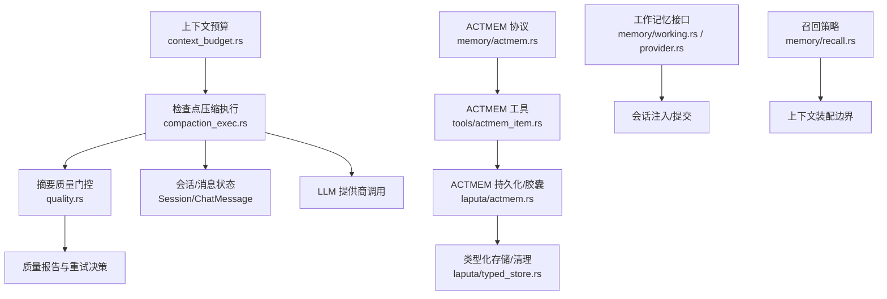
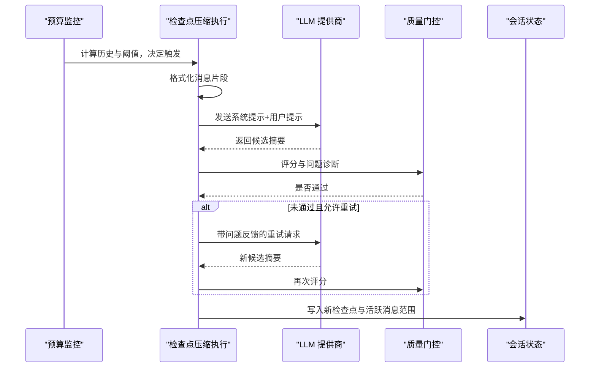
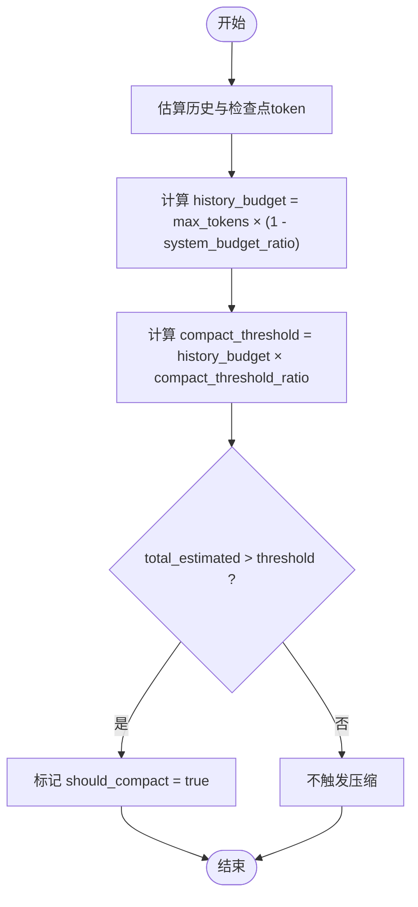
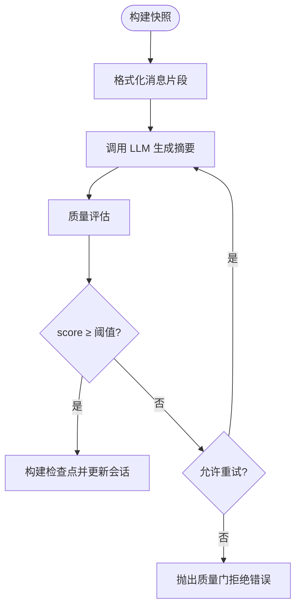
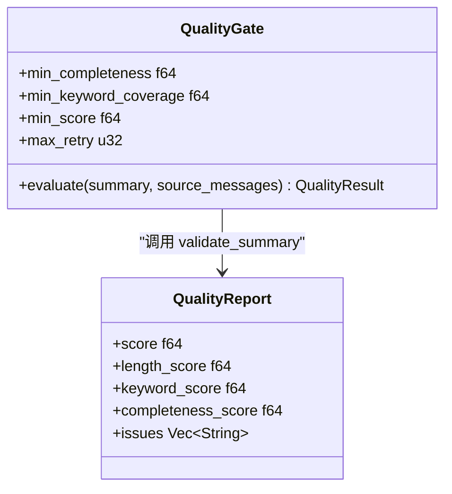
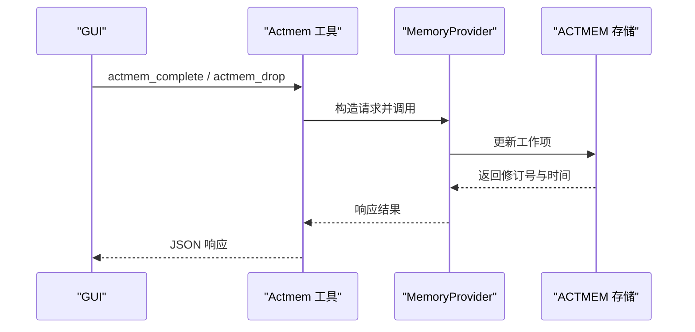
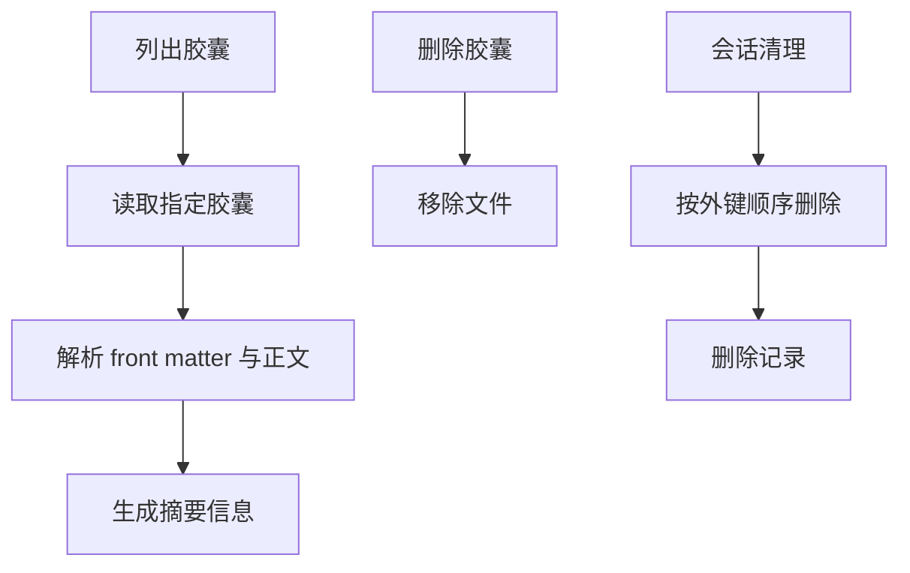
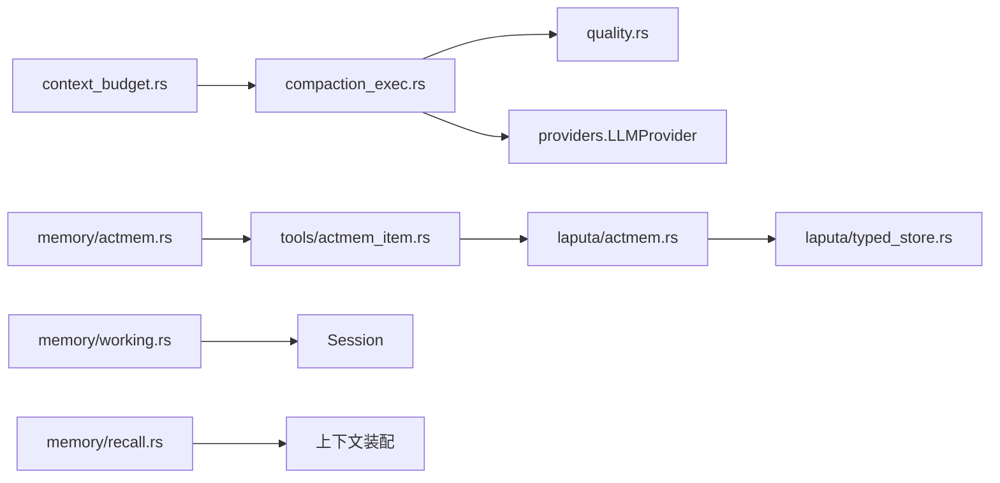

# 压缩策略配置

<cite>
**本文引用的文件**
- [agent-diva-agent/src/compaction/mod.rs](file://agent-diva-agent/src/compaction/mod.rs)
- [agent-diva-agent/src/compaction/compaction_exec.rs](file://agent-diva-agent/src/compaction/compaction_exec.rs)
- [agent-diva-agent/src/compaction/quality.rs](file://agent-diva-agent/src/compaction/quality.rs)
- [agent-diva-agent/src/context_budget.rs](file://agent-diva-agent/src/context_budget.rs)
- [agent-diva-core/src/memory/actmem.rs](file://agent-diva-core/src/memory/actmem.rs)
- [agent-diva-laputa/src/actmem.rs](file://agent-diva-laputa/src/actmem.rs)
- [agent-diva-core/src/config/schema.rs](file://agent-diva-core/src/config/schema.rs)
- [agent-diva-gui/src/components/settings/CompactionSettings.vue](file://agent-diva-gui/src/components/settings/CompactionSettings.vue)
- [agent-diva-gui/src/components/memory/MemoryView.vue](file://agent-diva-gui/src/components/memory/MemoryView.vue)
- [agent-diva-tools/src/actmem_item.rs](file://agent-diva-tools/src/actmem_item.rs)
- [agent-diva-core/src/memory/recall.rs](file://agent-diva-core/src/memory/recall.rs)
- [agent-diva-core/src/memory/crud.rs](file://agent-diva-core/src/memory/crud.rs)
- [agent-diva-core/src/memory/provider.rs](file://agent-diva-core/src/memory/provider.rs)
- [agent-diva-core/src/memory/working.rs](file://agent-diva-core/src/memory/working.rs)
- [agent-diva-core/src/memory/record.rs](file://agent-diva-core/src/memory/record.rs)
- [agent-diva-core/src/memory/mod.rs](file://agent-diva-core/src/memory/mod.rs)
- [agent-diva-laputa/src/typed_store.rs](file://agent-diva-laputa/src/typed_store.rs)
- [agent-diva-agent/src/consolidation/prompt.rs](file://agent-diva-agent/src/consolidation/prompt.rs)
</cite>

## 目录
1. [简介](#简介)
2. [项目结构](#项目结构)
3. [核心组件](#核心组件)
4. [架构总览](#架构总览)
5. [详细组件分析](#详细组件分析)
6. [依赖关系分析](#依赖关系分析)
7. [性能与容量特性](#性能与容量特性)
8. [故障排查指南](#故障排查指南)
9. [结论](#结论)
10. [附录：场景化配置示例](#附录：场景化配置示例)

## 简介
本文件面向“记忆压缩策略”的配置与使用，覆盖 ACTMEM 工作记忆的压缩算法、触发条件、质量评估、胶囊化与归档、历史归档与回滚能力，以及监控与性能影响。文档以仓库中实际实现为依据，给出可操作的参数说明、流程图和序列图，帮助在不同使用场景下正确配置压缩策略。

## 项目结构
与记忆压缩相关的代码主要分布在以下模块：
- 上下文预算与触发：`context_budget.rs`
- 检查点压缩执行：`compaction_exec.rs`
- 摘要质量评估：`quality.rs`
- 长期记忆巩固提示：`consolidation/prompt.rs`
- ACTMEM 协议与工具：`memory/actmem.rs`、`tools/actmem_item.rs`
- ACTMEM 持久化与胶囊：`laputa/actmem.rs`、`laputa/typed_store.rs`
- 会话与工作记忆接口：`memory/working.rs`、`memory/provider.rs`、`memory/crud.rs`、`memory/record.rs`、`memory/mod.rs`
- 召回策略（与压缩边界相关）：`memory/recall.rs`
- GUI 设置入口：`settings/CompactionSettings.vue`、`memory/MemoryView.vue`
- 配置模式定义：`config/schema.rs`

图表来源
- [agent-diva-agent/src/context_budget.rs:1-207](file://agent-diva-agent/src/context_budget.rs#L1-L207)
- [agent-diva-agent/src/compaction/compaction_exec.rs:1-304](file://agent-diva-agent/src/compaction/compaction_exec.rs#L1-L304)
- [agent-diva-agent/src/compaction/quality.rs:1-305](file://agent-diva-agent/src/compaction/quality.rs#L1-L305)
- [agent-diva-core/src/memory/actmem.rs:1-51](file://agent-diva-core/src/memory/actmem.rs#L1-L51)
- [agent-diva-tools/src/actmem_item.rs:1-90](file://agent-diva-tools/src/actmem_item.rs#L1-L90)
- [agent-diva-laputa/src/actmem.rs:308-371](file://agent-diva-laputa/src/actmem.rs#L308-L371)
- [agent-diva-laputa/src/typed_store.rs:643-1023](file://agent-diva-laputa/src/typed_store.rs#L643-L1023)
- [agent-diva-core/src/memory/working.rs:1-200](file://agent-diva-core/src/memory/working.rs#L1-L200)
- [agent-diva-core/src/memory/provider.rs:1-200](file://agent-diva-core/src/memory/provider.rs#L1-L200)
- [agent-diva-core/src/memory/recall.rs:1-45](file://agent-diva-core/src/memory/recall.rs#L1-L45)

章节来源
- [agent-diva-agent/src/context_budget.rs:1-207](file://agent-diva-agent/src/context_budget.rs#L1-L207)
- [agent-diva-agent/src/compaction/mod.rs:1-33](file://agent-diva-agent/src/compaction/mod.rs#L1-L33)

## 核心组件
- 上下文预算与触发
  - 通过 `BudgetConfig` 控制最大上下文、系统预留比例、压缩阈值比例与保留最近消息数。
  - 当历史估计超过阈值时触发压缩。
- 检查点压缩执行
  - 将消息片段格式化为紧凑输入，调用 LLM 生成检查点摘要，进行质量门控与重试，最终产出替换型检查点。
- 摘要质量评估
  - 从长度、关键词覆盖率、语义完整性三个维度评分，支持可配置的质量门控与重试次数。
- ACTMEM 工作记忆
  - 提供 Pulse/Recap/Work/Capsules 等读取目标与编辑工作项的协议；GUI 与工具层暴露读写能力。
- 胶囊化与历史归档
  - 将会话产物落盘为胶囊文件，支持列表、读取、删除；会话结束或容量超限时按策略清理。
- 工作记忆注入与提交
  - 通过工作记忆接口在会话中注入 checkpoint 与指针，支持最小指针原则与 L1 索引预算。

章节来源
- [agent-diva-agent/src/context_budget.rs:25-112](file://agent-diva-agent/src/context_budget.rs#L25-L112)
- [agent-diva-agent/src/compaction/compaction_exec.rs:20-304](file://agent-diva-agent/src/compaction/compaction_exec.rs#L20-L304)
- [agent-diva-agent/src/compaction/quality.rs:17-96](file://agent-diva-agent/src/compaction/quality.rs#L17-L96)
- [agent-diva-core/src/memory/actmem.rs:1-51](file://agent-diva-core/src/memory/actmem.rs#L1-L51)
- [agent-diva-laputa/src/actmem.rs:308-371](file://agent-diva-laputa/src/actmem.rs#L308-L371)
- [agent-diva-core/src/memory/working.rs:1-200](file://agent-diva-core/src/memory/working.rs#L1-L200)

## 架构总览
压缩流程由预算监控驱动，进入检查点压缩执行，再经质量门控决定是否接受或重试，最终产出新的检查点并更新会话活跃消息范围。ACTMEM 的工作记忆与胶囊作为长期/短期记忆载体，与压缩边界协同，确保上下文窗口稳定可控。

图表来源
- [agent-diva-agent/src/context_budget.rs:146-207](file://agent-diva-agent/src/context_budget.rs#L146-L207)
- [agent-diva-agent/src/compaction/compaction_exec.rs:94-247](file://agent-diva-agent/src/compaction/compaction_exec.rs#L94-L247)
- [agent-diva-agent/src/compaction/quality.rs:79-96](file://agent-diva-agent/src/compaction/quality.rs#L79-L96)

## 详细组件分析

### 上下文预算与触发
- 关键参数
  - `max_tokens`：完整上下文的 token 上限，默认 180,000，可通过模型能力表或环境变量覆盖。
  - `system_budget_ratio`：系统提示、技能与内存预留比例，默认 0.15。
  - `compact_threshold_ratio`：历史预算达到该比例时触发压缩，默认 0.80。
  - `keep_recent_count`：始终保留的最近消息数量，默认 10。
- 触发逻辑
  - 计算历史估计与检查点估计之和，若超过 `history_budget × compact_threshold_ratio`，则标记应压缩。
  - 压力比用于可视化与告警，便于调优。

图表来源
- [agent-diva-agent/src/context_budget.rs:168-207](file://agent-diva-agent/src/context_budget.rs#L168-L207)

章节来源
- [agent-diva-agent/src/context_budget.rs:25-112](file://agent-diva-agent/src/context_budget.rs#L25-L112)
- [agent-diva-agent/src/context_budget.rs:146-207](file://agent-diva-agent/src/context_budget.rs#L146-L207)
- [agent-diva-gui/src/components/settings/CompactionSettings.vue:78-107](file://agent-diva-gui/src/components/settings/CompactionSettings.vue#L78-L107)

### 检查点压缩执行
- 输入快照
  - 包含上一检查点、持久化消息、当前回合消息、非压缩底线索引。
- 安全边界选择
  - 折叠已完成工具组，避免截断不完整调用；保证活跃尾部起始于用户边界。
- 质量门控与重试
  - 首次失败后携带问题反馈重试，最多两次额外尝试；低于阈值则报错。
- 输出更新
  - 生成新的检查点，记录源范围、token 统计、质量分数与问题列表；更新活跃消息范围。

图表来源
- [agent-diva-agent/src/compaction/compaction_exec.rs:94-247](file://agent-diva-agent/src/compaction/compaction_exec.rs#L94-L247)
- [agent-diva-agent/src/compaction/compaction_exec.rs:249-430](file://agent-diva-agent/src/compaction/compaction_exec.rs#L249-L430)
- [agent-diva-agent/src/compaction/quality.rs:17-96](file://agent-diva-agent/src/compaction/quality.rs#L17-L96)

章节来源
- [agent-diva-agent/src/compaction/compaction_exec.rs:20-304](file://agent-diva-agent/src/compaction/compaction_exec.rs#L20-L304)
- [agent-diva-agent/src/compaction/compaction_exec.rs:306-430](file://agent-diva-agent/src/compaction/compaction_exec.rs#L306-L430)

### 摘要质量评估
- 评分维度
  - 长度：≥200字符满分，线性插值至50字符；空摘要得0分。
  - 关键词覆盖率：提取英文标识符、中文连续词、文件路径，过滤停用词；覆盖率≥30%加分。
  - 语义完整性：检测中英文句末标点与句子数量，鼓励多句表达。
- 质量门控
  - 可配置最小完整性、最小关键词覆盖率、综合分数阈值与最大重试次数。
  - 默认值适合多数场景，可按需求收紧或放宽。

图表来源
- [agent-diva-agent/src/compaction/quality.rs:17-96](file://agent-diva-agent/src/compaction/quality.rs#L17-L96)
- [agent-diva-agent/src/compaction/quality.rs:272-305](file://agent-diva-agent/src/compaction/quality.rs#L272-L305)

章节来源
- [agent-diva-agent/src/compaction/quality.rs:17-96](file://agent-diva-agent/src/compaction/quality.rs#L17-L96)
- [agent-diva-agent/src/compaction/quality.rs:176-266](file://agent-diva-agent/src/compaction/quality.rs#L176-L266)
- [agent-diva-agent/src/compaction/quality.rs:272-305](file://agent-diva-agent/src/compaction/quality.rs#L272-L305)

### ACTMEM 工作记忆与工具
- 协议与目标
  - 读取目标包括 Pulse、Recap、Work、Head、Capsules、Capsule；编辑工作项需指定节、索引与基础版本。
- 工具暴露
  - 提供完成与丢弃工作项的工具，封装为 MemoryProvider 调用，返回修订号与更新时间。
- GUI 集成
  - 支持编辑 Pulse/Recap/Work 节，查看与删除胶囊，显示修订号与时间戳。

图表来源
- [agent-diva-core/src/memory/actmem.rs:1-51](file://agent-diva-core/src/memory/actmem.rs#L1-L51)
- [agent-diva-tools/src/actmem_item.rs:1-90](file://agent-diva-tools/src/actmem_item.rs#L1-L90)
- [agent-diva-gui/src/components/memory/MemoryView.vue:203-247](file://agent-diva-gui/src/components/memory/MemoryView.vue#L203-L247)

章节来源
- [agent-diva-core/src/memory/actmem.rs:1-51](file://agent-diva-core/src/memory/actmem.rs#L1-L51)
- [agent-diva-tools/src/actmem_item.rs:1-90](file://agent-diva-tools/src/actmem_item.rs#L1-L90)
- [agent-diva-gui/src/components/memory/MemoryView.vue:41-71](file://agent-diva-gui/src/components/memory/MemoryView.vue#L41-L71)
- [agent-diva-gui/src/components/memory/MemoryView.vue:203-247](file://agent-diva-gui/src/components/memory/MemoryView.vue#L203-L247)

### 胶囊化与历史归档
- 胶囊文件
  - 每个会话产物落盘为 `.md` 文件，包含 front matter 与正文，单文件限制约 800 字。
  - 支持列出、读取、删除；名称基于安全化的 session_key 与时间戳。
- 会话清理
  - 会话结束时物理删除工作记忆相关记录，尊重外键顺序（supersedes → FTS → records）。
  - 容量超限时报错，防止无界增长。

图表来源
- [agent-diva-laputa/src/actmem.rs:308-371](file://agent-diva-laputa/src/actmem.rs#L308-L371)
- [agent-diva-laputa/src/typed_store.rs:643-1023](file://agent-diva-laputa/src/typed_store.rs#L643-L1023)

章节来源
- [agent-diva-laputa/src/actmem.rs:308-371](file://agent-diva-laputa/src/actmem.rs#L308-L371)
- [agent-diva-laputa/src/typed_store.rs:643-1023](file://agent-diva-laputa/src/typed_store.rs#L643-L1023)

### 工作记忆注入与提交
- 注入策略
  - 通过 `working_memory_block` 注入 L1 索引与指针，遵循最小指针原则，不直接注入长文本。
  - `l1_index_lines` 控制注入的行数，默认 30。
- 提交与边界
  - 工作记忆非权威，易失性；写路径分流到 working 即时保存，长期记忆走治理路径。
  - 与压缩边界协调，避免静默截断工作区内容。

章节来源
- [agent-diva-core/src/memory/working.rs:1-200](file://agent-diva-core/src/memory/working.rs#L1-L200)
- [agent-diva-core/src/memory/provider.rs:1-200](file://agent-diva-core/src/memory/provider.rs#L1-L200)
- [agent-diva-core/src/config/schema.rs:311-331](file://agent-diva-core/src/config/schema.rs#L311-L331)

### 召回策略与压缩边界
- 召回策略
  - 通过 `RecallPolicy` 限定信任等级与敏感度，确保仅注入必要数据。
  - 权重分配用于排序相关性、重要性、新鲜度与人格匹配。
- 与压缩边界
  - 召回结果与压缩边界共同维护上下文窗口，避免冗余注入导致频繁压缩。

章节来源
- [agent-diva-core/src/memory/recall.rs:1-45](file://agent-diva-core/src/memory/recall.rs#L1-L45)

## 依赖关系分析
- 模块耦合
  - 预算监控依赖 token 估算与模型能力表；压缩执行依赖会话状态与 LLM 提供商；质量门控独立但被压缩执行调用。
  - ACTMEM 协议与工具解耦存储实现，GUI 通过 API 访问。
- 外部依赖
  - LLM 提供商用于生成摘要；文件系统用于胶囊持久化；数据库用于类型化存储与清理。
- 循环依赖
  - 各模块职责清晰，未见明显循环依赖；压缩执行与质量门控单向依赖。

图表来源
- [agent-diva-agent/src/context_budget.rs:1-207](file://agent-diva-agent/src/context_budget.rs#L1-L207)
- [agent-diva-agent/src/compaction/compaction_exec.rs:1-304](file://agent-diva-agent/src/compaction/compaction_exec.rs#L1-L304)
- [agent-diva-agent/src/compaction/quality.rs:1-305](file://agent-diva-agent/src/compaction/quality.rs#L1-L305)
- [agent-diva-core/src/memory/actmem.rs:1-51](file://agent-diva-core/src/memory/actmem.rs#L1-L51)
- [agent-diva-tools/src/actmem_item.rs:1-90](file://agent-diva-tools/src/actmem_item.rs#L1-L90)
- [agent-diva-laputa/src/actmem.rs:308-371](file://agent-diva-laputa/src/actmem.rs#L308-L371)
- [agent-diva-laputa/src/typed_store.rs:643-1023](file://agent-diva-laputa/src/typed_store.rs#L643-L1023)
- [agent-diva-core/src/memory/working.rs:1-200](file://agent-diva-core/src/memory/working.rs#L1-L200)
- [agent-diva-core/src/memory/recall.rs:1-45](file://agent-diva-core/src/memory/recall.rs#L1-L45)

章节来源
- [agent-diva-agent/src/context_budget.rs:1-207](file://agent-diva-agent/src/context_budget.rs#L1-L207)
- [agent-diva-agent/src/compaction/compaction_exec.rs:1-304](file://agent-diva-agent/src/compaction/compaction_exec.rs#L1-L304)
- [agent-diva-agent/src/compaction/quality.rs:1-305](file://agent-diva-agent/src/compaction/quality.rs#L1-L305)

## 性能与容量特性
- Token 节省
  - 典型场景下，压缩可将大量历史消息转换为紧凑检查点，显著降低上下文占用。
- 压缩耗时
  - 单次压缩受 LLM 响应速度影响，含重试可能增加延迟；建议在低峰期或异步处理。
- 重试统计
  - 首次成功率较高，多次重试后成功率进一步提升；极端失败采用最高分摘要。
- 容量限制
  - 工作记忆与长期记忆均有容量上限，超限时报错；会话结束清理工作记忆记录。

章节来源
- [agent-diva-agent/src/compaction/compaction_exec.rs:145-204](file://agent-diva-agent/src/compaction/compaction_exec.rs#L145-L204)
- [agent-diva-laputa/src/typed_store.rs:992-1023](file://agent-diva-laputa/src/typed_store.rs#L992-L1023)

## 故障排查指南
- 摘要质量差
  - 症状：压缩后丢失重要上下文。
  - 排查：检查质量分数与问题列表；调整质量门控阈值；增加保留最近消息数。
- 提供者失败
  - 症状：压缩执行报错。
  - 排查：检查 LLM 提供商连接与模型；确认提示与参数合理。
- 工作项编辑冲突
  - 症状：修订号不一致导致更新失败。
  - 排查：获取最新 revision 后再编辑；避免并发修改。
- 胶囊缺失或损坏
  - 症状：无法读取或删除胶囊。
  - 排查：检查文件路径与权限；重新生成或恢复备份。

章节来源
- [agent-diva-agent/src/compaction/quality.rs:176-266](file://agent-diva-agent/src/compaction/quality.rs#L176-L266)
- [agent-diva-agent/src/compaction/compaction_exec.rs:145-204](file://agent-diva-agent/src/compaction/compaction_exec.rs#L145-L204)
- [agent-diva-core/src/memory/actmem.rs:26-44](file://agent-diva-core/src/memory/actmem.rs#L26-L44)
- [agent-diva-laputa/src/actmem.rs:330-350](file://agent-diva-laputa/src/actmem.rs#L330-L350)

## 结论
本配置文档围绕 ACTMEM 工作记忆的压缩策略，提供了从触发条件、质量评估到胶囊化与归档的完整说明。通过合理配置预算、阈值与质量门控，可在不同场景下平衡上下文窗口、响应延迟与信息保真度。建议结合监控指标与故障排查指南持续优化配置。

## 附录：场景化配置示例
- 短对话快速响应
  - 提高 `compact_threshold_ratio` 至 0.9，减少压缩频率；保持 `keep_recent_count` 为 10。
  - 质量门控宽松，允许较低完整性阈值，提升首次通过率。
- 长对话深度总结
  - 降低 `compact_threshold_ratio` 至 0.7，更早触发压缩；增加 `keep_recent_count` 至 20。
  - 质量门控严格，要求高完整性与关键词覆盖率，确保摘要质量。
- 多轮工具调用密集
  - 关注安全边界选择，避免截断未完成工具组；适当提高重试次数。
  - 在 GUI 中观察压力比，及时调整预算与阈值。
- 资源受限环境
  - 降低 `max_tokens` 以适应模型能力；提高 `system_budget_ratio` 预留更多系统空间。
  - 启用会话清理，防止工作记忆膨胀。

章节来源
- [agent-diva-agent/src/context_budget.rs:25-112](file://agent-diva-agent/src/context_budget.rs#L25-L112)
- [agent-diva-agent/src/compaction/quality.rs:42-62](file://agent-diva-agent/src/compaction/quality.rs#L42-L62)
- [agent-diva-agent/src/compaction/compaction_exec.rs:399-430](file://agent-diva-agent/src/compaction/compaction_exec.rs#L399-L430)
- [agent-diva-laputa/src/typed_store.rs:643-1023](file://agent-diva-laputa/src/typed_store.rs#L643-L1023)