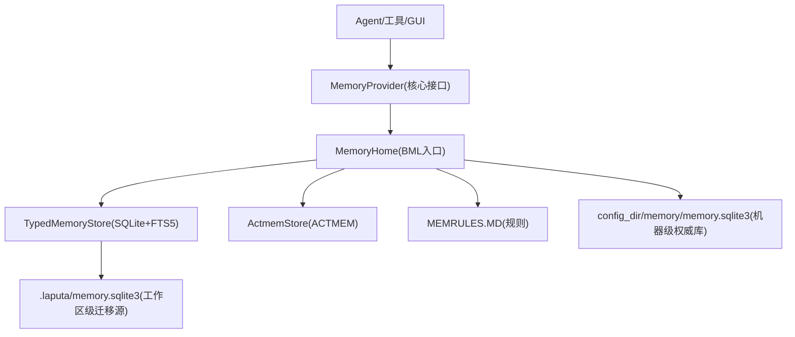
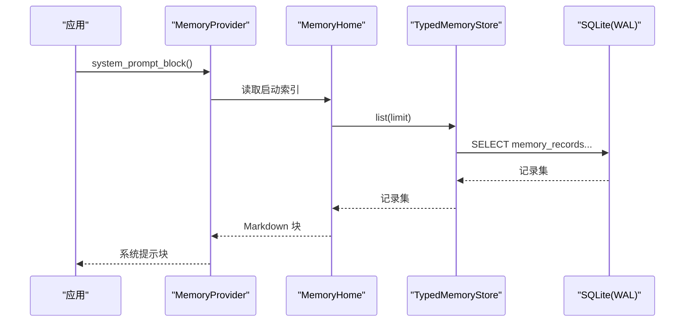
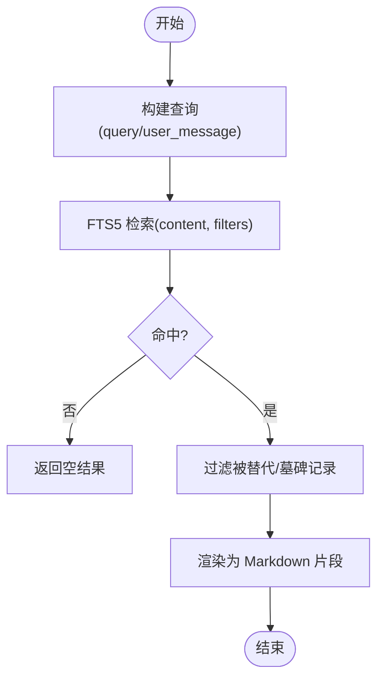
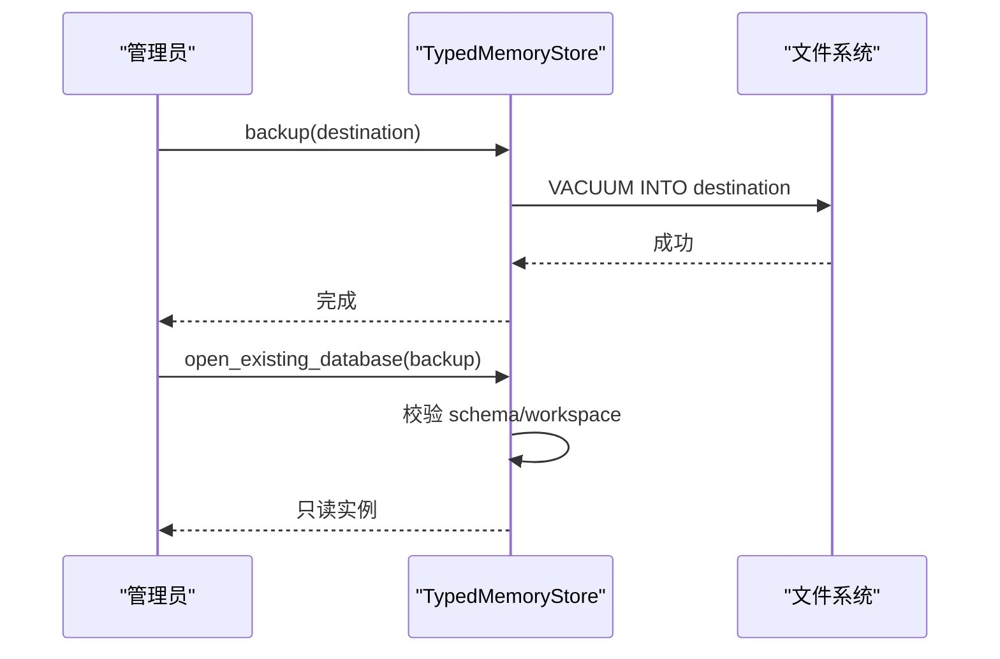
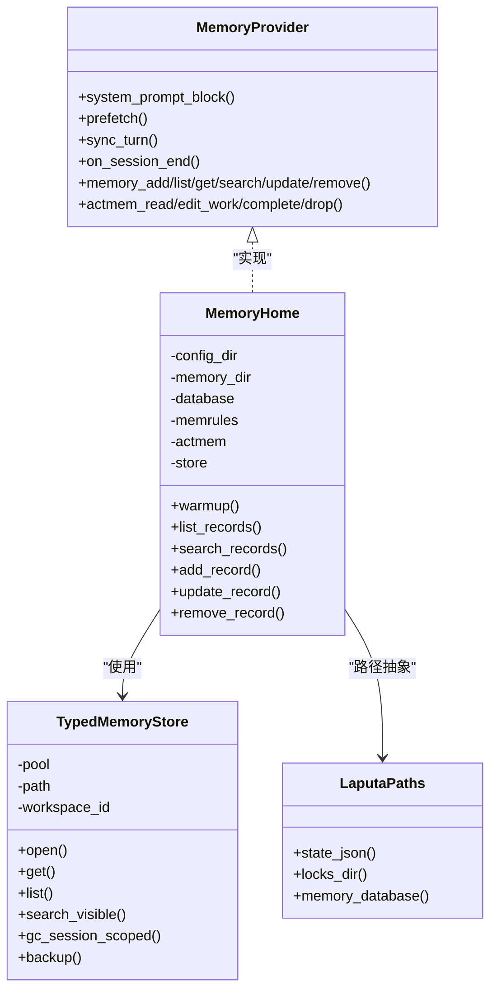

# 存储后端配置

<cite>
**本文引用的文件**
- [agent-diva-laputa/src/bml/mod.rs](file://agent-diva-laputa/src/bml/mod.rs)
- [agent-diva-laputa/src/bml/memory_home.rs](file://agent-diva-laputa/src/bml/memory_home.rs)
- [agent-diva-laputa/src/typed_store.rs](file://agent-diva-laputa/src/typed_store.rs)
- [agent-diva-laputa/src/layout.rs](file://agent-diva-laputa/src/layout.rs)
- [agent-diva-core/src/memory/provider.rs](file://agent-diva-core/src/memory/provider.rs)
- [agent-diva-core/src/config/schema.rs](file://agent-diva-core/src/config/schema.rs)
- [agent-diva-files/src/config.rs](file://agent-diva-files/src/config.rs)
- [agent-diva-files/src/storage.rs](file://agent-diva-files/src/storage.rs)
- [agent-diva-core/src/workspace_identity.rs](file://agent-diva-core/src/workspace_identity.rs)
</cite>

## 目录
1. [简介](#简介)
2. [项目结构与角色划分](#项目结构与角色划分)
3. [核心组件](#核心组件)
4. [架构总览](#架构总览)
5. [详细组件与配置](#详细组件与配置)
6. [依赖关系分析](#依赖关系分析)
7. [性能调优建议](#性能调优建议)
8. [故障排查指南](#故障排查指南)
9. [结论](#结论)
10. [附录：场景化配置模板](#附录：场景化配置模板)

## 简介
本文档面向“记忆存储后端”的配置与调优，覆盖 BML（基础记忆层）与 Laputa 治理层的存储路径、数据格式、索引策略、工作区隔离、权限控制、备份恢复、容量管理与清理策略，并提供不同场景下的选择建议与配置模板。BML 以 SQLite + FTS5 作为生产级权威存储，Laputa 提供工作区级状态与迁移能力；Agent-Diva Core 通过 MemoryProvider 抽象统一接入上层调用。

## 项目结构与角色划分
- BML（Basic Memory Layer）：机器级权威存储，持久化长时记忆记录，提供 CRUD、搜索、会话清理、备份恢复等能力。
- TypedStore：SQLite 类型化存储实现，负责建表、事务、FTS5 全文检索、容量限制、一致性校验与迁移。
- MemoryHome：BML 的生产入口，封装数据库路径、启动索引预热、规则文件 MEMRULES.MD、ACTMEM 等。
- LaputaPaths/LaputaStorage：工作区级布局与状态管理，包含 .laputa 目录、锁、状态 JSON、以及工作区级 typed store 的迁移源。
- Agent-Diva Core MemoryProvider：对外暴露的统一接口，屏蔽底层实现细节，供 Agent 循环、工具、GUI 等消费。
- Files 子系统：独立于记忆存储的文件内容存储，支持本地/可插拔后端、去重、清理策略与通道配置。

图表来源
- [agent-diva-laputa/src/bml/memory_home.rs:102-141](file://agent-diva-laputa/src/bml/memory_home.rs#L102-L141)
- [agent-diva-laputa/src/typed_store.rs:476-589](file://agent-diva-laputa/src/typed_store.rs#L476-L589)
- [agent-diva-laputa/src/layout.rs:19-67](file://agent-diva-laputa/src/layout.rs#L19-L67)

章节来源
- [agent-diva-laputa/src/bml/mod.rs:1-37](file://agent-diva-laputa/src/bml/mod.rs#L1-L37)
- [agent-diva-core/src/memory/provider.rs:391-617](file://agent-diva-core/src/memory/provider.rs#L391-L617)

## 核心组件
- BML 权威边界：禁止非 BML 模块直接调用原始写入 API，确保所有写操作经统一边界，便于审计与一致性保障。
- TypedMemoryStore：单工作区有界存储，维护 schema_version、store_revision、workspace_id，使用 WAL 模式与外键约束，内置 FTS5 全文索引。
- MemoryHome：集中管理 config_dir/memory 下的数据库与规则文件，提供 L1 启动索引预热、会话清理、搜索、CRUD 等。
- LaputaPaths：定义 .laputa 目录结构，包括 state.json、locks、recall-feedback.json、memory.sqlite3（迁移源）。
- MemoryProvider：统一接口，涵盖系统提示注入、预取召回、回合同步、会话结束钩子、ACTMEM 读写、记忆 CRUD 等。

章节来源
- [agent-diva-laputa/src/bml/mod.rs:1-37](file://agent-diva-laputa/src/bml/mod.rs#L1-L37)
- [agent-diva-laputa/src/typed_store.rs:135-142](file://agent-diva-laputa/src/typed_store.rs#L135-L142)
- [agent-diva-laputa/src/bml/memory_home.rs:85-141](file://agent-diva-laputa/src/bml/memory_home.rs#L85-L141)
- [agent-diva-laputa/src/layout.rs:19-67](file://agent-diva-laputa/src/layout.rs#L19-L67)
- [agent-diva-core/src/memory/provider.rs:391-617](file://agent-diva-core/src/memory/provider.rs#L391-L617)

## 架构总览
BML 是机器级权威存储，位于 config_dir/memory/memory.sqlite3；工作区级 .laputa/memory.sqlite3 仅作为离线迁移源或特定上下文使用。TypedStore 通过 SQLx 连接池管理 SQLite，启用 WAL 与外键，创建 memory_records、memory_supersedes、memory_apply_journal、schema_meta 及 memory_fts 虚拟表。MemoryHome 在启动时预热 L1 索引，将最近记录的摘要渲染为系统提示块，提升冷启动体验。

图表来源
- [agent-diva-core/src/memory/provider.rs:415-423](file://agent-diva-core/src/memory/provider.rs#L415-L423)
- [agent-diva-laputa/src/bml/memory_home.rs:494-511](file://agent-diva-laputa/src/bml/memory_home.rs#L494-L511)
- [agent-diva-laputa/src/typed_store.rs:628-638](file://agent-diva-laputa/src/typed_store.rs#L628-L638)

## 详细组件与配置

### BML 存储路径与数据格式
- 机器级权威数据库路径：config_dir/memory/memory.sqlite3。MemoryHome 构造时确定 memory_dir 与 database 路径，并加载 MEMRULES.MD。
- 工作区级迁移源路径：workspace_root/.laputa/memory.sqlite3，用于历史迁移与离线导入。
- 数据格式：
  - 记录实体：MemoryRecord，包含 id、kind、content、provenance、scope、trust、sensitivity、时间戳、tombstone、supersedes 等字段。
  - 存储表：memory_records（主记录）、memory_supersedes（替代关系）、memory_apply_journal（保留表，已禁用 governed 写入）、schema_meta（版本与元信息）。
  - 全文索引：memory_fts（FTS5），使用 unicode61 分词器，支持中英文关键词检索与 BM25 评分。

章节来源
- [agent-diva-laputa/src/bml/memory_home.rs:102-141](file://agent-diva-laputa/src/bml/memory_home.rs#L102-L141)
- [agent-diva-laputa/src/layout.rs:55-58](file://agent-diva-laputa/src/layout.rs#L55-L58)
- [agent-diva-laputa/src/typed_store.rs:476-589](file://agent-diva-laputa/src/typed_store.rs#L476-L589)

### 索引策略与检索
- FTS5 虚拟表 memory_fts 对 content 建立倒排索引，UNINDEXED 列用于过滤 workspace_id、session_id 等。
- 检索流程：prefetch/search 通过 query 匹配 content，返回 BM25 评分候选，再结合 supersedes/tombstone 过滤可见记录。
- L1 启动索引：MemoryHome 维护最近 N 条记录的摘要，渲染为 Markdown 注入系统提示，默认预算由配置项 l1_index_lines 控制。

图表来源
- [agent-diva-laputa/src/bml/memory_home.rs:534-564](file://agent-diva-laputa/src/bml/memory_home.rs#L534-L564)
- [agent-diva-laputa/src/typed_store.rs:537-551](file://agent-diva-laputa/src/typed_store.rs#L537-L551)

章节来源
- [agent-diva-core/src/config/schema.rs:311-331](file://agent-diva-core/src/config/schema.rs#L311-L331)
- [agent-diva-laputa/src/bml/memory_home.rs:394-418](file://agent-diva-laputa/src/bml/memory_home.rs#L394-L418)

### 工作区隔离与权限控制
- 工作区身份：canonical_workspace_id 基于规范化绝对路径计算稳定 ID，跨平台一致；legacy_path_workspace_id 用于识别旧身份进行迁移。
- 权限边界：非 BML 模块不得直接调用 put/import_records/gc/backup/restore 等原始写入 API，边界由测试强制检查。
- 访问控制：
  - 机器级权威库绑定 MACHINE_MEMORY_SCOPE，避免跨工作区误用。
  - 工作区级 store 打开时校验 workspace_id，防止串库。
  - 会话级记录通过 session_id 标记，支持会话结束清理与启动时 GC。

章节来源
- [agent-diva-core/src/workspace_identity.rs:6-30](file://agent-diva-core/src/workspace_identity.rs#L6-L30)
- [agent-diva-laputa/src/bml/mod.rs:1-22](file://agent-diva-laputa/src/bml/mod.rs#L1-L22)
- [agent-diva-laputa/src/typed_store.rs:162-199](file://agent-diva-laputa/src/typed_store.rs#L162-L199)

### 备份恢复与迁移
- 备份：使用 SQLite VACUUM INTO 生成事务一致的快照，目标路径需存在且非现有文件。
- 恢复：open_existing_database 打开备份库，校验 schema_version 与 workspace_id。
- 迁移：
  - 工作区身份迁移：检测 legacy 身份，自动备份到 .laputa/migrations/workspace-identity-v1/memory-before.sqlite3，更新 workspace_id 并写入 manifest.json。
  - 回滚：验证 manifest 后复制备份覆盖当前库，更新状态为 RolledBack。
- 离线导入：import_records 支持批量事务导入，冲突时整体回滚，保证幂等性。

图表来源
- [agent-diva-laputa/src/typed_store.rs:1271-1333](file://agent-diva-laputa/src/typed_store.rs#L1271-L1333)
- [agent-diva-laputa/src/typed_store.rs:162-199](file://agent-diva-laputa/src/typed_store.rs#L162-L199)
- [agent-diva-laputa/src/typed_store.rs:239-392](file://agent-diva-laputa/src/typed_store.rs#L239-L392)

章节来源
- [agent-diva-laputa/src/typed_store.rs:239-392](file://agent-diva-laputa/src/typed_store.rs#L239-L392)
- [agent-diva-laputa/src/typed_store.rs:745-800](file://agent-diva-laputa/src/typed_store.rs#L745-L800)

### 容量管理与清理策略
- 容量上限：
  - MAX_MEMORY_RECORDS：初始记录数上限（10,000）。
  - MAX_MEMORY_CONTENT_BYTES：初始内容字节上限（32MB）。
  - 超出时返回 CapacityExceeded 错误。
- 清理策略：
  - 会话级清理：gc_session_scoped 物理删除指定 session_id 的记录、FTS 行与替代边。
  - 启动时 GC：gc_stale_session_scoped 清理不在活跃会话集合中的会话记录，防崩溃残留。
- 文件子系统清理（可选参考）：
  - CleanupConfig.strategy：Immediate/Lazy/Scheduled。
  - max_age_days、min_ref_count、interval_secs 控制惰性/定时清理。

章节来源
- [agent-diva-laputa/src/typed_store.rs:26-29](file://agent-diva-laputa/src/typed_store.rs#L26-L29)
- [agent-diva-laputa/src/typed_store.rs:673-743](file://agent-diva-laputa/src/typed_store.rs#L673-L743)
- [agent-diva-files/src/config.rs:81-123](file://agent-diva-files/src/config.rs#L81-L123)

### 配置项说明
- 全局配置（Core Config）：
  - memory.l1_index_lines：启动 L1 索引行数预算，默认 30。
- 文件存储配置（Files）：
  - storage_path：默认 ~/.agent-diva/files。
  - max_file_size：默认 500MB。
  - max_total_size：默认 10GB。
  - deduplication：默认开启。
  - cleanup.strategy/max_age_days/min_ref_count/interval_secs：惰性清理策略参数。
  - channels.*：各通道上传大小、预览大小、流式上传等开关。

章节来源
- [agent-diva-core/src/config/schema.rs:311-331](file://agent-diva-core/src/config/schema.rs#L311-L331)
- [agent-diva-files/src/config.rs:16-79](file://agent-diva-files/src/config.rs#L16-L79)
- [agent-diva-files/src/config.rs:125-189](file://agent-diva-files/src/config.rs#L125-L189)

## 依赖关系分析
- MemoryProvider 解耦上层与底层存储，允许替换实现（如未来扩展其他后端）。
- MemoryHome 依赖 TypedMemoryStore 与 ActmemStore，同时管理 MEMRULES.MD 与启动索引缓存。
- TypedMemoryStore 依赖 sqlx 连接池、SQLite WAL、FTS5 扩展；通过 write_lock 串行化写操作，避免并发冲突。
- LaputaPaths 提供工作区级路径抽象，确保 .laputa 目录结构一致。

图表来源
- [agent-diva-core/src/memory/provider.rs:415-617](file://agent-diva-core/src/memory/provider.rs#L415-L617)
- [agent-diva-laputa/src/bml/memory_home.rs:85-141](file://agent-diva-laputa/src/bml/memory_home.rs#L85-L141)
- [agent-diva-laputa/src/typed_store.rs:135-142](file://agent-diva-laputa/src/typed_store.rs#L135-L142)
- [agent-diva-laputa/src/layout.rs:19-67](file://agent-diva-laputa/src/layout.rs#L19-L67)

章节来源
- [agent-diva-core/src/memory/provider.rs:391-617](file://agent-diva-core/src/memory/provider.rs#L391-L617)
- [agent-diva-laputa/src/bml/memory_home.rs:85-141](file://agent-diva-laputa/src/bml/memory_home.rs#L85-L141)
- [agent-diva-laputa/src/typed_store.rs:135-142](file://agent-diva-laputa/src/typed_store.rs#L135-L142)
- [agent-diva-laputa/src/layout.rs:19-67](file://agent-diva-laputa/src/layout.rs#L19-L67)

## 性能调优建议
- 连接池与并发：
  - TypedStore 使用 SqlitePoolOptions.max_connections=4，适合多读少写的场景；若写入密集可适当调整。
  - busy_timeout=5s，避免忙锁导致失败；在高并发下可考虑增加超时或重试策略。
- 索引优化：
  - FTS5 tokenize='unicode61' 对中英文有一定支持；如需更高召回质量，可在上层引入 hybrid rank（BM25 + 应用层权重）。
  - 合理设置 l1_index_lines，平衡启动速度与提示长度。
- 容量与清理：
  - 监控 record_count 与 content_bytes，接近 MAX_MEMORY_RECORDS/MAX_MEMORY_CONTENT_BYTES 时触发归档或压缩。
  - 定期运行 gc_stale_session_scoped，清理异常退出的会话残留。
- I/O 与 WAL：
  - WAL 模式提升读性能与并发安全；确保磁盘 IO 稳定，避免频繁 fsync 导致的延迟。

[本节为通用性能指导，不直接分析具体文件]

## 故障排查指南
- FTS5 不可用：
  - 现象：初始化时报错 FtsUnavailable。
  - 处理：确认 SQLite 运行时包含 FTS5 扩展；必要时降级为应用层评分方案。
- 工作区身份不匹配：
  - 现象：DatabaseWorkspaceMismatch。
  - 处理：检查 workspace_id 是否一致；如需迁移，使用 open_canonical/open_existing_canonical 自动升级。
- 备份冲突：
  - 现象：BackupExists。
  - 处理：更换目标路径或删除已有备份文件。
- 导入冲突：
  - 现象：ImportConflict。
  - 处理：检查重复记录或内容不一致；确保幂等导入逻辑。
- 会话清理失败：
  - 现象：gc_* 方法返回错误。
  - 处理：检查 session_id 是否正确；确认外键约束未被破坏。

章节来源
- [agent-diva-laputa/src/typed_store.rs:31-76](file://agent-diva-laputa/src/typed_store.rs#L31-L76)
- [agent-diva-laputa/src/typed_store.rs:162-199](file://agent-diva-laputa/src/typed_store.rs#L162-L199)
- [agent-diva-laputa/src/typed_store.rs:745-800](file://agent-diva-laputa/src/typed_store.rs#L745-L800)

## 结论
BML 以 SQLite + FTS5 为核心，提供高可靠、可迁移、可审计的记忆存储；Laputa 提供工作区级状态与迁移能力；MemoryProvider 统一接口屏蔽底层差异。通过合理的容量管理、清理策略与索引优化，可在不同场景下获得良好的性能与稳定性。建议在生产环境启用 WAL、监控容量、定期清理会话残留，并使用备份恢复机制保障数据安全。

[本节为总结性内容，不直接分析具体文件]

## 附录：场景化配置模板

### 单机开发环境
- 存储路径：~/.agent-diva/memory（机器级权威库）
- 索引预算：l1_index_lines=30
- 清理策略：Lazy，max_age_days=7，interval_secs=3600
- 文件存储：deduplication=true，max_file_size=500MB，max_total_size=10GB

### 多用户协作环境
- 存储路径：共享目录下的 config_dir/memory/memory.sqlite3（确保权限隔离）
- 索引预算：l1_index_lines=50（提升启动召回）
- 清理策略：Scheduled，max_age_days=14，min_ref_count=1
- 文件存储：按通道限制大小，启用流式上传

### 高吞吐写入场景
- 存储路径：SSD 上的 config_dir/memory/memory.sqlite3
- 连接池：适当增加 max_connections（代码默认 4）
- 索引预算：l1_index_lines=20（减少提示长度）
- 清理策略：Immediate，快速释放空间

### 离线/嵌入式场景
- 存储路径：工作区级 .laputa/memory.sqlite3（迁移源）
- 索引预算：l1_index_lines=10（资源受限）
- 清理策略：Lazy，max_age_days=3
- 文件存储：关闭 deduplication 以节省 CPU

[本节为概念性模板，不直接分析具体文件]