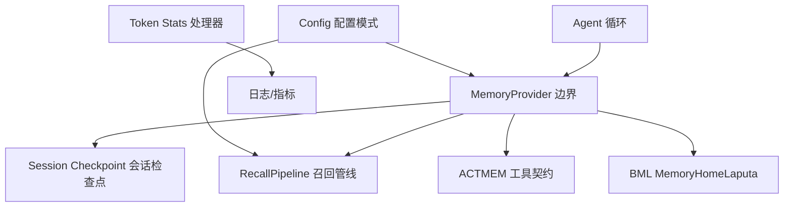
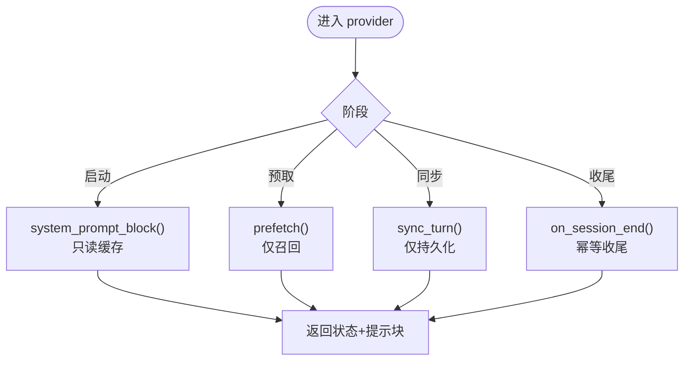
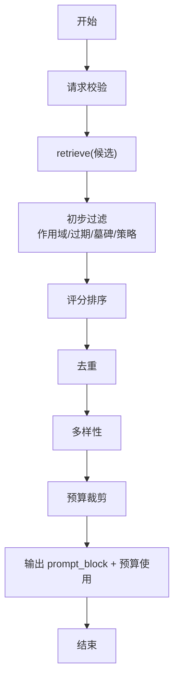
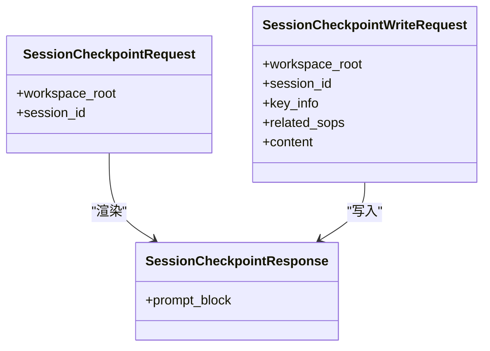
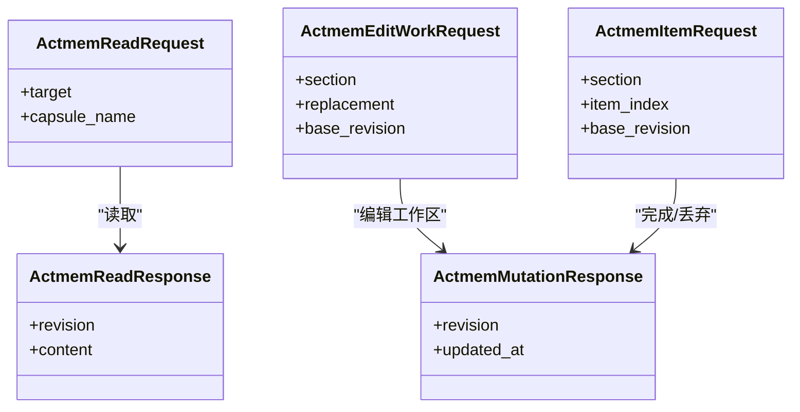
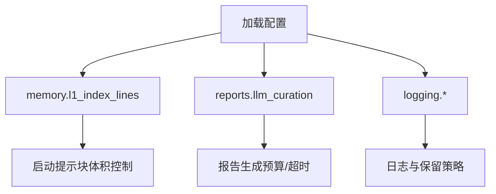
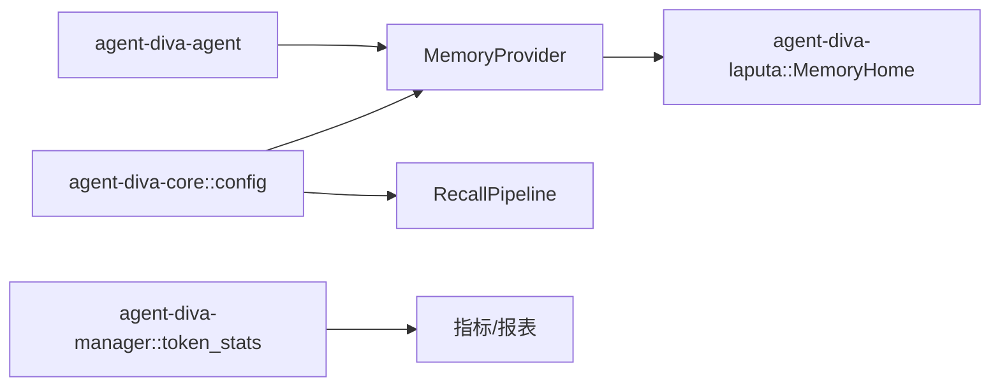

# 性能优化配置

<cite>
**本文引用的文件**
- [agent-diva-core/src/memory/mod.rs](file://agent-diva-core/src/memory/mod.rs)
- [agent-diva-core/src/memory/provider.rs](file://agent-diva-core/src/memory/provider.rs)
- [agent-diva-core/src/memory/recall.rs](file://agent-diva-core/src/memory/recall.rs)
- [agent-diva-core/src/memory/working.rs](file://agent-diva-core/src/memory/working.rs)
- [agent-diva-core/src/memory/actmem.rs](file://agent-diva-core/src/memory/actmem.rs)
- [agent-diva-core/src/config/schema.rs](file://agent-diva-core/src/config/schema.rs)
- [agent-diva-agent/src/memory_boundary.rs](file://agent-diva-agent/src/memory_boundary.rs)
- [agent-diva-manager/src/handlers/token_stats.rs](file://agent-diva-manager/src/handlers/token_stats.rs)
- [agent-diva-laputa/src/error.rs](file://agent-diva-laputa/src/error.rs)
- [docs/dev/archive(old-docs-dont-read-me)/2026-08-docs-corpus-reset/legacy-dev/past/content/legacy-docs/dev/20260611-general-audit-pro/P1-8-sqlite-wal.md](file://docs/dev/archive(old-docs-dont-read-me)/2026-08-docs-corpus-reset/legacy-dev/past/content/legacy-docs/dev/20260611-general-audit-pro/P1-8-sqlite-wal.md)
- [docs/dev/archive(old-docs-dont-read-me)/2026-08-docs-corpus-reset/legacy-batches/agent-diva-pro-legacy-logs-2026-06-13/2026-06-observability/v0.0.1-thin-observability-layer/release.md](file://docs/dev/archive(old-docs-dont-read-me)/2026-08-docs-corpus-reset/legacy-batches/agent-diva-pro-legacy-logs-2026-06-13/2026-06-observability/v0.0.1-thin-observability-layer/release.md)
</cite>

## 目录
1. [简介](#简介)
2. [项目结构](#项目结构)
3. [核心组件](#核心组件)
4. [架构总览](#架构总览)
5. [详细组件分析](#详细组件分析)
6. [依赖关系分析](#依赖关系分析)
7. [性能考量](#性能考量)
8. [故障排查指南](#故障排查指南)
9. [结论](#结论)
10. [附录](#附录)

## 简介
本文件面向记忆系统的性能优化与配置，覆盖内存使用、I/O 操作、并发访问的调优选项；详细说明连接池、缓存大小、超时时间的配置方法；解释批量操作、异步处理、资源管理的优化设置；提供高负载场景下的性能调优示例；并给出性能监控指标、瓶颈分析与故障排查的配置指南。内容基于仓库中记忆系统接口、召回管线、工作区检查点、配置模式以及可观测性规划等实现进行提炼。

## 项目结构
记忆系统由“提供者边界”“召回管线”“会话检查点”“ACTMEM 工具契约”“配置模式”组成，并通过 Agent 层默认绑定到机器级 BML MemoryHome。关键路径如下：
- 提供者边界：定义启动注入、预取、回合同步、会话结束钩子及 CRUD 能力。
- 召回管线：负责候选检索、评分、去重、多样性、预算控制与输出拼装。
- 会话检查点：维护会话内临时状态，避免污染长期记忆。
- ACTMEM：提供脉冲、摘要、工作区等受控读写通道。
- 配置模式：集中声明 memory、reports、logging 等可调参数。



图表来源
- [agent-diva-core/src/memory/provider.rs:414-617](file://agent-diva-core/src/memory/provider.rs#L414-L617)
- [agent-diva-core/src/memory/recall.rs:214-359](file://agent-diva-core/src/memory/recall.rs#L214-L359)
- [agent-diva-core/src/memory/working.rs:20-52](file://agent-diva-core/src/memory/working.rs#L20-L52)
- [agent-diva-core/src/memory/actmem.rs:3-50](file://agent-diva-core/src/memory/actmem.rs#L3-L50)
- [agent-diva-core/src/config/schema.rs:278-331](file://agent-diva-core/src/config/schema.rs#L278-L331)
- [agent-diva-manager/src/handlers/token_stats.rs:307-340](file://agent-diva-manager/src/handlers/token_stats.rs#L307-L340)

章节来源
- [agent-diva-core/src/memory/mod.rs:1-47](file://agent-diva-core/src/memory/mod.rs#L1-L47)
- [agent-diva-core/src/config/schema.rs:278-331](file://agent-diva-core/src/config/schema.rs#L278-L331)

## 核心组件
- MemoryProvider 边界
  - 启动阶段：system_prompt_block/system_prompt_revision/refresh_system_prompt_projection 用于构建和刷新启动提示块，要求同步读取本地缓存，禁止阻塞 I/O。
  - 回合阶段：prefetch 支持意图感知预取；sync_turn 持久化证据；record_recall_outcome 记录召回结果。
  - 会话阶段：session_checkpoint_block/session_checkpoint_write 管理会话内临时状态；on_session_end 执行幂等的收尾工作。
  - CRUD/ACTMEM：memory_* 与 actmem_* 提供可选能力，未实现时返回不支持或内部错误。
- RecallPipeline 召回管线
  - 输入：查询、作用域、审计关联、当前时间、token 预算、候选上限、策略。
  - 选择流程：验证→检索→初步过滤→去重→多样性→预算裁剪→输出 prompt block。
  - 输出：状态、失败分类、选中记录、prompt block、预算使用、逐条 trace。
- Session Checkpoint 会话检查点
  - L0 策略：仅写入经动作验证的事实，不将易变状态放入长期记忆，最小指针原则。
  - 渲染：按 key_info、related_sops、content 生成结构化区块。
- ACTMEM 工具契约
  - 读目标：Pulse、Recap、Work、Head、Capsules、Capsule。
  - 写操作：Edit Work、Complete/Drop Item，均带 revision 保证 CAS。
- 配置模式
  - memory.l1_index_lines：控制启动索引行数以限制注入体积。
  - reports.llm_curation：报告生成的模型、超时、最大 token 等。
  - logging：级别、格式、目录、保留天数、模块覆盖。

章节来源
- [agent-diva-core/src/memory/provider.rs:22-117](file://agent-diva-core/src/memory/provider.rs#L22-L117)
- [agent-diva-core/src/memory/provider.rs:237-389](file://agent-diva-core/src/memory/provider.rs#L237-L389)
- [agent-diva-core/src/memory/provider.rs:414-617](file://agent-diva-core/src/memory/provider.rs#L414-L617)
- [agent-diva-core/src/memory/recall.rs:58-156](file://agent-diva-core/src/memory/recall.rs#L58-L156)
- [agent-diva-core/src/memory/recall.rs:214-359](file://agent-diva-core/src/memory/recall.rs#L214-L359)
- [agent-diva-core/src/memory/working.rs:10-52](file://agent-diva-core/src/memory/working.rs#L10-L52)
- [agent-diva-core/src/memory/actmem.rs:3-50](file://agent-diva-core/src/memory/actmem.rs#L3-L50)
- [agent-diva-core/src/config/schema.rs:278-331](file://agent-diva-core/src/config/schema.rs#L278-L331)

## 架构总览
记忆系统在 Agent 循环中以提供者边界为统一入口，启动阶段从缓存快速构建系统提示块；回合中通过预取与召回管线按需注入上下文；回合后持久化证据；会话结束时执行幂等收尾。配置层决定注入规模、报告行为与日志策略。

```mermaid
sequenceDiagram
participant Loop as "Agent 循环"
participant Provider as "MemoryProvider"
participant Recall as "RecallPipeline"
participant Store as "BML MemoryHome"
participant Config as "配置"
Loop->>Provider : system_prompt_block()
Provider-->>Loop : 启动提示块(来自缓存)
Loop->>Provider : prefetch(intent, room)
Provider->>Recall : execute(request)
Recall->>Store : retrieve(candidates)
Store-->>Recall : 候选列表
Recall-->>Provider : 选中记录 + prompt_block
Provider-->>Loop : 注入上下文
Loop->>Provider : sync_turn(memory_update, history)
Provider->>Store : 持久化证据
Loop->>Provider : on_session_end()
Provider->>Store : 幂等收尾
```

图表来源
- [agent-diva-core/src/memory/provider.rs:414-617](file://agent-diva-core/src/memory/provider.rs#L414-L617)
- [agent-diva-core/src/memory/recall.rs:214-359](file://agent-diva-core/src/memory/recall.rs#L214-L359)
- [agent-diva-agent/src/memory_boundary.rs:13-16](file://agent-diva-agent/src/memory_boundary.rs#L13-L16)

## 详细组件分析

### 组件A：MemoryProvider 边界（启动、预取、同步、收尾）
- 启动阶段必须无副作用、无阻塞 I/O，优先使用进程内缓存；若无法组装连续性，则返回降级状态并明确原因。
- 预取阶段应仅做召回，不做持久化；失败时以状态降级而非抛错，确保回合继续。
- 同步阶段仅做持久化，不用于回填启动状态或做实时召回。
- 会话结束钩子需幂等，重复调用不应产生副作用。
- CRUD/ACTMEM 为可选能力，未实现时返回不支持或内部错误，便于渐进式接入。



图表来源
- [agent-diva-core/src/memory/provider.rs:414-617](file://agent-diva-core/src/memory/provider.rs#L414-L617)

章节来源
- [agent-diva-core/src/memory/provider.rs:22-117](file://agent-diva-core/src/memory/provider.rs#L22-L117)
- [agent-diva-core/src/memory/provider.rs:237-389](file://agent-diva-core/src/memory/provider.rs#L237-L389)
- [agent-diva-core/src/memory/provider.rs:414-617](file://agent-diva-core/src/memory/provider.rs#L414-L617)

### 组件B：RecallPipeline 召回管线（预算与选择）
- 输入校验：必填字段、信任/敏感度策略、候选上限。
- 选择流程：初步过滤（作用域、过期、墓碑、策略）→ 评分排序 → 去重 → 多样性 → 预算裁剪 → 输出 prompt block。
- 预算控制：保守估算 token，预留头部开销，逐项累加直至超预算即停止。
- 可观测性：trace 记录每条候选决策与估计 token，便于定位瓶颈。



图表来源
- [agent-diva-core/src/memory/recall.rs:214-359](file://agent-diva-core/src/memory/recall.rs#L214-L359)
- [agent-diva-core/src/memory/recall.rs:509-530](file://agent-diva-core/src/memory/recall.rs#L509-L530)

章节来源
- [agent-diva-core/src/memory/recall.rs:58-156](file://agent-diva-core/src/memory/recall.rs#L58-L156)
- [agent-diva-core/src/memory/recall.rs:214-359](file://agent-diva-core/src/memory/recall.rs#L214-L359)
- [agent-diva-core/src/memory/recall.rs:509-530](file://agent-diva-core/src/memory/recall.rs#L509-L530)

### 组件C：会话检查点（L0 策略与渲染）
- 策略：仅写入经动作验证的事实；会话进度保存在检查点而非长期记忆；启动注入采用最小指针。
- 渲染：按 key_info、related_sops、content 生成结构化区块，空段省略。



图表来源
- [agent-diva-core/src/memory/working.rs:20-52](file://agent-diva-core/src/memory/working.rs#L20-L52)
- [agent-diva-core/src/memory/working.rs:54-76](file://agent-diva-core/src/memory/working.rs#L54-L76)

章节来源
- [agent-diva-core/src/memory/working.rs:10-52](file://agent-diva-core/src/memory/working.rs#L10-L52)
- [agent-diva-core/src/memory/working.rs:54-76](file://agent-diva-core/src/memory/working.rs#L54-L76)

### 组件D：ACTMEM 工具契约（受控读写）
- 读目标：Pulse、Recap、Work、Head、Capsules、Capsule。
- 写操作：Edit Work、Complete/Drop Item，均携带 base_revision 实现 CAS。
- 规则：memory_rules 返回写作手册，供写入时注入。



图表来源
- [agent-diva-core/src/memory/actmem.rs:3-50](file://agent-diva-core/src/memory/actmem.rs#L3-L50)

章节来源
- [agent-diva-core/src/memory/actmem.rs:3-50](file://agent-diva-core/src/memory/actmem.rs#L3-L50)

### 组件E：配置模式（memory、reports、logging）
- memory.l1_index_lines：控制启动索引行数，限制注入体积，遵循最小指针原则。
- reports.llm_curation：启用开关、模型/提供者覆盖、语言、最大输入/输出 token、超时、回退策略。
- logging：级别、格式、目录、保留天数、模块覆盖。



图表来源
- [agent-diva-core/src/config/schema.rs:278-331](file://agent-diva-core/src/config/schema.rs#L278-L331)
- [agent-diva-core/src/config/schema.rs:378-463](file://agent-diva-core/src/config/schema.rs#L378-L463)
- [agent-diva-core/src/config/schema.rs:511-557](file://agent-diva-core/src/config/schema.rs#L511-L557)

章节来源
- [agent-diva-core/src/config/schema.rs:278-331](file://agent-diva-core/src/config/schema.rs#L278-L331)
- [agent-diva-core/src/config/schema.rs:378-463](file://agent-diva-core/src/config/schema.rs#L378-L463)
- [agent-diva-core/src/config/schema.rs:511-557](file://agent-diva-core/src/config/schema.rs#L511-L557)

## 依赖关系分析
- Agent 层默认将 MemoryProvider 绑定到机器级 BML MemoryHome，确保生产环境权威存储唯一。
- 配置模式影响记忆注入规模与报告行为；日志配置影响可观测性与磁盘占用。
- 管理器 Token Stats 处理器聚合使用数据，便于观察 token 消耗趋势。



图表来源
- [agent-diva-agent/src/memory_boundary.rs:13-16](file://agent-diva-agent/src/memory_boundary.rs#L13-L16)
- [agent-diva-core/src/config/schema.rs:278-331](file://agent-diva-core/src/config/schema.rs#L278-L331)
- [agent-diva-manager/src/handlers/token_stats.rs:307-340](file://agent-diva-manager/src/handlers/token_stats.rs#L307-L340)

章节来源
- [agent-diva-agent/src/memory_boundary.rs:13-16](file://agent-diva-agent/src/memory_boundary.rs#L13-L16)
- [agent-diva-core/src/config/schema.rs:278-331](file://agent-diva-core/src/config/schema.rs#L278-L331)
- [agent-diva-manager/src/handlers/token_stats.rs:307-340](file://agent-diva-manager/src/handlers/token_stats.rs#L307-L340)

## 性能考量
- 内存使用
  - 启动注入体积：通过 memory.l1_index_lines 控制索引行数，避免一次性注入过多内容。
  - 召回预算：RecallPipeline 使用 token_budget 与 max_candidates 限制候选数量与输出体积；保守估算 token，预留头部开销。
  - 会话检查点：仅在会话内维护临时状态，避免长期记忆膨胀。
- I/O 操作
  - 启动阶段禁止阻塞 I/O，仅读取本地缓存；异步路径用于预取、同步与收尾。
  - 持久化失败时以状态降级上报，不中断主流程。
- 并发访问
  - 会话结束钩子需幂等，防止重复触发导致竞争。
  - ACTMEM 写操作使用 base_revision 实现 CAS，避免并发冲突。
- 连接池与超时
  - 若后端使用 SQLite，建议将连接池构造收敛到存储内部，并在连接创建时启用 PRAGMA（如 WAL、busy_timeout），合理设置 max_connections。
  - 报告生成与外部调用应配置超时，避免长尾阻塞。
- 批量与异步
  - 预取与同步在异步路径执行，减少阻塞；CRUD/ACTMEM 为可选能力，可按需启用。
  - 报告生成可通过 reports.llm_curation.timeout_secs 控制超时，max_input_tokens/max_output_tokens 控制预算。
- 资源管理
  - 日志保留天数与目录可控，避免磁盘增长；模块级日志级别覆盖便于调试与生产平衡。

章节来源
- [agent-diva-core/src/memory/provider.rs:414-617](file://agent-diva-core/src/memory/provider.rs#L414-L617)
- [agent-diva-core/src/memory/recall.rs:214-359](file://agent-diva-core/src/memory/recall.rs#L214-L359)
- [agent-diva-core/src/memory/actmem.rs:3-50](file://agent-diva-core/src/memory/actmem.rs#L3-L50)
- [agent-diva-core/src/config/schema.rs:378-463](file://agent-diva-core/src/config/schema.rs#L378-L463)
- [agent-diva-core/src/config/schema.rs:511-557](file://agent-diva-core/src/config/schema.rs#L511-L557)
- [docs/dev/archive(old-docs-dont-read-me)/2026-08-docs-corpus-reset/legacy-dev/past/content/legacy-docs/dev/20260611-general-audit-pro/P1-8-sqlite-wal.md:31-62](file://docs/dev/archive(old-docs-dont-read-me)/2026-08-docs-corpus-reset/legacy-dev/past/content/legacy-docs/dev/20260611-general-audit-pro/P1-8-sqlite-wal.md#L31-L62)

## 故障排查指南
- 启动降级
  - 现象：启动提示块不可用或连续性不足。
  - 排查：确认 system_prompt_block 是否仅读取缓存；检查 refresh_system_prompt_projection 是否正确响应 authority_revision；查看降级原因。
- 召回失败
  - 现象：预取返回失败或无上下文注入。
  - 排查：检查 RecallPipeline 的 request 校验（必填字段、策略、候选上限）；确认 retrieve 是否可用；查看 trace 中的拒绝原因（作用域、过期、策略、预算）。
- 持久化失败
  - 现象：sync_turn 返回失败但会话继续。
  - 排查：确认 provider 对 Markdown/BML 写入失败的处理策略；检查 on_session_end 是否幂等；关注 Laputa 错误类型（Io、LockTimeout、MigrationConflict 等）。
- 日志与可观测性
  - 现象：难以定位问题。
  - 排查：启用结构化 JSONL 日志；统一 trace_id；配置 retention_days；在网关与运行时增加必要事件；必要时导出调试包。

章节来源
- [agent-diva-core/src/memory/provider.rs:22-117](file://agent-diva-core/src/memory/provider.rs#L22-L117)
- [agent-diva-core/src/memory/recall.rs:509-530](file://agent-diva-core/src/memory/recall.rs#L509-L530)
- [agent-diva-laputa/src/error.rs:7-34](file://agent-diva-laputa/src/error.rs#L7-L34)
- [docs/dev/archive(old-docs-dont-read-me)/2026-08-docs-corpus-reset/legacy-batches/agent-diva-pro-legacy-logs-2026-06-13/2026-06-observability/v0.0.1-thin-observability-layer/release.md:1-17](file://docs/dev/archive(old-docs-dont-read-me)/2026-08-docs-corpus-reset/legacy-batches/agent-diva-pro-legacy-logs-2026-06-13/2026-06-observability/v0.0.1-thin-observability-layer/release.md#L1-L17)

## 结论
记忆系统的性能优化应以“启动轻量、按需召回、严格预算、幂等收尾”为核心原则。通过配置控制注入规模与报告行为，利用召回管线的预算与选择机制保障上下文质量与稳定性，结合结构化日志与可观测性规划提升排障效率。在高负载场景下，应重点调优连接池、超时、预算与日志保留策略，确保系统稳定与资源可控。

## 附录
- 高负载调优示例（概念性步骤）
  - 降低 memory.l1_index_lines，减少启动注入体积。
  - 收紧 recall.token_budget 与 max_candidates，限制候选与输出。
  - 设置 reports.llm_curation.timeout_secs 与 max_input_tokens/max_output_tokens，避免长尾。
  - 配置 logging.retention_days 与 dir，控制磁盘占用。
  - 若使用 SQLite，启用 WAL 与 busy_timeout，合理设置 max_connections。
- 监控指标建议
  - 启动阶段：提示块大小、降级次数。
  - 召回阶段：selected_count、rejected_count、used_tokens、trace 拒绝原因分布。
  - 持久化阶段：sync_turn 成功/失败比例、on_session_end 触发次数。
  - 资源阶段：日志文件大小、保留天数、磁盘使用率。