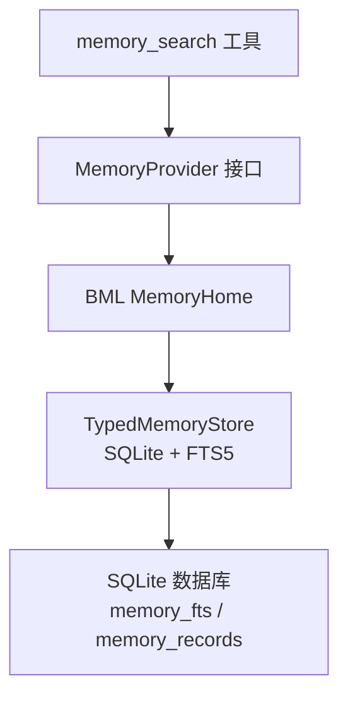
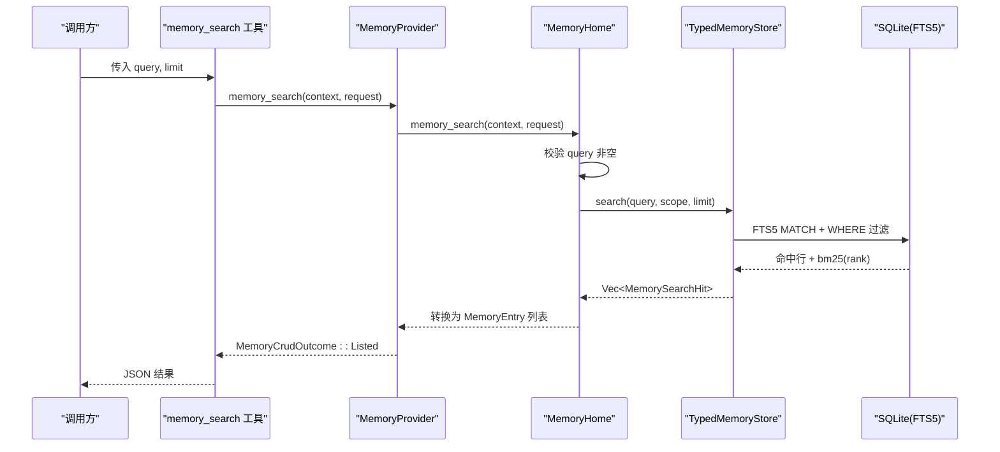
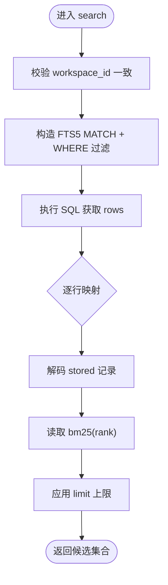
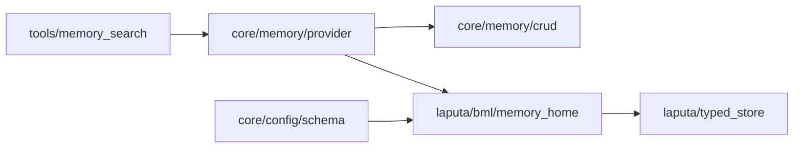

# 搜索算法配置

<cite>
**本文引用的文件**
- [agent-diva-core/src/memory/mod.rs](file://agent-diva-core/src/memory/mod.rs)
- [agent-diva-core/src/memory/provider.rs](file://agent-diva-core/src/memory/provider.rs)
- [agent-diva-core/src/memory/crud.rs](file://agent-diva-core/src/memory/crud.rs)
- [agent-diva-core/src/config/schema.rs](file://agent-diva-core/src/config/schema.rs)
- [agent-diva-tools/src/memory_search.rs](file://agent-diva-tools/src/memory_search.rs)
- [agent-diva-laputa/src/bml/memory_home.rs](file://agent-diva-laputa/src/bml/memory_home.rs)
- [agent-diva-laputa/src/typed_store.rs](file://agent-diva-laputa/src/typed_store.rs)
- [agent-diva-laputa/tests/typed_store.rs](file://agent-diva-laputa/tests/typed_store.rs)
- [docs/research/papers/2304_03442.md](file://docs/research/papers/2304_03442.md)
- [docs/research/historical/.../04-light-store-candidates.md](file://docs/research/historical/2026-07-08-laputa-memory-history/laputa-diva-garden-2026-07/04-light-store-candidates.md)
</cite>

## 目录
1. [简介](#简介)
2. [项目结构](#项目结构)
3. [核心组件](#核心组件)
4. [架构总览](#架构总览)
5. [详细组件分析](#详细组件分析)
6. [依赖关系分析](#依赖关系分析)
7. [性能与优化](#性能与优化)
8. [故障排查指南](#故障排查指南)
9. [结论](#结论)
10. [附录：场景化配置示例](#附录：场景化配置示例)

## 简介
本文件面向记忆搜索算法的配置与调优，覆盖语义检索、全文检索、混合检索的可选策略；说明搜索权重、相关性评分、结果排序的可控点；给出缓存、索引更新、增量搜索的性能优化建议；并提供不同查询场景下的算法选择与参数调优示例。同时包含搜索结果过滤、去重、聚类的可配置实践。

## 项目结构
记忆搜索在 Agent-Diva 中由“工具层 → 提供者接口 → BML 权威实现 → 存储层”的分层构成：
- 工具层暴露 memory_search 工具，负责参数校验与调用 MemoryProvider。
- 提供者接口定义统一的 CRUD 与召回契约，屏蔽后端差异。
- BML 权威（MemoryHome）将请求路由到 TypedMemoryStore。
- 存储层使用 SQLite + FTS5 进行倒排与 BM25 基础检索，并支持可见性过滤与排序。

图表来源
- [agent-diva-tools/src/memory_search.rs:1-86](file://agent-diva-tools/src/memory_search.rs#L1-L86)
- [agent-diva-core/src/memory/provider.rs:414-517](file://agent-diva-core/src/memory/provider.rs#L414-L517)
- [agent-diva-laputa/src/bml/memory_home.rs:640-663](file://agent-diva-laputa/src/bml/memory_home.rs#L640-L663)
- [agent-diva-laputa/src/typed_store.rs:1119-1180](file://agent-diva-laputa/src/typed_store.rs#L1119-L1180)

章节来源
- [agent-diva-core/src/memory/mod.rs:1-47](file://agent-diva-core/src/memory/mod.rs#L1-L47)
- [agent-diva-tools/src/memory_search.rs:1-86](file://agent-diva-tools/src/memory_search.rs#L1-L86)
- [agent-diva-core/src/memory/provider.rs:414-517](file://agent-diva-core/src/memory/provider.rs#L414-L517)
- [agent-diva-laputa/src/bml/memory_home.rs:640-663](file://agent-diva-laputa/src/bml/memory_home.rs#L640-L663)
- [agent-diva-laputa/src/typed_store.rs:1119-1180](file://agent-diva-laputa/src/typed_store.rs#L1119-L1180)

## 核心组件
- 工具层 memory_search：解析请求、校验参数、调用 provider.memory_search。
- 提供者接口 MemoryProvider：统一抽象 system_prompt_block、prefetch、sync_turn、memory_* 等能力。
- BML MemoryHome：实现 memory_search，限制空查询，调用 search_records。
- 存储层 TypedMemoryStore：基于 SQLite FTS5 的 search/search_visible，返回 BM25 分数与记录。
- 配置项 MemoryConfig.l1_index_lines：控制启动时注入 L1 索引的行数预算，影响上下文召回的入口规模。

章节来源
- [agent-diva-tools/src/memory_search.rs:1-86](file://agent-diva-tools/src/memory_search.rs#L1-L86)
- [agent-diva-core/src/memory/provider.rs:414-517](file://agent-diva-core/src/memory/provider.rs#L414-L517)
- [agent-diva-laputa/src/bml/memory_home.rs:640-663](file://agent-diva-laputa/src/bml/memory_home.rs#L640-L663)
- [agent-diva-laputa/src/typed_store.rs:1119-1180](file://agent-diva-laputa/src/typed_store.rs#L1119-L1180)
- [agent-diva-core/src/config/schema.rs:311-331](file://agent-diva-core/src/config/schema.rs#L311-L331)

## 架构总览
下图展示一次 memory_search 从工具到存储的完整调用链，以及返回结果的封装过程。

图表来源
- [agent-diva-tools/src/memory_search.rs:55-79](file://agent-diva-tools/src/memory_search.rs#L55-L79)
- [agent-diva-core/src/memory/provider.rs:501-508](file://agent-diva-core/src/memory/provider.rs#L501-L508)
- [agent-diva-laputa/src/bml/memory_home.rs:640-663](file://agent-diva-laputa/src/bml/memory_home.rs#L640-L663)
- [agent-diva-laputa/src/typed_store.rs:1119-1180](file://agent-diva-laputa/src/typed_store.rs#L1119-L1180)

## 详细组件分析

### 全文检索（FTS5 + BM25）
- 检索入口：TypedMemoryStore.search 与 search_visible。
- 排序依据：bm25(memory_fts) 作为 rank，再按 memory_id 或 effective_at 排序。
- 过滤条件：tenant_id、workspace_id、session_id（精确匹配或全局）、tombstone=0。
- 上限保护：limit 被限制为不超过 100。

图表来源
- [agent-diva-laputa/src/typed_store.rs:1119-1180](file://agent-diva-laputa/src/typed_store.rs#L1119-L1180)

章节来源
- [agent-diva-laputa/src/typed_store.rs:1119-1180](file://agent-diva-laputa/src/typed_store.rs#L1119-L1180)

### 会话可见性与范围过滤
- search：仅返回 session_id 完全匹配的条目（或全局）。
- search_visible：返回 workspace 全局条目加上当前 session 条目，并按 effective_at 降序优先。
- 该设计满足 Recall 对可见性的要求，且不改变 exact-scope 语义。

章节来源
- [agent-diva-laputa/src/typed_store.rs:1162-1180](file://agent-diva-laputa/src/typed_store.rs#L1162-L1180)

### 工具与提供者边界
- memory_search 工具：只负责参数解析与 provider 调用，错误以 ToolError 包装。
- MemoryProvider：提供 memory_search 默认不支持的实现，BML 实现覆盖之。
- MemoryHome：拒绝空查询，并将底层错误转为稳定的 reason 码。

章节来源
- [agent-diva-tools/src/memory_search.rs:55-79](file://agent-diva-tools/src/memory_search.rs#L55-L79)
- [agent-diva-core/src/memory/provider.rs:501-508](file://agent-diva-core/src/memory/provider.rs#L501-L508)
- [agent-diva-laputa/src/bml/memory_home.rs:640-663](file://agent-diva-laputa/src/bml/memory_home.rs#L640-L663)

### 启动索引与 L1 预算
- MemoryConfig.l1_index_lines：控制系统提示中注入的 L1 索引行数，间接影响召回入口规模。
- 默认值与测试断言确保向后兼容与可配置性。

章节来源
- [agent-diva-core/src/config/schema.rs:311-331](file://agent-diva-core/src/config/schema.rs#L311-L331)
- [agent-diva-core/src/config/schema.rs:354-375](file://agent-diva-core/src/config/schema.rs#L354-L375)

### 语义检索与混合检索
- 当前实现以 FTS5/BM25 为主，未内置向量嵌入检索。
- 研究文档提出 hybrid 思路：FTS5 提供 baseline，应用层进行 policy-weight rerank；中文分词可用 unicode61 + bigram 回退。
- 若未来引入语义检索，可在应用层对 BM25 结果做二次加权融合。

章节来源
- [docs/research/papers/2304_03442.md:301-303](file://docs/research/papers/2304_03442.md#L301-L303)
- [docs/research/historical/.../04-light-store-candidates.md:61-103](file://docs/research/historical/2026-07-08-laputa-memory-history/laputa-diva-garden-2026-07/04-light-store-candidates.md#L61-L103)
- [docs/research/historical/.../04-light-store-candidates.md:136-159](file://docs/research/historical/2026-07-08-laputa-memory-history/laputa-diva-garden-2026-07/04-light-store-candidates.md#L136-L159)

## 依赖关系分析
- 工具层依赖 core 的 MemoryProvider 与 CRUD 类型。
- BML 依赖 typed_store 的 FTS5 能力与事务一致性。
- 配置模块提供 MemoryConfig 用于启动预算控制。

图表来源
- [agent-diva-tools/src/memory_search.rs:1-86](file://agent-diva-tools/src/memory_search.rs#L1-L86)
- [agent-diva-core/src/memory/provider.rs:414-517](file://agent-diva-core/src/memory/provider.rs#L414-L517)
- [agent-diva-core/src/memory/crud.rs:35-42](file://agent-diva-core/src/memory/crud.rs#L35-L42)
- [agent-diva-laputa/src/bml/memory_home.rs:640-663](file://agent-diva-laputa/src/bml/memory_home.rs#L640-L663)
- [agent-diva-laputa/src/typed_store.rs:1119-1180](file://agent-diva-laputa/src/typed_store.rs#L1119-L1180)
- [agent-diva-core/src/config/schema.rs:311-331](file://agent-diva-core/src/config/schema.rs#L311-L331)

章节来源
- [agent-diva-core/src/memory/mod.rs:1-47](file://agent-diva-core/src/memory/mod.rs#L1-L47)
- [agent-diva-core/src/memory/provider.rs:414-517](file://agent-diva-core/src/memory/provider.rs#L414-L517)
- [agent-diva-core/src/memory/crud.rs:35-42](file://agent-diva-core/src/memory/crud.rs#L35-L42)
- [agent-diva-laputa/src/bml/memory_home.rs:640-663](file://agent-diva-laputa/src/bml/memory_home.rs#L640-L663)
- [agent-diva-laputa/src/typed_store.rs:1119-1180](file://agent-diva-laputa/src/typed_store.rs#L1119-L1180)
- [agent-diva-core/src/config/schema.rs:311-331](file://agent-diva-core/src/config/schema.rs#L311-L331)

## 性能与优化
- 索引与检索
  - 使用 SQLite WAL 模式提升并发写入与读取性能。
  - 连接池大小与 busy_timeout 已在存储层设置，避免阻塞。
  - FTS5 查询通过 tenant/workspace/session 过滤减少扫描面。
- 结果限制
  - limit 上限为 100，防止过大结果集拖慢响应。
  - 测试用例验证 10k 记录 top-8 检索 p95 < 200ms，可作为基准参考。
- 启动预热
  - MemoryHome.warmup 仅在数据库存在时预热启动索引，避免冷启动开销。
- 增量与缓存
  - 当前实现无显式查询缓存；可通过上层调用方缓存相同 query 的结果。
  - 写入后通过 refresh_system_prompt_projection 刷新启动投影，保证一致性。
- 中文分词
  - 研究文档建议使用 unicode61 + bigram 回退以提升中文召回质量。

章节来源
- [agent-diva-laputa/src/typed_store.rs:144-199](file://agent-diva-laputa/src/typed_store.rs#L144-L199)
- [agent-diva-laputa/src/typed_store.rs:1119-1180](file://agent-diva-laputa/src/typed_store.rs#L1119-L1180)
- [agent-diva-laputa/tests/typed_store.rs:344-379](file://agent-diva-laputa/tests/typed_store.rs#L344-L379)
- [agent-diva-laputa/src/bml/memory_home.rs:147-151](file://agent-diva-laputa/src/bml/memory_home.rs#L147-L151)
- [agent-diva-core/src/memory/provider.rs:434-447](file://agent-diva-core/src/memory/provider.rs#L434-L447)
- [docs/research/historical/.../04-light-store-candidates.md:61-103](file://docs/research/historical/2026-07-08-laputa-memory-history/laputa-diva-garden-2026-07/04-light-store-candidates.md#L61-L103)

## 故障排查指南
- 空查询失败：MemoryHome 会返回稳定 reason 码，便于上层处理。
- FTS5 不可用：存储层抛出 FtsUnavailable，需检查 SQLite 运行时是否启用 FTS5。
- 工作区不匹配：WorkspaceMismatch 表示请求与工作区不一致，应检查 scope 传递。
- 容量超限：CapacityExceeded 表明记录数或内容字节超过阈值，需清理或扩容。
- 权限与可见性：确认 session_id 与 workspace_id 过滤是否符合预期。

章节来源
- [agent-diva-laputa/src/bml/memory_home.rs:640-663](file://agent-diva-laputa/src/bml/memory_home.rs#L640-L663)
- [agent-diva-laputa/src/typed_store.rs:52-76](file://agent-diva-laputa/src/typed_store.rs#L52-L76)
- [agent-diva-laputa/src/typed_store.rs:1126-1131](file://agent-diva-laputa/src/typed_store.rs#L1126-L1131)

## 结论
当前记忆搜索以 SQLite FTS5 与 BM25 为核心，具备稳定的可见性过滤与排序能力。通过 MemoryConfig.l1_index_lines 控制启动索引规模，结合 limit 上限与 WAL 模式保障性能。未来可按研究文档引入语义检索与应用层重排，形成混合检索方案，进一步提升中文召回与相关性质量。

## 附录：场景化配置示例
以下为不同查询场景下的推荐配置与实践要点（基于现有代码与研究报告）：

- 精确关键词检索
  - 使用 FTS5 MATCH 配合 session/workspace/tenant 过滤。
  - 设置较小 limit（如 10-20），快速定位目标。
  - 适用：用户明确知道关键词的场景。

- 模糊语义检索
  - 当前以 BM25 为主；如需语义相似度，可在应用层对 BM25 结果做二次加权融合。
  - 建议结合 unicode61 + bigram 提升中文召回。
  - 适用：自然语言描述、意图明确的查询。

- 混合检索（BM25 + 语义）
  - 先通过 FTS5 召回候选集，再用语义模型打分，最后线性加权合并。
  - 权重可调：α·BM25 + β·语义得分，根据业务评估调整 α、β。
  - 适用：对召回质量要求高且资源充足的场景。

- 会话内精准召回
  - 使用 search 而非 search_visible，严格限定 session_id。
  - 适合对话内上下文相关的记忆检索。

- 跨会话全局召回
  - 使用 search_visible，允许 workspace 全局记录与当前 session 记录。
  - 适合需要聚合多会话信息的场景。

- 结果过滤与去重
  - 过滤：通过 tenant/workspace/session/tombstone 字段组合过滤。
  - 去重：按 memory_id 去重；若出现 supersedes 关系，需在上层投影时剔除被替代的记录。
  - 聚类：可按 kind/section/tag 分组，或在应用层基于主题聚类后再取 Top-K。

- 缓存策略
  - 当前无内置查询缓存；可在调用方对相同 query+scope 的结果进行短期缓存。
  - 写入后触发 refresh_system_prompt_projection，保证启动投影一致性。

- 索引更新与增量搜索
  - 写入走事务提交，FTS5 自动维护倒排索引。
  - 增量搜索通过 session/workspace 过滤缩小范围，降低全量扫描成本。

- 权重与排序
  - 默认排序：BM25 分数优先，其次 memory_id 或 effective_at。
  - 可扩展：在应用层对 BM25 结果进行 policy-weight 重排，加入 recency/importance/exact_match 等因子。

- 性能调优
  - 合理设置 l1_index_lines，平衡上下文长度与召回覆盖面。
  - 控制 limit 上限，避免大结果集。
  - 使用 WAL 与连接池，提高并发性能。
  - 关注 10k 记录 top-8 检索 p95 < 200ms 的基准表现。

章节来源
- [agent-diva-laputa/src/typed_store.rs:1119-1180](file://agent-diva-laputa/src/typed_store.rs#L1119-L1180)
- [agent-diva-core/src/config/schema.rs:311-331](file://agent-diva-core/src/config/schema.rs#L311-L331)
- [agent-diva-core/src/memory/provider.rs:434-447](file://agent-diva-core/src/memory/provider.rs#L434-L447)
- [docs/research/papers/2304_03442.md:301-303](file://docs/research/papers/2304_03442.md#L301-L303)
- [docs/research/historical/.../04-light-store-candidates.md:61-103](file://docs/research/historical/2026-07-08-laputa-memory-history/laputa-diva-garden-2026-07/04-light-store-candidates.md#L61-L103)
- [agent-diva-laputa/tests/typed_store.rs:344-379](file://agent-diva-laputa/tests/typed_store.rs#L344-L379)