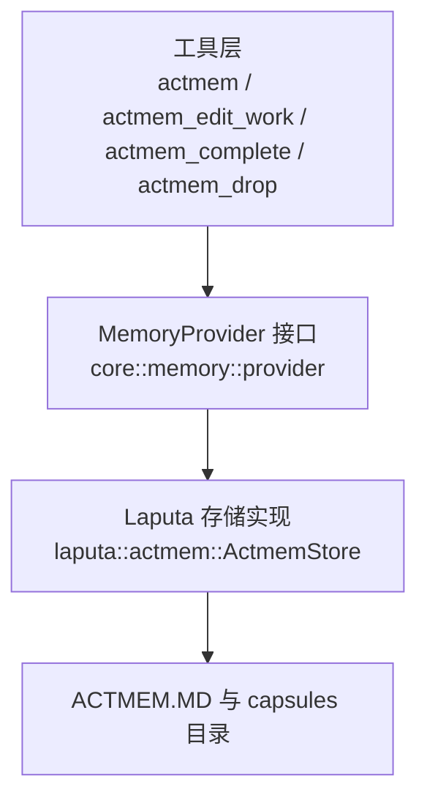
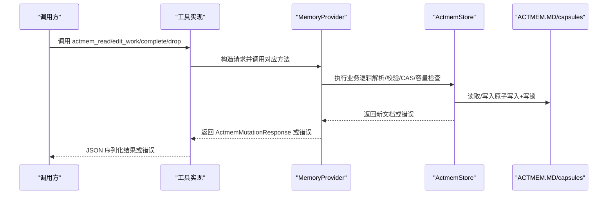

# ACTMEM操作配置

<cite>
**本文引用的文件**
- [agent-diva-core/src/memory/actmem.rs](file://agent-diva-core/src/memory/actmem.rs)
- [agent-diva-core/src/memory/provider.rs](file://agent-diva-core/src/memory/provider.rs)
- [agent-diva-tools/src/actmem.rs](file://agent-diva-tools/src/actmem.rs)
- [agent-diva-tools/src/actmem_edit_work.rs](file://agent-diva-tools/src/actmem_edit_work.rs)
- [agent-diva-tools/src/actmem_item.rs](file://agent-diva-tools/src/actmem_item.rs)
- [agent-diva-laputa/src/actmem.rs](file://agent-diva-laputa/src/actmem.rs)
- [agent-diva-laputa/src/bml/memory_home.rs](file://agent-diva-laputa/src/bml/memory_home.rs)
- [agent-diva-manager/src/handlers/memory.rs](file://agent-diva-manager/src/handlers/memory.rs)
</cite>

## 目录
1. [简介](#简介)
2. [项目结构](#项目结构)
3. [核心组件](#核心组件)
4. [架构总览](#架构总览)
5. [详细组件分析](#详细组件分析)
6. [依赖关系分析](#依赖关系分析)
7. [性能与并发特性](#性能与并发特性)
8. [故障排查指南](#故障排查指南)
9. [结论](#结论)
10. [附录：配置示例与最佳实践](#附录：配置示例与最佳实践)

## 简介
本文件面向“ACTMEM 工作区内存”的读写与变更操作，聚焦以下目标：
- 说明 actmem_read、actmem_edit_work、actmem_complete、actmem_drop 等方法的配置选项与实现要求。
- 解释 ActmemReadRequest、ActmemEditWorkRequest、ActmemItemRequest 等请求数据结构的字段含义与约束。
- 说明 ActmemMutationResponse 的状态码与错误处理策略。
- 阐述工作区内存的生命周期管理与配置策略（容量限制、版本控制、持久化）。
- 提供可操作的配置示例与最佳实践，并覆盖并发安全与数据一致性机制。

## 项目结构
ACTMEM 能力由三层协作构成：
- 工具层（Tools）：暴露 actmem、actmem_edit_work、actmem_complete、actmem_drop 等工具接口，负责参数校验与调用 MemoryProvider。
- 提供者抽象（Core Provider）：定义 MemoryProvider 接口，统一 actmem_* 方法契约，默认返回不可用，由具体实现覆盖。
- 存储实现（Laputa Store）：基于文件的 ACTMEM 文档与胶囊（Capsule）管理，提供 CAS 版本控制、容量限制、原子写入与并发锁。

图表来源
- [agent-diva-tools/src/actmem.rs:32-67](file://agent-diva-tools/src/actmem.rs#L32-L67)
- [agent-diva-tools/src/actmem_edit_work.rs:32-64](file://agent-diva-tools/src/actmem_edit_work.rs#L32-L64)
- [agent-diva-tools/src/actmem_item.rs:51-109](file://agent-diva-tools/src/actmem_item.rs#L51-L109)
- [agent-diva-core/src/memory/provider.rs:528-555](file://agent-diva-core/src/memory/provider.rs#L528-L555)
- [agent-diva-laputa/src/actmem.rs:115-160](file://agent-diva-laputa/src/actmem.rs#L115-L160)

章节来源
- [agent-diva-core/src/memory/actmem.rs:1-50](file://agent-diva-core/src/memory/actmem.rs#L1-L50)
- [agent-diva-core/src/memory/provider.rs:414-617](file://agent-diva-core/src/memory/provider.rs#L414-L617)
- [agent-diva-laputa/src/actmem.rs:15-23](file://agent-diva-laputa/src/actmem.rs#L15-L23)

## 核心组件
- 请求/响应数据结构（核心契约）
  - ActmemReadRequest：包含 target（读取目标）与可选 capsule_name。
  - ActmemEditWorkRequest：指定要替换的 section、replacement 内容与 base_revision。
  - ActmemItemRequest：针对 Work 子项的完成或丢弃，包含 section、item_index、base_revision。
  - ActmemMutationResponse：变更成功后返回 revision 与 updated_at。
- 工具实现
  - actmem：只读投影读取。
  - actmem_edit_work：对 Work 的某个注册子节进行 CAS 替换。
  - actmem_complete：仅允许对 Open 子节的某项执行完成（删除）。
  - actmem_drop：对任意注册子节中的某项执行丢弃（删除）。
- 存储实现
  - ActmemStore：维护 ACTMEM.MD 文档、capsules、容量限制、CAS 版本、原子写入与写锁。

章节来源
- [agent-diva-core/src/memory/actmem.rs:14-44](file://agent-diva-core/src/memory/actmem.rs#L14-L44)
- [agent-diva-tools/src/actmem.rs:32-67](file://agent-diva-tools/src/actmem.rs#L32-L67)
- [agent-diva-tools/src/actmem_edit_work.rs:32-64](file://agent-diva-tools/src/actmem_edit_work.rs#L32-L64)
- [agent-diva-tools/src/actmem_item.rs:51-109](file://agent-diva-tools/src/actmem_item.rs#L51-L109)
- [agent-diva-laputa/src/actmem.rs:115-160](file://agent-diva-laputa/src/actmem.rs#L115-L160)

## 架构总览
ACTMEM 操作从工具到存储的调用链如下：

图表来源
- [agent-diva-tools/src/actmem.rs:53-67](file://agent-diva-tools/src/actmem.rs#L53-L67)
- [agent-diva-tools/src/actmem_edit_work.rs:50-64](file://agent-diva-tools/src/actmem_edit_work.rs#L50-L64)
- [agent-diva-tools/src/actmem_item.rs:65-109](file://agent-diva-tools/src/actmem_item.rs#L65-L109)
- [agent-diva-core/src/memory/provider.rs:528-555](file://agent-diva-core/src/memory/provider.rs#L528-L555)
- [agent-diva-laputa/src/actmem.rs:139-160](file://agent-diva-laputa/src/actmem.rs#L139-L160)

## 详细组件分析

### 读取操作：actmem_read
- 工具入口：actmem 工具将 target 与可选 capsule_name 序列化为 ActmemReadRequest，调用 MemoryProvider.actmem_read。
- 默认行为：未实现的 Provider 返回内部错误；具体实现需支持 Pulse、Recap、Work、Head、Capsules、Capsule 等目标。
- 典型用法：用于获取当前工作区的工作摘要、脉冲记录、回顾摘要或胶囊列表/内容。

章节来源
- [agent-diva-tools/src/actmem.rs:32-67](file://agent-diva-tools/src/actmem.rs#L32-L67)
- [agent-diva-core/src/memory/provider.rs:528-531](file://agent-diva-core/src/memory/provider.rs#L528-L531)
- [agent-diva-core/src/memory/actmem.rs:3-18](file://agent-diva-core/src/memory/actmem.rs#L3-L18)

### 编辑工作区：actmem_edit_work
- 工具入口：actmem_edit_work 工具接收 section、replacement、base_revision，序列化为 ActmemEditWorkRequest 后调用 Provider。
- 业务规则：
  - section 必须为已注册的 Work 子节之一（Goal、Open、Next、Constraints、Pointers）。
  - 使用 base_revision 进行 CAS 比较，防止并发覆盖。
  - 写入前会规范化与容量校验，超出限制将报错。
- 返回值：成功时返回新的 revision 与 updated_at。

章节来源
- [agent-diva-tools/src/actmem_edit_work.rs:32-64](file://agent-diva-tools/src/actmem_edit_work.rs#L32-L64)
- [agent-diva-core/src/memory/actmem.rs:26-31](file://agent-diva-core/src/memory/actmem.rs#L26-L31)
- [agent-diva-laputa/src/actmem.rs:220-236](file://agent-diva-laputa/src/actmem.rs#L220-L236)
- [agent-diva-laputa/src/actmem.rs:497-508](file://agent-diva-laputa/src/actmem.rs#L497-L508)

### 完成工作项：actmem_complete
- 工具入口：actmem_complete 工具接收 section、item_index、base_revision，序列化为 ActmemItemRequest 后调用 Provider。
- 业务规则：
  - 仅允许对 Open 子节执行完成（删除该项），其他 section 将被拒绝。
  - 使用 item_index 定位要完成的项（从零开始）。
  - 使用 base_revision 进行 CAS 比较。
- 返回值：成功时返回新的 revision 与 updated_at。

章节来源
- [agent-diva-tools/src/actmem_item.rs:51-79](file://agent-diva-tools/src/actmem_item.rs#L51-L79)
- [agent-diva-laputa/src/bml/memory_home.rs:770-782](file://agent-diva-laputa/src/bml/memory_home.rs#L770-L782)
- [agent-diva-laputa/src/actmem.rs:238-244](file://agent-diva-laputa/src/actmem.rs#L238-L244)

### 丢弃工作项：actmem_drop
- 工具入口：actmem_drop 工具接收 section、item_index、base_revision，序列化为 ActmemItemRequest 后调用 Provider。
- 业务规则：
  - 可对任意已注册的 Work 子节执行丢弃（删除该项）。
  - 使用 item_index 定位要丢弃的项（从零开始）。
  - 使用 base_revision 进行 CAS 比较。
- 返回值：成功时返回新的 revision 与 updated_at。

章节来源
- [agent-diva-tools/src/actmem_item.rs:81-109](file://agent-diva-tools/src/actmem_item.rs#L81-L109)
- [agent-diva-laputa/src/bml/memory_home.rs:784-796](file://agent-diva-laputa/src/bml/memory_home.rs#L784-L796)
- [agent-diva-laputa/src/actmem.rs:246-267](file://agent-diva-laputa/src/actmem.rs#L246-L267)

### 请求数据结构详解
- ActmemReadRequest
  - target：读取目标（pulse、recap、work、head、capsules、capsule）。
  - capsule_name：当 target 为 capsule 时必填，表示读取指定名称的胶囊。
- ActmemEditWorkRequest
  - section：目标子节（Goal、Open、Next、Constraints、Pointers）。
  - replacement：要替换的内容（会被规范化与容量校验）。
  - base_revision：期望的版本号，用于 CAS 冲突检测。
- ActmemItemRequest
  - section：目标子节（完成/丢弃的上下文）。
  - item_index：要操作的项索引（从零开始）。
  - base_revision：期望的版本号，用于 CAS 冲突检测。
- ActmemMutationResponse
  - revision：新的版本号。
  - updated_at：更新时间戳。

章节来源
- [agent-diva-core/src/memory/actmem.rs:14-44](file://agent-diva-core/src/memory/actmem.rs#L14-L44)

### 生命周期与配置策略
- 容量限制（字符上限）
  - Pulse/Recap 环形缓冲区上限：固定常量。
  - Work 子节上限：固定常量。
  - Capsule 上限：固定常量。
  - 超过限制将触发容量错误。
- 版本控制（CAS）
  - 所有写操作均要求 base_revision，若实际版本不匹配则返回冲突错误。
- 持久化与原子性
  - 使用原子写入确保文档一致性。
  - 通过写锁保证同一时刻只有一个写者。
- 工作区初始化
  - 首次读取不存在时返回空文档，自动构建标准 Work 结构与元数据。

章节来源
- [agent-diva-laputa/src/actmem.rs:15-23](file://agent-diva-laputa/src/actmem.rs#L15-L23)
- [agent-diva-laputa/src/actmem.rs:135-160](file://agent-diva-laputa/src/actmem.rs#L135-L160)
- [agent-diva-laputa/src/actmem.rs:389-403](file://agent-diva-laputa/src/actmem.rs#L389-L403)
- [agent-diva-laputa/src/actmem.rs:412-453](file://agent-diva-laputa/src/actmem.rs#L412-L453)

### 并发安全与数据一致性
- 并发写保护
  - 写路径使用异步互斥锁（tokio::sync::Mutex）串行化写操作，避免竞态。
- 版本一致性
  - 每次写前读取当前文档并校验 base_revision，不一致即返回冲突错误。
- 容量一致性
  - 写前进行容量校验，超限直接失败，避免损坏文档。
- 原子提交
  - 仅在内容变化时递增 revision 并原子写入，减少不必要 I/O。

章节来源
- [agent-diva-laputa/src/actmem.rs:115-121](file://agent-diva-laputa/src/actmem.rs#L115-L121)
- [agent-diva-laputa/src/actmem.rs:139-160](file://agent-diva-laputa/src/actmem.rs#L139-L160)
- [agent-diva-laputa/src/actmem.rs:220-236](file://agent-diva-laputa/src/actmem.rs#L220-L236)
- [agent-diva-laputa/src/actmem.rs:246-267](file://agent-diva-laputa/src/actmem.rs#L246-L267)
- [agent-diva-laputa/src/actmem.rs:389-403](file://agent-diva-laputa/src/actmem.rs#L389-L403)

## 依赖关系分析
- 工具层依赖 Core Provider 接口，屏蔽底层存储细节。
- Core Provider 默认不可用，由 Laputa 实现覆盖，提供具体存储语义。
- Manager HTTP 处理器将 ActmemError 映射为 HTTP 状态码，便于上层客户端处理。

图表来源
- [agent-diva-tools/src/actmem.rs:32-67](file://agent-diva-tools/src/actmem.rs#L32-L67)
- [agent-diva-core/src/memory/provider.rs:528-555](file://agent-diva-core/src/memory/provider.rs#L528-L555)
- [agent-diva-manager/src/handlers/memory.rs:228-244](file://agent-diva-manager/src/handlers/memory.rs#L228-L244)

章节来源
- [agent-diva-manager/src/handlers/memory.rs:228-244](file://agent-diva-manager/src/handlers/memory.rs#L228-L244)

## 性能与并发特性
- 写路径串行化：通过写锁避免并发写导致的竞争条件。
- 增量提交：仅在内容变化时更新 revision 并写入，降低 I/O 压力。
- 容量限制：在写前进行容量检查，避免大对象导致性能退化。
- 只读投影：actmem_read 通常用于快速获取摘要，适合高频读取场景。

[本节为通用性能讨论，不直接分析具体文件]

## 故障排查指南
常见错误与处理建议：
- 版本冲突（RevisionConflict）
  - 现象：返回 CONFLICT 状态码，提示期望与实际版本不一致。
  - 处理：重新读取最新文档，更新 base_revision 后重试。
- 容量超限（CapacityExceeded）
  - 现象：返回 UNPROCESSABLE_ENTITY，提示某部分超出容量。
  - 处理：精简内容或拆分至多个胶囊。
- 未知子节（UnknownWorkSection）
  - 现象：返回 UNPROCESSABLE_ENTITY，提示 Work 子节名称无效。
  - 处理：使用允许的 section 值（Goal、Open、Next、Constraints、Pointers）。
- 索引越界（ItemIndexOutOfRange）
  - 现象：返回 UNPROCESSABLE_ENTITY，提示 item_index 超出范围。
  - 处理：确认当前子节项数量，调整索引。
- 格式错误（Malformed）
  - 现象：返回 UNPROCESSABLE_ENTITY，提示文档结构异常。
  - 处理：检查 front matter、标题与段落结构是否符合规范。
- I/O 错误（Io）
  - 现象：返回 INTERNAL_SERVER_ERROR，提示文件系统异常。
  - 处理：检查磁盘权限、路径是否存在、是否被占用。

章节来源
- [agent-diva-laputa/src/actmem.rs:24-57](file://agent-diva-laputa/src/actmem.rs#L24-L57)
- [agent-diva-manager/src/handlers/memory.rs:228-244](file://agent-diva-manager/src/handlers/memory.rs#L228-L244)

## 结论
ACTMEM 提供了工作区内存的有界、版本化、原子化的读写能力。通过工具层、Provider 抽象与存储实现的清晰分层，既保证了扩展性，又确保了并发安全与数据一致性。配置上应重点关注：
- 严格使用 base_revision 进行 CAS 更新。
- 遵守各部分的容量限制。
- 仅对 Open 子节执行完成操作。
- 合理组织 Work 子节内容，避免冗余与超限。

[本节为总结，不直接分析具体文件]

## 附录：配置示例与最佳实践

### 配置示例
- 读取工作区摘要
  - 工具：actmem
  - 参数：target=work
  - 说明：获取当前 Work 子节内容，用于了解任务状态。
- 编辑工作区子节
  - 工具：actmem_edit_work
  - 参数：section=Open, replacement="新增任务项", base_revision=最新读取的版本
  - 说明：替换指定子节内容，注意容量与格式。
- 完成工作项
  - 工具：actmem_complete
  - 参数：section=Open, item_index=0, base_revision=最新读取的版本
  - 说明：完成 Open 子节的第一项，确保索引有效。
- 丢弃工作项
  - 工具：actmem_drop
  - 参数：section=Next, item_index=1, base_revision=最新读取的版本
  - 说明：丢弃 Next 子节的第二项，确保索引有效。

章节来源
- [agent-diva-tools/src/actmem.rs:42-51](file://agent-diva-tools/src/actmem.rs#L42-L51)
- [agent-diva-tools/src/actmem_edit_work.rs:42-48](file://agent-diva-tools/src/actmem_edit_work.rs#L42-L48)
- [agent-diva-tools/src/actmem_item.rs:43-49](file://agent-diva-tools/src/actmem_item.rs#L43-L49)

### 最佳实践
- 始终先读取再写入：在编辑或修改前，先调用 actmem_read 获取最新版本，避免冲突。
- 小步提交：将大段内容拆分为多次小更新，降低失败回滚成本。
- 监控容量：定期审查各部分大小，及时归档至胶囊。
- 明确所有权：对 Open 子节的操作需谨慎，确保仅对 Open 执行完成。
- 错误重试：遇到版本冲突时，重新读取并重试；遇到容量超限时，精简内容。

章节来源
- [agent-diva-laputa/src/actmem.rs:139-160](file://agent-diva-laputa/src/actmem.rs#L139-L160)
- [agent-diva-laputa/src/actmem.rs:220-236](file://agent-diva-laputa/src/actmem.rs#L220-L236)
- [agent-diva-laputa/src/actmem.rs:246-267](file://agent-diva-laputa/src/actmem.rs#L246-L267)