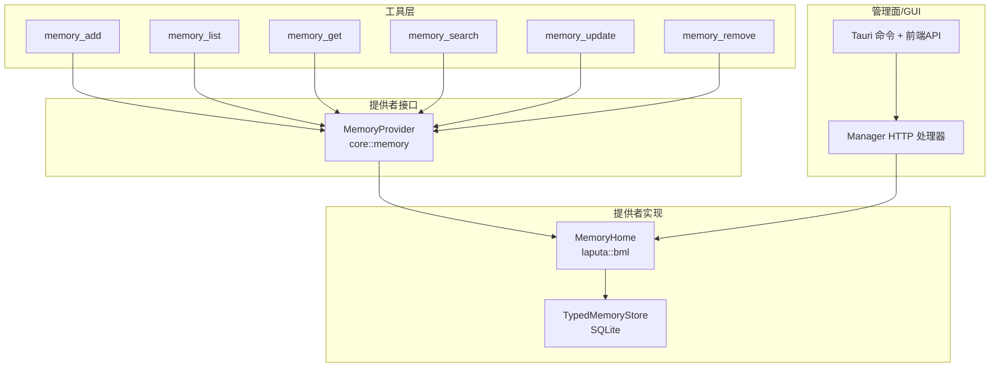
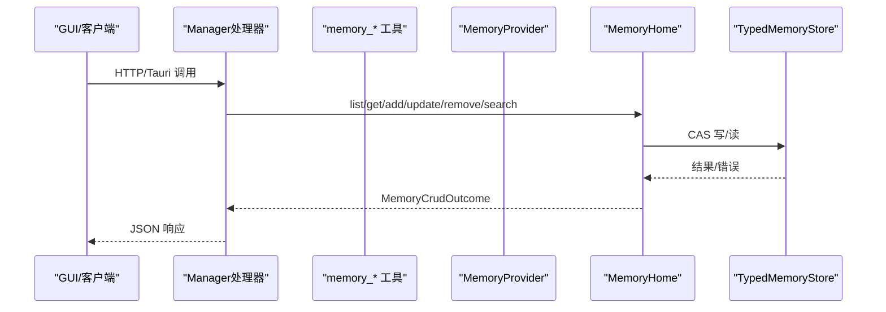
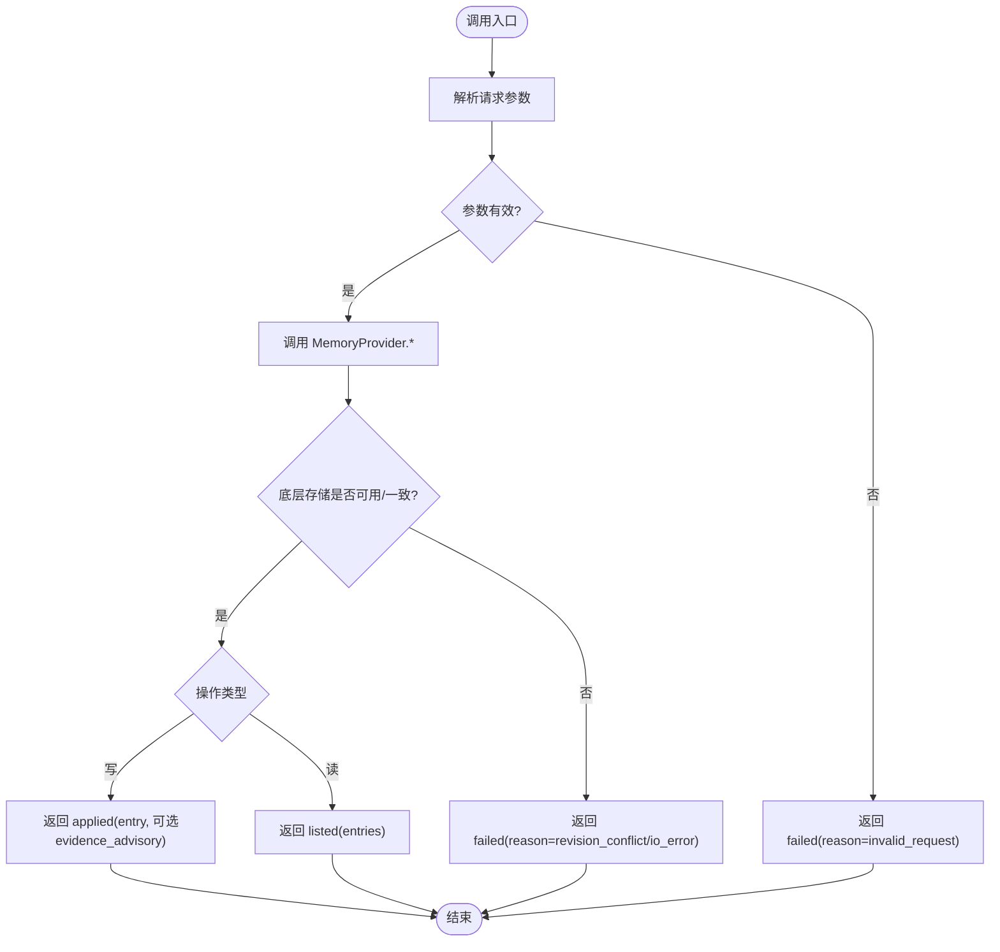
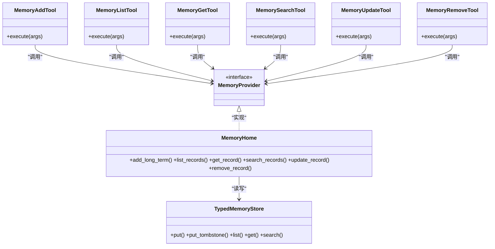

# CRUD操作配置

<cite>
**本文引用的文件**
- [agent-diva-core/src/memory/crud.rs](file://agent-diva-core/src/memory/crud.rs)
- [agent-diva-core/src/memory/mod.rs](file://agent-diva-core/src/memory/mod.rs)
- [agent-diva-tools/src/memory_add.rs](file://agent-diva-tools/src/memory_add.rs)
- [agent-diva-tools/src/memory_list.rs](file://agent-diva-tools/src/memory_list.rs)
- [agent-diva-tools/src/memory_get.rs](file://agent-diva-tools/src/memory_get.rs)
- [agent-diva-tools/src/memory_search.rs](file://agent-diva-tools/src/memory_search.rs)
- [agent-diva-tools/src/memory_update.rs](file://agent-diva-tools/src/memory_update.rs)
- [agent-diva-tools/src/memory_remove.rs](file://agent-diva-tools/src/memory_remove.rs)
- [agent-diva-laputa/src/bml/memory_home.rs](file://agent-diva-laputa/src/bml/memory_home.rs)
- [agent-diva-manager/src/handlers/memory.rs](file://agent-diva-manager/src/handlers/memory.rs)
- [agent-diva-gui/src-tauri/src/commands.rs](file://agent-diva-gui/src-tauri/src/commands.rs)
- [agent-diva-gui/src/api/desktop.ts](file://agent-diva-gui/src/api/desktop.ts)
- [agent-diva-laputa/src/typed_store.rs](file://agent-diva-laputa/src/typed_store.rs)
</cite>

## 目录
1. [简介](#简介)
2. [项目结构](#项目结构)
3. [核心组件](#核心组件)
4. [架构总览](#架构总览)
5. [详细组件分析](#详细组件分析)
6. [依赖关系分析](#依赖关系分析)
7. [性能与并发](#性能与并发)
8. [故障排查指南](#故障排查指南)
9. [结论](#结论)
10. [附录：不同存储后端的CRUD配置示例](#附录：不同存储后端的crud配置示例)

## 简介
本文件面向“记忆（Memory）”的CRUD能力，系统化说明 memory_add、memory_list、memory_get、memory_search、memory_update、memory_remove 等方法的配置选项、实现要求、错误处理策略、权限与访问控制要点，以及事务与并发控制建议。文档同时解释 MemoryCrudContext、请求/响应数据结构与 MemoryCrudOutcome 状态码含义，并提供从工具层到后端存储的端到端调用流程与可观测性建议。

## 项目结构
记忆CRUD能力由三层构成：
- 工具层（agent-diva-tools）：暴露 memory_* 工具，负责参数校验、构造请求上下文并调用 MemoryProvider。
- 提供者实现（agent-diva-laputa）：MemoryHome 作为机器级权威存储，对接 TypedMemoryStore（SQLite）。
- 管理面与GUI（agent-diva-manager、agent-diva-gui）：提供HTTP/Tauri命令封装，便于外部或前端调用。

图表来源
- [agent-diva-tools/src/memory_add.rs:41-88](file://agent-diva-tools/src/memory_add.rs#L41-L88)
- [agent-diva-tools/src/memory_list.rs:41-79](file://agent-diva-tools/src/memory_list.rs#L41-L79)
- [agent-diva-tools/src/memory_get.rs:37-72](file://agent-diva-tools/src/memory_get.rs#L37-L72)
- [agent-diva-tools/src/memory_search.rs:41-79](file://agent-diva-tools/src/memory_search.rs#L41-L79)
- [agent-diva-tools/src/memory_update.rs:41-79](file://agent-diva-tools/src/memory_update.rs#L41-L79)
- [agent-diva-tools/src/memory_remove.rs:41-79](file://agent-diva-tools/src/memory_remove.rs#L41-L79)
- [agent-diva-laputa/src/bml/memory_home.rs:179-200](file://agent-diva-laputa/src/bml/memory_home.rs#L179-L200)
- [agent-diva-manager/src/handlers/memory.rs:66-122](file://agent-diva-manager/src/handlers/memory.rs#L66-L122)
- [agent-diva-gui/src-tauri/src/commands.rs:854-905](file://agent-diva-gui/src-tauri/src/commands.rs#L854-L905)

章节来源
- [agent-diva-core/src/memory/mod.rs:1-47](file://agent-diva-core/src/memory/mod.rs#L1-L47)

## 核心组件
- 请求与上下文
  - MemoryAddRequest：包含 content 与可选 evidence_refs。
  - MemoryListRequest：limit 可选。
  - MemoryGetRequest：record_id。
  - MemorySearchRequest：query 与 limit 可选。
  - MemoryUpdateRequest：record_id、content、base_revision、evidence_refs。
  - MemoryRemoveRequest：record_id、reason、base_revision。
  - MemoryCrudContext：workspace_root，用于工作区范围隔离。
- 结果与条目
  - MemoryEntry：id、content、trust、provenance、evidence_refs、revision、created_at、updated_at。
  - MemoryCrudOutcome：applied/listed/failed 三种状态；失败时携带稳定 reason。
- 提供者接口
  - MemoryProvider：定义 memory_add/list/get/search/update/remove 等方法，统一返回 MemoryCrudOutcome。

章节来源
- [agent-diva-core/src/memory/crud.rs:11-143](file://agent-diva-core/src/memory/crud.rs#L11-L143)
- [agent-diva-core/src/memory/crud.rs:105-136](file://agent-diva-core/src/memory/crud.rs#L105-L136)
- [agent-diva-core/src/memory/mod.rs:17-28](file://agent-diva-core/src/memory/mod.rs#L17-L28)

## 架构总览
记忆写入与读取通过“工具→提供者→存储”的链路完成，所有写操作均基于比较交换（CAS）的 revision 机制保证一致性；读操作投影“已应用”的权威视图。

图表来源
- [agent-diva-manager/src/handlers/memory.rs:66-122](file://agent-diva-manager/src/handlers/memory.rs#L66-L122)
- [agent-diva-laputa/src/bml/memory_home.rs:588-660](file://agent-diva-laputa/src/bml/memory_home.rs#L588-L660)
- [agent-diva-laputa/src/typed_store.rs:881-1022](file://agent-diva-laputa/src/typed_store.rs#L881-L1022)

## 详细组件分析

### memory_add（新增）
- 输入
  - content：必填，用户确认的事实或偏好。
  - evidence_refs：可选，证据引用（B9部分）。
- 行为
  - 工具解析参数，构建 MemoryCrudContext，调用 provider.memory_add。
  - 若未配置 provider 或 workspace，直接返回 failed。
  - 成功时返回 applied，可能附带 evidence_advisory 提示缺少证据。
- 关键约束
  - 无证据写入会被标记为“无工具验证证据”的提示。
- 参考路径
  - [工具实现:41-88](file://agent-diva-tools/src/memory_add.rs#L41-L88)
  - [提供者映射:588-605](file://agent-diva-laputa/src/bml/memory_home.rs#L588-L605)
  - [结果类型:105-136](file://agent-diva-core/src/memory/crud.rs#L105-L136)

章节来源
- [agent-diva-tools/src/memory_add.rs:41-88](file://agent-diva-tools/src/memory_add.rs#L41-L88)
- [agent-diva-laputa/src/bml/memory_home.rs:588-605](file://agent-diva-laputa/src/bml/memory_home.rs#L588-L605)
- [agent-diva-core/src/memory/crud.rs:105-136](file://agent-diva-core/src/memory/crud.rs#L105-L136)

### memory_list（列出）
- 输入
  - limit：可选，限制返回条数。
- 行为
  - 工具调用 provider.memory_list，返回 listed(entries)。
  - 列表仅展示可见的“已应用”记录（过滤被覆盖项）。
- 参考路径
  - [工具实现:41-79](file://agent-diva-tools/src/memory_list.rs#L41-L79)
  - [提供者映射:607-620](file://agent-diva-laputa/src/bml/memory_home.rs#L607-L620)
  - [可见性过滤:179-190](file://agent-diva-laputa/src/bml/memory_home.rs#L179-L190)

章节来源
- [agent-diva-tools/src/memory_list.rs:41-79](file://agent-diva-tools/src/memory_list.rs#L41-L79)
- [agent-diva-laputa/src/bml/memory_home.rs:179-190](file://agent-diva-laputa/src/bml/memory_home.rs#L179-L190)
- [agent-diva-laputa/src/bml/memory_home.rs:607-620](file://agent-diva-laputa/src/bml/memory_home.rs#L607-L620)

### memory_get（获取）
- 输入
  - record_id：必填，稳定ID。
- 行为
  - 返回单个条目或 failed(memory_not_found)。
- 参考路径
  - [工具实现:37-72](file://agent-diva-tools/src/memory_get.rs#L37-L72)
  - [提供者映射:622-638](file://agent-diva-laputa/src/bml/memory_home.rs#L622-L638)

章节来源
- [agent-diva-tools/src/memory_get.rs:37-72](file://agent-diva-tools/src/memory_get.rs#L37-L72)
- [agent-diva-laputa/src/bml/memory_home.rs:622-638](file://agent-diva-laputa/src/bml/memory_home.rs#L622-L638)

### memory_search（搜索）
- 输入
  - query：必填，空查询将返回 failed。
  - limit：可选。
- 行为
  - 对已应用权威进行全文检索，返回 listed(entries)。
- 参考路径
  - [工具实现:41-79](file://agent-diva-tools/src/memory_search.rs#L41-L79)
  - [提供者映射:640-660](file://agent-diva-laputa/src/bml/memory_home.rs#L640-L660)

章节来源
- [agent-diva-tools/src/memory_search.rs:41-79](file://agent-diva-tools/src/memory_search.rs#L41-L79)
- [agent-diva-laputa/src/bml/memory_home.rs:640-660](file://agent-diva-laputa/src/bml/memory_home.rs#L640-L660)

### memory_update（更新）
- 输入
  - record_id、content、base_revision：必填。
  - evidence_refs：可选。
- 行为
  - 使用 base_revision 做CAS更新；版本不匹配则失败。
- 参考路径
  - [工具实现:41-79](file://agent-diva-tools/src/memory_update.rs#L41-L79)
  - [底层CAS实现:881-1022](file://agent-diva-laputa/src/typed_store.rs#L881-L1022)

章节来源
- [agent-diva-tools/src/memory_update.rs:41-79](file://agent-diva-tools/src/memory_update.rs#L41-L79)
- [agent-diva-laputa/src/typed_store.rs:881-1022](file://agent-diva-laputa/src/typed_store.rs#L881-L1022)

### memory_remove（删除）
- 输入
  - record_id、reason、base_revision：必填。
- 行为
  - 软删除（墓碑），立即隐藏；版本不匹配则失败。
- 参考路径
  - [工具实现:41-79](file://agent-diva-tools/src/memory_remove.rs#L41-L79)
  - [墓碑写入与冲突处理:897-1022](file://agent-diva-laputa/src/typed_store.rs#L897-L1022)

章节来源
- [agent-diva-tools/src/memory_remove.rs:41-79](file://agent-diva-tools/src/memory_remove.rs#L41-L79)
- [agent-diva-laputa/src/typed_store.rs:897-1022](file://agent-diva-laputa/src/typed_store.rs#L897-L1022)

### 数据流与状态机

图表来源
- [agent-diva-core/src/memory/crud.rs:105-136](file://agent-diva-core/src/memory/crud.rs#L105-L136)
- [agent-diva-laputa/src/bml/memory_home.rs:588-660](file://agent-diva-laputa/src/bml/memory_home.rs#L588-L660)
- [agent-diva-laputa/src/typed_store.rs:881-1022](file://agent-diva-laputa/src/typed_store.rs#L881-L1022)

## 依赖关系分析
- 工具层依赖 core::memory 的请求/结果类型与 MemoryProvider 接口。
- Laputa 的 MemoryHome 实现 MemoryProvider，并组合 TypedMemoryStore 进行持久化。
- Manager 暴露HTTP路由，GUI通过Tauri命令调用Manager API或直接调用本地服务。

图表来源
- [agent-diva-tools/src/memory_add.rs:41-88](file://agent-diva-tools/src/memory_add.rs#L41-L88)
- [agent-diva-tools/src/memory_list.rs:41-79](file://agent-diva-tools/src/memory_list.rs#L41-L79)
- [agent-diva-tools/src/memory_get.rs:37-72](file://agent-diva-tools/src/memory_get.rs#L37-L72)
- [agent-diva-tools/src/memory_search.rs:41-79](file://agent-diva-tools/src/memory_search.rs#L41-L79)
- [agent-diva-tools/src/memory_update.rs:41-79](file://agent-diva-tools/src/memory_update.rs#L41-L79)
- [agent-diva-tools/src/memory_remove.rs:41-79](file://agent-diva-tools/src/memory_remove.rs#L41-L79)
- [agent-diva-laputa/src/bml/memory_home.rs:179-200](file://agent-diva-laputa/src/bml/memory_home.rs#L179-L200)
- [agent-diva-laputa/src/typed_store.rs:881-1022](file://agent-diva-laputa/src/typed_store.rs#L881-L1022)

章节来源
- [agent-diva-core/src/memory/mod.rs:1-47](file://agent-diva-core/src/memory/mod.rs#L1-L47)

## 性能与并发
- 事务与一致性
  - 写操作在 TypedMemoryStore 中以事务执行，并通过 store_revision 与 record_revision 双重CAS确保并发安全。
  - 并发写冲突会返回 StoreRevisionConflict/RecordRevisionConflict，调用方应重试或提示用户刷新。
- 容量与预算
  - 写入前检查记录数量与内容字节上限，超限将拒绝写入。
- I/O与缓存
  - MemoryHome 维护一个惰性打开的 TypedMemoryStore 实例，首次写入/读取时按需打开数据库。
- 建议
  - 批量更新尽量合并以减少事务次数。
  - 高并发场景下，客户端需实现指数退避重试以应对冲突。

章节来源
- [agent-diva-laputa/src/typed_store.rs:881-1022](file://agent-diva-laputa/src/typed_store.rs#L881-L1022)
- [agent-diva-laputa/src/bml/memory_home.rs:153-177](file://agent-diva-laputa/src/bml/memory_home.rs#L153-L177)

## 故障排查指南
- 常见错误与原因
  - memory_not_found：get 时记录不存在。
  - memory_revision_conflict：update/remove 的 base_revision 过期。
  - bml_unavailable：底层存储不可用或I/O失败。
  - memory_invalid_request：参数校验失败或空查询。
- 定位步骤
  - 先调用 memory_list 获取最新 revision，再执行 update/remove。
  - 若返回 capacity exceeded，减少内容或清理旧记录。
  - 检查日志中的 error code 与 reason，对应上述分类。
- 恢复策略
  - 冲突：重新拉取最新记录并重试。
  - 容量：归档或压缩历史内容。
  - I/O：重启服务或修复磁盘/权限问题。

章节来源
- [agent-diva-laputa/src/bml/memory_home.rs:39-70](file://agent-diva-laputa/src/bml/memory_home.rs#L39-L70)
- [agent-diva-laputa/src/typed_store.rs:933-1022](file://agent-diva-laputa/src/typed_store.rs#L933-L1022)

## 结论
本CRUD体系通过统一的请求/结果模型与CAS机制，实现了跨工具、管理器与GUI的一致语义。建议在业务侧遵循“先读后写”的revision模式，结合错误码与重试策略，保障在高并发与异常条件下的稳定性与可恢复性。

## 附录：不同存储后端的CRUD配置示例
以下示例以当前仓库中 SQLite（TypedMemoryStore）为例，展示典型调用与配置要点。其他后端需实现 MemoryProvider 并复用相同请求/结果模型。

- 新增（memory_add）
  - 请求字段：content、evidence_refs（可选）。
  - 期望结果：status=applied，entry 包含 id、revision、timestamps。
  - 参考路径：[工具实现:41-88](file://agent-diva-tools/src/memory_add.rs#L41-L88)、[提供者映射:588-605](file://agent-diva-laputa/src/bml/memory_home.rs#L588-L605)
- 列出（memory_list）
  - 请求字段：limit（可选）。
  - 期望结果：status=listened，entries 数组。
  - 参考路径：[工具实现:41-79](file://agent-diva-tools/src/memory_list.rs#L41-L79)、[提供者映射:607-620](file://agent-diva-laputa/src/bml/memory_home.rs#L607-L620)
- 获取（memory_get）
  - 请求字段：record_id。
  - 期望结果：status=listened，entries 含单条；或 status=failed(reason=memory_not_found)。
  - 参考路径：[工具实现:37-72](file://agent-diva-tools/src/memory_get.rs#L37-L72)、[提供者映射:622-638](file://agent-diva-laputa/src/bml/memory_home.rs#L622-L638)
- 搜索（memory_search）
  - 请求字段：query（必填）、limit（可选）。
  - 期望结果：status=listened，entries；空查询返回 failed。
  - 参考路径：[工具实现:41-79](file://agent-diva-tools/src/memory_search.rs#L41-L79)、[提供者映射:640-660](file://agent-diva-laputa/src/bml/memory_home.rs#L640-L660)
- 更新（memory_update）
  - 请求字段：record_id、content、base_revision（必填）、evidence_refs（可选）。
  - 期望结果：status=applied；revision冲突返回 failed。
  - 参考路径：[工具实现:41-79](file://agent-diva-tools/src/memory_update.rs#L41-L79)、[CAS实现:881-1022](file://agent-diva-laputa/src/typed_store.rs#L881-L1022)
- 删除（memory_remove）
  - 请求字段：record_id、reason、base_revision（必填）。
  - 期望结果：status=applied；revision冲突返回 failed。
  - 参考路径：[工具实现:41-79](file://agent-diva-tools/src/memory_remove.rs#L41-L79)、[墓碑实现:897-1022](file://agent-diva-laputa/src/typed_store.rs#L897-L1022)

管理与GUI集成示例
- Manager HTTP
  - POST /api/memory/records → create_memory_record_handler
  - GET /api/memory/records/:id → get_memory_record_handler
  - PATCH /api/memory/records/:id → update_memory_record_handler
  - DELETE /api/memory/records/:id → delete_memory_record_handler
  - 参考路径：[处理器:66-122](file://agent-diva-manager/src/handlers/memory.rs#L66-L122)
- Tauri命令与前端API
  - memory_create_record、memory_get_record、memory_update_record、memory_delete_record
  - 参考路径：[Tauri命令:854-905](file://agent-diva-gui/src-tauri/src/commands.rs#L854-L905)、[前端API:628-666](file://agent-diva-gui/src/api/desktop.ts#L628-L666)

权限与访问策略
- 当前代码库中，MemoryHome 作为机器级权威存储，未在本文件中看到显式的细粒度权限控制逻辑。生产环境建议：
  - 在 Manager 层增加鉴权中间件（如基于角色/工作区的访问控制）。
  - 在工具注册阶段限制可调用方法（例如只读工具集）。
  - 审计与追踪：利用 AuditCorrelation 关联每次CRUD操作的审计上下文。

事务与并发控制策略
- 写操作必须携带 base_revision，服务端以 store_revision 与 record_revision 双重CAS保护。
- 客户端遇到冲突错误时应：
  - 重新读取最新记录（memory_get/memory_list）。
  - 修正 base_revision 后重试。
  - 设置合理重试上限与退避策略。