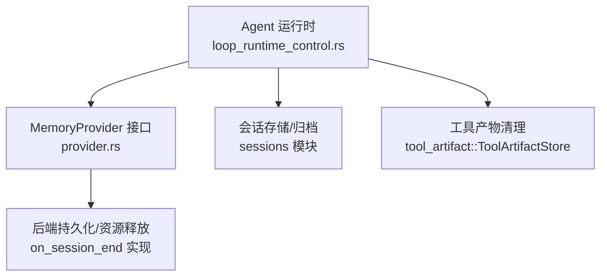
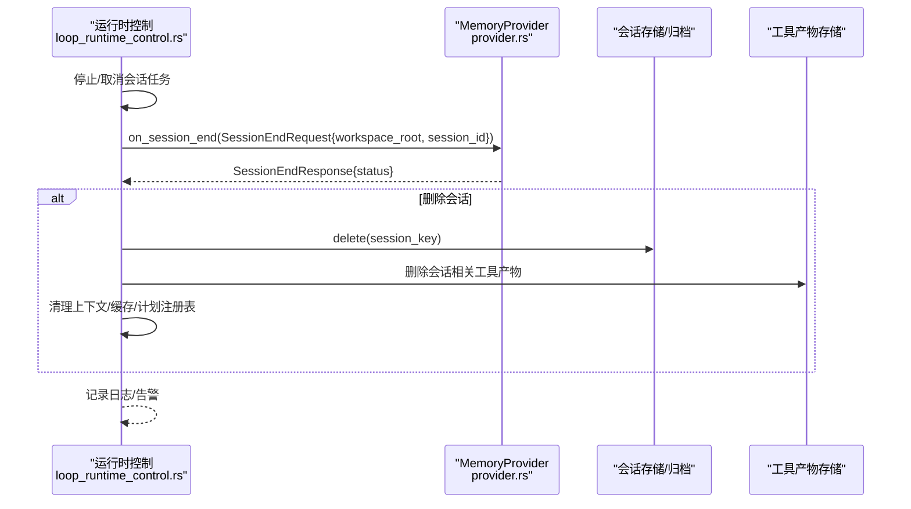
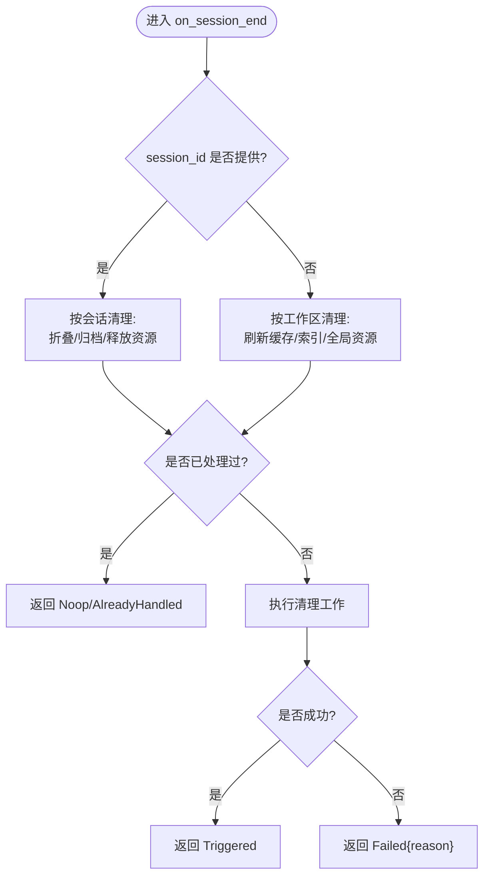
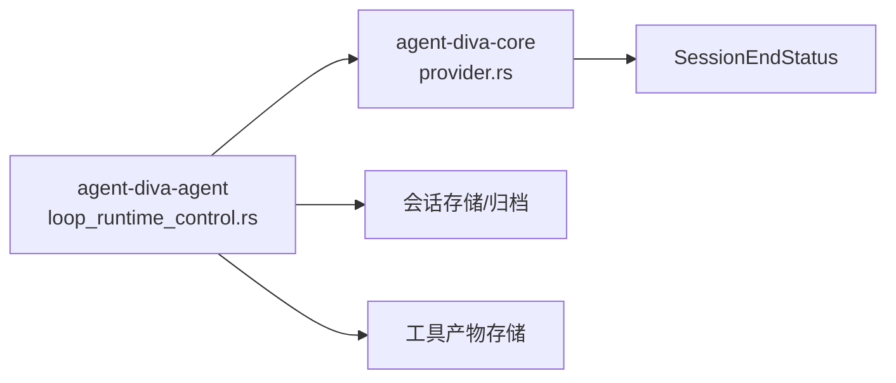

# 会话结束配置

<cite>
**本文引用的文件**
- [agent-diva-core/src/memory/provider.rs](file://agent-diva-core/src/memory/provider.rs)
- [agent-diva-agent/src/agent_loop/loop_runtime_control.rs](file://agent-diva-agent/src/agent_loop/loop_runtime_control.rs)
- [agent-diva-agent/src/agent_loop.rs](file://agent-diva-agent/src/agent_loop.rs)
- [agent-diva-agent/src/agent_loop/turn/context.rs](file://agent-diva-agent/src/agent_loop/turn/context.rs)
- [agent-diva-core/src/error.rs](file://agent-diva-core/src/error.rs)
</cite>

## 目录
1. [简介](#简介)
2. [项目结构](#项目结构)
3. [核心组件](#核心组件)
4. [架构总览](#架构总览)
5. [详细组件分析](#详细组件分析)
6. [依赖关系分析](#依赖关系分析)
7. [性能考虑](#性能考虑)
8. [故障排查指南](#故障排查指南)
9. [结论](#结论)
10. [附录](#附录)

## 简介
本文件聚焦“会话结束”能力，围绕 MemoryProvider 的 on_session_end() 钩子展开，说明其输入 SessionEndRequest、输出 SessionEndResponse 与状态枚举 SessionEndStatus 的配置含义与使用场景；解释 workspace_root 与 session_id 字段在清理策略中的作用；给出幂等性处理建议；并总结错误处理与恢复机制。

## 项目结构
与会话结束相关的代码主要分布在：
- 契约定义：agent-diva-core 中的 MemoryProvider trait 及其请求/响应类型
- 调用方：agent-diva-agent 的运行时控制流程（重置/删除会话时触发）
- 测试与示例：agent-loop 中用于验证 on_session_end 行为的测试实现

图表来源
- [agent-diva-agent/src/agent_loop/loop_runtime_control.rs:80-195](file://agent-diva-agent/src/agent_loop/loop_runtime_control.rs#L80-L195)
- [agent-diva-core/src/memory/provider.rs:364-389](file://agent-diva-core/src/memory/provider.rs#L364-L389)

章节来源
- [agent-diva-agent/src/agent_loop/loop_runtime_control.rs:80-195](file://agent-diva-agent/src/agent_loop/loop_runtime_control.rs#L80-L195)
- [agent-diva-core/src/memory/provider.rs:364-389](file://agent-diva-core/src/memory/provider.rs#L364-L389)

## 核心组件
- SessionEndRequest：会话结束请求，包含 workspace_root 与 session_id
- SessionEndResponse：会话结束响应，包含 status
- SessionEndStatus：会话结束状态枚举，包括 Triggered、Noop、AlreadyHandled、Failed{reason}
- MemoryProvider::on_session_end：异步钩子，用于执行会话结束时的收尾工作（如折叠 ACTMEM、刷新缓存、通知外部系统等）

章节来源
- [agent-diva-core/src/memory/provider.rs:364-389](file://agent-diva-core/src/memory/provider.rs#L364-L389)
- [agent-diva-core/src/memory/provider.rs:100-111](file://agent-diva-core/src/memory/provider.rs#L100-L111)

## 架构总览
会话结束时，Agent 运行时会在多个路径触发 on_session_end：
- 重置会话：停止运行、取消等待者、调用 on_session_end、释放冻结核心、清理上下文缓存、归档并重置会话
- 删除会话：停止运行、删除会话、调用 on_session_end、删除工具产物、释放冻结核心、清理缓存与计划注册表

图表来源
- [agent-diva-agent/src/agent_loop/loop_runtime_control.rs:80-195](file://agent-diva-agent/src/agent_loop/loop_runtime_control.rs#L80-L195)
- [agent-diva-core/src/memory/provider.rs:364-389](file://agent-diva-core/src/memory/provider.rs#L364-L389)

## 详细组件分析

### SessionEndRequest 字段说明
- workspace_root：当前 Agent 会话所在的工作区根路径。用于定位工作区内的资源、索引或本地状态，确保清理操作作用于正确的范围。
- session_id：可选的 Agent 会话标识。当提供时，可用于精确识别要清理的会话（例如按会话维度折叠 ACTMEM、清理临时文件）。未提供时，可视为全局或默认清理策略。

章节来源
- [agent-diva-core/src/memory/provider.rs:364-389](file://agent-diva-core/src/memory/provider.rs#L364-L389)
- [agent-diva-agent/src/agent_loop/loop_runtime_control.rs:80-195](file://agent-diva-agent/src/agent_loop/loop_runtime_control.rs#L80-L195)

### SessionEndStatus 枚举与使用场景
- Triggered：已触发并完成收尾工作。适用于成功执行了清理/折叠/同步等操作。
- Noop：无需处理。适用于无活跃会话或无需清理的情况。
- AlreadyHandled：幂等忽略。适用于重复调用或已被其他路径处理的场景。
- Failed{reason}：失败。适用于 I/O、网络、权限等异常，需记录原因以便诊断。

章节来源
- [agent-diva-core/src/memory/provider.rs:100-111](file://agent-diva-core/src/memory/provider.rs#L100-L111)

### on_session_end() 实现要求
- 职责边界：仅做会话结束的收尾工作，不应替代 turn 后的 sync_turn() 写入。
- 幂等性：必须能安全地处理重复调用，避免重复副作用。
- 非阻塞与健壮性：尽量快速完成；对可恢复错误优先返回状态而非抛出顶层错误。
- 可观测性：对失败应记录 reason，便于追踪问题。

章节来源
- [agent-diva-core/src/memory/provider.rs:391-413](file://agent-diva-core/src/memory/provider.rs#L391-L413)
- [agent-diva-core/src/memory/provider.rs:611-617](file://agent-diva-core/src/memory/provider.rs#L611-L617)

### 调用点与清理策略
- 重置会话：先停止运行并取消等待者，再调用 on_session_end，随后释放冻结核心、清理上下文缓存、归档并重置会话。
- 删除会话：在删除会话后调用 on_session_end，然后删除工具产物、释放冻结核心、清理缓存与计划注册表。

图表来源
- [agent-diva-agent/src/agent_loop/loop_runtime_control.rs:80-195](file://agent-diva-agent/src/agent_loop/loop_runtime_control.rs#L80-L195)
- [agent-diva-core/src/memory/provider.rs:100-111](file://agent-diva-core/src/memory/provider.rs#L100-L111)

### 幂等性处理配置示例
- 基于 session_id 的去重：维护一个最近处理过的会话集合或时间戳，若检测到重复则直接返回 AlreadyHandled。
- 基于工作区的幂等：对全局清理操作采用“幂等写”策略（如只写一次、幂等删除），避免重复副作用。
- 测试参考：测试中通过设置标志位并在多次调用时返回不同状态，验证幂等行为。

章节来源
- [agent-diva-agent/src/agent_loop.rs:2438-2446](file://agent-diva-agent/src/agent_loop.rs#L2438-L2446)
- [agent-diva-core/src/memory/provider.rs:100-111](file://agent-diva-core/src/memory/provider.rs#L100-L111)

### 错误处理与恢复机制
- 调用方容错：运行时在调用 on_session_end 出错时记录警告日志，不阻断主流程（如归档/删除继续执行）。
- 提供者侧错误：优先返回 SessionEndStatus::Failed{reason}，由上层统一记录与告警。
- 资源清理顺序：先停止/取消任务，再进行 I/O 清理；I/O 失败不影响后续必要清理步骤。

章节来源
- [agent-diva-agent/src/agent_loop/loop_runtime_control.rs:80-195](file://agent-diva-agent/src/agent_loop/loop_runtime_control.rs#L80-L195)
- [agent-diva-core/src/error.rs:1-73](file://agent-diva-core/src/error.rs#L1-L73)

## 依赖关系分析
- agent-diva-agent 依赖 agent-diva-core 的 MemoryProvider 契约
- 运行时控制逻辑在重置/删除会话时构造 SessionEndRequest 并调用 on_session_end
- 清理流程还涉及会话存储、工具产物存储、上下文缓存与计划注册表

图表来源
- [agent-diva-agent/src/agent_loop/loop_runtime_control.rs:80-195](file://agent-diva-agent/src/agent_loop/loop_runtime_control.rs#L80-L195)
- [agent-diva-core/src/memory/provider.rs:364-389](file://agent-diva-core/src/memory/provider.rs#L364-L389)

章节来源
- [agent-diva-agent/src/agent_loop/loop_runtime_control.rs:80-195](file://agent-diva-agent/src/agent_loop/loop_runtime_control.rs#L80-L195)
- [agent-diva-core/src/memory/provider.rs:364-389](file://agent-diva-core/src/memory/provider.rs#L364-L389)

## 性能考虑
- on_session_end 应尽量轻量，避免长耗时 I/O；必要时拆分到后台任务。
- 幂等检查应在内存中进行，减少额外查询。
- 批量清理优于逐条清理，降低系统调用次数。
- 对可恢复错误采用降级策略，保证主流程不受影响。

## 故障排查指南
- 常见问题
  - on_session_end 未触发：检查是否在重置/删除会话路径正确调用。
  - 重复清理导致副作用：确认幂等逻辑是否生效（AlreadyHandled）。
  - 清理失败：查看 Failed 状态的 reason 与日志，定位 I/O 或权限问题。
- 定位步骤
  - 检查调用点日志（warn/error）
  - 核对 workspace_root 与 session_id 是否正确传入
  - 验证提供者实现是否遵循契约（职责边界、幂等、错误处理）

章节来源
- [agent-diva-agent/src/agent_loop/loop_runtime_control.rs:80-195](file://agent-diva-agent/src/agent_loop/loop_runtime_control.rs#L80-L195)
- [agent-diva-core/src/memory/provider.rs:100-111](file://agent-diva-core/src/memory/provider.rs#L100-L111)

## 结论
on_session_end() 是会话生命周期的重要收尾钩子，配合 SessionEndRequest 的 workspace_root 与 session_id，可实现精准且幂等的清理策略。通过 SessionEndStatus 明确表达执行结果，结合调用方的容错与日志，保障系统在异常情况下仍可稳定运行。

## 附录
- 相关上下文构建中也使用 workspace_root 与 session_id 进行预取与同步，保持跨阶段的一致性。

章节来源
- [agent-diva-agent/src/agent_loop/turn/context.rs:420-450](file://agent-diva-agent/src/agent_loop/turn/context.rs#L420-L450)