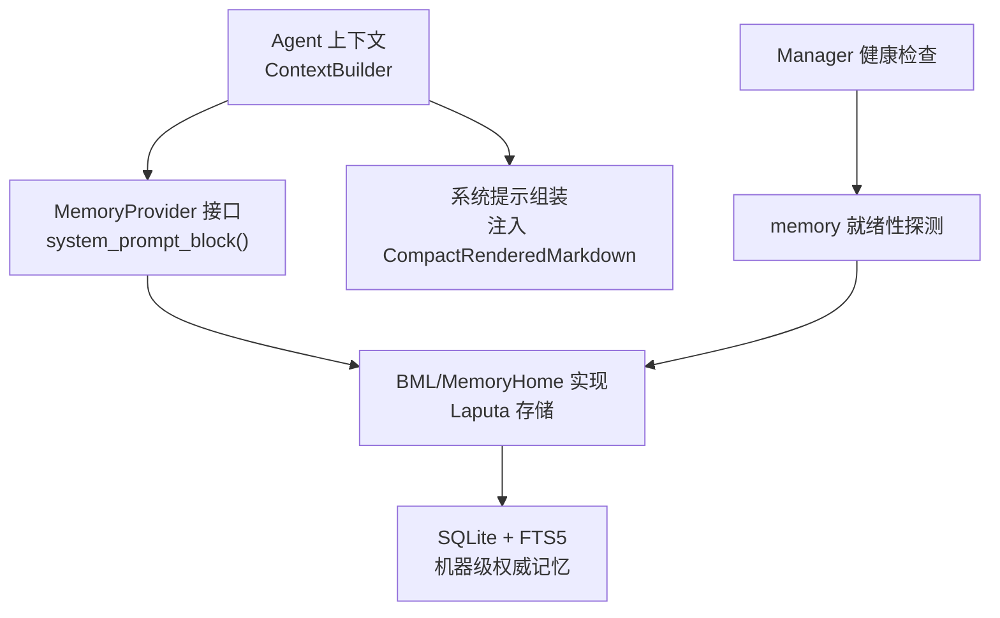
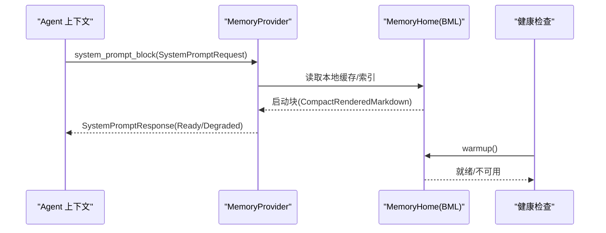
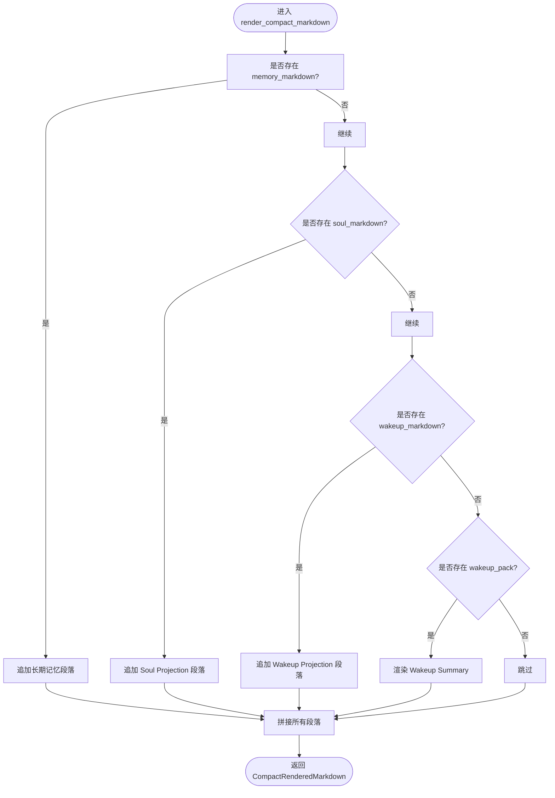
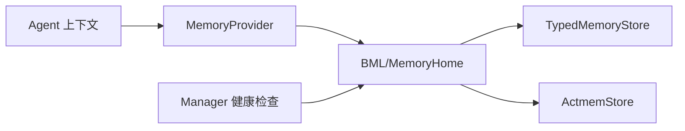

# 启动唤醒配置

<cite>
**本文引用的文件**
- [agent-diva-core/src/memory/provider.rs](file://agent-diva-core/src/memory/provider.rs)
- [agent-diva-agent/src/context.rs](file://agent-diva-agent/src/context.rs)
- [agent-diva-laputa/src/bml/mod.rs](file://agent-diva-laputa/src/bml/mod.rs)
- [agent-diva-laputa/src/bml/memory_home.rs](file://agent-diva-laputa/src/bml/memory_home.rs)
- [agent-diva-manager/src/handlers/health.rs](file://agent-diva-manager/src/handlers/health.rs)
- [agent-diva-core/src/error.rs](file://agent-diva-core/src/error.rs)
</cite>

## 目录
1. [简介](#简介)
2. [项目结构](#项目结构)
3. [核心组件](#核心组件)
4. [架构总览](#架构总览)
5. [详细组件分析](#详细组件分析)
6. [依赖关系分析](#依赖关系分析)
7. [性能考虑](#性能考虑)
8. [故障排查指南](#故障排查指南)
9. [结论](#结论)
10. [附录](#附录)

## 简介
本文件聚焦 Agent-Diva 的“启动唤醒”能力，围绕 MemoryProvider 的 system_prompt_block() 方法展开，说明其配置选项、实现约束与消费方式；解释 StartupStatus（Ready、Degraded）的含义与使用场景；定义 SystemPromptRequest、SystemPromptResponse、SystemPromptBlock、StartupInjectionShape::CompactRenderedMarkdown 的数据结构与格式规范；并给出 BML/Laputa 存储后端的启动配置要点、降级策略与错误恢复机制。

## 项目结构
- 契约层：agent-diva-core 暴露 MemoryProvider 接口与启动相关数据结构，确保上层调用方不感知具体后端。
- 代理层：agent-diva-agent 在上下文构建阶段调用 MemoryProvider.system_prompt_block()，将返回的启动块注入系统提示。
- 存储层：agent-diva-laputa 提供 BML/MemoryHome 实现，负责持久化、索引与启动投影渲染。
- 健康检查：agent-diva-manager 通过 health 端点暴露 memory 组件状态，便于外部监控。

图表来源
- [agent-diva-agent/src/context.rs:134-1634](file://agent-diva-agent/src/context.rs#L134-L1634)
- [agent-diva-core/src/memory/provider.rs:414-423](file://agent-diva-core/src/memory/provider.rs#L414-L423)
- [agent-diva-laputa/src/bml/memory_home.rs:102-151](file://agent-diva-laputa/src/bml/memory_home.rs#L102-L151)
- [agent-diva-manager/src/handlers/health.rs:77-92](file://agent-diva-manager/src/handlers/health.rs#L77-L92)

章节来源
- [agent-diva-core/src/memory/provider.rs:1-770](file://agent-diva-core/src/memory/provider.rs#L1-L770)
- [agent-diva-agent/src/context.rs:134-1634](file://agent-diva-agent/src/context.rs#L134-L1634)
- [agent-diva-laputa/src/bml/mod.rs:1-37](file://agent-diva-laputa/src/bml/mod.rs#L1-L37)
- [agent-diva-laputa/src/bml/memory_home.rs:1-200](file://agent-diva-laputa/src/bml/memory_home.rs#L1-L200)
- [agent-diva-manager/src/handlers/health.rs:40-125](file://agent-diva-manager/src/handlers/health.rs#L40-L125)

## 核心组件
- MemoryProvider 接口：定义 system_prompt_block()、prefetch()、sync_turn()、on_session_end() 等生命周期方法。其中 system_prompt_block() 为同步方法，仅允许读取本地缓存或内存态数据，禁止异步 I/O 与阻塞操作。
- StartupStatus：枚举 Ready/Degraded，用于表达启动内容是否可用。
- SystemPromptRequest/Response/Block：请求参数、响应结果与注入块。
- StartupInjectionShape：当前唯一形态 CompactRenderedMarkdown，表示可直接拼入系统提示的紧凑 Markdown。
- StartupContextSnapshot/WakeupPackSummary：结构化启动数据，可渲染为 CompactRenderedMarkdown。

章节来源
- [agent-diva-core/src/memory/provider.rs:22-75](file://agent-diva-core/src/memory/provider.rs#L22-L75)
- [agent-diva-core/src/memory/provider.rs:113-180](file://agent-diva-core/src/memory/provider.rs#L113-L180)
- [agent-diva-core/src/memory/provider.rs:237-279](file://agent-diva-core/src/memory/provider.rs#L237-L279)
- [agent-diva-core/src/memory/provider.rs:414-423](file://agent-diva-core/src/memory/provider.rs#L414-L423)

## 架构总览
启动唤醒的关键路径如下：
- Agent 上下文构建时构造 SystemPromptRequest，调用 MemoryProvider.system_prompt_block()。
- 存储后端（如 Laputa/BML）基于本地缓存或已打开的数据库，生成 CompactRenderedMarkdown 启动块。
- 若无法生成有效启动内容，则返回 Degraded 状态，并附带最小化的降级提示块。
- 管理器健康探针通过 MemoryHome.warmup() 探测 memory 组件可用性，对外暴露 ready/degraded。

图表来源
- [agent-diva-agent/src/context.rs:134-1634](file://agent-diva-agent/src/context.rs#L134-L1634)
- [agent-diva-core/src/memory/provider.rs:414-423](file://agent-diva-core/src/memory/provider.rs#L414-L423)
- [agent-diva-laputa/src/bml/memory_home.rs:147-151](file://agent-diva-laputa/src/bml/memory_home.rs#L147-L151)
- [agent-diva-manager/src/handlers/health.rs:77-92](file://agent-diva-manager/src/handlers/health.rs#L77-L92)

## 详细组件分析

### system_prompt_block() 方法与实现要求
- 同步调用：该方法必须在同步上下文中完成，不得发起异步 I/O、网络请求或阻塞工作。
- 无副作用：从调用者视角应为纯读操作，仅读取本地缓存或进程内状态。
- 返回类型：必须返回 SystemPromptResponse，包含 StartupStatus 和可选的 SystemPromptBlock。
- 降级策略：当无法生成有效启动内容时，应返回 Degraded，并附带最小化的 Markdown 提示块，避免中断会话。

章节来源
- [agent-diva-core/src/memory/provider.rs:391-423](file://agent-diva-core/src/memory/provider.rs#L391-L423)
- [agent-diva-core/src/memory/provider.rs:42-65](file://agent-diva-core/src/memory/provider.rs#L42-L65)

### StartupStatus 枚举（Ready、Degraded）
- Ready：本次唤醒生成了新的启动内容，可用于系统提示注入。
- Degraded：未能组装连续性启动内容。当前默认策略不复用上次可用唤醒（last_usable_wakeup 为 None），以保证一致性。

使用场景
- 正常路径：MemoryHome 成功渲染启动投影，返回 Ready。
- 异常路径：数据库缺失、权限不足、序列化失败等，返回 Degraded，并附带原因。

章节来源
- [agent-diva-core/src/memory/provider.rs:22-33](file://agent-diva-core/src/memory/provider.rs#L22-L33)
- [agent-diva-core/src/memory/provider.rs:51-65](file://agent-diva-core/src/memory/provider.rs#L51-L65)

### SystemPromptRequest / SystemPromptResponse / SystemPromptBlock
- SystemPromptRequest：携带 workspace_root，标识当前会话的工作区根路径。
- SystemPromptResponse：包含 status 与 prompt_block。ready() 构造器用于正常路径；degraded() 构造器用于降级路径。
- SystemPromptBlock：包含 shape 与 markdown。shape 固定为 CompactRenderedMarkdown，markdown 为可直接注入系统提示的内容。

章节来源
- [agent-diva-core/src/memory/provider.rs:237-279](file://agent-diva-core/src/memory/provider.rs#L237-L279)
- [agent-diva-core/src/memory/provider.rs:35-65](file://agent-diva-core/src/memory/provider.rs#L35-L65)

### StartupInjectionShape::CompactRenderedMarkdown 格式规范
- 形状：CompactRenderedMarkdown，表示紧凑、可读、可直接嵌入系统提示的 Markdown。
- 内容组织：由 StartupContextSnapshot.render_compact_markdown() 组合多个段落，包括长期记忆、灵魂投影、唤醒摘要等；节奏信号与报告内容明确不注入。
- 降级内容：当处于 Degraded 时，会输出明确的“Memory Startup Status”段落，包含 status、reason、last_usable_wakeup 字段。

章节来源
- [agent-diva-core/src/memory/provider.rs:67-75](file://agent-diva-core/src/memory/provider.rs#L67-L75)
- [agent-diva-core/src/memory/provider.rs:144-180](file://agent-diva-core/src/memory/provider.rs#L144-L180)
- [agent-diva-core/src/memory/provider.rs:182-187](file://agent-diva-core/src/memory/provider.rs#L182-L187)

### 启动上下文渲染流程

图表来源
- [agent-diva-core/src/memory/provider.rs:158-180](file://agent-diva-core/src/memory/provider.rs#L158-L180)

章节来源
- [agent-diva-core/src/memory/provider.rs:144-180](file://agent-diva-core/src/memory/provider.rs#L144-L180)

### BML/Laputa 存储后端启动配置要点
- MemoryHome 初始化：指定 config_dir，自动派生 memory_dir、database、memrules 路径；维护 startup_markdown 与 startup_revision。
- Warmup：warmup() 触发启动索引刷新；若数据库不存在，视为空索引且不影响服务。
- 健康检查：manager 通过 memory_home.warmup() 探测 memory 组件状态，返回 ready/degraded。
- 边界约束：非 BML 模块不得直接调用原始写入 API；生产实体为机器级 SQLite+FTS5 权威记忆。

章节来源
- [agent-diva-laputa/src/bml/memory_home.rs:85-151](file://agent-diva-laputa/src/bml/memory_home.rs#L85-L151)
- [agent-diva-laputa/src/bml/mod.rs:1-37](file://agent-diva-laputa/src/bml/mod.rs#L1-L37)
- [agent-diva-manager/src/handlers/health.rs:77-92](file://agent-diva-manager/src/handlers/health.rs#L77-L92)

### 不同存储后端的启动配置示例与最佳实践
- BML（SQLite+FTS5）：
  - 确保 config_dir 存在并可写；database 文件位于 {config_dir}/memory/memory.sqlite3。
  - 首次启动可先 warmup() 以建立只读索引；若无数据库，返回空索引但保持服务可用。
  - 健康探针应关注 memory 组件状态，结合 critical 组件判定整体服务状态。
- Laputa（治理层/适配器）：
  - 通过 MemoryHome 暴露统一接口；上层无需感知底层存储细节。
  - 遵循 BML 边界规则，避免绕过治理写入；迁移与导入通过 memory_records 适配器进行。

最佳实践
- 启动阶段只做同步读取；任何可能阻塞的操作应在预热或后台任务中完成。
- 对降级路径保持最小化提示，确保会话可继续运行。
- 使用健康检查暴露组件状态，便于运维告警与自愈。

章节来源
- [agent-diva-laputa/src/bml/memory_home.rs:102-151](file://agent-diva-laputa/src/bml/memory_home.rs#L102-L151)
- [agent-diva-laputa/src/bml/mod.rs:1-37](file://agent-diva-laputa/src/bml/mod.rs#L1-L37)
- [agent-diva-manager/src/handlers/health.rs:40-125](file://agent-diva-manager/src/handlers/health.rs#L40-L125)

## 依赖关系分析
- Agent 上下文依赖 MemoryProvider 接口，解耦具体存储实现。
- MemoryProvider 的实现（如 Laputa/BML）依赖 TypedMemoryStore 与 ActmemStore，管理数据库与活动记忆。
- Manager 健康检查依赖 MemoryHome.warmup() 判断 memory 组件就绪性。

图表来源
- [agent-diva-agent/src/context.rs:134-1634](file://agent-diva-agent/src/context.rs#L134-L1634)
- [agent-diva-core/src/memory/provider.rs:414-423](file://agent-diva-core/src/memory/provider.rs#L414-L423)
- [agent-diva-laputa/src/bml/memory_home.rs:85-151](file://agent-diva-laputa/src/bml/memory_home.rs#L85-L151)

章节来源
- [agent-diva-core/src/memory/provider.rs:414-423](file://agent-diva-core/src/memory/provider.rs#L414-L423)
- [agent-diva-laputa/src/bml/memory_home.rs:85-151](file://agent-diva-laputa/src/bml/memory_home.rs#L85-L151)
- [agent-diva-manager/src/handlers/health.rs:77-92](file://agent-diva-manager/src/handlers/health.rs#L77-L92)

## 性能考虑
- system_prompt_block() 必须同步且无阻塞：避免在提示组装路径引入 I/O 或锁竞争。
- 启动投影缓存：MemoryHome 维护 startup_markdown 与 startup_revision，减少重复渲染开销。
- 健康检查幂等：warmup() 可多次调用，缺失数据库时快速返回空索引。

[本节为通用指导，不直接分析具体文件]

## 故障排查指南
常见错误与处理
- 数据库不可用：MemoryHomeError::BmlUnavailable，健康检查返回 degraded。
- I/O 错误：文件权限、磁盘空间不足导致读写失败，记录错误码并降级。
- 序列化错误：JSON 解析失败，转换为 Error::Serialization。
- 内部错误：数据库错误映射为 Error::Internal，便于统一上报。

恢复策略
- 降级模式：返回 Degraded 并附带最小提示块，保证会话继续。
- 健康探针：Manager 根据 memory 组件状态决定 HTTP 响应码，便于负载均衡与健康路由。
- 重启与重建：若数据库损坏，尝试重建或回滚到已知良好快照。

章节来源
- [agent-diva-core/src/error.rs:1-73](file://agent-diva-core/src/error.rs#L1-L73)
- [agent-diva-laputa/src/bml/memory_home.rs:39-70](file://agent-diva-laputa/src/bml/memory_home.rs#L39-L70)
- [agent-diva-manager/src/handlers/health.rs:77-92](file://agent-diva-manager/src/handlers/health.rs#L77-L92)

## 结论
启动唤醒通过 MemoryProvider.system_prompt_block() 提供稳定、可插拔的记忆注入能力。StartupStatus 明确区分正常与降级路径；CompactRenderedMarkdown 作为统一的注入格式，简化了提示组装。BML/Laputa 后端以 MemoryHome 为中心，提供高性能、可观测的启动投影。配合健康检查与错误分类，系统在异常情况下仍能保持基本可用性。

[本节为总结，不直接分析具体文件]

## 附录
- 关键数据结构与方法路径参考：
  - StartupStatus、SystemPromptRequest/Response/Block、StartupInjectionShape：[provider.rs:22-75](file://agent-diva-core/src/memory/provider.rs#L22-L75)
  - 启动上下文渲染：[provider.rs:144-180](file://agent-diva-core/src/memory/provider.rs#L144-L180)
  - 健康检查与 warmup：[memory_home.rs:147-151](file://agent-diva-laputa/src/bml/memory_home.rs#L147-L151)、[health.rs:77-92](file://agent-diva-manager/src/handlers/health.rs#L77-L92)
  - 错误类型映射：[error.rs:1-73](file://agent-diva-core/src/error.rs#L1-L73)

[本节为索引，不直接分析具体文件]