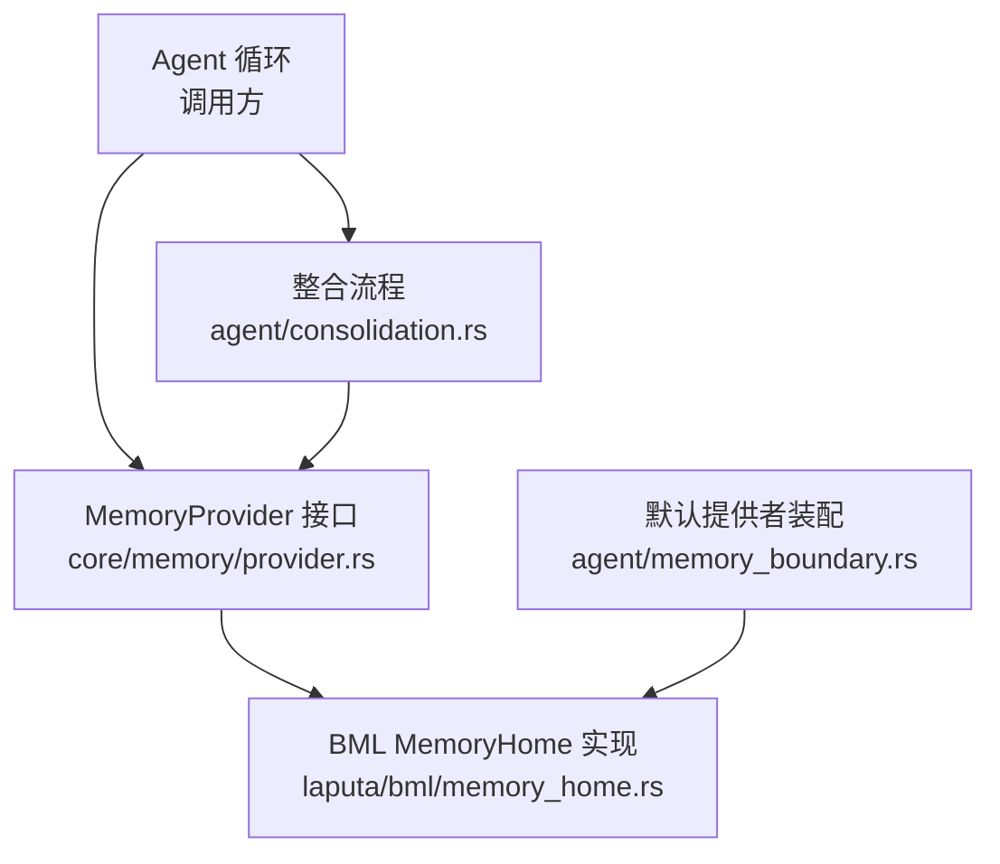
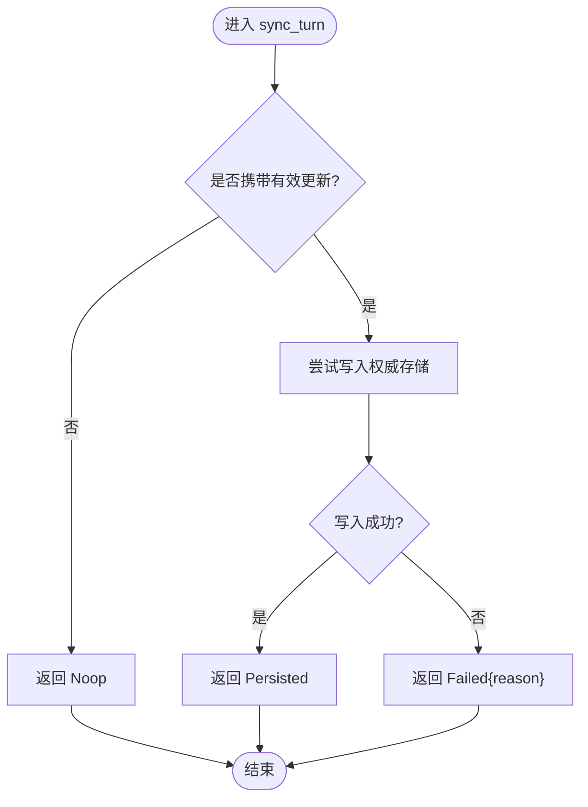
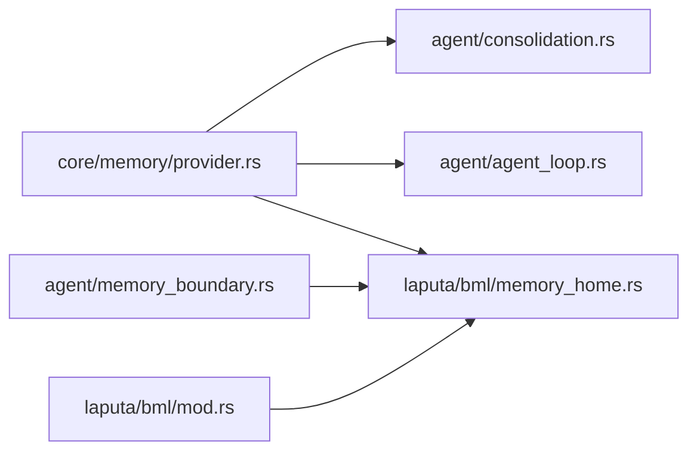

# 回合同步配置

<cite>
**本文引用的文件**
- [agent-diva-core/src/memory/provider.rs](file://agent-diva-core/src/memory/provider.rs)
- [agent-diva-laputa/src/bml/memory_home.rs](file://agent-diva-laputa/src/bml/memory_home.rs)
- [agent-diva-agent/src/consolidation.rs](file://agent-diva-agent/src/consolidation.rs)
- [agent-diva-agent/src/agent_loop.rs](file://agent-diva-agent/src/agent_loop.rs)
- [agent-diva-agent/src/memory_boundary.rs](file://agent-diva-agent/src/memory_boundary.rs)
- [agent-diva-laputa/src/bml/mod.rs](file://agent-diva-laputa/src/bml/mod.rs)
- [agent-diva-core/src/memory/mod.rs](file://agent-diva-core/src/memory/mod.rs)
</cite>

## 目录
1. [简介](#简介)
2. [项目结构](#项目结构)
3. [核心组件](#核心组件)
4. [架构总览](#架构总览)
5. [详细组件分析](#详细组件分析)
6. [依赖关系分析](#依赖关系分析)
7. [性能考虑](#性能考虑)
8. [故障排查指南](#故障排查指南)
9. [结论](#结论)
10. [附录](#附录)

## 简介
本文件面向“回合同步”（turn synchronization）的配置与实现，聚焦于 MemoryProvider::sync_turn 的调用时机、输入输出、状态语义以及持久化策略。文档同时解释 SyncTurnRequest 中 memory_update_markdown 与 history_entry 字段的含义，说明 SyncTurnStatus 枚举（已持久化、无操作、失败）的使用场景，并给出 BML 与 Laputa 后端的同步行为差异与示例。最后提供错误处理与重试建议，帮助在 Agent 运行期安全地落盘证据与记忆更新。

## 项目结构
围绕回合同步的关键代码分布在以下模块：
- 契约定义：core/memory/provider.rs 定义了 MemoryProvider 接口、SyncTurnRequest/Response 与 SyncTurnStatus。
- 默认后端：laputa/bml/memory_home.rs 实现了 MemoryProvider，当前对 sync_turn 返回 Noop，表示由其他路径负责持久化或暂不写入。
- 调用方：agent/consolidation.rs 在整理阶段构造 SyncTurnRequest 并调用 provider.sync_turn；agent/agent_loop.rs 包含测试与追踪逻辑。
- 边界装配：agent/memory_boundary.rs 将默认 MemoryProvider 指向机器级 BML MemoryHome。
- 模块导出：core/memory/mod.rs 统一导出 MemoryProvider 相关类型。



图表来源
- [agent-diva-core/src/memory/provider.rs:316-345](file://agent-diva-core/src/memory/provider.rs#L316-L345)
- [agent-diva-laputa/src/bml/memory_home.rs:567-574](file://agent-diva-laputa/src/bml/memory_home.rs#L567-L574)
- [agent-diva-agent/src/consolidation.rs:400-416](file://agent-diva-agent/src/consolidation.rs#L400-L416)
- [agent-diva-agent/src/memory_boundary.rs:13-16](file://agent-diva-agent/src/memory_boundary.rs#L13-L16)

章节来源
- [agent-diva-core/src/memory/provider.rs:316-345](file://agent-diva-core/src/memory/provider.rs#L316-L345)
- [agent-diva-laputa/src/bml/memory_home.rs:567-574](file://agent-diva-laputa/src/bml/memory_home.rs#L567-L574)
- [agent-diva-agent/src/consolidation.rs:400-416](file://agent-diva-agent/src/consolidation.rs#L400-L416)
- [agent-diva-agent/src/memory_boundary.rs:13-16](file://agent-diva-agent/src/memory_boundary.rs#L13-L16)

## 核心组件
- MemoryProvider::sync_turn
  - 职责：在一次成功的回合结束后，持久化本轮产生的证据或记忆更新。
  - 约束：仅做持久化，不做启动提示注入或实时召回；可异步 I/O。
  - 返回值：使用 SyncTurnStatus 表达确定性结果。
- SyncTurnRequest
  - workspace_root：当前工作区根路径。
  - memory_update_markdown：可选的长时记忆 Markdown 替换或刷新内容。
  - history_entry：可选的历史/证据行，用于记录本轮产出。
- SyncTurnResponse
  - status：三种状态之一：
    - Persisted：权威存储已应用本轮变更。
    - Noop：本轮无需持久化。
    - Failed{reason}：尝试持久化但未成功。

章节来源
- [agent-diva-core/src/memory/provider.rs:316-345](file://agent-diva-core/src/memory/provider.rs#L316-L345)
- [agent-diva-core/src/memory/provider.rs:456-464](file://agent-diva-core/src/memory/provider.rs#L456-L464)

## 架构总览
下图展示了 Agent 回合完成后如何触发回合同步，以及不同后端的行为差异。

```mermaid
sequenceDiagram
participant Loop as "Agent 循环"
participant Consolidation as "整合流程"
participant Provider as "MemoryProvider"
participant BML as "BML MemoryHome"
Loop->>Consolidation : "生成记忆更新/历史条目"
Consolidation->>Provider : "sync_turn(SyncTurnRequest)"
Provider->>BML : "根据实现决定是否写入"
BML-->>Provider : "Noop(当前默认实现)"
Provider-->>Consolidation : "SyncTurnResponse(status=Noop)"
Note over Loop,Provider : "当前默认后端不在此处落盘；可由其他路径或未来实现接管"
```

图表来源
- [agent-diva-agent/src/consolidation.rs:400-416](file://agent-diva-agent/src/consolidation.rs#L400-L416)
- [agent-diva-laputa/src/bml/memory_home.rs:567-574](file://agent-diva-laputa/src/bml/memory_home.rs#L567-L574)

## 详细组件分析

### 回合同步调用时序与数据流
- 调用时机：一次成功的回合结束后，模型推理之外执行。
- 输入：workspace_root、memory_update_markdown、history_entry。
- 处理：provider 根据实现决定写入权威存储或返回 Noop。
- 输出：SyncTurnStatus 明确结果，便于上层决策。



图表来源
- [agent-diva-core/src/memory/provider.rs:316-345](file://agent-diva-core/src/memory/provider.rs#L316-L345)
- [agent-diva-core/src/memory/provider.rs:456-464](file://agent-diva-core/src/memory/provider.rs#L456-L464)

章节来源
- [agent-diva-core/src/memory/provider.rs:316-345](file://agent-diva-core/src/memory/provider.rs#L316-L345)
- [agent-diva-core/src/memory/provider.rs:456-464](file://agent-diva-core/src/memory/provider.rs#L456-L464)

### 字段配置与含义
- memory_update_markdown
  - 用途：作为长时记忆的完整替换或刷新内容。
  - 适用场景：当本轮产生了需要覆盖或增量更新的记忆片段时使用。
  - 注意：该字段为纯文本 Markdown，不应泄露后端特定命令。
- history_entry
  - 用途：记录本轮产出的历史/证据行，便于审计与回溯。
  - 适用场景：轻量证据或摘要行，适合快速落盘。
- workspace_root
  - 用途：标识当前会话的工作区，供后端定位存储位置。

章节来源
- [agent-diva-core/src/memory/provider.rs:316-345](file://agent-diva-core/src/memory/provider.rs#L316-L345)

### 状态枚举与使用场景
- Persisted
  - 含义：权威存储已成功应用本轮变更。
  - 使用：当 provider 完成持久化后返回。
- Noop
  - 含义：本轮无需持久化。
  - 使用：当输入为空或后端认为无需落盘时返回。
- Failed{reason}
  - 含义：尝试持久化但未成功。
  - 使用：当权威存储写入失败时返回，reason 应包含可诊断信息。

章节来源
- [agent-diva-core/src/memory/provider.rs:88-98](file://agent-diva-core/src/memory/provider.rs#L88-L98)

### 同步时机与持久化策略
- 调用时机：回合成功后、模型推理之外。
- 持久化策略：
  - 当前默认后端（BML MemoryHome）在 sync_turn 中返回 Noop，表示不在该钩子落盘。
  - 实际持久化可能由其他路径（如整合流程）或未来 provider 实现承担。
  - 若 Markdown 写入失败，应优先返回 Failed 而非抛出顶层错误，以便会话继续。

章节来源
- [agent-diva-core/src/memory/provider.rs:391-413](file://agent-diva-core/src/memory/provider.rs#L391-L413)
- [agent-diva-core/src/memory/provider.rs:456-464](file://agent-diva-core/src/memory/provider.rs#L456-L464)
- [agent-diva-laputa/src/bml/memory_home.rs:567-574](file://agent-diva-laputa/src/bml/memory_home.rs#L567-L574)

### BML 与 Laputa 后端同步配置示例
- BML（MemoryHome）
  - 行为：当前实现返回 Noop，不在此钩子落盘。
  - 配置要点：通过 agent/memory_boundary.rs 选择 Machine-wide MemoryHome 作为默认 provider。
- Laputa（治理层）
  - 行为：与 BML 同属 laputa crate，但治理层本身不直接处理 sync_turn 落盘；具体落盘仍由 MemoryHome 实现控制。
  - 配置要点：保持 BML 为唯一权威存储，避免非 BML 模块直接写底层存储。

章节来源
- [agent-diva-agent/src/memory_boundary.rs:13-16](file://agent-diva-agent/src/memory_boundary.rs#L13-L16)
- [agent-diva-laputa/src/bml/mod.rs:1-25](file://agent-diva-laputa/src/bml/mod.rs#L1-L25)
- [agent-diva-laputa/src/bml/memory_home.rs:567-574](file://agent-diva-laputa/src/bml/memory_home.rs#L567-L574)

### 调用方与错误处理
- 整合流程（consolidation.rs）
  - 构造 SyncTurnRequest 并调用 provider.sync_turn。
  - 对返回状态进行分支处理：Persisted/Noop 视为成功；Failed 转为内部错误。
- Agent 循环（agent_loop.rs）
  - 测试用例验证 sync_turn 被正确调用与状态返回。
  - 追踪 provider 调用次数与失败原因注入，便于回归测试。

章节来源
- [agent-diva-agent/src/consolidation.rs:400-416](file://agent-diva-agent/src/consolidation.rs#L400-L416)
- [agent-diva-agent/src/agent_loop.rs:2419-2436](file://agent-diva-agent/src/agent_loop.rs#L2419-L2436)
- [agent-diva-agent/src/agent_loop.rs:3120-3135](file://agent-diva-agent/src/agent_loop.rs#L3120-L3135)

## 依赖关系分析
- core/memory/provider.rs 定义契约，被 agent 与 laputa 共同消费。
- agent/memory_boundary.rs 将默认 provider 绑定到 laputa/bml/memory_home.rs。
- agent/consolidation.rs 作为调用方，构造请求并处理响应。
- laputa/bml/mod.rs 暴露 BML 能力，确保只有 MemoryHome 作为权威存储入口。



图表来源
- [agent-diva-core/src/memory/provider.rs:316-345](file://agent-diva-core/src/memory/provider.rs#L316-L345)
- [agent-diva-agent/src/consolidation.rs:400-416](file://agent-diva-agent/src/consolidation.rs#L400-L416)
- [agent-diva-agent/src/memory_boundary.rs:13-16](file://agent-diva-agent/src/memory_boundary.rs#L13-L16)
- [agent-diva-laputa/src/bml/mod.rs:1-25](file://agent-diva-laputa/src/bml/mod.rs#L1-L25)
- [agent-diva-laputa/src/bml/memory_home.rs:567-574](file://agent-diva-laputa/src/bml/memory_home.rs#L567-L574)

章节来源
- [agent-diva-core/src/memory/mod.rs:1-31](file://agent-diva-core/src/memory/mod.rs#L1-L31)
- [agent-diva-core/src/memory/provider.rs:316-345](file://agent-diva-core/src/memory/provider.rs#L316-L345)
- [agent-diva-agent/src/memory_boundary.rs:13-16](file://agent-diva-agent/src/memory_boundary.rs#L13-L16)
- [agent-diva-laputa/src/bml/mod.rs:1-25](file://agent-diva-laputa/src/bml/mod.rs#L1-L25)

## 性能考虑
- 调用时机在回合结束后，避免阻塞模型推理路径。
- 当前默认后端返回 Noop，减少不必要的 I/O。
- 若未来实现写入 Markdown 或数据库，建议使用异步 I/O 与批量写入以降低延迟。
- 失败时应返回 Failed 而非抛错，保证会话继续推进。

[本节为通用指导，不直接分析具体文件]

## 故障排查指南
- 常见问题
  - 同步未落盘：检查 provider 实现是否返回 Noop；确认调用方是否正确构造请求。
  - 同步失败：查看 Failed{reason} 中的 reason 字段，定位权威存储写入失败原因。
  - 重复调用：确保 provider 实现具备幂等性，避免重复落盘。
- 调试建议
  - 在调用方打印 SyncTurnRequest 与 SyncTurnResponse，确认输入输出。
  - 使用测试中的追踪 provider 模拟失败场景，验证上层处理逻辑。
- 重试机制
  - 当前契约未内置自动重试；调用方可根据业务需求实现重试（例如整合流程）。
  - 对于幂等写入，可在 provider 内部基于 correlation 与内容摘要去重。

章节来源
- [agent-diva-core/src/memory/provider.rs:456-464](file://agent-diva-core/src/memory/provider.rs#L456-L464)
- [agent-diva-agent/src/consolidation.rs:400-416](file://agent-diva-agent/src/consolidation.rs#L400-L416)
- [agent-diva-agent/src/agent_loop.rs:2419-2436](file://agent-diva-agent/src/agent_loop.rs#L2419-L2436)

## 结论
回合同步通过 MemoryProvider::sync_turn 提供了统一的持久化入口，当前默认后端（BML MemoryHome）在该钩子返回 Noop，表明实际落盘由其他路径或未来实现承担。调用方应依据 SyncTurnStatus 进行分支处理，并在失败时保留可诊断信息。配置上，重点在于正确构造 SyncTurnRequest 的 memory_update_markdown 与 history_entry，并确保 provider 实现满足幂等性与失败降级要求。

[本节为总结，不直接分析具体文件]

## 附录
- 关键类型导出：core/memory/mod.rs 统一导出 MemoryProvider 及相关类型，便于跨模块使用。
- 默认提供者：agent/memory_boundary.rs 将默认 provider 指向 Machine-wide MemoryHome，确保单一权威存储。

章节来源
- [agent-diva-core/src/memory/mod.rs:1-31](file://agent-diva-core/src/memory/mod.rs#L1-L31)
- [agent-diva-agent/src/memory_boundary.rs:13-16](file://agent-diva-agent/src/memory_boundary.rs#L13-L16)