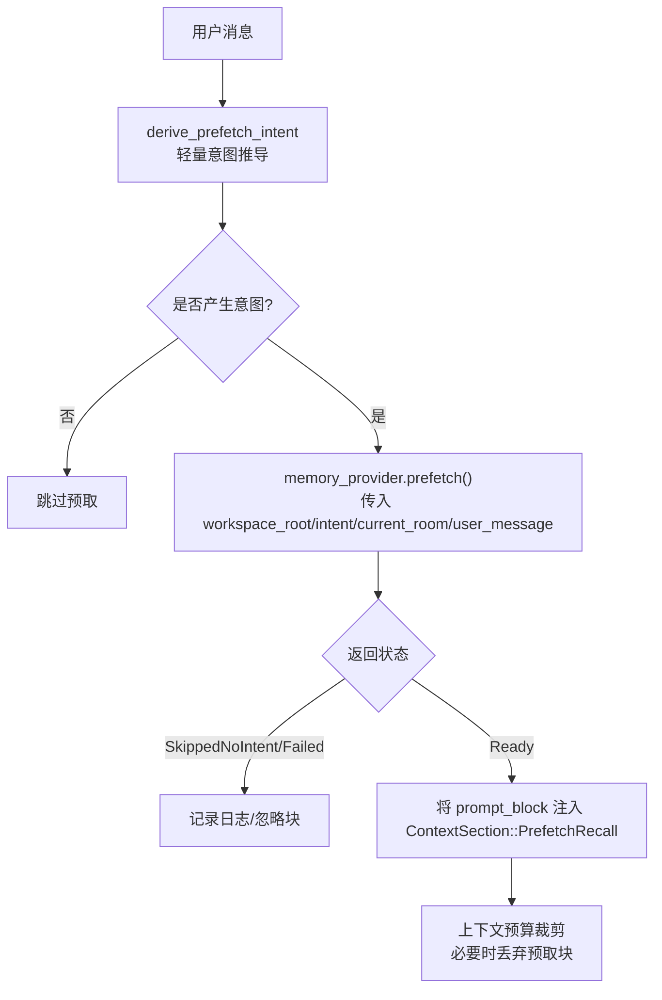
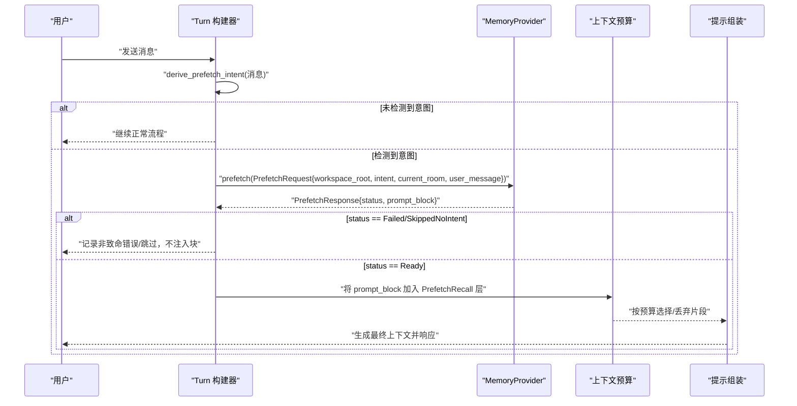
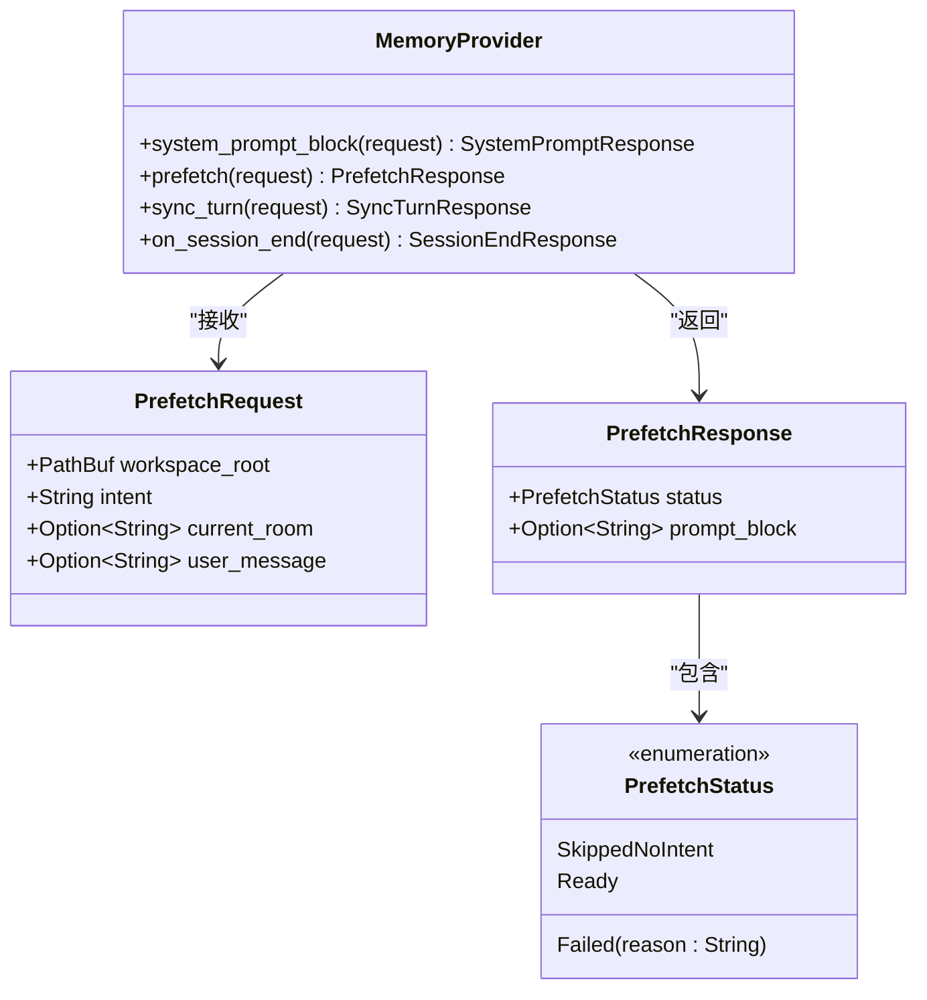
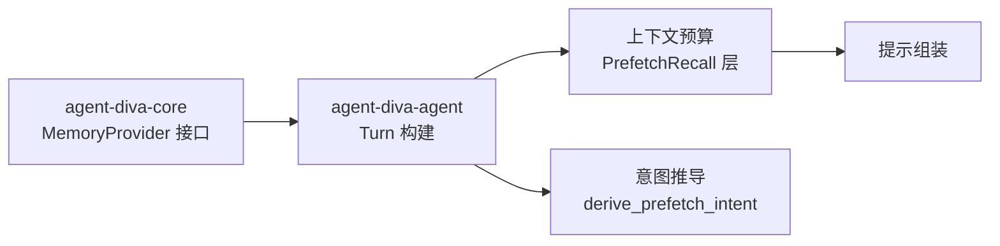

# 意图预取配置

<cite>
**本文引用的文件**
- [agent-diva-core/src/memory/provider.rs](file://agent-diva-core/src/memory/provider.rs)
- [agent-diva-agent/src/agent_loop/turn/context.rs](file://agent-diva-agent/src/agent_loop/turn/context.rs)
- [agent-diva-agent/src/agent_loop/loop_turn.rs](file://agent-diva-agent/src/agent_loop/loop_turn.rs)
- [agent-diva-agent/src/context_assembly/budget.rs](file://agent-diva-agent/src/context_assembly/budget.rs)
- [agent-diva-agent/src/context_assembly/mod.rs](file://agent-diva-agent/src/context_assembly/mod.rs)
</cite>

## 目录
1. [简介](#简介)
2. [项目结构](#项目结构)
3. [核心组件](#核心组件)
4. [架构总览](#架构总览)
5. [详细组件分析](#详细组件分析)
6. [依赖关系分析](#依赖关系分析)
7. [性能与预算](#性能与预算)
8. [故障处理与降级](#故障处理与降级)
9. [结论](#结论)
10. [附录：配置示例与最佳实践](#附录：配置示例与最佳实践)

## 简介
本文件面向“意图预取”能力，系统性说明 prefetch() 方法的配置项、实现要求、状态枚举、注入方式以及失败降级策略。内容基于仓库中 MemoryProvider 接口定义、Agent 侧调用点、意图推导函数与上下文预算系统，确保读者既能理解整体流程，也能落地到具体字段与行为。

## 项目结构
意图预取涉及的核心位置如下：
- 领域契约（core）：PrefetchRequest、PrefetchResponse、PrefetchStatus、MemoryProvider::prefetch()
- Agent 调用点：在 turn 构建时根据用户消息推导意图并调用 prefetch()
- 意图推导：轻量关键词匹配，决定是否触发预取
- 上下文预算：为 PrefetchRecall 分配独立层与丢弃策略，避免影响主对话

图表来源
- [agent-diva-agent/src/agent_loop/turn/context.rs:441-477](file://agent-diva-agent/src/agent_loop/turn/context.rs#L441-L477)
- [agent-diva-agent/src/agent_loop/loop_turn.rs:987-1028](file://agent-diva-agent/src/agent_loop/loop_turn.rs#L987-L1028)
- [agent-diva-core/src/memory/provider.rs:281-305](file://agent-diva-core/src/memory/provider.rs#L281-L305)

章节来源
- [agent-diva-core/src/memory/provider.rs:281-305](file://agent-diva-core/src/memory/provider.rs#L281-L305)
- [agent-diva-agent/src/agent_loop/turn/context.rs:441-477](file://agent-diva-agent/src/agent_loop/turn/context.rs#L441-L477)
- [agent-diva-agent/src/agent_loop/loop_turn.rs:987-1028](file://agent-diva-agent/src/agent_loop/loop_turn.rs#L987-L1028)

## 核心组件
- PrefetchRequest：预取输入，包含工作区根路径、推断的意图、当前房间/话题、用户原始消息或精简查询
- PrefetchResponse：预取输出，包含确定性状态和可选的 Markdown 提示块
- PrefetchStatus：枚举，表示预取结果（跳过、就绪、失败）
- MemoryProvider::prefetch()：异步接口，负责执行意图感知的预取召回，不得做持久化写入
- 上下文预算层：PrefetchRecall 作为独立层，具备软/硬限制并在压力时优先丢弃

章节来源
- [agent-diva-core/src/memory/provider.rs:77-86](file://agent-diva-core/src/memory/provider.rs#L77-L86)
- [agent-diva-core/src/memory/provider.rs:281-305](file://agent-diva-core/src/memory/provider.rs#L281-L305)
- [agent-diva-agent/src/context_assembly/budget.rs:120-178](file://agent-diva-agent/src/context_assembly/budget.rs#L120-L178)
- [agent-diva-agent/src/context_assembly/mod.rs:49-66](file://agent-diva-agent/src/context_assembly/mod.rs#L49-L66)

## 架构总览
下图展示一次完整请求从用户消息到预取注入的全链路：

图表来源
- [agent-diva-agent/src/agent_loop/turn/context.rs:441-477](file://agent-diva-agent/src/agent_loop/turn/context.rs#L441-L477)
- [agent-diva-core/src/memory/provider.rs:449-454](file://agent-diva-core/src/memory/provider.rs#L449-L454)
- [agent-diva-agent/src/context_assembly/budget.rs:230-284](file://agent-diva-agent/src/context_assembly/budget.rs#L230-L284)

## 详细组件分析

### 1) PrefetchRequest 字段含义与配置
- workspace_root：当前会话的工作区根路径，用于定位记忆数据源或相关资源
- intent：从当前轮次推导出的意图字符串，通常由轻量关键词匹配得到；为空则跳过预取
- current_room：可选的当前房间/话题上下文，帮助记忆检索聚焦于特定频道或主题
- user_message：可选的用户原始消息或已蒸馏的查询文本，便于更精准召回

章节来源
- [agent-diva-core/src/memory/provider.rs:281-296](file://agent-diva-core/src/memory/provider.rs#L281-L296)
- [agent-diva-agent/src/agent_loop/turn/context.rs:441-450](file://agent-diva-agent/src/agent_loop/turn/context.rs#L441-L450)

### 2) PrefetchStatus 枚举及使用场景
- SkippedNoIntent：无有效意图，预取被有意跳过；prompt_block 通常为 None
- Ready：预取完成并产出可用块或空但成功的结果；prompt_block 可能为 Some
- Failed{reason}：预取尝试失败；prompt_block 通常为 None，上层记录非致命错误并继续

章节来源
- [agent-diva-core/src/memory/provider.rs:77-86](file://agent-diva-core/src/memory/provider.rs#L77-L86)
- [agent-diva-agent/src/agent_loop/turn/context.rs:453-476](file://agent-diva-agent/src/agent_loop/turn/context.rs#L453-L476)

### 3) PrefetchResponse.prompt_block 格式规范与注入方式
- 格式：Markdown 文本块，可直接拼接到提示上下文中；建议以标题开头，结构化呈现召回结果
- 注入位置：作为 ContextSection::PrefetchRecall 动态片段插入
- 预算控制：属于独立层，受软/硬限制约束；当上下文压力大时会被优先丢弃，不影响主对话

章节来源
- [agent-diva-core/src/memory/provider.rs:298-305](file://agent-diva-core/src/memory/provider.rs#L298-L305)
- [agent-diva-agent/src/agent_loop/turn/context.rs:458-472](file://agent-diva-agent/src/agent_loop/turn/context.rs#L458-L472)
- [agent-diva-agent/src/context_assembly/budget.rs:120-178](file://agent-diva-agent/src/context_assembly/budget.rs#L120-L178)
- [agent-diva-agent/src/context_assembly/budget.rs:378-380](file://agent-diva-agent/src/context_assembly/budget.rs#L378-L380)

### 4) 意图识别与预取策略
- 意图推导：对消息进行去空白、长度阈值检查、小写化后匹配一组“回忆/总结/历史/搜索”等关键词；命中则截取前若干字符作为意图
- 触发条件：仅当 derive_prefetch_intent 返回非空时才调用 prefetch()
- 策略要点：轻量、低开销、可配置扩展词表；避免复杂分类器带来的延迟

章节来源
- [agent-diva-agent/src/agent_loop/loop_turn.rs:987-1028](file://agent-diva-agent/src/agent_loop/loop_turn.rs#L987-L1028)

### 5) 调用时序与上下文装配
- Turn 构建阶段先获取会话检查点块，再推导意图并调用 prefetch()
- 若返回 Ready 且有 prompt_block，则将其作为动态片段注入
- 随后进入上下文预算选择，必要时丢弃预取块以保证主对话稳定

章节来源
- [agent-diva-agent/src/agent_loop/turn/context.rs:420-483](file://agent-diva-agent/src/agent_loop/turn/context.rs#L420-L483)
- [agent-diva-agent/src/context_assembly/budget.rs:230-284](file://agent-diva-agent/src/context_assembly/budget.rs#L230-L284)

### 6) 类图：MemoryProvider 与预取相关类型

图表来源
- [agent-diva-core/src/memory/provider.rs:414-454](file://agent-diva-core/src/memory/provider.rs#L414-L454)
- [agent-diva-core/src/memory/provider.rs:281-305](file://agent-diva-core/src/memory/provider.rs#L281-L305)
- [agent-diva-core/src/memory/provider.rs:77-86](file://agent-diva-core/src/memory/provider.rs#L77-L86)

## 依赖关系分析
- Agent 侧依赖 core 的 MemoryProvider 接口，解耦具体记忆后端
- 上下文预算系统通过 BudgetLayer::PrefetchRecall 管理预取块的配额与丢弃优先级
- 意图推导函数位于 loop_turn，决定何时进入 prefetch 分支

图表来源
- [agent-diva-core/src/memory/provider.rs:414-454](file://agent-diva-core/src/memory/provider.rs#L414-L454)
- [agent-diva-agent/src/context_assembly/budget.rs:120-178](file://agent-diva-agent/src/context_assembly/budget.rs#L120-L178)
- [agent-diva-agent/src/agent_loop/loop_turn.rs:987-1028](file://agent-diva-agent/src/agent_loop/loop_turn.rs#L987-L1028)

章节来源
- [agent-diva-core/src/memory/provider.rs:414-454](file://agent-diva-core/src/memory/provider.rs#L414-L454)
- [agent-diva-agent/src/context_assembly/budget.rs:120-178](file://agent-diva-agent/src/context_assembly/budget.rs#L120-L178)
- [agent-diva-agent/src/agent_loop/loop_turn.rs:987-1028](file://agent-diva-agent/src/agent_loop/loop_turn.rs#L987-L1028)

## 性能与预算
- 预取层预算：默认软/硬限制约为总 token 的 3%-4%，在压力下优先丢弃，保证主对话稳定
- 丢弃策略：PrefetchRecall 标记为可丢弃层，当超过层限制或总限制时被移除
- 测量与报告：上下文装配会统计各层使用量，便于观察预取块对整体预算的影响

章节来源
- [agent-diva-agent/src/context_assembly/budget.rs:120-178](file://agent-diva-agent/src/context_assembly/budget.rs#L120-L178)
- [agent-diva-agent/src/context_assembly/budget.rs:378-380](file://agent-diva-agent/src/context_assembly/budget.rs#L378-L380)
- [agent-diva-agent/src/context_assembly/budget.rs:230-284](file://agent-diva-agent/src/context_assembly/budget.rs#L230-L284)

## 故障处理与降级
- 无意图：SkippedNoIntent，不注入块，直接继续
- 预取失败：Failed{reason}，记录非致命警告，不中断主流程
- 异常错误：捕获并记录为非致命错误，继续构建上下文
- 预算压力：即使预取成功，也可能因预算限制被丢弃，确保主对话不受影响

章节来源
- [agent-diva-agent/src/agent_loop/turn/context.rs:453-476](file://agent-diva-agent/src/agent_loop/turn/context.rs#L453-L476)
- [agent-diva-core/src/memory/provider.rs:449-454](file://agent-diva-core/src/memory/provider.rs#L449-L454)
- [agent-diva-agent/src/context_assembly/budget.rs:230-284](file://agent-diva-agent/src/context_assembly/budget.rs#L230-L284)

## 结论
意图预取通过轻量意图推导与独立的上下文预算层，在不影响主对话的前提下提供“提前召回”的能力。其设计强调：
- 明确的输入输出契约（PrefetchRequest/Response/Status）
- 可插拔的记忆后端（MemoryProvider）
- 稳健的降级机制（跳过/失败/丢弃）
- 可控的预算占用（PrefetchRecall 层）

## 附录：配置示例与最佳实践

### 1) 预取触发与字段填充示例
- 当用户消息包含“回忆/总结/历史/搜索”等关键词时，系统将自动推导意图并调用 prefetch()
- 推荐填充：
  - workspace_root：当前会话工作区路径
  - intent：来自 derive_prefetch_intent 的结果（截断后的意图）
  - current_room：当前频道/房间名，有助于缩小召回范围
  - user_message：原始消息或精简查询，提升召回准确性

章节来源
- [agent-diva-agent/src/agent_loop/loop_turn.rs:987-1028](file://agent-diva-agent/src/agent_loop/loop_turn.rs#L987-L1028)
- [agent-diva-agent/src/agent_loop/turn/context.rs:441-450](file://agent-diva-agent/src/agent_loop/turn/context.rs#L441-L450)

### 2) 预取失败的处理策略
- 若返回 SkippedNoIntent：无需额外处理，继续主流程
- 若返回 Failed{reason}：记录非致命日志，不注入块，继续主流程
- 若抛出异常：捕获并记录非致命错误，继续主流程

章节来源
- [agent-diva-agent/src/agent_loop/turn/context.rs:453-476](file://agent-diva-agent/src/agent_loop/turn/context.rs#L453-L476)

### 3) prompt_block 的格式与注入
- 格式：Markdown 文本，建议以标题开头，结构化呈现召回结果
- 注入：作为 ContextSection::PrefetchRecall 动态片段插入
- 预算：受 PrefetchRecall 层限制，压力时可能被丢弃

章节来源
- [agent-diva-core/src/memory/provider.rs:298-305](file://agent-diva-core/src/memory/provider.rs#L298-L305)
- [agent-diva-agent/src/context_assembly/budget.rs:120-178](file://agent-diva-agent/src/context_assembly/budget.rs#L120-L178)

### 4) 意图识别策略的可扩展性
- 当前采用轻量关键词匹配，可在 derive_prefetch_intent 中扩展词表或调整阈值
- 保持低延迟与高召回率平衡，避免引入重型分类器

章节来源
- [agent-diva-agent/src/agent_loop/loop_turn.rs:987-1028](file://agent-diva-agent/src/agent_loop/loop_turn.rs#L987-L1028)