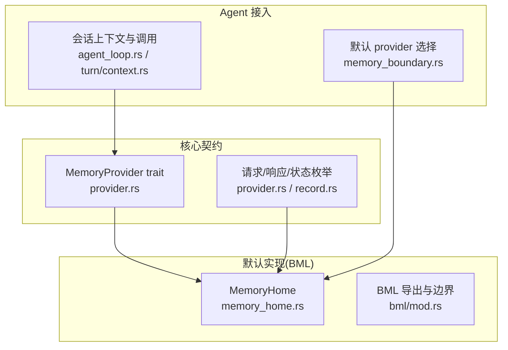
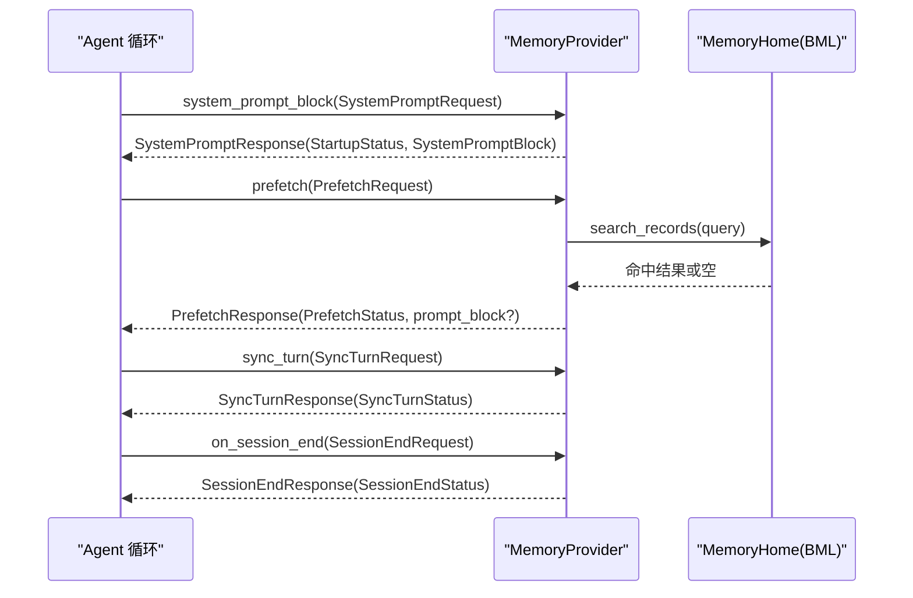
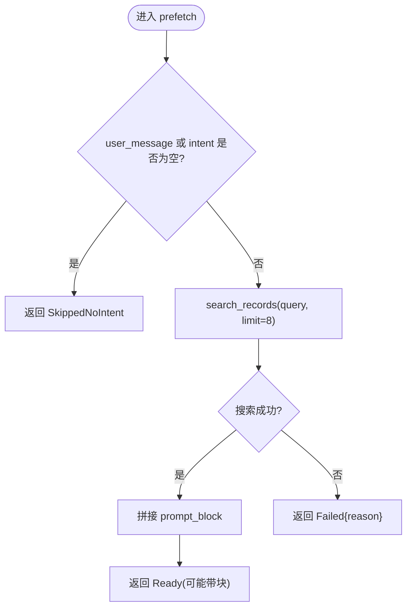
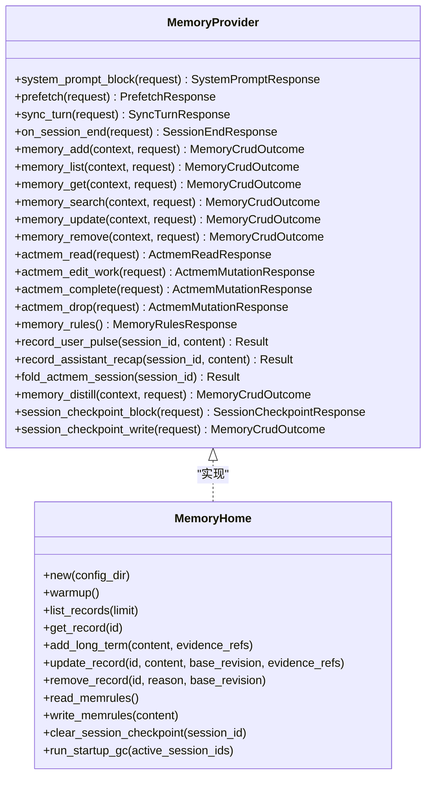

# 记忆提供商配置

<cite>
**本文引用的文件**
- [agent-diva-core/src/memory/provider.rs](file://agent-diva-core/src/memory/provider.rs)
- [agent-diva-core/src/memory/mod.rs](file://agent-diva-core/src/memory/mod.rs)
- [agent-diva-core/src/memory/record.rs](file://agent-diva-core/src/memory/record.rs)
- [agent-diva-laputa/src/bml/memory_home.rs](file://agent-diva-laputa/src/bml/memory_home.rs)
- [agent-diva-laputa/src/bml/mod.rs](file://agent-diva-laputa/src/bml/mod.rs)
- [agent-diva-agent/src/memory_boundary.rs](file://agent-diva-agent/src/memory_boundary.rs)
- [agent-diva-agent/src/agent_loop.rs](file://agent-diva-agent/src/agent_loop.rs)
- [agent-diva-agent/src/agent_loop/turn/context.rs](file://agent-diva-agent/src/agent_loop/turn/context.rs)
- [agent-diva-laputa/src/error.rs](file://agent-diva-laputa/src/error.rs)
</cite>

## 目录
1. [简介](#简介)
2. [项目结构](#项目结构)
3. [核心组件](#核心组件)
4. [架构总览](#架构总览)
5. [详细组件分析](#详细组件分析)
6. [依赖关系分析](#依赖关系分析)
7. [性能考虑](#性能考虑)
8. [故障排查指南](#故障排查指南)
9. [结论](#结论)
10. [附录](#附录)

## 简介
本文件面向“记忆提供商”的配置与实现，聚焦 MemoryProvider trait 的接口契约、启动状态、意图感知预取、会话同步等关键流程，以及不同存储后端（BML、Laputa）的配置要点与最佳实践。文档同时给出错误处理策略与降级机制说明，帮助你在生产环境中稳定运行记忆能力。

## 项目结构
记忆能力由“核心契约 + 默认实现 + Agent 接入点”构成：
- 核心契约定义在 agent-diva-core 的记忆模块中，提供 MemoryProvider trait 及请求/响应类型、枚举状态等。
- 默认生产实现在 agent-diva-laputa 的 BML 层，MemoryHome 作为机器级权威存储，实现 MemoryProvider。
- Agent 侧通过 memory_boundary 选择默认 provider，并在 agent loop 中调用系统提示块生成、预取、同步与会话结束钩子。

图表来源
- [agent-diva-core/src/memory/provider.rs:414-617](file://agent-diva-core/src/memory/provider.rs#L414-L617)
- [agent-diva-laputa/src/bml/memory_home.rs:494-800](file://agent-diva-laputa/src/bml/memory_home.rs#L494-L800)
- [agent-diva-agent/src/memory_boundary.rs:1-16](file://agent-diva-agent/src/memory_boundary.rs#L1-L16)
- [agent-diva-agent/src/agent_loop/turn/context.rs:420-454](file://agent-diva-agent/src/agent_loop/turn/context.rs#L420-L454)

章节来源
- [agent-diva-core/src/memory/mod.rs:1-47](file://agent-diva-core/src/memory/mod.rs#L1-L47)
- [agent-diva-core/src/memory/provider.rs:1-770](file://agent-diva-core/src/memory/provider.rs#L1-L770)
- [agent-diva-laputa/src/bml/mod.rs:1-37](file://agent-diva-laputa/src/bml/mod.rs#L1-L37)
- [agent-diva-agent/src/memory_boundary.rs:1-16](file://agent-diva-agent/src/memory_boundary.rs#L1-L16)

## 核心组件
- MemoryProvider trait：定义启动注入、预取、同步、会话结束、ACTMEM、CRUD、规则读取等统一接口。
- 启动相关：SystemPromptRequest/Response、StartupStatus、StartupInjectionShape、SystemPromptBlock、StartupContextSnapshot。
- 预取相关：PrefetchRequest/Response、PrefetchStatus。
- 同步相关：SyncTurnRequest/Response、SyncTurnStatus。
- 会话结束：SessionEndRequest/Response、SessionEndStatus。
- 记录元数据：MemorySensitivity、MemoryTrust、MemoryScope、MemoryProvenance 等。

这些类型共同约束了记忆提供商的行为边界和可观测性，确保上层 Agent 无需感知底层存储细节。

章节来源
- [agent-diva-core/src/memory/provider.rs:22-111](file://agent-diva-core/src/memory/provider.rs#L22-L111)
- [agent-diva-core/src/memory/provider.rs:113-180](file://agent-diva-core/src/memory/provider.rs#L113-L180)
- [agent-diva-core/src/memory/provider.rs:237-389](file://agent-diva-core/src/memory/provider.rs#L237-L389)
- [agent-diva-core/src/memory/record.rs:48-95](file://agent-diva-core/src/memory/record.rs#L48-L95)

## 架构总览
下图展示一次典型对话中的记忆交互时序：启动时注入系统提示块；会话中基于意图进行预取；成功后进行同步；会话结束时触发收尾工作。

图表来源
- [agent-diva-core/src/memory/provider.rs:414-617](file://agent-diva-core/src/memory/provider.rs#L414-L617)
- [agent-diva-laputa/src/bml/memory_home.rs:494-574](file://agent-diva-laputa/src/bml/memory_home.rs#L494-L574)
- [agent-diva-agent/src/agent_loop/turn/context.rs:420-454](file://agent-diva-agent/src/agent_loop/turn/context.rs#L420-L454)

## 详细组件分析

### MemoryProvider 接口与实现要求
- 启动注入：system_prompt_block 必须为同步方法，仅使用本地同步缓存，不得执行异步 I/O。返回 StartupStatus 与 SystemPromptBlock，形状限定为 CompactRenderedMarkdown。
- 预取：prefetch 为异步，用于根据 intent/current_room/user_message 召回上下文；失败应返回 PrefetchStatus::Failed 而非抛错，保证会话继续。
- 同步：sync_turn 为异步，负责持久化证据或更新；Markdown 写入失败应返回 Failed 而非中断会话。
- 会话结束：on_session_end 为异步，需幂等，避免重复处理。
- CRUD/ACTMEM/规则：默认返回 unsupported 或不可用错误；生产实现按需覆盖。

章节来源
- [agent-diva-core/src/memory/provider.rs:414-617](file://agent-diva-core/src/memory/provider.rs#L414-L617)

### 启动状态与系统提示块生成
- StartupStatus：Ready 表示正常；Degraded 表示无法组装连续性内容，包含 reason 与 last_usable_wakeup。
- SystemPromptBlock：shape 固定为 CompactRenderedMarkdown，markdown 可直接注入系统提示。
- StartupContextSnapshot：聚合 soul/wakeup 投影与 L1 索引，渲染为紧凑 Markdown；若为空则不注入。
- 降级输出：当启动生成失败时，会显式输出 degraded 状态与原因，且不复用上次可用唤醒内容。

章节来源
- [agent-diva-core/src/memory/provider.rs:22-75](file://agent-diva-core/src/memory/provider.rs#L22-L75)
- [agent-diva-core/src/memory/provider.rs:113-180](file://agent-diva-core/src/memory/provider.rs#L113-L180)
- [agent-diva-core/src/memory/provider.rs:182-235](file://agent-diva-core/src/memory/provider.rs#L182-L235)

### 意图感知预取
- PrefetchRequest 携带 workspace_root、intent、current_room、user_message。
- PrefetchStatus：SkippedNoIntent（无意图跳过）、Ready（完成并可能返回 prompt_block）、Failed{reason}（尝试失败）。
- 默认 BML 实现：以 user_message 或 intent 作为查询，搜索可见记录，拼接为 prompt_block；若无数据库或查询为空，返回 SkippedNoIntent 或 Ready 且空块。

图表来源
- [agent-diva-laputa/src/bml/memory_home.rs:534-565](file://agent-diva-laputa/src/bml/memory_home.rs#L534-L565)
- [agent-diva-core/src/memory/provider.rs:281-314](file://agent-diva-core/src/memory/provider.rs#L281-L314)

章节来源
- [agent-diva-core/src/memory/provider.rs:281-314](file://agent-diva-core/src/memory/provider.rs#L281-L314)
- [agent-diva-laputa/src/bml/memory_home.rs:534-565](file://agent-diva-laputa/src/bml/memory_home.rs#L534-L565)
- [agent-diva-agent/src/agent_loop/turn/context.rs:420-454](file://agent-diva-agent/src/agent_loop/turn/context.rs#L420-L454)

### 会话同步与会话结束
- SyncTurnStatus：Persisted（已持久化）、Noop（无需写）、Failed{reason}（尝试失败）。
- SessionEndStatus：Triggered（触发工作）、Noop（无工作）、AlreadyHandled（幂等忽略）、Failed{reason}（失败）。
- 默认 BML 实现：sync_turn 通常返回 Noop；on_session_end 可用于收尾（如折叠 ACTMEM），需幂等。

章节来源
- [agent-diva-core/src/memory/provider.rs:88-111](file://agent-diva-core/src/memory/provider.rs#L88-L111)
- [agent-diva-laputa/src/bml/memory_home.rs:567-581](file://agent-diva-laputa/src/bml/memory_home.rs#L567-L581)

### 记录敏感性与信任等级
- MemorySensitivity：Public、Internal、Private、Restricted、Unknown。
- MemoryTrust：AppliedAuthority、UserAsserted、Observed、Inferred、Untrusted、Unknown。
- MemoryScope：tenant_id、workspace_id、session_id。
- MemoryProvenance：source、source_id、content_digest、captured_at、correlation。

章节来源
- [agent-diva-core/src/memory/record.rs:48-95](file://agent-diva-core/src/memory/record.rs#L48-L95)

### 默认实现：BML（MemoryHome）
- 角色：机器级权威存储（SQLite + FTS5），唯一生产 authority。
- 启动索引：维护 startup_markdown 与 startup_revision，支持 refresh_system_prompt_projection。
- 预取：基于 FTS5 搜索可见记录，限制数量，拼接为 prompt_block。
- CRUD：支持 add/update/remove/list/get/search，返回 MemoryCrudOutcome。
- ACTMEM：读取 Pulse/Recap/Work/Capsules，编辑 Work，完成/删除 Open 项。
- 规则：读取 MEMRULES.MD，区分默认与文件来源。

章节来源
- [agent-diva-laputa/src/bml/mod.rs:1-37](file://agent-diva-laputa/src/bml/mod.rs#L1-L37)
- [agent-diva-laputa/src/bml/memory_home.rs:85-151](file://agent-diva-laputa/src/bml/memory_home.rs#L85-L151)
- [agent-diva-laputa/src/bml/memory_home.rs:348-372](file://agent-diva-laputa/src/bml/memory_home.rs#L348-L372)
- [agent-diva-laputa/src/bml/memory_home.rs:494-800](file://agent-diva-laputa/src/bml/memory_home.rs#L494-L800)

### Agent 侧接入与调用
- 默认 provider：memory_boundary 将 config_dir 绑定到 MemoryHome。
- 上下文构建：turn/context 在构建系统提示块后，提取意图并调用 prefetch；失败非致命，继续推进。
- 测试追踪：agent_loop 中的 TrackingMemoryProvider 验证生命周期钩子调用与状态。

章节来源
- [agent-diva-agent/src/memory_boundary.rs:1-16](file://agent-diva-agent/src/memory_boundary.rs#L1-L16)
- [agent-diva-agent/src/agent_loop/turn/context.rs:420-454](file://agent-diva-agent/src/agent_loop/turn/context.rs#L420-L454)
- [agent-diva-agent/src/agent_loop.rs:2262-2332](file://agent-diva-agent/src/agent_loop.rs#L2262-L2332)

## 依赖关系分析
- Agent 依赖 core 的 MemoryProvider 契约，不直接依赖传输或 CLI 形状。
- Laputa 的 BML 层实现契约，暴露 MemoryHome 作为唯一权威。
- 错误类型在 LaputaError 中集中定义，便于统一分类与对外编码。

图表来源
- [agent-diva-core/src/memory/provider.rs:414-617](file://agent-diva-core/src/memory/provider.rs#L414-L617)
- [agent-diva-laputa/src/bml/memory_home.rs:85-151](file://agent-diva-laputa/src/bml/memory_home.rs#L85-L151)
- [agent-diva-laputa/src/bml/memory_home.rs:494-800](file://agent-diva-laputa/src/bml/memory_home.rs#L494-L800)

章节来源
- [agent-diva-core/src/memory/provider.rs:414-617](file://agent-diva-core/src/memory/provider.rs#L414-L617)
- [agent-diva-laputa/src/bml/memory_home.rs:494-800](file://agent-diva-laputa/src/bml/memory_home.rs#L494-L800)

## 性能考虑
- 启动注入：system_prompt_block 同步且只读本地缓存，避免阻塞；startup_index 刷新仅在权威变更后发生。
- 预取：限制搜索结果数量（默认 8），减少上下文膨胀；空查询直接跳过。
- 同步：优先 Noop；Markdown 写入失败降级为 Failed，不影响会话继续。
- 会话结束：幂等处理，避免重复工作；ACTMEM 折叠与清理应在空闲时段进行。

[本节提供通用指导，不直接分析具体文件]

## 故障排查指南
- 预取失败：检查 query 是否为空；确认数据库存在且可打开；查看 PrefetchStatus::Failed 的 reason。
- 启动降级：关注 StartupStatus::Degraded 的 reason；确认 startup_index 刷新是否成功。
- 同步失败：确认 sync_turn 返回 Failed 的原因；若为次要后端失败，应视为降级而非丢失权威 Markdown。
- 会话结束失败：确保 on_session_end 幂等；检查 ACTMEM 操作是否抛出内部错误。
- 错误分类：LaputaError 提供稳定 code（如 bml_unavailable、memory_io_error），便于上层统一处理。

章节来源
- [agent-diva-core/src/memory/provider.rs:77-111](file://agent-diva-core/src/memory/provider.rs#L77-L111)
- [agent-diva-laputa/src/bml/memory_home.rs:39-70](file://agent-diva-laputa/src/bml/memory_home.rs#L39-L70)
- [agent-diva-laputa/src/error.rs:1-47](file://agent-diva-laputa/src/error.rs#L1-L47)

## 结论
MemoryProvider 提供了稳定的记忆能力契约，BML（MemoryHome）作为唯一权威存储实现了完整的启动注入、预取、同步与会话结束流程。通过明确的枚举状态与降级策略，系统在异常情况下仍能保持可用性。建议在生产环境严格遵循接口约定，合理配置预取与索引预算，并完善错误日志与监控。

[本节总结性内容，不直接分析具体文件]

## 附录

### 配置选项与含义
- 启动注入形状：StartupInjectionShape::CompactRenderedMarkdown（当前唯一支持）。
- 预取意图：PrefetchRequest.intent 与 user_message 决定召回质量；空意图将跳过。
- 同步策略：SyncTurnRequest.memory_update_markdown 与 history_entry 可选；无变更时返回 Noop。
- 会话结束：SessionEndRequest.session_id 可选；幂等处理避免重复。
- 记录属性：MemorySensitivity/MemoryTrust/MemoryScope/MemoryProvenance 控制可见性与可信度。

章节来源
- [agent-diva-core/src/memory/provider.rs:67-111](file://agent-diva-core/src/memory/provider.rs#L67-L111)
- [agent-diva-core/src/memory/provider.rs:237-389](file://agent-diva-core/src/memory/provider.rs#L237-L389)
- [agent-diva-core/src/memory/record.rs:48-95](file://agent-diva-core/src/memory/record.rs#L48-L95)

### 不同存储后端配置示例与最佳实践
- BML（推荐）：
  - 路径：config_dir/memory/memory.sqlite3 与 MEMRULES.MD。
  - 预热：调用 warmup 以加载启动索引；必要时调整 l1_index_lines。
  - 预取：利用 FTS5 搜索，限制结果数量，避免上下文过大。
  - 规则：通过 read_memrules/write_memrules 管理记忆写作规范。
- Laputa（治理层）：
  - 与 BML 同属 agent-diva-laputa crate；当前生产权威为 BML，Laputa 提供治理与迁移工具。
  - 注意：不要直接调用原始写入 API（put/import_records/gc/backup/restore），通过 MemoryHome 提供的受控接口。

章节来源
- [agent-diva-laputa/src/bml/memory_home.rs:102-151](file://agent-diva-laputa/src/bml/memory_home.rs#L102-L151)
- [agent-diva-laputa/src/bml/memory_home.rs:348-372](file://agent-diva-laputa/src/bml/memory_home.rs#L348-L372)
- [agent-diva-laputa/src/bml/mod.rs:1-37](file://agent-diva-laputa/src/bml/mod.rs#L1-L37)

### 错误处理策略与降级机制
- 预取失败：返回 PrefetchStatus::Failed{reason}，不中断会话。
- 同步失败：返回 SyncTurnStatus::Failed{reason}，若仅为次要后端失败，视为降级。
- 启动降级：返回 StartupStatus::Degraded{reason, last_usable_wakeup}，显式告知上层。
- 会话结束失败：返回 SessionEndStatus::Failed{reason}，确保幂等。
- 错误码：LaputaError.code() 提供稳定字符串，便于外部系统识别。

章节来源
- [agent-diva-core/src/memory/provider.rs:77-111](file://agent-diva-core/src/memory/provider.rs#L77-L111)
- [agent-diva-laputa/src/error.rs:1-47](file://agent-diva-laputa/src/error.rs#L1-L47)