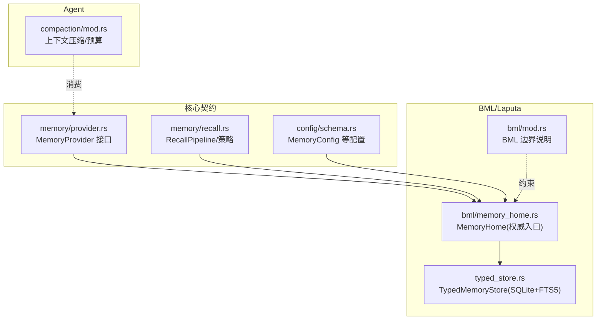
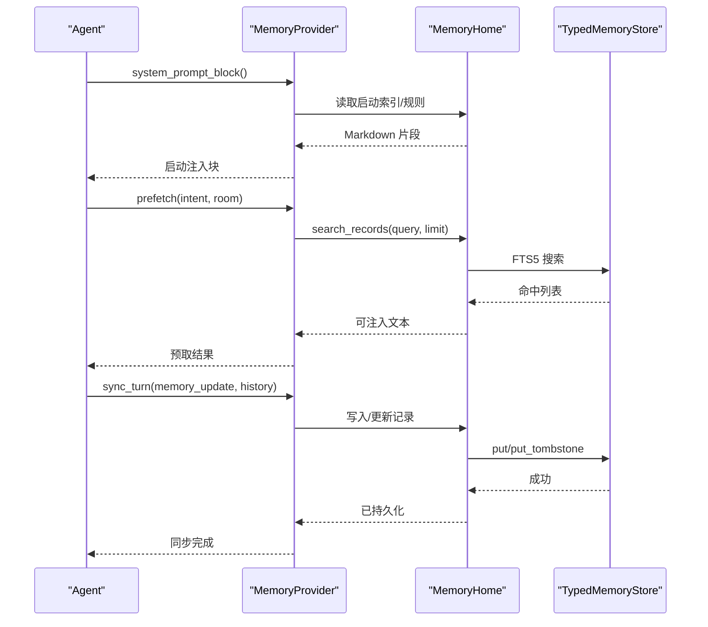
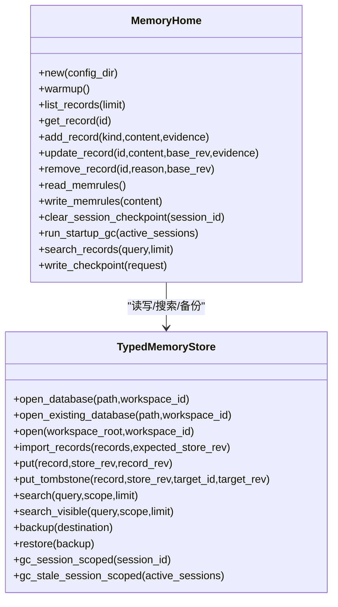
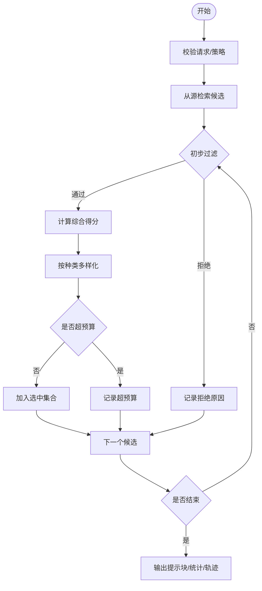
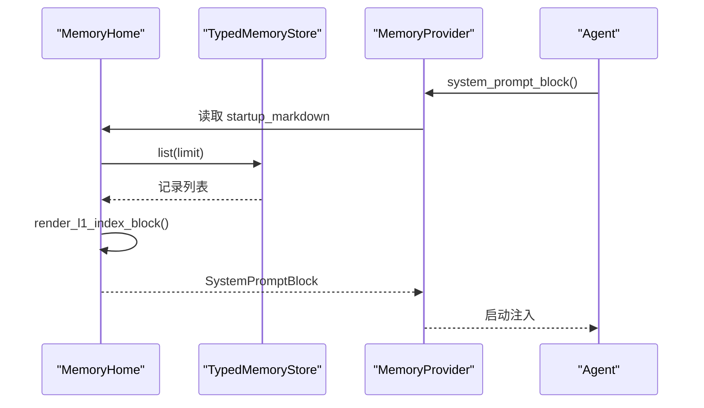
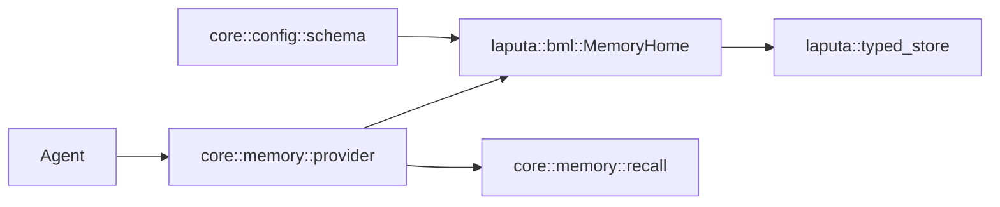

# 记忆配置

<cite>
**本文引用的文件**
- [agent-diva-core/src/memory/mod.rs](file://agent-diva-core/src/memory/mod.rs)
- [agent-diva-core/src/memory/provider.rs](file://agent-diva-core/src/memory/provider.rs)
- [agent-diva-core/src/memory/recall.rs](file://agent-diva-core/src/memory/recall.rs)
- [agent-diva-core/src/config/schema.rs](file://agent-diva-core/src/config/schema.rs)
- [agent-diva-laputa/src/bml/mod.rs](file://agent-diva-laputa/src/bml/mod.rs)
- [agent-diva-laputa/src/bml/memory_home.rs](file://agent-diva-laputa/src/bml/memory_home.rs)
- [agent-diva-laputa/src/typed_store.rs](file://agent-diva-laputa/src/typed_store.rs)
- [agent-diva-agent/src/compaction/mod.rs](file://agent-diva-agent/src/compaction/mod.rs)
</cite>

## 目录
1. [简介](#简介)
2. [项目结构](#项目结构)
3. [核心组件](#核心组件)
4. [架构总览](#架构总览)
5. [详细组件分析](#详细组件分析)
6. [依赖关系分析](#依赖关系分析)
7. [性能与容量管理](#性能与容量管理)
8. [故障排查指南](#故障排查指南)
9. [结论](#结论)
10. [附录：场景化配置示例](#附录：场景化配置示例)

## 简介
本文件面向“记忆系统”的配置、存储后端与运行时策略，覆盖以下主题：
- 记忆系统的配置结构与存储后端（BML、Laputa、SQLite+FTS5）
- 语义搜索、检索算法与预算控制
- 记忆压缩策略、缓存机制与启动索引
- 备份恢复与数据迁移
- 不同记忆场景的配置示例与容量管理建议

## 项目结构
记忆系统在 Agent-Diva 中由 core 层定义契约与策略，在 Laputa 层实现生产级 BML 存储与治理边界，Agent 层提供上下文压缩与预算监控。

图表来源
- [agent-diva-core/src/memory/provider.rs:414-617](file://agent-diva-core/src/memory/provider.rs#L414-L617)
- [agent-diva-core/src/memory/recall.rs:214-359](file://agent-diva-core/src/memory/recall.rs#L214-L359)
- [agent-diva-core/src/config/schema.rs:278-331](file://agent-diva-core/src/config/schema.rs#L278-L331)
- [agent-diva-laputa/src/bml/memory_home.rs:85-125](file://agent-diva-laputa/src/bml/memory_home.rs#L85-L125)
- [agent-diva-laputa/src/typed_store.rs:135-199](file://agent-diva-laputa/src/typed_store.rs#L135-L199)
- [agent-diva-laputa/src/bml/mod.rs:1-37](file://agent-diva-laputa/src/bml/mod.rs#L1-L37)
- [agent-diva-agent/src/compaction/mod.rs:1-33](file://agent-diva-agent/src/compaction/mod.rs#L1-L33)

章节来源
- [agent-diva-core/src/memory/mod.rs:1-47](file://agent-diva-core/src/memory/mod.rs#L1-L47)
- [agent-diva-core/src/config/schema.rs:278-331](file://agent-diva-core/src/config/schema.rs#L278-L331)
- [agent-diva-laputa/src/bml/mod.rs:1-37](file://agent-diva-laputa/src/bml/mod.rs#L1-L37)

## 核心组件
- MemoryProvider：Agent 与记忆后端的稳定契约，包含启动注入、意图预取、回合同步、会话结束钩子以及 CRUD/ACTMEM 能力。
- MemoryHome：机器级 BML 权威入口，封装 SQLite+FTS5 的读写、启动索引、会话检查点、规则文档等。
- TypedMemoryStore：类型化 SQLite 存储，负责记录持久化、FTS5 全文检索、容量限制、备份恢复与身份迁移。
- RecallPipeline：确定性召回管线，基于策略、预算与评分选择候选并生成提示片段。
- MemoryConfig：顶层配置中的记忆相关参数（如 L1 启动索引行数）。

章节来源
- [agent-diva-core/src/memory/provider.rs:414-617](file://agent-diva-core/src/memory/provider.rs#L414-L617)
- [agent-diva-laputa/src/bml/memory_home.rs:85-125](file://agent-diva-laputa/src/bml/memory_home.rs#L85-L125)
- [agent-diva-laputa/src/typed_store.rs:135-199](file://agent-diva-laputa/src/typed_store.rs#L135-L199)
- [agent-diva-core/src/memory/recall.rs:214-359](file://agent-diva-core/src/memory/recall.rs#L214-L359)
- [agent-diva-core/src/config/schema.rs:278-331](file://agent-diva-core/src/config/schema.rs#L278-L331)

## 架构总览
记忆系统采用“契约-实现-策略”分层：
- 契约层（core）：定义 MemoryProvider、Recall 请求/结果、配置项等。
- 实现层（laputa）：MemoryHome 作为唯一生产权威，底层使用 TypedMemoryStore（SQLite+FTS5），并提供启动索引、会话检查点、规则文档等。
- 策略层（core/agent）：RecallPipeline 决定召回内容与预算；Agent compaction 维护长会话上下文窗口。

图表来源
- [agent-diva-core/src/memory/provider.rs:414-617](file://agent-diva-core/src/memory/provider.rs#L414-L617)
- [agent-diva-laputa/src/bml/memory_home.rs:494-710](file://agent-diva-laputa/src/bml/memory_home.rs#L494-L710)
- [agent-diva-laputa/src/typed_store.rs:881-1117](file://agent-diva-laputa/src/typed_store.rs#L881-L1117)

## 详细组件分析

### BML 存储与 Laputa 治理层
- BML 是记忆存储层，生产实体为机器级 typed SQLite + FTS5 数据库，通过 MemoryHome 暴露。非 BML 模块不得直接调用原始写 API，边界由测试强制。
- MemoryHome 维护：
  - 数据库路径与 MEMRULES.MD 规则文件
  - 启动索引（L1 索引行）与系统提示块
  - 会话检查点写入与清理
  - 搜索与 CRUD 适配到 TypedMemoryStore
- TypedMemoryStore 提供：
  - 工作区隔离、模式版本校验、乐观锁（store_revision/record_revision）
  - 容量上限（记录数与内容字节）
  - FTS5 全文检索（BM25）
  - 备份恢复（VACUUM INTO）与身份迁移（legacy→canonical workspace_id）

图表来源
- [agent-diva-laputa/src/bml/memory_home.rs:85-125](file://agent-diva-laputa/src/bml/memory_home.rs#L85-L125)
- [agent-diva-laputa/src/bml/memory_home.rs:179-492](file://agent-diva-laputa/src/bml/memory_home.rs#L179-L492)
- [agent-diva-laputa/src/typed_store.rs:135-199](file://agent-diva-laputa/src/typed_store.rs#L135-L199)
- [agent-diva-laputa/src/typed_store.rs:881-1117](file://agent-diva-laputa/src/typed_store.rs#L881-L1117)

章节来源
- [agent-diva-laputa/src/bml/mod.rs:1-37](file://agent-diva-laputa/src/bml/mod.rs#L1-L37)
- [agent-diva-laputa/src/bml/memory_home.rs:85-125](file://agent-diva-laputa/src/bml/memory_home.rs#L85-L125)
- [agent-diva-laputa/src/typed_store.rs:135-199](file://agent-diva-laputa/src/typed_store.rs#L135-L199)

### 语义搜索与检索算法
- 存储层使用 SQLite FTS5 进行全文检索，按 BM25 排序，支持工作区/租户/会话范围过滤。
- RecallPipeline 对候选进行确定性筛选：
  - 策略过滤（信任度、敏感度、过期、墓碑、覆盖、重复）
  - 评分加权（相关性、重要性、新鲜度、人格匹配）
  - 多样性去重（按记录种类）
  - 预算控制（token 估算与上限）
- 默认保守 token 估算：字符数/3 向上取整。

图表来源
- [agent-diva-core/src/memory/recall.rs:214-359](file://agent-diva-core/src/memory/recall.rs#L214-L359)
- [agent-diva-core/src/memory/recall.rs:400-489](file://agent-diva-core/src/memory/recall.rs#L400-L489)
- [agent-diva-core/src/memory/recall.rs:494-583](file://agent-diva-core/src/memory/recall.rs#L494-L583)

章节来源
- [agent-diva-core/src/memory/recall.rs:214-359](file://agent-diva-core/src/memory/recall.rs#L214-L359)
- [agent-diva-laputa/src/typed_store.rs:1119-1205](file://agent-diva-laputa/src/typed_store.rs#L1119-L1205)

### 记忆压缩策略与上下文预算
- Agent 侧提供 checkpoint compactor，结合 token 估算与上下文预算监控，将长会话历史压缩为摘要，保持上下文窗口可控。
- 压缩流程包括：安全截断点选择、快照生成、质量门控与总结验证。

图表来源
- [agent-diva-agent/src/compaction/mod.rs:1-33](file://agent-diva-agent/src/compaction/mod.rs#L1-L33)

章节来源
- [agent-diva-agent/src/compaction/mod.rs:1-33](file://agent-diva-agent/src/compaction/mod.rs#L1-L33)

### 缓存机制与启动索引
- MemoryHome 维护启动索引（L1 索引行），用于系统提示注入；当数据库存在时预热索引。
- 启动索引根据当前可见记录渲染为紧凑 Markdown，并在写入后刷新。
- Provider 返回的 StartupInjectionShape 固定为 CompactRenderedMarkdown，便于统一拼接。

图表来源
- [agent-diva-laputa/src/bml/memory_home.rs:394-418](file://agent-diva-laputa/src/bml/memory_home.rs#L394-L418)
- [agent-diva-core/src/memory/provider.rs:67-75](file://agent-diva-core/src/memory/provider.rs#L67-L75)
- [agent-diva-core/src/memory/provider.rs:494-517](file://agent-diva-core/src/memory/provider.rs#L494-L517)

章节来源
- [agent-diva-laputa/src/bml/memory_home.rs:394-418](file://agent-diva-laputa/src/bml/memory_home.rs#L394-L418)
- [agent-diva-core/src/memory/provider.rs:67-75](file://agent-diva-core/src/memory/provider.rs#L67-L75)

### 会话检查点与工作记忆
- 会话检查点以 SessionCheckpoint 形式写入，属于工作记忆，非权威；会话结束时物理删除或启动时清理过期会话记录。
- 清理策略：
  - clear_session_checkpoint：按 session_id 物理删除
  - run_startup_gc：清理不在活跃会话列表中的会话记录

章节来源
- [agent-diva-laputa/src/bml/memory_home.rs:439-492](file://agent-diva-laputa/src/bml/memory_home.rs#L439-L492)
- [agent-diva-laputa/src/typed_store.rs:664-743](file://agent-diva-laputa/src/typed_store.rs#L664-L743)

### 备份恢复与数据迁移
- 备份：使用 VACUUM INTO 创建事务一致性的 SQLite 快照。
- 恢复：校验备份有效性后复制回原路径并重新打开。
- 身份迁移：将 legacy workspace_id 迁移至 canonical workspace_id，过程中创建备份与清单，失败可回滚。

章节来源
- [agent-diva-laputa/src/typed_store.rs:1271-1303](file://agent-diva-laputa/src/typed_store.rs#L1271-L1303)
- [agent-diva-laputa/src/typed_store.rs:201-392](file://agent-diva-laputa/src/typed_store.rs#L201-L392)

## 依赖关系分析
- Agent 仅依赖 core 的 MemoryProvider 契约，不感知具体后端。
- Laputa 的 MemoryHome 实现该契约，内部依赖 TypedMemoryStore。
- RecallPipeline 独立于存储实现，通过 RecallCandidateSource 抽象获取候选。
- 配置集中在 schema.rs，MemoryConfig 影响启动索引行为。

图表来源
- [agent-diva-core/src/memory/provider.rs:414-617](file://agent-diva-core/src/memory/provider.rs#L414-L617)
- [agent-diva-laputa/src/bml/memory_home.rs:85-125](file://agent-diva-laputa/src/bml/memory_home.rs#L85-L125)
- [agent-diva-core/src/memory/recall.rs:214-359](file://agent-diva-core/src/memory/recall.rs#L214-L359)
- [agent-diva-core/src/config/schema.rs:278-331](file://agent-diva-core/src/config/schema.rs#L278-L331)

章节来源
- [agent-diva-core/src/memory/provider.rs:414-617](file://agent-diva-core/src/memory/provider.rs#L414-L617)
- [agent-diva-laputa/src/bml/memory_home.rs:85-125](file://agent-diva-laputa/src/bml/memory_home.rs#L85-L125)
- [agent-diva-core/src/memory/recall.rs:214-359](file://agent-diva-core/src/memory/recall.rs#L214-L359)
- [agent-diva-core/src/config/schema.rs:278-331](file://agent-diva-core/src/config/schema.rs#L278-L331)

## 性能与容量管理
- 存储容量限制：
  - 最大记录数：MAX_MEMORY_RECORDS
  - 最大内容字节：MAX_MEMORY_CONTENT_BYTES
  - 写入前会预估 next_count/next_bytes，超限则拒绝。
- 并发与锁：
  - 写操作通过 write_lock 串行化，避免并发冲突。
  - SQLite busy_timeout 设置，降低忙锁失败概率。
- 检索性能：
  - FTS5 全文检索，BM25 排序，限制 limit（默认最多 100）。
  - 启动索引只注入少量 L1 行，减少提示体积。
- 回收与清理：
  - 会话级 GC：会话结束或启动时清理过期会话记录。
  - 墓碑与覆盖：软删除与覆盖链，读侧投影排除被覆盖/墓碑记录。

章节来源
- [agent-diva-laputa/src/typed_store.rs:26-29](file://agent-diva-laputa/src/typed_store.rs#L26-L29)
- [agent-diva-laputa/src/typed_store.rs:881-1117](file://agent-diva-laputa/src/typed_store.rs#L881-L1117)
- [agent-diva-laputa/src/typed_store.rs:1119-1205](file://agent-diva-laputa/src/typed_store.rs#L1119-L1205)
- [agent-diva-laputa/src/typed_store.rs:664-743](file://agent-diva-laputa/src/typed_store.rs#L664-L743)

## 故障排查指南
- 常见错误分类：
  - 存储不可用/FTS 不可用：检查 SQLite 编译选项与连接池。
  - 工作区不匹配：确认 workspace_id 与数据库元数据一致。
  - 容量超限：减少记录数量或内容大小，或调整业务写入频率。
  - 版本冲突：重试或协调并发写，确保 store_revision/record_revision 正确。
  - 备份/恢复失败：校验备份文件完整性与路径权限。
- 诊断工具：
  - integrity：获取存储健康指标（记录数、墓碑数、孤儿 FTS 行等）。
  - 日志与审计：Recall trace 与 MemoryHome 错误码便于定位。

章节来源
- [agent-diva-laputa/src/typed_store.rs:31-76](file://agent-diva-laputa/src/typed_store.rs#L31-L76)
- [agent-diva-laputa/src/typed_store.rs:1207-1269](file://agent-diva-laputa/src/typed_store.rs#L1207-L1269)
- [agent-diva-laputa/src/bml/memory_home.rs:39-70](file://agent-diva-laputa/src/bml/memory_home.rs#L39-L70)

## 结论
记忆系统通过稳定的 provider 契约、强类型的 BML 存储与确定性的召回策略，实现了高可靠、可观测、可扩展的记忆能力。配合启动索引、会话检查点、压缩与容量管理，可在长会话与多工作区场景下保持稳定性能与一致性。

## 附录：场景化配置示例
以下为不同记忆场景下的配置要点（基于现有配置项与行为）：

- 轻量对话（低延迟、小上下文）
  - 调小 l1_index_lines，减少启动注入体积
  - 关闭或放宽会话检查点写入频率
  - 限制 recall 的 token_budget 与 max_candidates

- 知识型助手（高准确性、可追溯）
  - 启用严格 RecallPolicy（仅允许 Authority 信任级别）
  - 增加搜索 limit，提升召回覆盖面
  - 定期运行启动 GC，清理过期会话记录

- 多工作区协作（隔离与迁移）
  - 确保 workspace_id 与数据库元数据一致
  - 使用 open_canonical/open_existing_canonical 处理身份迁移
  - 备份后再执行迁移，必要时回滚

- 离线导入与迁移
  - 使用 import_records 批量导入，注意 idempotency 与冲突检测
  - 导入前校验 expected_store_revision，避免并发冲突

- 备份与恢复
  - 使用 backup 创建一致快照
  - restore 前校验备份有效性，成功后重启服务

章节来源
- [agent-diva-core/src/config/schema.rs:278-331](file://agent-diva-core/src/config/schema.rs#L278-L331)
- [agent-diva-core/src/memory/recall.rs:37-56](file://agent-diva-core/src/memory/recall.rs#L37-L56)
- [agent-diva-laputa/src/typed_store.rs:201-392](file://agent-diva-laputa/src/typed_store.rs#L201-L392)
- [agent-diva-laputa/src/typed_store.rs:1271-1303](file://agent-diva-laputa/src/typed_store.rs#L1271-L1303)