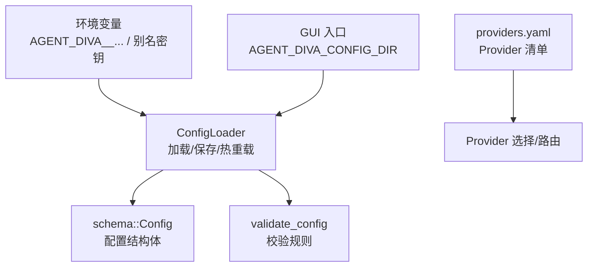
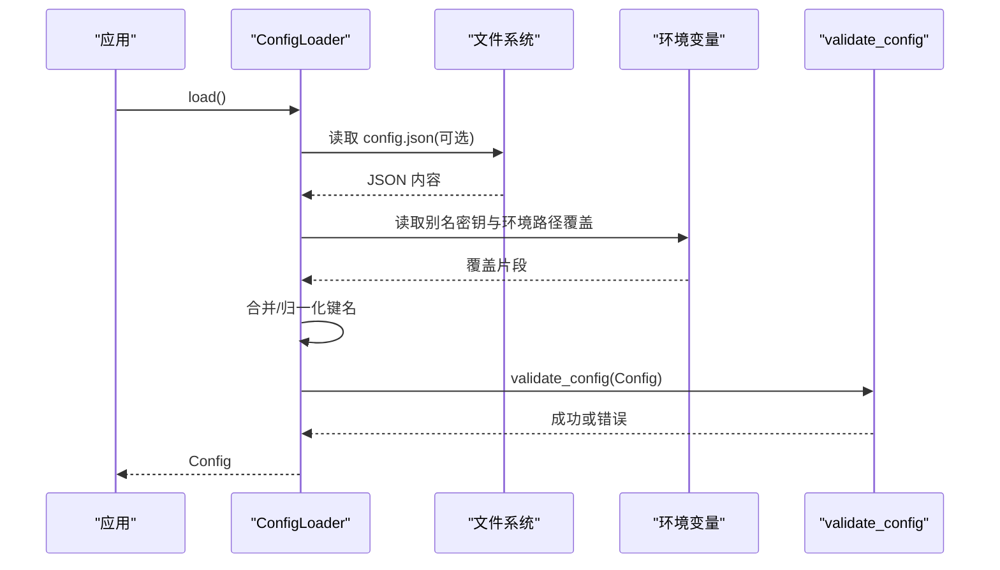
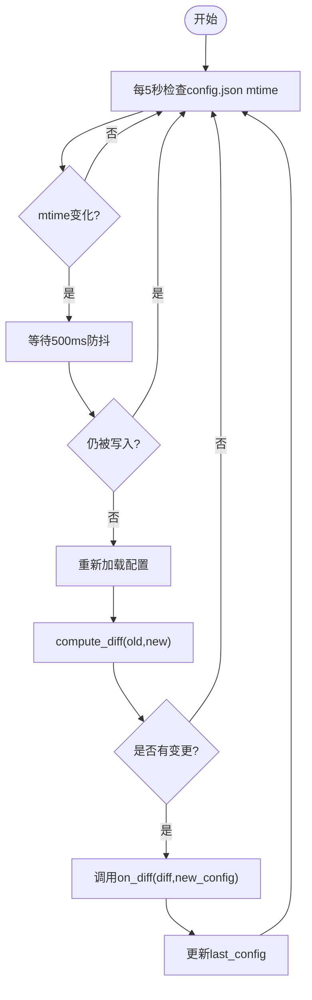
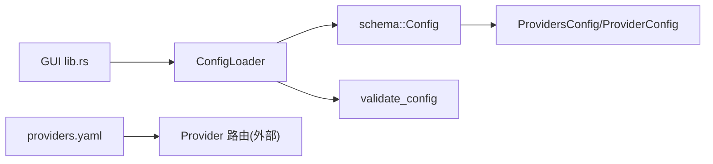

# 配置管理

<cite>
**本文引用的文件**
- [agent-diva-core/src/config/mod.rs](file://agent-diva-core/src/config/mod.rs)
- [agent-diva-core/src/config/schema.rs](file://agent-diva-core/src/config/schema.rs)
- [agent-diva-core/src/config/loader.rs](file://agent-diva-core/src/config/loader.rs)
- [agent-diva-core/src/config/validate.rs](file://agent-diva-core/src/config/validate.rs)
- [agent-diva-providers/src/providers.yaml](file://agent-diva-providers/src/providers.yaml)
- [agent-diva-gui/src-tauri/src/lib.rs](file://agent-diva-gui/src-tauri/src/lib.rs)
</cite>

## 目录
1. [简介](#简介)
2. [项目结构](#项目结构)
3. [核心组件](#核心组件)
4. [架构总览](#架构总览)
5. [详细组件分析](#详细组件分析)
6. [依赖关系分析](#依赖关系分析)
7. [性能考虑](#性能考虑)
8. [故障排除指南](#故障排除指南)
9. [结论](#结论)
10. [附录：常见配置场景示例](#附录：常见配置场景示例)

## 简介
本文件系统性说明 Agent-Diva 的配置管理机制，覆盖配置文件结构、各配置项含义（Provider、Channel、Agent 等）、环境变量覆盖机制与校验规则、动态刷新与热重载能力，并提供多提供商、多渠道接入、安全策略等常见场景的实践建议与排障指引。

## 项目结构
配置系统位于 core 模块中，由三部分构成：
- schema：定义所有配置的数据结构与默认值
- loader：负责从 JSON 配置文件与环境变量加载、合并、归一化并持久化
- validate：对最终配置进行业务级校验

此外，providers.yaml 集中声明了支持的 Provider 元信息（名称、默认模型、API Base、环境变量键等），用于 Provider 发现与路由。GUI 层通过环境变量 AGENT_DIVA_CONFIG_DIR 指定配置目录，并解析日志目录为绝对路径。

图表来源
- [agent-diva-core/src/config/loader.rs:19-74](file://agent-diva-core/src/config/loader.rs#L19-L74)
- [agent-diva-core/src/config/schema.rs:278-309](file://agent-diva-core/src/config/schema.rs#L278-L309)
- [agent-diva-providers/src/providers.yaml:1-163](file://agent-diva-providers/src/providers.yaml#L1-L163)
- [agent-diva-gui/src-tauri/src/lib.rs:48-78](file://agent-diva-gui/src-tauri/src/lib.rs#L48-L78)

章节来源
- [agent-diva-core/src/config/mod.rs:1-12](file://agent-diva-core/src/config/mod.rs#L1-L12)
- [agent-diva-core/src/config/loader.rs:19-74](file://agent-diva-core/src/config/loader.rs#L19-L74)
- [agent-diva-core/src/config/schema.rs:278-309](file://agent-diva-core/src/config/schema.rs#L278-L309)
- [agent-diva-providers/src/providers.yaml:1-163](file://agent-diva-providers/src/providers.yaml#L1-L163)
- [agent-diva-gui/src-tauri/src/lib.rs:48-78](file://agent-diva-gui/src-tauri/src/lib.rs#L48-L78)

## 核心组件
- ConfigLoader：提供 load/save/start_hot_reload 等方法，完成配置加载、保存与热重载监听
- schema::Config：顶层配置对象，聚合 agents/channels/providers/gateway/tools/memory/self_evolution/reports/logging/sandbox/mate 等子配置
- validate_config：对关键字段进行范围与枚举校验，如 temperature、reasoning_effort、MCP 传输方式、Web 搜索 provider 等
- providers.yaml：声明式 Provider 清单，包含 API 类型、默认模型、网关前缀、环境变量键、默认 API Base 等

章节来源
- [agent-diva-core/src/config/loader.rs:19-74](file://agent-diva-core/src/config/loader.rs#L19-L74)
- [agent-diva-core/src/config/schema.rs:278-309](file://agent-diva-core/src/config/schema.rs#L278-L309)
- [agent-diva-core/src/config/validate.rs:5-99](file://agent-diva-core/src/config/validate.rs#L5-L99)
- [agent-diva-providers/src/providers.yaml:1-163](file://agent-diva-providers/src/providers.yaml#L1-L163)

## 架构总览
配置加载流程如下：
1. 以默认 Config 为基底
2. 若存在 config.json，则读取并合并到基底
3. 应用别名环境变量覆盖（如 OPENAI_API_KEY -> providers.openai.api_key）
4. 应用路径型环境变量覆盖（AGENT_DIVA__AGENTS__DEFAULTS__MODEL 等）
5. 规范化旧键名（如 pet->mate、mcp_servers->mcpServers）
6. 反序列化为强类型 Config 并执行 validate_config
7. 可选启动热重载任务，轮询 mtime 变化，计算 diff 并回调

图表来源
- [agent-diva-core/src/config/loader.rs:57-74](file://agent-diva-core/src/config/loader.rs#L57-L74)
- [agent-diva-core/src/config/loader.rs:371-416](file://agent-diva-core/src/config/loader.rs#L371-L416)
- [agent-diva-core/src/config/validate.rs:5-99](file://agent-diva-core/src/config/validate.rs#L5-L99)

## 详细组件分析

### 配置结构（schema）
- 顶层 Config 聚合多个子系统配置：agents、channels、providers、gateway、tools、memory、self_evolution、reports、logging、sandbox、mate
- AgentsConfig/AgentDefaults：工作区、默认 provider、模型、max_tokens、temperature、max_tool_iterations、reasoning_effort、thinking_mode
- ChannelsConfig：包含 telegram/discord/whatsapp/feishu/dingtalk/email/slack/qq/matrix/neuro-link/irc/mattermost/nextcloud_talk 等通道配置
- ProvidersConfig：内置 provider 列表及自定义 provider；每个 ProviderConfig 支持 api_key、api_base、extra_headers、custom_models、reasoning_config、response_protocol
- ToolsConfig：内置工具开关、web 搜索/抓取、exec 超时、MCP servers、预算控制等
- GatewayConfig：host/port
- LoggingConfig：level/format/dir/overrides/retention_days
- SandboxConfig：mode/windows_level/network_access/approval_policy/writable_roots/protected_paths/deny_patterns/timeout_seconds
- MateConfig：VRM/TTS/ASR 开关与参数、各 TTS/ASR 提供商的 key/base_url/model/voice_id/reference 等
- ReportsConfig/LlmCurationConfig：报告生成与 LLM 摘要策略
- MemoryConfig：L1 索引行数限制

章节来源
- [agent-diva-core/src/config/schema.rs:278-309](file://agent-diva-core/src/config/schema.rs#L278-L309)
- [agent-diva-core/src/config/schema.rs:559-603](file://agent-diva-core/src/config/schema.rs#L559-L603)
- [agent-diva-core/src/config/schema.rs:605-642](file://agent-diva-core/src/config/schema.rs#L605-L642)
- [agent-diva-core/src/config/schema.rs:1193-1350](file://agent-diva-core/src/config/schema.rs#L1193-L1350)
- [agent-diva-core/src/config/schema.rs:1352-1437](file://agent-diva-core/src/config/schema.rs#L1352-L1437)
- [agent-diva-core/src/config/schema.rs:1419-1599](file://agent-diva-core/src/config/schema.rs#L1419-L1599)
- [agent-diva-core/src/config/schema.rs:1617-1735](file://agent-diva-core/src/config/schema.rs#L1617-L1735)
- [agent-diva-core/src/config/schema.rs:378-463](file://agent-diva-core/src/config/schema.rs#L378-L463)
- [agent-diva-core/src/config/schema.rs:311-331](file://agent-diva-core/src/config/schema.rs#L311-L331)

### 环境变量覆盖机制
- 别名密钥映射：将常见的 PROVIDER_API_KEY 环境变量直接写入对应 providers.*.api_key
- 路径型覆盖：AGENT_DIVA__<SECTION>__<FIELD> 形式的变量会按双下划线分割成路径并设置到配置树中，支持字符串、布尔、数字等类型自动解析
- 优先级：路径型环境变量 > 别名密钥 > 配置文件 > 默认值
- 键名归一化：将历史键名（如 pet->mate、mcp_servers->mcpServers、generic_pipe->neuro_link）统一为标准键

章节来源
- [agent-diva-core/src/config/loader.rs:371-416](file://agent-diva-core/src/config/loader.rs#L371-L416)
- [agent-diva-core/src/config/loader.rs:429-463](file://agent-diva-core/src/config/loader.rs#L429-L463)

### 配置校验规则（validate）
- agents.defaults.workspace 非空
- agents.defaults.max_tokens > 0
- agents.defaults.temperature ∈ [0.0, 2.0]
- agents.defaults.max_tool_iterations > 0
- agents.defaults.reasoning_effort ∈ {low, medium, high}
- tools.mcp_servers 必须提供 command（stdio）或 url（http）之一
- tools.web.search.provider ∈ {brave, bocha, zhipu}，且 max_results 有上限（zhipu/bocha 更高）
- mate.asr_provider ∈ {web_speech, siliconflow}
- mate.tts_provider ∈ {browser, openai, siliconflow, minimax}
- mate.tts_speed > 0，tts_volume ∈ [0.0, 2.0]
- reports.llm_curation 的 timeout/max_input/max_output/fallback 需满足约束

章节来源
- [agent-diva-core/src/config/validate.rs:5-99](file://agent-diva-core/src/config/validate.rs#L5-L99)

### 热重载与动态刷新
- 启动后台任务每 5 秒检查 config.json 的 mtime
- 检测到变更后等待 500ms 防抖，再次确认未继续写入后重新加载
- 使用 compute_diff 对比新旧配置，区分 hot_reload 与 restart_required 两类变更
- 可热重载的字段包括：agents.defaults.model/temperature/max_tool_iterations/reasoning_effort、tools.budget/exec.timeout/web.search.enabled/web.fetch.enabled、sandbox.mode/approval_policy、logging.level 等
- 其他字段（如 gateway.port、provider keys、channel tokens 等）需要重启生效

图表来源
- [agent-diva-core/src/config/loader.rs:94-172](file://agent-diva-core/src/config/loader.rs#L94-L172)
- [agent-diva-core/src/config/loader.rs:214-306](file://agent-diva-core/src/config/loader.rs#L214-L306)

章节来源
- [agent-diva-core/src/config/loader.rs:94-172](file://agent-diva-core/src/config/loader.rs#L94-L172)
- [agent-diva-core/src/config/loader.rs:214-306](file://agent-diva-core/src/config/loader.rs#L214-L306)

### GUI 与配置目录
- 通过环境变量 AGENT_DIVA_CONFIG_DIR 指定配置目录，支持 ~/ 展开为用户主目录
- 日志目录在 GUI 初始化时会被解析为绝对路径，便于跨平台一致行为

章节来源
- [agent-diva-gui/src-tauri/src/lib.rs:48-78](file://agent-diva-gui/src-tauri/src/lib.rs#L48-L78)

## 依赖关系分析
- ConfigLoader 依赖 schema::Config 与 validate_config
- schema::Config 聚合多个子系统配置，形成高内聚、低耦合的结构
- providers.yaml 作为 Provider 元数据源，影响 Provider 选择与路由逻辑（不在本文件中实现，但被上层使用）
- GUI 层仅关心配置目录与日志路径解析，不直接操作配置结构

图表来源
- [agent-diva-core/src/config/loader.rs:19-74](file://agent-diva-core/src/config/loader.rs#L19-L74)
- [agent-diva-core/src/config/schema.rs:1193-1350](file://agent-diva-core/src/config/schema.rs#L1193-L1350)
- [agent-diva-providers/src/providers.yaml:1-163](file://agent-diva-providers/src/providers.yaml#L1-L163)
- [agent-diva-gui/src-tauri/src/lib.rs:48-78](file://agent-diva-gui/src-tauri/src/lib.rs#L48-L78)

章节来源
- [agent-diva-core/src/config/loader.rs:19-74](file://agent-diva-core/src/config/loader.rs#L19-L74)
- [agent-diva-core/src/config/schema.rs:1193-1350](file://agent-diva-core/src/config/schema.rs#L1193-L1350)
- [agent-diva-providers/src/providers.yaml:1-163](file://agent-diva-providers/src/providers.yaml#L1-L163)
- [agent-diva-gui/src-tauri/src/lib.rs:48-78](file://agent-diva-gui/src-tauri/src/lib.rs#L48-L78)

## 性能考虑
- 热重载采用 5 秒轮询 + 500ms 防抖，避免频繁重读与重解析
- 配置差异计算基于 JSON Value 递归比较，仅在变更时触发回调
- 合理设置 logging.retention_days 控制日志磁盘占用
- Web 搜索 max_results 受 provider 限制，避免过大导致响应缓慢

[本节为通用指导，无需具体文件引用]

## 故障排除指南
- 校验失败：当 temperature、reasoning_effort、MCP 传输、Web 搜索 provider 等不符合约束时，load 会返回错误；请根据错误信息修正配置
- 环境变量未生效：确认是否使用了正确的路径型变量格式（AGENT_DIVA__<SECTION>__<FIELD>），以及是否被更高层级的覆盖
- 热重载未触发：检查 config.json 是否确实被修改（编辑器自动保存可能多次写入），确认 mtime 变化与防抖逻辑
- 渠道无法连接：确保对应 channel 的 enabled 与必要凭据已正确配置（如 token、app_id、secret 等）
- 日志目录问题：GUI 会将日志目录解析为绝对路径，若相对路径异常，检查配置目录与工作空间路径

章节来源
- [agent-diva-core/src/config/validate.rs:5-99](file://agent-diva-core/src/config/validate.rs#L5-L99)
- [agent-diva-core/src/config/loader.rs:371-416](file://agent-diva-core/src/config/loader.rs#L371-L416)
- [agent-diva-core/src/config/loader.rs:94-172](file://agent-diva-core/src/config/loader.rs#L94-L172)
- [agent-diva-gui/src-tauri/src/lib.rs:48-78](file://agent-diva-gui/src-tauri/src/lib.rs#L48-L78)

## 结论
Agent-Diva 的配置系统通过 schema/loader/validate 三层分离，提供了清晰、可扩展且安全的配置管理能力。环境变量覆盖机制支持灵活部署，热重载提升了运维效率。结合 providers.yaml 的声明式 Provider 清单，可实现多提供商、多渠道的统一接入。遵循校验规则与最佳实践，可有效降低配置错误风险。

[本节为总结性内容，无需具体文件引用]

## 附录：常见配置场景示例

### 多提供商配置
- 在 providers 下为不同提供商设置 api_key、api_base、custom_models 等
- 可通过环境变量 OPENAI_API_KEY、DEEPSEEK_API_KEY 等注入密钥
- 使用 agents.defaults.provider 指定默认提供商，或通过模型前缀路由到不同提供商

章节来源
- [agent-diva-core/src/config/schema.rs:1193-1350](file://agent-diva-core/src/config/schema.rs#L1193-L1350)
- [agent-diva-core/src/config/loader.rs:371-394](file://agent-diva-core/src/config/loader.rs#L371-L394)
- [agent-diva-providers/src/providers.yaml:1-163](file://agent-diva-providers/src/providers.yaml#L1-L163)

### 多渠道接入
- 启用 channels.telegram/discord/whatsapp/feishu/dingtalk/email/slack/qq/matrix/neuro-link/irc/mattermost/nextcloud_talk 等
- 为每个渠道设置 enabled、token/app_id/secret 等凭据，以及 allow_from 白名单
- 注意部分渠道需要额外服务（如 WhatsApp bridge）

章节来源
- [agent-diva-core/src/config/schema.rs:605-642](file://agent-diva-core/src/config/schema.rs#L605-L642)
- [agent-diva-core/src/config/schema.rs:644-1191](file://agent-diva-core/src/config/schema.rs#L644-L1191)

### 安全策略设置
- sandbox.mode 设置为 WorkspaceWrite/ReadOnly/DangerFullAccess，配合 approval_policy 控制命令执行审批
- tools.restrict_to_workspace 限制工具访问范围
- logging.overrides 可按模块调整日志级别，便于审计与调试

章节来源
- [agent-diva-core/src/config/schema.rs:8-95](file://agent-diva-core/src/config/schema.rs#L8-L95)
- [agent-diva-core/src/config/schema.rs:1419-1437](file://agent-diva-core/src/config/schema.rs#L1419-L1437)
- [agent-diva-core/src/config/schema.rs:511-557](file://agent-diva-core/src/config/schema.rs#L511-L557)

### 动态刷新与热重载
- 修改 agents.defaults.model/temperature 等允许热重载的字段，可在不重启的情况下生效
- 修改 gateway.port、provider keys、channel tokens 等需要重启的字段，系统将提示需要重启

章节来源
- [agent-diva-core/src/config/loader.rs:214-306](file://agent-diva-core/src/config/loader.rs#L214-L306)
- [agent-diva-core/src/config/loader.rs:94-172](file://agent-diva-core/src/config/loader.rs#L94-L172)