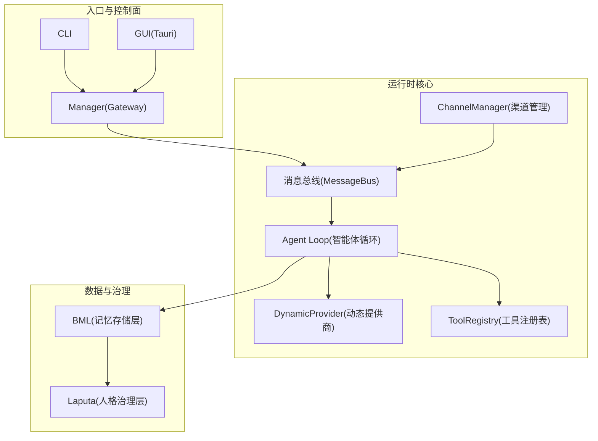
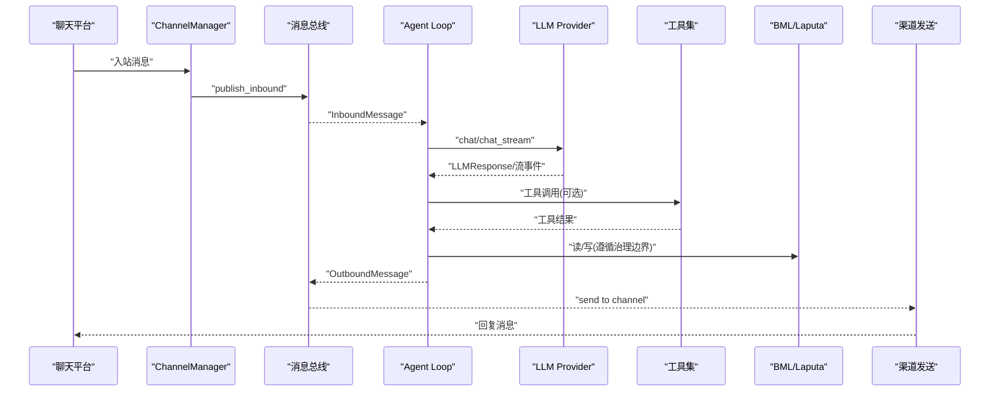
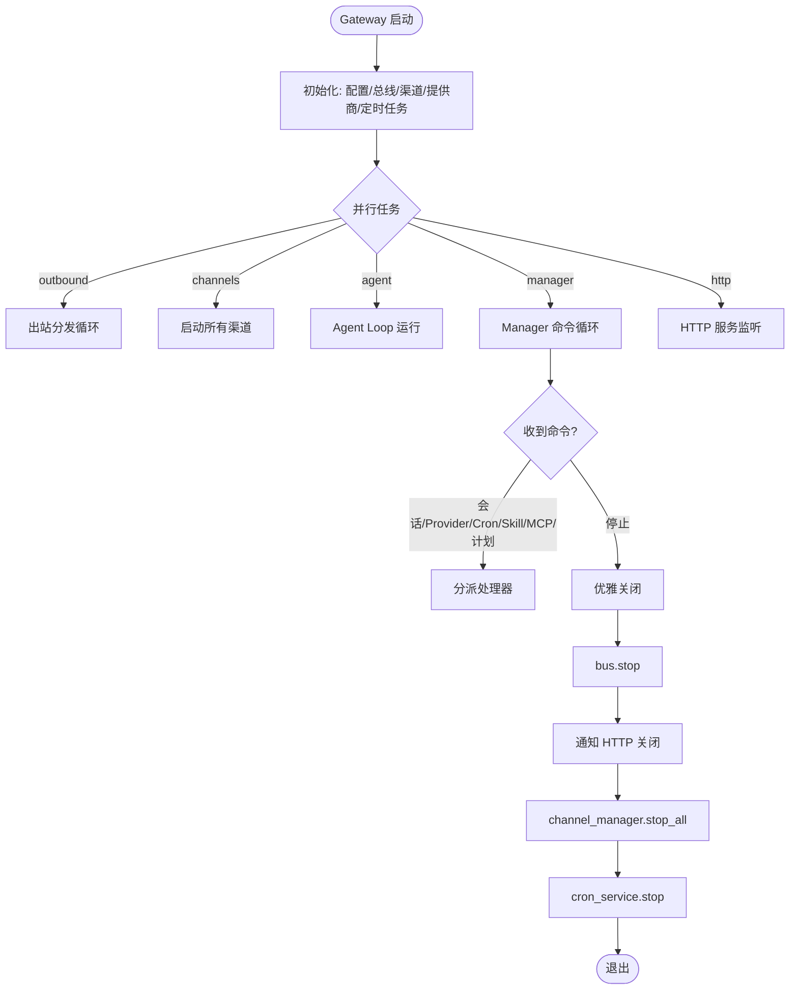
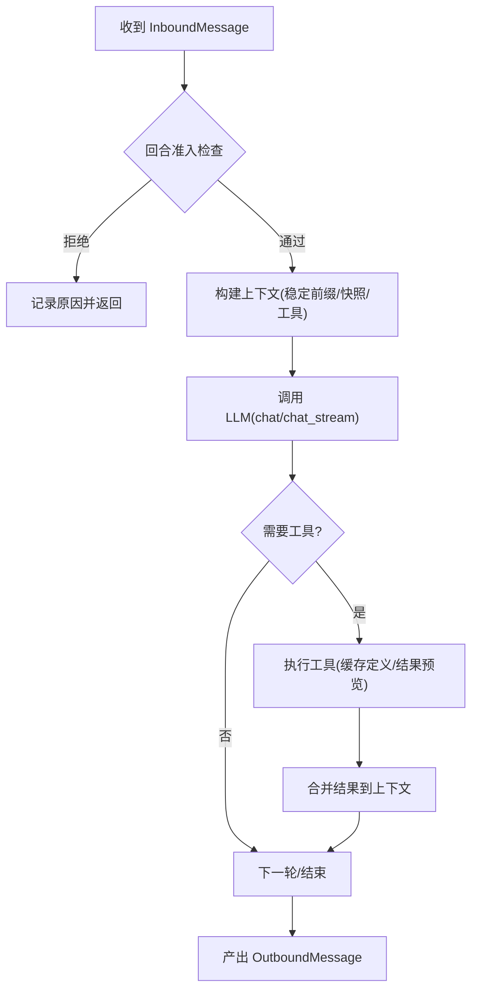
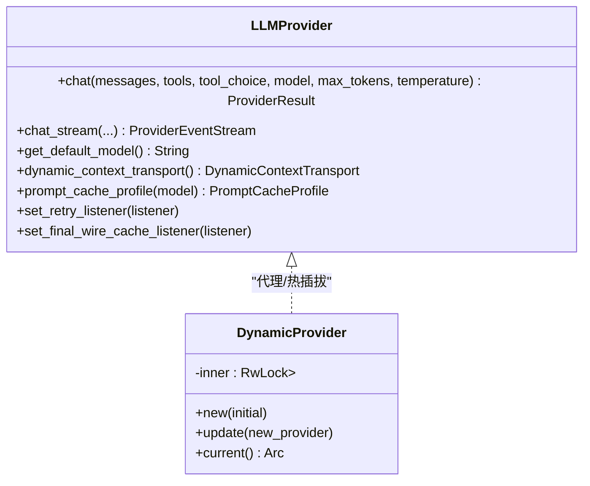
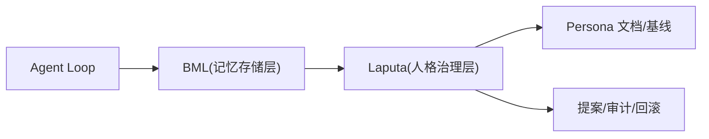
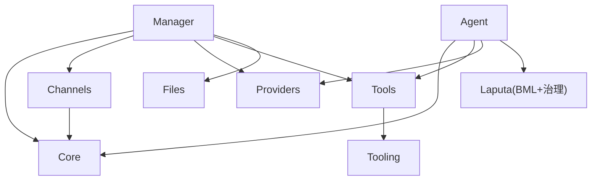

# 架构概览

<cite>
**本文引用的文件**
- [README.md](file://README.md)
- [Cargo.toml](file://Cargo.toml)
- [agent-diva-core/src/lib.rs](file://agent-diva-core/src/lib.rs)
- [agent-diva-core/src/bus/mod.rs](file://agent-diva-core/src/bus/mod.rs)
- [agent-diva-agent/src/lib.rs](file://agent-diva-agent/src/lib.rs)
- [agent-diva-agent/src/agent_loop/turn/admission.rs](file://agent-diva-agent/src/agent_loop/turn/admission.rs)
- [agent-diva-agent/src/agent_loop/turn/tool_step.rs](file://agent-diva-agent/src/agent_loop/turn/tool_step.rs)
- [agent-diva-providers/src/lib.rs](file://agent-diva-providers/src/lib.rs)
- [agent-diva-channels/src/lib.rs](file://agent-diva-channels/src/lib.rs)
- [agent-diva-tools/src/lib.rs](file://agent-diva-tools/src/lib.rs)
- [agent-diva-laputa/src/lib.rs](file://agent-diva-laputa/src/lib.rs)
- [agent-diva-manager/src/lib.rs](file://agent-diva-manager/src/lib.rs)
- [agent-diva-manager/src/manager.rs](file://agent-diva-manager/src/manager.rs)
- [agent-diva-manager/src/runtime/bootstrap.rs](file://agent-diva-manager/src/runtime/bootstrap.rs)
</cite>

## 目录
1. [简介](#简介)
2. [项目结构](#项目结构)
3. [核心组件](#核心组件)
4. [架构总览](#架构总览)
5. [详细组件分析](#详细组件分析)
6. [依赖关系分析](#依赖关系分析)
7. [性能与可扩展性](#性能与可扩展性)
8. [故障排查指南](#故障排查指南)
9. [结论](#结论)
10. [附录](#附录)

## 简介
Agent Diva 是一个自托管的个人 AI 网关，将聊天平台、LLM 提供商、工具、记忆与治理层统一编排。消息从渠道进入消息总线，经智能体循环调用 LLM 与工具，再回写到对应渠道；同时通过 BML 持久化与 Laputa 治理实现人格与记忆的受控演进。Gateway（Manager）是会话、路由与通道连接的唯一事实源，CLI/TUI/GUI 作为控制面与之交互。

## 项目结构
仓库采用多 crate 工作区组织，职责按能力分层：
- agent-diva-core：基础类型、事件总线、配置、会话、心跳、计划、安全等共享能力
- agent-diva-agent：智能体循环、上下文装配、技能加载、回合执行策略
- agent-diva-providers：LLM 提供商抽象与多种实现、动态切换
- agent-diva-channels：多渠道接入（Telegram/Discord/QQ/钉钉/飞书/邮件等）
- agent-diva-tools：内置工具注册与实现（文件系统、Shell、Web、记忆、Cron 等）
- agent-diva-files：文件索引与管理辅助
- agent-diva-tooling：工具抽象与通用工具库
- agent-diva-neuron：桌面 GUI 使用的支撑类型
- agent-diva-manager：本地 Gateway 与 HTTP 控制面
- agent-diva-laputa：BML 存储层与 Laputa 人格治理层
- agent-diva-autodream：提案生成与生命周期
- agent-diva-sandbox：沙箱策略与执行审批
- agent-diva-cli / agent-diva-service / agent-diva-gui：用户入口与服务封装

图表来源
- [README.md:45-58](file://README.md#L45-L58)
- [Cargo.toml:1-20](file://Cargo.toml#L1-L20)

章节来源
- [README.md:87-108](file://README.md#L87-L108)
- [Cargo.toml:1-20](file://Cargo.toml#L1-L20)

## 核心组件
- Gateway（Manager）：负责启动/协调各子系统、HTTP 控制面、会话与命令分发、运行时控制。
- 消息总线（MessageBus）：入站/出站双队列，解耦渠道与智能体核心。
- 智能体循环（Agent Loop）：回合准入、上下文装配、工具编排、与 LLM 交互、结果回写。
- Provider（LLM 提供商）：抽象接口 + 多实现 + 动态切换，支持流式与非流式调用。
- Channel（渠道）：多渠道适配器，统一入站消息到总线，出站消息回写渠道。
- Memory（BML/Laputa）：BML 为权威记忆存储（SQLite+FTS5），Laputa 提供提案、治理、冻结基线。
- Tool（工具）：注册表驱动，支持文件系统、Shell、Web、记忆、Cron、MCP 等。

章节来源
- [agent-diva-manager/src/lib.rs:1-19](file://agent-diva-manager/src/lib.rs#L1-L19)
- [agent-diva-core/src/bus/mod.rs:1-14](file://agent-diva-core/src/bus/mod.rs#L1-L14)
- [agent-diva-agent/src/lib.rs:1-29](file://agent-diva-agent/src/lib.rs#L1-L29)
- [agent-diva-providers/src/lib.rs:1-124](file://agent-diva-providers/src/lib.rs#L1-L124)
- [agent-diva-channels/src/lib.rs:1-53](file://agent-diva-channels/src/lib.rs#L1-L53)
- [agent-diva-laputa/src/lib.rs:1-56](file://agent-diva-laputa/src/lib.rs#L1-L56)
- [agent-diva-tools/src/lib.rs:1-74](file://agent-diva-tools/src/lib.rs#L1-L74)

## 架构总览
整体数据流：聊天平台 → Gateway → 消息总线 → 智能体循环 → LLM/工具 → 记忆/治理 → 返回渠道。Gateway 暴露 HTTP API，供外部注入消息或进行状态管理。

图表来源
- [agent-diva-manager/src/runtime/bootstrap.rs:275-291](file://agent-diva-manager/src/runtime/bootstrap.rs#L275-L291)
- [agent-diva-core/src/bus/mod.rs:1-14](file://agent-diva-core/src/bus/mod.rs#L1-L14)
- [agent-diva-providers/src/lib.rs:46-124](file://agent-diva-providers/src/lib.rs#L46-L124)
- [agent-diva-agent/src/agent_loop/turn/tool_step.rs:146-174](file://agent-diva-agent/src/agent_loop/turn/tool_step.rs#L146-L174)
- [agent-diva-laputa/src/lib.rs:1-56](file://agent-diva-laputa/src/lib.rs#L1-L56)

## 详细组件分析

### Gateway（Manager）
- 职责：组装运行时、启动 HTTP 服务、处理 ManagerCommand（会话、Cron、Provider、Skill、MCP、计划报告等）、向 Agent Loop 下发运行时控制命令。
- 关键流程：
  - 初始化时创建 MessageBus、ChannelManager、CronService、DynamicProvider 等。
  - 并行启动 outbound 分发、channel 启动、agent 运行、manager 命令循环、HTTP 服务。
  - 优雅关闭顺序：bus.stop → HTTP shutdown → 任务中止/等待 → channel_manager.stop_all → cron_service.stop。

图表来源
- [agent-diva-manager/src/manager.rs:263-396](file://agent-diva-manager/src/manager.rs#L263-L396)
- [agent-diva-manager/src/runtime/bootstrap.rs:275-291](file://agent-diva-manager/src/runtime/bootstrap.rs#L275-L291)

章节来源
- [agent-diva-manager/src/lib.rs:1-19](file://agent-diva-manager/src/lib.rs#L1-L19)
- [agent-diva-manager/src/manager.rs:263-396](file://agent-diva-manager/src/manager.rs#L263-L396)

### 消息总线（MessageBus）
- 设计：入站/出站双队列，解耦渠道与智能体核心。
- 作用：渠道侧将入站消息桥接到 bus.publish_inbound；Agent Loop 订阅 inbound，处理后产出 outbound 消息由总线分发回渠道。

章节来源
- [agent-diva-core/src/bus/mod.rs:1-14](file://agent-diva-core/src/bus/mod.rs#L1-L14)
- [agent-diva-manager/src/runtime/bootstrap.rs:275-291](file://agent-diva-manager/src/runtime/bootstrap.rs#L275-L291)

### 智能体循环（Agent Loop）
- 回合准入：拒绝电路触发或速率限制耗尽时拒绝新回合。
- 上下文装配：稳定前缀、会话快照、工具定义缓存、预算与压缩策略。
- 工具编排：工具定义缓存、结果预览、错误包装、记忆写入规则提示。
- 与 LLM 交互：通过 DynamicProvider 调用 chat/chat_stream，并处理流式事件。

图表来源
- [agent-diva-agent/src/agent_loop/turn/admission.rs:94-117](file://agent-diva-agent/src/agent_loop/turn/admission.rs#L94-L117)
- [agent-diva-agent/src/agent_loop/turn/tool_step.rs:146-174](file://agent-diva-agent/src/agent_loop/turn/tool_step.rs#L146-L174)
- [agent-diva-providers/src/lib.rs:46-124](file://agent-diva-providers/src/lib.rs#L46-L124)

章节来源
- [agent-diva-agent/src/lib.rs:1-29](file://agent-diva-agent/src/lib.rs#L1-L29)
- [agent-diva-agent/src/agent_loop/turn/admission.rs:94-117](file://agent-diva-agent/src/agent_loop/turn/admission.rs#L94-L117)
- [agent-diva-agent/src/agent_loop/turn/tool_step.rs:146-174](file://agent-diva-agent/src/agent_loop/turn/tool_step.rs#L146-L174)

### Provider（LLM 提供商）
- 抽象：LLMProvider 接口统一 chat/chat_stream、模型能力查询、缓存策略、重试监听等。
- 动态切换：DynamicProvider 持有可替换的 Arc<dyn LLMProvider>，支持热更新。
- 实现：OpenAI 兼容、Anthropic、Ollama、DeepSeek 等，配合 ProviderCatalogService 与 Registry。

图表来源
- [agent-diva-providers/src/lib.rs:46-124](file://agent-diva-providers/src/lib.rs#L46-L124)

章节来源
- [agent-diva-providers/src/lib.rs:1-124](file://agent-diva-providers/src/lib.rs#L1-L124)

### Channel（渠道）
- 职责：对接各聊天平台，统一入站消息到总线，并将出站消息投递到对应渠道。
- 默认启用：Telegram、Discord、QQ、钉钉、飞书、邮件；部分渠道需 feature 编译。

章节来源
- [agent-diva-channels/src/lib.rs:1-53](file://agent-diva-channels/src/lib.rs#L1-L53)

### 工具（Tool）
- 注册表：ToolRegistry 统一管理工具发现与执行，支持 MCP SDK、文件系统、Shell、Web、记忆、Cron、计划等。
- 安全与审计：工具执行结果可被审计与脱敏，大结果以 artifact 引用形式保留。

章节来源
- [agent-diva-tools/src/lib.rs:1-74](file://agent-diva-tools/src/lib.rs#L1-L74)

### 记忆与治理（BML + Laputa）
- BML：基于 SQLite + FTS5 的记忆存储层，单一权威；提供 typed store、检索、完整性校验、迁移等。
- Laputa：在 BML 之上提供提案、治理 apply/rollback、审计、Frozen Core 基线、认知分区与 persona 文档管理。
- 边界：治理层禁止直写 BML 写接口，确保存储与治理职责分离。

图表来源
- [agent-diva-laputa/src/lib.rs:1-56](file://agent-diva-laputa/src/lib.rs#L1-L56)

章节来源
- [agent-diva-laputa/src/lib.rs:1-56](file://agent-diva-laputa/src/lib.rs#L1-L56)

## 依赖关系分析
- 工作区成员：core、agent、providers、channels、tools、files、tooling、neuron、manager、laputa、sandbox、cli、service、gui、e2e、migration、autodream。
- 耦合点：
  - Manager 依赖 core(bus/config/cron/governance)、channels、providers、tools、files。
  - Agent 依赖 core(memory/session/planning/security)、tools、providers。
  - Laputa 提供 BML 与治理门面，被 agent/manager/migration 消费。
  - Channels 仅通过 bus 与 manager 集成。

图表来源
- [Cargo.toml:1-20](file://Cargo.toml#L1-L20)
- [agent-diva-manager/src/manager.rs:1-44](file://agent-diva-manager/src/manager.rs#L1-L44)
- [agent-diva-agent/src/lib.rs:1-29](file://agent-diva-agent/src/lib.rs#L1-L29)
- [agent-diva-laputa/src/lib.rs:1-56](file://agent-diva-laputa/src/lib.rs#L1-L56)

章节来源
- [Cargo.toml:1-20](file://Cargo.toml#L1-L20)

## 性能与可扩展性
- 异步与并发：基于 tokio 的多线程运行时，消息总线与子系统并行启动，减少阻塞。
- 工具定义缓存：在多迭代回合中缓存工具 schema，避免重复构造。
- 事件负载优化：工具完成事件仅携带有界结果预览，降低流式传输开销。
- 内存与上下文：稳定前缀与检查点机制，结合预算与压缩策略，控制上下文大小。
- 可扩展性：
  - Provider 动态切换，支持热更新。
  - Channel 通过 feature 开关按需编译。
  - Tool 注册表扩展新工具无需改动核心。
  - BML/Laputa 边界清晰，便于未来独立 BML crate 抽取。

[本节为通用指导，不直接分析具体文件]

## 故障排查指南
- 渠道初始化失败：Gateway 启动时若渠道初始化失败会记录错误但继续启动，需检查渠道配置与网络连通性。
- 消息总线异常：入站消息发布失败会记录错误日志，确认 bus 是否已正确创建且未提前停止。
- 提供商调用失败：使用 retry listener 与最终线缆缓存监听定位问题；检查模型解析与凭据。
- 工具执行错误：工具步骤返回错误包装输出，关注 memory-write-rules 提示与结果预览。
- 治理与记忆：BML 完整性校验失败或治理回滚路径异常时，查看 Laputa 审计与提案状态。

章节来源
- [agent-diva-manager/src/runtime/bootstrap.rs:275-291](file://agent-diva-manager/src/runtime/bootstrap.rs#L275-L291)
- [agent-diva-agent/src/agent_loop/turn/tool_step.rs:146-174](file://agent-diva-agent/src/agent_loop/turn/tool_step.rs#L146-L174)
- [agent-diva-providers/src/lib.rs:116-124](file://agent-diva-providers/src/lib.rs#L116-L124)

## 结论
Agent Diva 通过 Gateway、消息总线、智能体循环、Provider、Channel、Tool、Memory/Governance 的分层与解耦，实现了高内聚、低耦合的可扩展架构。BML 与 Laputa 的职责分离确保了记忆与人格演进的稳定性与可控性；动态 Provider 与插件化设计为未来扩展提供了坚实基础。面向架构师与高级开发者，建议重点关注：
- 消息总线与回合准入策略对系统吞吐与稳定性的影响
- Provider 动态切换与缓存策略对延迟与成本的影响
- BML/Laputa 边界与治理流程对数据一致性与可审计性的保障
- 工具注册与执行策略对安全与性能的影响

[本节为总结性内容，不直接分析具体文件]

## 附录
- 部署拓扑图（Gateway 进程内包含 Manager、Agent Loop、ChannelManager、CronService、HTTP Server；外部依赖 Provider 与渠道平台；数据落盘至 BML/Laputa）
- 组件交互图：见“架构总览”中的序列图
- 工作区布局与各 crate 职责：见“项目结构”

[本节为概念性说明，不直接分析具体文件]