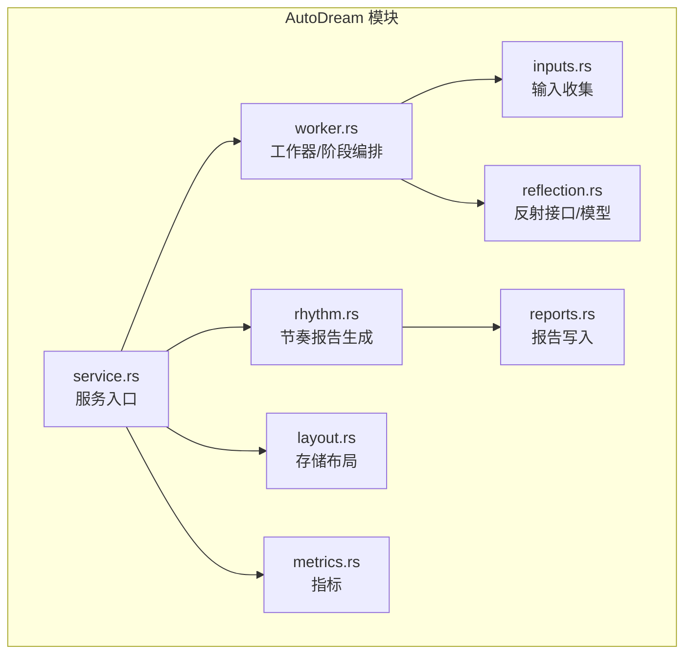
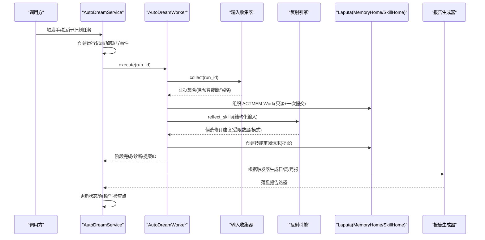
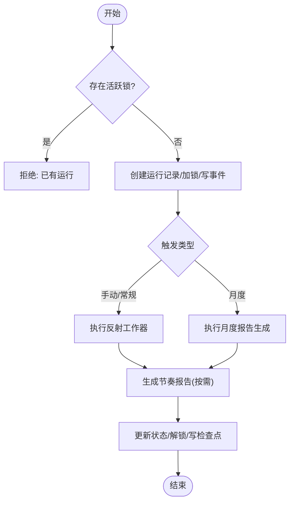
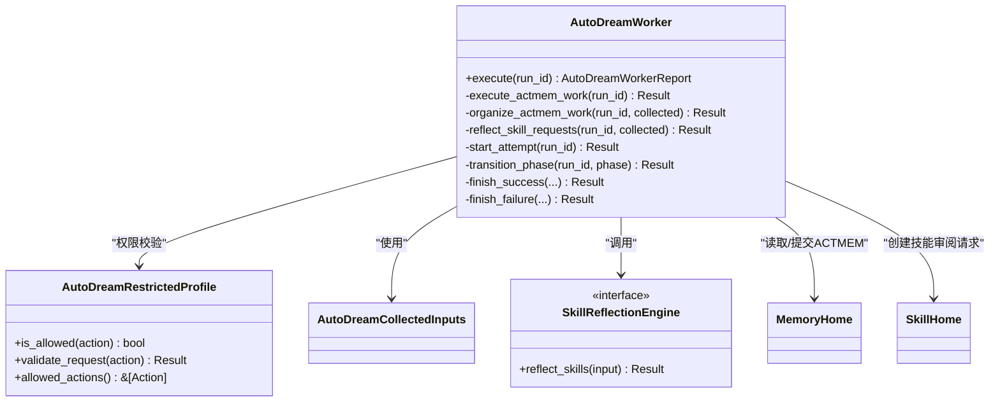
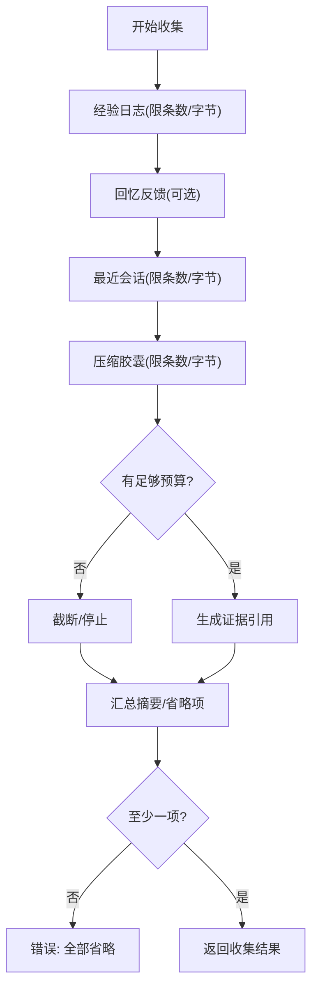
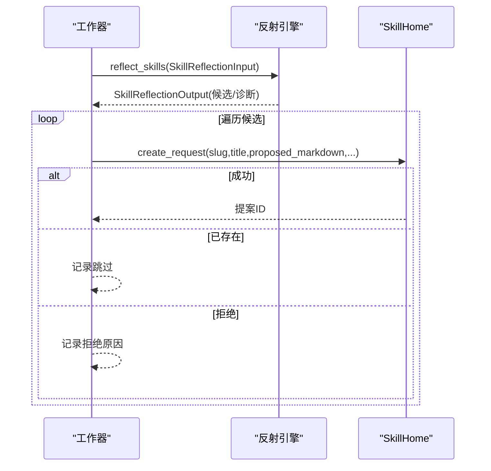
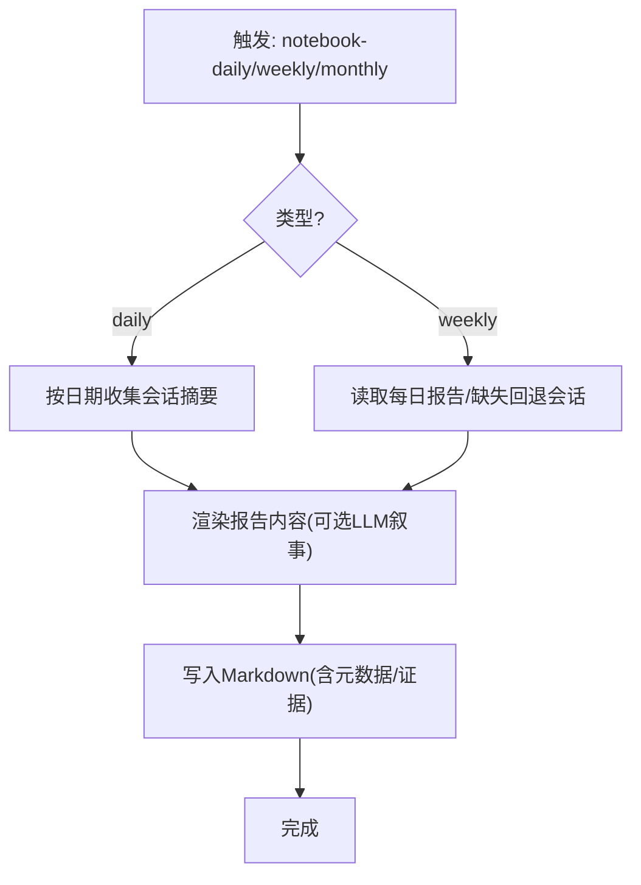
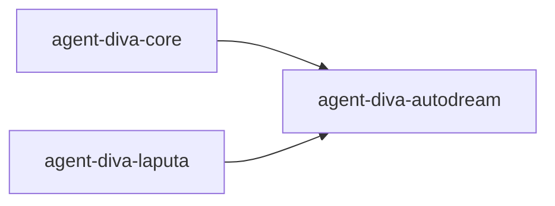

# AutoDream 提案生成

<cite>
**本文引用的文件**
- [agent-diva-autodream/Cargo.toml](file://agent-diva-autodream/Cargo.toml)
- [agent-diva-autodream/agents.md](file://agent-diva-autodream/agents.md)
- [agent-diva-autodream/src/lib.rs](file://agent-diva-autodream/src/lib.rs)
- [agent-diva-autodream/src/service.rs](file://agent-diva-autodream/src/service.rs)
- [agent-diva-autodream/src/worker.rs](file://agent-diva-autodream/src/worker.rs)
- [agent-diva-autodream/src/reflection.rs](file://agent-diva-autodream/src/reflection.rs)
- [agent-diva-autodream/src/inputs.rs](file://agent-diva-autodream/src/inputs.rs)
- [agent-diva-autodream/src/reports.rs](file://agent-diva-autodream/src/reports.rs)
- [agent-diva-autodream/src/rhythm.rs](file://agent-diva-autodream/src/rhythm.rs)
- [agent-diva-autodream/src/layout.rs](file://agent-diva-autodream/src/layout.rs)
- [agent-diva-autodream/src/metrics.rs](file://agent-diva-autodream/src/metrics.rs)
</cite>

## 目录
1. [简介](#简介)
2. [项目结构](#项目结构)
3. [核心组件](#核心组件)
4. [架构总览](#架构总览)
5. [详细组件分析](#详细组件分析)
6. [依赖关系分析](#依赖关系分析)
7. [性能与调优](#性能与调优)
8. [故障排除指南](#故障排除指南)
9. [结论](#结论)
10. [附录：配置、模板与评估](#附录配置模板与评估)

## 简介
AutoDream 是 Agent Diva 的“自动蒸馏与提案生成”子系统，负责从会话、经验日志、上下文压缩胶囊等来源收集证据，组织 ACTMEM Work，驱动技能反思引擎生成可治理的提案（如技能修订请求），并产出节奏报告（日报/周报/月报）。它严格遵循“文件优先”的存储策略，所有权威写入通过 Laputa 治理边界完成，本模块仅负责草稿与提议。

面向初学者：AutoDream 的价值在于把分散的工作痕迹转化为结构化洞察，并以最小权限、可审计的方式提出改进建议，避免直接修改系统权威数据。  
面向高级用户：可通过反射引擎注入、工作区预算、重试与失败码、事件追踪等进行深度调优与扩展。

## 项目结构
AutoDream 以模块化方式组织：服务层编排运行生命周期；工作器执行四阶段反思流程；输入收集器聚合多源证据；报告生成器输出节奏报告；布局模块管理持久化路径；指标模块统计运行与失败；错误类型统一封装。

图表来源
- [agent-diva-autodream/src/service.rs:124-200](file://agent-diva-autodream/src/service.rs#L124-L200)
- [agent-diva-autodream/src/worker.rs:152-210](file://agent-diva-autodream/src/worker.rs#L152-L210)
- [agent-diva-autodream/src/inputs.rs:75-151](file://agent-diva-autodream/src/inputs.rs#L75-L151)
- [agent-diva-autodream/src/reflection.rs:64-70](file://agent-diva-autodream/src/reflection.rs#L64-L70)
- [agent-diva-autodream/src/reports.rs:76-137](file://agent-diva-autodream/src/reports.rs#L76-L137)
- [agent-diva-autodream/src/rhythm.rs:16-151](file://agent-diva-autodream/src/rhythm.rs#L16-L151)
- [agent-diva-autodream/src/layout.rs:12-144](file://agent-diva-autodream/src/layout.rs#L12-L144)
- [agent-diva-autodream/src/metrics.rs:3-45](file://agent-diva-autodream/src/metrics.rs#L3-L45)

章节来源
- [agent-diva-autodream/agents.md:1-37](file://agent-diva-autodream/agents.md#L1-L37)
- [agent-diva-autodream/Cargo.toml:1-27](file://agent-diva-autodream/Cargo.toml#L1-L27)

## 核心组件
- 服务层（AutoDreamService）：提供手动触发、状态查询、取消、恢复过期锁、月度报告调度、事件追加、检查点管理等能力。
- 工作器（AutoDreamWorker）：按 Orient → Gather → Consolidate → Propose 四阶段推进，维护阶段记录、诊断信息、失败码与提案 ID 列表。
- 输入收集器（AutoDreamInputCollector）：按优先级收集经验日志、回忆反馈、最近会话、压缩胶囊，受字节预算限制，生成带证据引用的摘要。
- 反射引擎（SkillReflectionEngine）：抽象外部技能反思提供者，接收结构化输入，返回候选技能修订建议。
- 报告生成器（AutoDreamRhythmReportGenerator / AutoDreamReportWriter）：基于会话窗口或已有日报生成周/月报，落盘为 Markdown，附带元数据与证据引用。
- 存储布局（AutoDreamStorage/AutoDreamPaths）：定义工作区下的 .agent-diva/autodream 与 .laputa/reports 目录结构，支持迁移与幂等初始化。
- 指标（AutoDreamMetrics）：进程内原子计数器，统计运行总数与失败数。

章节来源
- [agent-diva-autodream/src/service.rs:124-200](file://agent-diva-autodream/src/service.rs#L124-L200)
- [agent-diva-autodream/src/worker.rs:152-210](file://agent-diva-autodream/src/worker.rs#L152-L210)
- [agent-diva-autodream/src/inputs.rs:75-151](file://agent-diva-autodream/src/inputs.rs#L75-L151)
- [agent-diva-autodream/src/reflection.rs:64-70](file://agent-diva-autodream/src/reflection.rs#L64-L70)
- [agent-diva-autodream/src/reports.rs:76-137](file://agent-diva-autodream/src/reports.rs#L76-L137)
- [agent-diva-autodream/src/rhythm.rs:16-151](file://agent-diva-autodream/src/rhythm.rs#L16-L151)
- [agent-diva-autodream/src/layout.rs:12-144](file://agent-diva-autodream/src/layout.rs#L12-L144)
- [agent-diva-autodream/src/metrics.rs:3-45](file://agent-diva-autodream/src/metrics.rs#L3-L45)

## 架构总览
AutoDream 采用“服务编排 + 工作器阶段化执行 + 外部反射引擎 + 文件落盘”的分层架构。服务负责生命周期与并发控制（锁、检查点、事件），工作器负责具体阶段推进与权限校验，反射引擎作为可插拔组件，报告模块将结果持久化为可读 Markdown。

图表来源
- [agent-diva-autodream/src/service.rs:202-255](file://agent-diva-autodream/src/service.rs#L202-L255)
- [agent-diva-autodream/src/worker.rs:199-375](file://agent-diva-autodream/src/worker.rs#L199-L375)
- [agent-diva-autodream/src/inputs.rs:94-151](file://agent-diva-autodream/src/inputs.rs#L94-L151)
- [agent-diva-autodream/src/reflection.rs:64-70](file://agent-diva-autodream/src/reflection.rs#L64-L70)
- [agent-diva-autodream/src/rhythm.rs:135-151](file://agent-diva-autodream/src/rhythm.rs#L135-L151)

## 详细组件分析

### 服务层（AutoDreamService）
- 关键职责：
  - 启动/查询/取消运行，处理过期锁恢复，保证并发安全。
  - 收集输入、执行反射工作器、生成节奏报告（日/周/月）。
  - 维护事件时间线、检查点、运行记录与状态视图。
- 并发与一致性：
  - 使用文件锁防止重复运行；过期锁检测后回滚到可恢复状态。
  - 运行记录与事件追加采用原子/顺序写入，确保可观测性。
- 可插拔能力：
  - 注入叙事生成器与 LLM 策展配置用于报告内容优化。
  - 注入 SkillReflectionEngine、MemoryHome、SkillHome 以驱动反思与提案。

图表来源
- [agent-diva-autodream/src/service.rs:202-255](file://agent-diva-autodream/src/service.rs#L202-L255)
- [agent-diva-autodream/src/service.rs:415-489](file://agent-diva-autodream/src/service.rs#L415-L489)
- [agent-diva-autodream/src/service.rs:491-610](file://agent-diva-autodream/src/service.rs#L491-L610)

章节来源
- [agent-diva-autodream/src/service.rs:124-200](file://agent-diva-autodream/src/service.rs#L124-L200)
- [agent-diva-autodream/src/service.rs:202-255](file://agent-diva-autodream/src/service.rs#L202-L255)
- [agent-diva-autodream/src/service.rs:257-347](file://agent-diva-autodream/src/service.rs#L257-L347)
- [agent-diva-autodream/src/service.rs:389-413](file://agent-diva-autodream/src/service.rs#L389-L413)
- [agent-diva-autodream/src/service.rs:415-610](file://agent-diva-autodream/src/service.rs#L415-L610)
- [agent-diva-autodream/src/service.rs:656-706](file://agent-diva-autodream/src/service.rs#L656-L706)

### 工作器（AutoDreamWorker）与四阶段反思
- 阶段定义：
  - Orient：权限校验与准备。
  - Gather：收集证据（经验、会话、胶囊、回忆反馈）。
  - Consolidate：组织 ACTMEM Work（带冲突重试）。
  - Propose：调用反射引擎生成候选修订，创建技能审阅请求（提案）。
- 权限与限制：
  - 默认允许读取会话、读取 Laputa API、写入 AutoDream 输出、创建 Laputa 提案 API。
  - 禁止直接写权威路径（MEMORY.md 等），所有权威变更走提案。
- 失败与诊断：
  - 阶段级状态记录、诊断消息、失败码映射（超时、提供者不可用、无效候选等）。
  - 提案 ID 列表与运行记录关联，便于追踪。

图表来源
- [agent-diva-autodream/src/worker.rs:25-117](file://agent-diva-autodream/src/worker.rs#L25-L117)
- [agent-diva-autodream/src/worker.rs:152-210](file://agent-diva-autodream/src/worker.rs#L152-L210)
- [agent-diva-autodream/src/worker.rs:377-508](file://agent-diva-autodream/src/worker.rs#L377-L508)
- [agent-diva-autodream/src/worker.rs:510-565](file://agent-diva-autodream/src/worker.rs#L510-L565)

章节来源
- [agent-diva-autodream/src/worker.rs:199-375](file://agent-diva-autodream/src/worker.rs#L199-L375)
- [agent-diva-autodream/src/worker.rs:377-508](file://agent-diva-autodream/src/worker.rs#L377-L508)
- [agent-diva-autodream/src/worker.rs:510-565](file://agent-diva-autodream/src/worker.rs#L510-L565)
- [agent-diva-autodream/src/worker.rs:567-689](file://agent-diva-autodream/src/worker.rs#L567-L689)

### 输入收集器（AutoDreamInputCollector）
- 数据来源与优先级：
  - 经验日志（工具执行证据优先）、回忆反馈、最近会话、上下文压缩胶囊。
- 预算与截断：
  - 按总字节预算逐项纳入，超出则截断；记录省略原因与是否截断。
- 证据引用：
  - 每个条目生成 EvidenceRef（id/source/uri/hash/excerpt），便于溯源与去重。
- 健壮性：
  - 缺失/损坏源记录为 omission；空输入集视为错误。

图表来源
- [agent-diva-autodream/src/inputs.rs:94-151](file://agent-diva-autodream/src/inputs.rs#L94-L151)
- [agent-diva-autodream/src/inputs.rs:153-335](file://agent-diva-autodream/src/inputs.rs#L153-L335)
- [agent-diva-autodream/src/inputs.rs:417-462](file://agent-diva-autodream/src/inputs.rs#L417-L462)

章节来源
- [agent-diva-autodream/src/inputs.rs:75-151](file://agent-diva-autodream/src/inputs.rs#L75-L151)
- [agent-diva-autodream/src/inputs.rs:153-335](file://agent-diva-autodream/src/inputs.rs#L153-L335)
- [agent-diva-autodream/src/inputs.rs:417-462](file://agent-diva-autodream/src/inputs.rs#L417-L462)

### 反射引擎接口与候选生成
- 输入约束：
  - 包含有序化的 ACTMEM Work、Pulse、Recap、证据摘要、记忆规则、技能索引与最大候选数。
- 输出约束：
  - 严格 schema_version，候选列表长度上限，诊断代码透传。
- 集成行为：
  - 工作器在 Propose 阶段调用反射引擎，对每个候选尝试创建技能审阅请求（提案），跳过已存在请求，记录拒绝原因。

图表来源
- [agent-diva-autodream/src/reflection.rs:31-70](file://agent-diva-autodream/src/reflection.rs#L31-L70)
- [agent-diva-autodream/src/worker.rs:377-508](file://agent-diva-autodream/src/worker.rs#L377-L508)

章节来源
- [agent-diva-autodream/src/reflection.rs:31-70](file://agent-diva-autodream/src/reflection.rs#L31-L70)
- [agent-diva-autodream/src/worker.rs:377-508](file://agent-diva-autodream/src/worker.rs#L377-L508)

### 节奏报告生成与写入
- 日报：基于指定日期的会话窗口聚合事实，生成 Markdown 报告。
- 周报：优先复用已有日报，缺失日期回退到会话聚合；记录覆盖情况与回退原因。
- 写入：验证键格式（防路径穿越）、标题与证据引用必填，落盘至 .laputa/reports。

图表来源
- [agent-diva-autodream/src/rhythm.rs:43-151](file://agent-diva-autodream/src/rhythm.rs#L43-L151)
- [agent-diva-autodream/src/reports.rs:86-137](file://agent-diva-autodream/src/reports.rs#L86-L137)
- [agent-diva-autodream/src/reports.rs:139-198](file://agent-diva-autodream/src/reports.rs#L139-L198)

章节来源
- [agent-diva-autodream/src/rhythm.rs:43-151](file://agent-diva-autodream/src/rhythm.rs#L43-L151)
- [agent-diva-autodream/src/reports.rs:86-137](file://agent-diva-autodream/src/reports.rs#L86-L137)
- [agent-diva-autodream/src/reports.rs:139-198](file://agent-diva-autodream/src/reports.rs#L139-L198)

### 存储布局与迁移
- 目录约定：
  - .agent-diva/autodream：运行记录、事件、检查点、锁。
  - .laputa/reports：日报/周报/月报。
  - .agent-diva/compact/capsules：上下文压缩胶囊。
- 迁移：
  - 首次打开时幂等迁移历史报告到新位置，目标存在则保留原副本。

章节来源
- [agent-diva-autodream/src/layout.rs:12-144](file://agent-diva-autodream/src/layout.rs#L12-L144)
- [agent-diva-autodream/src/layout.rs:146-183](file://agent-diva-autodream/src/layout.rs#L146-L183)

## 依赖关系分析
- 内部依赖：
  - service 依赖 worker、input collector、report generator、storage、metrics。
  - worker 依赖 input collector、skill reflection engine、memory/skill home。
  - rhythm 依赖 core 的报告聚合与叙事生成器。
- 外部依赖：
  - agent-diva-core：演进模型、报告聚合、会话访问、配置。
  - agent-diva-laputa：MemoryHome、SkillHome、Actmem 读写、召回反馈存储。

图表来源
- [agent-diva-autodream/Cargo.toml:11-22](file://agent-diva-autodream/Cargo.toml#L11-L22)
- [agent-diva-autodream/src/worker.rs:9-13](file://agent-diva-autodream/src/worker.rs#L9-L13)
- [agent-diva-autodream/src/rhythm.rs:3-8](file://agent-diva-autodream/src/rhythm.rs#L3-L8)

章节来源
- [agent-diva-autodream/Cargo.toml:11-22](file://agent-diva-autodream/Cargo.toml#L11-L22)

## 性能与调优
- 输入预算：
  - 调整 experience_limit、recent_session_limit、capsule_limit 及对应字节上限，控制总预算 total_bytes_budget，减少不必要 IO 与传输。
- 反射候选：
  - 设置 max_candidates 限制候选数量，降低 LLM 调用成本与延迟。
- 重试与鲁棒性：
  - 月度报告与节奏报告支持有限重试；ACTMEM 提交遇到冲突时进行一次重试，提升成功率。
- 指标监控：
  - 通过 AutoDreamMetricsSnapshot 获取运行总数与失败数，结合 events.jsonl 进行根因分析。
- 报告生成：
  - 启用叙事生成器与语言配置，提高可读性与本地化质量；必要时关闭以降低开销。

[本节为通用指导，不直接分析具体文件]

## 故障排除指南
- 常见错误与定位：
  - 输入全部省略：检查经验日志、会话、胶囊是否存在且可读。
  - 提供者不可用/超时：确认反射引擎可用性与网络/超时配置。
  - 无效候选/方案拒绝：查看诊断中的 gate_code 与拒绝原因。
  - 运行被取消/失败：查看运行记录 error 与 failure_code，以及事件时间线。
- 调试技巧：
  - 使用 list_run_events 获取最近事件，关注 phase、gate_code、proposal_id。
  - 检查 lock 文件是否残留，必要时清理后重试。
  - 观察 checkpoint 与 runs 目录，确认状态机推进是否正常。
- 权限问题：
  - 若 restricted profile 拒绝某操作，需调整 AutoDreamRestrictedProfile 的 allowed actions。

章节来源
- [agent-diva-autodream/src/worker.rs:745-795](file://agent-diva-autodream/src/worker.rs#L745-L795)
- [agent-diva-autodream/src/service.rs:288-328](file://agent-diva-autodream/src/service.rs#L288-L328)
- [agent-diva-autodream/src/service.rs:656-706](file://agent-diva-autodream/src/service.rs#L656-L706)

## 结论
AutoDream 通过严格的阶段化工作流、细粒度权限控制与文件优先的存储策略，实现了从多源证据到可治理提案的自动化蒸馏。其设计兼顾了安全性（不直接写权威路径）、可观测性（事件与检查点）与可扩展性（反射引擎与叙事生成器可插拔）。在生产环境中，建议结合预算调优、重试策略与指标监控，持续优化输出质量与稳定性。

[本节为总结性内容，不直接分析具体文件]

## 附录：配置、模板与评估

### 配置选项速查
- 输入收集器配置（字节与数量限制）
  - experience_limit、experience_bytes
  - recent_session_limit、recent_session_bytes
  - capsule_limit、capsule_bytes
  - total_bytes_budget
- 工作器配置
  - timeout（默认秒级）
  - profile.allowed_actions（默认允许读取会话/Laputa API、写 AutoDream 输出、创建 Laputa 提案）
- 报告生成
  - 叙事生成器注入与 LLM 策展语言配置
  - 触发器：notebook-daily、notebook-weekly、notebook-monthly

章节来源
- [agent-diva-autodream/src/inputs.rs:34-57](file://agent-diva-autodream/src/inputs.rs#L34-L57)
- [agent-diva-autodream/src/worker.rs:137-150](file://agent-diva-autodream/src/worker.rs#L137-L150)
- [agent-diva-autodream/src/rhythm.rs:135-151](file://agent-diva-autodream/src/rhythm.rs#L135-L151)

### 提案模板与示例
- 技能审阅请求（由 SkillHome.create_request 创建）
  - slug/title/proposed_markdown/evidence/source/reason/base_hash
  - source 标记为 Autodream，便于追踪来源
- 节奏报告（Markdown）
  - 头部元数据：period/date/week/generated_at/generated_by/source/session_count/token_used/fallback_used/daily_inputs_count/missing_daily_dates_count/generation_mode/narrative_schema_version/prompt_version/coverage_status/schema_version
  - 正文：标题、摘要、分节内容、证据引用列表

章节来源
- [agent-diva-autodream/src/worker.rs:450-508](file://agent-diva-autodream/src/worker.rs#L450-L508)
- [agent-diva-autodream/src/reports.rs:13-74](file://agent-diva-autodream/src/reports.rs#L13-L74)
- [agent-diva-autodream/src/reports.rs:200-281](file://agent-diva-autodream/src/reports.rs#L200-L281)

### 效果评估方法
- 运行健康度
  - 指标快照：autodream_runs_total、autodream_failures_total
  - 事件时间线：按 run_id 过滤，统计各阶段耗时与失败原因
- 提案质量
  - 候选通过率、拒绝原因分布、提案 ID 与证据引用关联度
- 报告覆盖度
  - 周报中 daily_inputs_count 与 missing_daily_dates_count，fallback_used 与 generation_mode 字段反映回退情况

章节来源
- [agent-diva-autodream/src/metrics.rs:3-45](file://agent-diva-autodream/src/metrics.rs#L3-L45)
- [agent-diva-autodream/src/service.rs:264-286](file://agent-diva-autodream/src/service.rs#L264-L286)
- [agent-diva-autodream/src/rhythm.rs:82-133](file://agent-diva-autodream/src/rhythm.rs#L82-L133)

### 与人格系统的集成要点
- 内容验证
  - 反射输出严格 schema 校验，候选数量与字段合法性由工作器保障。
- 权限控制
  - 默认不允许直接写权威路径；所有权威变更通过 Laputa 提案机制。
- 冲突处理
  - ACTMEM 提交遇到版本冲突时重试一次；月度报告与节奏报告具备有限重试逻辑。

章节来源
- [agent-diva-autodream/src/worker.rs:212-214](file://agent-diva-autodream/src/worker.rs#L212-L214)
- [agent-diva-autodream/src/worker.rs:510-565](file://agent-diva-autodream/src/worker.rs#L510-L565)
- [agent-diva-autodream/src/service.rs:415-489](file://agent-diva-autodream/src/service.rs#L415-L489)