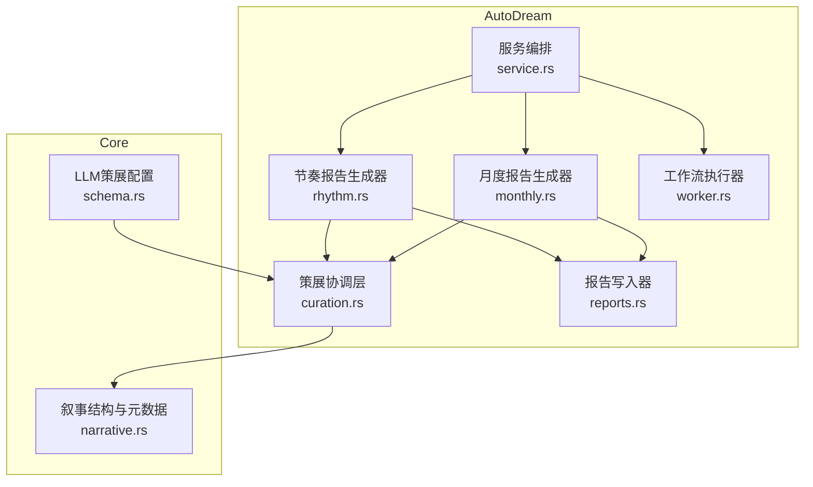
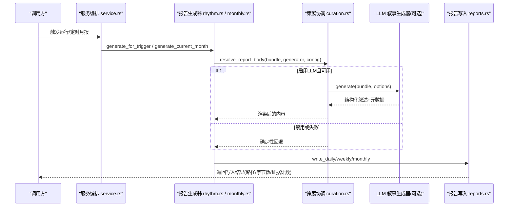
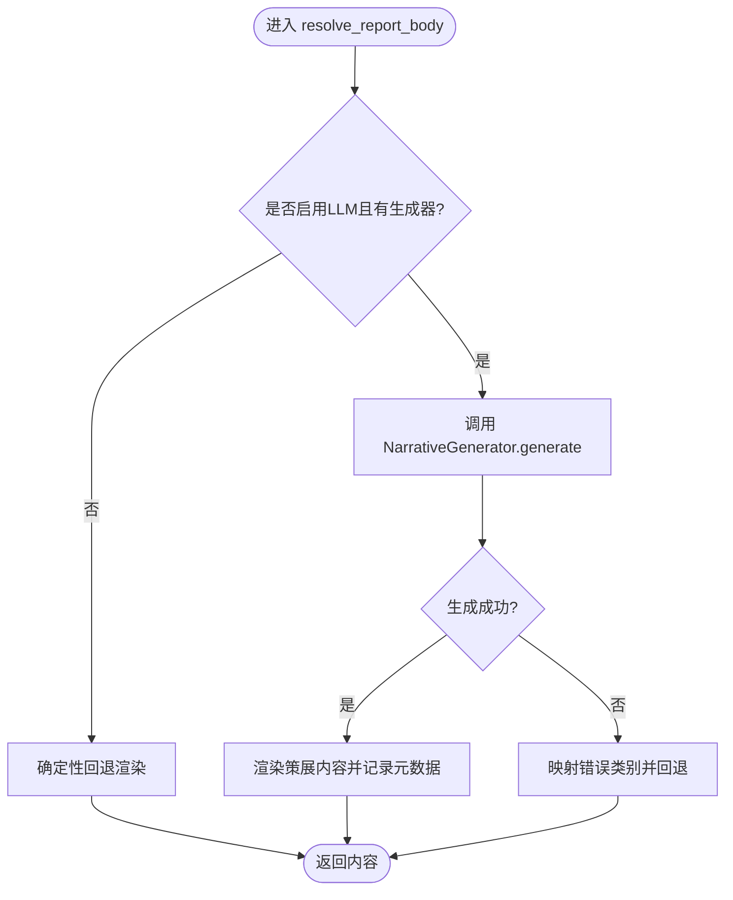
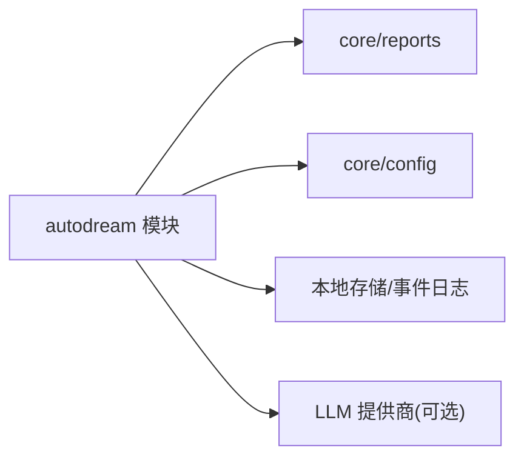

# 内容策展系统

<cite>
**本文引用的文件**
- [curation.rs](file://agent-diva-autodream/src/curation.rs)
- [service.rs](file://agent-diva-autodream/src/service.rs)
- [worker.rs](file://agent-diva-autodream/src/worker.rs)
- [reports.rs](file://agent-diva-autodream/src/reports.rs)
- [rhythm.rs](file://agent-diva-autodream/src/rhythm.rs)
- [monthly.rs](file://agent-diva-autodream/src/monthly.rs)
- [schema.rs](file://agent-diva-core/src/config/schema.rs)
- [narrative.rs](file://agent-diva-core/src/reports/narrative.rs)
- [lib.rs](file://agent-diva-autodream/src/lib.rs)
</cite>

## 目录
1. [简介](#简介)
2. [项目结构](#项目结构)
3. [核心组件](#核心组件)
4. [架构总览](#架构总览)
5. [详细组件分析](#详细组件分析)
6. [依赖关系分析](#依赖关系分析)
7. [性能与优化](#性能与优化)
8. [故障排查指南](#故障排查指南)
9. [结论](#结论)
10. [附录：配置与使用示例](#附录配置与使用示例)

## 简介
本文件面向 AutoDream 的内容策展系统，系统性说明“提案内容的筛选、评估与优先级排序”的机制，并解释策展策略的配置项（质量阈值、相关性评分、多样性控制）如何落地到代码中。同时给出策展规则与自定义评估函数的定义方式、端到端工作流程示例（输入验证、内容过滤、输出格式化），以及与 LLM 提供商的集成方式。文档兼顾初学者理解与高级用户的复杂场景实现指导。

## 项目结构
AutoDream 的策展能力由“报告生成器 + 叙事生成器 + 配置 + 持久化”组成，核心位于 agent-diva-autodream 模块，并与 agent-diva-core 的报告契约和配置模型协作。

图表来源
- [rhythm.rs:16-150](file://agent-diva-autodream/src/rhythm.rs#L16-L150)
- [monthly.rs:28-170](file://agent-diva-autodream/src/monthly.rs#L28-L170)
- [service.rs:124-180](file://agent-diva-autodream/src/service.rs#L124-L180)
- [worker.rs:152-210](file://agent-diva-autodream/src/worker.rs#L152-L210)
- [curation.rs:14-84](file://agent-diva-autodream/src/curation.rs#L14-L84)
- [reports.rs:76-137](file://agent-diva-autodream/src/reports.rs#L76-L137)
- [schema.rs:380-458](file://agent-diva-core/src/config/schema.rs#L380-L458)
- [narrative.rs:1-119](file://agent-diva-core/src/reports/narrative.rs#L1-L119)

章节来源
- [lib.rs:1-43](file://agent-diva-autodream/src/lib.rs#L1-L43)

## 核心组件
- 节奏报告生成器：按日/周聚合会话或已有日报，构建事实包，调用策展协调层生成叙述体，再写回 Markdown。
- 月度报告生成器：按月聚合日报与缺失日的会话兜底，产出月度 Markdown。
- 服务编排：管理运行生命周期、锁、重试、事件记录、定时月报触发。
- 工作流执行器：ACTMEM 工作整理与技能反思，产生技能评审请求（提案）。
- 策展协调层：根据配置决定是否启用 LLM 策展；失败时回退到确定性渲染。
- 报告写入器：校验请求、渲染 Markdown frontmatter 与正文、限制证据引用数量。
- 配置与叙事：统一的 LLM 策展配置与结构化叙事元数据。

章节来源
- [rhythm.rs:16-150](file://agent-diva-autodream/src/rhythm.rs#L16-L150)
- [monthly.rs:28-170](file://agent-diva-autodream/src/monthly.rs#L28-L170)
- [service.rs:124-180](file://agent-diva-autodream/src/service.rs#L124-L180)
- [worker.rs:152-210](file://agent-diva-autodream/src/worker.rs#L152-L210)
- [curation.rs:14-84](file://agent-diva-autodream/src/curation.rs#L14-L84)
- [reports.rs:76-137](file://agent-diva-autodream/src/reports.rs#L76-L137)
- [schema.rs:380-458](file://agent-diva-core/src/config/schema.rs#L380-L458)
- [narrative.rs:1-119](file://agent-diva-core/src/reports/narrative.rs#L1-L119)

## 架构总览
AutoDream 的策展流程以“事实包 + 叙事生成器”为核心：先聚合会话/日报形成事实包，再由 LLM 或确定性逻辑生成结构化叙述，最终落盘为带 frontmatter 的 Markdown。

图表来源
- [service.rs:415-489](file://agent-diva-autodream/src/service.rs#L415-L489)
- [rhythm.rs:43-150](file://agent-diva-autodream/src/rhythm.rs#L43-L150)
- [monthly.rs:48-170](file://agent-diva-autodream/src/monthly.rs#L48-L170)
- [curation.rs:14-84](file://agent-diva-autodream/src/curation.rs#L14-L84)
- [reports.rs:86-137](file://agent-diva-autodream/src/reports.rs#L86-L137)

## 详细组件分析

### 策展协调层（curation.rs）
- 职责：根据配置决定是否走 LLM 策展；若失败则降级为确定性渲染；将渲染结果转换为 AutoDream 可写的报告内容。
- 关键点：
  - 通过配置开关与可选的 ReportNarrativeGenerator 决定路径。
  - 成功时记录 generation_mode 等元数据；失败时记录 fallback_reason。
  - 将 RenderedReportBody 与 bundle 统计映射为 RhythmReportContent。

图表来源
- [curation.rs:14-84](file://agent-diva-autodream/src/curation.rs#L14-L84)

章节来源
- [curation.rs:14-84](file://agent-diva-autodream/src/curation.rs#L14-L84)

### 节奏报告生成器（rhythm.rs）
- 职责：按日/周收集会话或已有日报，构建事实包，调用策展协调层，写入 Markdown。
- 关键点：
  - 日报告：基于当天会话摘要构建事实包。
  - 周报告：优先读取已生成的日报，缺失日回退到会话摘要。
  - 语言与限制来自 LlmCurationConfig。

章节来源
- [rhythm.rs:43-150](file://agent-diva-autodream/src/rhythm.rs#L43-L150)

### 月度报告生成器（monthly.rs）
- 职责：按月聚合日报与缺失日会话，产出月度 Markdown，支持错误标记与重试。
- 关键点：
  - 若当月无日报也无会话兜底，直接报错。
  - 失败时写入错误标记文件，包含尝试次数与消息。
  - 成功后清理错误标记。

章节来源
- [monthly.rs:48-170](file://agent-diva-autodream/src/monthly.rs#L48-L170)

### 服务编排（service.rs）
- 职责：创建/查询/取消运行；处理锁与过期恢复；触发日/周/月报；维护事件日志与指标。
- 关键点：
  - 手动触发与定时月报统一入口，内部区分触发类型。
  - 对月报触发进行最多三次重试。
  - 失败时记录 failure_code 与事件，清理锁。

章节来源
- [service.rs:202-489](file://agent-diva-autodream/src/service.rs#L202-L489)

### 工作流执行器（worker.rs）
- 职责：组织 ACTMEM Work，反射技能需求，生成技能评审请求（提案）。
- 关键点：
  - 四阶段：Orient → Gather → Consolidate → Propose。
  - 严格权限限制（RestrictedProfile），仅允许必要动作。
  - 失败诊断与失败码映射，便于排障。

章节来源
- [worker.rs:214-375](file://agent-diva-autodream/src/worker.rs#L214-L375)

### 报告写入器（reports.rs）
- 职责：校验请求、渲染 Markdown frontmatter 与正文、限制证据引用数量。
- 关键点：
  - 日期/周键格式校验，防路径穿越。
  - 至少一条证据引用，标题非空。
  - 证据片段长度限制，避免过大输出。

章节来源
- [reports.rs:86-198](file://agent-diva-autodream/src/reports.rs#L86-L198)

### 配置与叙事（schema.rs, narrative.rs）
- LlmCurationConfig：控制是否启用、提供商/模型覆盖、语言、最大输入/输出 token、超时、回退策略。
- 叙事结构：结构化主题、成就、决策、风险、下一步、覆盖说明，以及生成元数据（模式、覆盖率、token、耗时、失败原因）。

章节来源
- [schema.rs:380-458](file://agent-diva-core/src/config/schema.rs#L380-L458)
- [narrative.rs:1-119](file://agent-diva-core/src/reports/narrative.rs#L1-L119)

## 依赖关系分析
- AutoDream 模块依赖 core 的报告契约与配置模型。
- 策展协调层依赖 ReportNarrativeGenerator（可由上层注入），未注入或失败时回退。
- 报告写入器依赖存储路径与原子写入工具。
- 服务编排依赖 worker、月度/节奏生成器、存储与事件日志。

图表来源
- [lib.rs:1-43](file://agent-diva-autodream/src/lib.rs#L1-L43)
- [curation.rs:14-84](file://agent-diva-autodream/src/curation.rs#L14-L84)
- [service.rs:124-180](file://agent-diva-autodream/src/service.rs#L124-L180)

章节来源
- [lib.rs:1-43](file://agent-diva-autodream/src/lib.rs#L1-L43)

## 性能与优化
- 输入裁剪与限制：
  - 周/月报告在缺失日回退时使用会话摘要，减少不必要的大文本。
  - 证据引用上限与摘录长度限制，降低输出体积。
- 重试与容错：
  - 月报触发最多三次重试，失败写错误标记，便于后续重试与观测。
  - 锁过期自动恢复，避免卡死。
- 资源控制：
  - 通过 max_input_tokens、max_output_tokens、timeout_secs 控制 LLM 调用成本与时延。
- 建议：
  - 合理设置语言与 token 上限，平衡质量与成本。
  - 对高频触发（如每日）开启缓存或增量更新策略（当前实现为全量聚合，可按需扩展）。

[本节为通用性能建议，不直接分析具体文件]

## 故障排查指南
- 常见错误与定位：
  - 无会话/日报：日/周/月报会返回无效状态错误，检查会话目录与日报是否存在。
  - 锁冲突：并发触发会被拒绝，查看 lock 文件与 run 状态。
  - 过期锁恢复：旧进程退出后，服务会自动恢复并重新排队。
  - 月报失败：检查错误标记文件中的 message 与 attempts。
- 诊断信息：
  - 运行事件日志（JSONL）记录每个阶段的开始/结束、失败原因与失败码。
  - Worker 阶段状态与诊断字段，帮助定位哪一步失败。
- 操作建议：
  - 使用 list_run_events 获取最近事件，结合 failure_code 快速定位。
  - 调整 LlmCurationConfig 的 timeout 与 token 上限，观察是否缓解超时或超限问题。

章节来源
- [service.rs:257-328](file://agent-diva-autodream/src/service.rs#L257-L328)
- [service.rs:491-610](file://agent-diva-autodream/src/service.rs#L491-L610)
- [worker.rs:567-689](file://agent-diva-autodream/src/worker.rs#L567-L689)

## 结论
AutoDream 的内容策展系统以“事实包 + 叙事生成器”为核心，提供稳定可靠的日/周/月报生成能力。通过 LlmCurationConfig 可灵活控制质量与成本；当 LLM 不可用时自动回退到确定性渲染，确保可用性。配合完善的锁、重试、事件与诊断机制，适合生产环境运行。对于高级用户，可通过注入自定义 ReportNarrativeGenerator 实现更复杂的评估与优先级排序策略。

[本节为总结性内容，不直接分析具体文件]

## 附录：配置与使用示例

### 策展策略配置项（LlmCurationConfig）
- enabled：是否启用 LLM 策展；关闭则始终使用确定性回退。
- provider/model：可选覆盖默认提供商与模型。
- language：报告语言（默认 zh-CN）。
- max_input_tokens：最大输入 token 数。
- max_output_tokens：最大输出 token 数。
- timeout_secs：调用超时秒数。
- fallback：当前仅支持 deterministic。

章节来源
- [schema.rs:380-458](file://agent-diva-core/src/config/schema.rs#L380-L458)

### 提案筛选、评估与优先级排序
- 筛选：
  - 日/周/月报告在聚合阶段依据日期窗口与缺失日回退策略筛选有效输入。
  - 证据引用限制与摘录截断，保证输出可控。
- 评估：
  - 通过 ReportNarrativeGenerator 的 generate 接口进行智能评估与结构化输出。
  - 生成元数据记录 coverage_status、failure_reason 等，便于评估质量。
- 优先级排序：
  - 当前实现以时间窗口与覆盖率驱动；如需业务优先级，可在自定义生成器中按主题/风险/行动项打分排序。

章节来源
- [rhythm.rs:43-150](file://agent-diva-autodream/src/rhythm.rs#L43-L150)
- [monthly.rs:48-170](file://agent-diva-autodream/src/monthly.rs#L48-L170)
- [narrative.rs:1-119](file://agent-diva-core/src/reports/narrative.rs#L1-L119)

### 定义策展规则与自定义评估函数
- 规则位置：
  - 报告聚合与证据限制在 rhythm.rs 与 monthly.rs 中。
  - 叙事结构与元数据在 narrative.rs 中。
- 自定义评估：
  - 实现 ReportNarrativeGenerator 接口并在服务中注入，即可替换默认 LLM 策展逻辑。
  - 可在 generate 中实现相关性评分、多样性控制、质量阈值判断与优先级排序。

章节来源
- [rhythm.rs:43-150](file://agent-diva-autodream/src/rhythm.rs#L43-L150)
- [monthly.rs:48-170](file://agent-diva-autodream/src/monthly.rs#L48-L170)
- [narrative.rs:1-119](file://agent-diva-core/src/reports/narrative.rs#L1-L119)

### 实际工作流程示例
- 输入验证：
  - 日报日期必须为 YYYY-MM-DD，周报为 YYYY-Www，禁止路径穿越。
  - 至少一条证据引用，标题非空。
- 内容过滤：
  - 周/月报缺失日回退到会话摘要；证据片段长度限制。
- 输出格式化：
  - 写入 Markdown frontmatter 与正文，包含 session_count、token_used、generation_mode、coverage_status 等。

章节来源
- [reports.rs:139-198](file://agent-diva-autodream/src/reports.rs#L139-L198)
- [reports.rs:200-291](file://agent-diva-autodream/src/reports.rs#L200-L291)

### 与 LLM 提供商的集成
- 通过注入 ReportNarrativeGenerator 与 LlmCurationConfig 完成集成。
- 支持 provider/model 覆盖、语言、token 上限与超时控制。
- 失败时自动回退到确定性渲染，并记录 failure_reason。

章节来源
- [curation.rs:14-84](file://agent-diva-autodream/src/curation.rs#L14-L84)
- [schema.rs:380-458](file://agent-diva-core/src/config/schema.rs#L380-L458)

### 调试方法
- 查看运行事件：list_run_events 获取最近事件，关注 phase、diagnostic、failure_code。
- 检查锁与状态：get_run_status 查看当前锁与运行状态。
- 月报错误标记：read_error_marker 获取失败原因与尝试次数。
- Worker 阶段诊断：各阶段 status/diagnostic 字段定位失败点。

章节来源
- [service.rs:257-328](file://agent-diva-autodream/src/service.rs#L257-L328)
- [monthly.rs:87-97](file://agent-diva-autodream/src/monthly.rs#L87-L97)
- [worker.rs:567-689](file://agent-diva-autodream/src/worker.rs#L567-L689)