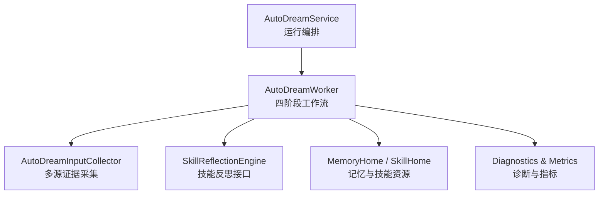
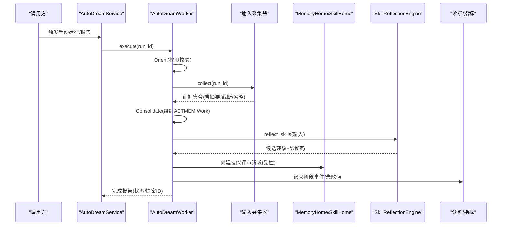
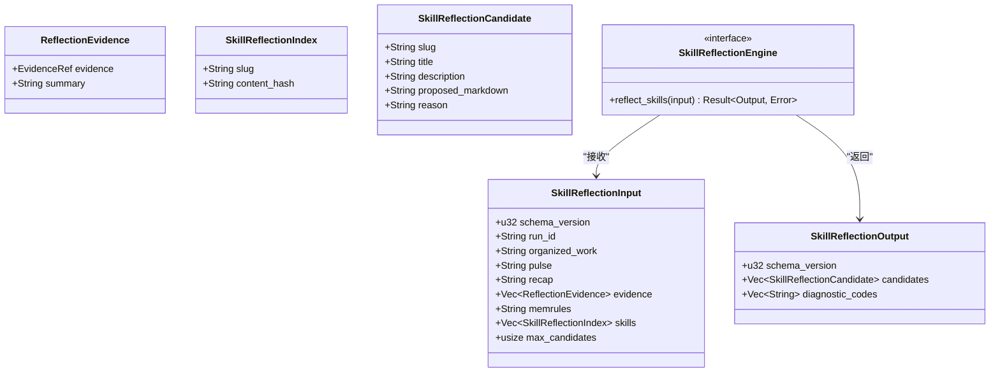
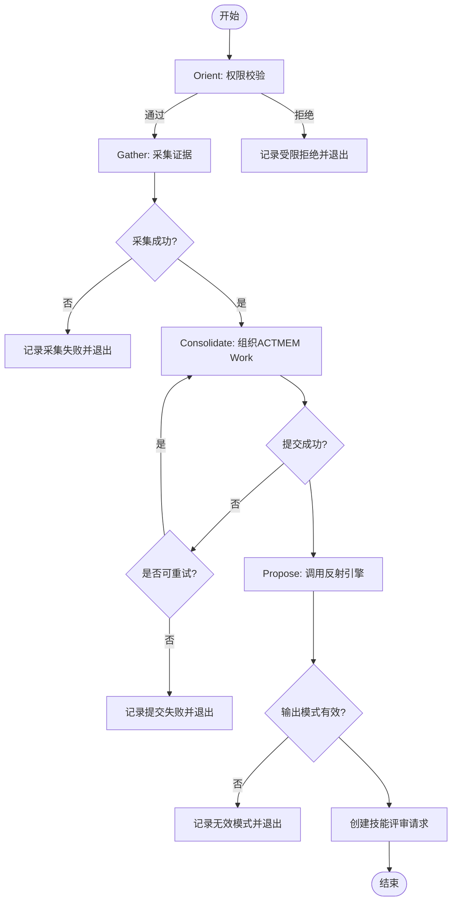
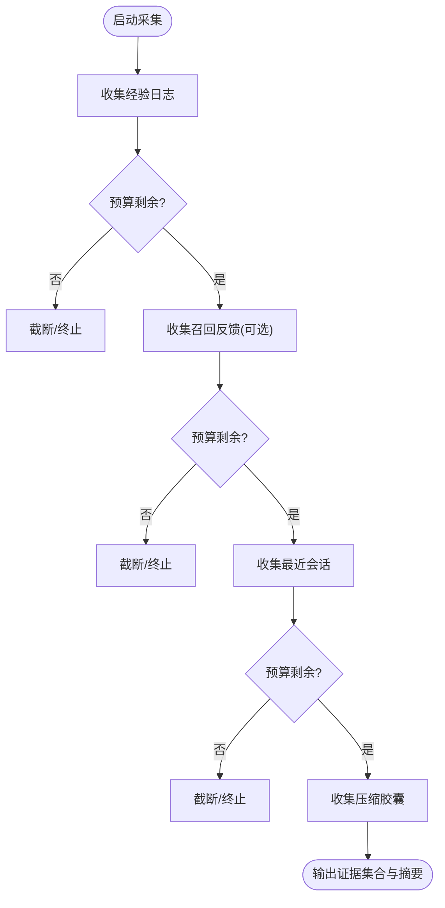
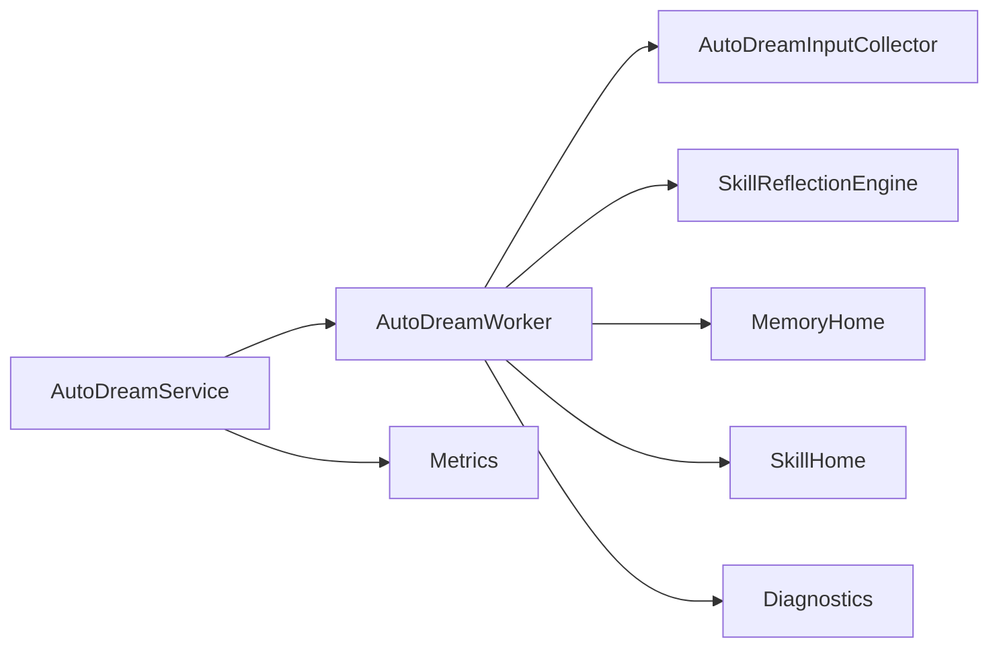

# 反思分析引擎

<cite>
**本文引用的文件**
- [reflection.rs](file://agent-diva-autodream/src/reflection.rs)
- [worker.rs](file://agent-diva-autodream/src/worker.rs)
- [service.rs](file://agent-diva-autodream/src/service.rs)
- [inputs.rs](file://agent-diva-autodream/src/inputs.rs)
- [diagnostics.rs](file://agent-diva-autodream/src/diagnostics.rs)
- [metrics.rs](file://agent-diva-autodream/src/metrics.rs)
- [service.rs（测试）](file://agent-diva-autodream/tests/service.rs)
</cite>

## 目录
1. [简介](#简介)
2. [项目结构](#项目结构)
3. [核心组件](#核心组件)
4. [架构总览](#架构总览)
5. [详细组件分析](#详细组件分析)
6. [依赖关系分析](#依赖关系分析)
7. [性能与可扩展性](#性能与可扩展性)
8. [故障排查指南](#故障排查指南)
9. [结论](#结论)
10. [附录：配置、阈值与自定义规则](#附录配置阈值与自定义规则)

## 简介
本章节面向初学者与高级用户，系统性说明 AutoDream 的“技能反思机制”如何工作：它如何从用户交互历史中收集证据、组织上下文、识别模式与改进机会，并将结果转化为可执行的结构化建议。文档涵盖：
- 反思算法的核心流程：定向、采集、整合、提议
- 行为模式识别、性能指标分析与用户体验评估的集成点
- 反思结果的结构化表示与评分/筛选机制
- 配置项、阈值设置与扩展方法
- 触发与使用示例（以代码路径引用代替具体代码内容）
- 与记忆系统的集成方式，以及如何将反思结果转化为改进建议

## 项目结构
AutoDream 的反思能力由服务层编排、工作器驱动阶段式执行、输入采集器聚合多源证据、反射引擎接口抽象外部实现、诊断与指标提供可观测性。关键文件职责如下：
- reflection.rs：定义技能反思的输入/输出契约、错误类型与引擎接口
- worker.rs：四阶段工作流（Orient/Gather/Consolidate/Propose），负责调用反射引擎并产出提案
- service.rs：运行生命周期管理、锁与检查点、报告触发、注入反射引擎与记忆/技能家
- inputs.rs：多源证据采集（经验日志、会话、召回反馈、压缩胶囊）与预算控制
- diagnostics.rs：结构化诊断事件与失败码映射
- metrics.rs：运行与失败计数等指标

图表来源
- [service.rs:124-200](file://agent-diva-autodream/src/service.rs#L124-L200)
- [worker.rs:152-199](file://agent-diva-autodream/src/worker.rs#L152-L199)
- [inputs.rs:75-151](file://agent-diva-autodream/src/inputs.rs#L75-L151)
- [reflection.rs:64-70](file://agent-diva-autodream/src/reflection.rs#L64-L70)

章节来源
- [service.rs:124-200](file://agent-diva-autodream/src/service.rs#L124-L200)
- [worker.rs:152-199](file://agent-diva-autodream/src/worker.rs#L152-L199)
- [inputs.rs:75-151](file://agent-diva-autodream/src/inputs.rs#L75-L151)
- [reflection.rs:6-70](file://agent-diva-autodream/src/reflection.rs#L6-L70)

## 核心组件
- 技能反思契约与错误
  - 输入：包含已组织的 ACTMEM Work、Pulse/Recap、证据列表、记忆规则、技能索引、候选上限
  - 输出：候选技能更新建议列表与诊断码
  - 错误：提供者不可用/超时/无效模式/失败
- 工作器与阶段
  - Orient：权限校验与准备
  - Gather：采集多源证据
  - Consolidate：整理 ACTMEM Work
  - Propose：调用反射引擎生成候选，并创建技能评审请求
- 输入采集器
  - 来源优先级：经验日志 > 召回反馈 > 最近会话 > 压缩胶囊
  - 预算控制：按字节预算裁剪与截断，记录省略与截断信息
- 服务层
  - 手动触发、取消、恢复陈旧锁、月度/节奏报告
  - 注入反射引擎、记忆/技能家、LLM 叙事生成器
- 诊断与指标
  - 结构化事件写入 JSONL，失败码映射，运行/失败计数快照

章节来源
- [reflection.rs:6-70](file://agent-diva-autodream/src/reflection.rs#L6-L70)
- [worker.rs:25-150](file://agent-diva-autodream/src/worker.rs#L25-L150)
- [inputs.rs:34-151](file://agent-diva-autodream/src/inputs.rs#L34-L151)
- [service.rs:124-200](file://agent-diva-autodream/src/service.rs#L124-L200)
- [diagnostics.rs:11-113](file://agent-diva-autodream/src/diagnostics.rs#L11-L113)
- [metrics.rs:1-45](file://agent-diva-autodream/src/metrics.rs#L1-L45)

## 架构总览
AutoDream 的反思引擎采用“编排 + 阶段化执行 + 外部反射实现”的解耦设计。服务层负责任务生命周期与持久化；工作器按阶段推进，严格限制对权威资源的写权限；反射引擎通过接口注入，屏蔽具体实现细节；输入采集器在预算内聚合证据；诊断与指标贯穿全程。

图表来源
- [service.rs:202-255](file://agent-diva-autodream/src/service.rs#L202-L255)
- [worker.rs:199-375](file://agent-diva-autodream/src/worker.rs#L199-L375)
- [worker.rs:377-508](file://agent-diva-autodream/src/worker.rs#L377-L508)
- [diagnostics.rs:65-79](file://agent-diva-autodream/src/diagnostics.rs#L65-L79)

## 详细组件分析

### 技能反思契约（reflection.rs）
- 输入结构
  - schema_version/run_id：版本与运行标识
  - organized_work/pulse/recap：来自 ACTMEM 的上下文切片
  - evidence：证据列表（每条含引用与摘要）
  - memrules：记忆规则文本
  - skills：当前可用技能的受限索引（slug + content_hash）
  - max_candidates：候选上限
- 输出结构
  - candidates：每个候选包含 slug/title/description/proposed_markdown/reason
  - diagnostic_codes：诊断码，便于上层归因
- 错误枚举
  - ProviderUnavailable/ProviderTimeout/InvalidSchema/ProviderFailed

图表来源
- [reflection.rs:6-70](file://agent-diva-autodream/src/reflection.rs#L6-L70)

章节来源
- [reflection.rs:6-70](file://agent-diva-autodream/src/reflection.rs#L6-L70)

### 工作器与四阶段流程（worker.rs）
- 阶段
  - Orient：校验受限操作权限（读取会话、读取 Laputa API、写 AutoDream 输出、创建 Laputa 提案等）
  - Gather：调用输入采集器收集证据，记录摘要与省略
  - Consolidate：渲染并组织 ACTMEM Work，处理冲突重试
  - Propose：组装反射输入，调用反射引擎，校验输出模式，为每个候选创建技能评审请求
- 失败与恢复
  - 阶段级状态记录、诊断码、失败码映射
  - 针对 ACTMEM 冲突的重试策略（仅允许 Pulse/Recap 变更）
- 输出
  - 工作器报告包含阶段状态、诊断、提案 ID 列表

图表来源
- [worker.rs:199-375](file://agent-diva-autodream/src/worker.rs#L199-L375)
- [worker.rs:510-565](file://agent-diva-autodream/src/worker.rs#L510-L565)
- [worker.rs:745-795](file://agent-diva-autodream/src/worker.rs#L745-L795)

章节来源
- [worker.rs:199-375](file://agent-diva-autodream/src/worker.rs#L199-L375)
- [worker.rs:510-565](file://agent-diva-autodream/src/worker.rs#L510-L565)
- [worker.rs:745-795](file://agent-diva-autodream/src/worker.rs#L745-L795)

### 输入采集器（inputs.rs）
- 数据源与优先级
  - 经验日志（工具执行证据优先）
  - 召回反馈（可选）
  - 最近会话（默认最多若干条）
  - 压缩胶囊（上下文压缩产物）
- 预算与裁剪
  - 全局字节预算，逐项分配，不足时截断并标记
  - 记录省略原因（缺失、损坏、不可读等）
- 证据模型
  - 统一 EvidenceRef，包含来源、URI、摘要、哈希、时间戳
- 安全边界
  - 不写入权威路径（MEMORY.md、BML 等）

图表来源
- [inputs.rs:94-151](file://agent-diva-autodream/src/inputs.rs#L94-L151)
- [inputs.rs:417-462](file://agent-diva-autodream/src/inputs.rs#L417-L462)

章节来源
- [inputs.rs:94-151](file://agent-diva-autodream/src/inputs.rs#L94-L151)
- [inputs.rs:417-462](file://agent-diva-autodream/src/inputs.rs#L417-L462)

### 服务层与运行编排（service.rs）
- 运行生命周期
  - 手动触发：创建运行记录、加锁、写入初始编排状态
  - 查询/取消：状态查询、取消运行、清理锁
  - 恢复陈旧锁：检测锁过期或进程不一致，回滚到可恢复状态
- 报告触发
  - 节奏报告与月度报告，支持重试与失败记录
- 反射引擎注入
  - with_skill_reflection_engine 注入外部实现
  - with_memory_home/with_skill_home 注入权威资源访问
- 指标与事件
  - 记录运行与失败次数，追加事件到 JSONL

章节来源
- [service.rs:202-255](file://agent-diva-autodream/src/service.rs#L202-L255)
- [service.rs:415-489](file://agent-diva-autodream/src/service.rs#L415-L489)
- [service.rs:491-610](file://agent-diva-autodream/src/service.rs#L491-L610)
- [service.rs:656-706](file://agent-diva-autodream/src/service.rs#L656-L706)

### 诊断与指标（diagnostics.rs, metrics.rs）
- 诊断事件
  - 统一字段：run_id、phase、kind、message、input_summary、gate_code、proposal_id、failure_code
  - 写入 JSONL 并输出 tracing 日志
- 失败码映射
  - 将内部失败映射为标准失败码，便于监控与告警
- 指标
  - 运行总数、失败总数，支持快照与测试重置

章节来源
- [diagnostics.rs:11-113](file://agent-diva-autodream/src/diagnostics.rs#L11-L113)
- [metrics.rs:1-45](file://agent-diva-autodream/src/metrics.rs#L1-L45)

## 依赖关系分析
- 耦合与内聚
  - Service 高内聚于运行编排与持久化，低耦合于 Worker 与反射引擎
  - Worker 强依赖 MemoryHome/SkillHome 进行只读与受限写操作
  - 输入采集器独立于权威路径，避免越权写入
- 外部依赖
  - 反射引擎通过 trait 注入，支持替换实现
  - 记忆系统通过 MemoryHome 暴露 Actmem 与 MemRules
  - 技能系统通过 SkillHome 列出与创建评审请求
- 潜在循环
  - 无直接循环依赖；各模块通过接口与数据结构通信

图表来源
- [service.rs:124-200](file://agent-diva-autodream/src/service.rs#L124-L200)
- [worker.rs:152-199](file://agent-diva-autodream/src/worker.rs#L152-L199)
- [inputs.rs:75-151](file://agent-diva-autodream/src/inputs.rs#L75-L151)
- [reflection.rs:64-70](file://agent-diva-autodream/src/reflection.rs#L64-L70)

章节来源
- [service.rs:124-200](file://agent-diva-autodream/src/service.rs#L124-L200)
- [worker.rs:152-199](file://agent-diva-autodream/src/worker.rs#L152-L199)
- [inputs.rs:75-151](file://agent-diva-autodream/src/inputs.rs#L75-L151)
- [reflection.rs:64-70](file://agent-diva-autodream/src/reflection.rs#L64-L70)

## 性能与可扩展性
- 性能特征
  - 输入采集按预算裁剪，避免过大负载
  - 反射输入中的证据与上下文片段进行了长度限制（如 organized_work/pulse/recap/evidence.excerpt）
  - 工作器阶段化推进，失败快速定位
- 可扩展点
  - 反射引擎实现可替换（例如接入不同 LLM 或本地模型）
  - 输入采集器可通过配置调整来源优先级与预算
  - 诊断与指标可对接外部监控系统
- 优化建议
  - 根据实际负载调优 total_bytes_budget、experience/session/capsule 限制
  - 合理设置 max_candidates 与 truncate 阈值，减少不必要的大文本传输
  - 利用诊断码与失败码进行自动化告警与自愈

[本节为通用指导，无需特定文件引用]

## 故障排查指南
- 常见问题定位
  - 提供者不可用/超时/失败：检查反射引擎注入与网络/模型可用性
  - 无效模式：核对反射输出 schema_version 与候选数量约束
  - 输入不可用：确认经验日志、会话、胶囊存在且可读
  - 权限受限：检查受限操作白名单是否包含所需动作
- 诊断与指标
  - 查看 JSONL 事件中的 phase、kind、failure_code、proposal_id
  - 使用 metrics 快照统计运行与失败趋势
- 恢复与重试
  - 陈旧锁自动恢复，将中断任务重新入队
  - 月度/节奏报告支持有限次重试

章节来源
- [diagnostics.rs:99-113](file://agent-diva-autodream/src/diagnostics.rs#L99-L113)
- [worker.rs:745-795](file://agent-diva-autodream/src/worker.rs#L745-L795)
- [service.rs:656-706](file://agent-diva-autodream/src/service.rs#L656-L706)

## 结论
AutoDream 的技能反思引擎通过严格的阶段化工作流、安全的资源访问边界、可插拔的反射引擎与完善的诊断指标体系，实现了从用户交互历史到可执行改进建议的闭环。其设计兼顾了可靠性（锁与恢复）、可观测性（诊断与指标）与可扩展性（接口抽象与配置）。对于初学者，可按阶段理解数据流与权限边界；对于高级用户，可基于反射引擎接口与输入采集配置进行深度定制与优化。

[本节为总结，无需特定文件引用]

## 附录：配置、阈值与自定义规则
- 输入采集配置
  - experience_limit/experience_bytes：经验日志条目数与字节上限
  - recent_session_limit/recent_session_bytes：最近会话条目数与字节上限
  - capsule_limit/capsule_bytes：压缩胶囊条目数与字节上限
  - total_bytes_budget：全局字节预算，用于控制整体输入大小
- 反射输入与输出约束
  - organized_work/pulse/recap/evidence.excerpt：长度限制以避免过大负载
  - max_candidates：候选上限（工作器侧硬约束）
  - schema_version：版本校验，确保向后兼容
- 失败码与诊断码
  - 通过 failure_code_name 映射标准失败码，便于监控
  - 诊断码用于细化问题分类（如 provider_unavailable、invalid_candidate 等）
- 自定义规则
  - 实现 SkillReflectionEngine 接口，封装自有反射算法
  - 在 Worker 中注入自定义引擎，保持阶段流程不变
  - 结合诊断与指标，持续评估与调优

章节来源
- [inputs.rs:34-57](file://agent-diva-autodream/src/inputs.rs#L34-L57)
- [worker.rs:422-448](file://agent-diva-autodream/src/worker.rs#L422-L448)
- [diagnostics.rs:99-113](file://agent-diva-autodream/src/diagnostics.rs#L99-L113)
- [reflection.rs:31-70](file://agent-diva-autodream/src/reflection.rs#L31-L70)

## 实际使用示例（以路径引用代替代码）
- 触发手动运行
  - 参考：[service.rs:202-255](file://agent-diva-autodream/src/service.rs#L202-L255)
- 执行反思工作器
  - 参考：[service.rs:405-413](file://agent-diva-autodream/src/service.rs#L405-L413)
- 注入反射引擎与记忆/技能家
  - 参考：[service.rs:183-200](file://agent-diva-autodream/src/service.rs#L183-L200)
- 工作器四阶段执行与反射调用
  - 参考：[worker.rs:199-375](file://agent-diva-autodream/src/worker.rs#L199-L375)
  - 参考：[worker.rs:377-508](file://agent-diva-autodream/src/worker.rs#L377-L508)
- 输入采集与预算控制
  - 参考：[inputs.rs:94-151](file://agent-diva-autodream/src/inputs.rs#L94-L151)
  - 参考：[inputs.rs:417-462](file://agent-diva-autodream/src/inputs.rs#L417-L462)
- 诊断与指标
  - 参考：[diagnostics.rs:65-113](file://agent-diva-autodream/src/diagnostics.rs#L65-L113)
  - 参考：[metrics.rs:15-45](file://agent-diva-autodream/src/metrics.rs#L15-L45)
- 测试用例（服务层）
  - 参考：[tests/service.rs:12-41](file://agent-diva-autodream/tests/service.rs#L12-L41)
  - 参考：[tests/service.rs:74-115](file://agent-diva-autodream/tests/service.rs#L74-L115)
  - 参考：[tests/service.rs:164-191](file://agent-diva-autodream/tests/service.rs#L164-L191)