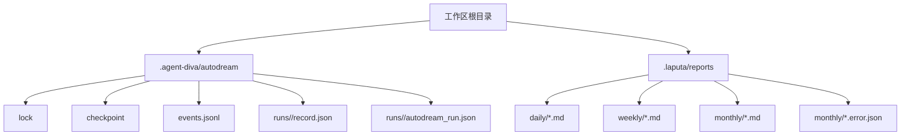
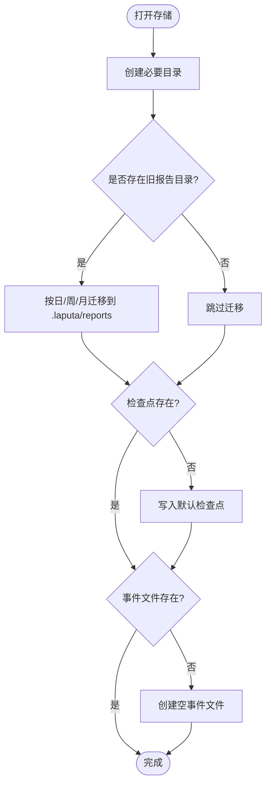
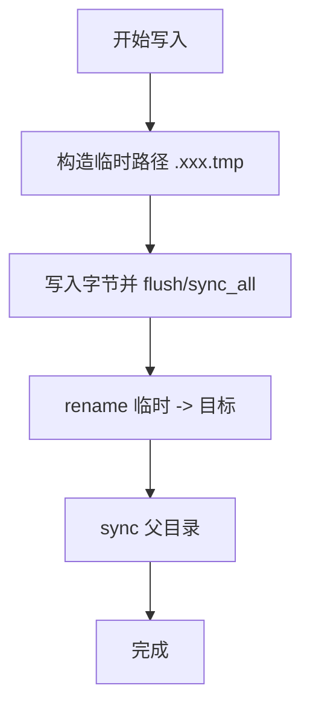
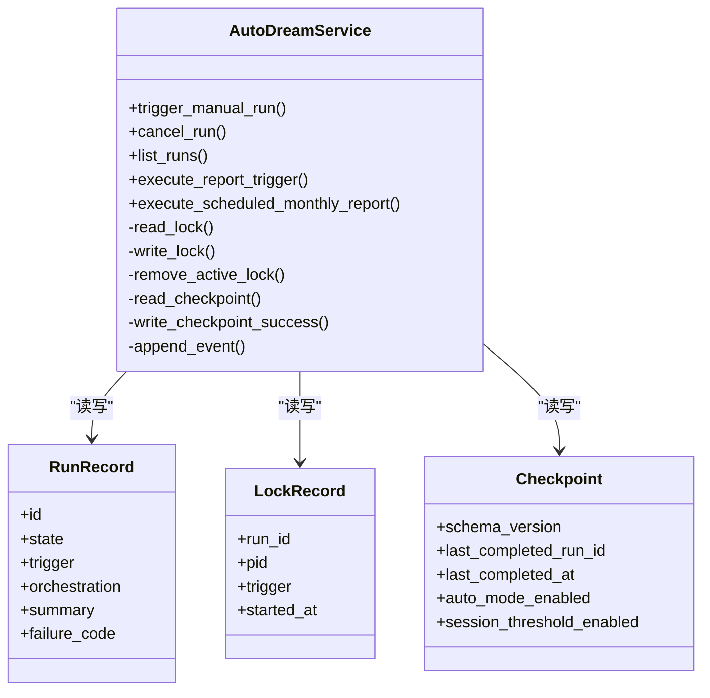
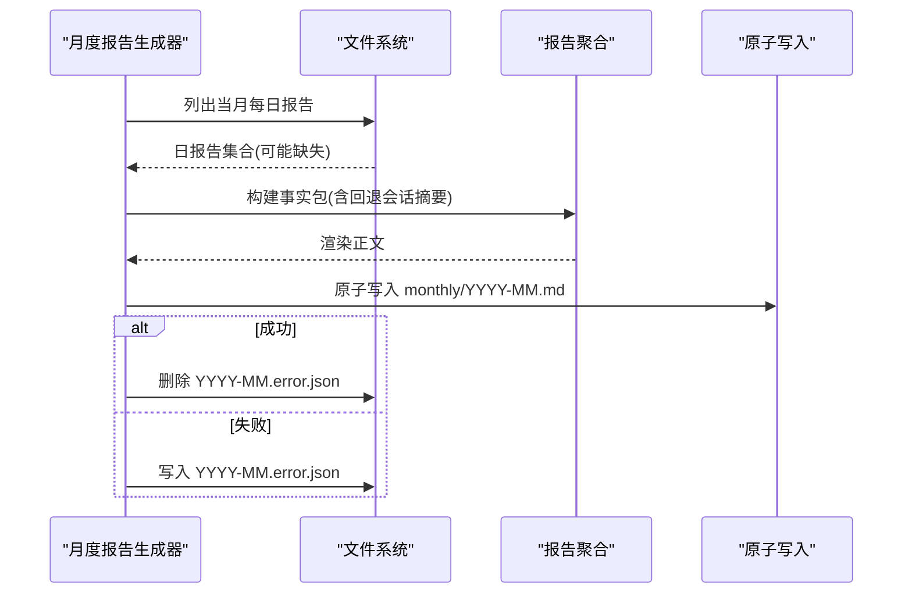
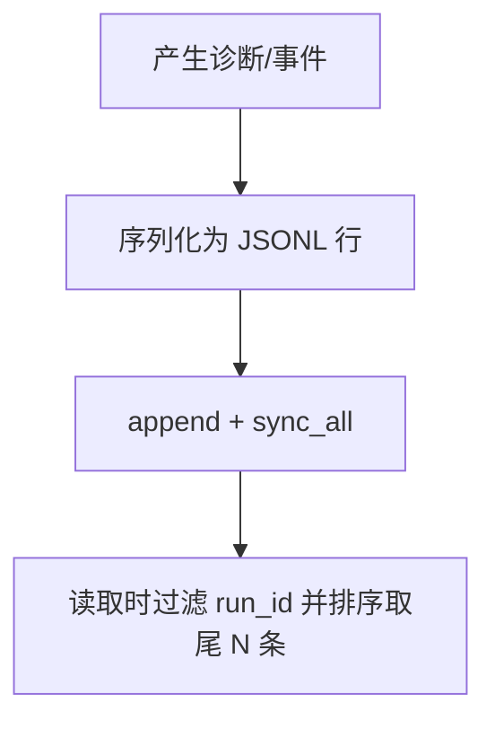
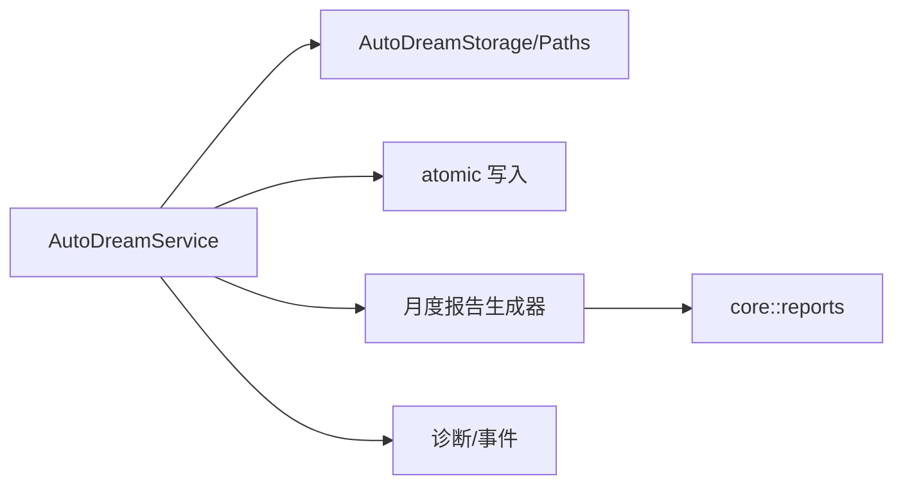

# 存储管理

<cite>
**本文引用的文件**
- [lib.rs](file://agent-diva-autodream/src/lib.rs)
- [layout.rs](file://agent-diva-autodream/src/layout.rs)
- [atomic.rs](file://agent-diva-autodream/src/atomic.rs)
- [monthly.rs](file://agent-diva-autodream/src/monthly.rs)
- [service.rs](file://agent-diva-autodream/src/service.rs)
- [diagnostics.rs](file://agent-diva-autodream/src/diagnostics.rs)
- [reports/mod.rs](file://agent-diva-core/src/reports/mod.rs)
- [service.rs（测试）](file://agent-diva-autodream/tests/service.rs)
</cite>

## 目录
1. [简介](#简介)
2. [项目结构](#项目结构)
3. [核心组件](#核心组件)
4. [架构总览](#架构总览)
5. [详细组件分析](#详细组件分析)
6. [依赖关系分析](#依赖关系分析)
7. [性能与一致性](#性能与一致性)
8. [故障诊断与监控](#故障诊断与监控)
9. [备份与恢复](#备份与恢复)
10. [权限与安全](#权限与安全)
11. [配置与调优](#配置与调优)
12. [结论](#结论)

## 简介
本文件面向 AutoDream 的存储管理系统，系统性说明提案数据的持久化机制、原子写入、版本控制与迁移策略；详述月度报告存储格式与组织方式、归档与清理思路；给出存储配置选项与性能调优建议；提供备份与恢复实践；并解释与文件系统权限和安全的集成方式。同时包含监控与故障诊断方法，帮助初学者理解数据存储的重要性，并为高级用户提供扩展存储后端的实现指导。

## 项目结构
AutoDream 的存储以“工作区根目录 + .agent-diva/autodream”为核心，配合“.laputa/reports”作为报告统一落盘位置。关键路径由 AutoDreamPaths 集中管理，服务层通过 AutoDreamService 编排运行记录、锁、事件日志与报告生成。



图表来源
- [layout.rs:13-112](file://agent-diva-autodream/src/layout.rs#L13-L112)
- [service.rs:757-800](file://agent-diva-autodream/src/service.rs#L757-L800)

章节来源
- [layout.rs:13-112](file://agent-diva-autodream/src/layout.rs#L13-L112)
- [service.rs:757-800](file://agent-diva-autodream/src/service.rs#L757-L800)

## 核心组件
- AutoDreamStorage/AutoDreamPaths：定义并初始化存储布局，负责目录创建、历史迁移、检查点与事件文件初始化。
- 原子写入模块：提供跨平台原子写与 JSON 序列化写入，确保数据一致性与幂等性。
- AutoDreamService：编排运行生命周期、锁、事件日志、报告触发与调度，维护检查点与状态机。
- 月度报告生成器：聚合每日报告与会话摘要，输出 Markdown 月度报告，失败时写入错误标记。
- 诊断与事件：结构化追踪字段与持久化 JSONL 事件，便于排障与审计。

章节来源
- [layout.rs:119-144](file://agent-diva-autodream/src/layout.rs#L119-L144)
- [atomic.rs:9-31](file://agent-diva-autodream/src/atomic.rs#L9-L31)
- [service.rs:124-165](file://agent-diva-autodream/src/service.rs#L124-L165)
- [monthly.rs:28-97](file://agent-diva-autodream/src/monthly.rs#L28-L97)
- [diagnostics.rs:11-79](file://agent-diva-autodream/src/diagnostics.rs#L11-L79)

## 架构总览
AutoDream 的存储系统围绕“运行记录 + 事件日志 + 报告产物”展开。服务层通过原子写入保证 checkpoint、run record 与 lock 的一致性；月度报告生成器读取每日报告与会话窗口，产出月度 Markdown 并写入错误标记用于重试与可观测性。

```mermaid
sequenceDiagram
participant U as "调用方"
participant S as "AutoDreamService"
participant P as "AutoDreamPaths"
participant W as "原子写入"
participant M as "月度报告生成器"
U->>S : 触发手动/定时任务
S->>P : 获取路径(锁/检查点/事件/报告)
S->>W : 原子写入 run record / lock / checkpoint
S->>M : 生成月度报告(聚合 daily + sessions)
M-->>S : 返回结果或错误
S->>W : 成功则删除错误标记; 失败则写入错误标记
S->>S : 追加事件到 events.jsonl
S-->>U : 返回运行状态
```

图表来源
- [service.rs:202-255](file://agent-diva-autodream/src/service.rs#L202-L255)
- [service.rs:491-526](file://agent-diva-autodream/src/service.rs#L491-L526)
- [monthly.rs:48-97](file://agent-diva-autodream/src/monthly.rs#L48-L97)
- [atomic.rs:9-31](file://agent-diva-autodream/src/atomic.rs#L9-L31)

## 详细组件分析

### 存储布局与版本迁移
- 布局约定
  - 工作区根目录下的 .agent-diva/autodream 存放运行时元数据（锁、检查点、事件、运行记录）。
  - 报告统一位于 .laputa/reports/{daily,weekly,monthly}。
  - 每个运行 ID 对应 runs/<run_id> 子目录，包含 record.json 与可选产物 autodream_run.json。
- 版本与迁移
  - 检查点包含 schema_version，初始化为固定版本字符串。
  - 启动时执行一次性迁移：将旧位置的报告文件移动到 .laputa/reports，目标存在则保留目标（幂等且可回滚）。
- 初始化行为
  - 自动创建必要目录。
  - 若检查点不存在则写入默认值；若事件文件不存在则创建空文件。



图表来源
- [layout.rs:119-144](file://agent-diva-autodream/src/layout.rs#L119-L144)
- [layout.rs:146-183](file://agent-diva-autodream/src/layout.rs#L146-L183)

章节来源
- [layout.rs:13-112](file://agent-diva-autodream/src/layout.rs#L13-L112)
- [layout.rs:119-144](file://agent-diva-autodream/src/layout.rs#L119-L144)
- [layout.rs:146-183](file://agent-diva-autodream/src/layout.rs#L146-L183)

### 原子写入与数据一致性
- 原子写策略
  - 先写入同目录临时文件（以“.”前缀+原文件名+.tmp），再 fs::rename 到目标路径，最后同步父目录，确保崩溃恢复后不会出现半写文件。
  - JSON 写入使用 pretty 序列化，便于人类可读与调试。
- 一致性保障
  - 运行记录、检查点、锁文件均通过原子写入或 create_new 写入，避免并发覆盖。
  - 事件日志采用 append 模式并 sync_all，保证顺序追加与落盘。



图表来源
- [atomic.rs:9-31](file://agent-diva-autodream/src/atomic.rs#L9-L31)
- [service.rs:729-742](file://agent-diva-autodream/src/service.rs#L729-L742)
- [service.rs:790-800](file://agent-diva-autodream/src/service.rs#L790-L800)

章节来源
- [atomic.rs:9-31](file://agent-diva-autodream/src/atomic.rs#L9-L31)
- [service.rs:729-742](file://agent-diva-autodream/src/service.rs#L729-L742)
- [service.rs:790-800](file://agent-diva-autodream/src/service.rs#L790-L800)

### 运行记录、锁与检查点
- 运行记录
  - 每个运行 ID 在 runs/<run_id>/record.json 中持久化，包含状态机、触发类型、摘要、编排阶段与尝试次数等。
  - 支持查询、取消、列表与恢复不可恢复的遗留运行。
- 分布式锁
  - 使用 lock 文件记录当前活跃运行的 run_id、pid、触发器与时间戳。
  - 支持过期锁恢复：当锁文件陈旧或进程不匹配时，将之前运行重置为 Pending 并允许新运行。
- 检查点
  - 保存最近一次成功完成的 run_id 与时间，以及自动模式开关。
  - 成功完成后原子更新检查点。



图表来源
- [service.rs:34-49](file://agent-diva-autodream/src/service.rs#L34-L49)
- [service.rs:35-41](file://agent-diva-autodream/src/service.rs#L35-L41)
- [service.rs:708-718](file://agent-diva-autodream/src/service.rs#L708-L718)
- [service.rs:720-755](file://agent-diva-autodream/src/service.rs#L720-L755)
- [service.rs:757-788](file://agent-diva-autodream/src/service.rs#L757-L788)

章节来源
- [service.rs:202-255](file://agent-diva-autodream/src/service.rs#L202-L255)
- [service.rs:288-328](file://agent-diva-autodream/src/service.rs#L288-L328)
- [service.rs:656-706](file://agent-diva-autodream/src/service.rs#L656-L706)
- [service.rs:708-718](file://agent-diva-autodream/src/service.rs#L708-L718)
- [service.rs:720-755](file://agent-diva-autodream/src/service.rs#L720-L755)
- [service.rs:757-788](file://agent-diva-autodream/src/service.rs#L757-L788)

### 月度报告存储格式与组织
- 存储位置
  - 月度报告位于 .laputa/reports/monthly/<YYYY-MM>.md。
  - 失败时在同一目录写入 <YYYY-MM>.error.json 错误标记，包含月份、生成时间、状态、消息与尝试次数。
- 内容组织
  - 基于当月所有日报告（.laputa/reports/daily/*.md）聚合事实包，缺失日期时回退到会话窗口摘要。
  - 输出 Markdown，包含 frontmatter（period=monthly、month、source、generation_mode 等）与正文摘要、证据引用。
- 生成流程
  - 计算当月日期范围，逐日读取日报告，构建事实包，渲染正文，原子写入最终报告，成功后删除错误标记。



图表来源
- [monthly.rs:48-97](file://agent-diva-autodream/src/monthly.rs#L48-L97)
- [monthly.rs:99-195](file://agent-diva-autodream/src/monthly.rs#L99-L195)
- [reports/mod.rs:12-29](file://agent-diva-core/src/reports/mod.rs#L12-L29)

章节来源
- [monthly.rs:48-97](file://agent-diva-autodream/src/monthly.rs#L48-L97)
- [monthly.rs:99-195](file://agent-diva-autodream/src/monthly.rs#L99-L195)
- [reports/mod.rs:12-29](file://agent-diva-core/src/reports/mod.rs#L12-L29)

### 事件日志与诊断
- 事件日志
  - 所有运行事件以 JSONL 形式追加到 events.jsonl，每条包含 id、run_id、kind、message、created_at、phase、input_summary、gate_code、proposal_id、failure_code。
  - 读取时按 created_at 排序并限制条数，忽略无效行但传播 IO 错误。
- 诊断
  - 结构化诊断对象封装运行阶段、输入摘要、门控拒绝码、提案 ID 与失败码，并输出到 tracing 与持久事件。



图表来源
- [service.rs:790-800](file://agent-diva-autodream/src/service.rs#L790-L800)
- [diagnostics.rs:11-79](file://agent-diva-autodream/src/diagnostics.rs#L11-L79)

章节来源
- [service.rs:264-286](file://agent-diva-autodream/src/service.rs#L264-L286)
- [service.rs:790-800](file://agent-diva-autodream/src/service.rs#L790-L800)
- [diagnostics.rs:11-79](file://agent-diva-autodream/src/diagnostics.rs#L11-L79)

## 依赖关系分析
- AutoDreamService 依赖：
  - AutoDreamStorage/AutoDreamPaths 提供路径与初始化。
  - 原子写入模块保证关键文件一致性。
  - 月度/节奏报告生成器负责报告聚合与渲染。
  - 诊断模块输出结构化日志与事件。
- 外部依赖：
  - agent_diva_core 的报告抽象（事实包、窗口、渲染）。
  - chrono、uuid、serde 等基础库。



图表来源
- [service.rs:124-165](file://agent-diva-autodream/src/service.rs#L124-L165)
- [monthly.rs:28-97](file://agent-diva-autodream/src/monthly.rs#L28-L97)
- [reports/mod.rs:12-29](file://agent-diva-core/src/reports/mod.rs#L12-L29)

章节来源
- [service.rs:124-165](file://agent-diva-autodream/src/service.rs#L124-L165)
- [monthly.rs:28-97](file://agent-diva-autodream/src/monthly.rs#L28-L97)
- [reports/mod.rs:12-29](file://agent-diva-core/src/reports/mod.rs#L12-L29)

## 性能与一致性
- 原子写入
  - 通过临时文件 + rename 避免部分写入；对 JSON 使用 pretty 序列化便于调试，但体积略增。
  - 事件日志 append + sync_all 保证顺序与落盘，适合高吞吐追加场景。
- 锁与恢复
  - 锁文件使用 create_new 防止覆盖；过期锁检测避免死锁，支持中断运行恢复。
- I/O 优化建议
  - 批量写入：合并小对象写入以减少 syscalls。
  - 定期压缩事件日志：按大小或时间滚动，保留最近 N 天。
  - 报告归档：按月移动至冷存储，保留索引以便检索。
- 一致性边界
  - 检查点仅在成功完成后更新，失败不会污染进度。
  - 月度报告失败会写入错误标记，便于重试与告警。

[本节为通用性能讨论，不直接分析具体文件]

## 故障诊断与监控
- 查看运行事件
  - 通过 list_run_events 获取指定 run_id 的事件时间线，支持限制条数与排序。
- 检查锁与检查点
  - 若出现卡住运行，检查 lock 文件是否陈旧或被其他进程持有；必要时清理并恢复。
  - 检查 checkpoint 确认最近成功完成项。
- 月度报告失败
  - 检查 monthly/*.error.json 中的 attempts、status、message，结合当日日报告与会话窗口定位问题。
- 日志与追踪
  - 诊断模块会将关键阶段、失败码、门控拒绝码等写入 tracing，便于集中式日志采集。

章节来源
- [service.rs:264-286](file://agent-diva-autodream/src/service.rs#L264-L286)
- [service.rs:656-706](file://agent-diva-autodream/src/service.rs#L656-L706)
- [monthly.rs:87-97](file://agent-diva-autodream/src/monthly.rs#L87-L97)
- [diagnostics.rs:11-79](file://agent-diva-autodream/src/diagnostics.rs#L11-L79)

## 备份与恢复
- 备份范围
  - 完整工作区根目录即可，包括 .agent-diva/autodream 与 .laputa/reports。
  - 如需最小化备份，至少包含：
    - .agent-diva/autodream/checkpoint
    - .agent-diva/autodream/events.jsonl
    - .agent-diva/autodream/runs（全部运行记录）
    - .laputa/reports（日/周/月报告）
- 恢复步骤
  - 停止 AutoDream 服务，避免并发写入。
  - 将备份目录复制回目标工作区根目录。
  - 启动服务，系统将自动初始化目录、迁移旧报告、重建必要文件。
- 验证
  - 通过 list_runs 与 get_run_status 校验运行状态。
  - 检查月度报告是否存在且无错误标记。

章节来源
- [layout.rs:119-144](file://agent-diva-autodream/src/layout.rs#L119-L144)
- [layout.rs:146-183](file://agent-diva-autodream/src/layout.rs#L146-L183)
- [service.rs:757-788](file://agent-diva-autodream/src/service.rs#L757-L788)

## 权限与安全
- 文件系统权限
  - 建议对工作区根目录设置最小必要权限，仅允许服务进程与运维账户读写。
  - 锁定文件与检查点应避免被非授权用户修改。
- 安全边界
  - 存储模块不直接访问内存、人格或 BML 权威数据，仅操作本地文件。
  - 事件日志包含结构化字段，便于审计但不包含敏感业务内容。
- 建议
  - 启用文件系统审计日志，监控异常写入。
  - 对敏感环境启用只读挂载与增量快照。

[本节为通用安全建议，不直接分析具体文件]

## 配置与调优
- 配置项
  - 过期锁阈值：可通过 with_stale_lock_after 调整锁过期时间，平衡稳定性与可用性。
  - 报告重试次数：月度报告最大尝试次数由常量控制，可按需调整。
  - 叙事生成器注入：通过 with_report_curation 注入 LLM 叙事生成器与语言偏好。
- 调优建议
  - 事件日志滚动：按大小或时间拆分，减少单文件大小。
  - 报告归档：将历史月度报告移至冷存储，保留索引。
  - 并发控制：确保同一时刻仅一个运行持有锁，避免竞争。

章节来源
- [service.rs:167-181](file://agent-diva-autodream/src/service.rs#L167-L181)
- [service.rs:29-32](file://agent-diva-autodream/src/service.rs#L29-L32)
- [service.rs:415-489](file://agent-diva-autodream/src/service.rs#L415-L489)

## 结论
AutoDream 的存储系统以原子写入、运行记录、锁与检查点为核心，确保数据一致性与可恢复性；月度报告通过聚合日报告与会话摘要生成，失败时通过错误标记支持重试与可观测性。结合事件日志与诊断信息，提供了完善的监控与排障能力。通过合理的备份、权限与配置调优，可在生产环境中稳定运行。对于高级用户，可通过注入叙事生成器与扩展报告聚合逻辑来定制存储后端与功能。