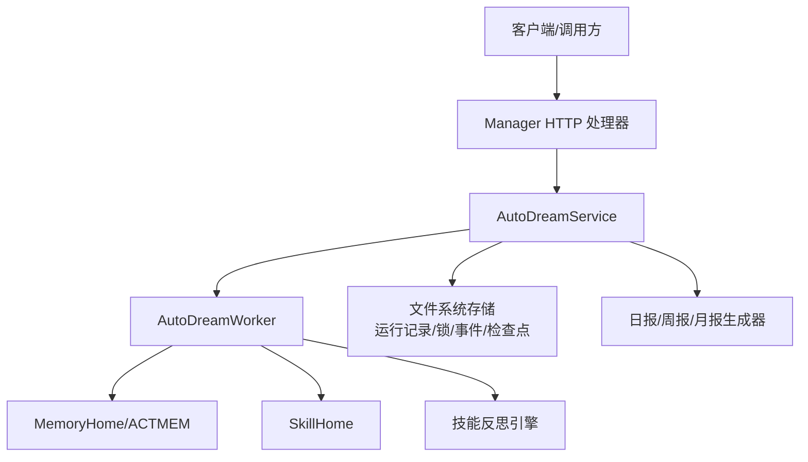
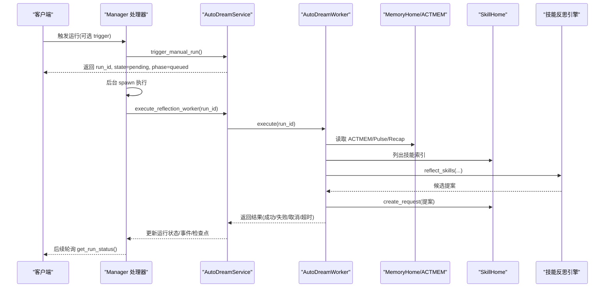
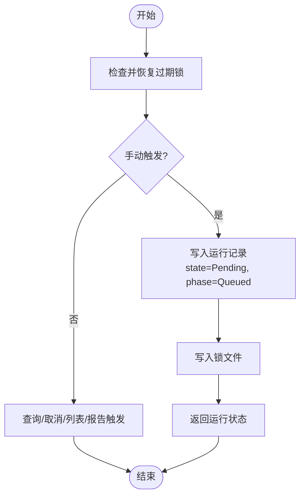
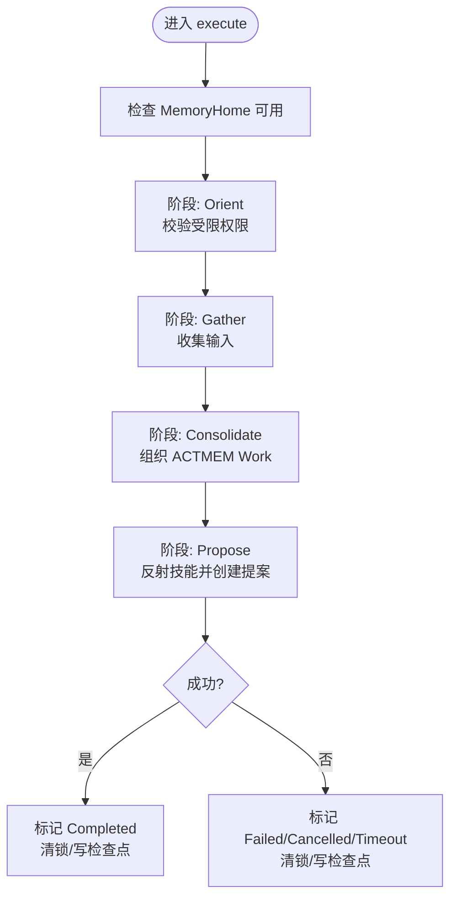
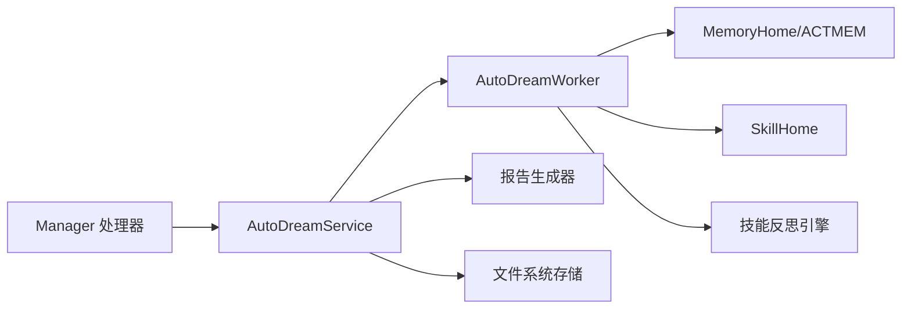
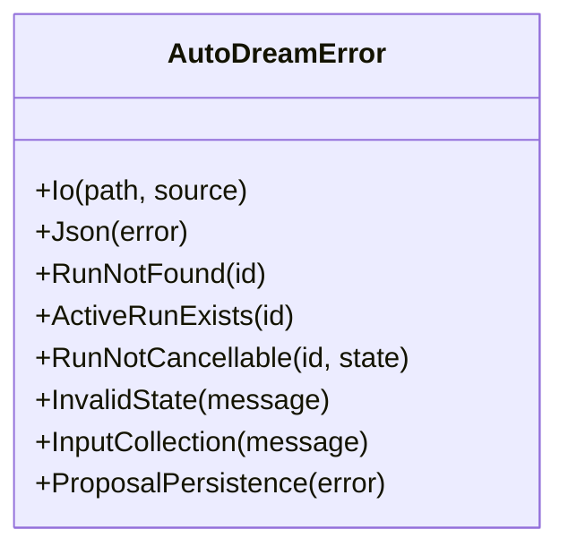

# 工作流编排

<cite>
**本文引用的文件**
- [service.rs](file://agent-diva-autodream/src/service.rs)
- [worker.rs](file://agent-diva-autodream/src/worker.rs)
- [lib.rs](file://agent-diva-autodream/src/lib.rs)
- [error.rs](file://agent-diva-autodream/src/error.rs)
- [diagnostics.rs](file://agent-diva-autodream/src/diagnostics.rs)
- [metrics.rs](file://agent-diva-autodream/src/metrics.rs)
- [autodream.rs](file://agent-diva-manager/src/handlers/autodream.rs)
</cite>

## 目录
1. [简介](#简介)
2. [项目结构](#项目结构)
3. [核心组件](#核心组件)
4. [架构总览](#架构总览)
5. [详细组件分析](#详细组件分析)
6. [依赖关系分析](#依赖关系分析)
7. [性能与并发控制](#性能与并发控制)
8. [故障恢复与错误处理](#故障恢复与错误处理)
9. [配置说明](#配置说明)
10. [使用示例](#使用示例)
11. [外部系统集成](#外部系统集成)
12. [监控与调试](#监控与调试)
13. [结论](#结论)

## 简介
本文件面向 AutoDream 的工作流编排系统，聚焦“提案生成”的完整生命周期：从任务调度、状态管理到错误处理；从启动到完成各阶段流转；并发控制、锁机制与故障恢复策略；以及触发条件、执行参数与监控选项。文档同时提供实际使用示例、与外部系统的集成方式（事件通知与状态同步），并给出面向初学者的概念解释与面向高级用户的扩展指导。

## 项目结构
AutoDream 编排由服务层、工作者、诊断与指标、错误模型等模块组成，并通过 Manager HTTP 处理器暴露对外接口。关键文件职责如下：
- 服务层：负责运行记录、锁、事件、检查点、报告触发、月度报告调度等。
- 工作者：实现四阶段反思流水线（定向、收集、整合、提议），产出技能审查请求作为“提案”。
- 诊断与指标：结构化日志与持久化事件、运行时指标快照。
- 错误模型：统一错误类型与映射。
- Manager 处理器：HTTP 入口，触发运行、查询状态、取消运行、列出事件等，并在后台异步执行具体工作。

图表来源
- [autodream.rs:12-27](file://agent-diva-manager/src/handlers/autodream.rs#L12-L27)
- [service.rs:124-133](file://agent-diva-autodream/src/service.rs#L124-L133)
- [worker.rs:152-159](file://agent-diva-autodream/src/worker.rs#L152-L159)

章节来源
- [lib.rs:1-43](file://agent-diva-autodream/src/lib.rs#L1-L43)
- [autodream.rs:12-139](file://agent-diva-manager/src/handlers/autodream.rs#L12-L139)
- [service.rs:124-133](file://agent-diva-autodream/src/service.rs#L124-L133)
- [worker.rs:152-159](file://agent-diva-autodream/src/worker.rs#L152-L159)

## 核心组件
- AutoDreamService：编排运行生命周期，维护运行记录、锁、事件、检查点；支持手动触发、取消、列表、事件查询、报告触发与月度报告调度。
- AutoDreamWorker：执行四阶段反思流水线，组织 ACTMEM Work，调用技能反思引擎，创建技能审查请求（提案）。
- 诊断与事件：将阶段级信息、输入摘要、门控拒绝、提案 ID、失败码写入 JSONL 事件文件，并输出结构化 tracing。
- 指标：进程内原子计数器，统计运行总数与失败数。
- 错误模型：统一的 I/O、JSON、状态、输入收集、提案持久化等错误类型。

章节来源
- [service.rs:34-133](file://agent-diva-autodream/src/service.rs#L34-L133)
- [worker.rs:25-159](file://agent-diva-autodream/src/worker.rs#L25-L159)
- [diagnostics.rs:11-79](file://agent-diva-autodream/src/diagnostics.rs#L11-L79)
- [metrics.rs:1-45](file://agent-diva-autodream/src/metrics.rs#L1-L45)
- [error.rs:1-51](file://agent-diva-autodream/src/error.rs#L1-L51)

## 架构总览
AutoDream 采用“服务 + 工作者”的分层编排：
- 服务层负责持久化状态机（运行记录）、并发锁、事件与检查点，以及报告触发与月度调度。
- 工作者在受控权限下读取会话与 ACTMEM，整理工作，调用技能反思引擎，产出技能审查请求作为提案。
- Manager HTTP 处理器接收外部请求，创建运行并异步执行，返回即时状态。

图表来源
- [autodream.rs:12-27](file://agent-diva-manager/src/handlers/autodream.rs#L12-L27)
- [autodream.rs:115-134](file://agent-diva-manager/src/handlers/autodream.rs#L115-L134)
- [service.rs:202-255](file://agent-diva-autodream/src/service.rs#L202-L255)
- [service.rs:405-413](file://agent-diva-autodream/src/service.rs#L405-L413)
- [worker.rs:199-375](file://agent-diva-autodream/src/worker.rs#L199-L375)

## 详细组件分析

### 服务层：运行编排与状态机
- 手动触发：创建运行记录（初始状态 Pending，编排阶段 Queued），写入锁文件，追加事件，返回状态。
- 查询状态：读取运行记录与锁，组装状态响应。
- 取消运行：仅允许 Pending/Running 状态取消，写回状态为 Cancelled，清理锁，追加事件。
- 列表与可恢复运行：扫描运行目录，过滤可恢复项，修复旧版不完整运行。
- 报告触发：根据 trigger 类型选择日/周/月报生成器，带重试逻辑，完成后写检查点并清锁。
- 月度报告调度：检查是否已生成或窗口期，避免与活动运行冲突，自动触发专用运行。
- 锁恢复：检测过期锁或外部进程锁，将中断运行重置为 Pending 并重新入队。

图表来源
- [service.rs:202-255](file://agent-diva-autodream/src/service.rs#L202-L255)
- [service.rs:288-328](file://agent-diva-autodream/src/service.rs#L288-L328)
- [service.rs:330-383](file://agent-diva-autodream/src/service.rs#L330-L383)
- [service.rs:415-489](file://agent-diva-autodream/src/service.rs#L415-L489)
- [service.rs:491-526](file://agent-diva-autodream/src/service.rs#L491-L526)
- [service.rs:656-706](file://agent-diva-autodream/src/service.rs#L656-L706)

章节来源
- [service.rs:202-706](file://agent-diva-autodream/src/service.rs#L202-L706)

### 工作者：四阶段反思流水线
- 阶段定义：Orient（定向）、Gather（收集）、Consolidate（整合）、Propose（提议）。
- 权限限制：默认仅允许读取会话、读取 Laputa API、写入 AutoDream 输出、创建 Laputa 提案 API。
- 执行流程：
  - Orient：校验受限配置文件。
  - Gather：收集输入，写入运行摘要。
  - Consolidate：组织 ACTMEM Work，处理版本冲突重试。
  - Propose：调用技能反思引擎，创建技能审查请求（提案），记录提案 ID。
- 阶段状态与诊断：每个阶段记录起止时间、状态、诊断信息；失败时汇总诊断并写出失败码。
- 收尾：成功则标记 Completed，失败则标记 Failed/Cancelled/Timeout，清理锁，写检查点。

图表来源
- [worker.rs:25-58](file://agent-diva-autodream/src/worker.rs#L25-L58)
- [worker.rs:71-117](file://agent-diva-autodream/src/worker.rs#L71-L117)
- [worker.rs:199-375](file://agent-diva-autodream/src/worker.rs#L199-L375)
- [worker.rs:596-689](file://agent-diva-autodream/src/worker.rs#L596-L689)

章节来源
- [worker.rs:199-689](file://agent-diva-autodream/src/worker.rs#L199-L689)

### 事件与诊断
- 事件结构：包含运行 ID、事件种类、消息、阶段、输入摘要、门控代码、提案 ID、失败码。
- 写入方式：追加到 JSONL 文件，按运行 ID 过滤，限制返回条数。
- 结构化日志：Diagnostic 将字段映射到 tracing 字段，便于检索与告警。

章节来源
- [service.rs:51-94](file://agent-diva-autodream/src/service.rs#L51-L94)
- [service.rs:264-286](file://agent-diva-autodream/src/service.rs#L264-L286)
- [diagnostics.rs:11-79](file://agent-diva-autodream/src/diagnostics.rs#L11-L79)
- [diagnostics.rs:99-163](file://agent-diva-autodream/src/diagnostics.rs#L99-L163)

### 指标与检查点
- 指标：进程内原子计数，记录运行总数与失败总数，支持快照。
- 检查点：记录最近一次成功运行的 ID 与时间，用于恢复与 UI 展示。

章节来源
- [metrics.rs:1-45](file://agent-diva-autodream/src/metrics.rs#L1-L45)
- [service.rs:35-41](file://agent-diva-autodream/src/service.rs#L35-L41)
- [service.rs:708-718](file://agent-diva-autodream/src/service.rs#L708-L718)

## 依赖关系分析
- Manager 处理器依赖 AutoDreamService 进行运行编排。
- AutoDreamService 依赖 AutoDreamStorage（路径与文件操作）、报告生成器、技能反思引擎、MemoryHome/SkillHome。
- AutoDreamWorker 依赖 MemoryHome/ACTMEM、SkillHome、技能反思引擎，严格受限于受限配置文件。
- 所有持久化通过文件系统进行，事件以 JSONL 追加，运行记录与锁为独立文件。

图表来源
- [autodream.rs:12-27](file://agent-diva-manager/src/handlers/autodream.rs#L12-L27)
- [service.rs:124-133](file://agent-diva-autodream/src/service.rs#L124-L133)
- [worker.rs:152-159](file://agent-diva-autodream/src/worker.rs#L152-L159)

章节来源
- [autodream.rs:12-139](file://agent-diva-manager/src/handlers/autodream.rs#L12-L139)
- [service.rs:124-133](file://agent-diva-autodream/src/service.rs#L124-L133)
- [worker.rs:152-159](file://agent-diva-autodream/src/worker.rs#L152-L159)

## 性能与并发控制
- 并发控制：通过文件锁（lock.json）保证同一时刻只有一个活动运行；服务层在每次访问前尝试恢复过期锁。
- 超时与重试：工作者在每个尝试中设置 deadline；报告触发对特定 trigger 支持多次重试。
- 资源限制：受限配置文件限制工作者可执行的操作集合，降低副作用风险。
- 事件与日志：追加式 JSONL 事件与结构化 tracing，避免阻塞主流程。

章节来源
- [service.rs:202-255](file://agent-diva-autodream/src/service.rs#L202-L255)
- [service.rs:656-706](file://agent-diva-autodream/src/service.rs#L656-L706)
- [worker.rs:567-584](file://agent-diva-autodream/src/worker.rs#L567-L584)
- [worker.rs:71-117](file://agent-diva-autodream/src/worker.rs#L71-L117)

## 故障恢复与错误处理
- 锁恢复：若锁文件存在且过期或非当前进程持有，将中断运行重置为 Pending，并删除锁。
- 运行状态：终态包括 Completed、Failed、Cancelled；非终态可恢复。
- 错误映射：AutoDreamError 统一封装 I/O、JSON、状态、输入收集、提案持久化错误；HTTP 层映射为状态码与错误码。
- 诊断与失败码：工作者将诊断信息聚合为失败码，便于定位问题（如输入不可用、提供者不可用/超时/失败、无效候选等）。

图表来源
- [error.rs:1-51](file://agent-diva-autodream/src/error.rs#L1-L51)

章节来源
- [service.rs:288-328](file://agent-diva-autodream/src/service.rs#L288-L328)
- [service.rs:656-706](file://agent-diva-autodream/src/service.rs#L656-L706)
- [error.rs:1-51](file://agent-diva-autodream/src/error.rs#L1-L51)
- [worker.rs:745-795](file://agent-diva-autodream/src/worker.rs#L745-L795)

## 配置说明
- 触发条件：
  - 手动触发：通过 HTTP 接口传入 trigger（可为空，默认“manual”）。
  - 定时触发：月度报告调度根据日期窗口与是否存在活动运行决定跳过或触发。
- 执行参数：
  - 工作者配置：超时、受限配置文件（默认允许读取会话、读取 Laputa API、写入 AutoDream 输出、创建 Laputa 提案 API）。
  - 报告触发：针对 notebook-daily/weekly/monthly 走报告生成路径，其他走反思工作者路径。
- 监控选项：
  - 事件：list_run_events 返回最近最多 200 条事件。
  - 指标：AutoDreamMetricsSnapshot 提供运行总数与失败总数。
  - 检查点：记录最近成功运行 ID 与时间。

章节来源
- [service.rs:202-255](file://agent-diva-autodream/src/service.rs#L202-L255)
- [service.rs:415-489](file://agent-diva-autodream/src/service.rs#L415-L489)
- [service.rs:491-526](file://agent-diva-autodream/src/service.rs#L491-L526)
- [worker.rs:137-150](file://agent-diva-autodream/src/worker.rs#L137-L150)
- [metrics.rs:1-45](file://agent-diva-autodream/src/metrics.rs#L1-L45)

## 使用示例
- 启动提案生成任务：
  - 调用触发接口，传入可选 trigger；返回运行 ID 与初始状态（Pending，phase=Queued）。
  - 后台异步执行：非报告类 trigger 走反思工作者；报告类 trigger 走报告生成器。
- 管理任务：
  - 查询状态：get_run_status 返回运行记录、锁、自动模式与阈值开关。
  - 取消任务：cancel_run 仅在 Pending/Running 状态有效。
  - 查看事件：list_run_events 获取最近事件，用于进度与排错。
  - 列出运行：list_runs 返回所有运行与活动运行 ID。

章节来源
- [autodream.rs:12-27](file://agent-diva-manager/src/handlers/autodream.rs#L12-L27)
- [autodream.rs:29-90](file://agent-diva-manager/src/handlers/autodream.rs#L29-L90)
- [autodream.rs:115-134](file://agent-diva-manager/src/handlers/autodream.rs#L115-L134)
- [service.rs:202-328](file://agent-diva-autodream/src/service.rs#L202-L328)

## 外部系统集成
- 事件通知：
  - 事件文件：JSONL 追加，包含运行 ID、阶段、输入摘要、门控代码、提案 ID、失败码。
  - 结构化日志：Diagnostic 将字段映射到 tracing，便于集中采集与告警。
- 状态同步：
  - HTTP 接口提供运行状态、事件、列表等查询。
  - 实时文本：Manager 暴露 live text 端点，显示反射过程中的受控输出（不持久化）。
- 与记忆与技能系统：
  - 工作者通过 MemoryHome/ACTMEM 读取与写入组织后的 Work。
  - 通过 SkillHome 创建技能审查请求（提案），作为用户审查与后续合并的依据。

章节来源
- [service.rs:264-286](file://agent-diva-autodream/src/service.rs#L264-L286)
- [diagnostics.rs:11-79](file://agent-diva-autodream/src/diagnostics.rs#L11-L79)
- [autodream.rs:53-63](file://agent-diva-manager/src/handlers/autodream.rs#L53-L63)
- [worker.rs:377-508](file://agent-diva-autodream/src/worker.rs#L377-L508)

## 监控与调试
- 指标：
  - 运行总数与失败总数可通过指标快照获取。
- 事件：
  - 使用 list_run_events 获取最近事件，关注阶段、输入摘要、门控代码、提案 ID、失败码。
- 诊断：
  - 工作者在每个阶段记录诊断，失败时聚合为失败码，便于快速定位。
- 调试建议：
  - 优先查看事件与结构化日志，结合失败码定位问题。
  - 检查锁文件与运行记录，确认是否存在过期锁或中断运行。
  - 对于报告生成失败，关注重试次数与最终错误信息。

章节来源
- [metrics.rs:1-45](file://agent-diva-autodream/src/metrics.rs#L1-L45)
- [service.rs:264-286](file://agent-diva-autodream/src/service.rs#L264-L286)
- [diagnostics.rs:99-163](file://agent-diva-autodream/src/diagnostics.rs#L99-L163)
- [worker.rs:745-795](file://agent-diva-autodream/src/worker.rs#L745-L795)

## 结论
AutoDream 工作流编排通过服务层与工作者分层协作，实现了稳定的任务调度、清晰的状态机、严格的并发控制与完善的错误恢复。其事件与诊断体系为监控与调试提供了坚实基础，配合 HTTP 接口与外部系统的事件订阅，能够高效支撑提案生成的自动化与可观测性。初学者可从触发与查询入手理解编排流程，高级用户可基于受限配置文件与技能反思引擎扩展自定义工作流与扩展点。