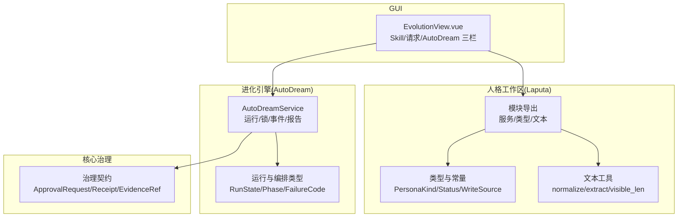
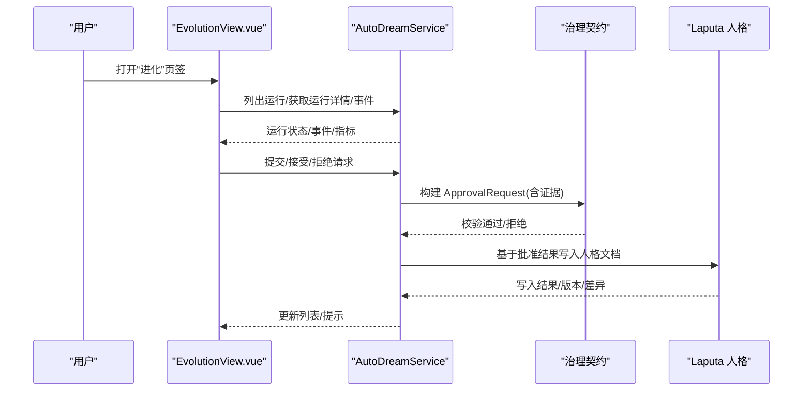
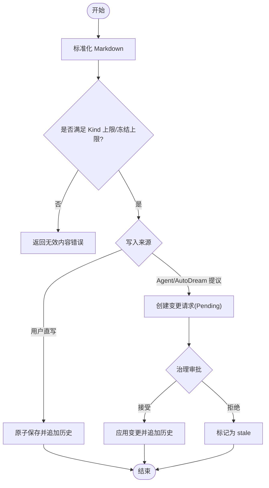
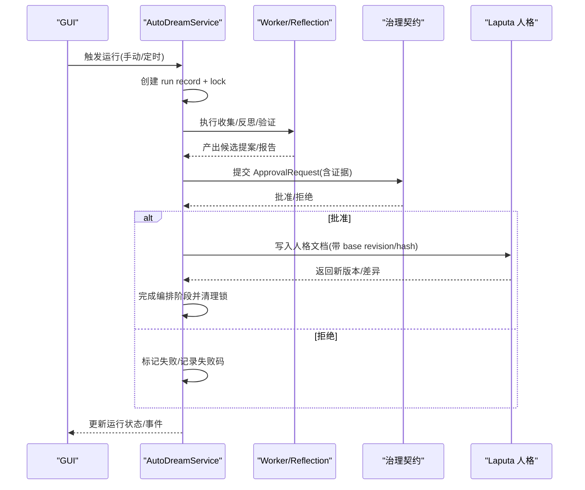
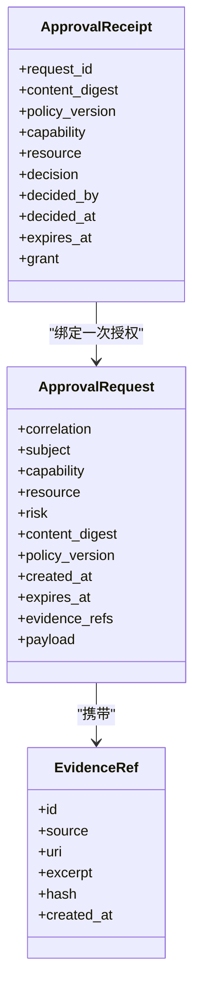
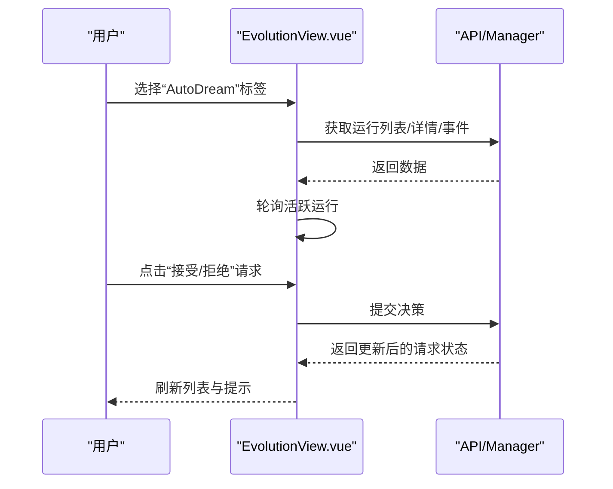
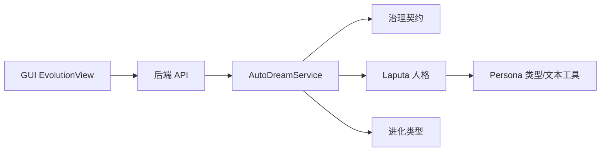

# 人格与进化

<cite>
**本文引用的文件**
- [agent-diva-laputa/src/persona/types.rs](file://agent-diva-laputa/src/persona/types.rs)
- [agent-diva-laputa/src/persona/text.rs](file://agent-diva-laputa/src/persona/text.rs)
- [agent-diva-laputa/src/persona/mod.rs](file://agent-diva-laputa/src/persona/mod.rs)
- [agent-diva-core/src/evolution/types.rs](file://agent-diva-core/src/evolution/types.rs)
- [agent-diva-core/src/governance/types.rs](file://agent-diva-core/src/governance/types.rs)
- [agent-diva-autodream/src/service.rs](file://agent-diva-autodream/src/service.rs)
- [agent-diva-gui/src/components/EvolutionView.vue](file://agent-diva-gui/src/components/EvolutionView.vue)
- [docs/research/persona-markdown-clean-break-2026-08/decision-record.md](file://docs/research/persona-markdown-clean-break-2026-08/decision-record.md)
- [docs/research/cognitive-r3-persona-workspace-2026-08/README.md](file://docs/research/cognitive-r3-persona-workspace-2026-08/README.md)
</cite>

## 目录
1. [简介](#简介)
2. [项目结构](#项目结构)
3. [核心组件](#核心组件)
4. [架构总览](#架构总览)
5. [详细组件分析](#详细组件分析)
6. [依赖关系分析](#依赖关系分析)
7. [性能考虑](#性能考虑)
8. [故障排查指南](#故障排查指南)
9. [结论](#结论)
10. [附录：配置示例、模板库与最佳实践](#附录配置示例模板库与最佳实践)

## 简介
本文件面向 Agent Diva 的“人格”与“进化”两大能力，提供从概念到实现、从 GUI 操作到后端治理的全景说明。内容覆盖：
- 人格工作区的 Markdown 权威结构与角色定义、行为约束
- AutoDream 提案生成机制、反思分析与改进建议算法
- 进化审查流程、治理审批与版本控制机制
- 人格配置示例、进化策略调优与效果评估方法
- 人格模板库、最佳实践案例与常见问题解决方案
- 在 GUI 中查看人格状态、审查提案与管理进化过程的操作指引

## 项目结构
Agent Diva 将“人格”与“进化”拆分为可独立演进但紧密协作的子系统：
- Laputa 人格工作区：以七份 Markdown 权威文件为核心，提供规范化、可审计的人格文档读写与历史管理
- AutoDream 进化引擎：负责收集输入、执行反思、生成提案、产出报告并驱动变更进入治理流程
- 核心治理域：提供跨领域的请求/收据/证据/策略等通用契约
- GUI 进化视图：统一展示 Skill 列表、待审请求与 AutoDream 运行记录，支持在线审阅与操作

图表来源
- [agent-diva-laputa/src/persona/mod.rs:1-13](file://agent-diva-laputa/src/persona/mod.rs#L1-L13)
- [agent-diva-laputa/src/persona/types.rs:6-98](file://agent-diva-laputa/src/persona/types.rs#L6-L98)
- [agent-diva-laputa/src/persona/text.rs:1-39](file://agent-diva-laputa/src/persona/text.rs#L1-L39)
- [agent-diva-core/src/evolution/types.rs:115-182](file://agent-diva-core/src/evolution/types.rs#L115-L182)
- [agent-diva-core/src/governance/types.rs:121-161](file://agent-diva-core/src/governance/types.rs#L121-L161)
- [agent-diva-gui/src/components/EvolutionView.vue:1-120](file://agent-diva-gui/src/components/EvolutionView.vue#L1-L120)

章节来源
- [agent-diva-laputa/src/persona/mod.rs:1-13](file://agent-diva-laputa/src/persona/mod.rs#L1-L13)
- [agent-diva-core/src/evolution/types.rs:1-51](file://agent-diva-core/src/evolution/types.rs#L1-L51)
- [agent-diva-core/src/governance/types.rs:1-43](file://agent-diva-core/src/governance/types.rs#L1-L43)
- [agent-diva-gui/src/components/EvolutionView.vue:1-120](file://agent-diva-gui/src/components/EvolutionView.vue#L1-L120)

## 核心组件
- 人格工作区（Laputa）
  - 七份权威 Markdown：IDENTITY.MD、RELATIONSHIP.MD、REDLINE.MD、USER.MD、WORLD.MD、DREAM.MD、DARK.MD
  - 每个 Kind 有内容上限与冻结上限；必需集合决定就绪状态
  - 写入来源区分用户直写、Agent 提议、AutoDream 提议等
  - 文本标准化、可见长度计算、按二级标题提取片段
- AutoDream 服务
  - 运行生命周期：Pending/Running/Completed/Failed/Cancelled
  - 编排阶段：Queued/Gathering/Reflecting/Validating/Publishing/Completed/Failed/Cancelled
  - 失败码：Provider/Timeout/InvalidCandidate 等
  - 持久化：run record、lock、events JSONL、checkpoint
  - 触发器：手动、月度报告、其他节奏触发
- 治理契约
  - ApprovalRequest/ApprovalReceipt：领域无关的请求与收据信封
  - EvidenceRef：证据引用，区分上下文压缩等非权威来源
  - 资源范围、风险等级、能力、策略版本、过期时间校验
- GUI 进化视图
  - 三栏：Skill 列表、待审请求、AutoDream 运行
  - 实时轮询运行详情与事件流，支持接受/拒绝请求、编辑/停用/删除 Skill

章节来源
- [agent-diva-laputa/src/persona/types.rs:6-98](file://agent-diva-laputa/src/persona/types.rs#L6-L98)
- [agent-diva-laputa/src/persona/types.rs:156-186](file://agent-diva-laputa/src/persona/types.rs#L156-L186)
- [agent-diva-laputa/src/persona/text.rs:1-39](file://agent-diva-laputa/src/persona/text.rs#L1-L39)
- [agent-diva-core/src/evolution/types.rs:115-182](file://agent-diva-core/src/evolution/types.rs#L115-L182)
- [agent-diva-core/src/governance/types.rs:121-161](file://agent-diva-core/src/governance/types.rs#L121-L161)
- [agent-diva-gui/src/components/EvolutionView.vue:564-743](file://agent-diva-gui/src/components/EvolutionView.vue#L564-L743)

## 架构总览
下图展示了从 GUI 到后端服务的调用链，以及人格与进化的交互边界。

图表来源
- [agent-diva-gui/src/components/EvolutionView.vue:183-232](file://agent-diva-gui/src/components/EvolutionView.vue#L183-L232)
- [agent-diva-autodream/src/service.rs:202-255](file://agent-diva-autodream/src/service.rs#L202-L255)
- [agent-diva-core/src/governance/types.rs:204-224](file://agent-diva-core/src/governance/types.rs#L204-L224)
- [agent-diva-laputa/src/persona/types.rs:156-186](file://agent-diva-laputa/src/persona/types.rs#L156-L186)

## 详细组件分析

### 人格工作区：Markdown 权威结构与约束
- 权威文件与角色
  - IDENTITY.MD：Agent 身份、称呼、职责、性格、表达、当前身体/形态
  - RELATIONSHIP.MD：用户与 Agent 的关系定位与期望
  - REDLINE.MD：承诺与红线，禁止事项与必须先问的事项
  - USER.MD：用户偏好与观察到的用户行为
  - WORLD.MD：环境背景与工作/生活/旅行处境
  - DREAM.MD：Agent 心愿（严格字数限制）
  - DARK.MD：内侧恐惧与阴影（极短数字 D1 定）
- 内容与冻结上限
  - 每种 Kind 有内容上限与冻结上限，确保 Prompt 注入可控
- 初始化与就绪
  - 必需集合决定就绪状态；首次引导仅收能自述的偏好
- 文本处理
  - 标准化换行与 Unicode 归一化；可见字符计数；按二级标题提取片段
- 写入来源与历史
  - 区分用户直写、Agent 提议、AutoDream 提议、初始化、历史重存
  - 每次真实成功变化追加完整快照与文本 Diff；完整历史不进 Prompt

图表来源
- [agent-diva-laputa/src/persona/text.rs:1-39](file://agent-diva-laputa/src/persona/text.rs#L1-L39)
- [agent-diva-laputa/src/persona/types.rs:6-98](file://agent-diva-laputa/src/persona/types.rs#L6-L98)
- [agent-diva-laputa/src/persona/types.rs:156-186](file://agent-diva-laputa/src/persona/types.rs#L156-L186)

章节来源
- [docs/research/persona-markdown-clean-break-2026-08/decision-record.md:28-308](file://docs/research/persona-markdown-clean-break-2026-08/decision-record.md#L28-L308)
- [docs/research/cognitive-r3-persona-workspace-2026-08/README.md:45-72](file://docs/research/cognitive-r3-persona-workspace-2026-08/README.md#L45-L72)
- [agent-diva-laputa/src/persona/types.rs:6-98](file://agent-diva-laputa/src/persona/types.rs#L6-L98)
- [agent-diva-laputa/src/persona/types.rs:156-186](file://agent-diva-laputa/src/persona/types.rs#L156-L186)
- [agent-diva-laputa/src/persona/text.rs:1-39](file://agent-diva-laputa/src/persona/text.rs#L1-L39)

### AutoDream：提案生成、反思与分析
- 运行生命周期与编排阶段
  - 运行状态：Pending/Running/Completed/Failed/Cancelled
  - 编排阶段：Queued/Gathering/Reflecting/Validating/Publishing/Completed/Failed/Cancelled
- 输入收集与摘要
  - 收集多源输入，统计项数、字节数、截断情况与遗漏原因
- 反思与报告
  - 支持节奏报告与月度报告；失败重试；事件日志追加
- 锁与恢复
  - 进程级锁防止并发；死锁恢复将中断运行重新排队
- 与治理和人物的衔接
  - 生成的候选提案需经治理审批；通过后由人格工作区原子写入并生成历史

图表来源
- [agent-diva-autodream/src/service.rs:202-255](file://agent-diva-autodream/src/service.rs#L202-L255)
- [agent-diva-autodream/src/service.rs:415-489](file://agent-diva-autodream/src/service.rs#L415-L489)
- [agent-diva-core/src/evolution/types.rs:115-182](file://agent-diva-core/src/evolution/types.rs#L115-L182)
- [agent-diva-core/src/governance/types.rs:204-224](file://agent-diva-core/src/governance/types.rs#L204-L224)

章节来源
- [agent-diva-autodream/src/service.rs:202-255](file://agent-diva-autodream/src/service.rs#L202-L255)
- [agent-diva-autodream/src/service.rs:415-489](file://agent-diva-autodream/src/service.rs#L415-L489)
- [agent-diva-core/src/evolution/types.rs:115-182](file://agent-diva-core/src/evolution/types.rs#L115-L182)

### 进化审查流程、治理审批与版本控制
- 治理信封
  - ApprovalRequest：包含主体、能力、资源范围、风险、内容摘要、策略版本、证据引用、载荷
  - ApprovalReceipt：不可变决策记录，绑定请求与内容摘要，支持一次性授权
- 证据约束
  - EvidenceRef 区分来源；上下文压缩仅作为次要证据，不能作为唯一权威
- 版本控制
  - 人格写入使用 base revision/hash 进行冲突检测；成功写入后追加完整快照与 Diff
  - 历史不可变，完整历史不进入 Prompt，避免污染上下文

图表来源
- [agent-diva-core/src/governance/types.rs:121-161](file://agent-diva-core/src/governance/types.rs#L121-L161)
- [agent-diva-core/src/governance/types.rs:204-224](file://agent-diva-core/src/governance/types.rs#L204-L224)
- [agent-diva-core/src/evolution/types.rs:20-51](file://agent-diva-core/src/evolution/types.rs#L20-L51)

章节来源
- [agent-diva-core/src/governance/types.rs:121-161](file://agent-diva-core/src/governance/types.rs#L121-L161)
- [agent-diva-core/src/governance/types.rs:204-224](file://agent-diva-core/src/governance/types.rs#L204-L224)
- [agent-diva-core/src/evolution/types.rs:20-51](file://agent-diva-core/src/evolution/types.rs#L20-L51)

### GUI：查看人格状态、审查提案与管理进化
- 三栏视图
  - Skill：查看/编辑/停用/删除受进化管理的 Skill
  - 待审：创建/接受/拒绝请求，查看证据与声明
  - AutoDream：运行列表、运行详情、事件流、实时输出
- 交互要点
  - 运行详情自动轮询；事件与输出可过滤与脱敏显示
  - 从运行跳转到对应提案，快速定位问题
  - 所有写入均通过 API 调用，保证一致性

图表来源
- [agent-diva-gui/src/components/EvolutionView.vue:183-232](file://agent-diva-gui/src/components/EvolutionView.vue#L183-L232)
- [agent-diva-gui/src/components/EvolutionView.vue:463-480](file://agent-diva-gui/src/components/EvolutionView.vue#L463-L480)
- [agent-diva-gui/src/components/EvolutionView.vue:564-743](file://agent-diva-gui/src/components/EvolutionView.vue#L564-L743)

章节来源
- [agent-diva-gui/src/components/EvolutionView.vue:183-232](file://agent-diva-gui/src/components/EvolutionView.vue#L183-L232)
- [agent-diva-gui/src/components/EvolutionView.vue:463-480](file://agent-diva-gui/src/components/EvolutionView.vue#L463-L480)
- [agent-diva-gui/src/components/EvolutionView.vue:564-743](file://agent-diva-gui/src/components/EvolutionView.vue#L564-L743)

## 依赖关系分析
- Laputa 人格模块对外暴露类型与服务，供上层消费
- AutoDream 服务依赖核心治理契约与可选的记忆/技能家
- GUI 通过 API 层与后端交互，呈现统一视图
- 证据与审批贯穿 AutoDream 与人格写入，形成闭环

图表来源
- [agent-diva-gui/src/components/EvolutionView.vue:1-120](file://agent-diva-gui/src/components/EvolutionView.vue#L1-L120)
- [agent-diva-autodream/src/service.rs:124-133](file://agent-diva-autodream/src/service.rs#L124-L133)
- [agent-diva-core/src/governance/types.rs:121-161](file://agent-diva-core/src/governance/types.rs#L121-L161)
- [agent-diva-laputa/src/persona/mod.rs:1-13](file://agent-diva-laputa/src/persona/mod.rs#L1-L13)

章节来源
- [agent-diva-autodream/src/service.rs:124-133](file://agent-diva-autodream/src/service.rs#L124-L133)
- [agent-diva-core/src/governance/types.rs:121-161](file://agent-diva-core/src/governance/types.rs#L121-L161)
- [agent-diva-laputa/src/persona/mod.rs:1-13](file://agent-diva-laputa/src/persona/mod.rs#L1-L13)

## 性能考虑
- 人格 Markdown 标准化与可见长度计算用于控制注入大小，避免上下文膨胀
- AutoDream 运行采用锁与恢复机制，避免重复执行与长时间阻塞
- 事件与运行记录采用追加式 JSONL，读取时限制条目数量，降低 I/O 压力
- GUI 对运行详情进行轮询，仅在活跃运行时启用，减少不必要请求

[本节为通用指导，无需特定文件来源]

## 故障排查指南
- 人格写入冲突
  - 现象：revision 冲突或内容超限
  - 处理：检查 base revision/hash；缩短内容至上限；保留草稿并提示冲突
- AutoDream 运行失败
  - 现象：Provider 超时/失败、候选无效、报告生成失败
  - 处理：查看运行事件与失败码；必要时重试或取消；检查锁与恢复
- 治理校验失败
  - 现象：未知能力/资源/风险；过期时间非法；收据不匹配
  - 处理：修正请求字段；确保策略版本一致；核对内容摘要

章节来源
- [agent-diva-laputa/src/persona/types.rs:250-309](file://agent-diva-laputa/src/persona/types.rs#L250-L309)
- [agent-diva-core/src/governance/types.rs:163-202](file://agent-diva-core/src/governance/types.rs#L163-L202)
- [agent-diva-core/src/evolution/types.rs:148-163](file://agent-diva-core/src/evolution/types.rs#L148-L163)

## 结论
Agent Diva 的人格与进化系统以 Markdown 权威文档为核心，结合 AutoDream 的自动化反思与治理审批，实现了安全、可审计、可回滚的持续进化路径。GUI 提供了统一的可视化入口，便于人类监督与干预。通过严格的版本控制与证据约束，系统在灵活性与安全性之间取得平衡。

[本节为总结性内容，无需特定文件来源]

## 附录：配置示例、模板库与最佳实践

### 人格配置示例
- 初始五份权威文件（Identity/Relationship/Redline/User/World）应简洁明确，遵循内容上限与冻结上限
- Dream/Dark 保持极简，聚焦关键意图与内在约束
- 建议在首次引导中只写入能自述的用户偏好，避免臆测

章节来源
- [docs/research/persona-markdown-clean-break-2026-08/decision-record.md:35-72](file://docs/research/persona-markdown-clean-break-2026-08/decision-record.md#L35-L72)
- [docs/research/cognitive-r3-persona-workspace-2026-08/README.md:45-72](file://docs/research/cognitive-r3-persona-workspace-2026-08/README.md#L45-L72)

### 进化策略调优
- 调整 AutoDream 运行频率与触发器（手动/月度/节奏）
- 设置 Provider 超时与预算，避免长响应导致超时
- 使用证据与声明提升提案可信度，减少被拒概率

章节来源
- [agent-diva-autodream/src/service.rs:202-255](file://agent-diva-autodream/src/service.rs#L202-L255)
- [agent-diva-autodream/src/service.rs:415-489](file://agent-diva-autodream/src/service.rs#L415-L489)

### 效果评估方法
- 关注运行成功率、失败码分布、事件日志质量
- 评估提案通过率与拒绝原因，优化证据与声明
- 监控人格文档变更频率与影响范围，避免过度变更

章节来源
- [agent-diva-autodream/src/service.rs:264-286](file://agent-diva-autodream/src/service.rs#L264-L286)
- [agent-diva-core/src/evolution/types.rs:165-182](file://agent-diva-core/src/evolution/types.rs#L165-L182)

### 人格模板库与最佳实践
- 模板建议
  - Identity：简短清晰，突出职责与表达风格
  - Relationship：明确双方角色与期望
  - Redline：列出必须询问的行为与绝对禁止事项
  - User：仅记录用户自述偏好
  - World：描述当前环境与任务背景
  - Dream：一句话心愿
  - Dark：极短的内侧约束
- 最佳实践
  - 使用 Markdown 编辑器直接编辑，避免引入 JSON 校验
  - 保存时携带 base revision/hash，冲突时保留草稿
  - 完整历史不进入 Prompt，避免上下文污染

章节来源
- [docs/research/persona-markdown-clean-break-2026-08/decision-record.md:28-308](file://docs/research/persona-markdown-clean-break-2026-08/decision-record.md#L28-L308)
- [agent-diva-laputa/src/persona/text.rs:1-39](file://agent-diva-laputa/src/persona/text.rs#L1-L39)

### GUI 操作指引
- 查看人格状态：通过“人格与记忆”页面查看各文件状态与历史
- 审查提案：在“待审”标签下查看请求详情、证据与声明，接受或拒绝
- 管理进化：在“AutoDream”标签下查看运行记录、事件与实时输出，必要时取消或重试

章节来源
- [agent-diva-gui/src/components/EvolutionView.vue:564-743](file://agent-diva-gui/src/components/EvolutionView.vue#L564-L743)