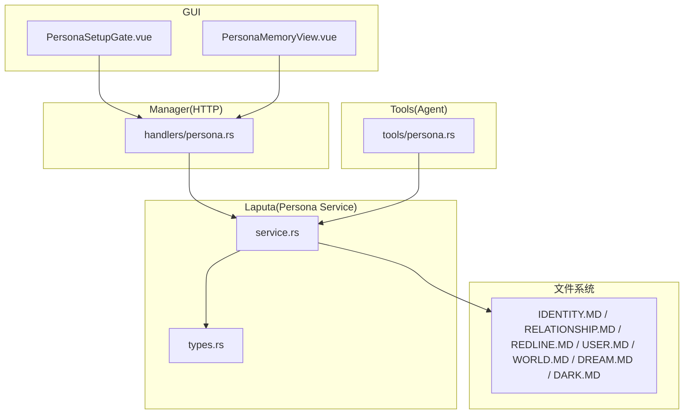
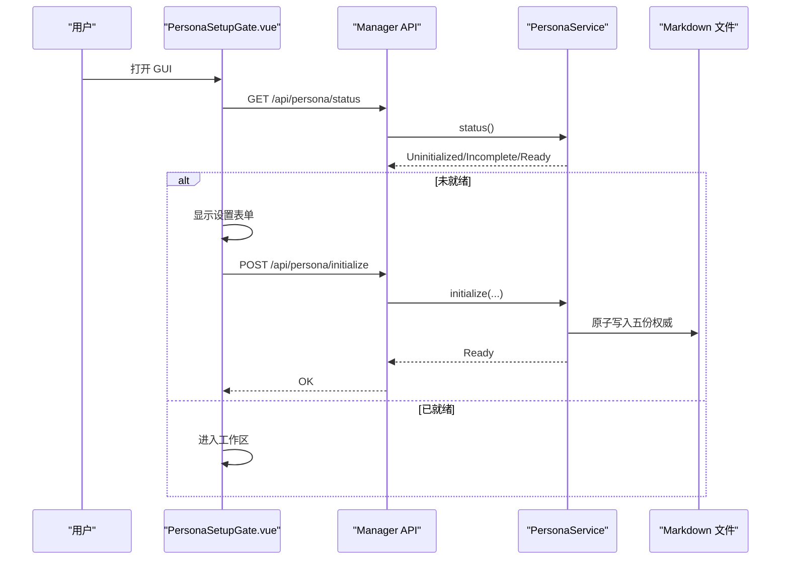
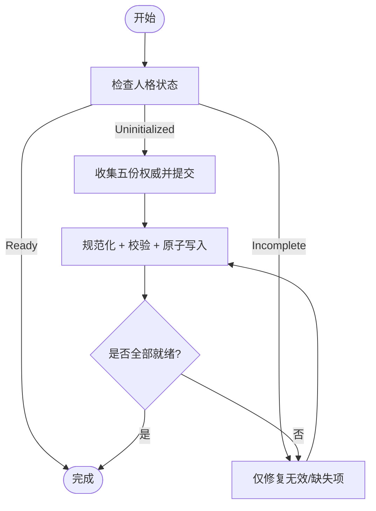
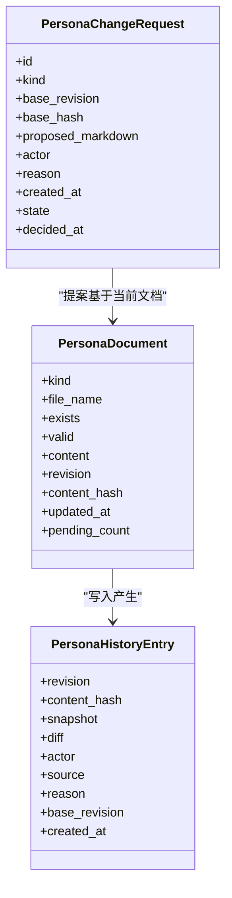
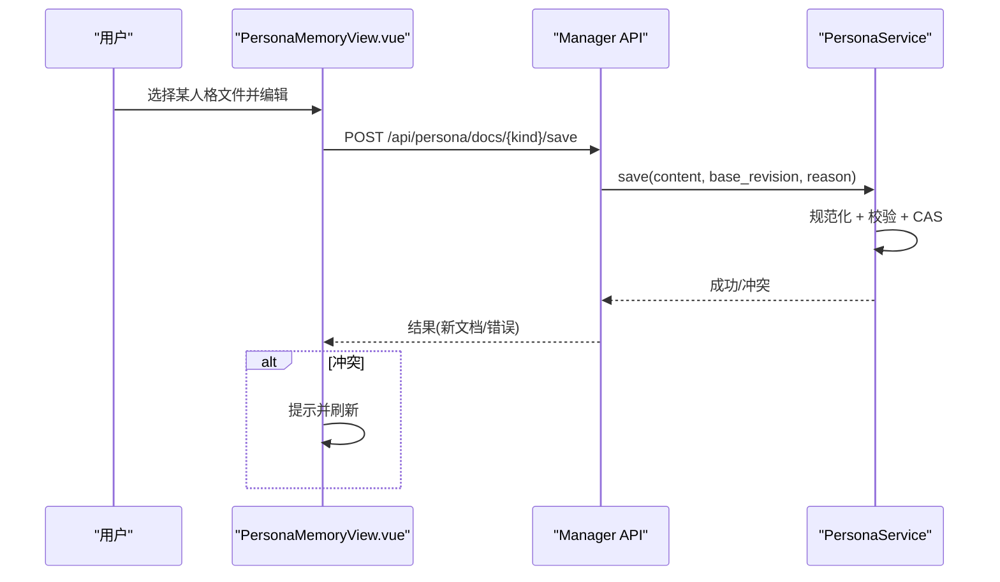
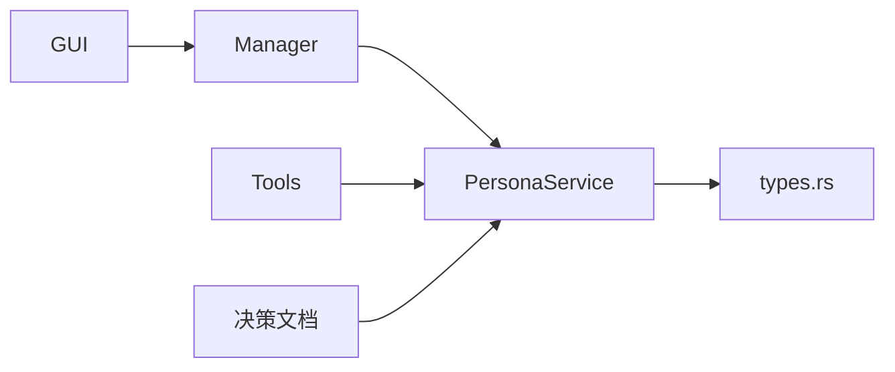

# 人格工作区

<cite>
**本文引用的文件**
- [agent-diva-laputa/src/persona/types.rs](file://agent-diva-laputa/src/persona/types.rs)
- [agent-diva-laputa/src/persona/service.rs](file://agent-diva-laputa/src/persona/service.rs)
- [agent-diva-manager/src/handlers/persona.rs](file://agent-diva-manager/src/handlers/persona.rs)
- [agent-diva-tools/src/persona.rs](file://agent-diva-tools/src/persona.rs)
- [agent-diva-gui/src/components/PersonaMemoryView.vue](file://agent-diva-gui/src/components/PersonaMemoryView.vue)
- [agent-diva-gui/src/components/PersonaSetupGate.vue](file://agent-diva-gui/src/components/PersonaSetupGate.vue)
- [workspace/masks/assistant.md](file://workspace/masks/assistant.md)
- [workspace/masks/coder.md](file://workspace/masks/coder.md)
- [docs/research/persona-markdown-clean-break-2026-08/decision-record.md](file://docs/research/persona-markdown-clean-break-2026-08/decision-record.md)
- [docs/architecture/current/runtime-approval-boundary-2026-08.md](file://docs/architecture/current/runtime-approval-boundary-2026-08.md)
</cite>

## 目录
1. [简介](#简介)
2. [项目结构](#项目结构)
3. [核心组件](#核心组件)
4. [架构总览](#架构总览)
5. [详细组件分析](#详细组件分析)
6. [依赖关系分析](#依赖关系分析)
7. [性能与容量特性](#性能与容量特性)
8. [故障排除指南](#故障排除指南)
9. [结论](#结论)
10. [附录：模板、最佳实践与迁移](#附录模板最佳实践与迁移)

## 简介
本文件面向 Agent Diva 的“人格工作区”系统，系统性说明 Markdown 权威结构、角色定义与行为约束机制；详解人格文档的初始化流程、状态管理与版本控制；解释不同人格类型（Identity、Relationship、User、World、Dark 等）的职责与权限边界；提供配置示例、最佳实践与常见问题解决方案；并指导如何在 GUI 中查看与管理人格文件，包括内容验证、格式检查与冲突解决。同时为初学者解释人格概念的价值与应用场景，并为高级用户提供深度定制与自动化配置指导。

## 项目结构
人格工作区由以下层次组成：
- 数据模型与规则：定义七种人格类型、状态、请求、历史与错误语义。
- 服务层：负责读取、校验、写入、版本控制、变更请求与历史管理。
- HTTP 接口：暴露初始化、修复、查询、保存、提案与决策等 API。
- 工具层：向 Agent 暴露受限的人格读写能力（如 WORLD 只读）。
- GUI：提供可视化编辑、预览、待审变更处理与历史记录浏览。
- 决策与边界文档：明确运行时审批边界与 Markdown 权威规范。

图表来源
- [agent-diva-gui/src/components/PersonaSetupGate.vue:23-53](file://agent-diva-gui/src/components/PersonaSetupGate.vue#L23-L53)
- [agent-diva-gui/src/components/PersonaMemoryView.vue:39-98](file://agent-diva-gui/src/components/PersonaMemoryView.vue#L39-L98)
- [agent-diva-manager/src/handlers/persona.rs:52-95](file://agent-diva-manager/src/handlers/persona.rs#L52-L95)
- [agent-diva-laputa/src/persona/service.rs:170-200](file://agent-diva-laputa/src/persona/service.rs#L170-L200)
- [agent-diva-laputa/src/persona/types.rs:6-18](file://agent-diva-laputa/src/persona/types.rs#L6-L18)

章节来源
- [agent-diva-laputa/src/persona/types.rs:6-18](file://agent-diva-laputa/src/persona/types.rs#L6-L18)
- [agent-diva-manager/src/handlers/persona.rs:52-95](file://agent-diva-manager/src/handlers/persona.rs#L52-L95)
- [agent-diva-gui/src/components/PersonaSetupGate.vue:23-53](file://agent-diva-gui/src/components/PersonaSetupGate.vue#L23-L53)
- [agent-diva-gui/src/components/PersonaMemoryView.vue:39-98](file://agent-diva-gui/src/components/PersonaMemoryView.vue#L39-L98)

## 核心组件
- 人格类型与常量：七种人格类型及其文件名、内容上限、冻结核心限制、就绪要求。
- 状态机：Uninitialized、Incomplete、Ready，驱动初始化与修复流程。
- 文档模型：包含 kind、文件名、存在性、有效性、内容、修订号、哈希、更新时间与待审计数。
- 变更请求：提案、接受/拒绝、过期与冲突检测。
- 历史与原子写入：每次写操作生成历史条目并原子替换文件。
- 校验与约束：非空、可见长度上限、Frozen Core 限制、作用域限制（如 USER Observations 不可被 Agent 修改）。
- 工具封装：Agent 通过工具访问人格，避免直接路径暴露。

章节来源
- [agent-diva-laputa/src/persona/types.rs:6-18](file://agent-diva-laputa/src/persona/types.rs#L6-L18)
- [agent-diva-laputa/src/persona/types.rs:117-188](file://agent-diva-laputa/src/persona/types.rs#L117-L188)
- [agent-diva-laputa/src/persona/service.rs:590-632](file://agent-diva-laputa/src/persona/service.rs#L590-L632)
- [agent-diva-tools/src/persona.rs:1-41](file://agent-diva-tools/src/persona.rs#L1-L41)

## 架构总览
人格工作区的端到端调用链如下：
- GUI 启动时检查人格状态，若未就绪则弹出设置门，收集五份用户侧权威（不含 DREAM/DARK），提交后进入就绪。
- 在人格工作区页面，用户可切换七种人格文件，编辑当前文档、查看待审变更与历史，支持源视图与预览模式。
- Manager 暴露 REST API，将 GUI 请求转发至 Laputa Persona Service。
- Service 执行 Markdown 规范化、内容校验、作用域校验、CAS 版本控制、历史追加与原子写入。
- Agent 通过工具调用读取或发起变更请求，受权限与作用域约束。

图表来源
- [agent-diva-gui/src/components/PersonaSetupGate.vue:23-53](file://agent-diva-gui/src/components/PersonaSetupGate.vue#L23-L53)
- [agent-diva-manager/src/handlers/persona.rs:52-77](file://agent-diva-manager/src/handlers/persona.rs#L52-L77)
- [agent-diva-laputa/src/persona/service.rs:170-200](file://agent-diva-laputa/src/persona/service.rs#L170-L200)

## 详细组件分析

### 人格类型与职责边界
- Identity：Agent 的身份、称呼、职责、性格、表达与当前身体/形态；属于 Frozen Core，首次引导必须提供。
- Relationship：描述用户与 Agent 的关系及 Agent 对关系的看法；属于 Frozen Core，首次引导必须提供。
- Redline：用户划定的承诺与红线，规定不许做什么、必须先问什么；属于 Frozen Core，首次引导必须提供。
- User：用户偏好与 Agent 对用户认知与行为的观察；属于 Frozen Core，首次引导仅收能自述的偏好；Observations 部分禁止 Agent 修改。
- World：当前环境上下文；不属于 Frozen Core，走工具读写，不动态装配进上下文。
- Dream：Agent 的欲望；属于 Frozen Core，严格字数限制（10 字）。
- Dark：Agent 内侧（害怕与自承之丑）；可进 Frozen Core，但必须极短。

这些类型共同构成七份权威 Markdown 文件，一个对象一份文件，位于同一目录。

章节来源
- [agent-diva-laputa/src/persona/types.rs:6-18](file://agent-diva-laputa/src/persona/types.rs#L6-L18)
- [agent-diva-laputa/src/persona/types.rs:56-78](file://agent-diva-laputa/src/persona/types.rs#L56-L78)
- [docs/research/persona-markdown-clean-break-2026-08/decision-record.md:35-53](file://docs/research/persona-markdown-clean-break-2026-08/decision-record.md#L35-L53)

### 初始化与修复流程
- 初始化：当状态为 Uninitialized 时，GUI 收集五份用户侧权威（IDENTITY、RELATIONSHIP、REDLINE、USER、WORLD），一次性提交；服务层进行规范化、校验与原子写入，随后状态变为 Ready。
- 修复：当状态为 Incomplete 时，GUI 仅针对无效或缺失的权威字段提示修复；服务层允许修复必需且尚未有效的文档，但不覆盖已有效文档。
- 就绪条件：五种用户侧权威必须就绪；DREAM 与 DARK 允许长期缺席。

图表来源
- [agent-diva-gui/src/components/PersonaSetupGate.vue:23-53](file://agent-diva-gui/src/components/PersonaSetupGate.vue#L23-L53)
- [agent-diva-manager/src/handlers/persona.rs:62-90](file://agent-diva-manager/src/handlers/persona.rs#L62-L90)
- [agent-diva-laputa/src/persona/service.rs:170-200](file://agent-diva-laputa/src/persona/service.rs#L170-L200)

章节来源
- [agent-diva-gui/src/components/PersonaSetupGate.vue:23-53](file://agent-diva-gui/src/components/PersonaSetupGate.vue#L23-L53)
- [agent-diva-manager/src/handlers/persona.rs:62-90](file://agent-diva-manager/src/handlers/persona.rs#L62-L90)
- [agent-diva-laputa/src/persona/service.rs:170-200](file://agent-diva-laputa/src/persona/service.rs#L170-L200)

### 状态管理与版本控制
- 状态：Uninitialized、Incomplete、Ready。
- 修订号与哈希：每次写入递增修订号并计算内容哈希；写操作基于 base_revision 与 base_hash 进行 CAS 校验，防止并发覆盖。
- 历史：每次写操作生成历史条目，记录修订号、内容哈希、快照、差异、作者、来源、原因、基础修订与创建时间。
- 原子写入：使用原子替换确保一致性；失败时返回具体错误。

图表来源
- [agent-diva-laputa/src/persona/types.rs:125-188](file://agent-diva-laputa/src/persona/types.rs#L125-L188)
- [agent-diva-laputa/src/persona/service.rs:492-580](file://agent-diva-laputa/src/persona/service.rs#L492-L580)

章节来源
- [agent-diva-laputa/src/persona/types.rs:117-188](file://agent-diva-laputa/src/persona/types.rs#L117-L188)
- [agent-diva-laputa/src/persona/service.rs:492-580](file://agent-diva-laputa/src/persona/service.rs#L492-L580)

### 权限与作用域约束
- Actor 与种类限制：不同 Actor（User、Agent P16、Agent P5 Accepted、Autodream P5 Accepted、Init、HistoryResave）对不同人格类型的写入权限不同。
- 作用域校验：例如 USER 的 Observations 不允许 Agent 修改；Autodream 不得修改用户偏好。
- 冻结核心：Identity、Relationship、Redline、User、Dream 属于 Frozen Core，有额外限制；World 不进入冻结核心。
- 运行时审批边界：Persona 用户直接保存走专用内容审查；危险工具执行仍走 Chat Approval Center。

章节来源
- [agent-diva-laputa/src/persona/types.rs:156-188](file://agent-diva-laputa/src/persona/types.rs#L156-L188)
- [agent-diva-laputa/src/persona/service.rs:612-632](file://agent-diva-laputa/src/persona/service.rs#L612-L632)
- [docs/architecture/current/runtime-approval-boundary-2026-08.md:1-30](file://docs/architecture/current/runtime-approval-boundary-2026-08.md#L1-L30)

### GUI 中的查看与管理
- 人格设置门：启动时检查状态，若未就绪则弹出设置窗口，收集五份权威并提交；完成后进入工作区。
- 人格工作区：左侧导航七种人格文件；中央三个互斥标签页：当前文档、待审变更、历史；支持源视图与预览模式；支持保存、恢复历史、接受/拒绝提案。
- 内容验证与冲突：保存时携带 base_revision，后端进行 CAS 校验；冲突时提示刷新并重试。

图表来源
- [agent-diva-gui/src/components/PersonaMemoryView.vue:67-87](file://agent-diva-gui/src/components/PersonaMemoryView.vue#L67-L87)
- [agent-diva-manager/src/handlers/persona.rs:92-120](file://agent-diva-manager/src/handlers/persona.rs#L92-L120)
- [agent-diva-laputa/src/persona/service.rs:492-580](file://agent-diva-laputa/src/persona/service.rs#L492-L580)

章节来源
- [agent-diva-gui/src/components/PersonaSetupGate.vue:23-53](file://agent-diva-gui/src/components/PersonaSetupGate.vue#L23-L53)
- [agent-diva-gui/src/components/PersonaMemoryView.vue:39-98](file://agent-diva-gui/src/components/PersonaMemoryView.vue#L39-L98)

### 工具集成（Agent 视角）
- 工具封装：Agent 通过工具调用读取 WORLD 等权威，避免直接暴露文件系统路径。
- 错误映射：工具层将 PersonaError 映射为 ToolError，便于上层统一处理。
- 安全边界：工具仅暴露必要能力，遵循权限与作用域约束。

章节来源
- [agent-diva-tools/src/persona.rs:1-41](file://agent-diva-tools/src/persona.rs#L1-L41)

## 依赖关系分析
- GUI 依赖 Manager 提供的 REST API。
- Manager 依赖 Laputa Persona Service 实现业务逻辑。
- Persona Service 依赖 types 定义的数据结构与常量。
- Tools 依赖 Persona Service 以受限方式访问人格。
- 决策文档约束运行时审批边界与 Markdown 权威规范。

图表来源
- [agent-diva-gui/src/components/PersonaMemoryView.vue:39-98](file://agent-diva-gui/src/components/PersonaMemoryView.vue#L39-L98)
- [agent-diva-manager/src/handlers/persona.rs:52-95](file://agent-diva-manager/src/handlers/persona.rs#L52-L95)
- [agent-diva-laputa/src/persona/service.rs:170-200](file://agent-diva-laputa/src/persona/service.rs#L170-L200)
- [agent-diva-laputa/src/persona/types.rs:6-18](file://agent-diva-laputa/src/persona/types.rs#L6-L18)
- [docs/research/persona-markdown-clean-break-2026-08/decision-record.md:35-53](file://docs/research/persona-markdown-clean-break-2026-08/decision-record.md#L35-L53)

章节来源
- [agent-diva-gui/src/components/PersonaMemoryView.vue:39-98](file://agent-diva-gui/src/components/PersonaMemoryView.vue#L39-L98)
- [agent-diva-manager/src/handlers/persona.rs:52-95](file://agent-diva-manager/src/handlers/persona.rs#L52-L95)
- [agent-diva-laputa/src/persona/service.rs:170-200](file://agent-diva-laputa/src/persona/service.rs#L170-L200)
- [agent-diva-laputa/src/persona/types.rs:6-18](file://agent-diva-laputa/src/persona/types.rs#L6-L18)
- [docs/research/persona-markdown-clean-break-2026-08/decision-record.md:35-53](file://docs/research/persona-markdown-clean-break-2026-08/decision-record.md#L35-L53)

## 性能与容量特性
- 内容上限：每种人格类型有可见长度上限，超出将被拒绝。
- 冻结核心限制：部分类型（如 DREAM）有更严格的字符限制。
- 原子写入与历史：每次写操作生成历史条目，保证可追溯性与回滚能力。
- 建议：保持内容简洁，聚焦关键信息；避免冗余段落；合理使用标题与列表提升可读性。

章节来源
- [agent-diva-laputa/src/persona/types.rs:68-90](file://agent-diva-laputa/src/persona/types.rs#L68-L90)
- [agent-diva-laputa/src/persona/service.rs:590-610](file://agent-diva-laputa/src/persona/service.rs#L590-L610)

## 故障排除指南
- 未初始化：状态为 Uninitialized 时，需通过设置门提交五份权威。
- 不完整：状态为 Incomplete 时，修复缺失或无效的必需文档。
- 内容为空：必填文档不能为空，否则校验失败。
- 内容超长：超过类型上限将被拒绝，需精简内容。
- 修订冲突：保存时 base_revision 不匹配，需刷新获取最新版本后重试。
- 作用域违规：例如 Agent 尝试修改 USER Observations 或被禁止的字段，需调整提案。
- 运行时审批：危险工具执行仍需通过 Chat Approval Center；Persona 用户直接保存走专用内容审查。

章节来源
- [agent-diva-laputa/src/persona/service.rs:170-200](file://agent-diva-laputa/src/persona/service.rs#L170-L200)
- [agent-diva-laputa/src/persona/service.rs:590-632](file://agent-diva-laputa/src/persona/service.rs#L590-L632)
- [docs/architecture/current/runtime-approval-boundary-2026-08.md:1-30](file://docs/architecture/current/runtime-approval-boundary-2026-08.md#L1-L30)

## 结论
人格工作区以 Markdown 为唯一权威格式，围绕七种人格类型构建清晰的职责与权限边界。通过初始化/修复流程、状态机、版本控制与历史追踪，确保人格文档的可控演进与可审计性。GUI 提供直观的编辑、预览与变更管理能力；工具层为 Agent 提供受限访问。结合决策文档的运行时审批边界，系统在灵活性与安全性之间取得平衡。

## 附录：模板、最佳实践与迁移

### 模板库
- 面具模板：用于快速设定助手角色与风格，便于在不同任务中复用。
  - [workspace/masks/assistant.md](file://workspace/masks/assistant.md)
  - [workspace/masks/coder.md](file://workspace/masks/coder.md)

### 最佳实践
- 内容精炼：遵循各类型的内容上限与冻结核心限制，避免冗长。
- 结构化写作：使用标题、列表与段落组织内容，提升可读性与机器解析稳定性。
- 变更最小化：每次提案仅修改必要部分，降低冲突概率。
- 明确理由：保存与提案均需提供清晰的原因，便于审计与回溯。
- 遵守作用域：避免越权修改，尤其是 USER Observations 与用户偏好。

### 迁移指南
- 从旧 JSON 建模迁移到 Markdown 权威：遵循决策记录，删除 JSON 校验与旧文件映射，统一到七份 Markdown 文件。
- 清理旧文件：移除 BODY.MD、FEAR.MD、SHADOW.MD 等非标准文件；确保根目录 USER.md 不被误认为 USER.MD。
- 更新 GUI 与工具：适配新的 API 与数据结构，确保设置门与工作区正常运作。

章节来源
- [docs/research/persona-markdown-clean-break-2026-08/decision-record.md:35-53](file://docs/research/persona-markdown-clean-break-2026-08/decision-record.md#L35-L53)
- [workspace/masks/assistant.md:1-8](file://workspace/masks/assistant.md#L1-L8)
- [workspace/masks/coder.md:1-8](file://workspace/masks/coder.md#L1-L8)