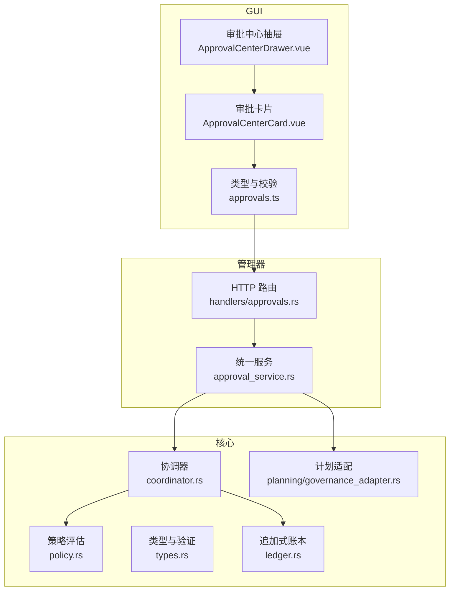
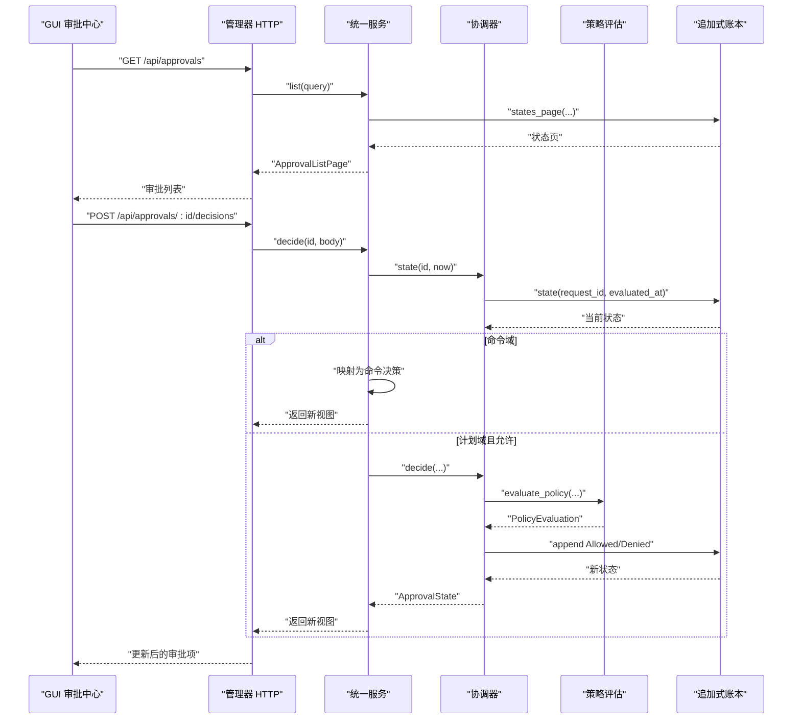
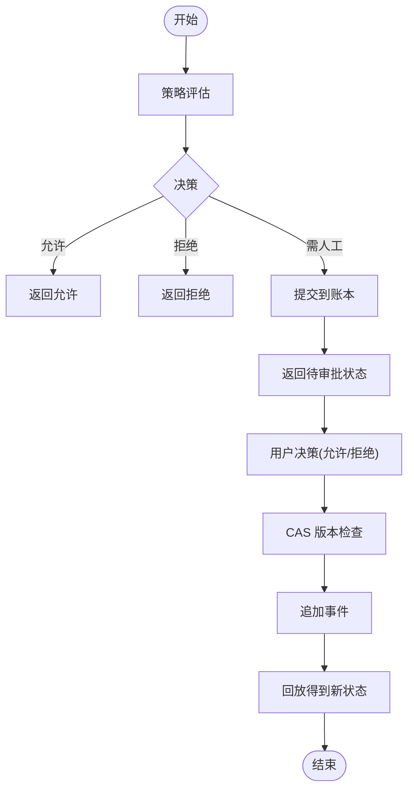
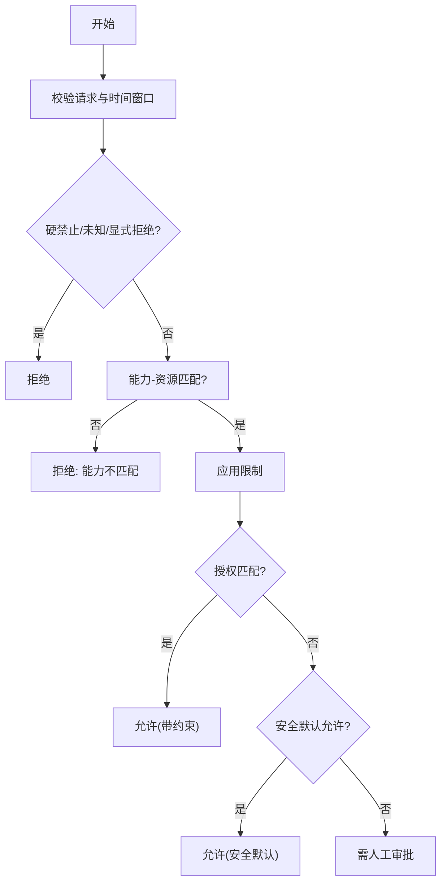
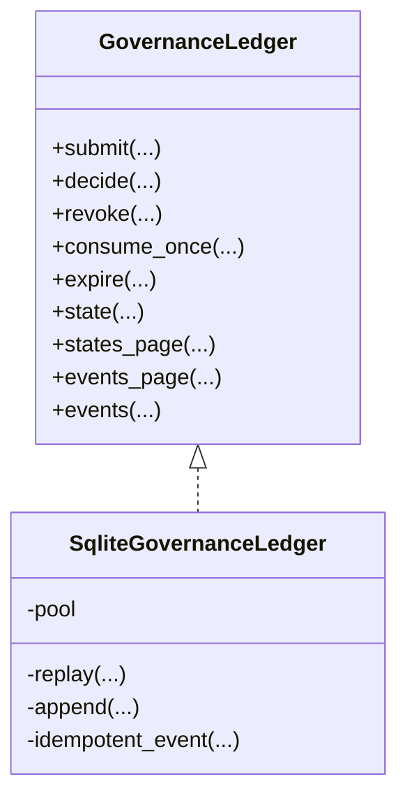
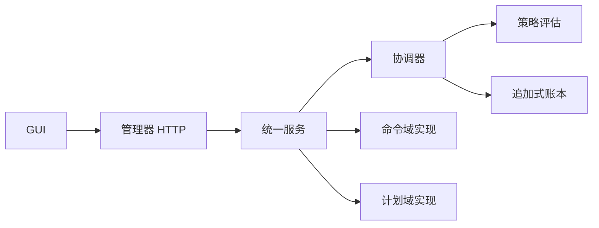

# 治理审批流程

<cite>
**本文引用的文件**
- [agent-diva-core/src/governance/mod.rs](file://agent-diva-core/src/governance/mod.rs)
- [agent-diva-core/src/governance/coordinator.rs](file://agent-diva-core/src/governance/coordinator.rs)
- [agent-diva-core/src/governance/policy.rs](file://agent-diva-core/src/governance/policy.rs)
- [agent-diva-core/src/governance/types.rs](file://agent-diva-core/src/governance/types.rs)
- [agent-diva-core/src/governance/ledger.rs](file://agent-diva-core/src/governance/ledger.rs)
- [agent-diva-manager/src/approval_service.rs](file://agent-diva-manager/src/approval_service.rs)
- [agent-diva-manager/src/handlers/approvals.rs](file://agent-diva-manager/src/handlers/approvals.rs)
- [agent-diva-gui/src/components/ApprovalCenterCard.vue](file://agent-diva-gui/src/components/ApprovalCenterCard.vue)
- [agent-diva-gui/src/components/ApprovalCenterDrawer.vue](file://agent-diva-gui/src/components/ApprovalCenterDrawer.vue)
- [agent-diva-gui/src/api/approvals.ts](file://agent-diva-gui/src/api/approvals.ts)
- [agent-diva-core/src/planning/governance_adapter.rs](file://agent-diva-core/src/planning/governance_adapter.rs)
</cite>

## 目录
1. [简介](#简介)
2. [项目结构](#项目结构)
3. [核心组件](#核心组件)
4. [架构总览](#架构总览)
5. [详细组件分析](#详细组件分析)
6. [依赖关系分析](#依赖关系分析)
7. [性能考虑](#性能考虑)
8. [故障排查指南](#故障排查指南)
9. [结论](#结论)
10. [附录](#附录)

## 简介
本文件面向 Agent Diva 的治理审批系统，系统性说明变更请求生命周期、审批策略与执行流程，覆盖不同类型变更的审批规则、权限控制、审计追踪、冲突检测、版本管理与回滚机制。同时提供审批策略配置、自定义规则与集成示例，并解释如何在 GUI 中查看和处理待审批请求（含批量操作与通知）。文档兼顾初学者对治理重要性与应用场景的理解，以及高级用户对策略定制和自动化审批的指导。最后给出安全考虑、性能优化与故障恢复方法。

## 项目结构
治理审批由三层组成：
- 核心层（core）：定义领域无关的治理契约、纯策略评估、持久化账本与协调器。
- 管理层（manager）：对外暴露统一 API，聚合命令与计划等域，负责视图组装、事件流与过期处理。
- 界面层（gui）：展示审批中心抽屉、卡片、过滤与操作，调用管理端 API 完成审批。

**图示来源**
- [agent-diva-gui/src/components/ApprovalCenterDrawer.vue:1-346](file://agent-diva-gui/src/components/ApprovalCenterDrawer.vue#L1-L346)
- [agent-diva-gui/src/components/ApprovalCenterCard.vue:1-460](file://agent-diva-gui/src/components/ApprovalCenterCard.vue#L1-L460)
- [agent-diva-gui/src/api/approvals.ts:1-135](file://agent-diva-gui/src/api/approvals.ts#L1-L135)
- [agent-diva-manager/src/handlers/approvals.rs:47-126](file://agent-diva-manager/src/handlers/approvals.rs#L47-L126)
- [agent-diva-manager/src/approval_service.rs:1-552](file://agent-diva-manager/src/approval_service.rs#L1-L552)
- [agent-diva-core/src/governance/coordinator.rs:1-425](file://agent-diva-core/src/governance/coordinator.rs#L1-L425)
- [agent-diva-core/src/governance/policy.rs:1-678](file://agent-diva-core/src/governance/policy.rs#L1-L678)
- [agent-diva-core/src/governance/types.rs:1-548](file://agent-diva-core/src/governance/types.rs#L1-L548)
- [agent-diva-core/src/governance/ledger.rs:1-800](file://agent-diva-core/src/governance/ledger.rs#L1-L800)
- [agent-diva-core/src/planning/governance_adapter.rs:1-71](file://agent-diva-core/src/planning/governance_adapter.rs#L1-L71)

**章节来源**
- [agent-diva-core/src/governance/mod.rs:1-17](file://agent-diva-core/src/governance/mod.rs#L1-L17)

## 核心组件
- 协调器 ApprovalCoordinator：统一入口，先进行无副作用的策略评估，再决定是否提交到持久化账本，或允许/拒绝。
- 策略评估 evaluate_policy：基于能力、资源、风险等级、自主级别、限制与授权收据进行确定性判定，输出稳定原因码与约束。
- 类型与验证 types：定义主体、能力、资源范围、风险、内容摘要、请求与收据等，并提供严格校验。
- 追加式账本 ledger：以不可变事件存储所有状态变迁，支持幂等键、CAS 版本、分页回放与过期标记。
- 管理器服务 approval_service：将核心账本与具体域（命令、计划）对接，生成前端可见的统一视图，处理取消、决策与事件流。
- GUI 组件：审批中心抽屉与卡片，提供筛选、详情、TTL 倒计时、允许/拒绝/编辑/取消等操作，并通过类型校验保障数据一致性。

**章节来源**
- [agent-diva-core/src/governance/coordinator.rs:1-186](file://agent-diva-core/src/governance/coordinator.rs#L1-L186)
- [agent-diva-core/src/governance/policy.rs:98-205](file://agent-diva-core/src/governance/policy.rs#L98-L205)
- [agent-diva-core/src/governance/types.rs:121-161](file://agent-diva-core/src/governance/types.rs#L121-L161)
- [agent-diva-core/src/governance/ledger.rs:244-312](file://agent-diva-core/src/governance/ledger.rs#L244-L312)
- [agent-diva-manager/src/approval_service.rs:142-189](file://agent-diva-manager/src/approval_service.rs#L142-L189)
- [agent-diva-gui/src/components/ApprovalCenterDrawer.vue:121-172](file://agent-diva-gui/src/components/ApprovalCenterDrawer.vue#L121-L172)
- [agent-diva-gui/src/components/ApprovalCenterCard.vue:144-200](file://agent-diva-gui/src/components/ApprovalCenterCard.vue#L144-L200)

## 架构总览
治理审批的关键路径如下：
- 发起方构造 ApprovalRequest，携带能力、资源、风险、内容摘要、策略版本、时间戳与证据引用。
- 协调器调用策略评估；若需人工审批则提交到追加式账本，否则直接允许或拒绝。
- 管理器通过 HTTP 暴露列表、详情、决策、取消与事件接口；服务层根据域（命令/计划）分派到对应实现。
- GUI 通过抽屉与卡片展示待审批项，支持按域、状态、会话过滤，显示 TTL 倒计时与操作按钮。
- 决策写入账本后，消费方使用“一次性”收据在保护性边界内执行一次副作用。

**图示来源**
- [agent-diva-manager/src/handlers/approvals.rs:47-126](file://agent-diva-manager/src/handlers/approvals.rs#L47-L126)
- [agent-diva-manager/src/approval_service.rs:160-304](file://agent-diva-manager/src/approval_service.rs#L160-L304)
- [agent-diva-core/src/governance/coordinator.rs:73-118](file://agent-diva-core/src/governance/coordinator.rs#L73-L118)
- [agent-diva-core/src/governance/policy.rs:98-205](file://agent-diva-core/src/governance/policy.rs#L98-L205)
- [agent-diva-core/src/governance/ledger.rs:484-574](file://agent-diva-core/src/governance/ledger.rs#L484-L574)

## 详细组件分析

### 协调器 ApprovalCoordinator
- 职责：封装“评估—提交—决策—消费—撤销—过期—查询”的完整生命周期。
- 关键行为：
  - coordinate：先评估策略，仅在需要人类审批时提交到账本，避免无意义持久化。
  - decide：以 CAS 版本与幂等键保证并发安全，防止重复决策。
  - consume_once：确保一次性许可仅被消费一次，执行受保护的副作用前必须消费。
  - revoke/expire：支持撤销未消费许可与显式标记过期。
  - states_page/events_page：提供分页回放，便于 GUI 与服务端恢复。

**图示来源**
- [agent-diva-core/src/governance/coordinator.rs:73-118](file://agent-diva-core/src/governance/coordinator.rs#L73-L118)
- [agent-diva-core/src/governance/ledger.rs:484-574](file://agent-diva-core/src/governance/ledger.rs#L484-L574)

**章节来源**
- [agent-diva-core/src/governance/coordinator.rs:1-186](file://agent-diva-core/src/governance/coordinator.rs#L1-L186)

### 策略评估 evaluate_policy
- 输入：请求与上下文（自主级别、显式用户决策、限制、授权收据）。
- 优先级：硬禁止 > 显式拒绝 > 上下文无效 > 能力-资源不匹配 > 限制拒绝 > 授权匹配 > 安全默认允许 > 需人工审批。
- 输出：稳定的决策、原因码与约束（资源、策略版本、会话、请求、过期等），用于可观测与审计。

**图示来源**
- [agent-diva-core/src/governance/policy.rs:98-205](file://agent-diva-core/src/governance/policy.rs#L98-L205)

**章节来源**
- [agent-diva-core/src/governance/policy.rs:1-678](file://agent-diva-core/src/governance/policy.rs#L1-L678)

### 类型与验证 types
- 定义主体、能力、资源范围、风险、内容摘要、请求与收据等核心数据结构。
- 提供严格的字段校验与跨实体绑定校验（如一次性收据必须与请求完全匹配）。
- 支持未知值反序列化但无法授权，确保向后兼容的同时保持安全。

**章节来源**
- [agent-diva-core/src/governance/types.rs:1-548](file://agent-diva-core/src/governance/types.rs#L1-L548)

### 追加式账本 ledger
- 以不可变事件记录所有状态变迁，支持幂等键与唯一约束，避免重复写入。
- 通过回放 derive_state 从事件流推导当前状态，保证一致性与可审计性。
- 提供分页读取事件与状态，支持断点续传与恢复。
- 错误分类清晰：验证、未找到、版本冲突、幂等冲突、非法转换、过期、已消费、持久化失败。

**图示来源**
- [agent-diva-core/src/governance/ledger.rs:244-312](file://agent-diva-core/src/governance/ledger.rs#L244-L312)
- [agent-diva-core/src/governance/ledger.rs:314-482](file://agent-diva-core/src/governance/ledger.rs#L314-L482)

**章节来源**
- [agent-diva-core/src/governance/ledger.rs:1-800](file://agent-diva-core/src/governance/ledger.rs#L1-L800)

### 管理器服务 approval_service
- 统一视图：将核心状态转换为前端可用的 ApprovalView，包含域、能力、资源、风险、状态、证据、收据、动作与展示信息。
- 列表与详情：支持分页、过滤（域、状态、会话）、过期材料化与呈现拼装。
- 决策与取消：命令域映射到命令审批实现；计划域允许时强制一次性许可；取消时对命令域走专用取消流程，计划域走撤销。
- 事件流：将底层事件转换为统一事件视图，附带状态与原因码。

**章节来源**
- [agent-diva-manager/src/approval_service.rs:1-552](file://agent-diva-manager/src/approval_service.rs#L1-L552)

### GUI 审批中心
- 抽屉：提供全局筛选（域、状态、会话）、刷新、关闭与焦点陷阱，按风险与过期时间排序。
- 卡片：展示标题、摘要、元数据（作用域、能力、版本、TTL）、差异、原因、警告与错误；支持允许/拒绝/编辑/取消与刷新。
- 类型与校验：前端类型定义与校验函数确保响应结构与枚举值合法，内置事件去重与容量控制。

**章节来源**
- [agent-diva-gui/src/components/ApprovalCenterDrawer.vue:1-346](file://agent-diva-gui/src/components/ApprovalCenterDrawer.vue#L1-L346)
- [agent-diva-gui/src/components/ApprovalCenterCard.vue:1-460](file://agent-diva-gui/src/components/ApprovalCenterCard.vue#L1-L460)
- [agent-diva-gui/src/api/approvals.ts:1-135](file://agent-diva-gui/src/api/approvals.ts#L1-L135)

### 计划域适配 governance_adapter
- 将历史计划审批请求适配为核心通用请求，注入工作区、会话、内容摘要、策略版本、风险、时间与证据引用。
- 将成功收据转换为通用收据，保持向后兼容。

**章节来源**
- [agent-diva-core/src/planning/governance_adapter.rs:1-71](file://agent-diva-core/src/planning/governance_adapter.rs#L1-L71)

## 依赖关系分析
- GUI 依赖管理器 HTTP 接口；管理器依赖核心协调器与账本；协调器依赖策略评估与账本；管理器还依赖命令与计划域的具体实现。
- 类型与验证贯穿各层，确保契约稳定与向后兼容。
- 事件流驱动 GUI 与后端的一致性，支持增量同步与恢复。

**图示来源**
- [agent-diva-manager/src/handlers/approvals.rs:47-126](file://agent-diva-manager/src/handlers/approvals.rs#L47-L126)
- [agent-diva-manager/src/approval_service.rs:142-304](file://agent-diva-manager/src/approval_service.rs#L142-L304)
- [agent-diva-core/src/governance/coordinator.rs:73-118](file://agent-diva-core/src/governance/coordinator.rs#L73-L118)

**章节来源**
- [agent-diva-manager/src/handlers/approvals.rs:47-126](file://agent-diva-manager/src/handlers/approvals.rs#L47-L126)
- [agent-diva-manager/src/approval_service.rs:142-304](file://agent-diva-manager/src/approval_service.rs#L142-L304)
- [agent-diva-core/src/governance/coordinator.rs:73-118](file://agent-diva-core/src/governance/coordinator.rs#L73-L118)

## 性能考虑
- 策略评估无 I/O 与可变状态，适合高频调用与缓存中间结果。
- 账本采用追加式写入与索引，支持分页回放，减少全量扫描。
- GUI 侧使用本地定时器与过滤排序，降低频繁刷新开销；事件去重与容量限制避免内存膨胀。
- 管理器在服务层批量材料化过期状态，避免每次请求重复计算。

[本节为通用指导，无需特定文件来源]

## 故障排查指南
- 常见错误与含义：
  - 未找到：请求不存在或已被清理。
  - 版本冲突：并发决策导致 CAS 失败，需重试并获取最新状态。
  - 幂等冲突：同一幂等键对应不同操作指纹，检查客户端是否复用键。
  - 非法转换：状态机不允许该转移（如对已消费项再次消费）。
  - 过期：请求或收据已过期，需刷新或重新发起。
  - 已消费：一次性许可已被消费，避免重复执行。
  - 持久化失败：数据库写入异常，检查连接与磁盘空间。
- 排查步骤：
  - 通过事件流定位最近事件与游标，确认状态迁移是否符合预期。
  - 核对幂等键与版本，确保客户端正确传递 expected_version。
  - 检查策略上下文（自主级别、限制、授权收据）与请求时间窗口。
  - 对于计划域，确认内容摘要与策略版本匹配。

**章节来源**
- [agent-diva-core/src/governance/ledger.rs:188-236](file://agent-diva-core/src/governance/ledger.rs#L188-L236)
- [agent-diva-manager/src/approval_service.rs:113-140](file://agent-diva-manager/src/approval_service.rs#L113-L140)

## 结论
Agent Diva 的治理审批系统通过领域无关的契约、纯策略评估与追加式账本，实现了高可靠、可审计、可扩展的变更控制。协调器统一管理生命周期，管理器提供统一视图与域适配，GUI 提供直观的操作界面。系统在安全、性能与可恢复性方面具备良好设计，适合从个人到团队的多场景治理需求。

[本节为总结，无需特定文件来源]

## 附录

### 变更请求生命周期与审批策略
- 生命周期：创建请求 → 策略评估 → 提交账本（如需）→ 人类决策 → 消费许可 → 执行副作用 → 可选撤销/过期。
- 策略要点：
  - 高风险或强限制直接拒绝或需人工审批。
  - 低风险的只读或计划草稿在安全默认下允许。
  - 授权收据需满足策略版本、能力、资源与作用域匹配。
  - 一次性许可绑定具体请求，会话级许可绑定会话，规则级许可绑定内容摘要。

**章节来源**
- [agent-diva-core/src/governance/policy.rs:98-205](file://agent-diva-core/src/governance/policy.rs#L98-L205)
- [agent-diva-core/src/governance/types.rs:121-161](file://agent-diva-core/src/governance/types.rs#L121-L161)

### 权限控制与审计追踪
- 权限控制：通过能力-资源矩阵与自主级别限制自动执行范围；显式用户决策优先。
- 审计追踪：每个状态变迁以不可变事件记录，包含请求、收据、执行者与时间戳；支持分页回放与游标恢复。

**章节来源**
- [agent-diva-core/src/governance/ledger.rs:119-186](file://agent-diva-core/src/governance/ledger.rs#L119-L186)
- [agent-diva-core/src/governance/policy.rs:207-283](file://agent-diva-core/src/governance/policy.rs#L207-L283)

### 冲突检测、版本管理与回滚机制
- 冲突检测：幂等键+操作指纹避免重复写入；CAS 版本防止并发覆盖。
- 版本管理：每个事件携带递增版本，GUI 与管理器据此进行乐观锁更新。
- 回滚机制：计划域可通过适配器将历史请求纳入统一治理；回滚需在策略与业务层协同实现，确保状态一致性与审计完整性。

**章节来源**
- [agent-diva-core/src/governance/ledger.rs:371-426](file://agent-diva-core/src/governance/ledger.rs#L371-L426)
- [agent-diva-core/src/planning/governance_adapter.rs:30-71](file://agent-diva-core/src/planning/governance_adapter.rs#L30-L71)

### 审批策略配置与自定义规则
- 配置维度：自主级别、显式用户决策、限制集合、授权收据。
- 自定义规则：扩展 PolicyRestriction 与匹配逻辑，结合能力-资源矩阵与安全默认策略，实现细粒度控制。
- 集成示例：在管理器服务中注入自定义限制与授权，影响 evaluate_policy 的结果。

**章节来源**
- [agent-diva-core/src/governance/policy.rs:24-50](file://agent-diva-core/src/governance/policy.rs#L24-L50)
- [agent-diva-manager/src/approval_service.rs:160-189](file://agent-diva-manager/src/approval_service.rs#L160-L189)

### GUI 中的待审批请求处理
- 查看与筛选：按域、状态、会话过滤，按风险与过期时间排序。
- 操作：允许（选择许可类型）、拒绝、编辑、取消；TTL 倒计时与到期刷新。
- 批量操作：通过列表页与事件流实现批量刷新与状态同步。
- 通知机制：前端定时器与事件去重，确保及时提示与避免重复处理。

**章节来源**
- [agent-diva-gui/src/components/ApprovalCenterDrawer.vue:121-172](file://agent-diva-gui/src/components/ApprovalCenterDrawer.vue#L121-L172)
- [agent-diva-gui/src/components/ApprovalCenterCard.vue:36-63](file://agent-diva-gui/src/components/ApprovalCenterCard.vue#L36-L63)
- [agent-diva-gui/src/api/approvals.ts:120-135](file://agent-diva-gui/src/api/approvals.ts#L120-L135)

### 安全考虑、性能优化与故障恢复
- 安全：严格校验请求与收据，未知值无法授权；一次性许可绑定具体请求；策略评估无副作用。
- 性能：策略评估无 I/O；账本追加式写入与索引；GUI 本地过滤与去重。
- 恢复：事件流与游标支持断点续传；过期材料化确保状态一致；幂等键与 CAS 版本提升鲁棒性。

**章节来源**
- [agent-diva-core/src/governance/types.rs:204-280](file://agent-diva-core/src/governance/types.rs#L204-L280)
- [agent-diva-core/src/governance/ledger.rs:440-482](file://agent-diva-core/src/governance/ledger.rs#L440-L482)
- [agent-diva-manager/src/approval_service.rs:336-366](file://agent-diva-manager/src/approval_service.rs#L336-L366)