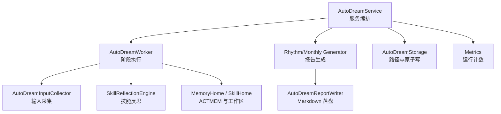
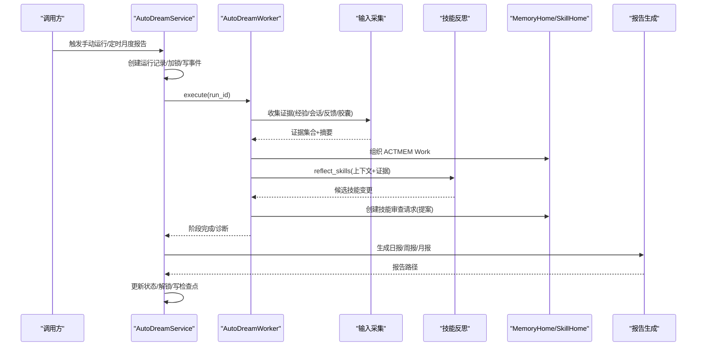
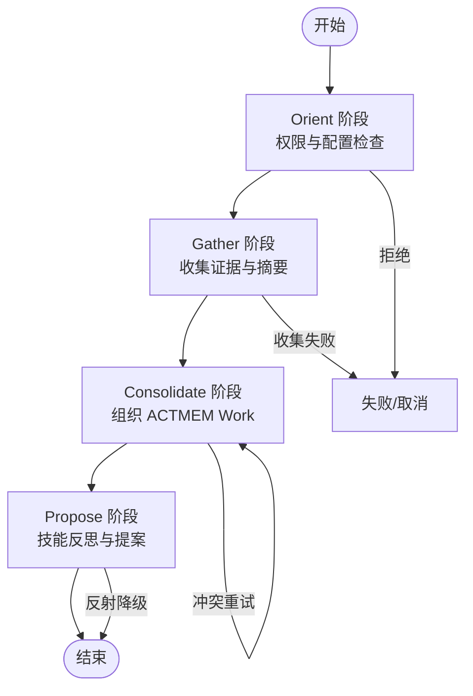
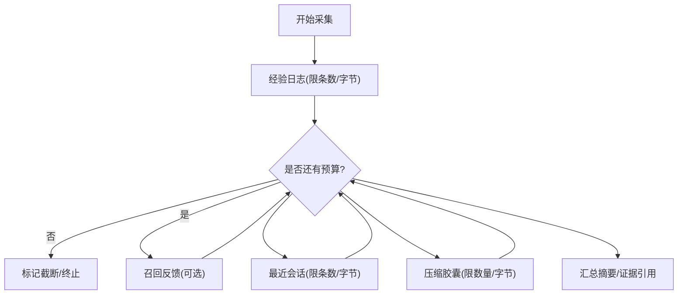
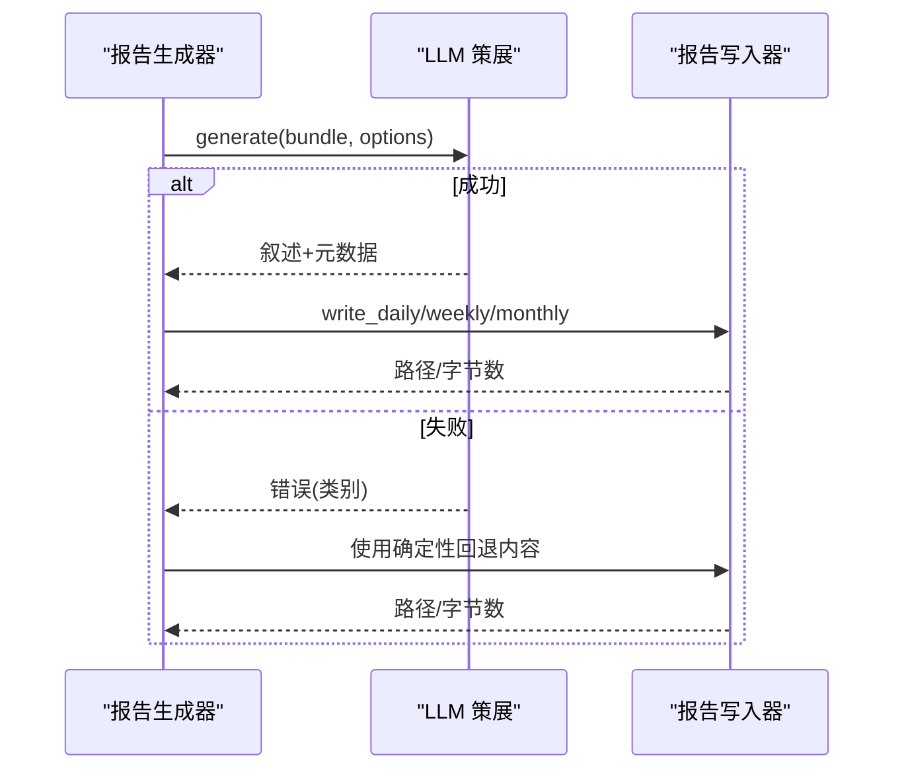
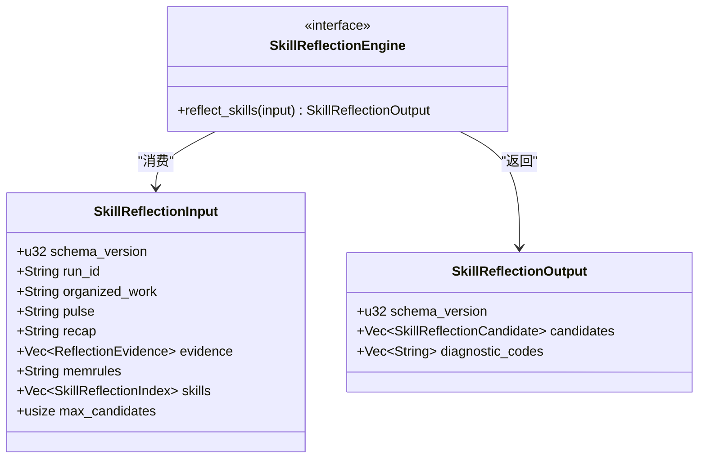
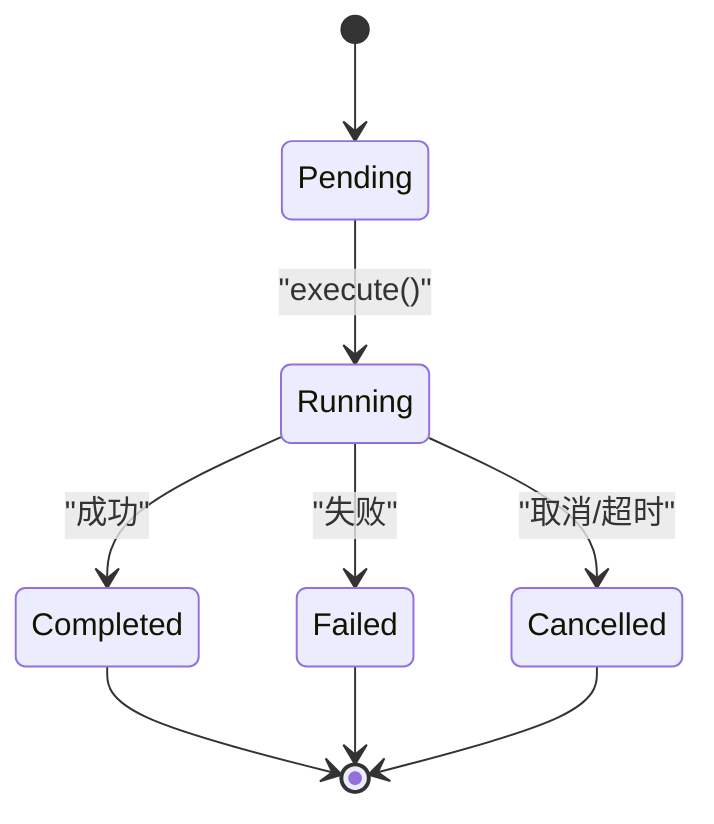
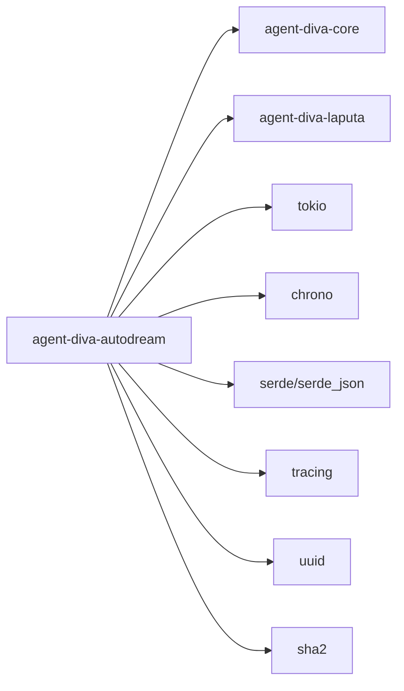

# Autodream 自动蒸馏集成

<cite>
**本文引用的文件**
- [lib.rs](file://agent-diva-autodream/src/lib.rs)
- [Cargo.toml](file://agent-diva-autodream/Cargo.toml)
- [agents.md](file://agent-diva-autodream/agents.md)
- [service.rs](file://agent-diva-autodream/src/service.rs)
- [worker.rs](file://agent-diva-autodream/src/worker.rs)
- [reflection.rs](file://agent-diva-autodream/src/reflection.rs)
- [curation.rs](file://agent-diva-autodream/src/curation.rs)
- [inputs.rs](file://agent-diva-autodream/src/inputs.rs)
- [metrics.rs](file://agent-diva-autodream/src/metrics.rs)
- [reports.rs](file://agent-diva-autodream/src/reports.rs)
- [rhythm.rs](file://agent-diva-autodream/src/rhythm.rs)
- [layout.rs](file://agent-diva-autodream/src/layout.rs)
- [diagnostics.rs](file://agent-diva-autodream/src/diagnostics.rs)
- [error.rs](file://agent-diva-autodream/src/error.rs)
</cite>

## 目录
1. [简介](#简介)
2. [项目结构](#项目结构)
3. [核心组件](#核心组件)
4. [架构总览](#架构总览)
5. [详细组件分析](#详细组件分析)
6. [依赖关系分析](#依赖关系分析)
7. [性能与资源限制](#性能与资源限制)
8. [监控、日志与故障排除](#监控日志与故障排除)
9. [部署与运维指南](#部署与运维指南)
10. [开发者接口与自定义策略](#开发者接口与自定义策略)
11. [结论](#结论)

## 简介
本文件面向运维与开发者，系统性说明 Agent Diva 的 Autodream（自动蒸馏）能力：从记忆内容的自动采集与分析、摘要生成与质量评估，到策展（Curation）、反思（Reflection）与报告输出；并覆盖服务编排、任务调度、批处理、状态管理、配置调优、与记忆系统的集成、监控指标与日志、以及故障排查。Autodream 以“文件优先”的方式持久化运行记录与事件，通过 Laputa 治理边界提交提案，不直接写入权威记忆文件。

## 项目结构
autodream 子模块提供自动蒸馏的运行生命周期：输入收集、工作组织、技能反思、报告生成与指标记录。关键文件职责如下：
- 入口与导出：lib.rs
- 服务编排与触发：service.rs
- 工作器与阶段编排：worker.rs
- 输入采集与预算控制：inputs.rs
- 技能反思接口与数据模型：reflection.rs
- LLM 策展与报告渲染：curation.rs, reports.rs, rhythm.rs
- 存储布局与迁移：layout.rs
- 诊断与结构化事件：diagnostics.rs
- 错误类型：error.rs
- 指标：metrics.rs

图表来源
- [service.rs:124-200](file://agent-diva-autodream/src/service.rs#L124-L200)
- [worker.rs:152-210](file://agent-diva-autodream/src/worker.rs#L152-L210)
- [inputs.rs:75-151](file://agent-diva-autodream/src/inputs.rs#L75-L151)
- [reflection.rs:64-70](file://agent-diva-autodream/src/reflection.rs#L64-L70)
- [rhythm.rs:16-41](file://agent-diva-autodream/src/rhythm.rs#L16-L41)
- [reports.rs:76-137](file://agent-diva-autodream/src/reports.rs#L76-L137)
- [layout.rs:114-143](file://agent-diva-autodream/src/layout.rs#L114-L143)
- [metrics.rs:3-44](file://agent-diva-autodream/src/metrics.rs#L3-L44)

章节来源
- [lib.rs:1-43](file://agent-diva-autodream/src/lib.rs#L1-L43)
- [agents.md:1-37](file://agent-diva-autodream/agents.md#L1-L37)

## 核心组件
- AutoDreamService：负责手动/定时触发运行、锁与检查点、事件追加、报告触发与重试、月度报告调度等。
- AutoDreamWorker：按阶段（Orient/Gather/Consolidate/Propose）执行蒸馏流程，维护阶段状态与诊断，产出提案或组织 ACTMEM Work。
- AutoDreamInputCollector：按优先级与字节预算从经验日志、会话、召回反馈、压缩胶囊中采集证据，生成可追踪的证据引用。
- SkillReflectionEngine：抽象的技能反思提供者，接收组织后的上下文与证据，返回候选技能变更请求。
- Rhythm/Monthly 报告生成：基于事实包与可选 LLM 叙事生成 Markdown 报告，支持回退到确定性渲染。
- AutoDreamStorage/Layout：统一的路径管理与原子写入，包含锁、检查点、事件日志、运行记录、报告目录与迁移逻辑。
- Metrics/Diagnostics/Error：进程内指标、结构化诊断事件与错误类型。

章节来源
- [service.rs:124-200](file://agent-diva-autodream/src/service.rs#L124-L200)
- [worker.rs:152-210](file://agent-diva-autodream/src/worker.rs#L152-L210)
- [inputs.rs:75-151](file://agent-diva-autodream/src/inputs.rs#L75-L151)
- [reflection.rs:64-70](file://agent-diva-autodream/src/reflection.rs#L64-L70)
- [rhythm.rs:16-41](file://agent-diva-autodream/src/rhythm.rs#L16-L41)
- [reports.rs:76-137](file://agent-diva-autodream/src/reports.rs#L76-L137)
- [layout.rs:114-143](file://agent-diva-autodream/src/layout.rs#L114-L143)
- [metrics.rs:3-44](file://agent-diva-autodream/src/metrics.rs#L3-L44)
- [diagnostics.rs:11-79](file://agent-diva-autodream/src/diagnostics.rs#L11-L79)
- [error.rs:9-41](file://agent-diva-autodream/src/error.rs#L9-L41)

## 架构总览
Autodream 采用“服务 + 工作器 + 报告生成器”的分层架构：
- 服务层：暴露触发、查询、取消、月度报告调度等 API，管理锁、检查点与事件。
- 工作器层：按阶段执行，读取/写入 ACTMEM 与工作区，调用技能反思引擎，产出提案。
- 报告层：聚合会话/日报/周报/月报，结合 LLM 策展或确定性回退，输出 Markdown。

图表来源
- [service.rs:202-255](file://agent-diva-autodream/src/service.rs#L202-L255)
- [worker.rs:199-375](file://agent-diva-autodream/src/worker.rs#L199-L375)
- [inputs.rs:94-151](file://agent-diva-autodream/src/inputs.rs#L94-L151)
- [reflection.rs:64-70](file://agent-diva-autodream/src/reflection.rs#L64-L70)
- [rhythm.rs:135-150](file://agent-diva-autodream/src/rhythm.rs#L135-L150)

## 详细组件分析

### 自动蒸馏流程（工作器）
- 阶段定义：Orient（准备/权限校验）、Gather（收集输入）、Consolidate（组织 ACTMEM Work）、Propose（技能反思与提案）。
- 状态机：每个阶段有 Pending/Running/Succeeded/Failed/Cancelled/TimedOut，并在运行记录中推进编排阶段。
- 失败码映射：根据诊断信息推断具体失败原因（如输入不可用、提供者超时/失败、无效候选等）。

图表来源
- [worker.rs:25-67](file://agent-diva-autodream/src/worker.rs#L25-L67)
- [worker.rs:214-375](file://agent-diva-autodream/src/worker.rs#L214-L375)
- [worker.rs:510-565](file://agent-diva-autodream/src/worker.rs#L510-L565)
- [worker.rs:745-795](file://agent-diva-autodream/src/worker.rs#L745-L795)

章节来源
- [worker.rs:199-375](file://agent-diva-autodream/src/worker.rs#L199-L375)
- [worker.rs:510-565](file://agent-diva-autodream/src/worker.rs#L510-L565)
- [worker.rs:745-795](file://agent-diva-autodream/src/worker.rs#L745-L795)

### 输入采集与预算控制
- 数据来源优先级：经验日志 > 召回反馈 > 最近会话 > 压缩胶囊。
- 预算控制：按 total_bytes_budget 逐项截断或丢弃，记录 truncated 与 omissions。
- 证据引用：为每项生成唯一 EvidenceRef（含 id、source、uri、excerpt、hash），便于溯源。

图表来源
- [inputs.rs:94-151](file://agent-diva-autodream/src/inputs.rs#L94-L151)
- [inputs.rs:417-462](file://agent-diva-autodream/src/inputs.rs#L417-L462)
- [inputs.rs:489-505](file://agent-diva-autodream/src/inputs.rs#L489-L505)

章节来源
- [inputs.rs:94-151](file://agent-diva-autodream/src/inputs.rs#L94-L151)
- [inputs.rs:417-462](file://agent-diva-autodream/src/inputs.rs#L417-L462)
- [inputs.rs:489-505](file://agent-diva-autodream/src/inputs.rs#L489-L505)

### 策展（Curation）与报告生成
- 叙事生成：若启用 LLM 策展，则尝试生成叙述；失败时回退到确定性渲染。
- 内容组装：将渲染结果转换为 RhythmReportContent，包含标题、摘要、分节、证据引用与元数据。
- 月度报告：按月份键判断是否已生成或处于窗口期，避免重复与越界触发。

图表来源
- [curation.rs:14-52](file://agent-diva-autodream/src/curation.rs#L14-L52)
- [curation.rs:58-84](file://agent-diva-autodream/src/curation.rs#L58-L84)
- [reports.rs:86-137](file://agent-diva-autodream/src/reports.rs#L86-L137)
- [rhythm.rs:43-62](file://agent-diva-autodream/src/rhythm.rs#L43-L62)
- [rhythm.rs:64-133](file://agent-diva-autodream/src/rhythm.rs#L64-L133)

章节来源
- [curation.rs:14-84](file://agent-diva-autodream/src/curation.rs#L14-L84)
- [reports.rs:86-137](file://agent-diva-autodream/src/reports.rs#L86-L137)
- [rhythm.rs:43-133](file://agent-diva-autodream/src/rhythm.rs#L43-L133)

### 反思（Reflection）与技能提案
- 输入约束：严格 schema_version、run_id、组织后的上下文、证据、现有技能索引等。
- 输出约束：schema_version、候选列表、诊断代码；超出上限或非法 schema 视为失败。
- 提案边界：仅创建技能审查请求（提案），不直接修改权威记忆文件。

图表来源
- [reflection.rs:6-62](file://agent-diva-autodream/src/reflection.rs#L6-L62)
- [worker.rs:377-508](file://agent-diva-autodream/src/worker.rs#L377-L508)

章节来源
- [reflection.rs:6-62](file://agent-diva-autodream/src/reflection.rs#L6-L62)
- [worker.rs:377-508](file://agent-diva-autodream/src/worker.rs#L377-L508)

### 服务编排与状态管理
- 运行生命周期：Pending → Running → Completed/Failed/Cancelled，带编排阶段与截止时间。
- 锁机制：文件级锁防止并发运行；支持过期恢复与清理。
- 事件流：JSONL 追加事件，支持按 run_id 过滤与分页。
- 月度报告：按月份键去重与窗口判断，必要时触发新的运行。

图表来源
- [service.rs:202-255](file://agent-diva-autodream/src/service.rs#L202-L255)
- [service.rs:656-705](file://agent-diva-autodream/src/service.rs#L656-L705)
- [service.rs:491-526](file://agent-diva-autodream/src/service.rs#L491-L526)
- [worker.rs:567-594](file://agent-diva-autodream/src/worker.rs#L567-L594)

章节来源
- [service.rs:202-255](file://agent-diva-autodream/src/service.rs#L202-L255)
- [service.rs:656-705](file://agent-diva-autodream/src/service.rs#L656-L705)
- [service.rs:491-526](file://agent-diva-autodream/src/service.rs#L491-L526)
- [worker.rs:567-594](file://agent-diva-autodream/src/worker.rs#L567-L594)

## 依赖关系分析
- 内部依赖：core（配置、报告、会话、经验日志）、laputa（MemoryHome、SkillHome、ACTMEM 读写）。
- 外部依赖：tokio、chrono、serde、tracing、uuid、sha2 等。
- 耦合点：
  - Worker 强依赖 MemoryHome/SkillHome 进行 ACTMEM 组织与提案创建。
  - 报告生成依赖 core 的报告构建与可选 LLM 叙事生成器。
  - 输入采集依赖 session/experience/recall-feedback 存储。

图表来源
- [Cargo.toml:11-23](file://agent-diva-autodream/Cargo.toml#L11-L23)

章节来源
- [Cargo.toml:11-23](file://agent-diva-autodream/Cargo.toml#L11-L23)

## 性能与资源限制
- 输入预算：可通过 AutoDreamInputCollectorConfig 控制各来源的条目数与字节上限，以及总字节预算，避免过大上下文。
- 反射候选上限：SkillReflectionInput.max_candidates 限制候选数量，防止过度提案。
- 报告裁剪：证据引用与摘录长度受限，确保报告体积可控。
- 重试与超时：报告生成支持有限重试；工作器阶段设置截止时间，避免长时间阻塞。

章节来源
- [inputs.rs:34-57](file://agent-diva-autodream/src/inputs.rs#L34-L57)
- [inputs.rs:417-462](file://agent-diva-autodream/src/inputs.rs#L417-L462)
- [reflection.rs:31-43](file://agent-diva-autodream/src/reflection.rs#L31-L43)
- [reports.rs:10-11](file://agent-diva-autodream/src/reports.rs#L10-L11)
- [worker.rs:137-150](file://agent-diva-autodream/src/worker.rs#L137-L150)

## 监控、日志与故障排除
- 指标：AutoDreamMetrics 提供运行总数与失败总数的快照，用于监控面板或告警。
- 事件：events.jsonl 记录阶段、输入摘要、门控拒绝、提案 ID 与失败码，可按 run_id 过滤。
- 诊断：Diagnostic 将结构化信息同时写入 tracing 与 JSONL，便于集中式日志系统检索。
- 常见故障：
  - 输入不可用：检查经验日志、会话、召回反馈与胶囊是否存在且可读。
  - 提供者不可用/超时：确认 SkillReflectionEngine 与 LLM 叙事生成器可用性与超时配置。
  - 报告生成失败：查看 curation 回退原因与重试次数。
  - 锁冲突：检查 lock 文件与 stale 恢复逻辑。

章节来源
- [metrics.rs:3-44](file://agent-diva-autodream/src/metrics.rs#L3-L44)
- [diagnostics.rs:11-79](file://agent-diva-autodream/src/diagnostics.rs#L11-L79)
- [diagnostics.rs:99-113](file://agent-diva-autodream/src/diagnostics.rs#L99-L113)
- [service.rs:264-286](file://agent-diva-autodream/src/service.rs#L264-L286)
- [curation.rs:14-52](file://agent-diva-autodream/src/curation.rs#L14-L52)

## 部署与运维指南
- 启动与服务装配：
  - 通过 AutoDreamService::open 或 from_storage 打开存储，注入叙事生成器、技能反思引擎、MemoryHome/SkillHome。
  - 配置 LLM 策展参数（语言、最大输出 token、超时）。
- 任务调度：
  - 手动触发：trigger_manual_run，传入 trigger 标识。
  - 定时月度报告：execute_scheduled_monthly_report，按月键去重与窗口判断。
- 状态与恢复：
  - 检查点：checkpoint 记录上次完成运行与时间。
  - 锁恢复：recover_stale_lock_if_needed 在锁过期或进程不一致时恢复中断运行。
- 文件布局：
  - .agent-diva/autodream：锁、检查点、事件、运行记录。
  - .laputa/reports：日报/周报/月报 Markdown。
  - sessions、compact/capsules：输入源。

章节来源
- [service.rs:150-200](file://agent-diva-autodream/src/service.rs#L150-L200)
- [service.rs:202-255](file://agent-diva-autodream/src/service.rs#L202-L255)
- [service.rs:491-526](file://agent-diva-autodream/src/service.rs#L491-L526)
- [service.rs:656-705](file://agent-diva-autodream/src/service.rs#L656-L705)
- [layout.rs:114-143](file://agent-diva-autodream/src/layout.rs#L114-L143)
- [layout.rs:146-183](file://agent-diva-autodream/src/layout.rs#L146-L183)

## 开发者接口与自定义策略
- 自定义输入采集：实现 AutoDreamInputCollectorConfig 调整来源优先级与预算；扩展 collect_* 方法。
- 自定义技能反思：实现 SkillReflectionEngine 接口，接收 SkillReflectionInput，返回 SkillReflectionOutput。
- 自定义报告策展：实现 ReportNarrativeGenerator，配合 LlmCurationConfig 控制语言与 token 限制。
- 安全与权限：通过 AutoDreamRestrictedProfile 限制工作器可执行动作（读会话、读 Laputa API、写输出、创建提案等）。

章节来源
- [inputs.rs:34-57](file://agent-diva-autodream/src/inputs.rs#L34-L57)
- [reflection.rs:64-70](file://agent-diva-autodream/src/reflection.rs#L64-L70)
- [curation.rs:14-52](file://agent-diva-autodream/src/curation.rs#L14-L52)
- [worker.rs:82-117](file://agent-diva-autodream/src/worker.rs#L82-L117)

## 结论
Autodream 提供了完整的自动蒸馏流水线：从多源输入采集与预算控制，到 ACTMEM 工作组织与技能反思提案，再到报告生成与指标记录。其“文件优先”的设计确保了可观测性与可恢复性，并通过 Laputa 治理边界保证权威数据的变更受控。运维人员可据此进行部署、监控与排障；开发者可通过接口扩展输入采集、反思策略与报告策展，满足多样化需求。