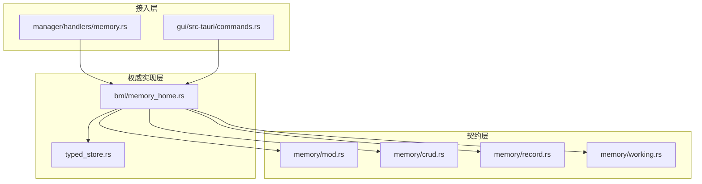
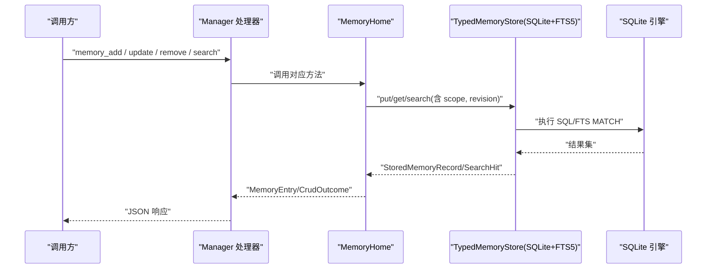
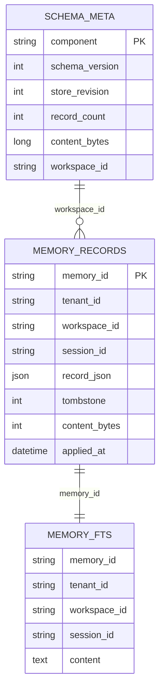
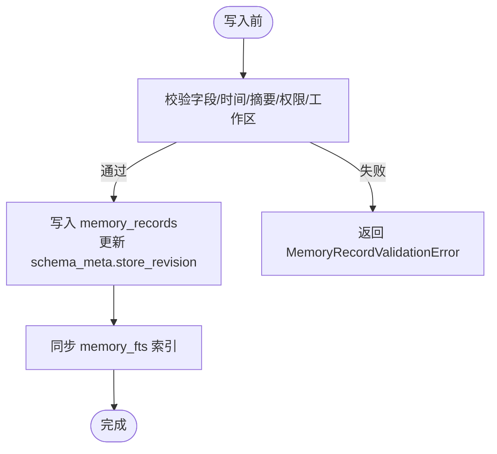
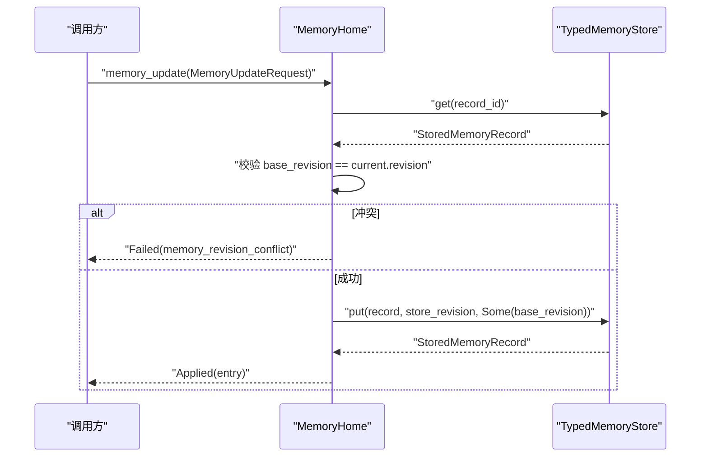
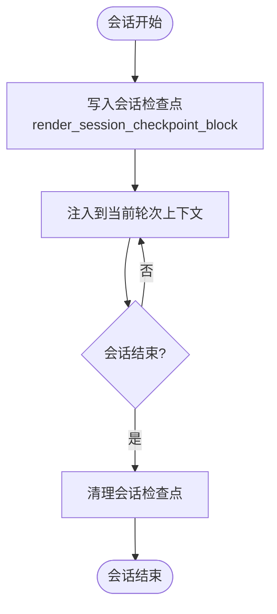
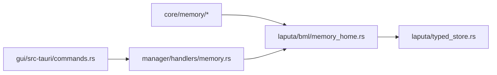

# BML 基础记忆层

<cite>
**本文引用的文件**
- [memory_home.rs](file://agent-diva-laputa/src/bml/memory_home.rs)
- [typed_store.rs](file://agent-diva-laputa/src/typed_store.rs)
- [mod.rs（memory 模块）](file://agent-diva-core/src/memory/mod.rs)
- [crud.rs](file://agent-diva-core/src/memory/crud.rs)
- [record.rs](file://agent-diva-core/src/memory/record.rs)
- [working.rs](file://agent-diva-core/src/memory/working.rs)
- [memory.rs（管理器处理器）](file://agent-diva-manager/src/handlers/memory.rs)
- [commands.rs（Tauri 命令）](file://agent-diva-gui/src-tauri/src/commands.rs)
</cite>

## 目录
1. [简介](#简介)
2. [项目结构](#项目结构)
3. [核心组件](#核心组件)
4. [架构总览](#架构总览)
5. [详细组件分析](#详细组件分析)
6. [依赖关系分析](#依赖关系分析)
7. [性能与调优](#性能与调优)
8. [故障排查指南](#故障排查指南)
9. [结论](#结论)
10. [附录：API 与使用示例](#附录api-与使用示例)

## 简介
本文件面向开发者，系统化说明 BML（Base Memory Layer，基础记忆层）的存储架构、数据模型、CRUD 操作、工作记忆与会话检查点机制，以及基于 SQLite + FTS5 的索引策略与查询优化。BML 提供跨 Manager、Agent、AutoDream 共享的机器级记忆权威，通过 TypedMemoryStore 将 MemoryRecord 持久化到 SQLite，并使用 FTS5 虚拟表实现全文检索；同时维护会话级的工作记忆检查点，支持启动时 L1 索引注入与按需检索。

## 项目结构
BML 由三层组成：
- 接口与契约层（agent-diva-core/memory）：定义 MemoryRecord、CRUD 请求/响应、工作记忆检查点等稳定契约。
- 权威实现层（agent-diva-laputa/bml + typed_store）：MemoryHome 暴露统一 API，TypedMemoryStore 封装 SQLite + FTS5 的读写、事务、版本与完整性校验。
- 接入层（manager、gui）：HTTP/Tauri 命令将上层调用路由到 MemoryHome。

图表来源
- [memory_home.rs:1-125](file://agent-diva-laputa/src/bml/memory_home.rs#L1-L125)
- [typed_store.rs:532-548](file://agent-diva-laputa/src/typed_store.rs#L532-L548)
- [mod.rs（memory 模块）:1-47](file://agent-diva-core/src/memory/mod.rs#L1-L47)

章节来源
- [memory_home.rs:1-125](file://agent-diva-laputa/src/bml/memory_home.rs#L1-L125)
- [mod.rs（memory 模块）:1-47](file://agent-diva-core/src/memory/mod.rs#L1-L47)

## 核心组件
- MemoryHome：机器级记忆权威入口，负责数据库懒加载、记录增删改查、搜索、系统提示 L1 索引刷新、会话检查点写入与清理。
- TypedMemoryStore：SQLite 存储抽象，管理 schema_meta、memory_records、memory_fts（FTS5）、事务、revision、tombstone、scope 过滤、备份与完整性检查。
- MemoryRecord：稳定的 v2 记录模型，包含身份、内容、溯源、证据、置信度、敏感度、信任等级、作用域、时间戳、覆盖链与墓碑标记。
- CRUD 契约：MemoryAddRequest/MemoryUpdateRequest/MemoryRemoveRequest/MemorySearchRequest/MemoryListRequest/MemoryGetRequest 及 MemoryCrudOutcome。
- 工作记忆：SessionCheckpointWriteRequest/SessionCheckpointResponse，用于会话内临时状态注入与清理。

章节来源
- [memory_home.rs:85-177](file://agent-diva-laputa/src/bml/memory_home.rs#L85-L177)
- [typed_store.rs:78-98](file://agent-diva-laputa/src/typed_store.rs#L78-L98)
- [record.rs:103-120](file://agent-diva-core/src/memory/record.rs#L103-L120)
- [crud.rs:11-67](file://agent-diva-core/src/memory/crud.rs#L11-L67)
- [working.rs:20-52](file://agent-diva-core/src/memory/working.rs#L20-L52)

## 架构总览
BML 以 MemoryProvider 为对外契约，MemoryHome 作为实现，底层通过 TypedMemoryStore 访问 SQLite。FTS5 虚拟表对 memory_records 建立全文索引，支持按 tenant/workspace/session 范围过滤与 BM25 排序。系统启动时生成 L1 索引块并注入系统提示，完整条目通过 memory_search/list 按需获取。

图表来源
- [memory_home.rs:583-710](file://agent-diva-laputa/src/bml/memory_home.rs#L583-L710)
- [typed_store.rs:1119-1147](file://agent-diva-laputa/src/typed_store.rs#L1119-L1147)
- [memory.rs（管理器处理器）:188-230](file://agent-diva-manager/src/handlers/memory.rs#L188-L230)

## 详细组件分析

### 存储架构：SQLite + FTS5
- 主表 memory_records：保存每条记录的 JSON 序列化体、元数据（tenant/workspace/session）、墓碑标记、内容字节数、应用时间等。
- 虚拟表 memory_fts：基于 FTS5 创建，content 列参与倒排索引，tokenize='unicode61'；UNINDEXED 列用于精确过滤 tenant_id/workspace_id/session_id。
- 元数据 schema_meta：记录 schema_version、store_revision、workspace_id、record_count、content_bytes 等。
- 事务与一致性：所有写操作在事务中提交，更新 store_revision；读路径先尝试复用已打开的 store，避免重复初始化。

图表来源
- [typed_store.rs:532-548](file://agent-diva-laputa/src/typed_store.rs#L532-L548)
- [typed_store.rs:1119-1147](file://agent-diva-laputa/src/typed_store.rs#L1119-L1147)

章节来源
- [typed_store.rs:532-548](file://agent-diva-laputa/src/typed_store.rs#L532-L548)
- [typed_store.rs:1119-1147](file://agent-diva-laputa/src/typed_store.rs#L1119-L1147)

### 数据模型：MemoryRecord
- 关键字段：id、kind、content、provenance、evidence_refs、confidence_bps、sensitivity、trust、scope、created_at/effective_at/expires_at、supersedes、tombstone。
- 验证规则：必填字段校验、digest 匹配、时间窗口（时钟偏差）、有效期顺序、自覆盖禁止、墓碑约束、权限来源限制、工作区隔离等。
- 生命周期：创建→生效→可选过期→可被墓碑标记→可见性过滤（tombstone/superseded）。

图表来源
- [record.rs:193-288](file://agent-diva-core/src/memory/record.rs#L193-L288)
- [typed_store.rs:1108-1117](file://agent-diva-laputa/src/typed_store.rs#L1108-L1117)

章节来源
- [record.rs:193-288](file://agent-diva-core/src/memory/record.rs#L193-L288)

### CRUD 操作与请求类型
- MemoryAddRequest：新增长期记忆，自动计算内容摘要与 ID，写入后刷新 L1 索引。
- MemoryUpdateRequest：CAS 更新，要求 base_revision 与当前一致，否则返回冲突。
- MemoryRemoveRequest：软删除，写入墓碑记录，目标记录仍保留但不可见。
- MemorySearchRequest/MemoryListRequest/MemoryGetRequest：检索、列表、按 ID 获取，均受 scope 与可见性过滤。
- 统一返回 MemoryCrudOutcome：Applied/Listed/Failed，失败携带稳定 reason。

图表来源
- [memory_home.rs:238-282](file://agent-diva-laputa/src/bml/memory_home.rs#L238-L282)
- [crud.rs:44-67](file://agent-diva-core/src/memory/crud.rs#L44-L67)

章节来源
- [memory_home.rs:583-710](file://agent-diva-laputa/src/bml/memory_home.rs#L583-L710)
- [crud.rs:11-127](file://agent-diva-core/src/memory/crud.rs#L11-L127)

### 工作记忆与会话检查点
- 工作记忆是会话级、易失性的上下文片段，不进入长期权威。
- SessionCheckpointWriteRequest：包含 session_id、key_info、related_sops、content，渲染为结构化 Markdown 块注入到对话上下文。
- 检查点写入会设置 scope.session_id，便于后续按会话清理或 GC。
- 会话结束可通过 clear_session_checkpoint/gc_stale_session_scoped 清理。

图表来源
- [working.rs:20-76](file://agent-diva-core/src/memory/working.rs#L20-L76)
- [memory_home.rs:439-491](file://agent-diva-laputa/src/bml/memory_home.rs#L439-L491)

章节来源
- [working.rs:20-76](file://agent-diva-core/src/memory/working.rs#L20-L76)
- [memory_home.rs:374-392](file://agent-diva-laputa/src/bml/memory_home.rs#L374-L392)

### 启动 L1 索引与系统提示注入
- 启动时根据最近 N 条记录生成紧凑索引块，仅包含 id 与首行预览，避免注入完整内容。
- 当索引变化时，提升 system_prompt 的 authority_revision，供上层缓存失效。
- 若无数据库或无记录，则仅注入 MEMRULES 指针。

章节来源
- [memory_home.rs:394-418](file://agent-diva-laputa/src/bml/memory_home.rs#L394-L418)
- [memory_home.rs:494-532](file://agent-diva-laputa/src/bml/memory_home.rs#L494-L532)

## 依赖关系分析
- MemoryHome 依赖 TypedMemoryStore 进行持久化；依赖 actmem 管理活动记忆；依赖 core/memory 契约。
- Manager 处理器将 HTTP 请求映射到 MemoryHome；GUI Tauri 命令通过 HTTP 调用后端。
- 错误码与状态码映射清晰，如 revision conflict → CONFLICT，not found → NOT_FOUND。

图表来源
- [memory_home.rs:9-33](file://agent-diva-laputa/src/bml/memory_home.rs#L9-L33)
- [memory.rs（管理器处理器）:188-230](file://agent-diva-manager/src/handlers/memory.rs#L188-L230)
- [commands.rs（Tauri 命令）:948-1000](file://agent-diva-gui/src-tauri/src/commands.rs#L948-L1000)

章节来源
- [memory_home.rs:9-33](file://agent-diva-laputa/src/bml/memory_home.rs#L9-L33)
- [memory.rs（管理器处理器）:188-230](file://agent-diva-manager/src/handlers/memory.rs#L188-L230)
- [commands.rs（Tauri 命令）:948-1000](file://agent-diva-gui/src-tauri/src/commands.rs#L948-L1000)

## 性能与调优
- 连接与初始化
  - 使用懒加载 store：首次写或需要时才打开数据库，避免空库开销。
  - 复用已打开的 store 引用，减少重复初始化成本。
- FTS5 索引
  - 使用 tokenize='unicode61'，兼顾中英文分词；MATCH + bm25() 排序，结合 UNINDEXED 列做精确过滤。
  - 控制 limit 避免大结果集；search_visible 仅返回可见记录。
- 事务与批处理
  - 写操作在事务中提交，确保 schema_meta.store_revision 与记录一致。
  - 批量导入/迁移建议分批提交，避免长事务锁竞争。
- 启动索引预算
  - 通过 l1_index_lines 控制注入行数，默认值较小，避免系统提示膨胀。
- 备份与恢复
  - 支持 VACUUM INTO 快照，便于离线备份与审计。

[本节为通用指导，不直接分析具体代码文件]

## 故障排查指南
- 常见错误与定位
  - bml_unavailable：存储不可用，检查数据库文件是否存在、权限与 FTS5 可用性。
  - memory_revision_conflict：并发更新冲突，客户端需重试并传入最新 base_revision。
  - memory_not_found：记录不存在或被墓碑标记，确认 scope 与可见性。
  - memory_invalid_request：参数为空或非法，检查 content/reason/base_revision 等。
  - memory_kind_forbidden：生产环境仅允许 LongTerm 写入。
  - memory_io_error：文件系统 I/O 失败，检查路径与磁盘空间。
- 调试步骤
  - 查看 schema_meta 与 memory_records 计数是否合理。
  - 检查 memory_fts 行数是否与 records 一致，必要时重建索引。
  - 使用 integrity 检查报告定位损坏记录或孤儿 FTS 行。

章节来源
- [memory_home.rs:39-70](file://agent-diva-laputa/src/bml/memory_home.rs#L39-L70)
- [memory_home.rs:238-345](file://agent-diva-laputa/src/bml/memory_home.rs#L238-L345)
- [typed_store.rs:1242-1269](file://agent-diva-laputa/src/typed_store.rs#L1242-L1269)

## 结论
BML 通过稳定的契约与清晰的层次划分，将长期记忆与工作记忆解耦，并以 SQLite + FTS5 提供高效、可审计、可扩展的存储能力。其 CAS 更新、墓碑机制、scope 过滤与 L1 索引注入共同构成了可靠的记忆权威。对于扩展新存储后端，应遵循 MemoryProvider 契约与 TypedMemoryStore 的语义约定，保持事务、revision、scope 与可见性的一致性。

[本节为总结，不直接分析具体代码文件]

## 附录：API 与使用示例
以下示例展示如何通过 Manager 提供的 HTTP 接口与 Tauri 命令调用 BML。为避免泄露内部实现细节，此处仅提供调用路径与关键参数说明，具体实现请参考对应文件。

- 添加记忆
  - 接口：POST /memory/add
  - 请求体：MemoryAddRequest
    - content：要记住的内容
    - evidence_refs：可选的证据引用
  - 参考路径
    - [memory_home.rs:583-605](file://agent-diva-laputa/src/bml/memory_home.rs#L583-L605)
    - [crud.rs:11-19](file://agent-diva-core/src/memory/crud.rs#L11-L19)

- 更新记忆
  - 接口：PUT /memory/update
  - 请求体：MemoryUpdateRequest
    - record_id：目标记录 ID
    - content：替换后的内容
    - base_revision：期望的版本号（CAS）
    - evidence_refs：可选的证据引用
  - 参考路径
    - [memory_home.rs:665-689](file://agent-diva-laputa/src/bml/memory_home.rs#L665-L689)
    - [crud.rs:44-56](file://agent-diva-core/src/memory/crud.rs#L44-L56)

- 删除记忆
  - 接口：DELETE /memory/remove
  - 请求体：MemoryRemoveRequest
    - record_id：目标记录 ID
    - reason：删除原因
    - base_revision：期望的版本号（CAS）
  - 参考路径
    - [memory_home.rs:691-710](file://agent-diva-laputa/src/bml/memory_home.rs#L691-L710)
    - [crud.rs:58-67](file://agent-diva-core/src/memory/crud.rs#L58-L67)

- 搜索记忆
  - 接口：POST /memory/search
  - 请求体：MemorySearchRequest
    - query：自由文本查询
    - limit：最大返回条数
  - 参考路径
    - [memory_home.rs:640-663](file://agent-diva-laputa/src/bml/memory_home.rs#L640-L663)
    - [crud.rs:35-42](file://agent-diva-core/src/memory/crud.rs#L35-L42)

- 列出记忆
  - 接口：POST /memory/list
  - 请求体：MemoryListRequest
    - limit：最大返回条数
  - 参考路径
    - [memory_home.rs:607-620](file://agent-diva-laputa/src/bml/memory_home.rs#L607-L620)
    - [crud.rs:21-26](file://agent-diva-core/src/memory/crud.rs#L21-L26)

- 获取单条记忆
  - 接口：POST /memory/get
  - 请求体：MemoryGetRequest
    - record_id：目标记录 ID
  - 参考路径
    - [memory_home.rs:622-638](file://agent-diva-laputa/src/bml/memory_home.rs#L622-L638)
    - [crud.rs:28-33](file://agent-diva-core/src/memory/crud.rs#L28-L33)

- 会话检查点写入
  - 接口：POST /memory/actmem/checkpoint
  - 请求体：SessionCheckpointWriteRequest
    - session_id：会话键
    - key_info：关键信息
    - related_sops：相关 SOP
    - content：检查点内容
  - 参考路径
    - [memory_home.rs:439-491](file://agent-diva-laputa/src/bml/memory_home.rs#L439-L491)
    - [working.rs:36-52](file://agent-diva-core/src/memory/working.rs#L36-L52)

- GUI 侧调用示例（Tauri 命令）
  - 读取/写入 MEMRULES、获取胶囊等
  - 参考路径
    - [commands.rs（Tauri 命令）:948-1000](file://agent-diva-gui/src-tauri/src/commands.rs#L948-L1000)

章节来源
- [memory_home.rs:583-710](file://agent-diva-laputa/src/bml/memory_home.rs#L583-L710)
- [crud.rs:11-67](file://agent-diva-core/src/memory/crud.rs#L11-L67)
- [working.rs:36-52](file://agent-diva-core/src/memory/working.rs#L36-L52)
- [commands.rs（Tauri 命令）:948-1000](file://agent-diva-gui/src-tauri/src/commands.rs#L948-L1000)